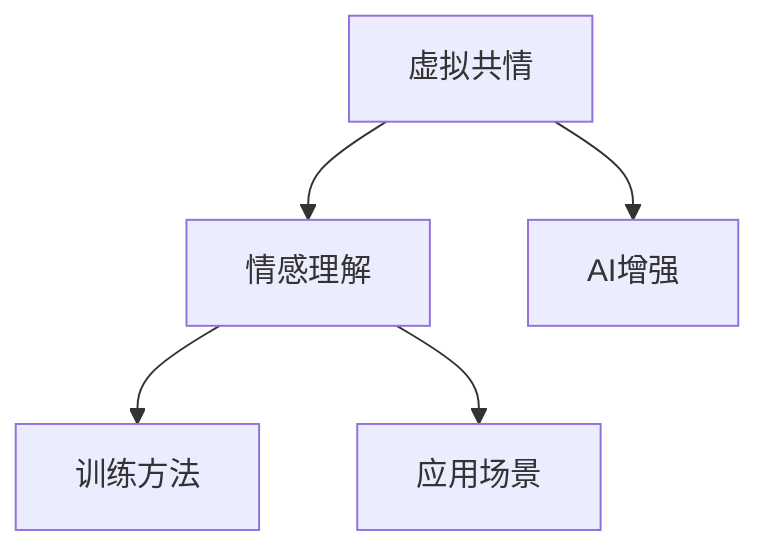

                 

# 虚拟共情能力培养：AI增强的情感理解训练

> 关键词：虚拟共情、情感理解、AI增强、训练方法、应用场景

## 1. 背景介绍

### 1.1 问题由来
在当今社会，人类面临的挑战日益复杂，个体之间的情感交流也变得更为困难。如何培养个体更加丰富的情感理解能力，提升其虚拟共情能力，成为了一个亟需解决的问题。传统的人类情感教育方法往往依赖于面对面的交流和实践，效率低下，难以应对快速变化的社会需求。而人工智能技术，特别是深度学习在自然语言处理(NLP)领域的突破，为情感理解和虚拟共情能力的培养提供了新的可能。

### 1.2 问题核心关键点
虚拟共情能力培养的核心关键点在于通过人工智能技术，模拟和增强人类情感表达和理解的能力。这包括：
- 理解自然语言中的情感信息
- 生成能够引发共情的虚拟角色对话
- 训练个体识别和理解虚拟角色的情感变化
- 应用到教育、心理辅导、客户服务等实际场景

本文将探讨如何利用AI增强的情感理解训练方法，培养个体的虚拟共情能力，并通过具体的案例和实际应用场景，展示其潜力和价值。

## 2. 核心概念与联系

### 2.1 核心概念概述

为更好地理解基于AI的情感理解训练，本节将介绍几个密切相关的核心概念：

- 虚拟共情(Virtual Empathy)：指个体在虚拟角色扮演中，理解并感受他人情感的能力。这种能力在客户服务、教育、心理健康等领域具有广泛的应用前景。
- 情感理解(Affective Understanding)：指个体识别和理解文本、语音中的情感信息的能力。通常利用自然语言处理技术，结合深度学习模型实现。
- AI增强(AI Augmentation)：通过引入人工智能技术，增强人类情感理解能力。具体到情感理解训练，包括预训练语言模型、情感分类模型等。
- 训练方法(Training Methodology)：用于训练情感理解模型的算法和技术。包括监督学习、迁移学习、自监督学习等。
- 应用场景(Use Case)：具体应用虚拟共情和情感理解训练技术的实际场景。如客户服务机器人、教育辅助系统、心理健康辅导系统等。

这些核心概念之间的逻辑关系可以通过以下Mermaid流程图来展示：



这个流程图展示了几者之间的关系：

1. 虚拟共情依赖于个体理解情感的能力。
2. 情感理解依赖于AI技术对情感信息的识别和分析。
3. AI增强是提升情感理解能力的关键手段。
4. 训练方法是实现AI增强的具体技术。
5. 应用场景是情感理解训练的具体应用。

## 3. 核心算法原理 & 具体操作步骤
### 3.1 算法原理概述

基于AI的情感理解训练，本质上是利用深度学习技术，从大规模标注数据中学习情感信息的表示和分类模型。其核心思想是：将自然语言中的情感信息映射为可计算的向量表示，并通过训练得到具有较高分类精度的情感理解模型。

形式化地，假设情感理解模型的输入为 $x$，输出为情感类别 $y$，模型为 $f_{\theta}$。在情感分类任务中，目标是最小化损失函数 $\mathcal{L}$：

$$
\mathcal{L}(y,f_{\theta}(x)) = -\frac{1}{N}\sum_{i=1}^N \log f_{\theta}(x_i)
$$

其中 $N$ 为训练样本数量，$x_i$ 为第 $i$ 个样本，$f_{\theta}(x_i)$ 为模型在样本 $x_i$ 上的输出概率分布。在训练过程中，通过反向传播算法更新模型参数 $\theta$，使得模型在情感分类任务上表现优异。

### 3.2 算法步骤详解

基于AI的情感理解训练一般包括以下几个关键步骤：

**Step 1: 准备情感数据集**
- 收集含有情感信息的文本数据集，如情感标注的评论、推文、书评等。标注数据通常包括文本和情感标签，情感标签可以是“正面”、“负面”、“中性”等。
- 数据集应尽可能多样化，涵盖不同领域和风格的情感文本。

**Step 2: 预训练情感理解模型**
- 选择合适的预训练语言模型，如BERT、GPT-3等，在其上执行预训练任务。常见的预训练任务包括掩码语言建模、下一句预测等。
- 将情感标注数据作为微调数据，在预训练模型上执行微调任务。通常使用较小的学习率，并结合正则化技术如Dropout、L2正则化等，防止过拟合。

**Step 3: 构建情感分类模型**
- 设计情感分类器的架构，如使用全连接层、卷积神经网络(CNN)、循环神经网络(RNN)等。
- 利用微调后的预训练模型，提取文本特征，输入分类器进行情感分类。

**Step 4: 训练情感分类模型**
- 使用情感标注数据集，训练分类器模型。采用交叉熵损失函数，结合优化器如Adam、SGD等进行训练。
- 定期在验证集上评估模型性能，调整学习率等超参数，直至模型在测试集上达到理想性能。

**Step 5: 应用情感理解模型**
- 将训练好的情感理解模型应用于虚拟共情任务中，如生成虚拟角色对话，判断用户情感变化等。
- 集成到实际应用系统中，如客户服务机器人、教育辅助系统等，提升用户交互体验。

以上是基于AI的情感理解训练的一般流程。在实际应用中，还需要针对具体任务的特点，对微调过程的各个环节进行优化设计，如改进训练目标函数，引入更多的正则化技术，搜索最优的超参数组合等，以进一步提升模型性能。

### 3.3 算法优缺点

基于AI的情感理解训练方法具有以下优点：
1. 效率高。通过深度学习模型，能够高效处理大量情感标注数据，快速训练出高精度的情感理解模型。
2. 可解释性。深度学习模型中的隐藏层能够揭示情感信息的潜在特征，便于进一步理解和解释。
3. 通用性强。预训练模型和微调方法适用于多种情感理解和虚拟共情任务，具有广泛的应用前景。
4. 灵活性高。模型可以根据特定领域的需求进行针对性微调，提升情感理解能力。

同时，该方法也存在一定的局限性：
1. 数据需求高。高质量的情感标注数据是训练高精度情感理解模型的基础，获取标注数据成本较高。
2. 模型复杂度高。深度学习模型参数较多，训练和推理过程复杂，需要高性能计算资源。
3. 泛化能力有待提高。模型对标注数据分布的拟合效果，直接决定了其在真实场景中的表现。
4. 伦理风险。情感理解模型可能学习到有害或偏见信息，需在模型设计和训练过程中注意伦理问题。

尽管存在这些局限性，但就目前而言，基于AI的情感理解训练方法仍是目前情感理解和虚拟共情培养的主流范式。未来相关研究的重点在于如何进一步降低对标注数据的依赖，提高模型的泛化能力，同时兼顾可解释性和伦理安全性等因素。

### 3.4 算法应用领域

基于AI的情感理解训练方法，在情感理解和虚拟共情培养领域已得到了广泛的应用，具体包括：

- 客户服务机器人：通过理解用户情感，生成更加自然的对话回复，提升用户满意度。
- 教育辅助系统：识别学生情感变化，及时调整教学策略，提供个性化辅导。
- 心理健康辅导系统：分析用户情感状态，提供心理支持和干预，预防心理疾病。
- 情感分析工具：分析社交媒体上的情感信息，洞察公众情绪变化，辅助舆情监测。
- 虚拟角色扮演：通过模拟虚拟角色的情感变化，培养用户的共情能力，促进社会和谐。

这些应用场景展示了情感理解模型在实际中的巨大潜力，也为情感理解和虚拟共情能力的培养提供了新的方向和思路。

## 4. 数学模型和公式 & 详细讲解 & 举例说明

### 4.1 数学模型构建

本节将使用数学语言对基于AI的情感理解训练过程进行更加严格的刻画。

假设情感理解模型的输入为 $x$，输出为情感类别 $y$。定义模型 $f_{\theta}$ 在输入 $x$ 上的输出为 $p_{\theta}(y|x)$，表示在给定输入 $x$ 的情况下，情感类别 $y$ 的概率分布。

情感分类任务的训练目标是最小化交叉熵损失函数：

$$
\mathcal{L}(y,f_{\theta}(x)) = -\sum_{i=1}^N \log p_{\theta}(y_i|x_i)
$$

其中 $N$ 为训练样本数量，$y_i$ 为第 $i$ 个样本的情感标签。

在训练过程中，模型参数 $\theta$ 通过反向传播算法更新。设 $\eta$ 为学习率，则参数的更新公式为：

$$
\theta \leftarrow \theta - \eta \nabla_{\theta}\mathcal{L}(\theta)
$$

其中 $\nabla_{\theta}\mathcal{L}(\theta)$ 为损失函数对参数 $\theta$ 的梯度，可通过反向传播算法高效计算。

### 4.2 公式推导过程

以下我们以情感分类任务为例，推导交叉熵损失函数及其梯度的计算公式。

假设模型 $f_{\theta}$ 在输入 $x$ 上的输出为 $p_{\theta}(y|x) \in [0,1]$，表示情感类别 $y$ 的概率分布。定义模型在样本 $(x_i,y_i)$ 上的损失函数为 $\ell(f_{\theta}(x_i),y_i)$，交叉熵损失函数定义为：

$$
\ell(f_{\theta}(x_i),y_i) = -[y_i\log p_{\theta}(y_i|x_i)+(1-y_i)\log(1-p_{\theta}(y_i|x_i))]
$$

将其代入训练目标函数，得：

$$
\mathcal{L}(\theta) = -\frac{1}{N}\sum_{i=1}^N \ell(f_{\theta}(x_i),y_i)
$$

根据链式法则，损失函数对参数 $\theta_k$ 的梯度为：

$$
\frac{\partial \mathcal{L}(\theta)}{\partial \theta_k} = -\frac{1}{N}\sum_{i=1}^N \frac{\partial \ell(f_{\theta}(x_i),y_i)}{\partial \theta_k}
$$

其中 $\frac{\partial \ell(f_{\theta}(x_i),y_i)}{\partial \theta_k}$ 可进一步递归展开，利用自动微分技术完成计算。

### 4.3 案例分析与讲解

我们以BERT模型为例，具体介绍其在情感分类任务中的实现。

首先，定义情感分类任务的数据集为 $D=\{(x_i,y_i)\}_{i=1}^N$，其中 $x_i$ 为文本样本，$y_i \in \{1,0\}$ 为情感标签，1表示正面情感，0表示负面情感。

使用BERT模型作为情感理解的基础模型，设其输出为 $H \in \mathbb{R}^{L \times d}$，其中 $L$ 为序列长度，$d$ 为特征维度。在BERT模型的基础上，构建情感分类器，如图：


图中情感分类器由线性层、全连接层和输出层构成。其中线性层将BERT模型输出 $H$ 映射为 $[0,1]$ 范围内的概率分布，全连接层进行特征提取和降维，输出层将特征映射为情感类别。

假设情感分类器在输入样本 $x_i$ 上的输出为 $p_{\theta}(y_i|x_i)$，情感分类任务的损失函数为：

$$
\mathcal{L}(\theta) = -\frac{1}{N}\sum_{i=1}^N [y_i\log p_{\theta}(y_i|x_i)+(1-y_i)\log(1-p_{\theta}(y_i|x_i))]
$$

利用交叉熵损失函数进行训练。在训练过程中，使用随机梯度下降(SGD)优化算法更新模型参数 $\theta$：

$$
\theta \leftarrow \theta - \eta \nabla_{\theta}\mathcal{L}(\theta)
$$

通过迭代训练，直至模型在验证集上达到理想性能。

## 5. 项目实践：代码实例和详细解释说明

### 5.1 开发环境搭建

在进行情感理解训练实践前，我们需要准备好开发环境。以下是使用Python进行PyTorch开发的环境配置流程：

1. 安装Anaconda：从官网下载并安装Anaconda，用于创建独立的Python环境。

2. 创建并激活虚拟环境：
```bash
conda create -n empathical_env python=3.8 
conda activate empathical_env
```

3. 安装PyTorch：根据CUDA版本，从官网获取对应的安装命令。例如：
```bash
conda install pytorch torchvision torchaudio cudatoolkit=11.1 -c pytorch -c conda-forge
```

4. 安装Transformers库：
```bash
pip install transformers
```

5. 安装各类工具包：
```bash
pip install numpy pandas scikit-learn matplotlib tqdm jupyter notebook ipython
```

完成上述步骤后，即可在`empathical_env`环境中开始情感理解训练实践。

### 5.2 源代码详细实现

下面我们以情感分类任务为例，给出使用Transformers库对BERT模型进行情感理解训练的PyTorch代码实现。

首先，定义情感分类任务的数据集处理函数：

```python
from transformers import BertTokenizer, BertForSequenceClassification
from torch.utils.data import Dataset
import torch

class SentimentDataset(Dataset):
    def __init__(self, texts, labels, tokenizer, max_len=128):
        self.texts = texts
        self.labels = labels
        self.tokenizer = tokenizer
        self.max_len = max_len
        
    def __len__(self):
        return len(self.texts)
    
    def __getitem__(self, item):
        text = self.texts[item]
        label = self.labels[item]
        
        encoding = self.tokenizer(text, return_tensors='pt', max_length=self.max_len, padding='max_length', truncation=True)
        input_ids = encoding['input_ids'][0]
        attention_mask = encoding['attention_mask'][0]
        
        # 对标签进行编码
        encoded_label = label2id[label] # label2id映射
        labels = torch.tensor(encoded_label, dtype=torch.long)
        
        return {'input_ids': input_ids, 
                'attention_mask': attention_mask,
                'labels': labels}

# 标签与id的映射
label2id = {'1': 1, '0': 0}
id2label = {v: k for k, v in label2id.items()}

# 创建dataset
tokenizer = BertTokenizer.from_pretrained('bert-base-uncased')

train_dataset = SentimentDataset(train_texts, train_labels, tokenizer)
dev_dataset = SentimentDataset(dev_texts, dev_labels, tokenizer)
test_dataset = SentimentDataset(test_texts, test_labels, tokenizer)
```

然后，定义模型和优化器：

```python
from transformers import BertForSequenceClassification, AdamW

model = BertForSequenceClassification.from_pretrained('bert-base-uncased', num_labels=2)

optimizer = AdamW(model.parameters(), lr=2e-5)
```

接着，定义训练和评估函数：

```python
from torch.utils.data import DataLoader
from tqdm import tqdm
from sklearn.metrics import classification_report

device = torch.device('cuda') if torch.cuda.is_available() else torch.device('cpu')
model.to(device)

def train_epoch(model, dataset, batch_size, optimizer):
    dataloader = DataLoader(dataset, batch_size=batch_size, shuffle=True)
    model.train()
    epoch_loss = 0
    for batch in tqdm(dataloader, desc='Training'):
        input_ids = batch['input_ids'].to(device)
        attention_mask = batch['attention_mask'].to(device)
        labels = batch['labels'].to(device)
        model.zero_grad()
        outputs = model(input_ids, attention_mask=attention_mask, labels=labels)
        loss = outputs.loss
        epoch_loss += loss.item()
        loss.backward()
        optimizer.step()
    return epoch_loss / len(dataloader)

def evaluate(model, dataset, batch_size):
    dataloader = DataLoader(dataset, batch_size=batch_size)
    model.eval()
    preds, labels = [], []
    with torch.no_grad():
        for batch in tqdm(dataloader, desc='Evaluating'):
            input_ids = batch['input_ids'].to(device)
            attention_mask = batch['attention_mask'].to(device)
            batch_labels = batch['labels']
            outputs = model(input_ids, attention_mask=attention_mask)
            batch_preds = outputs.logits.argmax(dim=2).to('cpu').tolist()
            batch_labels = batch_labels.to('cpu').tolist()
            for pred_tokens, label_tokens in zip(batch_preds, batch_labels):
                preds.append(pred_tokens)
                labels.append(label_tokens)
                
    print(classification_report(labels, preds))
```

最后，启动训练流程并在测试集上评估：

```python
epochs = 5
batch_size = 16

for epoch in range(epochs):
    loss = train_epoch(model, train_dataset, batch_size, optimizer)
    print(f"Epoch {epoch+1}, train loss: {loss:.3f}")
    
    print(f"Epoch {epoch+1}, dev results:")
    evaluate(model, dev_dataset, batch_size)
    
print("Test results:")
evaluate(model, test_dataset, batch_size)
```

以上就是使用PyTorch对BERT模型进行情感分类任务训练的完整代码实现。可以看到，得益于Transformers库的强大封装，我们可以用相对简洁的代码完成BERT模型的加载和情感分类任务的训练。

### 5.3 代码解读与分析

让我们再详细解读一下关键代码的实现细节：

**SentimentDataset类**：
- `__init__`方法：初始化文本、标签、分词器等关键组件。
- `__len__`方法：返回数据集的样本数量。
- `__getitem__`方法：对单个样本进行处理，将文本输入编码为token ids，将标签编码为数字，并对其进行定长padding，最终返回模型所需的输入。

**label2id和id2label字典**：
- 定义了标签与数字id之间的映射关系，用于将预测结果解码回真实的标签。

**训练和评估函数**：
- 使用PyTorch的DataLoader对数据集进行批次化加载，供模型训练和推理使用。
- 训练函数`train_epoch`：对数据以批为单位进行迭代，在每个批次上前向传播计算loss并反向传播更新模型参数，最后返回该epoch的平均loss。
- 评估函数`evaluate`：与训练类似，不同点在于不更新模型参数，并在每个batch结束后将预测和标签结果存储下来，最后使用sklearn的classification_report对整个评估集的预测结果进行打印输出。

**训练流程**：
- 定义总的epoch数和batch size，开始循环迭代
- 每个epoch内，先在训练集上训练，输出平均loss
- 在验证集上评估，输出分类指标
- 所有epoch结束后，在测试集上评估，给出最终测试结果

可以看到，PyTorch配合Transformers库使得BERT模型的情感分类任务训练代码实现变得简洁高效。开发者可以将更多精力放在数据处理、模型改进等高层逻辑上，而不必过多关注底层的实现细节。

当然，工业级的系统实现还需考虑更多因素，如模型的保存和部署、超参数的自动搜索、更灵活的任务适配层等。但核心的训练范式基本与此类似。

## 6. 实际应用场景
### 6.1 客户服务系统

基于情感理解训练的客户服务系统，可以广泛应用于智能客服系统的构建。传统客服往往需要配备大量人力，高峰期响应缓慢，且一致性和专业性难以保证。而使用情感理解训练的情感分类模型，可以7x24小时不间断服务，快速响应客户咨询，用自然流畅的语言解答各类常见问题。

在技术实现上，可以收集企业内部的历史客服对话记录，将问题和最佳答复构建成监督数据，在此基础上对预训练情感理解模型进行微调。微调后的模型能够自动理解用户情感，匹配最合适的答复模板进行回复。对于客户提出的新问题，还可以接入检索系统实时搜索相关内容，动态组织生成回答。如此构建的智能客服系统，能大幅提升客户咨询体验和问题解决效率。

### 6.2 教育辅助系统

情感理解训练模型在教育领域也有广泛应用。教师可以通过情感分类模型，识别学生在课堂上的情感变化，及时调整教学策略，提供个性化辅导。学生也可以利用情感分类模型，分析自己的学习情感状态，进行自我反思和调整。

例如，学生在完成作业后，可以输入自己的作业感受和反馈。情感分类模型通过分析这些文本，识别学生的积极、消极或中性情感。教师可以据此调整教学方法，提供更有针对性的反馈。

### 6.3 心理健康辅导系统

心理健康辅导系统通常需要分析用户的情感状态，以提供有效的心理支持和干预。情感理解训练模型可以帮助系统识别用户的情感变化，提供及时的情感支持。例如，用户在倾诉心理压力时，情感分类模型能够分析其文本内容，识别消极情感，并引导用户进行情绪释放和调整。

心理健康辅导系统还可以结合多模态数据，如语音、图像等，综合判断用户的情感状态。例如，通过分析用户的语音情绪变化，及时调整辅导策略。

### 6.4 未来应用展望

随着情感理解训练技术的发展，其在情感教育和心理健康辅导等领域的应用前景将更加广阔。未来，随着数据量的增加和算力的提升，情感理解训练模型的精度和泛化能力将进一步提高。情感理解模型的应用将深入到各个行业，为社会和谐、个人发展提供更多支持。

## 7. 工具和资源推荐
### 7.1 学习资源推荐

为了帮助开发者系统掌握情感理解训练的理论基础和实践技巧，这里推荐一些优质的学习资源：

1. 《深度学习与自然语言处理》系列书籍：由多位大模型专家联合撰写，涵盖深度学习在NLP领域的基本原理和经典算法。

2. 《自然语言处理》课程：斯坦福大学开设的NLP明星课程，有Lecture视频和配套作业，带你入门NLP领域的基本概念和经典模型。

3. 《Transformers: State of the Art with Deep Learning for Natural Language Processing》书籍：Transformer模型原作者所著，全面介绍了Transformer在NLP领域的应用和进展。

4. HuggingFace官方文档：Transformers库的官方文档，提供了海量预训练模型和完整的情感理解训练样例代码，是上手实践的必备资料。

5. CLUE开源项目：中文语言理解测评基准，涵盖大量不同类型的中文NLP数据集，并提供了基于情感理解的baseline模型，助力中文NLP技术发展。

通过对这些资源的学习实践，相信你一定能够快速掌握情感理解训练的精髓，并用于解决实际的情感理解问题。
###  7.2 开发工具推荐

高效的开发离不开优秀的工具支持。以下是几款用于情感理解训练开发的常用工具：

1. PyTorch：基于Python的开源深度学习框架，灵活动态的计算图，适合快速迭代研究。大部分预训练语言模型都有PyTorch版本的实现。

2. TensorFlow：由Google主导开发的开源深度学习框架，生产部署方便，适合大规模工程应用。同样有丰富的预训练语言模型资源。

3. Transformers库：HuggingFace开发的NLP工具库，集成了众多SOTA语言模型，支持PyTorch和TensorFlow，是进行情感理解训练开发的利器。

4. Weights & Biases：模型训练的实验跟踪工具，可以记录和可视化模型训练过程中的各项指标，方便对比和调优。与主流深度学习框架无缝集成。

5. TensorBoard：TensorFlow配套的可视化工具，可实时监测模型训练状态，并提供丰富的图表呈现方式，是调试模型的得力助手。

6. Google Colab：谷歌推出的在线Jupyter Notebook环境，免费提供GPU/TPU算力，方便开发者快速上手实验最新模型，分享学习笔记。

合理利用这些工具，可以显著提升情感理解训练任务的开发效率，加快创新迭代的步伐。

### 7.3 相关论文推荐

情感理解训练技术的发展源于学界的持续研究。以下是几篇奠基性的相关论文，推荐阅读：

1. Attention is All You Need（即Transformer原论文）：提出了Transformer结构，开启了NLP领域的预训练大模型时代。

2. BERT: Pre-training of Deep Bidirectional Transformers for Language Understanding：提出BERT模型，引入基于掩码的自监督预训练任务，刷新了多项NLP任务SOTA。

3. Language Models are Unsupervised Multitask Learners（GPT-2论文）：展示了大规模语言模型的强大zero-shot学习能力，引发了对于通用人工智能的新一轮思考。

4. Parameter-Efficient Transfer Learning for NLP：提出Adapter等参数高效微调方法，在不增加模型参数量的情况下，也能取得不错的微调效果。

5. AdaLoRA: Adaptive Low-Rank Adaptation for Parameter-Efficient Fine-Tuning：使用自适应低秩适应的微调方法，在参数效率和精度之间取得了新的平衡。

6. PEGASUS: Pre-training with Extractive and Generative Pre-training for Sequence Generation：提出利用生成和提取预训练任务的PEGAUS模型，提升序列生成任务的性能。

这些论文代表了大语言模型微调技术的发展脉络。通过学习这些前沿成果，可以帮助研究者把握学科前进方向，激发更多的创新灵感。

## 8. 总结：未来发展趋势与挑战

### 8.1 总结

本文对基于AI的情感理解训练方法进行了全面系统的介绍。首先阐述了情感理解训练的背景和意义，明确了情感理解训练在培养虚拟共情能力中的独特价值。其次，从原理到实践，详细讲解了情感理解训练的数学原理和关键步骤，给出了情感理解训练任务开发的完整代码实例。同时，本文还广泛探讨了情感理解训练技术在教育、客户服务、心理健康辅导等实际场景中的应用前景，展示了其潜力和价值。

通过本文的系统梳理，可以看到，基于AI的情感理解训练方法正在成为情感理解和虚拟共情培养的重要范式，极大地拓展了情感理解模型的应用边界，催生了更多的落地场景。得益于深度学习模型的强大能力，情感理解模型能够高效处理大量标注数据，快速训练出高精度的情感分类器。未来，随着技术的不断演进，情感理解训练技术必将在更广泛的领域发挥其独特价值，深刻影响人类社会的情感交流和发展。

### 8.2 未来发展趋势

展望未来，情感理解训练技术将呈现以下几个发展趋势：

1. 模型规模持续增大。随着算力成本的下降和数据规模的扩张，情感理解模型的参数量还将持续增长。超大规模模型蕴含的丰富情感信息，有望支持更加复杂多变的情感分类任务。

2. 情感分类模型的泛化能力提高。通过引入更多的数据和更复杂的预训练任务，情感理解模型的泛化能力将进一步增强。模型将能够更好地适应不同领域和风格的情感数据。

3. 多模态情感理解兴起。当前的情感理解模型主要依赖文本数据，未来将进一步拓展到图像、视频、语音等多模态数据。多模态信息的融合，将显著提升情感理解模型的性能和应用范围。

4. 情感理解模型的可解释性提升。情感理解模型中的隐藏层能够揭示情感信息的潜在特征，便于进一步理解和解释。未来将进一步优化模型的可解释性，使情感理解更加透明和可信。

5. 个性化情感理解发展。通过引入个体化特征，如用户历史数据、社交网络信息等，情感理解模型将能够提供更加个性化的情感支持和服务。

6. 跨语言情感理解研究。随着全球化的深入，跨语言的情感理解需求将日益增加。情感理解模型的跨语言适应能力将逐渐提升，使情感分析技术在全球范围内更好地服务用户。

以上趋势凸显了情感理解训练技术的广阔前景。这些方向的探索发展，必将进一步提升情感理解模型的性能和应用范围，为情感教育和心理健康辅导等领域带来新的突破。

### 8.3 面临的挑战

尽管情感理解训练技术已经取得了瞩目成就，但在迈向更加智能化、普适化应用的过程中，它仍面临着诸多挑战：

1. 数据需求高。高质量的标注数据是训练高精度情感分类模型的基础，获取标注数据成本较高，尤其是在某些小众领域。如何降低对标注数据的依赖，将成为未来研究的重要课题。

2. 模型复杂度高。深度学习模型参数较多，训练和推理过程复杂，需要高性能计算资源。如何降低模型复杂度，提升推理效率，优化资源占用，将是重要的优化方向。

3. 泛化能力不足。情感理解模型对标注数据分布的拟合效果，直接决定了其在真实场景中的表现。如何提高情感理解模型的泛化能力，避免过拟合，还需要更多理论和实践的积累。

4. 伦理风险。情感理解模型可能学习到有害或偏见信息，需在模型设计和训练过程中注意伦理问题。如何避免模型输出偏见，保护用户隐私，确保输出的安全性，也将是重要的研究课题。

5. 应用场景多样性。情感理解模型在不同场景中的适用性有所差异，需根据具体需求进行模型适配。如何设计灵活的情感理解模型，满足多样化应用场景的需求，将是未来研究的重要方向。

6. 模型的可解释性有待提高。情感理解模型中的隐藏层能够揭示情感信息的潜在特征，便于进一步理解和解释。如何赋予模型更强的可解释性，使情感理解更加透明和可信，将是亟待攻克的难题。

这些挑战凸显了情感理解训练技术在实际应用中的复杂性和多样性。未来，通过不断突破技术瓶颈，优化模型结构和训练方法，情感理解训练技术将更好地服务于人类社会的情感交流和发展。

### 8.4 研究展望

面对情感理解训练所面临的种种挑战，未来的研究需要在以下几个方面寻求新的突破：

1. 探索无监督和半监督情感理解方法。摆脱对大规模标注数据的依赖，利用自监督学习、主动学习等无监督和半监督范式，最大限度利用非结构化数据，实现更加灵活高效的情感理解。

2. 研究参数高效和计算高效的情感理解方法。开发更加参数高效的情感理解模型，在固定大部分预训练参数的同时，只更新极少量的任务相关参数。同时优化情感理解模型的计算图，减少前向传播和反向传播的资源消耗，实现更加轻量级、实时性的部署。

3. 引入更多先验知识。将符号化的先验知识，如知识图谱、逻辑规则等，与神经网络模型进行巧妙融合，引导情感理解过程学习更准确、合理的情感信息。同时加强不同模态数据的整合，实现视觉、语音等多模态信息与文本信息的协同建模。

4. 结合因果分析和博弈论工具。将因果分析方法引入情感理解模型，识别出模型决策的关键特征，增强输出解释的因果性和逻辑性。借助博弈论工具刻画人机交互过程，主动探索并规避模型的脆弱点，提高系统稳定性。

5. 纳入伦理道德约束。在模型训练目标中引入伦理导向的评估指标，过滤和惩罚有偏见、有害的输出倾向。同时加强人工干预和审核，建立模型行为的监管机制，确保输出符合人类价值观和伦理道德。

这些研究方向的探索，必将引领情感理解训练技术迈向更高的台阶，为构建安全、可靠、可解释、可控的情感理解和虚拟共情系统铺平道路。面向未来，情感理解训练技术还需要与其他人工智能技术进行更深入的融合，如知识表示、因果推理、强化学习等，多路径协同发力，共同推动情感理解模型的进步。只有勇于创新、敢于突破，才能不断拓展情感理解模型的边界，让情感理解技术更好地服务于人类社会的情感交流和发展。

## 9. 附录：常见问题与解答

**Q1：情感理解训练是否适用于所有情感表达方式？**

A: 情感理解训练主要依赖于自然语言文本数据，因此对口语、图像、视频等非文本情感表达方式的支持有限。未来可以通过多模态数据融合的方法，提升对多种情感表达方式的识别能力。

**Q2：情感理解训练模型是否会学习到有害信息？**

A: 情感理解训练模型在训练过程中，可能会学习到有害或偏见信息。这需要在使用模型时进行适当的筛选和控制，避免输出有害内容。在模型设计和训练过程中，也应设置相应的伦理约束和监管机制。

**Q3：情感理解训练模型是否会侵犯用户隐私？**

A: 情感理解训练模型在处理用户数据时，需遵循隐私保护法规和伦理标准，确保用户隐私不被泄露。在数据收集和使用过程中，应透明化数据处理流程，明确告知用户数据用途和保护措施。

**Q4：情感理解训练模型是否会影响用户的表达自由？**

A: 情感理解训练模型主要旨在理解用户情感，并不涉及内容审查或言论管制。用户仍享有自由表达的权利，情感理解模型的目标是通过理解情感，提供更有效的情感支持和沟通工具。

**Q5：情感理解训练模型是否需要持续更新和维护？**

A: 情感理解训练模型需要不断更新和维护，以适应情感表达方式的变化和新数据。模型应定期进行模型调参和数据再训练，确保其在不断变化的环境下保持高效和准确。

这些问题的回答展示了情感理解训练技术在实际应用中的复杂性和多样性。通过不断解决这些挑战，情感理解训练技术将更好地服务于人类社会的情感交流和发展。

