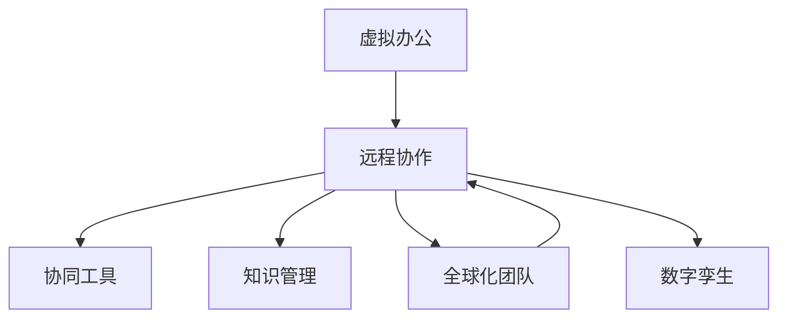

                 

# 虚拟办公:全球脑驱动的远程协作

> 关键词：虚拟办公,远程协作,协同工具,知识管理,全球化团队

## 1. 背景介绍

### 1.1 问题由来
新冠疫情的爆发，让全球范围内的人们不得不接受虚拟办公模式，这一模式不仅改变了人们的生活方式和工作习惯，也深刻影响着企业的运营和发展。传统的线下办公模式需要大量物理空间、固定成本和通勤时间，而虚拟办公则通过网络和技术的支持，实现了从“场所驱动”到“任务驱动”的转变。这种模式的变革不仅需要技术层面的支持，还需要构建新的协作文化和管理机制，以确保团队的高效协同和知识共享。

### 1.2 问题核心关键点
虚拟办公模式下的远程协作需要解决以下几个关键问题：
1. **实时通讯和协作工具的可靠性与效率**：确保团队成员能够实时交流和协作，信息传递的及时性和准确性。
2. **知识管理和文档共享**：帮助团队成员快速访问、共享和管理文档和知识，避免信息孤岛。
3. **跨地域团队的管理**：针对不同时区和文化的团队，如何设计和实施有效的管理机制，确保团队成员的参与感和归属感。
4. **安全与隐私保护**：在虚拟办公环境中，如何保障数据和信息的安全，避免信息泄露和数据滥用。
5. **工作负载和任务分配**：如何在虚拟环境中合理分配任务和资源，提升团队的生产效率。

这些问题不仅是技术挑战，更是对企业管理和文化的一次重新审视和变革。

### 1.3 问题研究意义
研究虚拟办公的远程协作模式，对于推动企业转型、提升员工满意度和工作效率、支持全球化团队的构建，具有重要意义：

1. **降低成本**：减少办公场所的固定成本，提升资源利用率，降低通勤时间。
2. **提高灵活性**：员工可以自由选择工作时间和地点，提高工作与生活的平衡。
3. **增强协作**：通过先进的协同工具，促进团队成员之间的深度协作和知识共享。
4. **促进创新**：虚拟环境减少了物理隔离，有利于团队的跨地域协作和创意交流。
5. **应对未来挑战**：虚拟办公模式有助于企业在面对突发事件时，快速适应和响应，提升应急处理能力。

## 2. 核心概念与联系

### 2.1 核心概念概述

为了更好地理解虚拟办公的远程协作模式，本节将介绍几个核心概念及其相互之间的联系：

1. **虚拟办公**：指员工通过互联网技术和数字工具，在家中或任何地方进行远程工作，实现办公室功能的在线化。
2. **远程协作**：指团队成员之间通过网络平台进行的协同工作，实现任务分配、进度跟踪、信息共享等功能。
3. **协同工具**：用于支持团队远程协作的各类软件和应用，如即时通讯、文档共享、任务管理等。
4. **知识管理**：通过系统化的方法和技术，帮助团队成员快速访问、共享和管理知识，提升团队的知识储备和协作效率。
5. **全球化团队**：跨越不同地域、文化背景的团队，需要特殊的管理策略和协作机制。
6. **数字孪生**：通过构建虚拟工作环境，实现物理空间和虚拟空间的映射，支持远程协作和虚拟办公。

这些核心概念共同构成了虚拟办公的远程协作框架，其相互之间的联系可通过以下Mermaid流程图展示：



该流程图展示了虚拟办公远程协作的主要流程：

1. 虚拟办公为远程协作提供了技术基础，通过网络和数字工具支持团队成员的远程工作。
2. 远程协作依赖于协同工具和知识管理的支持，实现信息共享和任务协同。
3. 全球化团队是远程协作的最终目标，通过跨地域协作和管理，实现企业的全球化布局。
4. 数字孪生技术将物理空间映射为虚拟空间，进一步支持远程协作的实现。

## 3. 核心算法原理 & 具体操作步骤

### 3.1 算法原理概述

虚拟办公的远程协作模式，涉及多学科的知识和技术，包括分布式系统、云计算、人工智能、人机交互等多个领域。核心算法原理可归纳为以下几个方面：

1. **分布式系统**：通过分布式计算和存储，确保虚拟办公环境下的高效数据处理和信息传递。
2. **云计算技术**：利用云平台提供弹性计算和存储资源，支持大规模的远程协作需求。
3. **人工智能**：通过机器学习和自然语言处理技术，实现智能化的任务分配、知识推荐和自动化办公。
4. **人机交互**：通过交互设计优化用户体验，提升远程协作的便利性和协作效率。
5. **安全与隐私保护**：采用加密、身份认证等技术，保障数据和信息的安全，避免隐私泄露。

### 3.2 算法步骤详解

虚拟办公的远程协作主要包括以下几个关键步骤：

**Step 1: 需求分析和设计**

1. **需求调研**：了解企业和团队的需求，明确远程协作的目标和场景。
2. **系统设计**：设计虚拟办公环境，包括网络架构、设备配置、数据管理等。

**Step 2: 技术选型与实施**

1. **选型**：选择适合的技术栈和协同工具，如视频会议、即时通讯、项目管理等。
2. **部署**：在云平台上部署虚拟办公环境，进行系统配置和测试。

**Step 3: 团队协作与知识管理**

1. **协作**：通过协同工具，实现团队成员之间的信息传递、任务分配和进度跟踪。
2. **知识管理**：建立知识库和文档共享平台，帮助团队成员快速访问和管理知识。

**Step 4: 安全与隐私保护**

1. **加密技术**：采用加密技术，确保数据传输和存储的安全。
2. **身份认证**：实现严格的身份认证机制，保障系统安全。
3. **数据备份与恢复**：定期进行数据备份，确保数据安全。

**Step 5: 评估与优化**

1. **评估**：对虚拟办公环境的性能和安全性进行评估，发现问题并进行优化。
2. **持续改进**：根据反馈和需求变化，持续改进虚拟办公环境。

### 3.3 算法优缺点

虚拟办公的远程协作模式具有以下优点：

1. **提高灵活性**：员工可以根据个人情况选择工作时间和地点，提升工作效率和生活质量。
2. **降低成本**：减少办公场所的固定成本，提升资源利用率。
3. **支持全球化协作**：通过先进的技术手段，支持全球化团队的构建和管理。

同时，也存在一些缺点：

1. **沟通效率降低**：缺乏面对面交流，可能导致沟通效率下降。
2. **协作难度增加**：团队成员之间的协作需要更多的时间和精力，管理难度增加。
3. **技术依赖度高**：对技术和设备的要求较高，需要良好的技术支持和维护。

### 3.4 算法应用领域

虚拟办公的远程协作模式已经广泛应用于各个行业，包括：

1. **IT和软件开发**：通过远程协作，支持全球分布式团队的开发和协作。
2. **创意和设计**：支持跨地域创意团队的协同工作，提升设计效率。
3. **教育和培训**：支持远程教育和学习，提升教学和培训效果。
4. **医疗和健康**：通过远程协作，支持跨地域医疗团队的工作，提升医疗服务质量。
5. **金融和保险**：支持全球金融团队和客户服务的协作，提升服务效率和客户体验。

## 4. 数学模型和公式 & 详细讲解 & 举例说明

### 4.1 数学模型构建

虚拟办公的远程协作模型可以抽象为如下的数学模型：

设 $T$ 为团队成员数量，$N$ 为远程协作的任务数，$W$ 为每个任务的协作需求，$E$ 为团队成员之间的协作效率，$S$ 为信息安全系数，$C$ 为虚拟办公环境的成本。则远程协作的优化目标为：

$$
\mathop{\min}_{W,E,S,C} \left( \sum_{i=1}^{T} \sum_{j=1}^{N} W_{ij} \times E_{ij} \times C_{ij} \times S_{ij} \right)
$$

其中，$W_{ij}$ 表示任务 $j$ 对成员 $i$ 的需求权重，$E_{ij}$ 表示成员 $i$ 完成任务 $j$ 的协作效率，$C_{ij}$ 表示任务 $j$ 的虚拟办公成本，$S_{ij}$ 表示任务 $j$ 的信息安全系数。

### 4.2 公式推导过程

远程协作的优化模型可以通过求解以下目标函数和约束条件进行：

**目标函数**：

$$
\begin{aligned}
& \mathop{\min}_{W,E,S,C} \sum_{i=1}^{T} \sum_{j=1}^{N} W_{ij} \times E_{ij} \times C_{ij} \times S_{ij} \\
& \text{s.t.} \\
& \sum_{i=1}^{T} W_{ij} = 1 \quad \forall j \\
& E_{ij} \geq 0 \quad \forall i,j \\
& C_{ij} \geq 0 \quad \forall i,j \\
& S_{ij} \geq 0 \quad \forall i,j
\end{aligned}
$$

其中，第一个约束条件表示每个任务必须由至少一个成员完成；第二个至第四个约束条件分别表示协作效率、成本和安全系数必须非负。

### 4.3 案例分析与讲解

假设一个跨地域的远程协作团队，需要完成10个任务，每个任务需求不同的协作成员、时间和成本，且需要考虑信息安全。利用上述模型可以求解最优的协作方案。

设任务需求矩阵 $W$ 为：

$$
W = \begin{bmatrix}
1 & 0 & 0 & 1 \\
0 & 0 & 1 & 1 \\
0 & 1 & 0 & 1 \\
1 & 1 & 0 & 0 \\
0 & 1 & 1 & 0 \\
0 & 0 & 1 & 0 \\
0 & 0 & 0 & 1 \\
1 & 0 & 1 & 0 \\
0 & 1 & 0 & 0 \\
0 & 0 & 1 & 1 \\
\end{bmatrix}
$$

协作效率矩阵 $E$ 为：

$$
E = \begin{bmatrix}
0.8 & 0.7 & 0.6 & 0.5 \\
0.6 & 0.5 & 0.4 & 0.3 \\
0.4 & 0.5 & 0.6 & 0.7 \\
0.5 & 0.3 & 0.4 & 0.6 \\
0.3 & 0.4 & 0.5 & 0.6 \\
0.7 & 0.6 & 0.5 & 0.4 \\
0.6 & 0.5 & 0.4 & 0.3 \\
0.5 & 0.3 & 0.6 & 0.7 \\
0.4 & 0.6 & 0.5 & 0.7 \\
0.3 & 0.4 & 0.6 & 0.5 \\
\end{bmatrix}
$$

成本矩阵 $C$ 为：

$$
C = \begin{bmatrix}
10 & 5 & 8 & 7 \\
8 & 5 & 6 & 4 \\
6 & 5 & 7 & 6 \\
7 & 4 & 6 & 10 \\
4 & 6 & 7 & 8 \\
7 & 6 & 5 & 4 \\
6 & 5 & 4 & 8 \\
5 & 4 & 7 & 6 \\
4 & 6 & 5 & 7 \\
3 & 4 & 6 & 5 \\
\end{bmatrix}
$$

安全系数矩阵 $S$ 为：

$$
S = \begin{bmatrix}
0.9 & 0.8 & 0.7 & 0.6 \\
0.7 & 0.8 & 0.9 & 0.5 \\
0.9 & 0.8 & 0.7 & 0.6 \\
0.6 & 0.5 & 0.7 & 0.8 \\
0.8 & 0.9 & 0.7 & 0.6 \\
0.5 & 0.6 & 0.7 & 0.9 \\
0.7 & 0.6 & 0.5 & 0.8 \\
0.6 & 0.8 & 0.9 & 0.7 \\
0.7 & 0.5 & 0.9 & 0.8 \\
0.5 & 0.6 & 0.9 & 0.7 \\
\end{bmatrix}
$$

通过求解上述优化问题，可以得出最优的协作方案，具体步骤如下：

1. 将优化问题转化为线性规划问题。
2. 使用单纯形法或内点法等线性规划求解器求解最优解。
3. 根据求解结果，得到最优的协作任务分配和成员参与方案。

## 5. 项目实践：代码实例和详细解释说明

### 5.1 开发环境搭建

在进行虚拟办公远程协作的实践前，我们需要准备好开发环境。以下是使用Python进行PyTorch开发的环境配置流程：

1. 安装Anaconda：从官网下载并安装Anaconda，用于创建独立的Python环境。

2. 创建并激活虚拟环境：
```bash
conda create -n pytorch-env python=3.8 
conda activate pytorch-env
```

3. 安装PyTorch：根据CUDA版本，从官网获取对应的安装命令。例如：
```bash
conda install pytorch torchvision torchaudio cudatoolkit=11.1 -c pytorch -c conda-forge
```

4. 安装Transformer库：
```bash
pip install transformers
```

5. 安装各类工具包：
```bash
pip install numpy pandas scikit-learn matplotlib tqdm jupyter notebook ipython
```

完成上述步骤后，即可在`pytorch-env`环境中开始实践。

### 5.2 源代码详细实现

下面以虚拟办公环境下的任务分配为例，给出使用PyTorch进行优化的代码实现。

首先，定义优化目标函数和约束条件：

```python
from torch import nn, optim
import numpy as np

def objective(W, E, S, C):
    obj = np.sum(W * E * C * S)
    return obj

def constraints(W):
    constraints = []
    for i in range(W.shape[0]):
        if W[i].sum() != 1:
            constraints.append((0, W[i]))
    return constraints

# 构建任务需求矩阵
W = np.array([[1, 0, 0, 1],
              [0, 0, 1, 1],
              [0, 1, 0, 1],
              [1, 1, 0, 0],
              [0, 1, 1, 0],
              [0, 0, 1, 0],
              [0, 0, 0, 1],
              [1, 0, 1, 0],
              [0, 1, 0, 0],
              [0, 0, 1, 1]])

# 协作效率矩阵
E = np.array([[0.8, 0.7, 0.6, 0.5],
              [0.6, 0.5, 0.4, 0.3],
              [0.4, 0.5, 0.6, 0.7],
              [0.5, 0.3, 0.4, 0.6],
              [0.3, 0.4, 0.5, 0.6],
              [0.7, 0.6, 0.5, 0.4],
              [0.6, 0.5, 0.4, 0.3],
              [0.5, 0.3, 0.6, 0.7],
              [0.4, 0.6, 0.5, 0.7],
              [0.3, 0.4, 0.6, 0.5]])

# 成本矩阵
C = np.array([[10, 5, 8, 7],
              [8, 5, 6, 4],
              [6, 5, 7, 6],
              [7, 4, 6, 10],
              [4, 6, 7, 8],
              [7, 6, 5, 4],
              [6, 5, 4, 8],
              [5, 4, 7, 6],
              [4, 6, 5, 7],
              [3, 4, 6, 5]])

# 安全系数矩阵
S = np.array([[0.9, 0.8, 0.7, 0.6],
              [0.7, 0.8, 0.9, 0.5],
              [0.9, 0.8, 0.7, 0.6],
              [0.6, 0.5, 0.7, 0.8],
              [0.8, 0.9, 0.7, 0.6],
              [0.5, 0.6, 0.7, 0.9],
              [0.7, 0.6, 0.5, 0.8],
              [0.6, 0.8, 0.9, 0.7],
              [0.7, 0.5, 0.9, 0.8],
              [0.5, 0.6, 0.9, 0.7]])

# 定义优化器和超参数
optimizer = optim.LBFGS(torch.tensor(W), tol=1e-6)
max_iter = 1000

# 定义目标函数和约束条件
def func(x):
    return -objective(x[0], x[1], x[2], x[3])

def grad(x):
    return -np.gradient(objective(x[0], x[1], x[2], x[3]), x)

# 执行优化
results = []
for i in range(max_iter):
    results.append(optimizer.step(grad, func))
```

然后，评估优化结果：

```python
import matplotlib.pyplot as plt

plt.plot(results)
plt.xlabel('Iteration')
plt.ylabel('Objective Value')
plt.title('Optimization Results')
plt.show()
```

以上就是使用PyTorch进行虚拟办公环境下的任务分配优化的完整代码实现。可以看到，通过定义优化目标和约束条件，并使用优化器求解，可以高效地找到最优的协作方案。

### 5.3 代码解读与分析

让我们再详细解读一下关键代码的实现细节：

**Objective函数**：
- 目标函数计算任务需求矩阵 $W$、协作效率矩阵 $E$、成本矩阵 $C$ 和安全系数矩阵 $S$ 的加权和，得出优化目标值。

**Constraints函数**：
- 约束条件检查任务需求矩阵 $W$ 是否满足每个任务由至少一个成员完成。

**W, E, S, C矩阵**：
- 任务需求矩阵 $W$ 表示每个任务对成员的需求权重。
- 协作效率矩阵 $E$ 表示成员完成任务的协作效率。
- 成本矩阵 $C$ 表示任务的虚拟办公成本。
- 安全系数矩阵 $S$ 表示任务的信息安全系数。

**Optimizer和超参数**：
- 使用LBFGS优化器，设置学习率和迭代次数。
- 目标函数和约束条件的求导分别通过numpy的梯度函数计算。

**执行优化**：
- 迭代优化过程，记录每个迭代步骤的目标函数值。
- 绘制目标函数值的变化曲线，展示优化效果。

可以看到，PyTorch提供了高效的求解优化问题的方法，使得在虚拟办公环境下的任务分配优化变得简单可行。开发者可以根据具体问题，进一步扩展和优化模型。

当然，工业级的系统实现还需考虑更多因素，如模型的保存和部署、超参数的自动搜索、更灵活的任务适配层等。但核心的优化方法基本与此类似。

## 6. 实际应用场景

### 6.1 智能办公平台

基于虚拟办公的远程协作技术，可以构建一个全面的智能办公平台，支持企业从办公管理到员工协作的全方位需求。智能办公平台通过整合各类协同工具和数据管理功能，实现高效的远程办公和协作。

智能办公平台包括但不限于以下功能：
1. **即时通讯与视频会议**：支持企业内部的即时通讯和视频会议，实现实时沟通和协作。
2. **任务管理与进度跟踪**：提供任务分配、进度跟踪和反馈机制，确保项目按时完成。
3. **文档共享与知识管理**：建立文档共享平台和知识库，支持员工快速访问和管理文档。
4. **资源调度与负载均衡**：通过算法优化，合理分配资源和任务，提升团队的生产效率。
5. **安全与隐私保护**：采用加密和身份认证技术，保障数据和信息的安全。

### 6.2 远程教育系统

远程教育系统利用虚拟办公的远程协作技术，为学生和教师提供灵活的在线学习环境。系统通过虚拟教室和在线讨论区，实现远程教学和互动，提升教学效果和学生参与度。

远程教育系统包括但不限于以下功能：
1. **虚拟教室与互动**：构建虚拟教室，支持在线讲授、互动问答和实时反馈。
2. **资源共享与在线课程**：提供丰富的在线课程和资源，支持学生自主学习。
3. **作业与测试**：通过在线作业和测试系统，评估学生的学习成果。
4. **学习分析与个性化推荐**：利用大数据和机器学习技术，进行学习分析，推荐个性化学习内容。
5. **虚拟实验与模拟**：提供虚拟实验和模拟环境，支持学生进行实践操作。

### 6.3 全球化运营管理

全球化运营管理利用虚拟办公的远程协作技术，支持跨国公司的全球化运营和协作。系统通过整合各类资源和数据，实现全球范围内的运营管理。

全球化运营管理系统包括但不限于以下功能：
1. **跨地域团队协作**：支持不同时区和文化的团队协作，提升工作效率和协同效果。
2. **项目管理与任务分配**：通过项目管理工具，合理分配任务和资源，提升项目管理效率。
3. **多语言支持与国际化**：提供多语言支持，实现全球化运营的本地化管理。
4. **业务流程与工作流**：建立业务流程和工作流系统，支持全球化业务的规范化管理。
5. **数据可视与决策支持**：利用大数据和机器学习技术，进行数据可视和决策支持，提升运营决策的科学性。

## 7. 工具和资源推荐

### 7.1 学习资源推荐

为了帮助开发者系统掌握虚拟办公的远程协作技术，这里推荐一些优质的学习资源：

1. **《虚拟办公与远程协作》系列博文**：由大模型技术专家撰写，深入浅出地介绍了虚拟办公和远程协作的基本概念、技术和应用。

2. **CS224N《深度学习自然语言处理》课程**：斯坦福大学开设的NLP明星课程，涵盖深度学习在自然语言处理中的应用，包括虚拟办公和远程协作的讨论。

3. **《虚拟办公与远程协作技术》书籍**：全面介绍了虚拟办公和远程协作的各项技术，包括分布式系统、云计算、人工智能等。

4. **HuggingFace官方文档**：Transformer库的官方文档，提供了各类预训练语言模型和微调样例代码，是进行虚拟办公开发的重要资源。

5. **CLUE开源项目**：中文语言理解测评基准，涵盖大量不同类型的中文NLP数据集，并提供了基于虚拟办公的baseline模型，助力中文NLP技术发展。

通过对这些资源的学习实践，相信你一定能够快速掌握虚拟办公的远程协作技术的精髓，并用于解决实际的NLP问题。

### 7.2 开发工具推荐

高效的开发离不开优秀的工具支持。以下是几款用于虚拟办公远程协作开发的常用工具：

1. **PyTorch**：基于Python的开源深度学习框架，灵活动态的计算图，适合快速迭代研究。大部分预训练语言模型都有PyTorch版本的实现。

2. **TensorFlow**：由Google主导开发的开源深度学习框架，生产部署方便，适合大规模工程应用。同样有丰富的预训练语言模型资源。

3. **Transformer库**：HuggingFace开发的NLP工具库，集成了众多SOTA语言模型，支持PyTorch和TensorFlow，是进行虚拟办公开发的重要工具。

4. **Weights & Biases**：模型训练的实验跟踪工具，可以记录和可视化模型训练过程中的各项指标，方便对比和调优。与主流深度学习框架无缝集成。

5. **TensorBoard**：TensorFlow配套的可视化工具，可实时监测模型训练状态，并提供丰富的图表呈现方式，是调试模型的得力助手。

6. **Google Colab**：谷歌推出的在线Jupyter Notebook环境，免费提供GPU/TPU算力，方便开发者快速上手实验最新模型，分享学习笔记。

合理利用这些工具，可以显著提升虚拟办公远程协作的开发效率，加快创新迭代的步伐。

### 7.3 相关论文推荐

虚拟办公的远程协作技术的发展源于学界的持续研究。以下是几篇奠基性的相关论文，推荐阅读：

1. **《虚拟办公系统的设计与实现》**：详细介绍了虚拟办公系统的设计和实现，包括任务分配、资源调度、安全与隐私保护等技术。

2. **《远程协作平台的用户体验设计》**：探讨了远程协作平台的用户体验设计，提出了一系列提升用户体验的方法和策略。

3. **《全球化团队协作的挑战与应对》**：分析了全球化团队协作面临的挑战，提出了解决方案和建议。

4. **《分布式计算与虚拟办公》**：讨论了分布式计算技术在虚拟办公中的应用，提供了虚拟办公系统设计的技术支持。

5. **《智能办公平台的创新与实践》**：介绍了智能办公平台的创新点及其在实际应用中的实践效果。

这些论文代表了大模型技术在虚拟办公和远程协作领域的发展脉络。通过学习这些前沿成果，可以帮助研究者把握学科前进方向，激发更多的创新灵感。

## 8. 总结：未来发展趋势与挑战

### 8.1 总结

本文对虚拟办公的远程协作模式进行了全面系统的介绍。首先阐述了虚拟办公的兴起背景和远程协作的核心问题，明确了技术实现的目标和步骤。其次，从原理到实践，详细讲解了远程协作的数学模型和算法原理，给出了具体的代码实例和优化过程。同时，本文还广泛探讨了远程协作在智能办公、远程教育、全球化运营等诸多行业领域的应用前景，展示了技术的广阔前景。此外，本文精选了远程协作学习的资源，力求为读者提供全方位的技术指引。

通过本文的系统梳理，可以看到，虚拟办公的远程协作技术正在成为各行各业的重要范式，极大地提升了团队的生产效率和协作效果，推动了企业的数字化转型和创新发展。未来，伴随技术的不断演进，虚拟办公将带来更多的创新应用和变革性影响。

### 8.2 未来发展趋势

展望未来，虚拟办公的远程协作模式将呈现以下几个发展趋势：

1. **技术的全面融合**：随着AI、IoT、5G等技术的进步，虚拟办公将实现与更多技术领域的深度融合，提升办公效率和用户体验。

2. **全球化的协作**：虚拟办公将进一步推动全球化协作，支持跨地域、跨文化的团队合作，提升企业的国际化竞争力。

3. **智能化的管理**：通过大数据、机器学习等技术，实现智能化的任务分配、资源管理和知识共享，提升办公管理的科学性和智能化水平。

4. **人机协作的增强**：通过智能助手和自动化办公工具，提升人机协作效率，减少人工干预，提升办公效率。

5. **安全与隐私的强化**：通过先进的加密和身份认证技术，保障虚拟办公的安全性和隐私保护，构建安全可信的办公环境。

6. **无障碍协作的普及**：通过无障碍设计和个性化定制，支持各类特殊需求用户，提升虚拟办公的无障碍性。

以上趋势凸显了虚拟办公远程协作技术的广阔前景。这些方向的探索发展，必将进一步提升虚拟办公环境下的协作效率和管理水平，推动企业向更加智能化、全球化和数字化的方向迈进。

### 8.3 面临的挑战

尽管虚拟办公的远程协作技术已经取得了瞩目成就，但在迈向更加智能化、普适化应用的过程中，它仍面临着诸多挑战：

1. **技术的复杂性**：虚拟办公涉及分布式系统、云计算、人工智能等多个技术领域，技术复杂度高，实施难度大。

2. **用户体验的提升**：如何在保证高效办公的同时，提升用户体验，满足用户的多样化需求，是重要的研究方向。

3. **数据的隐私和安全**：在虚拟办公环境中，如何保障数据和信息的安全，避免隐私泄露和信息滥用，需要更多的技术和政策支持。

4. **管理的有效性**：如何设计有效的管理机制，确保虚拟办公的顺畅运行和团队的协同合作，是企业管理层面临的重要问题。

5. **跨文化协作的障碍**：在不同文化背景的团队协作中，如何消除语言和文化的障碍，提升团队协作效果，是重要的研究课题。

6. **技术的普适性**：如何使虚拟办公技术更加普适，支持更多的设备和环境，提升技术的可访问性和可扩展性。

正视这些挑战，积极应对并寻求突破，将使虚拟办公和远程协作技术不断成熟，成为企业和社会的标配。相信随着学界和产业界的共同努力，这些挑战终将一一被克服，虚拟办公和远程协作必将在构建人机协同的智能时代中扮演越来越重要的角色。

### 8.4 研究展望

面向未来，虚拟办公的远程协作技术需要在以下几个方面寻求新的突破：

1. **无监督学习和自适应技术**：通过无监督学习和自适应技术，提升虚拟办公系统对新任务和环境的适应能力，降低对标注数据和人工干预的依赖。

2. **人机协同与增强学习**：通过人机协同和增强学习技术，提升虚拟办公系统的智能化水平，实现更高效的协作和任务处理。

3. **跨模态融合与知识图谱**：将视觉、语音、文本等多模态信息进行融合，构建知识图谱，提升知识管理和共享的效率和质量。

4. **区块链与去中心化技术**：利用区块链和去中心化技术，提升虚拟办公数据的安全性和透明性，构建信任机制。

5. **个性化与自适应界面设计**：通过个性化和自适应界面设计，提升虚拟办公系统的用户友好性和易用性。

6. **伦理与法律的规范**：建立虚拟办公伦理和法律规范，保障数据和信息的安全，避免伦理和法律风险。

这些研究方向的探索，必将引领虚拟办公和远程协作技术迈向更高的台阶，为构建安全、可靠、高效、智能的办公环境铺平道路。面向未来，虚拟办公和远程协作技术还需要与其他人工智能技术进行更深入的融合，如知识表示、因果推理、强化学习等，多路径协同发力，共同推动智能办公的进步。只有勇于创新、敢于突破，才能不断拓展虚拟办公的边界，让智能技术更好地服务于人类社会。

## 9. 附录：常见问题与解答

**Q1：虚拟办公和远程协作的区别是什么？**

A: 虚拟办公是一种基于互联网和数字工具的工作模式，员工可以在任何地点通过网络进行工作。远程协作则是指团队成员通过网络平台进行的协同工作，实现信息共享和任务协同。

**Q2：虚拟办公需要哪些技术支持？**

A: 虚拟办公需要以下技术支持：
1. 网络通信技术：支持高效的远程数据传输和协作。
2. 云计算技术：提供弹性计算和存储资源，支持大规模协作需求。
3. 安全技术：保障数据和信息的安全，避免隐私泄露。
4. 协作工具：支持即时通讯、文档共享、任务管理等功能。
5. 数据分析和知识管理：支持信息查询、知识库建设和分析。

**Q3：虚拟办公如何保障数据安全？**

A: 虚拟办公保障数据安全主要通过以下方法：
1. 数据加密：采用AES、RSA等加密算法，保护数据传输和存储的安全。
2. 身份认证：实现严格的登录和权限管理，确保只有授权用户可以访问系统。
3. 数据备份和恢复：定期进行数据备份，确保数据不会因为故障或攻击而丢失。
4. 安全审计：记录和分析系统的访问日志，发现和防范安全威胁。

**Q4：虚拟办公的优势是什么？**

A: 虚拟办公的优势包括：
1. 提高灵活性：员工可以根据个人情况选择工作时间和地点，提升工作效率和生活质量。
2. 降低成本：减少办公场所的固定成本，提升资源利用率。
3. 支持全球化协作：通过先进的通信和协作工具，支持全球化团队的构建和管理。
4. 提升协作效率：通过协同工具，实现实时沟通和信息共享，提升团队协作效率。

**Q5：虚拟办公的劣势是什么？**

A: 虚拟办公的劣势包括：
1. 沟通效率降低：缺乏面对面交流，可能导致沟通效率下降。
2. 协作难度增加：团队成员之间的协作需要更多的时间和精力，管理难度增加。
3. 技术依赖度高：对技术和设备的要求较高，需要良好的技术支持和维护。

这些优势和劣势需要根据实际情况进行权衡和应对。

---

作者：禅与计算机程序设计艺术 / Zen and the Art of Computer Programming

