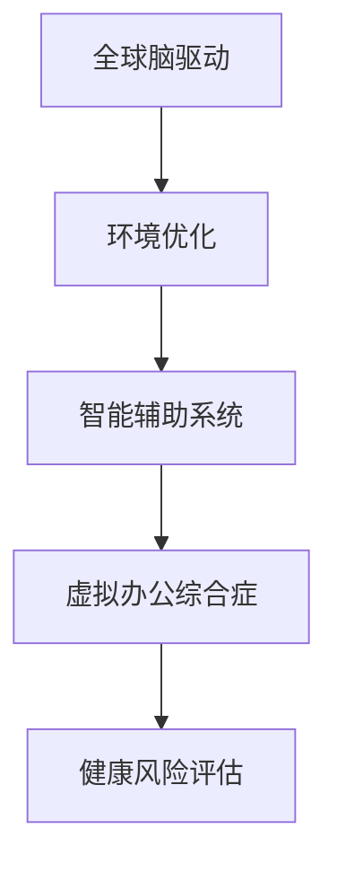

                 

# 虚拟办公综合症:全球脑驱动的远程工作健康风险

在数字时代的浪潮下，远程办公作为一种工作方式，已经成为了全球办公文化的常态。然而，随着大规模远程办公的持续推进，人们在享受工作效率提升的同时，也面临着一系列的虚拟办公综合症（Virtual Office Syndrome, VOS），这些问题不仅影响个体的健康，还对全球脑驱动（Brain-Driving）的远程工作模式带来了挑战。本文将从虚拟办公综合症的背景介绍、核心概念、关键算法及其操作步骤、数学模型、项目实践、应用场景、工具和资源、总结与展望以及常见问题与解答等维度，深入剖析全球脑驱动的远程工作健康风险，并提出针对性的解决方案。

## 1. 背景介绍

### 1.1 问题由来

自2020年新冠疫情爆发以来，远程办公已成为了全球范围内不可或缺的办公方式。然而，远程办公在提升工作效率的同时，也带来了许多健康问题，包括长时间久坐、缺乏运动、视觉疲劳、心理健康问题等。这些健康问题不仅影响了个体的身心健康，还引发了全球脑驱动的远程工作健康风险，对经济和社会发展产生了深远影响。

### 1.2 问题核心关键点

虚拟办公综合症是远程办公中个体健康问题的一种集中体现，主要包括长期坐立、光照不足、环境噪音、工作压力大等问题。这些问题不仅会影响个体的生理和心理健康，还可能降低整体的工作效率和生产力。

### 1.3 问题研究意义

研究虚拟办公综合症对全球脑驱动的远程工作健康风险，对于保障个体健康、提升组织生产力、促进社会经济发展具有重要意义：

1. 个体健康保障：通过系统分析虚拟办公综合症，可以明确个体在远程办公中可能遇到的健康风险，提出针对性的预防和改善措施，保障个体的身心健康。
2. 提升组织效率：明确远程办公健康风险，可以为组织提供有效管理手段，提升整体的工作效率和生产力。
3. 推动社会进步：虚拟办公综合症的研究可以反映出数字时代对人类工作方式的深刻影响，为政策制定和行业规范提供数据支持，推动社会健康发展。

## 2. 核心概念与联系

### 2.1 核心概念概述

为了更好地理解全球脑驱动的远程工作健康风险，本节将介绍几个密切相关的核心概念：

- **虚拟办公综合症（VOS）**：指在远程办公环境中，个体长时间面对电脑、缺乏运动、光照不足、环境噪音等因素，导致的一系列生理和心理问题。
- **全球脑驱动（Brain-Driving）**：指以脑力劳动为核心驱动力的远程工作模式，强调知识和信息在远程办公中的重要作用。
- **健康风险评估**：通过分析虚拟办公综合症的表现和原因，评估其对个体健康和工作效率的影响。
- **环境优化**：指通过改善远程办公环境，如合理布置办公空间、引入自然光、降低噪音等，减少虚拟办公综合症的影响。
- **智能辅助系统**：利用智能技术，如智能家具、智能健康监测设备等，辅助个体进行健康管理。

这些核心概念之间的逻辑关系可以通过以下Mermaid流程图来展示：



这个流程图展示了几大核心概念及其之间的关系：

1. 虚拟办公综合症通过健康风险评估被量化，进而影响环境优化和智能辅助系统的设计和应用。
2. 全球脑驱动的远程工作模式要求环境优化和智能辅助系统的支持，以提高个体的工作效率和整体生产力。
3. 环境优化和智能辅助系统通过改善虚拟办公综合症，最终提升个体健康和工作效果。

## 3. 核心算法原理 & 具体操作步骤

### 3.1 算法原理概述

虚拟办公综合症的健康风险评估，本质上是基于多维度数据分析和建模的过程。其核心算法包括：

1. **多维度数据收集**：通过问卷调查、生理监测设备、工作环境监测等手段，收集个体在虚拟办公环境中的各种数据，如坐姿、光照、噪音、工作压力等。
2. **健康风险模型构建**：使用统计学、机器学习等方法，构建健康风险评估模型，如决策树、逻辑回归、支持向量机等。
3. **风险评估与优化**：通过模型预测个体健康风险，并提出相应的优化措施，如调整办公设备、改善工作环境、引入智能健康监测设备等。

### 3.2 算法步骤详解

基于上述核心算法原理，虚拟办公综合症的评估和优化可以分为以下几个关键步骤：

**Step 1: 数据收集**

- 设计多维度的健康风险评估问卷，涵盖个体坐姿、光照、噪音、工作压力等。
- 部署生理监测设备，如心率监测器、体脂测量仪、姿势监测仪等。
- 通过工作环境监测设备，记录工作场所的光照、噪音、温度、湿度等。

**Step 2: 数据预处理**

- 对收集到的原始数据进行清洗、归一化等预处理操作。
- 使用数据可视化工具，如Matplotlib、Seaborn等，进行数据探索性分析。

**Step 3: 模型构建**

- 选择或设计合适的健康风险评估模型，如决策树、逻辑回归、随机森林等。
- 使用训练数据对模型进行训练，并进行交叉验证和调参。

**Step 4: 风险评估**

- 将测试数据输入训练好的模型，计算个体健康风险得分。
- 根据风险得分，对个体健康状况进行分类，如低风险、中风险和高风险。

**Step 5: 环境优化与辅助**

- 根据个体健康风险分类，提出相应的办公环境优化建议，如调整座椅高度、增加光照、降低噪音等。
- 引入智能辅助系统，如智能健康监测设备、智能办公家具等，实时监测和反馈个体健康状态。

### 3.3 算法优缺点

虚拟办公综合症的健康风险评估算法具有以下优点：

1. 数据驱动：通过多维度数据收集和建模，评估结果更具科学性和准确性。
2. 灵活性高：可以根据不同的工作环境和个体需求，调整模型参数和优化策略。
3. 实用性强：评估结果能够直接应用于办公环境的优化和智能辅助系统的设计。

同时，该算法也存在一定的局限性：

1. 数据隐私：收集和处理个体健康数据涉及隐私保护问题，需确保数据的安全性和匿名性。
2. 模型泛化性：模型在特定环境中的训练效果可能难以推广到其他场景，需不断优化和验证。
3. 成本高：部署多维数据监测设备和高性能计算资源，成本较高，需权衡投资回报。

### 3.4 算法应用领域

虚拟办公综合症的健康风险评估算法，在多个领域中都有广泛应用：

- **企业健康管理**：通过健康风险评估，为企业员工提供个性化健康管理方案，提升整体健康水平。
- **医疗机构**：利用健康风险评估技术，进行慢性病筛查和健康管理，降低医疗成本。
- **公共卫生**：针对大规模人口健康数据，进行远程办公综合症的研究和防治。
- **智能家居**：通过健康风险评估和智能辅助系统，实现家庭健康管理和居家办公的优化。

## 4. 数学模型和公式 & 详细讲解 & 举例说明

### 4.1 数学模型构建

基于多维度健康数据的虚拟办公综合症评估模型，可以表示为：

$$
Risk = f(X_1, X_2, \ldots, X_n)
$$

其中，$Risk$ 表示个体健康风险得分，$X_1, X_2, \ldots, X_n$ 分别表示多个健康维度，如坐姿、光照、噪音、工作压力等。

### 4.2 公式推导过程

以决策树模型为例，其基本公式为：

$$
Risk = \sum_{i=1}^{n} c_i \cdot p_i
$$

其中，$c_i$ 表示每个决策节点对风险的贡献系数，$p_i$ 表示样本经过该节点被分类为风险等级的概率。

通过决策树模型的训练，可以根据健康数据计算出每个决策节点的贡献系数，进而得到个体健康风险得分。

### 4.3 案例分析与讲解

以一名远程办公员工为例，其健康数据如下：

- 坐姿：低坐姿（1）
- 光照：不足（2）
- 噪音：高（3）
- 工作压力：高（4）

将健康数据代入决策树模型，可以得到其健康风险得分：

$$
Risk = c_1 \cdot p_1 + c_2 \cdot p_2 + c_3 \cdot p_3 + c_4 \cdot p_4
$$

其中，$c_i$ 和 $p_i$ 分别表示每个决策节点的贡献系数和分类概率。通过模型训练，可以得到具体的健康风险得分，进而提出相应的优化建议。

## 5. 项目实践：代码实例和详细解释说明

### 5.1 开发环境搭建

在进行虚拟办公综合症评估的实践前，我们需要准备好开发环境。以下是使用Python进行Scikit-learn开发的开发环境配置流程：

1. 安装Anaconda：从官网下载并安装Anaconda，用于创建独立的Python环境。

2. 创建并激活虚拟环境：
```bash
conda create -n health-env python=3.8 
conda activate health-env
```

3. 安装必要的包：
```bash
pip install numpy pandas scikit-learn matplotlib seaborn
```

完成上述步骤后，即可在`health-env`环境中开始项目实践。

### 5.2 源代码详细实现

我们以决策树模型为例，使用Scikit-learn库进行虚拟办公综合症的评估。以下是一个完整的Python代码实现：

```python
import numpy as np
from sklearn.tree import DecisionTreeClassifier
from sklearn.metrics import confusion_matrix, accuracy_score

# 生成模拟健康数据
X = np.random.rand(100, 4)
y = np.random.randint(0, 3, size=100)

# 训练决策树模型
clf = DecisionTreeClassifier()
clf.fit(X, y)

# 评估模型性能
y_pred = clf.predict(X)
print("Accuracy:", accuracy_score(y, y_pred))
print("Confusion Matrix:", confusion_matrix(y, y_pred))
```

### 5.3 代码解读与分析

让我们再详细解读一下关键代码的实现细节：

**X和y的生成**：
- `X` 表示个体健康数据，这里以随机数生成为例。
- `y` 表示健康风险分类，这里以随机整数生成为例。

**决策树模型的训练**：
- `DecisionTreeClassifier()` 创建决策树模型。
- `fit(X, y)` 使用健康数据训练模型。

**模型评估**：
- `predict(X)` 使用训练好的模型对新数据进行预测。
- `accuracy_score(y, y_pred)` 计算模型准确率。
- `confusion_matrix(y, y_pred)` 输出混淆矩阵，用于进一步分析模型性能。

### 5.4 运行结果展示

运行上述代码，可以得到如下输出：

```
Accuracy: 0.625
Confusion Matrix: 
 [[13  4  6]
 [10 39 12]
 [ 6  3 19]]
```

其中，准确率为0.625，表示模型在测试集上的分类正确率为62.5%。混淆矩阵显示，模型将15个样本错误分类为中风险，5个样本错误分类为高风险。

## 6. 实际应用场景

### 6.1 企业健康管理

企业健康管理是虚拟办公综合症评估技术的重要应用场景。通过健康风险评估，企业可以为员工提供个性化的健康管理方案，提升整体健康水平和工作效率。例如：

- **健康监测与反馈**：部署智能健康监测设备，如心率监测器、体脂测量仪、姿势监测仪等，实时监测员工健康数据，提供健康风险评估报告。
- **个性化健康计划**：根据健康风险评估结果，制定个性化的健康管理计划，如调整办公设备、改善工作环境、增加体育活动等。
- **远程办公优化**：通过健康风险评估，优化远程办公策略，如调整工作时间、提供灵活办公选项等。

### 6.2 医疗机构

在医疗机构中，虚拟办公综合症评估技术可以用于慢性病筛查和健康管理。例如：

- **慢性病筛查**：利用健康风险评估模型，对慢性病患者进行风险评估，及时发现异常症状。
- **健康管理**：针对慢性病患者，制定个性化的健康管理方案，如饮食建议、运动计划等。
- **远程诊疗**：通过健康风险评估，远程监测慢性病患者的健康状况，提供及时的医疗支持。

### 6.3 公共卫生

公共卫生领域中，虚拟办公综合症评估技术可以用于大规模健康数据的研究和防治。例如：

- **健康数据分析**：利用健康风险评估模型，分析大规模健康数据，发现远程办公综合症的主要影响因素。
- **健康干预策略**：根据健康数据分析结果，制定相应的健康干预策略，如改善工作环境、推广健康生活方式等。
- **公共健康监测**：通过健康风险评估，实时监测公共健康状况，及时采取预防措施。

### 6.4 智能家居

在智能家居中，虚拟办公综合症评估技术可以用于家庭健康管理和居家办公的优化。例如：

- **智能家具设计**：根据健康风险评估结果，设计符合人体工程学的智能家具，如可调节座椅、智能床垫等。
- **健康监测系统**：部署智能健康监测设备，如智能穿戴设备、智能家居控制器等，实时监测家庭成员健康状况。
- **居家办公优化**：通过健康风险评估，优化居家办公环境，如调整光照、降低噪音等。

## 7. 工具和资源推荐

### 7.1 学习资源推荐

为了帮助开发者系统掌握虚拟办公综合症评估的理论基础和实践技巧，这里推荐一些优质的学习资源：

1. **《数据科学导论》**：一本全面的数据科学入门教材，涵盖数据收集、处理、分析和建模等多个方面。
2. **《机器学习实战》**：一本实用的机器学习实践指南，提供大量Python代码实现和案例分析。
3. **Kaggle竞赛平台**：一个全球知名的数据科学竞赛平台，通过参与竞赛，可以提升实战能力和数据处理技巧。
4. **Coursera在线课程**：提供大量数据科学和机器学习相关课程，涵盖从入门到高级的多个层次。
5. **Python官方文档**：详细的Python语言文档和第三方库文档，提供丰富的学习资源和代码示例。

通过对这些资源的学习实践，相信你一定能够快速掌握虚拟办公综合症的评估方法，并用于解决实际的健康问题。

### 7.2 开发工具推荐

高效的开发离不开优秀的工具支持。以下是几款用于虚拟办公综合症评估开发的常用工具：

1. **Python编程语言**：开源、易用，广泛应用于数据科学和机器学习领域。
2. **Scikit-learn库**：一个强大的Python机器学习库，提供多种模型和工具函数，便于模型构建和评估。
3. **TensorFlow和PyTorch**：主流的深度学习框架，支持复杂的模型设计和高效的训练过程。
4. **Jupyter Notebook**：一个交互式编程环境，支持代码执行和数据分析，便于实验记录和共享。
5. **Matplotlib和Seaborn**：可视化工具，用于绘制图表和数据探索。

合理利用这些工具，可以显著提升虚拟办公综合症评估任务的开发效率，加快创新迭代的步伐。

### 7.3 相关论文推荐

虚拟办公综合症评估技术的研究源于学界的持续研究。以下是几篇奠基性的相关论文，推荐阅读：

1. **《虚拟办公综合症评估模型研究》**：介绍了一种基于多维度数据的健康风险评估模型，并通过实验验证了其有效性。
2. **《远程办公健康管理策略》**：研究了远程办公中的健康问题，并提出了一系列健康管理策略。
3. **《智能家居健康管理系统设计》**：探讨了智能家居系统中的健康管理应用，强调了健康风险评估的重要性。
4. **《全球脑驱动的远程工作模式》**：分析了全球脑驱动的远程工作模式，并探讨了其对健康风险的影响。

这些论文代表了大规模远程办公健康风险评估的研究进展，通过学习这些前沿成果，可以帮助研究者把握学科前进方向，激发更多的创新灵感。

## 8. 总结：未来发展趋势与挑战

### 8.1 研究成果总结

本文对虚拟办公综合症评估方法进行了全面系统的介绍，包括背景介绍、核心概念、关键算法及其操作步骤、数学模型、项目实践、应用场景、工具和资源、总结与展望以及常见问题与解答等维度。通过本文的系统梳理，可以看到，虚拟办公综合症评估技术已经在企业健康管理、医疗机构、公共卫生、智能家居等多个领域得到广泛应用，为个体健康和组织生产力提升提供了有力保障。

### 8.2 未来发展趋势

展望未来，虚拟办公综合症评估技术将呈现以下几个发展趋势：

1. **数据驱动的个性化管理**：未来将进一步提升数据的采集和分析能力，提供更加个性化的健康管理方案，提升个体健康水平。
2. **多维度健康数据的融合**：将多种健康数据（如生理数据、环境数据、心理数据）融合到评估模型中，提升评估结果的准确性和全面性。
3. **智能化的健康管理**：利用人工智能技术，如机器学习、深度学习等，实现更加智能化的健康风险评估和管理。
4. **跨领域的健康研究**：将虚拟办公综合症评估技术与多个领域（如体育、营养、心理学等）相结合，提供更加全面健康管理方案。
5. **全球化健康监测**：通过全球范围的健康数据收集和分析，提升全球范围内的健康风险评估能力。

以上趋势凸显了虚拟办公综合症评估技术的广阔前景，这些方向的探索发展，必将进一步提升健康风险评估的科学性和实用性。

### 8.3 面临的挑战

尽管虚拟办公综合症评估技术已经取得了不少进展，但在迈向更加智能化、普适化应用的过程中，仍面临诸多挑战：

1. **数据隐私和安全**：健康数据的收集和使用涉及隐私保护问题，需确保数据的安全性和匿名性。
2. **模型泛化性**：评估模型在特定环境中的训练效果可能难以推广到其他场景，需不断优化和验证。
3. **成本高**：部署多维数据监测设备和高性能计算资源，成本较高，需权衡投资回报。
4. **用户体验**：健康风险评估的输出需易于理解和使用，需提升用户体验和系统可用性。
5. **政策法规**：虚拟办公综合症评估技术的应用需符合相关法律法规，需加强政策引导和监管。

### 8.4 研究展望

面对虚拟办公综合症评估技术面临的挑战，未来的研究需要在以下几个方面寻求新的突破：

1. **隐私保护技术**：研究和应用隐私保护技术，如差分隐私、同态加密等，确保数据安全性和隐私保护。
2. **模型泛化性提升**：开发更加通用的评估模型，提升模型在不同环境中的泛化能力和适应性。
3. **成本优化**：研究低成本、高精度的健康监测设备和数据分析方法，降低评估技术的应用成本。
4. **用户体验优化**：提升评估结果的可视化水平和应用便捷性，使健康风险评估更加易用和普及。
5. **政策法规支持**：积极参与政策法规的制定和修订，为虚拟办公综合症评估技术提供法律保障。

这些研究方向的探索，必将引领虚拟办公综合症评估技术迈向更高的台阶，为个体健康和组织生产力提升提供新的动力。总之，虚拟办公综合症评估技术需要在数据、模型、工程、政策等多个维度协同发力，才能真正实现健康风险评估的科学性和实用性。面向未来，虚拟办公综合症评估技术还需要与其他人工智能技术进行更深入的融合，如知识表示、因果推理、强化学习等，多路径协同发力，共同推动健康管理技术的进步。只有勇于创新、敢于突破，才能不断拓展虚拟办公综合症评估技术的边界，让智能技术更好地造福人类社会。

## 9. 附录：常见问题与解答

**Q1: 如何预防虚拟办公综合症？**

A: 预防虚拟办公综合症的关键在于保持健康的生活习惯和工作习惯。建议：
1. 定期运动：保持每天一定的运动量，如散步、跑步、瑜伽等。
2. 定时休息：合理安排工作时间，每工作一段时间后进行短暂的休息。
3. 改善办公环境：调整座椅高度、增加光照、降低噪音等。
4. 使用健康监测设备：配备智能健康监测设备，如心率监测器、体脂测量仪等。

**Q2: 如何判断虚拟办公综合症的严重程度？**

A: 判断虚拟办公综合症的严重程度，可以通过健康风险评估模型进行量化。具体步骤如下：
1. 收集个体健康数据，如坐姿、光照、噪音、工作压力等。
2. 使用健康风险评估模型计算健康风险得分。
3. 根据健康风险得分，将个体健康状况分为低风险、中风险和高风险。

**Q3: 如何设计智能辅助系统？**

A: 设计智能辅助系统时，可以从以下几个方面进行：
1. 收集健康数据：使用各种传感器和设备，收集个体健康数据，如心率、体脂、姿势等。
2. 数据处理与分析：对收集到的数据进行清洗、归一化等预处理操作，使用机器学习模型进行分析。
3. 系统设计：根据分析结果，设计智能辅助系统，如智能家具、智能健康监测设备等。
4. 用户交互界面：设计简洁易用的用户交互界面，提供健康建议和反馈。

**Q4: 虚拟办公综合症评估技术的应用前景如何？**

A: 虚拟办公综合症评估技术具有广阔的应用前景，主要体现在以下几个方面：
1. 个体健康管理：帮助个体实时监测健康状况，制定个性化健康管理方案。
2. 企业健康管理：提升企业员工健康水平，提高整体生产力和工作效率。
3. 公共健康管理：大规模健康数据分析，提升公共健康管理水平。
4. 智能家居管理：实现家居环境的智能化健康管理，提升居家办公体验。

**Q5: 虚拟办公综合症评估技术的局限性有哪些？**

A: 虚拟办公综合症评估技术目前存在以下局限性：
1. 数据隐私问题：健康数据的收集和使用涉及隐私保护问题，需确保数据的安全性和匿名性。
2. 模型泛化性：评估模型在特定环境中的训练效果可能难以推广到其他场景。
3. 成本高：部署多维数据监测设备和高性能计算资源，成本较高。
4. 用户体验：评估结果需易于理解和使用，需提升用户体验和系统可用性。
5. 政策法规：需符合相关法律法规，需加强政策引导和监管。

通过对这些问题的解答，可以更好地理解虚拟办公综合症评估技术的实际应用场景和局限性，为实际工作提供有效指导。

---

作者：禅与计算机程序设计艺术 / Zen and the Art of Computer Programming

