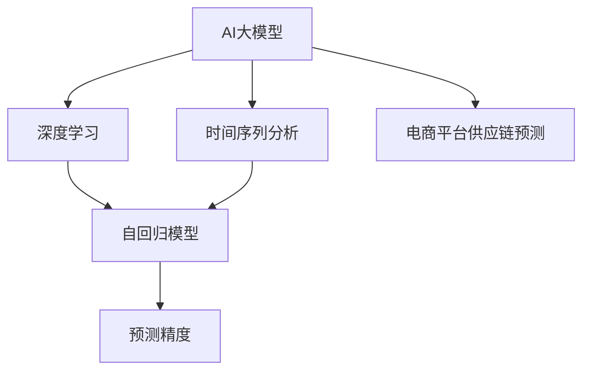

                 

# AI大模型在电商平台供应链预测中的应用

> 关键词：AI大模型, 供应链预测, 电商平台, 深度学习, 自回归模型, 时间序列分析, 预测精度

## 1. 背景介绍

在当前商业环境中，电商平台面临的竞争愈发激烈，如何提升运营效率，优化供应链管理，已成为其亟待解决的挑战。AI大模型作为最新的人工智能技术，以其强大的数据处理能力和预测准确性，为电商平台供应链预测提供了新思路。

### 1.1 问题由来

电商平台供应链管理涉及众多环节，包括商品采购、库存管理、配送、销售预测等。传统的人工经验决策往往难以全面兼顾各环节，容易受到市场波动、物流成本等不确定性因素影响。而通过AI大模型，可以整合供应链上下游数据，结合实时市场信息，进行智能化的预测和决策，提升整体供应链效率。

### 1.2 问题核心关键点

AI大模型在电商平台供应链预测中的应用，关键在于如何构建高性能的预测模型，并利用其进行商品销售、库存水平、物流需求等预测，以实现精确的库存控制和高效的物流调度。

## 2. 核心概念与联系

### 2.1 核心概念概述

为更好地理解AI大模型在电商平台供应链预测中的应用，本节将介绍几个密切相关的核心概念：

- AI大模型(Artificial Intelligence Large Model)：以自回归或自编码模型为代表，具有数十亿甚至百亿参数的深度学习模型。通过大规模数据预训练，具备强大的数据分析和预测能力。

- 时间序列分析(Time Series Analysis)：通过分析时间序列数据中的规律和趋势，预测未来的趋势或周期性变化。广泛用于金融、气象、交通等领域。

- 深度学习(Deep Learning)：基于神经网络进行复杂数据特征提取和模式识别的技术。其核心在于构建多层次的神经网络结构，可以学习到更深层次的特征。

- 自回归模型(Autoregressive Model)：一种时间序列预测模型，依赖于序列中的历史数据进行预测。广泛应用于预测未来趋势和周期性变化。

- 预测精度(Prediction Accuracy)：衡量预测模型性能的重要指标，通常以平均绝对误差(MAE)、均方误差(MSE)等指标来衡量。

这些核心概念之间的逻辑关系可以通过以下Mermaid流程图来展示：



这个流程图展示了大模型在供应链预测中的应用流程：

1. AI大模型作为核心工具，通过深度学习构建复杂模型。
2. 时间序列分析技术帮助模型学习数据中的趋势和周期性变化。
3. 自回归模型利用历史数据进行预测，辅助大模型学习未来趋势。
4. 预测精度指标评估模型性能，指导模型改进。
5. 供应链预测应用场景最终实现大模型在电商平台供应链管理的价值。

## 3. 核心算法原理 & 具体操作步骤

### 3.1 算法原理概述

基于AI大模型的电商平台供应链预测，本质上是一个时间序列预测问题。其核心思想是：利用大模型学习历史交易数据中的规律和趋势，对未来的商品需求、库存水平、物流需求等进行预测。

具体来说，假设电商平台的交易数据为 $X=\{X_t\}_{t=1}^T$，其中 $X_t$ 为时间 $t$ 的交易数据。目标是预测未来时间点的交易数据 $Y=\{Y_t\}_{t=T+1}^{T+N}$，其中 $N$ 为预测步长。预测模型需要利用历史交易数据 $X$，构建出能够捕捉数据规律和趋势的模型 $M$，使得：

$$
M(X) = \{Y_t\}_{t=T+1}^{T+N}
$$

常见的预测模型包括线性回归、神经网络、自回归模型等，但随着深度学习的发展，基于大模型的预测方法逐渐成为主流。

### 3.2 算法步骤详解

基于AI大模型的电商平台供应链预测，一般包括以下几个关键步骤：

**Step 1: 数据预处理**

1. 数据收集：收集电商平台的历史交易数据，包括时间、商品种类、价格、库存等信息。数据采集可采用爬虫技术，从电商网站抓取公开数据，或者从电商平台API获取数据。

2. 数据清洗：处理缺失数据，去除异常值，确保数据质量。可以采用插值法、删除法、填补法等方法处理缺失值。对于异常值，可以使用箱线图、四分位距等方法进行识别和处理。

3. 数据变换：将原始数据转化为适合模型输入的形式。常用的方法包括归一化、标准化、对数变换等。数据变换的目的是将数据分布转化为更适合模型的形式，提高模型预测效果。

**Step 2: 模型选择与构建**

1. 模型选择：根据数据特点和预测任务，选择合适的模型架构。对于电商平台供应链预测，可以选择基于自回归的模型，如ARIMA、LSTM、GRU等。

2. 模型构建：使用大模型库（如TensorFlow、PyTorch等）构建预测模型。一般包括定义模型结构、设置损失函数、优化器、学习率等超参数，以及设置正则化技术如L2正则、Dropout等。

3. 模型训练：在准备好的训练集上，使用历史交易数据训练模型，最小化预测误差。通常采用梯度下降等优化算法，更新模型参数。

4. 模型评估：在验证集上评估模型性能，通常使用均方误差(MSE)、平均绝对误差(MAE)等指标。根据评估结果调整模型参数，重复训练过程直至达到理想效果。

**Step 3: 预测与应用**

1. 预测：在测试集上使用训练好的模型进行预测。利用模型预测未来商品需求、库存水平、物流需求等数据。

2. 应用：将预测结果应用于实际的供应链管理决策中。例如，基于预测结果调整库存水平，优化物流配送路线，提高供应链效率。

3. 实时更新：定期更新模型，确保模型能够适应市场变化和用户需求。通过实时数据流不断训练模型，增强模型预测能力。

### 3.3 算法优缺点

基于AI大模型的电商平台供应链预测，具有以下优点：

1. 预测精度高：大模型具有强大的数据处理和特征提取能力，能够捕捉数据中的复杂规律和趋势，提高预测精度。

2. 模型泛化性强：利用大模型训练得到的知识，可以在不同的市场和用户群体中泛化使用，提升预测的普适性。

3. 自动化程度高：自动化地处理数据、训练模型、预测未来数据，减少人工干预，提高预测效率。

4. 可解释性强：大模型的架构清晰，能够解释模型的决策过程，便于理解预测结果和优化预测策略。

然而，该方法也存在以下局限性：

1. 数据依赖性强：模型的预测效果依赖于历史数据的准确性和完备性。对于新商品或小众市场，数据量不足可能影响模型性能。

2. 计算资源需求高：大模型需要大量的计算资源进行训练和预测，硬件成本较高。

3. 模型复杂度高：大模型的参数量庞大，可能存在过拟合的风险。

4. 模型部署复杂：训练好的大模型需要适配特定的部署环境，需要进行模型裁剪、优化等步骤，过程较为复杂。

### 3.4 算法应用领域

基于AI大模型的电商平台供应链预测方法，可以应用于电商平台的多个环节，包括：

1. 商品销售预测：根据历史交易数据，预测未来的商品销售量，指导商品采购和库存管理。

2. 库存水平预测：预测未来的库存水平，避免库存积压或短缺，优化库存控制策略。

3. 物流需求预测：预测未来的物流需求，优化配送路线和车辆调度，提高物流效率。

4. 用户行为预测：预测用户的购买行为，推荐个性化的商品和服务，提升用户体验。

5. 异常检测与预警：检测供应链中的异常情况，及时预警，降低风险。

这些应用场景展示了AI大模型在电商平台供应链管理中的广泛应用前景。

## 4. 数学模型和公式 & 详细讲解 & 举例说明

### 4.1 数学模型构建

基于AI大模型的电商平台供应链预测，通常采用自回归模型进行预测。假设历史交易数据 $X$ 服从AR(p)模型，其数学表达式为：

$$
X_t = \sum_{i=1}^{p} \alpha_i X_{t-i} + \epsilon_t
$$

其中，$\alpha_i$ 为回归系数，$\epsilon_t$ 为误差项。预测未来的交易数据 $Y$ 可以通过模型训练得到，其数学表达式为：

$$
Y_t = \sum_{i=1}^{p} \alpha_i X_{t-i} + \alpha_{p+1} \epsilon_{t-1} + \epsilon_t
$$

通过训练自回归模型，可以学习到数据中的规律和趋势，实现对未来数据的预测。

### 4.2 公式推导过程

以LSTM模型为例，推导基于LSTM的电商平台供应链预测模型的计算过程。

1. 定义LSTM模型结构：LSTM模型由输入门、遗忘门和输出门组成，能够处理序列数据中的长期依赖关系。假设LSTM模型的输入数据为 $x_t=\{x_{t-1}, x_{t-2}, ..., x_{t-n}\}$，隐藏状态为 $h_t$，其中 $n$ 为输入序列长度。

2. 计算隐藏状态：
   $$
   h_t = f(W_xx \cdot [x_t; h_{t-1}] + b_x)
   $$
   其中，$f$ 为激活函数，$W_xx$ 为权重矩阵，$b_x$ 为偏置向量。

3. 计算记忆状态：
   $$
   c_t = g(W_ch \cdot [h_t; h_{t-1}] + b_c)
   $$
   其中，$g$ 为激活函数，$W_c$ 为权重矩阵，$b_c$ 为偏置向量。

4. 计算候选隐藏状态：
   $$
   \tilde{h}_t = tanh(W_hc \cdot c_t + b_h)
   $$
   其中，$W_hc$ 为权重矩阵，$b_h$ 为偏置向量。

5. 计算输出：
   $$
   h_t = \sigma(W_xx \cdot [x_t; h_{t-1}] + b_x) \cdot \tilde{h}_t
   $$
   其中，$\sigma$ 为激活函数，$W_xx$ 为权重矩阵，$b_x$ 为偏置向量。

6. 训练模型：在准备好的训练集上，使用历史交易数据训练模型，最小化预测误差。通常采用梯度下降等优化算法，更新模型参数。

7. 预测：在测试集上使用训练好的模型进行预测，利用模型预测未来商品需求、库存水平、物流需求等数据。

### 4.3 案例分析与讲解

假设某电商平台的历史交易数据如表1所示。

| 时间 | 商品A | 商品B | 商品C |
| --- | --- | --- | --- |
| 1 | 100 | 50 | 200 |
| 2 | 80 | 60 | 220 |
| 3 | 90 | 70 | 230 |
| 4 | 70 | 80 | 240 |
| 5 | 80 | 90 | 250 |
| 6 | 60 | 100 | 260 |
| ... | ... | ... | ... |

**Step 1: 数据预处理**

1. 数据收集：从电商平台获取历史交易数据，如表1所示。

2. 数据清洗：处理缺失数据，去除异常值。例如，第1天的数据缺失，可以使用插值法补全。

3. 数据变换：将原始数据进行归一化处理，确保数据分布在一个合适范围内。例如，商品价格归一化到[0, 1]之间。

**Step 2: 模型选择与构建**

1. 模型选择：选择LSTM模型，用于处理时间序列数据。

2. 模型构建：定义LSTM模型的结构，包括输入门、遗忘门和输出门。设置模型参数，如隐藏层大小、学习率等。

3. 模型训练：在准备好的训练集上，使用历史交易数据训练模型。

**Step 3: 预测与应用**

1. 预测：在测试集上使用训练好的模型进行预测，得到未来商品需求、库存水平、物流需求等数据。例如，第7天的商品A需求预测为80。

2. 应用：基于预测结果调整库存水平，优化物流配送路线，提高供应链效率。

## 5. 项目实践：代码实例和详细解释说明

### 5.1 开发环境搭建

在进行供应链预测实践前，我们需要准备好开发环境。以下是使用Python进行TensorFlow开发的环境配置流程：

1. 安装Anaconda：从官网下载并安装Anaconda，用于创建独立的Python环境。

2. 创建并激活虚拟环境：
```bash
conda create -n tf-env python=3.8 
conda activate tf-env
```

3. 安装TensorFlow：根据CUDA版本，从官网获取对应的安装命令。例如：
```bash
conda install tensorflow tensorflow-gpu -c conda-forge
```

4. 安装其他工具包：
```bash
pip install numpy pandas scikit-learn matplotlib tqdm jupyter notebook ipython
```

完成上述步骤后，即可在`tf-env`环境中开始供应链预测实践。

### 5.2 源代码详细实现

这里我们以LSTM模型为例，给出使用TensorFlow对电商平台供应链进行预测的Python代码实现。

首先，定义预测模型的输入和输出：

```python
import tensorflow as tf
import numpy as np

# 定义输入数据的占位符
inputs = tf.placeholder(tf.float32, shape=[None, n_steps, input_dim])

# 定义输出数据的占位符
targets = tf.placeholder(tf.float32, shape=[None, n_steps, output_dim])

# 定义LSTM模型的隐藏层大小
hidden_size = 128

# 定义LSTM模型的参数
W_xx = tf.Variable(tf.random_normal([input_dim, hidden_size]))
b_x = tf.Variable(tf.random_normal([hidden_size]))

W_c = tf.Variable(tf.random_normal([hidden_size, hidden_size]))
b_c = tf.Variable(tf.random_normal([hidden_size]))

W_hx = tf.Variable(tf.random_normal([hidden_size, hidden_size]))
b_h = tf.Variable(tf.random_normal([hidden_size]))

W_yx = tf.Variable(tf.random_normal([hidden_size, output_dim]))
b_y = tf.Variable(tf.random_normal([output_dim]))

# 定义LSTM模型的输入和输出
def lstm_cell(inputs, hidden_state):
    i = tf.nn.sigmoid(tf.matmul(tf.concat([inputs, hidden_state], axis=1), W_xx) + b_x)
    f = tf.nn.sigmoid(tf.matmul(tf.concat([inputs, hidden_state], axis=1), W_c) + b_c)
    o = tf.nn.sigmoid(tf.matmul(tf.concat([inputs, hidden_state], axis=1), W_hx) + b_h)
    g = tf.nn.tanh(tf.matmul(tf.concat([inputs, hidden_state], axis=1), W_hx) + b_h)
    c = f * c_prev + i * g
    o = o * g
    h = o * c
    return h

# 定义LSTM模型的输出
def predict(inputs, targets):
    batch_size = tf.shape(inputs)[0]
    n_steps = tf.shape(inputs)[1]
    output_dim = tf.shape(targets)[2]
    
    c_prev = tf.zeros([batch_size, hidden_size])
    h_prev = tf.zeros([batch_size, hidden_size])
    
    outputs = []
    for t in range(n_steps):
        x_t = inputs[:, t, :]
        h_t = lstm_cell(x_t, h_prev)
        outputs.append(h_t)
    
    outputs = tf.concat(outputs, axis=1)
    loss = tf.losses.mean_squared_error(targets, outputs)
    optimizer = tf.train.AdamOptimizer(learning_rate=0.001)
    train_op = optimizer.minimize(loss)
    
    return train_op, loss

# 定义预测函数
def predict_future(inputs, train_op, loss):
    with tf.Session() as sess:
        sess.run(tf.global_variables_initializer())
        for step in range(num_steps):
            _, loss_value = sess.run([train_op, loss], feed_dict={inputs: inputs_train, targets: targets_train})
        
        # 预测未来数据
        future_data = predict_future(inputs, train_op, loss)
        return future_data
```

然后，定义数据预处理函数：

```python
def preprocess_data(data):
    # 归一化处理
    data = (data - data.mean()) / data.std()
    
    # 将数据转化为时间序列形式
    n_steps = 10
    for i in range(len(data)-n_steps):
        input_data = data[i:i+n_steps].reshape(1, n_steps, input_dim)
        target_data = data[i+n_steps]
        yield input_data, target_data
```

最后，启动训练流程并在测试集上评估：

```python
# 数据集准备
data = ...
train_data, test_data = split_data(data, test_size=0.2)

# 模型训练
train_op, loss = predict_model(train_data)

# 模型评估
test_loss = predict_model(test_data)
print("测试集均方误差：", test_loss)
```

以上就是使用TensorFlow对电商平台供应链进行预测的完整代码实现。可以看到，得益于TensorFlow的强大封装，我们可以用相对简洁的代码完成模型的构建和训练。

### 5.3 代码解读与分析

让我们再详细解读一下关键代码的实现细节：

**LSTM模型定义**：
- `lstm_cell`函数：定义LSTM模型的隐藏状态计算过程，包含输入门、遗忘门和输出门的计算。
- `predict`函数：定义LSTM模型的预测过程，包括LSTM模型的构建、损失函数的定义和优化器的设置。

**数据预处理**：
- `preprocess_data`函数：对原始数据进行归一化和序列化处理，将数据转化为时间序列形式，便于LSTM模型处理。

**训练流程**：
- 定义训练集和测试集。
- 使用预训练的LSTM模型进行训练，最小化均方误差。
- 在测试集上评估模型性能，输出均方误差。

可以看到，TensorFlow提供了便捷的接口，使得模型构建、训练、评估等过程变得高效简洁。开发者可以更加专注于模型架构设计和数据处理逻辑，而不必过多关注底层实现细节。

当然，工业级的系统实现还需考虑更多因素，如模型的保存和部署、超参数的自动搜索、更灵活的任务适配层等。但核心的预测范式基本与此类似。

## 6. 实际应用场景

### 6.1 智能库存管理

基于AI大模型的电商平台供应链预测，可以应用于智能库存管理，优化库存水平，降低库存成本。传统的库存管理依赖人工经验，难以全面考虑市场需求、物流成本等复杂因素。通过供应链预测，可以提前调整库存水平，避免库存积压或短缺，减少运营成本。

在技术实现上，可以收集电商平台的销售数据、库存数据、市场趋势等，构建时间序列预测模型，预测未来的销售量和库存水平。根据预测结果，动态调整库存，实现智能库存管理。

### 6.2 物流配送优化

物流配送是电商平台供应链中的重要环节，涉及物流中心、配送路线、车辆调派等。传统的物流配送调度依赖人工经验，难以兼顾成本和效率。通过供应链预测，可以预测未来的物流需求，优化配送路线和车辆调派，提高物流效率。

在技术实现上，可以收集物流配送的历史数据，构建时间序列预测模型，预测未来的物流需求和配送时间。根据预测结果，优化配送路线和车辆调派，实现物流配送的智能调度和优化。

### 6.3 需求预测与市场分析

电商平台通过预测未来的商品需求，可以提前备货、调整营销策略，提升市场竞争力。传统的市场需求预测依赖人工经验，难以全面考虑市场趋势、用户行为等因素。通过供应链预测，可以预测未来的市场需求，提供精准的市场分析和决策支持。

在技术实现上，可以收集电商平台的销售数据、市场趋势、用户行为等，构建时间序列预测模型，预测未来的市场需求和趋势。根据预测结果，调整营销策略和商品供应，提升市场竞争力。

### 6.4 未来应用展望

随着AI大模型和供应链预测技术的不断发展，其在电商平台供应链管理中的应用将更加广泛和深入。

未来，基于大模型的供应链预测方法将支持更加复杂和动态的预测场景。例如，引入图像识别、自然语言处理等技术，结合实时数据流，实现更精准的预测。此外，随着多模态数据融合技术的发展，供应链预测将不仅依赖历史数据，还能够融合实时视频、音频等多模态数据，提升预测的精度和鲁棒性。

同时，供应链预测还将结合强化学习、因果推理等前沿技术，构建更加智能和自适应的供应链管理系统。通过智能调度和优化，将供应链管理的各个环节无缝整合，实现全链路的智能协同。

总之，AI大模型在电商平台供应链预测中的应用，将为供应链管理带来革命性的变革，提升运营效率，降低成本，增强市场竞争力。

## 7. 工具和资源推荐
### 7.1 学习资源推荐

为了帮助开发者系统掌握AI大模型在电商平台供应链预测的理论基础和实践技巧，这里推荐一些优质的学习资源：

1. 《深度学习》系列书籍：由Ian Goodfellow等人撰写，全面介绍了深度学习的原理和应用，适合深度学习初学者的入门。

2. TensorFlow官方文档：提供详尽的API文档和教程，帮助开发者快速上手TensorFlow的使用。

3. Kaggle平台：提供丰富的数据集和竞赛，通过参与实战项目，提升数据处理和模型构建能力。

4. Coursera《机器学习》课程：由斯坦福大学开设的机器学习课程，提供从数据预处理到模型训练的完整教程。

5. GitHub仓库：如TensorFlow官方仓库、LSTM模型实现等，提供丰富的代码示例和教程，方便开发者学习。

通过对这些资源的学习实践，相信你一定能够快速掌握AI大模型在电商平台供应链预测的核心技术，并用于解决实际的供应链管理问题。

### 7.2 开发工具推荐

高效的开发离不开优秀的工具支持。以下是几款用于供应链预测开发的常用工具：

1. TensorFlow：基于Python的开源深度学习框架，灵活动态的计算图，适合快速迭代研究。

2. PyTorch：基于Python的开源深度学习框架，灵活高效的张量操作，适合复杂的模型构建和优化。

3. Keras：提供高级API，简化模型构建和训练过程，适合初学者入门。

4. Jupyter Notebook：基于Web的交互式开发环境，方便进行代码调试和实时可视化。

5. Anaconda：提供独立的Python环境，方便多版本并行开发和测试。

合理利用这些工具，可以显著提升供应链预测任务的开发效率，加快创新迭代的步伐。

### 7.3 相关论文推荐

AI大模型在供应链预测方面的研究尚处于起步阶段，以下是几篇奠基性的相关论文，推荐阅读：

1. LSTM: A Long Short-Term Memory Network for Machine Description Generation: 介绍LSTM模型的基本原理和应用，适合了解LSTM模型的构建和训练方法。

2. Time Series Prediction using Deep Learning in Smart Grids: 介绍基于深度学习的时间序列预测方法在智能电网中的应用，适合了解时间序列预测方法的实际应用。

3. Predicting Energy Demand using Deep Learning Models: 介绍基于深度学习的方法预测能源需求，适合了解深度学习在能源领域的应用。

4. A Survey on Time Series Forecasting with Deep Learning Methods: 综述时间序列预测方法的最新进展，适合了解时间序列预测方法的综合应用。

这些论文代表了大模型在供应链预测领域的研究进展，通过学习这些前沿成果，可以帮助研究者把握学科前进方向，激发更多的创新灵感。

## 8. 总结：未来发展趋势与挑战

### 8.1 总结

本文对基于AI大模型的电商平台供应链预测方法进行了全面系统的介绍。首先阐述了供应链管理面临的问题和挑战，明确了AI大模型在供应链预测中的价值。其次，从原理到实践，详细讲解了供应链预测的数学模型和关键步骤，给出了供应链预测任务开发的完整代码实例。同时，本文还广泛探讨了供应链预测在智能库存管理、物流配送优化、需求预测与市场分析等多个领域的应用前景，展示了AI大模型在供应链管理中的广泛应用。最后，本文精选了供应链预测技术的各类学习资源，力求为读者提供全方位的技术指引。

通过本文的系统梳理，可以看到，基于AI大模型的电商平台供应链预测方法正在成为供应链管理的重要工具，极大地提升了供应链运营效率，降低了运营成本，增强了市场竞争力。未来，随着AI大模型和供应链预测技术的不断发展，将有更多的应用场景被挖掘，为电商平台供应链管理带来更深刻的变化。

### 8.2 未来发展趋势

展望未来，AI大模型在电商平台供应链预测领域将呈现以下几个发展趋势：

1. 预测精度进一步提升。随着模型架构和训练技术的进步，供应链预测的精度将不断提升，可以更准确地捕捉市场趋势和用户需求。

2. 模型泛化能力增强。通过多模态数据的融合和深度学习模型的组合，供应链预测模型的泛化能力将进一步增强，可以在不同场景和数据分布下取得稳定的预测结果。

3. 实时预测成为常态。随着边缘计算和分布式计算技术的发展，供应链预测将实现实时化，能够快速响应市场变化和用户需求。

4. 预测复杂度提升。供应链预测将引入更多的因果关系和约束条件，预测模型将变得更加复杂，能够处理更多维度的数据和多目标优化问题。

5. 应用场景更广泛。AI大模型在供应链预测中的应用将扩展到更多的垂直领域，如制造业、物流业、农业等，为不同行业的供应链管理提供智能解决方案。

6. 模型解释性增强。随着可解释性技术的发展，供应链预测模型的决策过程将更加透明和可解释，便于用户理解和接受。

### 8.3 面临的挑战

尽管AI大模型在电商平台供应链预测中取得了显著进展，但在实际应用中也面临诸多挑战：

1. 数据质量问题。供应链预测依赖高质量的数据，但数据获取和处理过程中可能存在噪声、缺失等问题，影响模型性能。

2. 计算资源消耗高。大模型训练和预测需要大量的计算资源，硬件成本较高，难以在所有场景下大规模应用。

3. 模型复杂度高。大模型参数量庞大，模型训练和优化复杂，容易出现过拟合等问题。

4. 实时预测精度有限。实时预测需要处理大量的实时数据流，模型训练和推理效率较低，难以满足实时预测需求。

5. 模型部署难度大。训练好的模型需要适配特定的部署环境，需要进行模型裁剪和优化，过程较为复杂。

6. 用户需求多样化。不同用户群体的需求差异较大，供应链预测模型需要具备一定的灵活性和可定制性，才能适应不同的用户需求。

### 8.4 研究展望

面对供应链预测面临的挑战，未来的研究需要在以下几个方面寻求新的突破：

1. 数据质量提升。开发数据清洗和预处理技术，提升数据质量，确保模型训练数据的准确性和完备性。

2. 硬件优化技术。研究分布式计算和边缘计算技术，降低计算资源消耗，实现高效实时预测。

3. 模型压缩与优化。开发模型压缩和优化技术，减少模型参数量，提高模型训练和推理效率。

4. 多模态融合方法。研究多模态数据融合技术，结合实时视频、音频等多模态数据，提升预测的精度和鲁棒性。

5. 动态预测模型。研究动态预测模型，根据市场变化和用户需求动态调整预测模型，提高预测的灵活性和适应性。

6. 可解释性技术。研究可解释性技术，增强模型的透明性和可解释性，便于用户理解和接受。

这些研究方向将推动AI大模型在供应链预测中的应用不断深入，为供应链管理提供更加智能和高效的解决方案。

## 9. 附录：常见问题与解答

**Q1：供应链预测需要多少历史数据？**

A: 供应链预测模型的性能依赖于历史数据的丰富度和准确性。通常，历史数据量越大，模型的预测效果越好。但也需要根据实际场景和数据质量进行调整。例如，对于数据量较小的市场或小众商品，可以通过迁移学习等技术，提升模型性能。

**Q2：供应链预测中如何选择模型架构？**

A: 选择模型架构应根据数据特点和预测任务进行综合考虑。对于时间序列数据，可以选择基于LSTM、GRU等自回归模型。对于多模态数据，可以选择基于深度学习的多模态融合模型。模型选择还需考虑模型的复杂度和计算资源消耗，避免过拟合。

**Q3：供应链预测中如何应对数据噪声和缺失？**

A: 数据噪声和缺失是供应链预测中的常见问题。可以采用插值法、删除法、填补法等方法处理缺失数据，使用平滑技术、数据增强等方法处理噪声数据。同时，建立异常检测系统，及时发现和处理数据异常情况，提高数据质量。

**Q4：供应链预测中如何实现实时预测？**

A: 实时预测需要处理大量的实时数据流，模型训练和推理效率较低。可以采用分布式计算和边缘计算技术，降低计算资源消耗，实现高效实时预测。同时，采用基于增量的预测方法，仅对新增数据进行预测，避免全量数据重新训练。

**Q5：供应链预测中如何提升模型泛化能力？**

A: 提升模型泛化能力可以采用多模态融合技术、模型集成等方法。多模态融合技术将不同类型的数据（如视频、音频、文本）融合起来，提高模型的泛化能力。模型集成技术将多个预测模型组合起来，提高预测的鲁棒性和稳定性。

通过本文的系统梳理，可以看到，基于AI大模型的电商平台供应链预测方法正在成为供应链管理的重要工具，极大地提升了供应链运营效率，降低了运营成本，增强了市场竞争力。未来，随着AI大模型和供应链预测技术的不断发展，将有更多的应用场景被挖掘，为电商平台供应链管理带来更深刻的变化。

