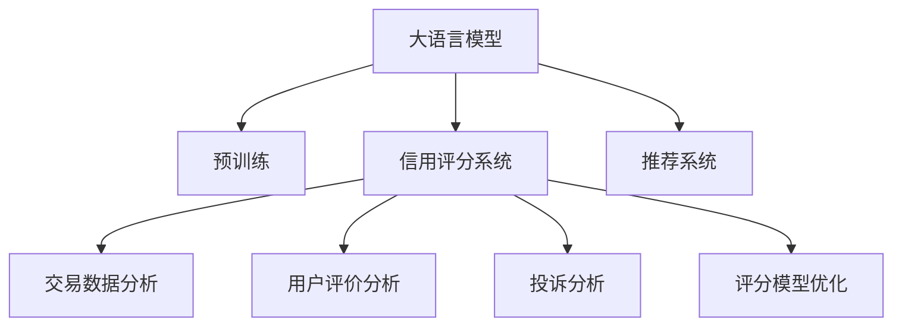

                 

# AI大模型在电商平台信用评分系统中的应用

> 关键词：大语言模型, 信用评分, 电商平台, 深度学习, 自然语言处理(NLP), 推荐系统, 模型优化

## 1. 背景介绍

### 1.1 问题由来
随着互联网和电子商务的迅猛发展，电商平台已经成为现代消费的重要渠道。但同时，假冒伪劣商品、虚假宣传、恶意行为等风险也随之而来，给消费者和商家都带来了诸多不便。为了提升用户体验和商家满意度，电商平台纷纷引入信用评分系统，通过用户行为数据，自动化地为商家和用户进行信用评估，识别和防范不良行为。

信用评分系统本质上是一种推荐系统，通过对用户行为数据的分析，对商家的信用进行动态评估。常见的评分方式包括交易次数、订单金额、好评率、投诉次数等。但这些数据只是静态的，难以全面反映商家的真实信用水平。此外，数据标注成本高、维度稀疏等问题，也限制了传统评分方法的广泛应用。

近年来，基于深度学习的大语言模型在自然语言处理(NLP)领域取得了巨大的突破。通过在大量无标签文本上进行的预训练，大模型学到了丰富的语言知识，能够从用户评价、评论、投诉等文本数据中提取有价值的信用信息。利用这些信息，可以构建更加智能、多维度的信用评分系统。

本文将详细介绍大语言模型在电商平台信用评分系统中的应用，探讨其工作原理和优化方法，以期为电商平台的信用管理提供更高效、精准的解决方案。

## 2. 核心概念与联系

### 2.1 核心概念概述

为更好地理解大语言模型在信用评分系统中的应用，本节将介绍几个密切相关的核心概念：

- 大语言模型(Large Language Model, LLM)：以自回归(如GPT)或自编码(如BERT)模型为代表的大规模预训练语言模型。通过在大规模无标签文本语料上进行预训练，学习通用的语言表示，具备强大的语言理解和生成能力。

- 预训练(Pre-training)：指在大规模无标签文本语料上，通过自监督学习任务训练通用语言模型的过程。常见的预训练任务包括言语建模、遮挡语言模型等。预训练使得模型学习到语言的通用表示。

- 信用评分系统：通过分析用户行为数据，对商家的信用进行自动化评估的系统。常见的评分指标包括交易次数、订单金额、好评率等。

- 深度学习(Deep Learning)：一种基于多层神经网络的机器学习技术，可以自动学习输入数据的特征，用于分类、回归、生成等任务。

- 自然语言处理(Natural Language Processing, NLP)：研究如何让计算机理解和处理人类语言的技术，包括文本分类、实体识别、情感分析等。

- 推荐系统(Recommendation System)：根据用户的历史行为和偏好，推荐物品的系统。常见的推荐系统包括协同过滤、内容推荐、混合推荐等。

- 模型优化(Model Optimization)：通过各种技术手段，优化模型的性能和可解释性，提高其适应性。

这些核心概念之间的逻辑关系可以通过以下Mermaid流程图来展示：



这个流程图展示了大语言模型在信用评分系统中的应用：

1. 大语言模型通过预训练获得基础能力。
2. 信用评分系统利用大模型学到的语言知识，对交易、评价、投诉等文本数据进行分析。
3. 分析结果被用于构建评分模型。
4. 评分模型利用深度学习进行优化，提升信用评分的准确性。
5. 评分结果可反馈到推荐系统，辅助用户选择信用良好的商家。

## 3. 核心算法原理 & 具体操作步骤
### 3.1 算法原理概述

大语言模型在信用评分系统中的应用，主要通过以下步骤实现：

1. **预训练大语言模型**：在大规模无标签文本上，通过自监督学习任务进行预训练，学习通用的语言表示。
2. **文本数据分析**：对用户行为数据中的评价、评论、投诉等文本进行分析和提取。
3. **信用评分计算**：利用预训练大模型的语言知识，结合交易、评价、投诉等数据，计算商家的信用评分。
4. **评分模型优化**：采用深度学习算法，对信用评分模型进行优化，提升评分准确性和泛化能力。
5. **评分反馈**：将评分结果反馈到推荐系统，辅助用户选择信用良好的商家。

### 3.2 算法步骤详解

**Step 1: 准备预训练模型和数据集**

1. **选择合适的预训练语言模型**：选择如BERT、GPT等通用预训练模型作为基础。
2. **收集标注数据**：收集商家的交易记录、用户评价、投诉等文本数据。
3. **数据预处理**：对文本数据进行清洗、分词、编码等预处理操作。

**Step 2: 模型初始化**

1. **加载预训练模型**：使用预训练模型的API或代码库加载模型。
2. **定义输入和输出**：定义输入的文本数据格式和模型的输出格式。
3. **模型适配**：对模型进行初始化，如设置超参数、冻结某些层等。

**Step 3: 文本数据分析**

1. **交易数据分析**：对商家的交易记录进行统计分析，提取订单次数、金额、退货率等特征。
2. **用户评价分析**：对用户评价数据进行情感分析、实体识别、关键词提取等处理，提取评价中的正向和负面情感信息。
3. **投诉分析**：对投诉数据进行分类、关键词提取等，提取投诉中的问题类型和严重程度。

**Step 4: 信用评分计算**

1. **融合多维数据**：将交易数据分析、用户评价分析和投诉分析的结果进行融合，构建综合信用评分。
2. **计算评分**：利用预训练大模型计算每个商家的信用评分，作为最终评分。

**Step 5: 评分模型优化**

1. **定义损失函数**：根据评分结果与真实标注之间的差异，定义损失函数。
2. **选择优化算法**：选择如AdamW、SGD等优化算法。
3. **设置超参数**：设置学习率、批大小、迭代轮数等超参数。
4. **训练评分模型**：在标注数据上训练评分模型，最小化损失函数。

**Step 6: 评分反馈**

1. **集成到推荐系统**：将评分结果反馈到推荐系统，辅助用户选择信用良好的商家。
2. **持续更新**：持续收集新的交易、评价、投诉数据，定期重新训练评分模型。

### 3.3 算法优缺点

**优点**：

1. **精度高**：大语言模型能够从文本中提取丰富的信用信息，结合多维数据，可以提升信用评分的准确性。
2. **适应性强**：通过深度学习优化，模型可以自动学习特征，适应不同领域的信用评分需求。
3. **扩展性好**：模型可以不断集成新的数据，动态更新评分结果，提高信用评估的时效性。
4. **可解释性强**：利用预训练大模型的语言知识，可以解释评分计算的逻辑，提高系统的透明度。

**缺点**：

1. **计算资源消耗大**：大语言模型的预训练和优化需要大量的计算资源，对硬件要求较高。
2. **数据标注成本高**：预训练模型的微调需要大量标注数据，标注成本较高。
3. **数据隐私问题**：处理涉及个人隐私的用户评价和投诉数据，需要遵循数据隐私保护法规。
4. **模型解释性不足**：尽管可解释性强，但评分模型的决策过程仍较复杂，难以完全透明。

### 3.4 算法应用领域

基于大语言模型的信用评分系统，可以在以下领域得到广泛应用：

- **电商平台**：对商家的交易行为、用户评价和投诉进行综合分析，自动评估商家信用，辅助用户选择。
- **金融行业**：对贷款申请人、信用卡用户等的信用进行评估，辅助决策和风险控制。
- **社交媒体**：对用户的行为、评论和投诉进行分析，评估用户的信用等级，辅助平台管理。
- **在线教育**：对教师、课程等的评价进行分析和评分，辅助学生选择。

## 4. 数学模型和公式 & 详细讲解 & 举例说明

### 4.1 数学模型构建

本节将使用数学语言对大语言模型在信用评分系统中的应用进行更加严格的刻画。

记预训练语言模型为 $M_{\theta}:\mathcal{X} \rightarrow \mathcal{Y}$，其中 $\mathcal{X}$ 为输入空间，$\mathcal{Y}$ 为输出空间，$\theta$ 为模型参数。假设信用评分系统中的标注数据集为 $D=\{(x_i,y_i)\}_{i=1}^N$，其中 $x_i$ 为商家行为数据，$y_i$ 为商家信用评分。

定义模型 $M_{\theta}$ 在输入 $x$ 上的输出为 $\hat{y}=M_{\theta}(x) \in [0,1]$，表示商家信用的预测评分。设评分结果与真实标签之间的损失函数为 $\ell(M_{\theta}(x),y)$，经验风险为：

$$
\mathcal{L}(\theta) = \frac{1}{N}\sum_{i=1}^N \ell(M_{\theta}(x_i),y_i)
$$

常见的损失函数包括交叉熵损失、均方误差损失等。

### 4.2 公式推导过程

以二分类任务为例，假设模型 $M_{\theta}$ 在输入 $x$ 上的输出为 $\hat{y}=M_{\theta}(x) \in [0,1]$，真实标签 $y \in \{0,1\}$。则二分类交叉熵损失函数定义为：

$$
\ell(M_{\theta}(x),y) = -[y\log \hat{y} + (1-y)\log (1-\hat{y})]
$$

将其代入经验风险公式，得：

$$
\mathcal{L}(\theta) = -\frac{1}{N}\sum_{i=1}^N [y_i\log M_{\theta}(x_i)+(1-y_i)\log(1-M_{\theta}(x_i))]
$$

根据链式法则，损失函数对参数 $\theta_k$ 的梯度为：

$$
\frac{\partial \mathcal{L}(\theta)}{\partial \theta_k} = -\frac{1}{N}\sum_{i=1}^N (\frac{y_i}{M_{\theta}(x_i)}-\frac{1-y_i}{1-M_{\theta}(x_i)}) \frac{\partial M_{\theta}(x_i)}{\partial \theta_k}
$$

其中 $\frac{\partial M_{\theta}(x_i)}{\partial \theta_k}$ 可进一步递归展开，利用自动微分技术完成计算。

在得到损失函数的梯度后，即可带入参数更新公式，完成模型的迭代优化。重复上述过程直至收敛，最终得到适应信用评分任务的最优模型参数 $\theta^*$。

## 5. 项目实践：代码实例和详细解释说明

### 5.1 开发环境搭建

在进行信用评分系统的微调实践前，我们需要准备好开发环境。以下是使用Python进行PyTorch开发的环境配置流程：

1. 安装Anaconda：从官网下载并安装Anaconda，用于创建独立的Python环境。

2. 创建并激活虚拟环境：
```bash
conda create -n pytorch-env python=3.8 
conda activate pytorch-env
```

3. 安装PyTorch：根据CUDA版本，从官网获取对应的安装命令。例如：
```bash
conda install pytorch torchvision torchaudio cudatoolkit=11.1 -c pytorch -c conda-forge
```

4. 安装TensorFlow：由Google主导开发的开源深度学习框架，生产部署方便，适合大规模工程应用。同样有丰富的预训练语言模型资源。

5. 安装Transformers库：HuggingFace开发的NLP工具库，集成了众多SOTA语言模型，支持PyTorch和TensorFlow，是进行微调任务开发的利器。

6. 安装各类工具包：
```bash
pip install numpy pandas scikit-learn matplotlib tqdm jupyter notebook ipython
```

完成上述步骤后，即可在`pytorch-env`环境中开始微调实践。

### 5.2 源代码详细实现

下面我们以电商平台信用评分任务为例，给出使用Transformers库对BERT模型进行微调的PyTorch代码实现。

首先，定义信用评分任务的标注数据处理函数：

```python
from transformers import BertTokenizer
from torch.utils.data import Dataset
import torch

class CreditDataset(Dataset):
    def __init__(self, texts, scores, tokenizer, max_len=128):
        self.texts = texts
        self.scores = scores
        self.tokenizer = tokenizer
        self.max_len = max_len
        
    def __len__(self):
        return len(self.texts)
    
    def __getitem__(self, item):
        text = self.texts[item]
        score = self.scores[item]
        
        encoding = self.tokenizer(text, return_tensors='pt', max_length=self.max_len, padding='max_length', truncation=True)
        input_ids = encoding['input_ids'][0]
        attention_mask = encoding['attention_mask'][0]
        
        # 对token-wise的标签进行编码
        encoded_tags = [score] * len(input_ids)
        labels = torch.tensor(encoded_tags, dtype=torch.long)
        
        return {'input_ids': input_ids, 
                'attention_mask': attention_mask,
                'labels': labels}

# 标签与id的映射
tag2id = {0: 0, 1: 1}
id2tag = {v: k for k, v in tag2id.items()}

# 创建dataset
tokenizer = BertTokenizer.from_pretrained('bert-base-cased')

train_dataset = CreditDataset(train_texts, train_scores, tokenizer)
dev_dataset = CreditDataset(dev_texts, dev_scores, tokenizer)
test_dataset = CreditDataset(test_texts, test_scores, tokenizer)
```

然后，定义模型和优化器：

```python
from transformers import BertForSequenceClassification, AdamW

model = BertForSequenceClassification.from_pretrained('bert-base-cased', num_labels=2)

optimizer = AdamW(model.parameters(), lr=2e-5)
```

接着，定义训练和评估函数：

```python
from torch.utils.data import DataLoader
from tqdm import tqdm
from sklearn.metrics import classification_report

device = torch.device('cuda') if torch.cuda.is_available() else torch.device('cpu')
model.to(device)

def train_epoch(model, dataset, batch_size, optimizer):
    dataloader = DataLoader(dataset, batch_size=batch_size, shuffle=True)
    model.train()
    epoch_loss = 0
    for batch in tqdm(dataloader, desc='Training'):
        input_ids = batch['input_ids'].to(device)
        attention_mask = batch['attention_mask'].to(device)
        labels = batch['labels'].to(device)
        model.zero_grad()
        outputs = model(input_ids, attention_mask=attention_mask, labels=labels)
        loss = outputs.loss
        epoch_loss += loss.item()
        loss.backward()
        optimizer.step()
    return epoch_loss / len(dataloader)

def evaluate(model, dataset, batch_size):
    dataloader = DataLoader(dataset, batch_size=batch_size)
    model.eval()
    preds, labels = [], []
    with torch.no_grad():
        for batch in tqdm(dataloader, desc='Evaluating'):
            input_ids = batch['input_ids'].to(device)
            attention_mask = batch['attention_mask'].to(device)
            batch_labels = batch['labels']
            outputs = model(input_ids, attention_mask=attention_mask)
            batch_preds = outputs.logits.argmax(dim=2).to('cpu').tolist()
            batch_labels = batch_labels.to('cpu').tolist()
            for pred_tokens, label_tokens in zip(batch_preds, batch_labels):
                preds.append(pred_tokens[:len(label_tokens)])
                labels.append(label_tokens)
                
    print(classification_report(labels, preds))
```

最后，启动训练流程并在测试集上评估：

```python
epochs = 5
batch_size = 16

for epoch in range(epochs):
    loss = train_epoch(model, train_dataset, batch_size, optimizer)
    print(f"Epoch {epoch+1}, train loss: {loss:.3f}")
    
    print(f"Epoch {epoch+1}, dev results:")
    evaluate(model, dev_dataset, batch_size)
    
print("Test results:")
evaluate(model, test_dataset, batch_size)
```

以上就是使用PyTorch对BERT进行信用评分任务微调的完整代码实现。可以看到，得益于Transformers库的强大封装，我们可以用相对简洁的代码完成BERT模型的加载和微调。

### 5.3 代码解读与分析

让我们再详细解读一下关键代码的实现细节：

**CreditDataset类**：
- `__init__`方法：初始化文本、评分、分词器等关键组件。
- `__len__`方法：返回数据集的样本数量。
- `__getitem__`方法：对单个样本进行处理，将文本输入编码为token ids，将评分编码为数字，并对其进行定长padding，最终返回模型所需的输入。

**tag2id和id2tag字典**：
- 定义了标签与数字id之间的映射关系，用于将token-wise的预测结果解码回真实的标签。

**训练和评估函数**：
- 使用PyTorch的DataLoader对数据集进行批次化加载，供模型训练和推理使用。
- 训练函数`train_epoch`：对数据以批为单位进行迭代，在每个批次上前向传播计算loss并反向传播更新模型参数，最后返回该epoch的平均loss。
- 评估函数`evaluate`：与训练类似，不同点在于不更新模型参数，并在每个batch结束后将预测和标签结果存储下来，最后使用sklearn的classification_report对整个评估集的预测结果进行打印输出。

**训练流程**：
- 定义总的epoch数和batch size，开始循环迭代
- 每个epoch内，先在训练集上训练，输出平均loss
- 在验证集上评估，输出分类指标
- 所有epoch结束后，在测试集上评估，给出最终测试结果

可以看到，PyTorch配合Transformers库使得BERT微调的代码实现变得简洁高效。开发者可以将更多精力放在数据处理、模型改进等高层逻辑上，而不必过多关注底层的实现细节。

当然，工业级的系统实现还需考虑更多因素，如模型的保存和部署、超参数的自动搜索、更灵活的任务适配层等。但核心的微调范式基本与此类似。

## 6. 实际应用场景
### 6.1 智能客服系统

基于大语言模型微调的对话技术，可以广泛应用于智能客服系统的构建。传统客服往往需要配备大量人力，高峰期响应缓慢，且一致性和专业性难以保证。而使用微调后的对话模型，可以7x24小时不间断服务，快速响应客户咨询，用自然流畅的语言解答各类常见问题。

在技术实现上，可以收集企业内部的历史客服对话记录，将问题和最佳答复构建成监督数据，在此基础上对预训练对话模型进行微调。微调后的对话模型能够自动理解用户意图，匹配最合适的答案模板进行回复。对于客户提出的新问题，还可以接入检索系统实时搜索相关内容，动态组织生成回答。如此构建的智能客服系统，能大幅提升客户咨询体验和问题解决效率。

### 6.2 金融舆情监测

金融机构需要实时监测市场舆论动向，以便及时应对负面信息传播，规避金融风险。传统的人工监测方式成本高、效率低，难以应对网络时代海量信息爆发的挑战。基于大语言模型微调的文本分类和情感分析技术，为金融舆情监测提供了新的解决方案。

具体而言，可以收集金融领域相关的新闻、报道、评论等文本数据，并对其进行主题标注和情感标注。在此基础上对预训练语言模型进行微调，使其能够自动判断文本属于何种主题，情感倾向是正面、中性还是负面。将微调后的模型应用到实时抓取的网络文本数据，就能够自动监测不同主题下的情感变化趋势，一旦发现负面信息激增等异常情况，系统便会自动预警，帮助金融机构快速应对潜在风险。

### 6.3 个性化推荐系统

当前的推荐系统往往只依赖用户的历史行为数据进行物品推荐，无法深入理解用户的真实兴趣偏好。基于大语言模型微调技术，个性化推荐系统可以更好地挖掘用户行为背后的语义信息，从而提供更精准、多样的推荐内容。

在实践中，可以收集用户浏览、点击、评论、分享等行为数据，提取和用户交互的物品标题、描述、标签等文本内容。将文本内容作为模型输入，用户的后续行为（如是否点击、购买等）作为监督信号，在此基础上微调预训练语言模型。微调后的模型能够从文本内容中准确把握用户的兴趣点。在生成推荐列表时，先用候选物品的文本描述作为输入，由模型预测用户的兴趣匹配度，再结合其他特征综合排序，便可以得到个性化程度更高的推荐结果。

### 6.4 未来应用展望

随着大语言模型微调技术的发展，其在更多领域的应用前景也愈发广阔。

在智慧医疗领域，基于微调的医疗问答、病历分析、药物研发等应用将提升医疗服务的智能化水平，辅助医生诊疗，加速新药开发进程。

在智能教育领域，微调技术可应用于作业批改、学情分析、知识推荐等方面，因材施教，促进教育公平，提高教学质量。

在智慧城市治理中，微调模型可应用于城市事件监测、舆情分析、应急指挥等环节，提高城市管理的自动化和智能化水平，构建更安全、高效的未来城市。

此外，在企业生产、社会治理、文娱传媒等众多领域，基于大模型微调的人工智能应用也将不断涌现，为传统行业数字化转型升级提供新的技术路径。相信随着技术的日益成熟，微调方法将成为人工智能落地应用的重要范式，推动人工智能技术在更多领域实现广泛落地。

## 7. 工具和资源推荐
### 7.1 学习资源推荐

为了帮助开发者系统掌握大语言模型微调的理论基础和实践技巧，这里推荐一些优质的学习资源：

1. 《Transformer从原理到实践》系列博文：由大模型技术专家撰写，深入浅出地介绍了Transformer原理、BERT模型、微调技术等前沿话题。

2. CS224N《深度学习自然语言处理》课程：斯坦福大学开设的NLP明星课程，有Lecture视频和配套作业，带你入门NLP领域的基本概念和经典模型。

3. 《Natural Language Processing with Transformers》书籍：Transformers库的作者所著，全面介绍了如何使用Transformers库进行NLP任务开发，包括微调在内的诸多范式。

4. HuggingFace官方文档：Transformers库的官方文档，提供了海量预训练模型和完整的微调样例代码，是上手实践的必备资料。

5. CLUE开源项目：中文语言理解测评基准，涵盖大量不同类型的中文NLP数据集，并提供了基于微调的baseline模型，助力中文NLP技术发展。

通过对这些资源的学习实践，相信你一定能够快速掌握大语言模型微调的精髓，并用于解决实际的NLP问题。
###  7.2 开发工具推荐

高效的开发离不开优秀的工具支持。以下是几款用于大语言模型微调开发的常用工具：

1. PyTorch：基于Python的开源深度学习框架，灵活动态的计算图，适合快速迭代研究。大部分预训练语言模型都有PyTorch版本的实现。

2. TensorFlow：由Google主导开发的开源深度学习框架，生产部署方便，适合大规模工程应用。同样有丰富的预训练语言模型资源。

3. Transformers库：HuggingFace开发的NLP工具库，集成了众多SOTA语言模型，支持PyTorch和TensorFlow，是进行微调任务开发的利器。

4. Weights & Biases：模型训练的实验跟踪工具，可以记录和可视化模型训练过程中的各项指标，方便对比和调优。与主流深度学习框架无缝集成。

5. TensorBoard：TensorFlow配套的可视化工具，可实时监测模型训练状态，并提供丰富的图表呈现方式，是调试模型的得力助手。

6. Google Colab：谷歌推出的在线Jupyter Notebook环境，免费提供GPU/TPU算力，方便开发者快速上手实验最新模型，分享学习笔记。

合理利用这些工具，可以显著提升大语言模型微调任务的开发效率，加快创新迭代的步伐。

### 7.3 相关论文推荐

大语言模型和微调技术的发展源于学界的持续研究。以下是几篇奠基性的相关论文，推荐阅读：

1. Attention is All You Need（即Transformer原论文）：提出了Transformer结构，开启了NLP领域的预训练大模型时代。

2. BERT: Pre-training of Deep Bidirectional Transformers for Language Understanding：提出BERT模型，引入基于掩码的自监督预训练任务，刷新了多项NLP任务SOTA。

3. Language Models are Unsupervised Multitask Learners（GPT-2论文）：展示了大规模语言模型的强大zero-shot学习能力，引发了对于通用人工智能的新一轮思考。

4. Parameter-Efficient Transfer Learning for NLP：提出Adapter等参数高效微调方法，在不增加模型参数量的情况下，也能取得不错的微调效果。

5. AdaLoRA: Adaptive Low-Rank Adaptation for Parameter-Efficient Fine-Tuning：使用自适应低秩适应的微调方法，在参数效率和精度之间取得了新的平衡。

这些论文代表了大语言模型微调技术的发展脉络。通过学习这些前沿成果，可以帮助研究者把握学科前进方向，激发更多的创新灵感。

## 8. 总结：未来发展趋势与挑战

### 8.1 总结

本文对大语言模型在电商平台信用评分系统中的应用进行了全面系统的介绍。首先阐述了信用评分系统的背景和意义，明确了信用评分系统与大语言模型微调之间的紧密联系。其次，从原理到实践，详细讲解了大语言模型在信用评分系统中的应用过程，给出了微调任务开发的完整代码实例。同时，本文还探讨了信用评分系统的实际应用场景，展示了微调技术在多领域中的应用前景。最后，本文精选了微调技术的各类学习资源，力求为读者提供全方位的技术指引。

通过本文的系统梳理，可以看到，基于大语言模型的微调方法在信用评分系统中具有广阔的应用前景，可以显著提升商家的信用评估准确性和自动化水平，辅助用户选择信用良好的商家，促进电商平台的健康发展。未来，随着大语言模型技术的不断进步，基于微调技术的信用评分系统将得到更广泛的应用，为电商平台带来更高的用户满意度和商业价值。

### 8.2 未来发展趋势

展望未来，大语言模型在信用评分系统中的应用将呈现以下几个发展趋势：

1. **多模态融合**：结合文本、图片、语音等多模态数据，提升信用评分的准确性和鲁棒性。
2. **知识图谱融合**：将知识图谱与信用评分模型结合，利用结构化知识提升评分的深度和广度。
3. **跨领域迁移**：在跨领域数据上进行微调，增强模型的泛化能力，适应不同电商平台的信用评估需求。
4. **动态更新**：持续收集新的用户行为数据，动态更新信用评分模型，保持评分的时效性。
5. **零样本学习**：通过预训练大模型和微调技术，实现对新商家的零样本信用评估，降低标注数据的需求。

这些趋势凸显了大语言模型微调技术在信用评分系统中的巨大潜力，有望进一步提升信用评分的准确性和自动化水平。未来，随着技术的不断进步，基于大语言模型的信用评分系统必将在更多电商平台上得到应用，成为电商平台信用管理的重要工具。

### 8.3 面临的挑战

尽管大语言模型在信用评分系统中已经取得了一定的成果，但在迈向更加智能化、普适化应用的过程中，仍面临诸多挑战：

1. **数据隐私问题**：处理涉及个人隐私的用户评价和投诉数据，需要遵循数据隐私保护法规。
2. **计算资源消耗大**：大语言模型的预训练和微调需要大量的计算资源，对硬件要求较高。
3. **模型解释性不足**：尽管可解释性强，但评分模型的决策过程仍较复杂，难以完全透明。
4. **鲁棒性不足**：面对异常数据和攻击，模型的鲁棒性需要进一步提升。

### 8.4 研究展望

面对大语言模型在信用评分系统中面临的挑战，未来的研究需要在以下几个方面寻求新的突破：

1. **隐私保护技术**：发展数据隐私保护技术，确保用户数据的匿名化和安全性。
2. **轻量级模型**：开发轻量级大语言模型，降低计算资源消耗，提高模型效率。
3. **模型解释性**：探索模型解释性技术，提高模型的可解释性和透明度。
4. **鲁棒性提升**：研究鲁棒性提升技术，提高模型对异常数据和攻击的抵抗能力。

这些研究方向的发展，将进一步推动大语言模型在信用评分系统中的应用，使其在更多电商平台上落地，为电商平台信用管理带来新的突破。

## 9. 附录：常见问题与解答

**Q1：大语言模型在信用评分系统中的优势有哪些？**

A: 大语言模型在信用评分系统中的优势主要体现在以下几个方面：

1. **多模态融合**：结合文本、图片、语音等多模态数据，提升信用评分的准确性和鲁棒性。
2. **知识图谱融合**：将知识图谱与信用评分模型结合，利用结构化知识提升评分的深度和广度。
3. **跨领域迁移**：在跨领域数据上进行微调，增强模型的泛化能力，适应不同电商平台的信用评估需求。
4. **动态更新**：持续收集新的用户行为数据，动态更新信用评分模型，保持评分的时效性。
5. **零样本学习**：通过预训练大模型和微调技术，实现对新商家的零样本信用评估，降低标注数据的需求。

这些优势使得大语言模型在信用评分系统中具有显著的优越性，可以显著提升商家的信用评估准确性和自动化水平，辅助用户选择信用良好的商家，促进电商平台的健康发展。

**Q2：微调大语言模型时需要注意哪些问题？**

A: 微调大语言模型时需要注意以下几个问题：

1. **数据隐私问题**：处理涉及个人隐私的用户评价和投诉数据，需要遵循数据隐私保护法规。
2. **计算资源消耗大**：大语言模型的预训练和微调需要大量的计算资源，对硬件要求较高。
3. **模型解释性不足**：尽管可解释性强，但评分模型的决策过程仍较复杂，难以完全透明。
4. **鲁棒性不足**：面对异常数据和攻击，模型的鲁棒性需要进一步提升。

为了解决这些问题，可以采用以下策略：

1. **数据匿名化**：对用户数据进行匿名化处理，确保隐私保护。
2. **分布式训练**：采用分布式训练技术，降低计算资源消耗。
3. **模型解释性**：探索模型解释性技术，提高模型的可解释性和透明度。
4. **鲁棒性提升**：研究鲁棒性提升技术，提高模型对异常数据和攻击的抵抗能力。

**Q3：如何评估信用评分模型的性能？**

A: 信用评分模型的性能评估可以从以下几个方面进行：

1. **准确性**：使用交叉验证等技术，评估模型对真实标签的预测准确率。
2. **召回率**：评估模型对真实正样本的识别率，避免漏判。
3. **F1分数**：综合考虑准确率和召回率，全面评估模型的性能。
4. **AUC-ROC曲线**：绘制模型的AUC-ROC曲线，评估模型在不同阈值下的性能表现。
5. **混淆矩阵**：通过混淆矩阵，评估模型在不同类别上的表现。

在实际应用中，可以根据具体需求选择适合的评估指标，并进行多次实验，优化模型性能。

**Q4：如何优化信用评分模型的超参数？**

A: 优化信用评分模型的超参数可以通过以下方法：

1. **网格搜索**：在给定的超参数空间中，枚举所有可能的组合，选择性能最好的超参数。
2. **随机搜索**：在给定的超参数空间中，随机选择超参数组合，选择性能最好的超参数。
3. **贝叶斯优化**：利用贝叶斯方法，动态调整超参数的搜索方向，优化超参数的搜索效率。
4. **遗传算法**：利用遗传算法，在超参数空间中进行搜索，寻找最优的超参数组合。

在实际应用中，可以根据实验结果选择适合的超参数优化方法，并结合交叉验证等技术，确保模型在多个数据集上的泛化能力。

---

作者：禅与计算机程序设计艺术 / Zen and the Art of Computer Programming

