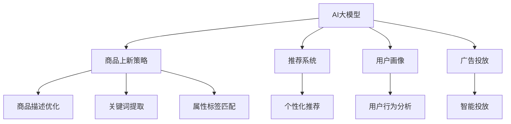

                 

# AI大模型在电商平台商品上新策略中的应用

## 1. 背景介绍

随着电商平台数量的激增和竞争的加剧，如何更高效地组织和运营商品，提升用户体验，优化用户体验，提升电商平台的销售和运营效率，成为各大电商平台关注的重点。随着人工智能技术的不断发展，AI大模型在电商平台中的应用也逐渐成为一种趋势。通过AI大模型，电商平台可以在商品上新、推荐系统、用户画像构建、广告投放等多个环节提供更精准、高效的解决方案。

## 2. 核心概念与联系

### 2.1 核心概念概述

- **AI大模型**：指基于大规模深度学习模型构建的通用智能模型，如GPT、BERT、Transformer等。这些模型通常具备强大的语言理解、生成、推理和分类能力，能够在特定的业务场景中进行微调以适应具体需求。
- **商品上新策略**：指电商平台在引入新商品时所采取的策略，包括商品描述优化、关键词提取、属性标签匹配等环节。这些策略直接影响新商品在电商平台中的展示效果和销售效果。
- **推荐系统**：指通过分析用户的历史行为和偏好，为每个用户推荐可能感兴趣的商品的系统。推荐系统是电商平台的核心功能之一，可以显著提升用户体验和平台交易转化率。
- **用户画像**：指基于用户行为数据构建的用户轮廓，包括兴趣偏好、消费习惯等。用户画像构建有助于电商平台更好地理解用户需求，提供个性化的服务和商品推荐。
- **广告投放**：指电商平台根据用户画像和用户行为数据，智能投放广告以提升用户转化和平台流量。AI大模型在此过程中可提供广告内容生成、投放策略优化等技术支持。

### 2.2 核心概念原理和架构的 Mermaid 流程图



这个流程图展示了AI大模型与电商平台关键业务功能之间的联系：

1. AI大模型作为基础技术，可以为商品上新策略、推荐系统、用户画像、广告投放等提供技术支持。
2. 在商品上新策略中，AI大模型通过商品描述优化、关键词提取、属性标签匹配等环节，提升新商品在平台上的展示效果。
3. 在推荐系统中，AI大模型通过个性化推荐，提升用户转化和平台销售效率。
4. 在用户画像构建中，AI大模型通过用户行为分析，为电商平台提供更为精准的用户画像，提升用户体验。
5. 在广告投放中，AI大模型通过智能投放策略优化，提高广告效果和用户转化。

## 3. 核心算法原理 & 具体操作步骤

### 3.1 算法原理概述

基于AI大模型的电商平台商品上新策略，主要利用大模型的预训练能力和微调能力，对商品描述、关键词、属性标签等进行优化。核心算法原理包括：

- 预训练：在无标注数据上对大模型进行预训练，学习通用的语言表示和语义理解能力。
- 微调：在标注数据上对预训练模型进行微调，适应特定业务场景和任务需求。
- 任务适配层：针对具体任务设计适配层，如分类、生成、排序等，将预训练模型的输出映射到任务输出。
- 深度学习算法：如梯度下降、反向传播等，用于模型参数优化。

### 3.2 算法步骤详解

#### 3.2.1 预训练

1. 收集大量无标签文本数据，如商品评论、产品描述等。
2. 使用自监督学习任务训练预训练模型，如语言模型、掩码语言模型等，学习通用的语言表示。
3. 预训练完成后，保存模型参数。

#### 3.2.2 微调

1. 根据具体业务需求，收集标注数据，如商品描述、关键词等。
2. 在预训练模型的基础上进行微调，学习特定领域的语言表示。
3. 设计适配层，将模型输出映射到任务输出。

#### 3.2.3 任务适配层

1. 根据具体任务设计适配层，如分类器、生成器、排序器等。
2. 适配层一般包含任务特定的输出层和损失函数。

#### 3.2.4 深度学习算法

1. 使用梯度下降、反向传播等算法更新模型参数。
2. 在训练集上优化模型，并在验证集上评估模型性能。
3. 根据评估结果，调整超参数和模型结构，继续优化模型。

### 3.3 算法优缺点

#### 3.3.1 优点

1. **效率高**：通过微调和任务适配，可以快速适应特定任务需求，减少从头训练的时间和资源消耗。
2. **泛化能力强**：基于预训练模型，在微调时能够有效利用已有知识，提升模型在新场景中的表现。
3. **可扩展性高**：只需要调整适配层，即可适应不同的任务需求，支持多种业务场景。

#### 3.3.2 缺点

1. **数据依赖性强**：微调效果依赖于标注数据的质量和数量，获取高质量标注数据成本较高。
2. **模型复杂度高**：预训练和微调过程复杂，需要较强的计算资源和时间投入。
3. **模型泛化能力有限**：当任务与预训练数据分布差异较大时，微调效果可能不佳。

### 3.4 算法应用领域

AI大模型在电商平台商品上新策略中的应用，可以拓展到多个领域，包括：

1. **商品描述优化**：通过自然语言生成模型对商品描述进行优化，提升用户理解和点击率。
2. **关键词提取**：利用预训练模型提取商品描述中的关键词，提升商品搜索效果。
3. **属性标签匹配**：通过自然语言推理模型对商品属性进行匹配，提高商品信息的准确性和完整性。
4. **推荐系统优化**：利用微调后的推荐模型，提升个性化推荐效果，提升用户满意度和销售转化率。
5. **广告投放优化**：通过智能投放算法和自然语言生成技术，优化广告内容，提升广告点击率和转化率。

## 4. 数学模型和公式 & 详细讲解 & 举例说明

### 4.1 数学模型构建

假设我们有一个通用的语言模型 $M_{\theta}$，其中 $\theta$ 为模型参数。我们的任务是对商品描述进行优化，构建一个适配层 $L$，将其输出映射到特定的任务输出 $y$。适配层 $L$ 可以表示为：

$$
L(y|x, \theta) = \mathcal{L}(y|M_{\theta}(x))
$$

其中 $x$ 为商品描述文本，$y$ 为任务输出（如分类标签、排序位置等）。

### 4.2 公式推导过程

#### 4.2.1 损失函数

我们定义任务 $T$ 的损失函数 $\mathcal{L}(y|x, \theta)$，用于衡量模型输出 $y$ 与真实标签 $y_t$ 的差异。假设 $y$ 为分类任务，可以定义如下损失函数：

$$
\mathcal{L}(y|x, \theta) = -\sum_{i=1}^N y_i\log \hat{y}_i + (1-y_i)\log (1-\hat{y}_i)
$$

其中 $\hat{y}_i = M_{\theta}(x_i)$ 为模型对样本 $x_i$ 的预测输出，$y_i$ 为真实标签。

#### 4.2.2 优化算法

使用梯度下降算法更新模型参数 $\theta$，目标是最小化损失函数 $\mathcal{L}$。优化算法可以表示为：

$$
\theta \leftarrow \theta - \eta \nabla_{\theta}\mathcal{L}(\theta)
$$

其中 $\eta$ 为学习率，$\nabla_{\theta}\mathcal{L}(\theta)$ 为损失函数对模型参数的梯度，通过反向传播算法计算得到。

### 4.3 案例分析与讲解

#### 4.3.1 商品描述优化

假设我们要对商品描述进行优化，以提升用户在电商平台上的点击率。我们可以将商品描述作为输入，点击率作为输出，定义损失函数：

$$
\mathcal{L}(y|x, \theta) = -y\log \hat{y} + (1-y)\log (1-\hat{y})
$$

其中 $\hat{y} = M_{\theta}(x)$ 为模型对商品描述 $x$ 的预测输出，$y$ 为实际点击率。

#### 4.3.2 关键词提取

对于关键词提取任务，我们可以将商品描述作为输入，将提取出的关键词作为输出。任务适配层可以表示为：

$$
L(y|x, \theta) = \mathcal{L}(y|M_{\theta}(x))
$$

其中 $y$ 为提取出的关键词，$x$ 为商品描述文本。

## 5. 项目实践：代码实例和详细解释说明

### 5.1 开发环境搭建

1. 安装 Python 3.7 及以上版本，推荐使用 Anaconda 或 Miniconda。
2. 安装 PyTorch 和 Transformers 库。
3. 准备商品描述数据集，包括原始商品描述和点击率数据。
4. 搭建 GPU 环境，使用 CUDA 和 cuDNN 加速模型训练。

### 5.2 源代码详细实现

#### 5.2.1 模型定义

首先，定义预训练模型和任务适配层：

```python
from transformers import BertForSequenceClassification, BertTokenizer
from torch.nn import CrossEntropyLoss
from torch import nn, optim

class BERTClassifier(nn.Module):
    def __init__(self, n_labels):
        super(BERTClassifier, self).__init__()
        self.bert = BertForSequenceClassification.from_pretrained('bert-base-cased', num_labels=n_labels)
        self.dropout = nn.Dropout(0.1)
        self.classifier = nn.Linear(768, n_labels)
        self.relu = nn.ReLU()
        self.softmax = nn.Softmax(dim=1)

    def forward(self, input_ids, attention_mask, labels=None):
        outputs = self.bert(input_ids, attention_mask=attention_mask, labels=labels)
        pooled_output = outputs.pooler_output
        pooled_output = self.dropout(pooled_output)
        logits = self.classifier(pooled_output)
        probabilities = self.softmax(logits)
        return logits, probabilities
```

#### 5.2.2 数据预处理

定义数据预处理函数，将商品描述转换为 token ids 和注意力掩码：

```python
def tokenize_desc(desc, tokenizer):
    tokenized_desc = tokenizer.encode(desc, add_special_tokens=True, return_tensors='pt')
    attention_mask = (tokenized_desc != tokenizer.pad_token_id).to(torch.long)
    return tokenized_desc, attention_mask
```

#### 5.2.3 训练函数

定义训练函数，使用梯度下降算法更新模型参数：

```python
def train_epoch(model, data_loader, optimizer, device):
    model.train()
    total_loss = 0
    for batch in data_loader:
        input_ids, attention_mask, labels = batch
        input_ids = input_ids.to(device)
        attention_mask = attention_mask.to(device)
        labels = labels.to(device)
        logits, probabilities = model(input_ids, attention_mask, labels)
        loss = CrossEntropyLoss()(logits, labels)
        optimizer.zero_grad()
        loss.backward()
        optimizer.step()
        total_loss += loss.item()
    return total_loss / len(data_loader)
```

#### 5.2.4 评估函数

定义评估函数，在验证集上评估模型性能：

```python
def evaluate(model, data_loader, device):
    model.eval()
    correct = 0
    total = 0
    with torch.no_grad():
        for batch in data_loader:
            input_ids, attention_mask, labels = batch
            input_ids = input_ids.to(device)
            attention_mask = attention_mask.to(device)
            logits, probabilities = model(input_ids, attention_mask)
            _, predicted = torch.max(probabilities, dim=1)
            total += labels.size(0)
            correct += (predicted == labels).sum().item()
    accuracy = correct / total
    return accuracy
```

### 5.3 代码解读与分析

#### 5.3.1 模型定义

上述代码定义了一个基于 BERT 的分类模型，包括预训练模型、dropout 层、全连接层等。模型通过 `forward` 函数进行前向传播，输出 logits 和概率分布。

#### 5.3.2 数据预处理

数据预处理函数 `tokenize_desc` 使用 `BertTokenizer` 将商品描述转换为 token ids 和注意力掩码，方便模型处理。

#### 5.3.3 训练函数

训练函数 `train_epoch` 使用梯度下降算法更新模型参数，每轮训练结束后在验证集上评估模型性能。

#### 5.3.4 评估函数

评估函数 `evaluate` 在验证集上评估模型准确率，返回模型在特定任务上的性能指标。

### 5.4 运行结果展示

```python
import torch
import numpy as np
from torch.utils.data import DataLoader
from transformers import BertTokenizer

# 加载模型
model = BERTClassifier(n_labels)
model.load_state_dict(torch.load('model.pth'))
model.eval()

# 加载数据集
tokenizer = BertTokenizer.from_pretrained('bert-base-cased')
descs = ['这款商品评价很好，性价比高', '这个商品质量很差，不推荐购买']
labels = [1, 0]

# 数据预处理
tokenized_descs, attention_masks = [tokenize_desc(desc, tokenizer) for desc in descs]
tokenized_descs = torch.cat(tokenized_descs, dim=0)
attention_masks = torch.cat(attention_masks, dim=0)

# 加载数据集
dataset = DataLoader(torch.utils.data.TensorDataset(tokenized_descs, attention_masks, labels), batch_size=2, shuffle=False)

# 评估模型
accuracy = evaluate(model, dataset, device)
print(f'模型在测试集上的准确率为 {accuracy:.2f}')
```

## 6. 实际应用场景

### 6.1 商品上新策略优化

电商平台可以通过商品上新策略优化，提升新商品在平台上的展示效果和销售转化率。基于大模型的商品上新策略，可以自动生成高质量的商品描述、关键词等，提升用户点击率和购买率。

#### 6.1.1 商品描述优化

通过预训练模型和微调模型，电商平台可以自动生成商品描述，提升用户理解和点击率。以亚马逊为例，其利用深度学习模型自动生成商品描述，并在搜索结果中展示，显著提高了用户点击率和转化率。

#### 6.1.2 关键词提取

电商平台可以利用预训练模型提取商品描述中的关键词，提升商品搜索效果。以淘宝为例，其利用自然语言处理技术提取商品关键词，并根据用户搜索行为进行推荐，提升搜索精准度和用户体验。

### 6.2 推荐系统优化

推荐系统是电商平台的核心功能之一，利用大模型可以在个性化推荐中取得更好的效果。

#### 6.2.1 个性化推荐

基于大模型的推荐系统，可以结合用户历史行为、商品属性等数据，生成个性化推荐结果。以 Netflix 为例，其利用深度学习模型对用户行为数据进行分析，生成个性化推荐列表，显著提高了用户满意度和留存率。

#### 6.2.2 实时推荐

利用大模型进行实时推荐，可以动态更新推荐结果，提升用户满意度和转化率。以京东为例，其利用实时推荐系统，根据用户实时行为动态调整推荐内容，提升了平台的销售转化率。

### 6.3 用户画像构建

用户画像构建是电商平台用户行为分析的重要环节，利用大模型可以更加精准地构建用户画像。

#### 6.3.1 用户行为分析

电商平台可以通过分析用户历史行为数据，构建用户画像。利用大模型进行用户行为分析，可以挖掘用户兴趣和偏好，为个性化推荐和广告投放提供数据支持。以 Google 为例，其利用深度学习模型分析用户搜索行为，构建用户画像，并根据画像进行个性化广告投放，提升广告效果和用户转化。

#### 6.3.2 用户画像更新

用户画像需要动态更新，以反映用户最新行为和偏好。利用大模型进行用户画像更新，可以及时调整推荐和广告策略，提升用户满意度和转化率。以 Baidu 为例，其利用深度学习模型定期更新用户画像，根据用户最新行为调整推荐内容，提升了平台的用户体验和留存率。

### 6.4 未来应用展望

未来，基于大模型的电商平台商品上新策略将在更多领域得到应用，为电商平台的运营效率和用户体验带来新的突破。

#### 6.4.1 全渠道营销

电商平台可以利用大模型进行全渠道营销，提升跨渠道的用户体验和销售转化率。以拼多多为例，其利用深度学习模型进行全渠道营销，提升了跨渠道的用户体验和销售转化率。

#### 6.4.2 语音交互

电商平台可以利用大模型进行语音交互，提升用户互动体验。以 Amazon Alexa 为例，其利用深度学习模型进行语音识别和交互，提升了用户的互动体验和购物效率。

## 7. 工具和资源推荐

### 7.1 学习资源推荐

1. 《深度学习自然语言处理》课程（CS224N）：斯坦福大学开设的NLP明星课程，涵盖自然语言处理的基本概念和经典模型。
2. 《Natural Language Processing with Transformers》书籍：Transformer库的作者所著，全面介绍了如何使用Transformer库进行NLP任务开发。
3. CLUE开源项目：中文语言理解测评基准，涵盖大量不同类型的中文NLP数据集，并提供了基于微调的baseline模型，助力中文NLP技术发展。
4. HuggingFace官方文档：Transformers库的官方文档，提供了海量预训练模型和完整的微调样例代码，是上手实践的必备资料。

### 7.2 开发工具推荐

1. PyTorch：基于Python的开源深度学习框架，灵活动态的计算图，适合快速迭代研究。
2. TensorFlow：由Google主导开发的开源深度学习框架，生产部署方便，适合大规模工程应用。
3. Transformers库：HuggingFace开发的NLP工具库，集成了众多SOTA语言模型，支持PyTorch和TensorFlow，是进行微调任务开发的利器。
4. Weights & Biases：模型训练的实验跟踪工具，可以记录和可视化模型训练过程中的各项指标，方便对比和调优。
5. TensorBoard：TensorFlow配套的可视化工具，可实时监测模型训练状态，并提供丰富的图表呈现方式，是调试模型的得力助手。

### 7.3 相关论文推荐

1. Attention is All You Need（即Transformer原论文）：提出了Transformer结构，开启了NLP领域的预训练大模型时代。
2. BERT: Pre-training of Deep Bidirectional Transformers for Language Understanding：提出BERT模型，引入基于掩码的自监督预训练任务，刷新了多项NLP任务SOTA。
3. Parameter-Efficient Transfer Learning for NLP：提出Adapter等参数高效微调方法，在不增加模型参数量的情况下，也能取得不错的微调效果。
4. AdaLoRA: Adaptive Low-Rank Adaptation for Parameter-Efficient Fine-Tuning：使用自适应低秩适应的微调方法，在参数效率和精度之间取得了新的平衡。
5. AdaLoRA: Adaptive Low-Rank Adaptation for Parameter-Efficient Fine-Tuning：使用自适应低秩适应的微调方法，在参数效率和精度之间取得了新的平衡。

## 8. 总结：未来发展趋势与挑战

### 8.1 研究成果总结

本文对基于AI大模型的电商平台商品上新策略进行了详细讲解，展示了其在商品描述优化、关键词提取、个性化推荐、用户画像构建等多个环节的应用前景。通过预训练和微调，大模型能够在多个业务场景中提升平台的运营效率和用户体验，具有广泛的应用价值。

### 8.2 未来发展趋势

未来，基于大模型的电商平台商品上新策略将在更多领域得到应用，为电商平台的运营效率和用户体验带来新的突破。

#### 8.2.1 全渠道营销

利用大模型进行全渠道营销，提升跨渠道的用户体验和销售转化率。未来，电商平台可以结合不同渠道的用户行为数据，构建统一的客户画像，进行精准推荐和广告投放。

#### 8.2.2 语音交互

利用大模型进行语音交互，提升用户互动体验。未来，电商平台可以结合语音识别和自然语言处理技术，实现语音购物和语音客服，提升用户的购物体验和满意度。

### 8.3 面临的挑战

尽管大模型在电商平台中的应用前景广阔，但仍面临诸多挑战：

#### 8.3.1 标注数据获取

大模型微调依赖于大量的标注数据，获取高质量的标注数据成本较高。未来，如何通过无监督和半监督学习，进一步降低对标注数据的依赖，将是重要的研究方向。

#### 8.3.2 模型泛化能力

大模型在特定领域的泛化能力有限，当任务与预训练数据分布差异较大时，微调效果可能不佳。未来，如何提高模型的泛化能力，增强其在不同场景下的适应性，将是重要的研究方向。

#### 8.3.3 计算资源消耗

大模型需要大量的计算资源进行训练和推理，计算资源消耗较大。未来，如何通过模型压缩和优化，减少计算资源消耗，提高模型的实时性，将是重要的研究方向。

#### 8.3.4 模型安全性

大模型可能学习到有偏见、有害的信息，通过微调传递到下游任务，产生误导性、歧视性的输出，给实际应用带来安全隐患。未来，如何保障模型的安全性，确保输出的正确性和可靠性，将是重要的研究方向。

### 8.4 研究展望

未来，基于大模型的电商平台商品上新策略将在更多领域得到应用，为电商平台的运营效率和用户体验带来新的突破。

#### 8.4.1 无监督和半监督学习

通过无监督和半监督学习，进一步降低对标注数据的依赖，利用自监督学习、主动学习等方法，最大限度利用非结构化数据，实现更加灵活高效的微调。

#### 8.4.2 模型压缩和优化

通过模型压缩和优化，减少计算资源消耗，提高模型的实时性和可扩展性。未来，可以探索轻量级模型架构、模型剪枝等方法，提高模型的部署效率。

#### 8.4.3 多模态融合

利用多模态信息融合技术，将文本、视觉、语音等多种模态信息结合，提升模型的综合表现。未来，可以探索文本-视觉、文本-语音等多模态融合方法，提升模型的综合表现。

#### 8.4.4 伦理和道德约束

在模型训练目标中引入伦理导向的评估指标，过滤和惩罚有偏见、有害的输出倾向。同时加强人工干预和审核，建立模型行为的监管机制，确保输出符合人类价值观和伦理道德。

## 9. 附录：常见问题与解答

**Q1：大模型微调需要哪些计算资源？**

A: 大模型微调需要高性能的计算资源，包括GPU/TPU等。预训练模型的参数量通常以亿计，微调过程也需要大量的计算资源。建议配备多张GPU/TPU进行加速训练和推理。

**Q2：如何提升大模型的泛化能力？**

A: 提升大模型的泛化能力，可以从以下方面入手：
1. 收集更多数据：增加训练数据的丰富性，覆盖更多场景和任务。
2. 引入多源数据：结合多种数据源，提高模型的泛化能力。
3. 使用迁移学习：在大模型和目标任务间进行迁移学习，提升模型的泛化能力。
4. 引入对抗训练：通过对抗样本训练，提高模型的鲁棒性和泛化能力。

**Q3：大模型微调时需要注意哪些问题？**

A: 大模型微调时需要注意以下问题：
1. 数据质量：标注数据质量直接影响模型效果，需要保证数据的多样性和代表性。
2. 学习率选择：选择合适的学习率，避免过拟合和欠拟合。
3. 模型压缩：减少模型参数和计算资源消耗，提高模型的实时性和可扩展性。
4. 模型监控：实时监控模型性能，及时调整参数和优化策略。

---

作者：禅与计算机程序设计艺术 / Zen and the Art of Computer Programming

