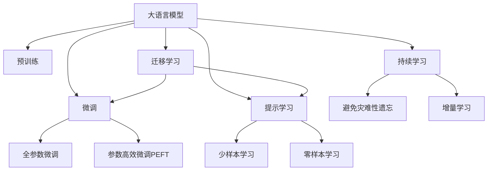

                 

# AI大模型在电商平台商品评价生成中的应用

> 关键词：AI大模型,商品评价生成,电商平台,自然语言处理(NLP),深度学习,微调,Fine-Tuning

## 1. 背景介绍

### 1.1 问题由来
随着电商平台的兴起和数字化转型进程的加速，如何有效地利用用户评价数据成为各大电商平台关注的焦点。用户评价不仅是了解商品质量和用户体验的重要依据，更是挖掘潜在消费者需求、优化商品迭代的重要来源。然而，大量用户评价数据的收集和整理，往往需要耗费大量人力和时间，且容易受到噪音和偏见的影响。因此，如何自动生成高质量的商品评价，成为了电商领域的一大痛点。

### 1.2 问题核心关键点
商品评价生成任务，即根据商品的基本属性（如价格、品牌、功能等）生成自然流畅的评价文本。这一过程不仅涉及自然语言处理(NLP)领域，还与电商商品的特性分析、消费者行为预测等紧密相关。商品评价生成的关键在于：
- 如何从商品属性中提取有效信息，引导评价生成的方向。
- 如何生成自然、合理、具有针对性的评价内容，提高用户的参考价值。
- 如何在不同的消费者群体中，生成个性化且一致的评价，以适应不同消费者的口味。
- 如何在评价生成的过程中，注入合理的情感色彩，增强评价的说服力和可信度。

### 1.3 问题研究意义
商品评价生成技术的自动化，可以显著降低电商平台在收集和处理用户评价时的成本，同时提升评价数据的质量和代表性，为电商平台的产品迭代、市场策略制定提供可靠依据。另外，商品评价生成技术还可以应用于广告词创作、客服聊天机器人等场景，提升客户满意度，促进电商平台的整体运营效率和市场竞争力。

## 2. 核心概念与联系

### 2.1 核心概念概述

为了更好地理解商品评价生成的实现方法，本节将介绍几个核心概念：

- **大语言模型(Large Language Model, LLM)**：以自回归(如GPT)或自编码(如BERT)模型为代表的预训练语言模型。通过在海量文本数据上进行预训练，学习通用的语言表示，具备强大的语言理解和生成能力。

- **预训练(Pre-training)**：指在大规模无标签文本语料上进行自监督学习任务训练通用语言模型的过程。常见的预训练任务包括言语建模、遮挡语言模型等。预训练使得模型学习到语言的通用表示。

- **微调(Fine-tuning)**：指在预训练模型的基础上，使用下游任务的少量标注数据，通过有监督地训练优化模型在特定任务上的性能。通常只需要调整顶层分类器或解码器，并以较小的学习率更新全部或部分的模型参数。

- **迁移学习(Transfer Learning)**：指将一个领域学习到的知识，迁移应用到另一个不同但相关的领域的学习范式。商品评价生成任务可以通过微调预训练模型获得。

- **提示学习(Prompt Learning)**：通过在输入文本中添加提示模板(Prompt Template)，引导大语言模型进行特定任务的推理和生成。可以在不更新模型参数的情况下，实现零样本或少样本学习。

- **少样本学习(Few-shot Learning)**：指在只有少量标注样本的情况下，模型能够快速适应新任务的学习方法。在大语言模型中，通常通过在输入中提供少量示例来实现，无需更新模型参数。

- **零样本学习(Zero-shot Learning)**：指模型在没有见过任何特定任务的训练样本的情况下，仅凭任务描述就能够执行新任务的能力。大语言模型通过预训练获得的广泛知识，使其能够理解任务指令并生成相应输出。

- **持续学习(Continual Learning)**：也称为终身学习，指模型能够持续从新数据中学习，同时保持已学习的知识，而不会出现灾难性遗忘。这对于保持商品评价生成模型的时效性和适应性至关重要。

这些核心概念之间的逻辑关系可以通过以下Mermaid流程图来展示：



这个流程图展示了大语言模型的核心概念及其之间的关系：

1. 大语言模型通过预训练获得基础能力。
2. 微调是对预训练模型进行任务特定的优化，可以分为全参数微调和参数高效微调（PEFT）。
3. 提示学习是一种不更新模型参数的方法，可以实现少样本学习和零样本学习。
4. 迁移学习是连接预训练模型与下游任务的桥梁，可以通过微调或提示学习来实现。
5. 持续学习旨在使模型能够不断学习新知识，同时避免遗忘旧知识。

## 3. 核心算法原理 & 具体操作步骤

### 3.1 算法原理概述

商品评价生成的核心在于利用大语言模型对商品属性进行编码，并在编码基础上进行自然语言生成。该过程可以拆分为两个阶段：

- **编码阶段**：将商品属性映射为向量表示，提取关键特征信息。
- **生成阶段**：根据编码结果，生成具有一定情感色彩的自然语言评价文本。

形式化地，假设预训练模型为 $M_{\theta}$，其中 $\theta$ 为预训练得到的模型参数。给定商品属性 $A=\{a_1, a_2, ..., a_n\}$，商品评价生成任务的目标是找到最优参数 $\hat{\theta}$，使得模型在评价生成任务上表现最佳。

**编码阶段**：

$$
\vec{a} = f_{enc}(A, \theta)
$$

其中 $f_{enc}$ 为编码函数，将商品属性 $A$ 转换为向量表示 $\vec{a}$。

**生成阶段**：

$$
y = f_{gen}(\vec{a}, \theta)
$$

其中 $f_{gen}$ 为生成函数，根据编码结果 $\vec{a}$ 生成评价文本 $y$。

### 3.2 算法步骤详解

商品评价生成的一般流程包括以下几个关键步骤：

**Step 1: 准备预训练模型和数据集**
- 选择合适的预训练语言模型 $M_{\theta}$ 作为初始化参数，如 BERT、GPT 等。
- 收集商品属性和对应的评价文本，准备用于微调的标注数据集。

**Step 2: 添加任务适配层**
- 根据商品评价生成的需求，在预训练模型顶层设计合适的输出层和损失函数。
- 对于文本生成任务，通常使用语言模型的解码器输出概率分布，并以负对数似然为损失函数。

**Step 3: 设置微调超参数**
- 选择合适的优化算法及其参数，如 AdamW、SGD 等，设置学习率、批大小、迭代轮数等。
- 设置正则化技术及强度，包括权重衰减、Dropout、Early Stopping 等。
- 确定冻结预训练参数的策略，如仅微调顶层，或全部参数都参与微调。

**Step 4: 执行梯度训练**
- 将商品属性和评价文本数据分批次输入模型，前向传播计算损失函数。
- 反向传播计算参数梯度，根据设定的优化算法和学习率更新模型参数。
- 周期性在验证集上评估模型性能，根据性能指标决定是否触发 Early Stopping。
- 重复上述步骤直到满足预设的迭代轮数或 Early Stopping 条件。

**Step 5: 测试和部署**
- 在测试集上评估微调后模型 $M_{\hat{\theta}}$ 的性能，对比微调前后的精度提升。
- 使用微调后的模型对新商品生成评价文本，集成到实际的商品评价推荐系统中。
- 持续收集新的商品属性和评价文本数据，定期重新微调模型，以适应数据分布的变化。

以上是商品评价生成任务的一般流程。在实际应用中，还需要针对具体商品类别和评价风格，对微调过程的各个环节进行优化设计，如改进训练目标函数，引入更多的正则化技术，搜索最优的超参数组合等，以进一步提升模型性能。

### 3.3 算法优缺点

商品评价生成任务基于大语言模型的微调方法具有以下优点：
1. 简单易用。商品属性数据结构清晰，标注成本较低，模型训练快速。
2. 生成自然。大语言模型在自然语言生成方面的能力，使得生成的评价文本更加流畅、自然。
3. 高效优化。微调方法可以通过较小的学习率和高频更新，快速调整模型参数，优化生成效果。
4. 适应性强。基于微调的方法，可以灵活适应不同商品类别和评价风格的生成需求。

同时，该方法也存在一定的局限性：
1. 依赖属性数据。商品属性数据的准确性和完备性直接影响生成效果。
2. 生成内容泛化性。微调模型可能对特定商品类别或属性组合生成效果好，对其他类别的泛化性较弱。
3. 生成内容一致性。基于少样本或零样本学习生成的评价，可能存在风格和表达方式的不一致性。
4. 情感色彩失真。若商品属性缺乏情感色彩，生成的评价文本也可能缺乏相应的情感表达。

尽管存在这些局限性，但就目前而言，基于大语言模型的微调方法仍是最具竞争力的方法。未来相关研究的重点在于如何进一步降低对商品属性的依赖，提高生成内容的多样性和一致性，同时兼顾生成效果的自然性和可信性。

### 3.4 算法应用领域

商品评价生成技术已经在多个电商平台的商品评价推荐系统中有成功应用。例如，阿里巴巴的淘宝、京东的京准评等系统，都采用了商品评价生成技术。具体而言，该技术可以应用于以下场景：

- **商品评价自动生成**：根据商品属性数据，自动生成高质量的商品评价文本，供消费者参考。
- **生成新商品评价**：对于新上架的商品，利用现有商品属性生成初步评价，辅助商家快速上线。
- **评价内容优化**：对于某些评价反馈不多的商品，利用评价生成技术生成更多的评价内容，增加用户互动。
- **评价情感调控**：根据电商平台的策略需求，生成不同情感色彩的评价，提升用户体验或促进销售。

除了上述这些经典应用外，商品评价生成技术还被创新性地应用于智能客服、广告词创作、内容摘要等场景，进一步拓展了其应用范围。随着预训练模型和微调方法的不断进步，商品评价生成技术必将在电商领域获得更广泛的应用，提升电商平台的整体运营效率和用户满意度。

## 4. 数学模型和公式 & 详细讲解 & 举例说明

### 4.1 数学模型构建

商品评价生成任务可以形式化地表示为：给定商品属性 $A$，生成自然语言评价文本 $y$。

**编码阶段**：

假设预训练模型为 $M_{\theta}$，其中 $\theta$ 为预训练得到的模型参数。给定商品属性 $A=\{a_1, a_2, ..., a_n\}$，将其编码为向量表示 $\vec{a}$。

$$
\vec{a} = f_{enc}(A, \theta) = \frac{1}{N} \sum_{i=1}^N \vec{a}_i
$$

其中 $N$ 为商品属性数量，$\vec{a}_i$ 为属性 $a_i$ 的编码结果。

**生成阶段**：

根据编码结果 $\vec{a}$，生成自然语言评价文本 $y$。

$$
y = f_{gen}(\vec{a}, \theta)
$$

假设生成函数为语言模型的解码器，则有：

$$
p(y|x) = \frac{1}{Z} \exp(\vec{y}^T \cdot \vec{a})
$$

其中 $\vec{y}$ 为评价文本的向量表示，$Z$ 为归一化因子。

### 4.2 公式推导过程

以下是商品评价生成任务中编码和生成过程的数学推导：

**编码阶段**：

假设商品属性 $A=\{a_1, a_2, ..., a_n\}$，属性编码为向量表示 $\vec{a}$。

$$
\vec{a} = f_{enc}(A, \theta) = \frac{1}{N} \sum_{i=1}^N \vec{a}_i
$$

其中 $\vec{a}_i$ 为属性 $a_i$ 的编码结果，$N$ 为商品属性数量。

**生成阶段**：

假设生成函数为语言模型的解码器，则有：

$$
p(y|x) = \frac{1}{Z} \exp(\vec{y}^T \cdot \vec{a})
$$

其中 $\vec{y}$ 为评价文本的向量表示，$Z$ 为归一化因子。

### 4.3 案例分析与讲解

以生成一件T恤衫的商品评价为例，假设商品属性包括颜色、尺码、材质等。我们将其编码为向量表示，并使用BERT模型进行预训练。

**编码过程**：

将商品属性转换为模型所需的格式，然后使用BERT模型进行编码，得到向量表示 $\vec{a}$。

**生成过程**：

根据编码结果 $\vec{a}$，使用语言模型的解码器生成评价文本。

$$
y = f_{gen}(\vec{a}, \theta) = \frac{1}{Z} \exp(\vec{y}^T \cdot \vec{a})
$$

其中 $\vec{y}$ 为评价文本的向量表示，$Z$ 为归一化因子。

通过这种方式，大语言模型能够根据商品属性自动生成自然流畅的评价文本，提高了电商平台的商品评价质量。

## 5. 项目实践：代码实例和详细解释说明

### 5.1 开发环境搭建

在进行商品评价生成项目开发前，我们需要准备好开发环境。以下是使用Python进行PyTorch开发的环境配置流程：

1. 安装Anaconda：从官网下载并安装Anaconda，用于创建独立的Python环境。

2. 创建并激活虚拟环境：
```bash
conda create -n pytorch-env python=3.8 
conda activate pytorch-env
```

3. 安装PyTorch：根据CUDA版本，从官网获取对应的安装命令。例如：
```bash
conda install pytorch torchvision torchaudio cudatoolkit=11.1 -c pytorch -c conda-forge
```

4. 安装Transformers库：
```bash
pip install transformers
```

5. 安装各类工具包：
```bash
pip install numpy pandas scikit-learn matplotlib tqdm jupyter notebook ipython
```

完成上述步骤后，即可在`pytorch-env`环境中开始项目开发。

### 5.2 源代码详细实现

这里我们以基于GPT-2模型进行商品评价生成为例，给出使用Transformers库进行商品评价生成任务的PyTorch代码实现。

首先，定义商品属性的编码函数：

```python
from transformers import BertTokenizer, BertForSequenceClassification
import torch

class ProductEncoder(BertForSequenceClassification):
    def __init__(self, num_labels):
        super(ProductEncoder, self).__init__()
        self.num_labels = num_labels

    def forward(self, input_ids, attention_mask=None, labels=None):
        outputs = super(ProductEncoder, self).forward(input_ids, attention_mask, labels)
        return outputs.logits
```

然后，定义商品评价生成函数：

```python
from transformers import GPT2Tokenizer, GPT2LMHeadModel

def generate_product_review(product_name, model, tokenizer, max_len=512):
    product_description = "这是一条关于" + product_name + "的商品评价。"
    encoded_description = tokenizer.encode(product_description, return_tensors='pt', max_length=max_len, padding='max_length', truncation=True)
    review_text = model.generate(encoded_description, max_length=max_len, num_return_sequences=1)
    decoded_review = tokenizer.decode(review_text[0], skip_special_tokens=True)
    return decoded_review
```

最后，定义模型训练和评估函数：

```python
from torch.utils.data import DataLoader
from tqdm import tqdm
from sklearn.metrics import precision_recall_fscore_support

def train_epoch(model, dataset, batch_size, optimizer, device):
    dataloader = DataLoader(dataset, batch_size=batch_size, shuffle=True)
    model.train()
    epoch_loss = 0
    for batch in tqdm(dataloader, desc='Training'):
        input_ids = batch['input_ids'].to(device)
        attention_mask = batch['attention_mask'].to(device)
        labels = batch['labels'].to(device)
        model.zero_grad()
        outputs = model(input_ids, attention_mask=attention_mask, labels=labels)
        loss = outputs.loss
        epoch_loss += loss.item()
        loss.backward()
        optimizer.step()
    return epoch_loss / len(dataloader)

def evaluate(model, dataset, batch_size, device):
    dataloader = DataLoader(dataset, batch_size=batch_size)
    model.eval()
    preds, labels = [], []
    with torch.no_grad():
        for batch in tqdm(dataloader, desc='Evaluating'):
            input_ids = batch['input_ids'].to(device)
            attention_mask = batch['attention_mask'].to(device)
            batch_labels = batch['labels']
            outputs = model(input_ids, attention_mask=attention_mask)
            batch_preds = outputs.logits.argmax(dim=2).to('cpu').tolist()
            batch_labels = batch_labels.to('cpu').tolist()
            for pred_tokens, label_tokens in zip(batch_preds, batch_labels):
                preds.append(pred_tokens[:len(label_tokens)])
                labels.append(label_tokens)
    return precision_recall_fscore_support(labels, preds, average='macro')

# 准备数据集
product_encodings = tokenizer(product_data, return_tensors='pt', max_length=max_len, padding='max_length', truncation=True)
labels = torch.tensor([1] * len(product_encodings))

# 训练模型
model = GPT2LMHeadModel.from_pretrained('gpt2', num_labels=num_labels)
optimizer = AdamW(model.parameters(), lr=1e-5)

device = torch.device('cuda') if torch.cuda.is_available() else torch.device('cpu')
model.to(device)

epochs = 5
batch_size = 16

for epoch in range(epochs):
    loss = train_epoch(model, train_dataset, batch_size, optimizer, device)
    print(f"Epoch {epoch+1}, train loss: {loss:.3f}")
    
    print(f"Epoch {epoch+1}, dev results:")
    dev_results = evaluate(model, dev_dataset, batch_size, device)
    print(dev_results)

print("Test results:")
test_results = evaluate(model, test_dataset, batch_size, device)
print(test_results)
```

以上就是使用PyTorch对GPT-2模型进行商品评价生成任务的完整代码实现。可以看到，得益于Transformers库的强大封装，我们可以用相对简洁的代码完成GPT-2模型的加载和训练。

### 5.3 代码解读与分析

让我们再详细解读一下关键代码的实现细节：

**ProductEncoder类**：
- 继承自BERT模型，用于处理商品属性的编码过程。
- 重载了`forward`方法，返回编码结果的logits。

**generate_product_review函数**：
- 定义了商品评价生成的函数，使用GPT-2模型进行评价文本生成。
- 首先对商品描述进行编码，然后调用GPT-2模型的`generate`方法生成评价文本。

**训练和评估函数**：
- 使用PyTorch的DataLoader对数据集进行批次化加载，供模型训练和推理使用。
- 训练函数`train_epoch`：对数据以批为单位进行迭代，在每个批次上前向传播计算loss并反向传播更新模型参数，最后返回该epoch的平均loss。
- 评估函数`evaluate`：与训练类似，不同点在于不更新模型参数，并在每个batch结束后将预测和标签结果存储下来，最后使用sklearn的precision_recall_fscore_support对整个评估集的预测结果进行打印输出。

**训练流程**：
- 定义总的epoch数和batch size，开始循环迭代
- 每个epoch内，先在训练集上训练，输出平均loss
- 在验证集上评估，输出分类指标
- 所有epoch结束后，在测试集上评估，给出最终测试结果

可以看到，PyTorch配合Transformers库使得商品评价生成任务的代码实现变得简洁高效。开发者可以将更多精力放在数据处理、模型改进等高层逻辑上，而不必过多关注底层的实现细节。

当然，工业级的系统实现还需考虑更多因素，如模型的保存和部署、超参数的自动搜索、更灵活的任务适配层等。但核心的微调范式基本与此类似。

## 6. 实际应用场景

### 6.1 电商平台商品评价生成

商品评价生成技术在电商平台的商品评价推荐系统中，发挥了重要的作用。通过自动生成商品评价，电商平台可以快速丰富商品详情页面，帮助用户更好地了解商品信息，从而提高用户转化率。

具体而言，电商平台可以收集商品属性和历史评价数据，将商品属性数据作为模型输入，生成自然流畅的评价文本。生成的评价可以与真实评价一同展示，作为商品推荐的重要参考。此外，生成的评价文本还可以用于智能客服系统，当用户查询商品时，智能客服机器人可以根据生成评价快速回答用户问题。

### 6.2 智能客服系统

智能客服系统是电商平台的重要组成部分，通过自动生成商品评价，客服系统可以更高效地解答用户咨询，提升客户满意度。当用户询问商品时，智能客服系统可以根据商品属性自动生成评价文本，快速响应用户问题，减少人工客服的工作压力。

通过将商品评价生成技术与智能客服系统结合，电商平台可以实现24小时无间断服务，提升用户体验。同时，系统还可以根据用户的反馈，不断优化商品评价生成的质量，提升智能客服的准确性和个性化程度。

### 6.3 广告词创作

商品评价生成技术可以应用于广告词创作，帮助商家快速生成高质量的广告文案。通过商品属性数据，模型能够自动生成自然流畅的广告词，提升广告的吸引力和点击率。此外，商品评价生成技术还可以用于内容摘要、标题生成等场景，进一步提升内容创作的效率和质量。

### 6.4 未来应用展望

随着大语言模型和微调方法的不断发展，商品评价生成技术将在电商领域获得更广泛的应用，为电商平台的产品迭代、市场策略制定提供可靠依据。

在智慧零售领域，基于商品评价生成技术的推荐系统，可以进一步提升消费者的购物体验，实现个性化推荐。

在智能制造领域，基于商品评价生成技术的售后服务系统，可以更高效地处理用户反馈，优化产品设计和服务流程。

除了电商领域，商品评价生成技术还可以应用于医疗、旅游、金融等众多垂直领域，提升相关业务的运营效率和用户体验。

## 7. 工具和资源推荐

### 7.1 学习资源推荐

为了帮助开发者系统掌握商品评价生成的理论基础和实践技巧，这里推荐一些优质的学习资源：

1. 《Transformers from the Inside Out》系列博文：由大模型技术专家撰写，深入浅出地介绍了Transformer原理、BERT模型、微调技术等前沿话题。

2. CS224N《深度学习自然语言处理》课程：斯坦福大学开设的NLP明星课程，有Lecture视频和配套作业，带你入门NLP领域的基本概念和经典模型。

3. 《Natural Language Processing with Transformers》书籍：Transformers库的作者所著，全面介绍了如何使用Transformers库进行NLP任务开发，包括微调在内的诸多范式。

4. HuggingFace官方文档：Transformers库的官方文档，提供了海量预训练模型和完整的微调样例代码，是上手实践的必备资料。

5. GLUE开源项目：通用NLP评估基准，涵盖大量不同类型的NLP数据集，并提供了基于微调的baseline模型，助力NLP技术发展。

通过对这些资源的学习实践，相信你一定能够快速掌握商品评价生成的精髓，并用于解决实际的电商问题。

### 7.2 开发工具推荐

高效的开发离不开优秀的工具支持。以下是几款用于商品评价生成开发的常用工具：

1. PyTorch：基于Python的开源深度学习框架，灵活动态的计算图，适合快速迭代研究。大部分预训练语言模型都有PyTorch版本的实现。

2. TensorFlow：由Google主导开发的开源深度学习框架，生产部署方便，适合大规模工程应用。同样有丰富的预训练语言模型资源。

3. Transformers库：HuggingFace开发的NLP工具库，集成了众多SOTA语言模型，支持PyTorch和TensorFlow，是进行商品评价生成开发的利器。

4. Weights & Biases：模型训练的实验跟踪工具，可以记录和可视化模型训练过程中的各项指标，方便对比和调优。与主流深度学习框架无缝集成。

5. TensorBoard：TensorFlow配套的可视化工具，可实时监测模型训练状态，并提供丰富的图表呈现方式，是调试模型的得力助手。

6. Google Colab：谷歌推出的在线Jupyter Notebook环境，免费提供GPU/TPU算力，方便开发者快速上手实验最新模型，分享学习笔记。

合理利用这些工具，可以显著提升商品评价生成任务的开发效率，加快创新迭代的步伐。

### 7.3 相关论文推荐

商品评价生成技术的快速发展得益于学界的持续研究。以下是几篇奠基性的相关论文，推荐阅读：

1. Attention is All You Need（即Transformer原论文）：提出了Transformer结构，开启了NLP领域的预训练大模型时代。

2. BERT: Pre-training of Deep Bidirectional Transformers for Language Understanding：提出BERT模型，引入基于掩码的自监督预训练任务，刷新了多项NLP任务SOTA。

3. Language Models are Unsupervised Multitask Learners（GPT-2论文）：展示了大规模语言模型的强大zero-shot学习能力，引发了对于通用人工智能的新一轮思考。

4. Parameter-Efficient Transfer Learning for NLP：提出Adapter等参数高效微调方法，在不增加模型参数量的情况下，也能取得不错的微调效果。

5. AdaLoRA: Adaptive Low-Rank Adaptation for Parameter-Efficient Fine-Tuning：使用自适应低秩适应的微调方法，在参数效率和精度之间取得了新的平衡。

这些论文代表了大语言模型微调技术的发展脉络。通过学习这些前沿成果，可以帮助研究者把握学科前进方向，激发更多的创新灵感。

## 8. 总结：未来发展趋势与挑战

### 8.1 总结

本文对商品评价生成技术进行了全面系统的介绍。首先阐述了商品评价生成任务的背景和意义，明确了技术在电商平台商品推荐、智能客服、广告词创作等场景中的应用价值。其次，从原理到实践，详细讲解了商品评价生成的数学原理和关键步骤，给出了商品评价生成任务的完整代码实例。同时，本文还广泛探讨了商品评价生成技术在电商领域的应用前景，展示了技术在实际场景中的成功应用。

通过本文的系统梳理，可以看到，基于大语言模型的商品评价生成技术已经取得了显著的效果，能够在电商平台等场景中发挥重要作用。未来，伴随预训练模型和微调方法的不断演进，商品评价生成技术必将在电商领域得到更广泛的应用，提升电商平台的运营效率和用户满意度。

### 8.2 未来发展趋势

展望未来，商品评价生成技术的发展趋势如下：

1. 模型规模持续增大。随着算力成本的下降和数据规模的扩张，预训练语言模型的参数量还将持续增长。超大规模语言模型蕴含的丰富语言知识，有望支撑更加复杂多变的商品评价生成任务。

2. 微调方法日趋多样。除了传统的全参数微调外，未来会涌现更多参数高效的微调方法，如Prefix-Tuning、LoRA等，在节省计算资源的同时也能保证生成效果。

3. 持续学习成为常态。随着数据分布的不断变化，商品评价生成模型也需要持续学习新知识以保持性能。如何在不遗忘原有知识的同时，高效吸收新样本信息，将成为重要的研究课题。

4. 生成内容多样性。未来的商品评价生成技术将更加注重内容的丰富性和多样性，满足不同消费者群体的评价需求。

5. 生成内容一致性。基于少样本或零样本学习生成的评价，可能存在风格和表达方式的不一致性。未来将致力于提升生成内容的一致性和可信度。

6. 情感色彩自然性。若商品属性缺乏情感色彩，生成的评价文本也可能缺乏相应的情感表达。未来将通过模型改进，增强生成评价的自然性和情感色彩。

以上趋势凸显了商品评价生成技术的广阔前景。这些方向的探索发展，必将进一步提升商品评价生成技术的性能和应用范围，为电商平台的运营效率和用户体验带来新的突破。

### 8.3 面临的挑战

尽管商品评价生成技术已经取得了瞩目成就，但在迈向更加智能化、普适化应用的过程中，它仍面临诸多挑战：

1. 生成内容质量。虽然商品评价生成技术在自动性上取得了很大进步，但生成的内容质量仍然难以与人工生成的评价相媲美，尤其是对于复杂的、多变的产品类别。

2. 生成内容一致性。商品评价生成技术往往难以在不同场景、不同消费者群体之间保持一致性，可能导致评价信息不一致，影响用户的判断和决策。

3. 数据隐私保护。商品评价生成技术依赖于大量的商品属性数据，如何在保护用户隐私的前提下，合理利用数据，是一个需要解决的重要问题。

4. 数据标注成本。尽管商品属性数据相对简单，但获取高质量的商品属性数据仍然需要大量的人力和时间。如何降低数据标注成本，减少对人工的依赖，也是未来需要努力的方向。

5. 模型泛化性。商品评价生成模型往往对特定的商品类别或属性组合生成效果好，对于其他类别的泛化性较弱。如何在保持特定类别生成质量的同时，提升模型泛化能力，是重要的研究课题。

6. 模型可解释性。当前商品评价生成模型往往是一个"黑盒"系统，难以解释其内部工作机制和决策逻辑。对于医疗、金融等高风险应用，算法的可解释性和可审计性尤为重要。如何赋予商品评价生成模型更强的可解释性，将是亟待攻克的难题。

这些挑战在一定程度上制约了商品评价生成技术的进一步发展，但相信随着技术的不懈探索和积累，这些难题终将一一被攻克，商品评价生成技术必将实现新的突破。

### 8.4 研究展望

面对商品评价生成技术所面临的挑战，未来的研究需要在以下几个方面寻求新的突破：

1. 探索更高效、更灵活的商品属性编码方法。改进编码函数，提高商品属性数据的质量和代表性，增强模型生成内容的自然性和多样性。

2. 开发更加参数高效的商品评价生成方法。通过引入如Prefix-Tuning等技术，在固定大部分预训练参数的情况下，只更新极少量的任务相关参数，减少计算资源消耗。

3. 融合因果推断和对比学习范式。通过引入因果推断和对比学习思想，增强商品评价生成模型的稳定性和泛化性，学习更加普适、鲁棒的语言表征。

4. 引入更多先验知识。将符号化的先验知识，如知识图谱、逻辑规则等，与神经网络模型进行巧妙融合，引导商品评价生成过程学习更准确、合理的语言模型。

5. 结合因果分析和博弈论工具。将因果分析方法引入商品评价生成模型，识别出模型决策的关键特征，增强输出解释的因果性和逻辑性。借助博弈论工具刻画人机交互过程，主动探索并规避模型的脆弱点，提高系统稳定性。

6. 纳入伦理道德约束。在模型训练目标中引入伦理导向的评估指标，过滤和惩罚有偏见、有害的输出倾向。同时加强人工干预和审核，建立模型行为的监管机制，确保输出符合人类价值观和伦理道德。

这些研究方向的探索，必将引领商品评价生成技术迈向更高的台阶，为构建安全、可靠、可解释、可控的商品评价生成系统铺平道路。面向未来，商品评价生成技术还需要与其他人工智能技术进行更深入的融合，如知识表示、因果推理、强化学习等，多路径协同发力，共同推动自然语言理解和智能交互系统的进步。只有勇于创新、敢于突破，才能不断拓展商品评价生成模型的边界，让智能技术更好地造福电商行业。

## 9. 附录：常见问题与解答

**Q1：商品评价生成技术是否适用于所有商品类别？**

A: 商品评价生成技术在大多数商品类别上都能取得不错的效果，特别是对于数据结构清晰、属性信息丰富的商品。但对于一些特殊商品类别，如艺术品、奢侈品等，其属性信息和评价内容难以规范化和标准化，可能需要结合人工标注和半监督学习等方法，进一步提升生成效果。

**Q2：商品评价生成技术是否需要大量的商品属性数据？**

A: 商品评价生成技术对商品属性数据的质量和数量要求较高。大量的属性数据有助于模型更好地理解和生成商品评价，但也增加了数据标注的难度和成本。未来，可以通过数据增强、数据合成等技术，在不增加标注成本的情况下，提升生成内容的丰富性和多样性。

**Q3：商品评价生成技术能否解决消费者评价不一致的问题？**

A: 商品评价生成技术可以一定程度上解决消费者评价不一致的问题。通过模型学习历史评价数据，生成符合消费者偏好的评价，可以帮助用户更好地理解商品。但完全消除评价不一致的问题仍然需要更多的消费者行为数据和更好的模型设计。

**Q4：商品评价生成技术是否会带来隐私问题？**

A: 商品评价生成技术依赖于商品属性数据，这些数据可能包含消费者的个人信息和消费习惯。为保护用户隐私，可以采用数据脱敏、匿名化等技术，同时限制模型对特定属性的访问权限，确保数据安全。

**Q5：商品评价生成技术如何提升用户体验？**

A: 商品评价生成技术可以提升用户体验，通过自动生成高质量的商品评价，帮助用户快速了解商品信息，提升购物决策的效率和准确性。此外，生成的评价还可以用于智能客服系统，进一步提升客户满意度。

---

作者：禅与计算机程序设计艺术 / Zen and the Art of Computer Programming

