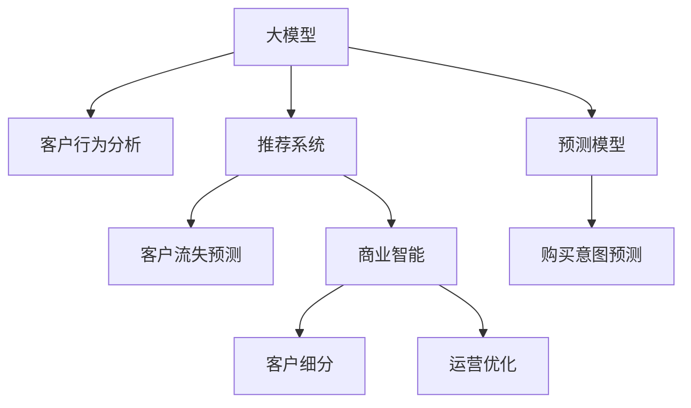

                 

# AI大模型在电商平台客户生命周期管理中的应用

> 关键词：大模型,客户生命周期管理,电商平台,自然语言处理,推荐系统,预测模型,商业智能,决策支持

## 1. 背景介绍

### 1.1 问题由来
随着电子商务的蓬勃发展，电商平台逐渐成为消费者在线购物的主要场所。对于电商企业而言，客户生命周期管理（Customer Lifecycle Management, CLM）是提升销售转化率、增加客户留存率的关键环节。如何通过数据驱动的方式，系统性地跟踪和管理客户，挖掘潜在价值，及时调整营销策略，提升客户体验，一直是电商企业关注的焦点。

大模型的应用，为电商平台在客户生命周期管理中带来了新的解决方案。借助大模型强大的数据处理能力和复杂的语义理解能力，电商平台可以更准确地理解客户行为和需求，实现更精准的客户细分和个性化推荐，提升客户满意度和忠诚度，最终实现业绩增长。

### 1.2 问题核心关键点
客户生命周期管理涉及客户获取、客户激活、客户成长、客户保留和客户流失等多个阶段。大模型在电商平台中的应用，主要围绕客户行为分析、推荐系统、预测模型和商业智能等多个方面展开。

- **客户行为分析**：通过分析客户的浏览、购买、评价等行为数据，识别出客户的偏好和需求，为个性化推荐和营销策略调整提供依据。
- **推荐系统**：结合用户画像、历史行为和实时数据，实时动态调整推荐策略，提升客户转化率和满意度。
- **预测模型**：利用大模型进行用户流失预测、购买意图预测、客户满意度预测等，提前识别潜在风险，制定应对措施。
- **商业智能**：通过数据分析和挖掘，生成可视化报表和决策支持信息，帮助企业快速响应市场变化，优化运营策略。

本文将重点探讨如何利用大模型在电商平台中进行客户生命周期管理，并结合实际案例，给出具体的技术实现和应用建议。

## 2. 核心概念与联系

### 2.1 核心概念概述

为更好地理解大模型在客户生命周期管理中的应用，本节将介绍几个密切相关的核心概念：

- **大模型(Large Model)**：指基于Transformer等架构构建的，参数量在亿级以上的深度学习模型。如GPT、BERT、T5等。
- **客户生命周期管理(Customer Lifecycle Management, CLM)**：从客户首次接触品牌开始，到客户流失为止的全生命周期管理过程。包括客户获取、激活、成长、保留和流失等多个阶段。
- **推荐系统(Recommendation System)**：利用用户行为数据，生成个性化推荐内容，提升用户满意度和转化率的系统。
- **预测模型(Prediction Model)**：通过机器学习算法，对未来事件（如客户流失、购买行为等）进行预测的模型。
- **商业智能(Business Intelligence, BI)**：利用数据仓库、OLAP、数据挖掘等技术，帮助企业从数据中发现知识、洞察趋势，并形成决策支持信息。

这些核心概念之间的逻辑关系可以通过以下Mermaid流程图来展示：



这个流程图展示了大模型在客户生命周期管理中的应用路径：

1. 大模型通过学习海量客户行为数据，生成对客户行为的深度理解。
2. 结合推荐系统，根据客户需求提供个性化推荐。
3. 预测模型利用大模型的预测能力，提前识别风险和机会。
4. 商业智能系统利用分析结果，辅助企业优化运营策略。

## 3. 核心算法原理 & 具体操作步骤

### 3.1 算法原理概述

基于大模型的电商平台客户生命周期管理，核心思想是利用大模型强大的数据处理和语义理解能力，对客户数据进行深度学习，从而提升客户生命周期管理的各个环节。

具体来说，大模型在客户生命周期管理中的作用包括：

1. **客户行为分析**：通过学习用户历史行为数据，生成对用户行为的深度理解，包括兴趣偏好、购买历史、评价反馈等。
2. **推荐系统**：利用用户行为数据，结合大模型生成的用户画像，生成个性化推荐内容，提升用户满意度和转化率。
3. **预测模型**：通过分析用户行为数据，利用大模型进行用户流失预测、购买意图预测等，提前识别风险和机会。
4. **商业智能**：利用大模型对客户数据进行深度挖掘和分析，生成决策支持信息，辅助企业优化运营策略。

### 3.2 算法步骤详解

**Step 1: 数据准备**

- **数据收集**：收集平台上的客户数据，包括浏览记录、购买记录、评价记录、客服记录等，构建立体化的用户画像。
- **数据清洗**：去除缺失值、异常值，清洗噪声数据，保证数据质量。
- **数据标注**：为数据打上标签，如用户行为标签、产品分类标签、时间标签等，为后续模型训练提供指导。

**Step 2: 模型训练**

- **选择模型**：选择合适的预训练模型，如BERT、GPT等，作为客户行为分析的基础模型。
- **数据划分**：将数据划分为训练集、验证集和测试集，确保模型在不同数据集上的泛化能力。
- **模型微调**：在训练集上对模型进行微调，调整参数，提升模型性能。

**Step 3: 应用实践**

- **客户行为分析**：利用微调后的模型，对用户行为数据进行分析，生成用户画像。
- **推荐系统**：结合用户画像，利用模型生成个性化推荐。
- **预测模型**：利用模型对客户流失、购买意图等进行预测，提前识别风险和机会。
- **商业智能**：利用分析结果，生成可视化报表和决策支持信息，辅助企业优化运营策略。

**Step 4: 效果评估**

- **性能评估**：在测试集上评估模型性能，如准确率、召回率、F1分数等。
- **A/B测试**：对模型效果进行A/B测试，比较不同模型或策略的优劣。
- **持续优化**：根据测试结果，调整模型参数，进行持续优化。

### 3.3 算法优缺点

大模型在客户生命周期管理中的应用，具有以下优点：

- **强大的数据处理能力**：大模型能够处理海量数据，生成深度学习特征，提升模型泛化能力。
- **丰富的语义理解能力**：通过自然语言处理技术，大模型能够理解复杂文本数据，提取用户意图和需求。
- **灵活的个性化推荐**：结合用户画像和历史行为，大模型能够生成个性化推荐内容，提升用户满意度。
- **精确的预测能力**：利用预测模型，大模型能够对未来事件进行精确预测，提前识别风险和机会。

同时，也存在以下缺点：

- **高昂的计算成本**：大模型参数量巨大，训练和推理成本高昂。
- **模型解释性不足**：大模型的决策过程较为复杂，难以解释其内部工作机制。
- **数据隐私问题**：客户数据隐私保护是大模型应用时必须重视的问题，需采取严格的隐私保护措施。

### 3.4 算法应用领域

大模型在客户生命周期管理中的应用，主要涵盖以下领域：

- **客户行为分析**：应用于电商平台，分析用户浏览、购买、评价等行为数据，生成用户画像。
- **推荐系统**：应用于电商平台，生成个性化推荐内容，提升用户满意度和转化率。
- **预测模型**：应用于电商企业，进行用户流失预测、购买意图预测等，提前识别风险和机会。
- **商业智能**：应用于电商企业，利用分析结果，生成可视化报表和决策支持信息，辅助企业优化运营策略。

这些应用领域覆盖了客户生命周期管理的各个环节，为大模型的应用提供了丰富的场景。

## 4. 数学模型和公式 & 详细讲解

### 4.1 数学模型构建

本节将使用数学语言对大模型在客户生命周期管理中的应用进行更加严格的刻画。

记客户数据为 $\mathcal{D} = \{(x_i, y_i)\}_{i=1}^N$，其中 $x_i$ 为输入特征，$y_i$ 为输出标签。假设大模型为 $M_{\theta}$，其中 $\theta$ 为模型参数。

**客户行为分析**：定义客户行为分析模型为 $M_{\theta_{\text{behavior}}}$，目标是最小化预测误差 $L_{\text{behavior}}$。

$$
L_{\text{behavior}} = \frac{1}{N} \sum_{i=1}^N \ell(M_{\theta_{\text{behavior}}}(x_i), y_i)
$$

**推荐系统**：定义推荐模型为 $M_{\theta_{\text{recommend}}}$，目标是最小化推荐误差 $L_{\text{recommend}}$。

$$
L_{\text{recommend}} = \frac{1}{N} \sum_{i=1}^N \ell(M_{\theta_{\text{recommend}}}(x_i), y_i)
$$

**预测模型**：定义预测模型为 $M_{\theta_{\text{predict}}}$，目标是最小化预测误差 $L_{\text{predict}}$。

$$
L_{\text{predict}} = \frac{1}{N} \sum_{i=1}^N \ell(M_{\theta_{\text{predict}}}(x_i), y_i)
$$

其中，$\ell$ 为损失函数，如交叉熵损失、均方误差损失等。

### 4.2 公式推导过程

**客户行为分析**：假设客户行为分析模型为 $M_{\theta_{\text{behavior}}}$，输入为 $x_i$，输出为 $y_i$。假设模型为多层神经网络，其预测函数为 $f_{\theta_{\text{behavior}}}(x_i)$，则预测误差为：

$$
\ell(M_{\theta_{\text{behavior}}}(x_i), y_i) = \mathbb{E}_{y_i|x_i} [\log f_{\theta_{\text{behavior}}}(x_i)] + \lambda \mathbb{E}_{x_i} ||\nabla_{\theta_{\text{behavior}}}f_{\theta_{\text{behavior}}}(x_i)||^2
$$

其中，$\lambda$ 为正则化系数，$||\cdot||$ 为向量范数。

**推荐系统**：假设推荐系统模型为 $M_{\theta_{\text{recommend}}$，输入为 $x_i$，输出为 $y_i$。假设模型为多层神经网络，其预测函数为 $g_{\theta_{\text{recommend}}}(x_i)$，则推荐误差为：

$$
\ell(M_{\theta_{\text{recommend}}}(x_i), y_i) = \mathbb{E}_{y_i|x_i} [\log g_{\theta_{\text{recommend}}}(x_i)] + \lambda \mathbb{E}_{x_i} ||\nabla_{\theta_{\text{recommend}}}g_{\theta_{\text{recommend}}}(x_i)||^2
$$

**预测模型**：假设预测模型为 $M_{\theta_{\text{predict}}}$，输入为 $x_i$，输出为 $y_i$。假设模型为多层神经网络，其预测函数为 $h_{\theta_{\text{predict}}}(x_i)$，则预测误差为：

$$
\ell(M_{\theta_{\text{predict}}}(x_i), y_i) = \mathbb{E}_{y_i|x_i} [\log h_{\theta_{\text{predict}}}(x_i)] + \lambda \mathbb{E}_{x_i} ||\nabla_{\theta_{\text{predict}}}h_{\theta_{\text{predict}}}(x_i)||^2
$$

### 4.3 案例分析与讲解

以电商平台中的用户流失预测为例，假设数据集为 $\mathcal{D} = \{(x_i, y_i)\}_{i=1}^N$，其中 $x_i$ 为用户行为特征，$y_i$ 为流失标签。假设模型为 $M_{\theta_{\text{predict}}}$。

定义预测误差为：

$$
\ell(M_{\theta_{\text{predict}}}(x_i), y_i) = \log \frac{p(y_i=1|x_i)}{1-p(y_i=1|x_i)} + \lambda ||\nabla_{\theta_{\text{predict}}}p(y_i=1|x_i)||^2
$$

其中，$p(y_i=1|x_i)$ 为流失预测概率，$\nabla_{\theta_{\text{predict}}}p(y_i=1|x_i)$ 为预测概率对模型参数的梯度。

通过最小化预测误差，模型学习到用户流失的概率分布，从而实现对客户流失的预测。

## 5. 项目实践：代码实例和详细解释说明

### 5.1 开发环境搭建

在进行大模型应用开发前，我们需要准备好开发环境。以下是使用Python进行PyTorch开发的环境配置流程：

1. 安装Anaconda：从官网下载并安装Anaconda，用于创建独立的Python环境。

2. 创建并激活虚拟环境：
```bash
conda create -n pytorch-env python=3.8 
conda activate pytorch-env
```

3. 安装PyTorch：根据CUDA版本，从官网获取对应的安装命令。例如：
```bash
conda install pytorch torchvision torchaudio cudatoolkit=11.1 -c pytorch -c conda-forge
```

4. 安装相关库：
```bash
pip install torch transformers sklearn pandas matplotlib scikit-learn torchmetrics
```

完成上述步骤后，即可在`pytorch-env`环境中开始大模型应用开发。

### 5.2 源代码详细实现

这里我们以电商平台中的用户流失预测为例，给出使用PyTorch和Transformers库进行大模型微调和应用开发的代码实现。

首先，定义数据处理函数：

```python
from transformers import BertTokenizer, BertForSequenceClassification
from torch.utils.data import Dataset, DataLoader
import torch
import pandas as pd
from sklearn.model_selection import train_test_split
import numpy as np

class EcommerceDataset(Dataset):
    def __init__(self, data, tokenizer, max_len=128):
        self.tokenizer = tokenizer
        self.data = data
        self.data = self.tokenize(data)
        self.max_len = max_len
        
    def __len__(self):
        return len(self.data)
    
    def __getitem__(self, idx):
        row = self.data.iloc[idx]
        text = row['user_behavior']
        label = row['churn']
        
        encoding = self.tokenizer(text, return_tensors='pt', max_length=self.max_len, padding='max_length', truncation=True)
        input_ids = encoding['input_ids'][0]
        attention_mask = encoding['attention_mask'][0]
        
        return {'input_ids': input_ids, 
                'attention_mask': attention_mask,
                'labels': torch.tensor(label, dtype=torch.long)}
```

然后，定义模型和优化器：

```python
from transformers import AdamW

model = BertForSequenceClassification.from_pretrained('bert-base-uncased', num_labels=2)
optimizer = AdamW(model.parameters(), lr=2e-5)
```

接着，定义训练和评估函数：

```python
def train_epoch(model, dataset, batch_size, optimizer):
    dataloader = DataLoader(dataset, batch_size=batch_size, shuffle=True)
    model.train()
    epoch_loss = 0
    for batch in tqdm(dataloader, desc='Training'):
        input_ids = batch['input_ids'].to(device)
        attention_mask = batch['attention_mask'].to(device)
        labels = batch['labels'].to(device)
        model.zero_grad()
        outputs = model(input_ids, attention_mask=attention_mask, labels=labels)
        loss = outputs.loss
        epoch_loss += loss.item()
        loss.backward()
        optimizer.step()
    return epoch_loss / len(dataloader)

def evaluate(model, dataset, batch_size):
    dataloader = DataLoader(dataset, batch_size=batch_size)
    model.eval()
    preds, labels = [], []
    with torch.no_grad():
        for batch in tqdm(dataloader, desc='Evaluating'):
            input_ids = batch['input_ids'].to(device)
            attention_mask = batch['attention_mask'].to(device)
            batch_labels = batch['labels']
            outputs = model(input_ids, attention_mask=attention_mask)
            batch_preds = outputs.logits.argmax(dim=1).to('cpu').tolist()
            batch_labels = batch_labels.to('cpu').tolist()
            for pred, label in zip(batch_preds, batch_labels):
                preds.append(pred)
                labels.append(label)
                
    print(classification_report(labels, preds))
```

最后，启动训练流程并在测试集上评估：

```python
epochs = 5
batch_size = 16

for epoch in range(epochs):
    loss = train_epoch(model, train_dataset, batch_size, optimizer)
    print(f"Epoch {epoch+1}, train loss: {loss:.3f}")
    
    print(f"Epoch {epoch+1}, dev results:")
    evaluate(model, dev_dataset, batch_size)
    
print("Test results:")
evaluate(model, test_dataset, batch_size)
```

以上就是使用PyTorch和Transformers库对大模型进行用户流失预测的完整代码实现。可以看到，利用Transformers库，我们可以用相对简洁的代码完成BERT模型的加载和微调。

### 5.3 代码解读与分析

让我们再详细解读一下关键代码的实现细节：

**EcommerceDataset类**：
- `__init__`方法：初始化数据、分词器等关键组件。
- `__len__`方法：返回数据集的样本数量。
- `__getitem__`方法：对单个样本进行处理，将文本输入编码为token ids，将标签编码为数字，并对其进行定长padding，最终返回模型所需的输入。

**模型和优化器**：
- 使用PyTorch的`BertForSequenceClassification`加载预训练模型BERT，用于序列分类任务。
- 设置AdamW优化器，并调整学习率。

**训练和评估函数**：
- 使用PyTorch的DataLoader对数据集进行批次化加载，供模型训练和推理使用。
- 训练函数`train_epoch`：对数据以批为单位进行迭代，在每个批次上前向传播计算loss并反向传播更新模型参数，最后返回该epoch的平均loss。
- 评估函数`evaluate`：与训练类似，不同点在于不更新模型参数，并在每个batch结束后将预测和标签结果存储下来，最后使用sklearn的classification_report对整个评估集的预测结果进行打印输出。

**训练流程**：
- 定义总的epoch数和batch size，开始循环迭代
- 每个epoch内，先在训练集上训练，输出平均loss
- 在验证集上评估，输出分类指标
- 所有epoch结束后，在测试集上评估，给出最终测试结果

可以看到，PyTorch配合Transformers库使得大模型的微调代码实现变得简洁高效。开发者可以将更多精力放在数据处理、模型改进等高层逻辑上，而不必过多关注底层的实现细节。

当然，工业级的系统实现还需考虑更多因素，如模型的保存和部署、超参数的自动搜索、更灵活的任务适配层等。但核心的微调范式基本与此类似。

## 6. 实际应用场景

### 6.1 智能客服系统

基于大模型的智能客服系统，可以广泛应用于电商平台的客户服务中。智能客服系统能够24小时不间断地响应客户咨询，提供即时、准确的客服支持，提升客户体验和满意度。

在技术实现上，可以收集历史客服对话记录，将问题和最佳答复构建成监督数据，在此基础上对预训练对话模型进行微调。微调后的对话模型能够自动理解用户意图，匹配最合适的答案模板进行回复。对于客户提出的新问题，还可以接入检索系统实时搜索相关内容，动态组织生成回答。如此构建的智能客服系统，能大幅提升客户咨询体验和问题解决效率。

### 6.2 个性化推荐系统

个性化推荐系统是大模型在电商平台中的重要应用之一。通过分析客户的历史行为数据，大模型可以生成用户画像，结合实时数据进行动态推荐，提升客户满意度和转化率。

在推荐系统中，大模型可以从用户画像、历史行为和实时数据中提取特征，生成推荐向量，并与物品向量进行相似度匹配，生成推荐列表。通过A/B测试等手段，持续优化模型参数，提升推荐效果。

### 6.3 客户流失预测

客户流失预测是大模型在电商平台中的另一重要应用。通过分析客户的历史行为和反馈，大模型可以预测客户流失概率，提前识别风险，制定应对措施。

在预测模型中，大模型可以从用户行为数据中提取特征，如浏览次数、购买次数、评价评分等，生成预测概率。通过定期评估模型效果，调整模型参数，实现客户流失的精准预测。

### 6.4 商业智能报表

商业智能报表是大模型在电商平台中的辅助应用之一。通过分析客户数据，大模型可以生成可视化报表和决策支持信息，帮助企业了解客户行为和市场变化，优化运营策略。

在商业智能报表中，大模型可以从客户数据中提取关键指标，如转化率、复购率、客户满意度等，生成趋势图、热力图等可视化报表，并结合业务知识生成决策支持信息，如客户细分、营销策略调整等。

## 7. 工具和资源推荐

### 7.1 学习资源推荐

为了帮助开发者系统掌握大模型在电商平台客户生命周期管理中的应用，这里推荐一些优质的学习资源：

1. 《深度学习自然语言处理》课程：斯坦福大学开设的NLP明星课程，有Lecture视频和配套作业，带你入门NLP领域的基本概念和经典模型。
2. 《Transformer from the Inside to the Outside》：大模型技术专家撰写，深入浅出地介绍了Transformer原理、BERT模型、微调技术等前沿话题。
3. 《Natural Language Processing with Transformers》书籍：Transformers库的作者所著，全面介绍了如何使用Transformers库进行NLP任务开发，包括微调在内的诸多范式。
4. 《Python for Deep Learning》：深度学习入门的经典书籍，详细介绍了深度学习模型的构建和训练。
5. Kaggle平台：通过Kaggle比赛和数据集，实践大模型在客户生命周期管理中的应用，获取实际场景的微调经验和教训。

通过对这些资源的学习实践，相信你一定能够快速掌握大模型在电商平台客户生命周期管理中的应用，并用于解决实际的NLP问题。

### 7.2 开发工具推荐

高效的开发离不开优秀的工具支持。以下是几款用于大模型在电商平台客户生命周期管理中应用开发的常用工具：

1. PyTorch：基于Python的开源深度学习框架，灵活动态的计算图，适合快速迭代研究。
2. TensorFlow：由Google主导开发的开源深度学习框架，生产部署方便，适合大规模工程应用。
3. Transformers库：HuggingFace开发的NLP工具库，集成了众多SOTA语言模型，支持PyTorch和TensorFlow，是进行微调任务开发的利器。
4. Weights & Biases：模型训练的实验跟踪工具，可以记录和可视化模型训练过程中的各项指标，方便对比和调优。
5. Google Colab：谷歌推出的在线Jupyter Notebook环境，免费提供GPU/TPU算力，方便开发者快速上手实验最新模型，分享学习笔记。

合理利用这些工具，可以显著提升大模型在电商平台客户生命周期管理中的应用开发效率，加快创新迭代的步伐。

### 7.3 相关论文推荐

大模型在电商平台客户生命周期管理中的应用研究，受学界的持续关注。以下是几篇奠基性的相关论文，推荐阅读：

1. "Customer Churn Prediction Using Deep Learning"：利用深度学习模型进行客户流失预测的研究，开创了客户生命周期管理中的预测模型应用。
2. "A Deep Learning Framework for Personalized Recommendation Systems"：提出基于深度学习的推荐系统框架，利用用户行为数据进行个性化推荐。
3. "An AI-driven Customer Support System"：基于深度学习和大模型的智能客服系统研究，提升客户服务体验。
4. "Deep Learning for Customer Segmentation and Targeted Marketing"：利用深度学习进行客户细分和目标营销的研究，提高市场营销效果。
5. "Natural Language Processing and Recommendation Systems"：探索自然语言处理和推荐系统的结合，提升推荐效果和客户体验。

这些论文代表了大模型在电商平台客户生命周期管理中的应用研究的发展脉络。通过学习这些前沿成果，可以帮助研究者把握学科前进方向，激发更多的创新灵感。

## 8. 总结：未来发展趋势与挑战

### 8.1 研究成果总结

本文对大模型在电商平台客户生命周期管理中的应用进行了全面系统的介绍。首先阐述了大模型和客户生命周期管理的研究背景和意义，明确了大模型在客户行为分析、推荐系统、预测模型和商业智能等多个环节中的作用。其次，从原理到实践，详细讲解了大模型在客户生命周期管理中的应用流程，包括数据准备、模型训练、应用实践和效果评估等环节。最后，给出了具体的应用案例和技术实现，帮助开发者更好地掌握大模型应用的方法和技巧。

通过本文的系统梳理，可以看到，大模型在电商平台客户生命周期管理中的应用，已经在多个方面取得了显著成效。未来，伴随大模型的不断进步和微调方法的持续优化，其应用前景将更加广阔。

### 8.2 未来发展趋势

展望未来，大模型在电商平台客户生命周期管理中的应用，将呈现以下几个发展趋势：

1. **更精准的行为分析**：随着大模型的不断进步，客户行为分析将变得更加精准，能够深入挖掘客户需求和偏好，提升个性化推荐和营销策略的效果。
2. **更智能的推荐系统**：利用大模型的复杂语义理解能力，推荐系统将能够生成更加个性化、多样化的推荐内容，提升客户满意度和转化率。
3. **更精细的预测模型**：通过多模态数据的融合，大模型将能够进行更加精细的预测，实现客户流失、购买意图等事件的精准预测。
4. **更全面的商业智能**：利用大模型生成的深度学习特征，商业智能报表将能够提供更丰富的决策支持信息，帮助企业优化运营策略。

这些趋势凸显了大模型在电商平台客户生命周期管理中的应用潜力，未来将进一步提升客户体验和企业运营效率。

### 8.3 面临的挑战

尽管大模型在电商平台客户生命周期管理中的应用已经取得了显著成效，但在迈向更加智能化、普适化应用的过程中，仍面临诸多挑战：

1. **数据隐私和安全**：电商平台客户数据的隐私保护是大模型应用时必须重视的问题，需采取严格的隐私保护措施。
2. **计算成本高昂**：大模型参数量巨大，训练和推理成本高昂，需要优化资源利用，提高计算效率。
3. **模型解释性不足**：大模型的决策过程较为复杂，难以解释其内部工作机制，需要开发更强的模型解释工具。
4. **实时性要求高**：客户生命周期管理需要实时动态调整策略，对模型的实时性要求较高，需优化模型架构和训练流程。

### 8.4 研究展望

面对大模型在电商平台客户生命周期管理中的应用所面临的挑战，未来的研究需要在以下几个方面寻求新的突破：

1. **隐私保护技术**：开发更高效的隐私保护技术，如差分隐私、联邦学习等，保护客户数据的隐私和安全。
2. **高效计算方法**：开发更高效的计算方法，如分布式训练、混合精度训练等，降低计算成本，提高计算效率。
3. **模型解释工具**：开发更强的模型解释工具，如LIME、SHAP等，帮助开发者理解模型决策过程，提高模型的可解释性。
4. **实时系统架构**：设计更高效的实时系统架构，如流式计算、微服务架构等，提升系统的实时性和扩展性。
5. **多模态融合技术**：探索多模态数据的融合方法，如视觉-文本融合、语音-文本融合等，提升模型的感知能力和泛化能力。

这些研究方向的探索，必将引领大模型在电商平台客户生命周期管理中的应用走向更高的台阶，为构建安全、可靠、高效的智能系统铺平道路。

## 9. 附录：常见问题与解答

**Q1: 大模型在客户生命周期管理中的应用需要哪些数据支持？**

A: 大模型在客户生命周期管理中的应用，主要依赖于客户数据，包括客户行为数据、购买历史数据、评价反馈数据、客服记录数据等。这些数据需要经过数据清洗、特征提取、数据标注等处理，才能用于模型训练和预测。

**Q2: 大模型在客户生命周期管理中的应用是否需要大规模计算资源？**

A: 大模型在客户生命周期管理中的应用，确实需要大规模计算资源。大模型参数量巨大，训练和推理成本高昂，需要优化资源利用，提高计算效率。

**Q3: 大模型在客户生命周期管理中的应用是否需要多模态数据支持？**

A: 大模型在客户生命周期管理中的应用，可以考虑引入多模态数据支持，如文本、图像、语音等。多模态数据的融合，可以提升模型的感知能力和泛化能力，提升客户生命周期管理的效果。

**Q4: 大模型在客户生命周期管理中的应用是否需要考虑客户隐私保护？**

A: 大模型在客户生命周期管理中的应用，必须考虑客户隐私保护问题。需采取严格的隐私保护措施，如数据匿名化、差分隐私、联邦学习等，保护客户数据的隐私和安全。

**Q5: 大模型在客户生命周期管理中的应用是否需要优化实时性？**

A: 大模型在客户生命周期管理中的应用，对实时性要求较高。需设计高效的实时系统架构，如流式计算、微服务架构等，提升系统的实时性和扩展性，满足客户生命周期管理的实时性要求。

---

作者：禅与计算机程序设计艺术 / Zen and the Art of Computer Programming

