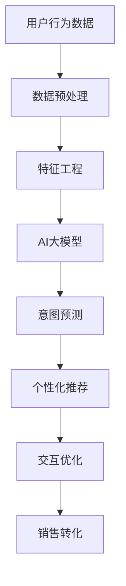

                 

# AI大模型在电商平台用户意图实时追踪中的应用

> 关键词：电商平台, 用户意图追踪, AI大模型, 自然语言处理(NLP), 推荐系统, 产品推荐, 交互优化

## 1. 背景介绍

### 1.1 问题由来

随着电子商务的迅猛发展，电商平台的用户基数日益庞大，用户在平台上的行为也越来越复杂和多样。了解用户的购买意图、浏览偏好等信息，成为电商平台优化用户体验、提升销售转化率的关键。传统的数据分析方法如A/B测试、用户调查等方式，往往耗时耗力且结果准确度有限。而利用AI大模型进行用户意图的实时追踪和预测，可以高效、准确地分析用户行为，为个性化推荐、精准营销、购物体验优化提供有力支撑。

### 1.2 问题核心关键点

本节将介绍几个核心概念，以更好地理解AI大模型在电商平台用户意图追踪中的应用：

- **AI大模型(AI Large Model)**：指基于深度学习架构，如Transformer模型，拥有亿级参数规模的通用大语言模型。如GPT、BERT等。
- **用户意图追踪(User Intent Tracking)**：指通过分析用户在电商平台上的行为数据，实时预测和追踪用户的购买意图、浏览偏好等，帮助电商平台进行个性化推荐、精准营销。
- **自然语言处理(NLP)**：指利用计算机科学和人工智能技术，处理和理解人类语言，是用户意图追踪的重要技术支撑。
- **推荐系统(Recommendation System)**：基于用户行为数据和用户特征，通过算法推荐相关商品或内容，提升用户体验和购买转化率。
- **个性化推荐(Personalized Recommendation)**：利用用户画像和行为数据，针对不同用户进行定制化推荐。
- **交互优化(Interaction Optimization)**：通过优化用户体验，提升平台转化率和用户满意度。

这些核心概念之间的逻辑关系可以通过以下Mermaid流程图来展示：



这个流程图展示了从用户行为数据的收集到个性化推荐和交互优化的全流程，以及其中关键的AI大模型应用环节。

## 2. 核心概念与联系

### 2.1 核心概念概述

为更好地理解AI大模型在电商平台用户意图追踪中的应用，本节将介绍几个密切相关的核心概念：

- **用户行为数据(User Behavior Data)**：指用户在电商平台上的点击、浏览、购买等行为数据，是用户意图追踪的重要依据。
- **数据预处理(Data Preprocessing)**：通过清洗、标准化、归一化等技术，将原始数据转化为模型可用的格式。
- **特征工程(Feature Engineering)**：从原始数据中提取、组合和构造模型所需输入特征的过程，对于提升模型性能至关重要。
- **AI大模型(AI Large Model)**：指具有高参数量和强泛化能力的大型深度学习模型，如GPT、BERT等。
- **意图预测(Intent Prediction)**：通过AI大模型对用户行为数据进行分析和预测，识别用户的意图。
- **个性化推荐(Personalized Recommendation)**：利用用户行为数据和意图预测结果，生成个性化推荐列表。
- **交互优化(Interaction Optimization)**：通过优化用户界面和交互方式，提升用户满意度和转化率。

这些核心概念通过数据预处理、特征工程、AI大模型训练、意图预测、个性化推荐、交互优化等环节，形成了一条完整的用户意图追踪和应用链条。

## 3. 核心算法原理 & 具体操作步骤
### 3.1 算法原理概述

AI大模型在电商平台用户意图追踪中的应用，主要基于以下算法原理：

1. **数据预处理**：将用户行为数据进行清洗、标准化、归一化等处理，去除噪声和异常值，确保数据质量。
2. **特征工程**：从用户行为数据中提取和构造模型所需的特征，如点击次数、停留时间、浏览路径等。
3. **模型训练**：使用AI大模型对特征工程后的数据进行训练，学习用户的意图和行为模式。
4. **意图预测**：利用训练好的模型对新的用户行为数据进行实时预测，识别用户的购买意图、浏览偏好等。
5. **个性化推荐**：根据意图预测结果，生成个性化的商品推荐列表，提升用户体验和购买转化率。
6. **交互优化**：根据用户行为和反馈，优化电商平台的界面设计和交互方式，提升用户体验。

### 3.2 算法步骤详解

下面以一个具体的电商场景为例，介绍AI大模型在用户意图追踪中的应用步骤：

1. **数据收集与预处理**：
   - 收集用户的行为数据，包括点击、浏览、购买、评价等记录。
   - 对数据进行清洗，去除异常值和噪声数据。
   - 对数据进行标准化和归一化处理，确保不同特征的尺度一致。

2. **特征工程**：
   - 提取用户行为数据中的关键特征，如点击次数、浏览路径、停留时间、浏览深度等。
   - 对特征进行编码，如将点击次数转化为分位数，将停留时间转化为二值变量等。
   - 构造交互特征，如用户点击某商品后的后续点击行为，商品间的关联性等。

3. **模型训练**：
   - 选择适合的AI大模型，如BERT、GPT等，作为基础模型。
   - 将预处理后的特征作为模型的输入，使用标注数据进行监督训练。
   - 在训练过程中，通过交叉验证等技术，调整模型的超参数，确保模型泛化性能。

4. **意图预测**：
   - 将用户新产生的行为数据作为模型的输入，进行实时意图预测。
   - 预测用户是否会购买某商品，购买的具体品类，浏览偏好等。

5. **个性化推荐**：
   - 根据意图预测结果，生成个性化的商品推荐列表。
   - 利用协同过滤、内容推荐等算法，进一步提升推荐效果。

6. **交互优化**：
   - 根据用户行为和反馈，优化商品展示方式、推荐策略、搜索算法等。
   - 引入A/B测试等方法，评估优化效果，持续迭代改进。

### 3.3 算法优缺点

AI大模型在电商平台用户意图追踪中的应用，具有以下优点：

1. **高效性**：AI大模型能够高效地处理大规模数据，实时进行用户意图的预测和追踪。
2. **准确性**：利用深度学习技术，AI大模型能够学习到复杂的用户行为模式和意图，预测结果较为准确。
3. **灵活性**：AI大模型可以适应不同的电商场景和需求，进行定制化的应用开发。

同时，该方法也存在以下局限性：

1. **数据依赖性**：模型的性能很大程度上依赖于标注数据的质量和数量，数据获取成本较高。
2. **模型复杂度**：大模型参数量巨大，训练和推理成本较高。
3. **解释性不足**：AI大模型通常是"黑盒"模型，难以解释其内部工作机制和决策逻辑。
4. **泛化能力**：模型对新数据和新场景的泛化能力仍需进一步提升。

尽管存在这些局限性，AI大模型在电商平台用户意图追踪中的应用，仍然展现了其强大的潜力和广泛的应用前景。

### 3.4 算法应用领域

AI大模型在电商平台用户意图追踪中的应用，广泛应用于以下几个领域：

1. **个性化推荐系统**：通过AI大模型对用户行为数据进行分析和预测，生成个性化的商品推荐列表，提升用户体验和购买转化率。
2. **用户行为分析**：分析用户在电商平台上的点击、浏览、购买等行为，识别用户兴趣和偏好。
3. **购物体验优化**：优化商品展示方式、推荐策略、搜索算法等，提升用户购物体验和满意度。
4. **营销策略优化**：基于用户意图预测结果，优化营销策略，提升广告效果和用户留存率。
5. **风险控制**：识别潜在的风险用户和行为，采取相应的风险控制措施。

以上应用场景展示了AI大模型在电商平台用户意图追踪中的广泛应用，为电商平台提供了强大的技术支撑。

## 4. 数学模型和公式 & 详细讲解 & 举例说明

### 4.1 数学模型构建

为更好地理解AI大模型在电商平台用户意图追踪中的应用，本节将介绍几个关键的数学模型构建过程。

假设用户行为数据为 $X=\{(x_i, y_i)\}_{i=1}^N$，其中 $x_i$ 表示用户行为特征，$y_i$ 表示用户行为标签（如购买、浏览等）。AI大模型 $M$ 的输出为 $M(x)=\{z_i\}_{i=1}^N$，其中 $z_i$ 表示模型对用户行为 $x_i$ 的预测结果。

### 4.2 公式推导过程

以二分类任务为例，假设模型的输出为 $z_i \in [0,1]$，表示用户购买某商品的概率。模型的损失函数为交叉熵损失：

$$
\mathcal{L}=\frac{1}{N}\sum_{i=1}^N [y_i \log z_i + (1-y_i) \log (1-z_i)]
$$

其中 $y_i$ 为真实标签，$z_i$ 为模型的预测结果。

通过反向传播算法，计算损失函数对模型参数的梯度：

$$
\frac{\partial \mathcal{L}}{\partial \theta}=-\frac{1}{N}\sum_{i=1}^N [y_i \frac{z_i}{1-z_i}-(1-y_i) \frac{1-z_i}{z_i}]
$$

其中 $\theta$ 表示模型的参数。

使用梯度下降等优化算法，更新模型参数，最小化损失函数：

$$
\theta \leftarrow \theta - \eta \frac{\partial \mathcal{L}}{\partial \theta}
$$

其中 $\eta$ 为学习率。

### 4.3 案例分析与讲解

以一个具体的电商场景为例，假设用户浏览了某商品，AI大模型需要预测其是否会购买该商品。模型的输入为用户的浏览行为特征 $x$，模型的输出为购买概率 $z$。

首先，将用户行为特征 $x$ 编码为向量 $x^T=[x_1, x_2, \ldots, x_n]$，其中 $x_i$ 表示用户行为 $x$ 的第 $i$ 个特征。然后，将向量 $x$ 输入到AI大模型 $M$ 中，得到预测结果 $z$。

假设模型的输出为 $z=0.8$，表示用户有80%的概率购买该商品。如果真实标签为 $y=1$，则计算损失函数：

$$
\mathcal{L}=-1 \log 0.8 + 0 \log 0.2 = 0.511
$$

计算损失函数对模型参数的梯度：

$$
\frac{\partial \mathcal{L}}{\partial \theta}=-0.1 \frac{1}{0.8} + 0.1 \frac{1-0.8}{0.2} = 0.5
$$

使用梯度下降算法更新模型参数：

$$
\theta \leftarrow \theta - \eta \times 0.5
$$

通过不断迭代，直至模型收敛。最终得到的模型参数 $\theta$ 可用于实时预测用户购买意图，生成个性化推荐。

## 5. 项目实践：代码实例和详细解释说明
### 5.1 开发环境搭建

在进行AI大模型在电商平台用户意图追踪中的应用实践前，我们需要准备好开发环境。以下是使用Python进行PyTorch开发的环境配置流程：

1. 安装Anaconda：从官网下载并安装Anaconda，用于创建独立的Python环境。

2. 创建并激活虚拟环境：
```bash
conda create -n pytorch-env python=3.8 
conda activate pytorch-env
```

3. 安装PyTorch：根据CUDA版本，从官网获取对应的安装命令。例如：
```bash
conda install pytorch torchvision torchaudio cudatoolkit=11.1 -c pytorch -c conda-forge
```

4. 安装相关库：
```bash
pip install transformers pytorch-lightning
```

5. 安装各类工具包：
```bash
pip install numpy pandas scikit-learn matplotlib tqdm jupyter notebook ipython
```

完成上述步骤后，即可在`pytorch-env`环境中开始实践。

### 5.2 源代码详细实现

下面我们以电商平台用户意图追踪为例，给出使用PyTorch进行AI大模型微调的PyTorch代码实现。

首先，定义数据预处理函数：

```python
from transformers import BertTokenizer
from torch.utils.data import Dataset
import torch

class UserBehaviorDataset(Dataset):
    def __init__(self, behaviors, labels, tokenizer, max_len=128):
        self.behaviors = behaviors
        self.labels = labels
        self.tokenizer = tokenizer
        self.max_len = max_len
        
    def __len__(self):
        return len(self.behaviors)
    
    def __getitem__(self, item):
        behavior = self.behaviors[item]
        label = self.labels[item]
        
        encoding = self.tokenizer(behavior, return_tensors='pt', max_length=self.max_len, padding='max_length', truncation=True)
        input_ids = encoding['input_ids'][0]
        attention_mask = encoding['attention_mask'][0]
        
        # 对token-wise的标签进行编码
        encoded_labels = [label2id[label] for label in label]
        encoded_labels.extend([label2id['O']] * (self.max_len - len(encoded_labels)))
        labels = torch.tensor(encoded_labels, dtype=torch.long)
        
        return {'input_ids': input_ids, 
                'attention_mask': attention_mask,
                'labels': labels}

# 标签与id的映射
label2id = {'buy': 0, 'view': 1, 'click': 2, 'search': 3}
id2label = {v: k for k, v in label2id.items()}

# 创建dataset
tokenizer = BertTokenizer.from_pretrained('bert-base-cased')

train_dataset = UserBehaviorDataset(train_behaviors, train_labels, tokenizer)
dev_dataset = UserBehaviorDataset(dev_behaviors, dev_labels, tokenizer)
test_dataset = UserBehaviorDataset(test_behaviors, test_labels, tokenizer)
```

然后，定义模型和优化器：

```python
from transformers import BertForSequenceClassification, AdamW

model = BertForSequenceClassification.from_pretrained('bert-base-cased', num_labels=len(label2id))

optimizer = AdamW(model.parameters(), lr=2e-5)
```

接着，定义训练和评估函数：

```python
from torch.utils.data import DataLoader
from tqdm import tqdm
from sklearn.metrics import classification_report

device = torch.device('cuda') if torch.cuda.is_available() else torch.device('cpu')
model.to(device)

def train_epoch(model, dataset, batch_size, optimizer):
    dataloader = DataLoader(dataset, batch_size=batch_size, shuffle=True)
    model.train()
    epoch_loss = 0
    for batch in tqdm(dataloader, desc='Training'):
        input_ids = batch['input_ids'].to(device)
        attention_mask = batch['attention_mask'].to(device)
        labels = batch['labels'].to(device)
        model.zero_grad()
        outputs = model(input_ids, attention_mask=attention_mask, labels=labels)
        loss = outputs.loss
        epoch_loss += loss.item()
        loss.backward()
        optimizer.step()
    return epoch_loss / len(dataloader)

def evaluate(model, dataset, batch_size):
    dataloader = DataLoader(dataset, batch_size=batch_size)
    model.eval()
    preds, labels = [], []
    with torch.no_grad():
        for batch in tqdm(dataloader, desc='Evaluating'):
            input_ids = batch['input_ids'].to(device)
            attention_mask = batch['attention_mask'].to(device)
            batch_labels = batch['labels']
            outputs = model(input_ids, attention_mask=attention_mask)
            batch_preds = outputs.logits.argmax(dim=2).to('cpu').tolist()
            batch_labels = batch_labels.to('cpu').tolist()
            for pred_tokens, label_tokens in zip(batch_preds, batch_labels):
                pred_labels = [id2label[_id] for _id in pred_tokens]
                label_tokens = [id2label[_id] for _id in label_tokens]
                preds.append(pred_labels[:len(label_tokens)])
                labels.append(label_tokens)
                
    print(classification_report(labels, preds))
```

最后，启动训练流程并在测试集上评估：

```python
epochs = 5
batch_size = 16

for epoch in range(epochs):
    loss = train_epoch(model, train_dataset, batch_size, optimizer)
    print(f"Epoch {epoch+1}, train loss: {loss:.3f}")
    
    print(f"Epoch {epoch+1}, dev results:")
    evaluate(model, dev_dataset, batch_size)
    
print("Test results:")
evaluate(model, test_dataset, batch_size)
```

以上就是使用PyTorch对BERT进行用户意图追踪任务微调的完整代码实现。可以看到，得益于Transformers库的强大封装，我们可以用相对简洁的代码完成BERT模型的加载和微调。

### 5.3 代码解读与分析

让我们再详细解读一下关键代码的实现细节：

**UserBehaviorDataset类**：
- `__init__`方法：初始化用户行为数据、标签、分词器等关键组件。
- `__len__`方法：返回数据集的样本数量。
- `__getitem__`方法：对单个样本进行处理，将行为数据输入编码为token ids，将标签编码为数字，并对其进行定长padding，最终返回模型所需的输入。

**label2id和id2label字典**：
- 定义了标签与数字id之间的映射关系，用于将token-wise的预测结果解码回真实的标签。

**训练和评估函数**：
- 使用PyTorch的DataLoader对数据集进行批次化加载，供模型训练和推理使用。
- 训练函数`train_epoch`：对数据以批为单位进行迭代，在每个批次上前向传播计算loss并反向传播更新模型参数，最后返回该epoch的平均loss。
- 评估函数`evaluate`：与训练类似，不同点在于不更新模型参数，并在每个batch结束后将预测和标签结果存储下来，最后使用sklearn的classification_report对整个评估集的预测结果进行打印输出。

**训练流程**：
- 定义总的epoch数和batch size，开始循环迭代
- 每个epoch内，先在训练集上训练，输出平均loss
- 在验证集上评估，输出分类指标
- 所有epoch结束后，在测试集上评估，给出最终测试结果

可以看到，PyTorch配合Transformers库使得BERT微调的代码实现变得简洁高效。开发者可以将更多精力放在数据处理、模型改进等高层逻辑上，而不必过多关注底层的实现细节。

当然，工业级的系统实现还需考虑更多因素，如模型的保存和部署、超参数的自动搜索、更灵活的任务适配层等。但核心的微调范式基本与此类似。

## 6. 实际应用场景
### 6.1 电商平台个性化推荐系统

在电商平台的个性化推荐系统中，利用AI大模型进行用户意图追踪，可以显著提升推荐效果。传统推荐系统往往依赖用户历史行为数据，难以捕捉用户当前兴趣和意图。而利用用户实时行为数据，AI大模型能够实时预测用户意图，生成个性化推荐列表，提升用户体验和购买转化率。

具体而言，电商平台可以将用户实时行为数据作为输入，使用训练好的AI大模型进行意图预测。根据预测结果，生成个性化推荐列表，通过协同过滤、内容推荐等算法进一步提升推荐效果。同时，利用AI大模型对推荐结果进行实时评估，不断优化推荐策略，提升用户体验。

### 6.2 电商平台搜索系统

在电商平台的搜索系统中，用户意图追踪同样具有重要应用。通过AI大模型对用户搜索行为进行分析和预测，电商平台可以实时调整搜索结果，推荐最相关的商品，提升搜索准确度和用户满意度。

具体而言，电商平台可以将用户搜索关键词和历史行为数据作为输入，使用训练好的AI大模型进行意图预测。根据预测结果，调整搜索算法，推荐最相关的商品。同时，利用AI大模型对搜索结果进行实时评估，不断优化搜索策略，提升用户体验。

### 6.3 电商平台用户行为分析

电商平台的运营离不开对用户行为数据的深入分析。通过AI大模型进行用户意图追踪，电商平台可以实时了解用户行为，识别用户兴趣和偏好，为个性化推荐、精准营销、购物体验优化提供数据支持。

具体而言，电商平台可以收集用户行为数据，包括点击、浏览、购买、评价等记录。利用AI大模型对行为数据进行分析和预测，识别用户的意图和偏好。根据预测结果，优化商品展示方式、推荐策略、搜索算法等，提升用户购物体验和满意度。

### 6.4 电商平台广告投放

在电商平台的广告投放中，AI大模型同样可以发挥重要作用。通过AI大模型对用户行为数据进行分析和预测，电商平台可以实时了解用户兴趣和偏好，优化广告投放策略，提高广告效果和用户留存率。

具体而言，电商平台可以收集用户行为数据，包括点击、浏览、购买、评价等记录。利用AI大模型对行为数据进行分析和预测，识别用户的意图和偏好。根据预测结果，优化广告投放策略，提高广告效果和用户留存率。

## 7. 工具和资源推荐
### 7.1 学习资源推荐

为了帮助开发者系统掌握AI大模型在电商平台用户意图追踪中的应用，这里推荐一些优质的学习资源：

1. 《深度学习》系列书籍：由Ian Goodfellow等知名学者所著，全面介绍了深度学习的基本概念和算法原理。
2. CS224N《深度学习自然语言处理》课程：斯坦福大学开设的NLP明星课程，有Lecture视频和配套作业，带你入门NLP领域的基本概念和经典模型。
3. 《Transformers: An Introduction》书籍：Transformers库的作者所著，全面介绍了Transformer架构和相关模型。
4. PyTorch官方文档：PyTorch官方文档，提供了完整的深度学习框架API和样例代码，是进行深度学习开发的重要参考。
5. HuggingFace官方文档：Transformers库的官方文档，提供了海量预训练模型和完整的微调样例代码，是进行深度学习开发的重要参考。
6. Kaggle：数据科学竞赛平台，提供大量电商和用户行为数据集，适合进行数据分析和模型训练。

通过对这些资源的学习实践，相信你一定能够快速掌握AI大模型在电商平台用户意图追踪中的应用，并用于解决实际的电商问题。

### 7.2 开发工具推荐

高效的开发离不开优秀的工具支持。以下是几款用于AI大模型在电商平台用户意图追踪开发的常用工具：

1. PyTorch：基于Python的开源深度学习框架，灵活动态的计算图，适合快速迭代研究。大部分预训练语言模型都有PyTorch版本的实现。
2. TensorFlow：由Google主导开发的开源深度学习框架，生产部署方便，适合大规模工程应用。同样有丰富的预训练语言模型资源。
3. Transformers库：HuggingFace开发的NLP工具库，集成了众多SOTA语言模型，支持PyTorch和TensorFlow，是进行电商用户意图追踪开发的利器。
4. Weights & Biases：模型训练的实验跟踪工具，可以记录和可视化模型训练过程中的各项指标，方便对比和调优。与主流深度学习框架无缝集成。
5. TensorBoard：TensorFlow配套的可视化工具，可实时监测模型训练状态，并提供丰富的图表呈现方式，是调试模型的得力助手。
6. Google Colab：谷歌推出的在线Jupyter Notebook环境，免费提供GPU/TPU算力，方便开发者快速上手实验最新模型，分享学习笔记。

合理利用这些工具，可以显著提升AI大模型在电商平台用户意图追踪任务的开发效率，加快创新迭代的步伐。

### 7.3 相关论文推荐

AI大模型在电商平台用户意图追踪的应用，源于学界的持续研究。以下是几篇奠基性的相关论文，推荐阅读：

1. Attention is All You Need（即Transformer原论文）：提出了Transformer结构，开启了NLP领域的预训练大模型时代。
2. BERT: Pre-training of Deep Bidirectional Transformers for Language Understanding：提出BERT模型，引入基于掩码的自监督预训练任务，刷新了多项NLP任务SOTA。
3. Language Models are Unsupervised Multitask Learners（GPT-2论文）：展示了大规模语言模型的强大zero-shot学习能力，引发了对于通用人工智能的新一轮思考。
4. Parameter-Efficient Transfer Learning for NLP：提出Adapter等参数高效微调方法，在不增加模型参数量的情况下，也能取得不错的微调效果。
5. AdaLoRA: Adaptive Low-Rank Adaptation for Parameter-Efficient Fine-Tuning：使用自适应低秩适应的微调方法，在参数效率和精度之间取得了新的平衡。

这些论文代表了大语言模型微调技术的发展脉络。通过学习这些前沿成果，可以帮助研究者把握学科前进方向，激发更多的创新灵感。

## 8. 总结：未来发展趋势与挑战

### 8.1 总结

本文对AI大模型在电商平台用户意图追踪中的应用进行了全面系统的介绍。首先阐述了AI大模型和用户意图追踪的研究背景和意义，明确了AI大模型在电商领域的重要应用价值。其次，从原理到实践，详细讲解了用户意图追踪的数学原理和关键步骤，给出了电商用户意图追踪任务微调的完整代码实现。同时，本文还广泛探讨了AI大模型在电商平台个性化推荐、搜索、广告投放、行为分析等多个领域的应用前景，展示了AI大模型在电商平台中的广泛应用。

通过本文的系统梳理，可以看到，AI大模型在电商平台用户意图追踪中的应用，展示了其强大的潜力和广泛的应用前景。AI大模型能够高效处理大规模数据，实时进行用户意图预测，提升个性化推荐、搜索、广告投放、行为分析等电商功能的性能，为电商平台带来了显著的用户体验提升和业务增长。

### 8.2 未来发展趋势

展望未来，AI大模型在电商平台用户意图追踪的应用将呈现以下几个发展趋势：

1. **模型规模持续增大**：随着算力成本的下降和数据规模的扩张，AI大模型的参数量还将持续增长。超大规模语言模型蕴含的丰富语言知识，有望支撑更加复杂多变的电商任务微调。
2. **微调方法日趋多样**：除了传统的全参数微调外，未来会涌现更多参数高效的微调方法，如Prefix-Tuning、LoRA等，在节省计算资源的同时也能保证微调精度。
3. **持续学习成为常态**：随着数据分布的不断变化，AI大模型也需要持续学习新知识以保持性能。如何在不遗忘原有知识的同时，高效吸收新样本信息，将成为重要的研究课题。
4. **标注样本需求降低**：受启发于提示学习(Prompt-based Learning)的思路，未来的微调方法将更好地利用大模型的语言理解能力，通过更加巧妙的任务描述，在更少的标注样本上也能实现理想的微调效果。
5. **多模态微调崛起**：当前的微调主要聚焦于纯文本数据，未来会进一步拓展到图像、视频、语音等多模态数据微调。多模态信息的融合，将显著提升AI大模型对现实世界的理解和建模能力。
6. **模型通用性增强**：经过海量数据的预训练和多领域任务的微调，未来的AI大模型将具备更强大的常识推理和跨领域迁移能力，逐步迈向通用人工智能(AGI)的目标。

以上趋势凸显了AI大模型在电商平台用户意图追踪中的广阔前景。这些方向的探索发展，必将进一步提升AI大模型的性能和应用范围，为电商平台带来更高效、智能、个性化、互动化的用户体验。

### 8.3 面临的挑战

尽管AI大模型在电商平台用户意图追踪中的应用取得了显著成效，但在迈向更加智能化、普适化应用的过程中，它仍面临着诸多挑战：

1. **数据依赖性**：模型的性能很大程度上依赖于标注数据的质量和数量，数据获取成本较高。如何进一步降低微调对标注样本的依赖，将是一大难题。
2. **模型鲁棒性不足**：当目标任务与预训练数据的分布差异较大时，微调的性能提升有限。如何在不同电商场景中保持模型鲁棒性，是一个重要的研究课题。
3. **推理效率有待提高**：大规模语言模型虽然精度高，但在实际部署时往往面临推理速度慢、内存占用大等效率问题。如何在保证性能的同时，简化模型结构，提升推理速度，优化资源占用，将是重要的优化方向。
4. **可解释性亟需加强**：AI大模型通常是"黑盒"模型，难以解释其内部工作机制和决策逻辑。对于电商平台的业务决策，可解释性尤为重要。如何赋予AI大模型更强的可解释性，将是亟待攻克的难题。
5. **安全性有待保障**：AI大模型难免会学习到有偏见、有害的信息，通过微调传递到电商平台上，产生误导性、歧视性的输出，给实际应用带来安全隐患。如何从数据和算法层面消除模型偏见，避免恶意用途，确保输出的安全性，也将是重要的研究课题。

尽管存在这些挑战，AI大模型在电商平台用户意图追踪中的应用，仍然展示了其强大的潜力和广泛的应用前景。未来，需要通过更先进的数据获取和预处理技术、更高效的模型结构和训练方法、更强大的模型可解释性保障、更完备的安全性设计等多方面的技术突破，才能将AI大模型在电商平台中的应用推向新的高度。

### 8.4 研究展望

面向未来，AI大模型在电商平台用户意图追踪的研究展望包括：

1. **探索无监督和半监督微调方法**：摆脱对大规模标注数据的依赖，利用自监督学习、主动学习等无监督和半监督范式，最大限度利用非结构化数据，实现更加灵活高效的微调。
2. **研究参数高效和计算高效的微调范式**：开发更加参数高效的微调方法，在固定大部分预训练参数的情况下，只更新极少量的任务相关参数。同时优化微调模型的计算图，减少前向传播和反向传播的资源消耗，实现更加轻量级、实时性的部署。
3. **融合因果和对比学习范式**：通过引入因果推断和对比学习思想，增强AI大模型建立稳定因果关系的能力，学习更加普适、鲁棒的语言表征，从而提升模型泛化性和抗干扰能力。
4. **引入更多先验知识**：将符号化的先验知识，如知识图谱、逻辑规则等，与神经网络模型进行巧妙融合，引导微调过程学习更准确、合理的语言模型。同时加强不同模态数据的整合，实现视觉、语音等多模态信息与文本信息的协同建模。
5. **结合因果分析和博弈论工具**：将因果分析方法引入AI大模型，识别出模型决策的关键特征，增强输出解释的因果性和逻辑性。借助博弈论工具刻画人机交互过程，主动探索并规避模型的脆弱点，提高系统稳定性。
6. **纳入伦理道德约束**：在模型训练目标中引入伦理导向的评估指标，过滤和惩罚有偏见、有害的输出倾向。同时加强人工干预和审核，建立模型行为的监管机制，确保输出符合人类价值观和伦理道德。

这些研究方向的探索，必将引领AI大模型在电商平台中的应用走向更高的台阶，为电商平台带来更高效、智能、个性化、互动化的用户体验。相信随着学界和产业界的共同努力，这些挑战终将一一被克服，AI大模型在电商平台中的应用必将在构建人机协同的智能时代中扮演越来越重要的角色。

## 9. 附录：常见问题与解答

**Q1：AI大模型在电商平台上进行用户意图追踪是否适用于所有电商场景？**

A: AI大模型在电商平台上的用户意图追踪，可以适用于大多数电商场景。但对于一些特定领域或小众场景，模型可能需要进一步预训练或微调，以更好地适应特定的电商行为模式和用户需求。例如，某些垂直领域电商可能需要针对特定的商品类别、用户群体等进行微调。

**Q2：如何选择合适的AI大模型进行电商用户意图追踪？**

A: 选择合适的AI大模型进行电商用户意图追踪，需要考虑以下几个因素：
1. **模型架构**：选择与电商任务最匹配的模型架构，如BERT、GPT等。
2. **预训练数据**：选择适合电商任务的数据集进行预训练，如电商评论、商品描述等。
3. **数据量和质量**：选择能够覆盖电商用户行为模式的数据集，确保模型训练的数据量和质量。
4. **参数量和性能**：选择参数量和计算性能均能满足电商任务需求的模型，避免模型过大导致部署问题。

**Q3：在电商平台上进行用户意图追踪，如何降低对标注数据的依赖？**

A: 在电商平台上进行用户意图追踪，可以通过以下方法降低对标注数据的依赖：
1. **无监督学习**：利用无监督学习技术，如自监督学习、主动学习等，从非结构化数据中提取有用信息，减少对标注数据的依赖。
2. **少样本学习**：利用少样本学习技术，在少数标注数据上训练模型，通过精心设计的输入格式，引导模型进行有效学习。
3. **多模态数据融合**：将电商用户行为数据与图像、视频、语音等多模态数据融合，提供更丰富的信息源，减少对标注数据的依赖。
4. **提示学习**：利用提示学习技术，通过精心设计的输入模板，引导模型进行少样本或零样本学习，进一步降低对标注数据的依赖。

**Q4：在电商平台上进行用户意图追踪，如何提高模型的鲁棒性？**

A: 提高电商平台上用户意图追踪模型的鲁棒性，可以通过以下方法：
1. **数据增强**：通过数据增强技术，扩充训练数据集，增加模型的泛化能力。
2. **正则化技术**：使用正则化技术，如L2正则、Dropout等，防止模型过拟合。
3. **对抗训练**：通过对抗训练技术，引入对抗样本，提高模型的鲁棒性。
4. **多模型集成**：使用多模型集成技术，结合多个模型的输出结果，提高模型的稳定性和鲁棒性。
5. **参数高效微调**：采用参数高效微调技术，如 Adapter、LoRA等，减小模型的过拟合风险。

**Q5：在电商平台上进行用户意图追踪，如何优化模型的推理效率？**

A: 优化电商平台上用户意图追踪模型的推理效率，可以通过以下方法：
1. **模型裁剪**：去除模型中不必要的层和参数，减小模型尺寸，加快推理速度。
2. **量化加速**：将浮点模型转为定点模型，压缩存储空间，提高计算效率。
3. **模型并行**：使用模型并行技术，如模型并行、数据并行等，提升推理速度。
4. **推理优化**：优化推理过程，如使用高效的前向传播算法、优化数据载入等，提高推理效率。

**Q6：在电商平台上进行用户意图追踪，如何增强模型的可解释性？**

A: 增强电商平台上用户意图追踪模型的可解释性，可以通过以下方法：
1. **可解释性模块**：在模型中引入可解释性模块，如 Attention机制、LIME等，解释模型的决策过程。
2. **可视化技术**：利用可视化技术，如Attention可视化、特征重要性可视化等，展示模型的内部机制。
3. **规则引擎**：结合专家知识，构建规则引擎，辅助模型进行决策，增强可解释性。
4. **交互式界面**：开发交互式界面，让用户参与模型的训练和优化，提升可解释性。

**Q7：在电商平台上进行用户意图追踪，如何保障模型的安全性？**

A: 保障电商平台上用户意图追踪模型的安全性，可以通过以下方法：
1. **数据清洗**：在数据预处理阶段，清洗和过滤有害数据，防止有害信息进入模型。
2. **隐私保护**：在数据处理和模型训练过程中，确保用户隐私保护，防止数据泄露。
3. **模型审核**：定期审核模型的输出结果，检测和修复有害的输出倾向。
4. **安全监控**：在模型部署阶段，建立安全监控系统，检测和防范恶意攻击。

通过以上措施，可以有效保障电商平台上用户意图追踪模型的安全性，避免模型误导用户和引发风险。

---

作者：禅与计算机程序设计艺术 / Zen and the Art of Computer Programming

