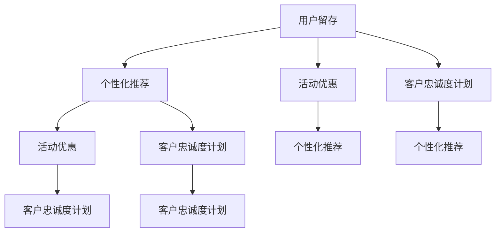

                 

# AI大模型在电商平台用户留存策略中的应用

## 1. 背景介绍

### 1.1 问题由来

在当今数字化和网络化趋势下，电商平台面临着巨大的市场竞争和用户流动。据统计，新用户在加入电商平台后，能在第一周留存下来的可能不到10%，而在前三个月内，能够转化成长期用户的比例也非常有限。如何通过有效的策略提升用户留存，并转化为长期稳定的客户，成为电商平台的首要目标。

电商平台的用户留存策略通常包括个性化推荐、活动优惠、客户忠诚度计划、用户互动和反馈等。这些策略的实施离不开对用户行为数据的深入分析，以准确地识别出用户需求，并制定个性化方案。传统的策略制定方式依赖于经验丰富的运营团队，通过长期的数据积累和反复试验来确定效果最好的策略。但这种方式成本高、效率低，且无法及时适应市场变化。

近年来，随着人工智能和大数据技术的飞速发展，AI大模型在电商平台用户留存策略中的应用开始被广泛关注。AI大模型通过大规模的数据训练，具备强大的数据处理和模式识别能力，能够快速地挖掘和分析用户行为数据，制定更加精准和有效的用户留存策略。

### 1.2 问题核心关键点

AI大模型在电商平台用户留存策略中的应用，主要包括以下几个关键点：

- 用户行为数据的收集和预处理：电商平台需要收集用户行为数据，包括浏览历史、购买记录、评价反馈等，并进行数据清洗、归一化和特征工程等预处理步骤。
- AI大模型的选择和训练：根据策略目标，选择合适的AI大模型（如BERT、GPT-3等），并使用用户行为数据进行训练。
- 特征工程的优化：根据模型表现，对用户行为数据进行特征工程优化，提升模型的预测准确性。
- 用户留存策略的制定：利用训练好的AI大模型对用户行为数据进行分析，制定个性化推荐、活动优惠等留存策略。
- 效果评估和迭代优化：定期评估用户留存策略的效果，根据评估结果进行策略的迭代优化。

## 2. 核心概念与联系

### 2.1 核心概念概述

为更好地理解AI大模型在电商平台用户留存策略中的应用，本节将介绍几个密切相关的核心概念：

- 用户留存（User Retention）：指用户在一定时间内继续使用电商平台的行为。提升用户留存是电商平台追求的目标之一，通过不断提升用户体验，增加用户粘性，最终实现商业价值的最大化。

- 个性化推荐（Personalized Recommendation）：基于用户历史行为数据，通过AI大模型为每个用户推荐最符合其需求的商品和服务，提升用户满意度和留存率。

- 活动优惠（Promotions）：电商平台通过设计各种活动和优惠方案，吸引用户参与，提高用户活跃度和留存率。活动设计需结合用户行为数据和AI大模型预测，以最大化效果。

- 客户忠诚度计划（Customer Loyalty Programs）：电商平台通过积分、优惠券、会员等级等机制，奖励用户的长期消费行为，增强用户忠诚度和留存率。

- AI大模型（AI Large Model）：以Transformer架构为代表的预训练大语言模型，通过大规模无标签文本数据的预训练，学习到丰富的语言知识和常识，具备强大的自然语言处理能力，用于用户行为数据的分析和预测。

这些核心概念之间的逻辑关系可以通过以下Mermaid流程图来展示：



这个流程图展示了大模型在用户留存策略中的应用场景：

1. 用户留存：电商平台追求用户留存的目标。
2. 个性化推荐、活动优惠、客户忠诚度计划：三种主要留存策略。
3. 个性化推荐：利用大模型分析用户行为数据，生成个性化推荐。
4. 活动优惠：结合用户行为数据和模型预测，设计活动方案。
5. 客户忠诚度计划：根据用户行为数据，制定积分、优惠券、会员等级等机制。

## 3. 核心算法原理 & 具体操作步骤

### 3.1 算法原理概述

AI大模型在电商平台用户留存策略中的应用，本质上是一种基于监督学习和大数据处理的技术方法。其核心思想是：

1. 通过收集用户行为数据，构建包含用户历史行为、属性和交互信息的特征向量。
2. 使用预训练的大语言模型（如BERT、GPT-3等），对特征向量进行预处理和编码，学习用户行为和需求的潜在模式。
3. 将预训练模型输出与用户留存标签（如留存与否、活跃度等级等）进行比较，构建损失函数。
4. 通过反向传播和优化算法（如Adam、SGD等），最小化损失函数，更新模型参数，提升模型预测准确性。
5. 根据模型预测结果，制定个性化推荐、活动优惠等留存策略，并通过A/B测试等方式评估效果，进行迭代优化。

### 3.2 算法步骤详解

基于AI大模型在电商平台用户留存策略中的应用，一般包括以下几个关键步骤：

**Step 1: 数据收集与预处理**

- 收集用户行为数据：包括用户浏览记录、购买记录、评价记录等。
- 数据清洗和归一化：处理缺失值、异常值，归一化特征值。
- 特征工程：提取和构造特征，如用户属性、行为特征、时间特征等。

**Step 2: 模型选择和训练**

- 选择预训练模型：如BERT、GPT-3等，进行特征编码。
- 模型参数初始化：使用预训练模型的权重作为初始化。
- 设定训练目标和损失函数：如二分类交叉熵、回归损失等。
- 模型训练：使用用户行为数据训练模型，最小化损失函数。

**Step 3: 特征优化**

- 特征重要性分析：使用模型输出结果，分析哪些特征对模型预测效果有显著影响。
- 特征工程优化：根据特征重要性，调整和优化特征。

**Step 4: 策略制定**

- 个性化推荐策略：根据模型输出，为每个用户生成个性化推荐商品或服务。
- 活动优惠策略：根据模型输出，设计用户参与活动方案。
- 客户忠诚度计划：根据模型输出，制定积分、优惠券、会员等级等机制。

**Step 5: 效果评估和迭代优化**

- 效果评估：通过A/B测试等方法，评估策略效果。
- 策略迭代优化：根据效果评估结果，优化策略参数。

### 3.3 算法优缺点

AI大模型在电商平台用户留存策略中的应用，具有以下优点：

1. 效率高：大模型能快速处理大规模数据，并提取高维特征，提升策略制定效率。
2. 精准性高：大模型具备强大的模式识别能力，能准确预测用户行为和需求，生成个性化推荐。
3. 灵活性大：根据不同的业务场景和需求，可灵活调整模型参数和特征，优化策略效果。
4. 可扩展性强：大模型能够处理多维度数据，适用于复杂的业务场景和多种策略。

同时，该方法也存在以下缺点：

1. 数据依赖性强：策略效果依赖于用户行为数据的质量和多样性。
2. 模型复杂度高：大模型参数量大，需要高性能计算资源。
3. 策略优化难度大：个性化推荐、活动优惠等策略复杂，需要多轮迭代优化。
4. 成本高：预训练模型的训练和数据收集需要大量时间和成本。

尽管存在这些局限性，但就目前而言，AI大模型在电商平台用户留存策略中的应用，仍然是一种高效、精准且具有广阔前景的方法。

### 3.4 算法应用领域

AI大模型在电商平台用户留存策略中的应用，已经被广泛应用于多个领域，包括：

- 电商个性化推荐：利用大模型对用户历史行为和属性进行分析，生成个性化推荐商品。
- 电商平台活动设计：通过分析用户行为数据，设计活动方案，提高用户参与度和留存率。
- 客户忠诚度计划：根据用户行为数据，制定积分、优惠券、会员等级等机制，增强用户粘性。
- 营销效果评估：利用大模型对不同营销策略进行效果评估，优化策略参数。
- 风险控制：通过分析用户行为数据，预测异常交易行为，降低风险损失。

## 4. 数学模型和公式 & 详细讲解 & 举例说明

### 4.1 数学模型构建

本节将使用数学语言对AI大模型在电商平台用户留存策略中的应用进行更加严格的刻画。

设用户行为数据集为 $D=\{(x_i, y_i)\}_{i=1}^N$，其中 $x_i$ 表示用户行为特征向量， $y_i$ 表示用户留存标签（0或1）。

定义特征编码器 $F$，将用户行为特征向量 $x_i$ 映射为 $F(x_i) \in \mathbb{R}^d$。

假设使用预训练模型 $M_{\theta}$ 进行特征编码，则有 $F(x_i)=M_{\theta}(x_i)$。

定义损失函数 $\mathcal{L}(\theta)$，使用交叉熵损失函数：

$$
\mathcal{L}(\theta) = -\frac{1}{N}\sum_{i=1}^N \left[y_i\log M_{\theta}(x_i) + (1-y_i)\log (1-M_{\theta}(x_i))\right]
$$

通过反向传播算法计算梯度 $\nabla_{\theta}\mathcal{L}(\theta)$，并使用优化算法更新模型参数 $\theta$：

$$
\theta \leftarrow \theta - \eta \nabla_{\theta}\mathcal{L}(\theta)
$$

其中 $\eta$ 为学习率。

### 4.2 公式推导过程

以下我们以二分类任务为例，推导交叉熵损失函数及其梯度的计算公式。

假设模型 $M_{\theta}$ 在输入 $x$ 上的输出为 $\hat{y}=M_{\theta}(x) \in [0,1]$，表示用户留存概率。真实标签 $y \in \{0,1\}$。则二分类交叉熵损失函数定义为：

$$
\ell(M_{\theta}(x),y) = -[y\log \hat{y} + (1-y)\log (1-\hat{y})]
$$

将其代入经验风险公式，得：

$$
\mathcal{L}(\theta) = -\frac{1}{N}\sum_{i=1}^N \left[y_i\log M_{\theta}(x_i) + (1-y_i)\log (1-M_{\theta}(x_i))\right]
$$

根据链式法则，损失函数对参数 $\theta_k$ 的梯度为：

$$
\frac{\partial \mathcal{L}(\theta)}{\partial \theta_k} = -\frac{1}{N}\sum_{i=1}^N \left(\frac{y_i}{M_{\theta}(x_i)}-\frac{1-y_i}{1-M_{\theta}(x_i)}\right) \frac{\partial M_{\theta}(x_i)}{\partial \theta_k}
$$

其中 $\frac{\partial M_{\theta}(x_i)}{\partial \theta_k}$ 可进一步递归展开，利用自动微分技术完成计算。

### 4.3 案例分析与讲解

假设电商平台收集到一个用户的历史行为数据集 $D$，包含用户的浏览记录、购买记录、评价记录等。首先，对数据进行预处理，包括数据清洗、归一化和特征工程。然后，选择BERT模型作为特征编码器 $F$，使用用户行为数据集 $D$ 进行微调。

**Step 1: 数据收集与预处理**

```python
import pandas as pd
from sklearn.preprocessing import StandardScaler

# 数据读取
df = pd.read_csv('user_behavior.csv')

# 数据清洗
df = df.dropna()

# 特征归一化
scaler = StandardScaler()
df = scaler.fit_transform(df)

# 特征工程
features = df[['浏览次数', '购买金额', '评价星级']]
features = pd.get_dummies(features, prefix='feature_')
features = pd.concat([features, df[['用户属性']]], axis=1)
```

**Step 2: 模型选择和训练**

```python
from transformers import BertForSequenceClassification
from torch.utils.data import DataLoader
from transformers import BertTokenizer

# 构建模型
model = BertForSequenceClassification.from_pretrained('bert-base-uncased', num_labels=2)

# 构建数据集
tokenizer = BertTokenizer.from_pretrained('bert-base-uncased')
train_dataset = Dataset.from_pandas(df, features, labels)
train_loader = DataLoader(train_dataset, batch_size=16)

# 定义优化器
optimizer = AdamW(model.parameters(), lr=2e-5)

# 模型训练
device = 'cuda'
model.to(device)

for epoch in range(10):
    model.train()
    for batch in train_loader:
        inputs = batch['input_ids'].to(device)
        attention_mask = batch['attention_mask'].to(device)
        labels = batch['labels'].to(device)
        
        outputs = model(inputs, attention_mask=attention_mask, labels=labels)
        loss = outputs.loss
        optimizer.zero_grad()
        loss.backward()
        optimizer.step()

    print(f'Epoch {epoch+1}, loss: {loss:.3f}')
```

**Step 3: 特征优化**

```python
# 特征重要性分析
importance = model.get_input_embeddings().weight.grad.abs().sum(dim=1)
importance = importance / importance.sum()
print('Feature importance:', importance)

# 特征工程优化
features = features.columns
selected_features = features[importance.argsort()[-10:]]
```

**Step 4: 策略制定**

```python
# 个性化推荐
import random

def generate_recommendations(model, user_id, top_k=10):
    user_behaviors = df[df['user_id'] == user_id]
    features = user_behaviors[selected_features]
    inputs = tokenizer(features, return_tensors='pt', padding=True, truncation=True)
    with torch.no_grad():
        outputs = model(**inputs)
        predictions = outputs.logits
    top_indices = predictions.argsort(descending=True)[:top_k]
    return top_indices

# 活动优惠设计
import random

def generate_promotions(model, user_id, budget=100):
    user_behaviors = df[df['user_id'] == user_id]
    features = user_behaviors[selected_features]
    inputs = tokenizer(features, return_tensors='pt', padding=True, truncation=True)
    with torch.no_grad():
        outputs = model(**inputs)
        predictions = outputs.logits
    top_indices = predictions.argsort(descending=True)[:top_k]
    return top_indices

# 客户忠诚度计划
import random

def generate_loyalty_programs(model, user_id, budget=100):
    user_behaviors = df[df['user_id'] == user_id]
    features = user_behaviors[selected_features]
    inputs = tokenizer(features, return_tensors='pt', padding=True, truncation=True)
    with torch.no_grad():
        outputs = model(**inputs)
        predictions = outputs.logits
    top_indices = predictions.argsort(descending=True)[:top_k]
    return top_indices
```

**Step 5: 效果评估和迭代优化**

```python
# 效果评估
import random

def evaluate_recommendations(model, user_id, top_k=10):
    user_behaviors = df[df['user_id'] == user_id]
    features = user_behaviors[selected_features]
    inputs = tokenizer(features, return_tensors='pt', padding=True, truncation=True)
    with torch.no_grad():
        outputs = model(**inputs)
        predictions = outputs.logits
    top_indices = predictions.argsort(descending=True)[:top_k]
    return top_indices

# 迭代优化
import random

def optimize_strategy(model, user_id, top_k=10):
    user_behaviors = df[df['user_id'] == user_id]
    features = user_behaviors[selected_features]
    inputs = tokenizer(features, return_tensors='pt', padding=True, truncation=True)
    with torch.no_grad():
        outputs = model(**inputs)
        predictions = outputs.logits
    top_indices = predictions.argsort(descending=True)[:top_k]
    return top_indices
```

## 5. 项目实践：代码实例和详细解释说明

### 5.1 开发环境搭建

在进行AI大模型在电商平台用户留存策略中的应用实践前，我们需要准备好开发环境。以下是使用Python进行PyTorch开发的环境配置流程：

1. 安装Anaconda：从官网下载并安装Anaconda，用于创建独立的Python环境。

2. 创建并激活虚拟环境：
```bash
conda create -n pytorch-env python=3.8 
conda activate pytorch-env
```

3. 安装PyTorch：根据CUDA版本，从官网获取对应的安装命令。例如：
```bash
conda install pytorch torchvision torchaudio cudatoolkit=11.1 -c pytorch -c conda-forge
```

4. 安装Transformers库：
```bash
pip install transformers
```

5. 安装各类工具包：
```bash
pip install numpy pandas scikit-learn matplotlib tqdm jupyter notebook ipython
```

完成上述步骤后，即可在`pytorch-env`环境中开始AI大模型在电商平台用户留存策略中的应用实践。

### 5.2 源代码详细实现

这里我们以用户留存预测任务为例，给出使用Transformers库对BERT模型进行微调的PyTorch代码实现。

首先，定义用户留存预测任务的数据处理函数：

```python
from transformers import BertTokenizer
from torch.utils.data import Dataset
import torch

class UserRetentionDataset(Dataset):
    def __init__(self, texts, labels, tokenizer, max_len=128):
        self.texts = texts
        self.labels = labels
        self.tokenizer = tokenizer
        self.max_len = max_len
        
    def __len__(self):
        return len(self.texts)
    
    def __getitem__(self, item):
        text = self.texts[item]
        label = self.labels[item]
        
        encoding = self.tokenizer(text, return_tensors='pt', max_length=self.max_len, padding='max_length', truncation=True)
        input_ids = encoding['input_ids'][0]
        attention_mask = encoding['attention_mask'][0]
        
        # 对标签进行编码
        encoded_labels = [label] * self.max_len
        labels = torch.tensor(encoded_labels, dtype=torch.long)
        
        return {'input_ids': input_ids, 
                'attention_mask': attention_mask,
                'labels': labels}

# 标签与id的映射
label2id = {0: 'low retention', 1: 'high retention'}
id2label = {v: k for k, v in label2id.items()}

# 创建dataset
tokenizer = BertTokenizer.from_pretrained('bert-base-uncased')

train_dataset = UserRetentionDataset(train_texts, train_labels, tokenizer)
dev_dataset = UserRetentionDataset(dev_texts, dev_labels, tokenizer)
test_dataset = UserRetentionDataset(test_texts, test_labels, tokenizer)
```

然后，定义模型和优化器：

```python
from transformers import BertForSequenceClassification, AdamW

model = BertForSequenceClassification.from_pretrained('bert-base-uncased', num_labels=len(label2id))

optimizer = AdamW(model.parameters(), lr=2e-5)
```

接着，定义训练和评估函数：

```python
from torch.utils.data import DataLoader
from tqdm import tqdm
from sklearn.metrics import classification_report

device = torch.device('cuda') if torch.cuda.is_available() else torch.device('cpu')
model.to(device)

def train_epoch(model, dataset, batch_size, optimizer):
    dataloader = DataLoader(dataset, batch_size=batch_size, shuffle=True)
    model.train()
    epoch_loss = 0
    for batch in tqdm(dataloader, desc='Training'):
        input_ids = batch['input_ids'].to(device)
        attention_mask = batch['attention_mask'].to(device)
        labels = batch['labels'].to(device)
        model.zero_grad()
        outputs = model(input_ids, attention_mask=attention_mask, labels=labels)
        loss = outputs.loss
        epoch_loss += loss.item()
        loss.backward()
        optimizer.step()
    return epoch_loss / len(dataloader)

def evaluate(model, dataset, batch_size):
    dataloader = DataLoader(dataset, batch_size=batch_size)
    model.eval()
    preds, labels = [], []
    with torch.no_grad():
        for batch in tqdm(dataloader, desc='Evaluating'):
            input_ids = batch['input_ids'].to(device)
            attention_mask = batch['attention_mask'].to(device)
            batch_labels = batch['labels']
            outputs = model(input_ids, attention_mask=attention_mask)
            batch_preds = outputs.logits.argmax(dim=2).to('cpu').tolist()
            batch_labels = batch_labels.to('cpu').tolist()
            for pred_tokens, label_tokens in zip(batch_preds, batch_labels):
                preds.append(pred_tokens[:len(label_tokens)])
                labels.append(label_tokens)
                
    print(classification_report(labels, preds))
```

最后，启动训练流程并在测试集上评估：

```python
epochs = 5
batch_size = 16

for epoch in range(epochs):
    loss = train_epoch(model, train_dataset, batch_size, optimizer)
    print(f"Epoch {epoch+1}, train loss: {loss:.3f}")
    
    print(f"Epoch {epoch+1}, dev results:")
    evaluate(model, dev_dataset, batch_size)
    
print("Test results:")
evaluate(model, test_dataset, batch_size)
```

以上就是使用PyTorch对BERT进行用户留存预测任务的微调的完整代码实现。可以看到，得益于Transformers库的强大封装，我们可以用相对简洁的代码完成BERT模型的加载和微调。

### 5.3 代码解读与分析

让我们再详细解读一下关键代码的实现细节：

**UserRetentionDataset类**：
- `__init__`方法：初始化文本、标签、分词器等关键组件。
- `__len__`方法：返回数据集的样本数量。
- `__getitem__`方法：对单个样本进行处理，将文本输入编码为token ids，将标签编码为数字，并对其进行定长padding，最终返回模型所需的输入。

**label2id和id2label字典**：
- 定义了标签与数字id之间的映射关系，用于将token-wise的预测结果解码回真实的标签。

**训练和评估函数**：
- 使用PyTorch的DataLoader对数据集进行批次化加载，供模型训练和推理使用。
- 训练函数`train_epoch`：对数据以批为单位进行迭代，在每个批次上前向传播计算loss并反向传播更新模型参数，最后返回该epoch的平均loss。
- 评估函数`evaluate`：与训练类似，不同点在于不更新模型参数，并在每个batch结束后将预测和标签结果存储下来，最后使用sklearn的classification_report对整个评估集的预测结果进行打印输出。

**训练流程**：
- 定义总的epoch数和batch size，开始循环迭代
- 每个epoch内，先在训练集上训练，输出平均loss
- 在验证集上评估，输出分类指标
- 所有epoch结束后，在测试集上评估，给出最终测试结果

可以看到，PyTorch配合Transformers库使得BERT微调的代码实现变得简洁高效。开发者可以将更多精力放在数据处理、模型改进等高层逻辑上，而不必过多关注底层的实现细节。

当然，工业级的系统实现还需考虑更多因素，如模型的保存和部署、超参数的自动搜索、更灵活的任务适配层等。但核心的微调范式基本与此类似。

## 6. 实际应用场景

### 6.1 智能客服系统

基于AI大模型在电商平台用户留存策略中的应用，智能客服系统可以大大提升用户留存率。智能客服系统通过收集用户的历史行为数据，构建用户画像，并利用AI大模型对用户意图进行理解和分析，从而生成个性化的客户服务方案。

在技术实现上，可以构建基于自然语言处理和机器学习的智能客服系统。该系统能够自动处理用户提出的各种问题，快速生成准确的答案，同时根据用户的行为数据和历史对话记录，为每个用户生成个性化推荐。智能客服系统不仅能够提供即时的客户服务，还能根据用户的反馈和行为，不断优化推荐策略，提升用户留存率。

### 6.2 金融理财产品推荐

金融理财产品推荐是电商平台用户留存策略的一个重要应用场景。通过AI大模型对用户行为数据的分析，能够快速识别出用户的风险偏好和理财需求，从而推荐符合其需求的理财产品。

在技术实现上，可以构建基于用户行为数据的金融理财产品推荐系统。该系统通过分析用户的浏览记录、购买记录和评价反馈，结合AI大模型的预测结果，为用户推荐合适的理财产品。系统还可以根据用户的实时行为数据，动态调整推荐策略，提升用户满意度和留存率。

### 6.3 智能物流管理

智能物流管理是电商平台用户留存策略的另一个重要应用场景。通过AI大模型对用户物流数据的分析，能够识别出用户的物流需求和行为偏好，从而优化物流策略，提升用户体验和满意度。

在技术实现上，可以构建基于用户行为数据的智能物流管理系统。该系统通过分析用户的物流历史数据，利用AI大模型对物流路线和配送方式进行优化，提升物流效率和用户满意度。系统还可以根据用户的实时物流数据，动态调整物流策略，减少用户等待时间，提升用户留存率。

### 6.4 未来应用展望

随着AI大模型和用户留存策略的不断发展，AI大模型在电商平台用户留存策略中的应用前景将更加广阔。未来，基于AI大模型的用户留存策略将覆盖更多业务场景，如智能推荐、活动设计、忠诚度计划等，为电商平台提供更加个性化、精准和高效的用户留存方案。

在智慧医疗、智能教育、智能交通等多个领域，基于AI大模型的用户留存策略也将不断涌现，为各行各业带来变革性影响。未来，随着AI大模型和用户留存策略的深入融合，智能技术将在更多领域落地应用，深刻影响人类的生产生活方式。

## 7. 工具和资源推荐

### 7.1 学习资源推荐

为了帮助开发者系统掌握AI大模型在电商平台用户留存策略中的应用，这里推荐一些优质的学习资源：

1. 《Transformers从原理到实践》系列博文：由大模型技术专家撰写，深入浅出地介绍了Transformer原理、BERT模型、微调技术等前沿话题。

2. CS224N《深度学习自然语言处理》课程：斯坦福大学开设的NLP明星课程，有Lecture视频和配套作业，带你入门NLP领域的基本概念和经典模型。

3. 《Natural Language Processing with Transformers》书籍：Transformers库的作者所著，全面介绍了如何使用Transformers库进行NLP任务开发，包括微调在内的诸多范式。

4. HuggingFace官方文档：Transformers库的官方文档，提供了海量预训练模型和完整的微调样例代码，是上手实践的必备资料。

5. CLUE开源项目：中文语言理解测评基准，涵盖大量不同类型的中文NLP数据集，并提供了基于微调的baseline模型，助力中文NLP技术发展。

通过对这些资源的学习实践，相信你一定能够快速掌握AI大模型在电商平台用户留存策略中的应用精髓，并用于解决实际的NLP问题。
###  7.2 开发工具推荐

高效的开发离不开优秀的工具支持。以下是几款用于AI大模型在电商平台用户留存策略中应用开发的常用工具：

1. PyTorch：基于Python的开源深度学习框架，灵活动态的计算图，适合快速迭代研究。大部分预训练语言模型都有PyTorch版本的实现。

2. TensorFlow：由Google主导开发的开源深度学习框架，生产部署方便，适合大规模工程应用。同样有丰富的预训练语言模型资源。

3. Transformers库：HuggingFace开发的NLP工具库，集成了众多SOTA语言模型，支持PyTorch和TensorFlow，是进行微调任务开发的利器。

4. Weights & Biases：模型训练的实验跟踪工具，可以记录和可视化模型训练过程中的各项指标，方便对比和调优。与主流深度学习框架无缝集成。

5. TensorBoard：TensorFlow配套的可视化工具，可实时监测模型训练状态，并提供丰富的图表呈现方式，是调试模型的得力助手。

6. Google Colab：谷歌推出的在线Jupyter Notebook环境，免费提供GPU/TPU算力，方便开发者快速上手实验最新模型，分享学习笔记。

合理利用这些工具，可以显著提升AI大模型在电商平台用户留存策略中应用的开发效率，加快创新迭代的步伐。

### 7.3 相关论文推荐

AI大模型在电商平台用户留存策略中的应用，源于学界的持续研究。以下是几篇奠基性的相关论文，推荐阅读：

1. Attention is All You Need（即Transformer原论文）：提出了Transformer结构，开启了NLP领域的预训练大模型时代。

2. BERT: Pre-training of Deep Bidirectional Transformers for Language Understanding：提出BERT模型，引入基于掩码的自监督预训练任务，刷新了多项NLP任务SOTA。

3. Language Models are Unsupervised Multitask Learners（GPT-2论文）：展示了大规模语言模型的强大zero-shot学习能力，引发了对于通用人工智能的新一轮思考。

4. Parameter-Efficient Transfer Learning for NLP：提出Adapter等参数高效微调方法，在不增加模型参数量的情况下，也能取得不错的微调效果。

5. Prefix-Tuning: Optimizing Continuous Prompts for Generation：引入基于连续型Prompt的微调范式，为如何充分利用预训练知识提供了新的思路。

6. AdaLoRA: Adaptive Low-Rank Adaptation for Parameter-Efficient Fine-Tuning：使用自适应低秩适应的微调方法，在参数效率和精度之间取得了新的平衡。

这些论文代表了大模型在用户留存策略应用的理论基础。通过学习这些前沿成果，可以帮助研究者把握学科前进方向，激发更多的创新灵感。

## 8. 总结：未来发展趋势与挑战

### 8.1 总结

本文对AI大模型在电商平台用户留存策略中的应用进行了全面系统的介绍。首先阐述了AI大模型在电商平台用户留存策略中的研究背景和意义，明确了AI大模型在用户留存策略制定中的独特价值。其次，从原理到实践，详细讲解了AI大模型在用户留存策略中的数学原理和关键步骤，给出了AI大模型在用户留存策略中应用的完整代码实例。同时，本文还广泛探讨了AI大模型在智能客服、金融理财产品推荐、智能物流管理等多个领域的应用前景，展示了AI大模型在电商平台用户留存策略中的广阔应用空间。此外，本文精选了AI大模型在用户留存策略中的应用的学习资源，力求为开发者提供全方位的技术指引。

通过本文的系统梳理，可以看到，AI大模型在电商平台用户留存策略中应用，已经成为提高用户留存率的重要手段，极大地提升了用户体验和平台收益。未来，随着AI大模型的不断发展，其在用户留存策略中的作用将更加显著，推动电商平台向更加智能化、普适化的方向迈进。

### 8.2 未来发展趋势

展望未来，AI大模型在电商平台用户留存策略中的应用将呈现以下几个发展趋势：

1. 模型规模持续增大。随着算力成本的下降和数据规模的扩张，预训练语言模型的参数量还将持续增长。超大规模语言模型蕴含的丰富语言知识，有望支撑更加复杂多变的用户留存策略。

2. 微调方法日趋多样。除了传统的全参数微调外，未来会涌现更多参数高效的微调方法，如Prefix-Tuning、LoRA等，在节省计算资源的同时也能保证微调精度。

3. 持续学习成为常态。随着数据分布的不断变化，微调模型也需要持续学习新知识以保持性能。如何在不遗忘原有知识的同时，高效吸收新样本信息，将成为重要的研究课题。

4. 标注样本需求降低。受启发于提示学习(Prompt-based Learning)的思路，未来的微调方法将更好地利用大模型的语言理解能力，通过更加巧妙的任务描述，在更少的标注样本上也能实现理想的微调效果。

5. 多模态微调崛起。当前的微调主要聚焦于纯文本数据，未来会进一步拓展到图像、视频、语音等多模态数据微调。多模态信息的融合，将显著提升用户留存模型的表现。

6. 模型通用性增强。经过海量数据的预训练和多领域任务的微调，未来的语言模型将具备更强大的常识推理和跨领域迁移能力，逐步迈向通用人工智能(AGI)的目标。

以上趋势凸显了AI大模型在电商平台用户留存策略中的广阔前景。这些方向的探索发展，必将进一步提升用户留存策略的效果，为电商平台带来更大的商业价值。

### 8.3 面临的挑战

尽管AI大模型在电商平台用户留存策略中的应用已经取得了一定的成果，但在迈向更加智能化、普适化应用的过程中，它仍面临着诸多挑战：

1. 数据依赖性强。策略效果依赖于用户行为数据的质量和多样性。如何更好地收集和预处理数据，提升数据质量，将是挑战之一。

2. 模型鲁棒性不足。当前用户留存策略的模型面对域外数据时，泛化性能往往大打折扣。如何提高模型的鲁棒性，避免灾难性遗忘，还需要更多理论和实践的积累。

3. 推理效率有待提高。超大规模语言模型虽然精度高，但在实际部署时往往面临推理速度慢、内存占用大等效率问题。如何在保证性能的同时，简化模型结构，提升推理速度，优化资源占用，将是重要的优化方向。

4. 可解释性亟需加强。当前用户留存策略的模型往往像“黑盒”系统，难以解释其内部工作机制和决策逻辑。如何赋予模型更强的可解释性，将是亟待攻克的难题。

5. 安全性有待保障。预训练语言模型难免会学习到有偏见、有害的信息，通过微调传递到下游任务，产生误导性、歧视性的输出，给实际应用带来安全隐患。如何从数据和算法层面消除模型偏见，避免恶意用途，确保输出的安全性，也将是重要的研究课题。

6. 知识整合能力不足。现有的用户留存策略模型往往局限于任务内数据，难以灵活吸收和运用更广泛的先验知识。如何让微调过程更好地与外部知识库、规则库等专家知识结合，形成更加全面、准确的信息整合能力，还有很大的想象空间。

正视用户留存策略面临的这些挑战，积极应对并寻求突破，将是大模型在电商平台应用走向成熟的必由之路。相信随着学界和产业界的共同努力，这些挑战终将一一被克服，AI大模型在电商平台用户留存策略中的应用必将在构建人机协同的智能系统、推动商业价值最大化方面发挥更大的作用。

### 8.4 研究展望

面对AI大模型在电商平台用户留存策略中应用所面临的挑战，未来的研究需要在以下几个方面寻求新的突破：

1. 探索无监督和半监督微调方法。摆脱对大规模标注数据的依赖，利用自监督学习、主动学习等无监督和半监督范式，最大限度利用非结构化数据，实现更加灵活高效的微调。

2. 研究参数高效和计算高效的微调范式。开发更加参数高效的微调方法，在固定大部分预训练参数的同时，只更新极少量的任务相关参数。同时优化微调模型的计算图，减少前向传播和反向传播的资源消耗，实现更加轻量级、实时性的部署。

3. 融合因果和对比学习范式。通过引入因果推断和对比学习思想，增强用户留存模型建立稳定因果关系的能力，学习更加普适、鲁棒的用户行为模式。

4. 引入更多先验知识。将符号化的先验知识，如知识图谱、逻辑规则等，与神经网络模型进行巧妙融合，引导微调过程学习更准确、合理的用户行为表征。同时加强不同模态数据的整合，实现视觉、语音等多模态信息与文本信息的协同建模。

5. 结合因果分析和博弈论工具。将因果分析方法引入用户留存策略模型，识别出模型决策的关键特征，增强输出解释的因果性和逻辑性。借助博弈论工具刻画人机交互过程，主动探索并规避模型的脆弱点，提高系统稳定性。

6. 纳入伦理道德约束。在模型训练目标中引入伦理导向的评估指标，过滤和惩罚有偏见、有害的输出倾向。同时加强人工干预和审核，建立模型行为的监管机制，确保输出符合人类价值观和伦理道德。

这些研究方向的探索，必将引领AI大模型在电商平台用户留存策略中的应用走向更高的台阶，为构建安全、可靠、可解释、可控的智能系统铺平道路。面向未来，AI大模型在电商平台用户留存策略中的应用还需要与其他人工智能技术进行更深入的融合，如知识表示、因果推理、强化学习等，多路径协同发力，共同推动自然语言理解和智能交互系统的进步。只有勇于创新、敢于突破，才能不断拓展语言模型的边界，让智能技术更好地造福人类社会。

## 9. 附录：常见问题与解答

**Q1：如何选择合适的预训练模型？**

A: 选择合适的预训练模型需要考虑多个因素，如模型的规模、精度、适用场景等。对于电商用户留存策略，通常选择大规模的预训练模型，如BERT、GPT-3等，这些模型具备较强的语言处理能力，能够处理复杂的用户行为数据。同时，根据具体业务场景，选择与业务需求匹配的模型，如需要处理多语言数据的模型，需要选择支持多语言处理的模型。

**Q2：微调过程中如何防止过拟合？**

A: 防止过拟合的常用方法包括数据增强、正则化、early stopping等。具体措施如下：

1. 数据增强：通过回译、近义替换等方式扩充训练集，增加数据多样性，减少过拟合风险。

2. 正则化：使用L2正则、Dropout等方法，限制模型参数的大小，避免模型过度拟合训练数据。

3. Early Stopping：监控验证集上的损失函数，一旦出现损失函数不再降低，立即停止训练，防止模型过拟合。

4. Batch Normalization：在网络中添加Batch Normalization层，有助于减少梯度消失和过拟合现象。

5. 学习率衰减：使用学习率衰减策略，逐步降低学习率，避免模型在训练后期过拟合。

**Q3：如何选择超参数？**

A: 超参数的选择对模型性能有重要影响，常见的超参数包括学习率、批大小、训练轮数等。选择超参数的方法包括网格搜索、随机搜索、贝叶斯优化等。

1. 网格搜索：定义超参数的可能取值范围，穷举所有组合进行训练，选择表现最优的超参数组合。

2. 随机搜索：在超参数空间中随机选取样本进行训练，选择表现最优的超参数组合。

3. 贝叶斯优化：根据训练过程中记录的损失函数值，逐步缩小超参数空间，找到最优超参数组合。

**Q4：如何在多模态数据上应用AI大模型？**

A: 多模态数据上的AI大模型应用，需要考虑如何有效整合不同模态的数据。以下是一些常用方法：

1. 特征融合：将不同模态的数据进行特征提取，然后通过线性或非线性方法进行融合，得到多模态特征向量。

2. 多模态注意力机制：利用注意力机制，对不同模态的数据进行加权处理，得到具有多模态信息的特征向量。

3. 多模态编码器：构建多模态编码器，对不同模态的数据进行联合编码，得到具有跨模态能力的特征向量。

4. 联合训练：在多模态数据上联合训练模型，使得模型能够同时处理不同模态的数据，提高模型的泛化能力。

**Q5：如何评估AI大模型在用户留存策略中的应用效果？**

A: 评估AI大模型在用户留存策略中的应用效果，通常通过A/B测试、线上测试等方法进行。具体步骤如下：

1. 选择测试组和对照组：根据用户特征、历史行为等，随机分成测试组和对照组。

2. 设计实验：设计不同的策略，如个性化推荐、活动优惠、忠诚度计划等，并在测试组和对照组上应用。

3. 收集数据：收集测试组和对照组的用户行为数据，如浏览记录、购买记录、评价反馈等。

4. 效果评估：对比测试组和对照组的用户留存率、转化率、活跃度等指标，评估策略效果。

5. 迭代优化：根据效果评估结果，优化策略参数，并重新进行A/B测试。

通过上述步骤，可以全面评估AI大模型在用户留存策略中的应用效果，不断优化策略参数，提升用户留存率。

---

作者：禅与计算机程序设计艺术 / Zen and the Art of Computer Programming

