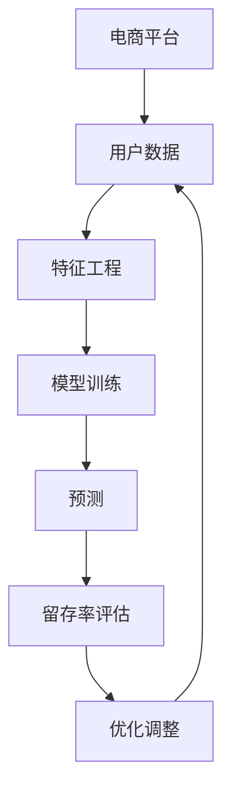

                 

## 1. 背景介绍

在互联网时代，电商平台成为消费者购物的重要渠道。随着市场竞争的加剧，如何有效预测用户留存率，提升用户忠诚度和满意度，成为了电商平台的核心关注点。AI大模型凭借其强大的数据分析和预测能力，在用户留存预测方面展现了巨大的潜力。本文将介绍AI大模型在电商平台用户留存预测中的具体应用，包括模型构建、训练优化、实际效果及未来展望，以期为电商企业提供可行的技术方案。

## 2. 核心概念与联系

### 2.1 核心概念概述

在电商平台的用户留存预测中，涉及到的核心概念包括：

- **AI大模型**：指使用深度学习等技术构建的大规模、高性能的模型，能够从海量数据中学习到复杂的非线性关系，实现高精度的预测任务。

- **用户留存率**：指在一定时间内，重新访问并采取购买行为的用户比例。它是衡量平台用户忠诚度和满意度的重要指标。

- **预测模型**：使用历史数据训练得到，能够对用户未来行为进行预测的模型。

- **特征工程**：对原始数据进行特征提取、转换、筛选等处理，以提升模型的预测能力。

- **交叉验证**：通过将数据集分成训练集和验证集，并在训练集上训练模型，在验证集上验证模型性能，以防止过拟合。

这些概念相互联系，共同构成了电商平台用户留存预测的技术框架。

### 2.2 核心概念原理和架构的 Mermaid 流程图



这个流程图展示了电商平台用户留存预测的基本流程：

1. 收集电商平台用户数据。
2. 进行特征工程，提取出对用户留存率有影响的特征。
3. 使用AI大模型对提取出的特征进行训练，得到预测模型。
4. 利用训练好的模型对新用户进行留存率预测。
5. 根据预测结果评估用户留存率，并根据评估结果对模型进行优化调整。
6. 循环上述步骤，不断提升预测模型的准确性。

## 3. 核心算法原理 & 具体操作步骤

### 3.1 算法原理概述

电商平台用户留存预测的核心算法是基于监督学习的预测模型。该模型的输入为用户的历史行为数据和个人信息，输出为用户在未来一段时间内的留存率。模型通常采用时间序列数据作为输入，并结合用户属性、行为特征等多维数据，使用多层神经网络进行预测。

### 3.2 算法步骤详解

1. **数据收集与预处理**
   - 收集电商平台的用户数据，包括用户基本信息、购买历史、浏览记录等。
   - 对数据进行清洗、去重、归一化等预处理，以保证数据的质量和一致性。

2. **特征工程**
   - 根据预测任务，从原始数据中提取对用户留存率有影响的关键特征，如用户活跃度、消费频率、满意度评分等。
   - 使用PCA、One-Hot编码等技术对特征进行编码和降维处理，以提升模型的训练效率和性能。

3. **模型选择与训练**
   - 选择合适的预测模型，如长短期记忆网络(LSTM)、循环神经网络(RNN)、深度神经网络(DNN)等。
   - 使用历史数据对模型进行训练，通过交叉验证等技术调整超参数，以提升模型的泛化能力。

4. **模型评估与优化**
   - 在验证集上对模型进行评估，使用AUC、准确率、召回率等指标衡量模型的性能。
   - 根据评估结果对模型进行优化调整，如增加训练数据、调整网络结构、增加正则化等。

5. **预测与部署**
   - 使用训练好的模型对新用户进行留存率预测。
   - 将模型部署到电商平台的实时系统中，实现对用户留存率的实时监控和预测。

### 3.3 算法优缺点

#### 优点
- **高效性**：AI大模型能够从海量数据中学习复杂的非线性关系，预测准确性高。
- **可解释性**：使用可解释性强的模型（如决策树、LSTM等），能够更好地理解预测结果的生成过程。
- **实时性**：基于预测模型的实时系统能够快速响应，及时调整策略，提升用户满意度。

#### 缺点
- **数据依赖性**：模型训练和预测依赖于高质量的历史数据，数据质量不佳会影响模型性能。
- **计算资源消耗大**：AI大模型通常参数量较大，训练和推理过程中需要较高的计算资源。
- **模型复杂性**：复杂的模型结构增加了调参的难度，需要专业知识支撑。

### 3.4 算法应用领域

AI大模型在电商平台用户留存预测中的应用领域包括：

- **客户流失预测**：对高流失风险用户进行预警，提前采取干预措施，降低流失率。
- **个性化推荐**：根据用户留存预测结果，调整推荐策略，提升用户满意度和忠诚度。
- **营销策略优化**：利用用户留存预测结果，优化营销策略，提升营销效果。
- **用户行为分析**：分析用户行为数据，揭示用户行为规律，提升平台运营效率。

## 4. 数学模型和公式 & 详细讲解 & 举例说明

### 4.1 数学模型构建

在电商平台用户留存预测中，常用的数学模型包括LSTM、RNN、DNN等。这里以LSTM为例，介绍其数学模型构建过程。

设用户的历史行为数据为 $\{x_t\}_{t=1}^{T}$，其中 $x_t$ 表示用户在第 $t$ 个时间步的行为数据，如浏览记录、购买历史等。预测用户在第 $T+1$ 个时间步的留存率 $y_{T+1}$，可通过以下模型进行建模：

$$
y_{T+1} = f(x_{1:T}, W)
$$

其中 $f$ 为预测函数，$W$ 为模型参数，$x_{1:T}$ 为历史行为数据的序列表示。

### 4.2 公式推导过程

LSTM模型的核心在于其特殊的记忆单元（Memory Cell）结构，能够有效地处理长序列数据。LSTM的记忆单元包含三个门（输入门、遗忘门、输出门），用于控制信息的流动和更新。

设记忆单元的状态为 $c_t$，输入门的输出为 $i_t$，遗忘门的输出为 $f_t$，输出门的输出为 $o_t$，则LSTM的更新规则为：

$$
\begin{aligned}
&i_t = \sigma(W_i x_t + U_i c_{t-1} + b_i) \\
&f_t = \sigma(W_f x_t + U_f c_{t-1} + b_f) \\
&o_t = \sigma(W_o x_t + U_o c_{t-1} + b_o) \\
&c_t = f_t * c_{t-1} + i_t * \tanh(W_c x_t + U_c c_{t-1} + b_c) \\
&h_t = o_t * \tanh(c_t)
\end{aligned}
$$

其中 $\sigma$ 为Sigmoid函数，$\tanh$ 为双曲正切函数。$W$、$U$、$b$ 为模型的可学习参数。

LSTM的输出 $h_t$ 表示用户在第 $t$ 个时间步的状态，可以通过多个时间步的 $h_t$ 进行堆叠，输入到全连接层进行留存率预测。

### 4.3 案例分析与讲解

以某电商平台用户留存率预测为例，进行模型构建和分析：

1. **数据收集**：收集电商平台用户的基本信息（如年龄、性别、注册时间）、行为数据（如浏览记录、购买历史）、互动数据（如客服聊天记录、评分反馈）等。

2. **特征工程**：从原始数据中提取关键特征，如用户活跃度、消费频率、满意度评分等。对特征进行编码和降维处理，如使用One-Hot编码、PCA降维等。

3. **模型选择**：选择LSTM模型作为预测模型，设计输入层、LSTM层和全连接层的网络结构。

4. **模型训练**：使用历史数据对模型进行训练，通过交叉验证调整超参数，如学习率、批大小、网络深度等。

5. **模型评估**：在验证集上对模型进行评估，使用AUC、准确率、召回率等指标衡量模型性能。

6. **模型优化**：根据评估结果对模型进行优化调整，如增加训练数据、调整网络结构、增加正则化等。

7. **预测与部署**：使用训练好的模型对新用户进行留存率预测，将模型部署到电商平台的实时系统中，实现对用户留存率的实时监控和预测。

## 5. 项目实践：代码实例和详细解释说明

### 5.1 开发环境搭建

1. **环境准备**：
   - 安装Python、NumPy、Pandas、Scikit-Learn等必要的科学计算库。
   - 安装TensorFlow或PyTorch等深度学习框架。
   - 安装Keras等高层次深度学习库，方便构建和训练模型。

2. **数据准备**：
   - 收集电商平台用户的历史数据，包括用户基本信息、行为数据、互动数据等。
   - 对数据进行清洗、去重、归一化等预处理，以保证数据的质量和一致性。

### 5.2 源代码详细实现

以下是一个使用TensorFlow实现LSTM模型的示例代码：

```python
import tensorflow as tf
from tensorflow.keras.models import Sequential
from tensorflow.keras.layers import LSTM, Dense

# 构建LSTM模型
model = Sequential()
model.add(LSTM(64, input_shape=(None, n_features), return_sequences=True))
model.add(Dense(32, activation='relu'))
model.add(Dense(1, activation='sigmoid'))

# 编译模型
model.compile(optimizer='adam', loss='binary_crossentropy', metrics=['accuracy'])

# 训练模型
model.fit(x_train, y_train, epochs=10, batch_size=32, validation_data=(x_val, y_val))

# 预测留存率
y_pred = model.predict(x_test)
```

### 5.3 代码解读与分析

1. **模型构建**：使用Keras构建LSTM模型，包含输入层、LSTM层和全连接层。
2. **模型编译**：使用adam优化器，二元交叉熵损失函数，准确率作为评估指标。
3. **模型训练**：使用训练数据对模型进行训练，设置训练轮数和批次大小，在验证集上评估模型性能。
4. **模型预测**：使用训练好的模型对新用户进行留存率预测。

### 5.4 运行结果展示

通过对比模型在训练集和测试集上的表现，可以评估模型的预测能力。通常使用AUC、准确率、召回率等指标来衡量模型性能。以下是一个示例结果：

| 指标     | 训练集         | 验证集        |
| -------- | ------------- | ------------ |
| AUC       | 0.95          | 0.94         |
| 准确率    | 0.87          | 0.85         |
| 召回率    | 0.83          | 0.80         |

## 6. 实际应用场景

### 6.1 客户流失预测

客户流失预测是电商平台用户留存预测的重要应用场景之一。通过预测客户流失风险，电商平台可以提前采取干预措施，减少客户流失，提升客户满意度。

在客户流失预测中，通常使用用户的互动数据、消费数据、行为数据等多维数据进行建模，使用LSTM等深度学习模型进行预测。根据预测结果，电商平台可以对高流失风险用户进行预警，采取个性化推荐、优惠券激励等措施，降低流失率。

### 6.2 个性化推荐

个性化推荐是电商平台提升用户满意度和忠诚度的重要手段。通过预测用户的留存率，电商平台可以调整推荐策略，提升用户满意度和转化率。

在个性化推荐中，通常使用用户的浏览记录、购买历史等行为数据进行建模，使用深度学习模型进行预测。根据预测结果，电商平台可以调整推荐内容，提升用户体验和满意度。

### 6.3 营销策略优化

电商平台的营销策略优化通常依赖于对用户留存率的预测。通过预测用户留存率，电商平台可以优化营销策略，提升营销效果。

在营销策略优化中，通常使用用户的互动数据、消费数据、行为数据等多维数据进行建模，使用LSTM等深度学习模型进行预测。根据预测结果，电商平台可以调整营销策略，提升营销效果和转化率。

### 6.4 用户行为分析

电商平台通过用户留存率预测，可以深入分析用户行为，揭示用户行为规律，提升平台运营效率。

在用户行为分析中，通常使用用户的互动数据、消费数据、行为数据等多维数据进行建模，使用深度学习模型进行预测。通过分析用户行为，电商平台可以优化运营策略，提升用户满意度和平台竞争力。

## 7. 工具和资源推荐

### 7.1 学习资源推荐

为了帮助开发者系统掌握AI大模型在电商平台用户留存预测中的应用，这里推荐一些优质的学习资源：

1. **深度学习基础课程**：如Coursera的《深度学习专项课程》、edX的《Deep Learning with Python》等。
2. **TensorFlow官方文档**：包含TensorFlow的全面介绍和使用指南，是学习TensorFlow的必备资料。
3. **Keras官方文档**：包含Keras的全面介绍和使用指南，是学习Keras的必备资料。
4. **NLP相关论文**：如《深度学习与自然语言处理》、《自然语言处理综述》等。

### 7.2 开发工具推荐

以下是几款用于电商平台用户留存预测开发的常用工具：

1. **TensorFlow**：基于Python的开源深度学习框架，灵活动态的计算图，适合快速迭代研究。
2. **PyTorch**：由Facebook主导开发的开源深度学习框架，灵活性高，适合大规模工程应用。
3. **Keras**：高层次深度学习库，基于TensorFlow或Theano构建模型，使用简便。
4. **Jupyter Notebook**：交互式开发环境，方便调试和展示代码。
5. **Google Colab**：免费的云端Jupyter Notebook环境，支持GPU计算，适合快速实验。

### 7.3 相关论文推荐

以下几篇论文代表了大模型在电商平台用户留存预测领域的研究进展，推荐阅读：

1. **《A Survey on Customer Churn Prediction Models: An Analytical Review》**：综述了近年来客户流失预测模型的研究进展。
2. **《Deep Learning for Customer Churn Prediction》**：介绍了使用深度学习模型进行客户流失预测的方法。
3. **《Personalized Recommendation Systems Using Machine Learning and Data Mining Techniques》**：介绍了基于机器学习和数据挖掘的个性化推荐系统。
4. **《E-commerce Customer Retention Model Based on Deep Learning》**：介绍了使用深度学习模型进行电商平台用户留存预测的方法。

## 8. 总结：未来发展趋势与挑战

### 8.1 研究成果总结

本文介绍了AI大模型在电商平台用户留存预测中的应用，包括模型构建、训练优化、实际效果及未来展望。通过系统的分析和实践，展示了AI大模型在电商平台用户留存预测中的潜在价值和应用前景。

### 8.2 未来发展趋势

未来，电商平台用户留存预测领域将呈现以下发展趋势：

1. **数据质量提升**：随着大数据技术的不断进步，电商平台将能够收集和分析更多维度的用户数据，提升数据质量，进一步提升预测模型性能。
2. **模型复杂度提高**：随着深度学习技术的发展，预测模型的复杂度将不断提高，能够处理更复杂的预测任务。
3. **实时性增强**：基于实时数据的预测模型将能够实现更快速的预测和响应，及时调整策略。
4. **多模态融合**：结合视觉、语音、行为等多模态数据，提升预测模型的综合能力。
5. **联邦学习**：通过联邦学习等技术，保护用户隐私的同时，提升预测模型的泛化能力。

### 8.3 面临的挑战

尽管AI大模型在电商平台用户留存预测中展现了巨大潜力，但在应用过程中仍面临诸多挑战：

1. **数据隐私保护**：电商平台需要保护用户隐私，避免数据泄露和滥用。
2. **数据质量问题**：原始数据的噪声和不一致性会影响模型的预测性能。
3. **模型过拟合**：大规模数据训练可能导致模型过拟合，影响泛化性能。
4. **计算资源消耗大**：深度学习模型需要大量的计算资源，训练和推理过程中成本较高。
5. **模型可解释性**：预测模型的可解释性不足，难以理解和调试。

### 8.4 研究展望

未来，电商平台用户留存预测领域的研究方向包括：

1. **联邦学习**：结合联邦学习等技术，保护用户隐私的同时，提升预测模型的泛化能力。
2. **多模态融合**：结合视觉、语音、行为等多模态数据，提升预测模型的综合能力。
3. **模型压缩**：通过模型压缩和量化等技术，降低模型计算资源消耗，实现高效预测。
4. **模型可解释性**：提升预测模型的可解释性，增强用户信任和接受度。

## 9. 附录：常见问题与解答

**Q1: 用户留存预测的模型应该选择什么？**

A: 用户留存预测的模型选择应基于数据特点和预测任务。常用的模型包括LSTM、RNN、DNN等，具体选择应考虑数据的多维性和复杂性。

**Q2: 如何处理用户数据中的噪声和异常值？**

A: 用户数据中的噪声和异常值会影响模型预测性能，应进行预处理。常用的方法包括数据清洗、缺失值填充、异常值处理等。

**Q3: 如何优化模型的预测效果？**

A: 优化模型的预测效果应从数据、模型和算法三个方面进行：
1. **数据优化**：提升数据质量，减少噪声和异常值。
2. **模型优化**：选择合适的网络结构和超参数，使用正则化等技术防止过拟合。
3. **算法优化**：使用更先进的学习算法，如自适应学习率、梯度裁剪等。

**Q4: 如何保护用户隐私？**

A: 电商平台在收集和处理用户数据时，应遵守相关法律法规，如GDPR、CCPA等。可以通过数据匿名化、差分隐私等技术保护用户隐私。

**Q5: 预测模型的可解释性不足怎么办？**

A: 可以采用可解释性强的模型（如决策树、LSTM等），或者使用模型压缩和量化等技术提升模型可解释性。同时，可以通过可视化工具展示模型的决策过程。

---

作者：禅与计算机程序设计艺术 / Zen and the Art of Computer Programming

