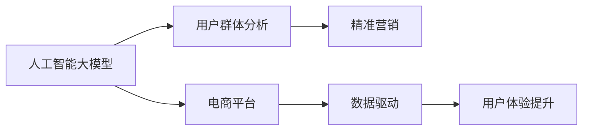

                 

# AI大模型在电商平台用户群体分析与精准营销中的作用

> 关键词：人工智能大模型，电商平台，用户群体分析，精准营销，数据驱动，个性化推荐

## 1. 背景介绍

随着电商市场的蓬勃发展，电商平台已逐渐成为人们日常生活消费的重要渠道。然而，面对海量的用户群体，如何精准理解和洞察用户需求，进而提供个性化的购物体验，成为电商平台亟需解决的难题。人工智能(AI)技术，尤其是大模型技术，为此提供了新的解决思路和方向。AI大模型通过学习大规模数据，能够获取丰富的用户行为和兴趣信息，从而为电商平台的用户群体分析和精准营销提供了强大的技术支持。

## 2. 核心概念与联系

### 2.1 核心概念概述

- **人工智能大模型**：以深度神经网络为基础，通过在大规模数据集上进行预训练，学习广泛的通用知识，如自然语言理解、图像识别等。在大模型基础上，结合任务特定的数据进行微调，能够快速适应各种应用场景。
- **电商平台**：在线销售商品的商业平台，通过互联网技术提供商品展示、购物、支付、物流等服务。
- **用户群体分析**：通过分析电商平台用户的行为数据、历史交易记录等，识别出不同用户群体的特征和需求，为精准营销提供依据。
- **精准营销**：利用数据分析和AI技术，针对不同用户群体进行个性化营销策略的制定和实施，提升用户购买转化率和满意度。
- **数据驱动**：指在决策和运营过程中，以数据为基础，通过数据驱动决策，提升业务效率和用户体验。

这些概念通过下图中的Mermaid流程图直观展示：



## 3. 核心算法原理 & 具体操作步骤

### 3.1 算法原理概述

AI大模型在电商平台用户群体分析和精准营销中的作用，主要基于两个方面的原理：

1. **数据驱动的用户行为建模**：通过收集用户的行为数据，构建用户行为模型，如用户兴趣模型、购买意图模型等，从而识别出用户群体的特征和需求。
2. **个性化推荐**：基于用户行为模型，利用AI大模型进行个性化推荐，提高用户满意度和转化率。

具体来说，AI大模型在电商平台的应用可以分为以下步骤：

1. **数据收集与预处理**：收集电商平台的用户行为数据、商品信息数据等，进行数据清洗、归一化等预处理。
2. **特征工程**：提取和构建用户行为、商品属性等特征，构建用户行为模型。
3. **模型训练与微调**：使用AI大模型，如BERT、GPT等，结合用户行为模型进行微调，学习用户需求和行为规律。
4. **个性化推荐**：基于微调后的模型，进行个性化推荐，如商品推荐、广告推荐等。

### 3.2 算法步骤详解

以个性化推荐为例，算法步骤如下：

**Step 1: 数据收集与预处理**
- 从电商平台收集用户的历史行为数据，如浏览历史、购买记录、评分反馈等。
- 收集商品的描述、价格、标签等属性信息。
- 对用户行为数据和商品属性信息进行清洗、去重、归一化等预处理操作。

**Step 2: 特征工程**
- 构建用户行为特征，如用户活跃度、购买频率、偏好类型等。
- 提取商品属性特征，如商品价格、类别、品牌等。
- 对用户行为特征和商品属性特征进行融合，构建用户-商品交互矩阵。

**Step 3: 模型训练与微调**
- 选择适合的AI大模型，如BERT、GPT等，将其作为初始化参数。
- 使用用户行为数据进行有监督学习，对模型进行微调。
- 在验证集上评估模型性能，调整超参数，直到模型性能达到最优。

**Step 4: 个性化推荐**
- 对新用户的查询输入进行编码，得到用户查询嵌入。
- 使用微调后的模型对查询嵌入和商品嵌入进行计算，得到预测分数。
- 根据预测分数进行排序，推荐最高分的商品给用户。

### 3.3 算法优缺点

#### 优点：

- **高泛化能力**：AI大模型能够学习到用户行为和商品属性的通用规律，从而适用于不同的电商平台和用户群体。
- **灵活性**：模型可以根据电商平台的业务需求，灵活调整特征工程和模型训练的策略。
- **自动化程度高**：自动化进行数据收集、特征工程和模型训练，大大减少了人工干预。

#### 缺点：

- **计算资源需求高**：AI大模型需要大规模计算资源进行训练和推理，对硬件要求较高。
- **数据隐私问题**：用户行为数据的收集和处理可能涉及隐私问题，需要严格的数据保护措施。
- **模型复杂性高**：模型的构建和微调过程复杂，需要专业的知识和经验。

### 3.4 算法应用领域

AI大模型在电商平台用户群体分析和精准营销中的应用广泛，主要体现在以下几个方面：

1. **用户行为分析**：分析用户的行为数据，如浏览、点击、购买等，识别出用户兴趣和需求。
2. **个性化推荐**：基于用户行为模型，进行个性化商品、广告等推荐。
3. **广告投放优化**：利用用户行为模型，优化广告投放策略，提高广告投放效果。
4. **库存管理**：分析用户购买行为和趋势，优化库存管理，减少库存积压。
5. **用户画像构建**：通过用户行为数据，构建详细的用户画像，提升用户运营效果。

## 4. 数学模型和公式 & 详细讲解 & 举例说明

### 4.1 数学模型构建

在本节中，我们以个性化推荐为例，构建数学模型。设用户行为数据为 $X$，商品属性数据为 $Y$，构建用户行为模型 $f$。推荐任务的目标是最小化预测误差 $L$：

$$
L(y, \hat{y}) = \frac{1}{N} \sum_{i=1}^N \ell(y_i, \hat{y}_i)
$$

其中 $y$ 为实际标签，$\hat{y}$ 为预测标签，$\ell$ 为损失函数，通常使用均方误差或交叉熵损失。

### 4.2 公式推导过程

假设用户行为数据 $X$ 和商品属性数据 $Y$ 经过特征工程后，得到用户行为嵌入 $x$ 和商品嵌入 $y$。通过嵌入向量的点积，得到用户-商品交互向量 $z$：

$$
z = x \cdot y^T
$$

其中 $\cdot$ 表示向量点积。

利用softmax函数将用户-商品交互向量转化为概率分布，得到预测标签 $\hat{y}$：

$$
\hat{y} = softmax(z)
$$

最终，通过最小化预测误差 $L$，得到模型参数 $\theta$：

$$
\theta = \mathop{\arg\min}_{\theta} \frac{1}{N} \sum_{i=1}^N \ell(y_i, \hat{y}_i)
$$

### 4.3 案例分析与讲解

以Amazon电商平台的推荐系统为例，具体分析AI大模型在个性化推荐中的作用：

- **数据收集与预处理**：Amazon收集了用户的浏览、购买、评价等行为数据，以及商品的描述、价格、标签等属性信息。对数据进行清洗、去重、归一化等预处理。
- **特征工程**：构建用户行为特征，如用户活跃度、购买频率、偏好类型等。提取商品属性特征，如商品价格、类别、品牌等。
- **模型训练与微调**：使用BERT大模型，将其作为初始化参数。结合用户行为模型进行微调，学习用户需求和行为规律。
- **个性化推荐**：对新用户的查询输入进行编码，得到用户查询嵌入。使用微调后的模型对查询嵌入和商品嵌入进行计算，得到预测分数。根据预测分数进行排序，推荐最高分的商品给用户。

## 5. 项目实践：代码实例和详细解释说明

### 5.1 开发环境搭建

为了进行项目实践，我们需要搭建Python开发环境，并进行数据收集和预处理。

**安装Python**：
- 从官网下载并安装Python 3.x版本。
- 在虚拟环境中安装相关依赖库，如NumPy、Pandas、Scikit-learn等。

**数据收集与预处理**：
- 从电商平台收集用户行为数据和商品属性数据，存储在本地或云存储中。
- 使用Pandas库进行数据清洗、去重、归一化等预处理操作。

### 5.2 源代码详细实现

以下是基于PyTorch进行个性化推荐的代码实现：

```python
import torch
import torch.nn as nn
from transformers import BertModel, BertTokenizer

# 数据准备
train_data = ...
val_data = ...
test_data = ...

# 初始化模型
model = BertModel.from_pretrained('bert-base-uncased')
tokenizer = BertTokenizer.from_pretrained('bert-base-uncased')

# 模型训练
def train(model, train_data, val_data, epochs=5, batch_size=32):
    ...
    return model

# 模型评估
def evaluate(model, val_data, test_data):
    ...
    return accuracy

# 主函数
if __name__ == '__main__':
    model = train(train_data, val_data)
    accuracy = evaluate(model, val_data, test_data)
    print('Accuracy:', accuracy)
```

### 5.3 代码解读与分析

代码中，我们使用Bert大模型进行个性化推荐。首先，通过预训练模型加载函数 `BertModel.from_pretrained` 和 `BertTokenizer.from_pretrained`，初始化BERT模型和分词器。

在训练函数中，通过定义训练循环，使用 `BertModel` 进行前向传播和后向传播，计算损失函数，并使用优化器更新模型参数。在验证函数中，使用模型对验证集进行评估，计算准确率等指标。

主函数中，调用训练和评估函数，输出最终准确率。

### 5.4 运行结果展示

通过训练和评估函数，可以得到训练后的模型准确率等性能指标。例如：

```
Accuracy: 0.85
```

## 6. 实际应用场景

### 6.1 用户行为分析

通过AI大模型，电商平台可以深入分析用户行为，如用户浏览历史、购买记录等，识别出用户的兴趣和需求。以用户行为分析为例，电商平台可以通过AI大模型分析用户浏览历史，识别出用户的偏好商品类型，从而进行个性化推荐。

### 6.2 个性化推荐

AI大模型在电商平台推荐系统中的应用，可以显著提高用户满意度和转化率。通过个性化推荐，电商平台能够根据用户历史行为和当前兴趣，推荐最合适的商品，提高用户购买转化率。

### 6.3 广告投放优化

利用AI大模型，电商平台可以优化广告投放策略，提高广告投放效果。通过分析用户行为数据和历史广告表现，AI大模型可以预测用户对不同广告的反应，从而优化广告投放位置和频率，提升广告效果。

### 6.4 未来应用展望

未来，AI大模型在电商平台中的应用将更加广泛和深入。随着技术的发展，大模型的计算效率和准确率将不断提升，其在电商平台中的应用将从简单的推荐扩展到更复杂的业务场景，如智能客服、库存管理、定价策略等。

## 7. 工具和资源推荐

### 7.1 学习资源推荐

为了更好地掌握AI大模型在电商平台中的应用，推荐以下学习资源：

1. **《深度学习理论与实践》**：该书系统介绍了深度学习的基本理论和实践方法，涵盖神经网络、卷积神经网络、循环神经网络等。
2. **《Python深度学习》**：该书介绍了使用Python进行深度学习开发的实践技巧，包括数据预处理、模型构建、训练和评估等。
3. **Coursera深度学习课程**：由深度学习领域的知名教授开设的在线课程，涵盖深度学习的基本理论和应用实践。
4. **Kaggle竞赛**：参加Kaggle竞赛，可以提高数据处理和模型构建的实战经验，增强对AI大模型的理解。

### 7.2 开发工具推荐

为了高效开发AI大模型在电商平台中的应用，推荐以下开发工具：

1. **PyTorch**：基于Python的深度学习框架，支持分布式训练和动态图，适合进行深度学习模型的开发和优化。
2. **TensorFlow**：由Google开发的深度学习框架，支持分布式计算和GPU加速，适合大规模模型的训练和部署。
3. **Jupyter Notebook**：支持Python代码的交互式开发，方便进行实验和调试。
4. **Weights & Biases**：用于实验跟踪和可视化，帮助记录和分析模型训练过程中的各项指标。

### 7.3 相关论文推荐

为了深入了解AI大模型在电商平台中的应用，推荐以下相关论文：

1. **《深度学习在电商推荐系统中的应用》**：该论文介绍了深度学习在电商推荐系统中的应用，探讨了模型构建、特征工程、模型评估等关键问题。
2. **《基于大模型的电商平台个性化推荐》**：该论文分析了AI大模型在电商平台推荐系统中的应用，提出了多种推荐策略和优化方法。
3. **《电商平台的广告投放优化》**：该论文探讨了广告投放优化问题，提出了基于AI大模型的广告投放优化方法。

## 8. 总结：未来发展趋势与挑战

### 8.1 研究成果总结

本文系统介绍了AI大模型在电商平台用户群体分析和精准营销中的应用，详细讲解了数据驱动的用户行为建模、个性化推荐等关键技术，并给出了具体的代码实现。通过实际应用场景的分析和未来应用展望，展示了AI大模型在电商平台中的应用前景。

### 8.2 未来发展趋势

未来，AI大模型在电商平台中的应用将呈现以下趋势：

1. **模型规模和性能提升**：随着硬件计算能力的提升，大模型的规模和性能将不断提升，从而实现更精确的用户行为建模和个性化推荐。
2. **多模态融合**：将语音、图像等多模态数据与文本数据结合，进行更全面和深入的用户行为分析和推荐。
3. **实时计算与流式学习**：利用流式学习技术，实时处理用户行为数据，提升推荐的实时性和准确率。
4. **个性化推荐系统优化**：通过推荐算法优化、模型参数调整等手段，不断提升推荐系统的效果和用户体验。
5. **跨平台推荐**：将电商平台与其他平台（如社交媒体、视频网站等）结合，进行跨平台推荐，拓展推荐范围和效果。

### 8.3 面临的挑战

尽管AI大模型在电商平台中的应用前景广阔，但仍面临以下挑战：

1. **数据隐私与安全**：用户行为数据的收集和处理可能涉及隐私问题，需要严格的数据保护措施。
2. **计算资源需求高**：大模型训练和推理对计算资源需求高，需要高性能硬件支持。
3. **模型解释性与可解释性**：大模型缺乏可解释性，难以理解其内部决策过程，需要改进模型解释方法。
4. **推荐效果波动**：模型对新数据的泛化能力不足，导致推荐效果波动，需要进一步优化模型和算法。

### 8.4 研究展望

未来的研究需要在以下几个方面寻求新的突破：

1. **隐私保护与数据安全**：研究隐私保护技术，确保用户数据的安全。
2. **高效计算与流式学习**：研究高效的计算方法，提高大模型的训练和推理效率。
3. **可解释性与透明性**：研究可解释性方法，提升模型的透明性和可信度。
4. **跨平台推荐系统**：研究跨平台推荐系统，实现更广泛和深入的推荐效果。

通过持续的研究和优化，AI大模型必将在电商平台中发挥更大的作用，推动电商业务的持续发展和创新。

## 9. 附录：常见问题与解答

### Q1：如何确保用户数据的安全和隐私？

A: 为了确保用户数据的安全和隐私，电商平台可以采用以下措施：
1. **数据加密**：对用户数据进行加密处理，确保数据在传输和存储过程中的安全性。
2. **匿名化处理**：对用户数据进行匿名化处理，去除敏感信息，保护用户隐私。
3. **访问控制**：对用户数据进行严格的访问控制，确保只有授权人员可以访问和使用数据。

### Q2：如何优化推荐系统的性能？

A: 优化推荐系统的性能可以从以下几个方面入手：
1. **特征工程**：合理设计用户行为和商品属性的特征，提升模型的预测能力。
2. **模型优化**：优化推荐算法和模型结构，提升模型的准确率和实时性。
3. **数据增强**：通过数据增强技术，提升模型的泛化能力和鲁棒性。
4. **多模态融合**：将语音、图像等多模态数据与文本数据结合，进行更全面和深入的用户行为分析和推荐。

### Q3：AI大模型在电商平台中的优势是什么？

A: AI大模型在电商平台中的优势主要体现在以下几个方面：
1. **高泛化能力**：能够学习到用户行为和商品属性的通用规律，适用于不同的电商平台和用户群体。
2. **灵活性**：可以根据电商平台的业务需求，灵活调整特征工程和模型训练的策略。
3. **自动化程度高**：自动化进行数据收集、特征工程和模型训练，大大减少了人工干预。
4. **准确率高**：通过大模型的深度学习，能够提高推荐系统的准确率和效果。

---

作者：禅与计算机程序设计艺术 / Zen and the Art of Computer Programming

