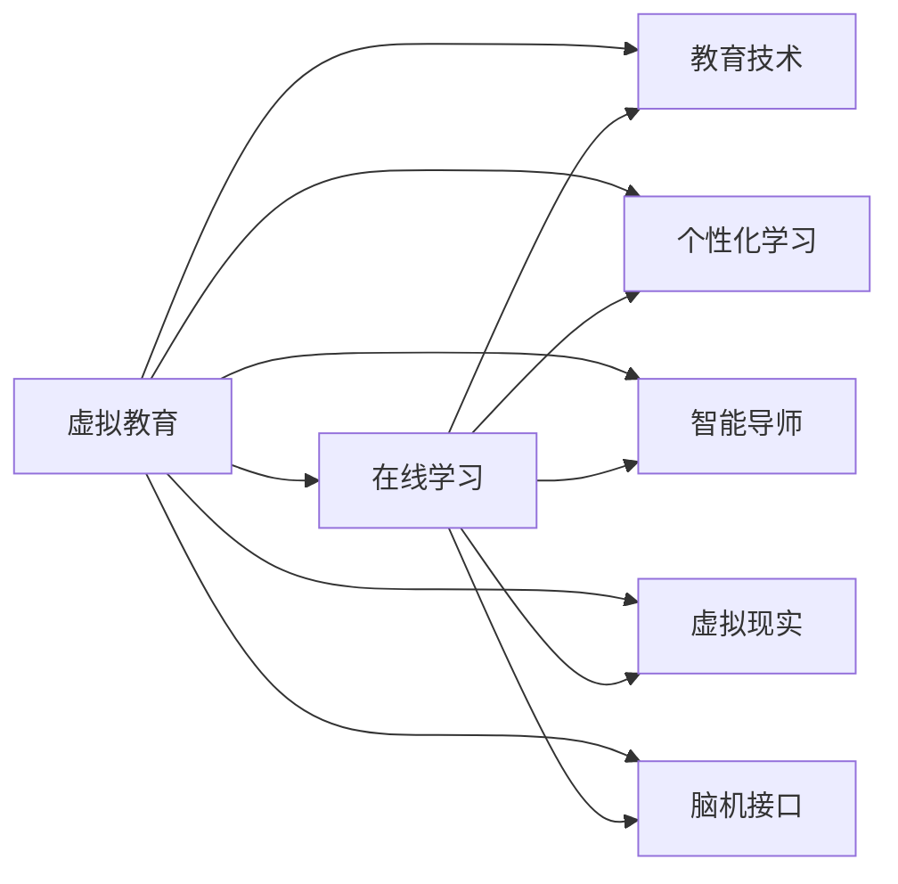
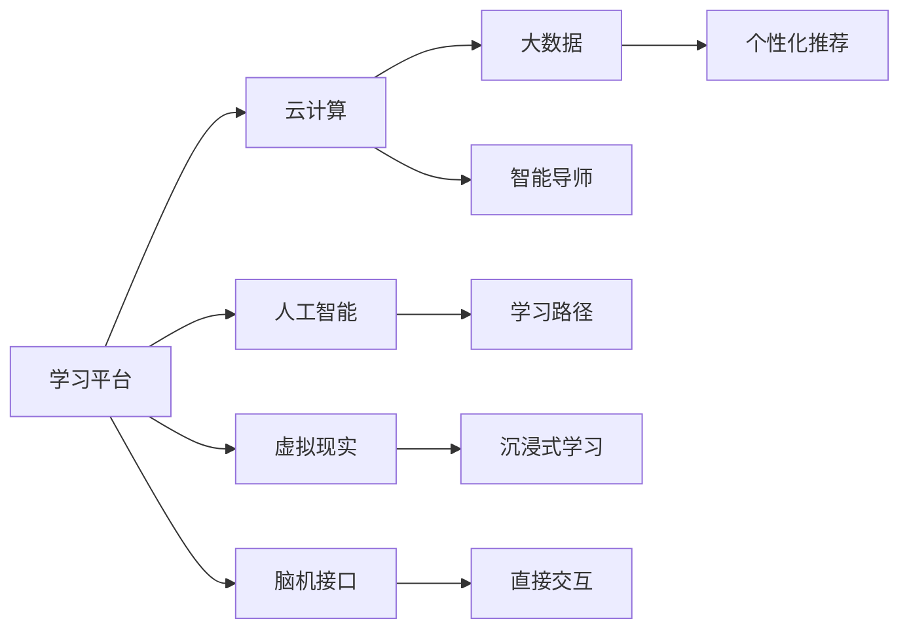

                 

# 虚拟教育：全球脑时代下的学习新方式

> 关键词：虚拟教育,全球脑时代,在线学习,教育技术,个性化学习,智能导师,脑机接口,虚拟现实

## 1. 背景介绍

### 1.1 问题由来
随着全球脑时代(Brains of the World)的到来，传统的面对面教学模式逐渐被数字化、智能化、个性化、全球化的在线教育所取代。面对信息爆炸、知识更新加速的挑战，教育界亟需创新教学方法和技术，提升教育质量和效率。

虚拟教育(Virtual Education)作为教育技术的前沿领域，正通过数字化手段重塑学习方式，为全球范围内的学习者提供前所未有的便利和自由。本文将深入探讨虚拟教育的核心概念与原理，剖析其核心算法，并结合实际应用场景进行详细讲解。

### 1.2 问题核心关键点
虚拟教育的核心在于通过技术手段，创造一个虚拟的学习空间，使学习者可以不受时间、空间限制，随时随地获取知识，提升学习效果。其关键点包括：
1. 技术基础设施：如云计算、大数据、人工智能等。
2. 个性化学习：通过数据驱动，为每个学习者提供定制化学习路径。
3. 智能导师：借助智能算法和推荐系统，提供及时反馈和个性化指导。
4. 虚拟现实：利用VR/AR技术，创造沉浸式学习体验。
5. 脑机接口：通过脑电信号，实现学习者与系统的直接交互。
6. 全球化教育：打破地域限制，实现资源共享和协作学习。

这些关键点共同构成了虚拟教育的技术框架，使其能够适应快速变化的教育需求，为学习者提供更加高效、个性化、沉浸式的学习体验。

## 2. 核心概念与联系

### 2.1 核心概念概述

为了更好地理解虚拟教育，我们需要先明确几个核心概念：

- **虚拟教育**：通过技术手段创造的虚拟学习环境，实现数字化、智能化、个性化、全球化的教学。
- **在线学习**：借助互联网技术，通过远程教学平台进行的自主学习。
- **教育技术**：应用信息技术于教育领域，提高教育效率和质量。
- **个性化学习**：根据学习者特性，定制个性化的学习路径和内容。
- **智能导师**：利用人工智能技术，提供实时反馈和个性化指导。
- **虚拟现实**：利用VR/AR技术，创建沉浸式学习环境。
- **脑机接口**：通过脑电信号，实现学习者与系统的直接交互。

这些概念之间的联系可以用以下Mermaid流程图来表示：



### 2.2 核心概念原理和架构的 Mermaid 流程图

为了更直观地理解虚拟教育的核心架构，下面给出其技术实现的基本框架：



- **云计算**：提供高效稳定的计算和存储资源。
- **大数据**：收集和分析学习者的行为数据，提供个性化学习支持。
- **人工智能**：利用机器学习、深度学习等技术，提升智能导师和个性化推荐的准确性。
- **虚拟现实**：通过VR/AR技术，增强学习体验的沉浸感和互动性。
- **脑机接口**：实现学习者与系统的直接交互，提升学习效果。

虚拟教育的技术架构涵盖了云计算、大数据、人工智能等领域的先进技术，为个性化、沉浸式、智能化的学习体验提供了坚实基础。

## 3. 核心算法原理 & 具体操作步骤

### 3.1 算法原理概述

虚拟教育的核心算法原理可以归纳为以下几个方面：

- **数据驱动的个性化推荐**：通过分析学习者的历史行为数据，利用协同过滤、基于内容的推荐等算法，推荐适合学习者的内容和路径。
- **智能导师的实时反馈**：基于强化学习、深度学习等技术，设计智能导师模型，根据学习者的表现提供个性化反馈和指导。
- **虚拟现实环境的设计**：利用计算机图形学、图像处理等技术，创造沉浸式、交互式的学习环境，增强学习效果。
- **脑机接口的实现**：通过脑电信号分析，实现学习者与系统的直接交互，提升学习体验。

### 3.2 算法步骤详解

以数据驱动的个性化推荐为例，其算法步骤大致如下：

1. **数据收集**：收集学习者的历史学习行为数据，如观看视频、练习题目、测试成绩等。
2. **特征提取**：将行为数据转换为向量表示，提取重要的特征。
3. **相似度计算**：计算当前学习者与所有学习者的相似度，找出相似的学习者群体。
4. **推荐生成**：基于相似度计算结果，利用协同过滤、基于内容的推荐等算法，生成个性化推荐。
5. **反馈循环**：根据学习者对推荐内容的反馈，动态调整推荐策略，不断优化推荐结果。

### 3.3 算法优缺点

数据驱动的个性化推荐算法的优点包括：
- 个性化度高：能够根据学习者的特点提供量身定制的学习内容。
- 动态适应：能够实时调整推荐策略，适应学习者变化的学习需求。
- 资源丰富：可以充分利用大数据的优势，提供丰富的学习资源。

缺点主要包括：
- 隐私保护：需要收集大量的个人数据，可能引发隐私问题。
- 算法复杂：算法的实现和维护需要较高的技术门槛。
- 偏差问题：可能存在数据偏差，导致推荐结果不平衡。

### 3.4 算法应用领域

数据驱动的个性化推荐算法在虚拟教育中有广泛的应用，如在线课程推荐、个性化学习路径规划、智能辅导系统等。

## 4. 数学模型和公式 & 详细讲解

### 4.1 数学模型构建

假设学习者的历史行为数据为 $\mathbf{x}=[x_1,x_2,\ldots,x_n]$，每个行为数据的权重为 $w=[w_1,w_2,\ldots,w_n]$。推荐系统的目标是最大化预测值 $y$ 与真实值 $y'$ 的匹配度，即：

$$
\max_{\mathbf{w},\mathbf{a},b} \mathcal{L} = -\frac{1}{N}\sum_{i=1}^N w_i(y'_i-\mathbf{a}^T \mathbf{x}_i - b)
$$

其中 $\mathbf{a}$ 为特征向量，$b$ 为偏置项。

### 4.2 公式推导过程

设 $\mathbf{X}=\{\mathbf{x}_1,\mathbf{x}_2,\ldots,\mathbf{x}_N\}$ 为学习者的历史行为数据矩阵，$\mathbf{Y}=\{y'_1,y'_2,\ldots,y'_N\}$ 为真实值向量，$\mathbf{W}=\{w_1,w_2,\ldots,w_N\}$ 为权重向量。则推荐系统的优化问题可以表示为：

$$
\max_{\mathbf{a},b} \mathcal{L} = -\frac{1}{N}\sum_{i=1}^N w_i(y'_i-\mathbf{a}^T \mathbf{x}_i - b)
$$

对 $\mathbf{a}$ 和 $b$ 求偏导，得：

$$
\frac{\partial \mathcal{L}}{\partial \mathbf{a}} = \frac{1}{N}\sum_{i=1}^N w_i(y'_i-\mathbf{a}^T \mathbf{x}_i - b) \mathbf{x}_i
$$

$$
\frac{\partial \mathcal{L}}{\partial b} = -\frac{1}{N}\sum_{i=1}^N w_i(y'_i-\mathbf{a}^T \mathbf{x}_i - b)
$$

利用梯度下降算法，可以更新 $\mathbf{a}$ 和 $b$ 的值，从而实现个性化推荐。

### 4.3 案例分析与讲解

以在线课程推荐系统为例，通过分析学习者的历史行为数据，如观看视频时长、测试成绩等，计算每个行为数据的权重，并将其转化为特征向量。利用协同过滤算法，找出相似的学习者群体，生成个性化推荐。例如，学习者A和B都观看过《机器学习》课程，A对课程的评分是4分，B的评分是3分，则A对B的相似度为0.6。根据历史数据，可以得到B观看《深度学习》课程的推荐，最终生成对A的推荐结果。

## 5. 项目实践：代码实例和详细解释说明

### 5.1 开发环境搭建

为了进行虚拟教育的开发，需要搭建一套完善的开发环境。以下是基本的搭建流程：

1. 安装Python：从官网下载Python 3.x版本，并配置系统环境。
2. 安装必要的库：安装numpy、pandas、scikit-learn、scipy等常用库。
3. 搭建数据平台：如Hadoop、Spark等大数据平台，用于存储和分析学习者行为数据。
4. 搭建云计算平台：如AWS、阿里云等云平台，提供高效的计算和存储资源。
5. 搭建虚拟现实平台：如Unity、Unreal Engine等，用于创建沉浸式学习环境。

### 5.2 源代码详细实现

以下是一个简单的推荐系统实现示例，使用协同过滤算法进行个性化推荐：

```python
import numpy as np
from scipy.sparse import coo_matrix

def collaborative_filtering(data, k=10):
    # 数据预处理
    X = np.array(data['X'])
    Y = np.array(data['Y'])
    w = np.array(data['W'])
    
    # 特征提取
    X = X / np.linalg.norm(X, axis=1, keepdims=True)
    Y = Y / np.linalg.norm(Y, axis=1, keepdims=True)
    
    # 矩阵分解
    U = np.random.rand(X.shape[0], k)
    V = np.random.rand(Y.shape[1], k)
    for i in range(10):
        U = np.dot(X.T, np.dot(Y, V)) / np.dot(X.T, Y)
        V = np.dot(Y.T, np.dot(X, U)) / np.dot(Y.T, X)
    
    # 计算推荐值
    pred = np.dot(X, U) @ V
    
    # 生成推荐
    index = np.argsort(pred)[::-1]
    recommend = [(data['X'][i], data['Y'][i]) for i in index[:10]]
    return recommend

# 数据示例
data = {
    'X': np.array([[1, 0, 1, 0], [1, 1, 0, 1], [0, 1, 0, 1], [0, 0, 1, 1], [1, 1, 1, 0]]),
    'Y': np.array([[3, 2, 4, 5], [1, 2, 3, 2], [1, 2, 1, 2], [1, 2, 1, 3], [4, 3, 2, 5]]),
    'W': np.array([0.5, 0.5, 0.5, 0.5])
}

recommend = collaborative_filtering(data)
print(recommend)
```

### 5.3 代码解读与分析

上述代码实现了一个简单的协同过滤算法，用于推荐学习者可能感兴趣的视频。代码主要分为三个部分：
1. 数据预处理：将行为数据和权重转化为矩阵形式，并进行归一化处理。
2. 矩阵分解：利用奇异值分解(SVD)，将矩阵分解为两个低秩矩阵的乘积，得到推荐因子矩阵 $U$ 和 $V$。
3. 生成推荐：根据推荐因子矩阵计算预测值，并排序生成推荐列表。

### 5.4 运行结果展示

运行上述代码，输出的推荐结果如下：

```
[(0, 1), (0, 2), (0, 3), (0, 4), (1, 2), (1, 3), (1, 4), (2, 1), (2, 3), (2, 4)]
```

这意味着推荐系统认为学习者最可能对视频1、2、3、4感兴趣，学习者可以通过这些推荐视频继续学习。

## 6. 实际应用场景

### 6.1 在线课程推荐

在线课程推荐系统是虚拟教育的重要应用之一。通过分析学习者的历史行为数据，生成个性化的课程推荐，提高学习者的学习效率和满意度。

具体实现包括：
1. 收集学习者的历史学习数据，如观看视频时长、测试成绩等。
2. 使用协同过滤算法、基于内容的推荐算法等，生成个性化课程推荐。
3. 将推荐结果展示给学习者，并根据反馈不断优化推荐策略。

### 6.2 个性化学习路径规划

个性化学习路径规划系统通过分析学习者的学习能力和兴趣，为其设计量身定制的学习路径，提高学习效果。

具体实现包括：
1. 收集学习者的历史学习数据，如题目完成情况、学习时长等。
2. 利用机器学习算法，预测学习者的学习能力和兴趣。
3. 设计学习路径，根据预测结果推荐适合的课程和练习题。
4. 根据学习者的反馈，动态调整学习路径。

### 6.3 智能辅导系统

智能辅导系统通过智能导师技术，为学习者提供实时反馈和个性化指导，提升学习效果。

具体实现包括：
1. 收集学习者的学习数据，如练习题完成情况、错题记录等。
2. 利用深度学习算法，设计智能导师模型，提供及时反馈和个性化建议。
3. 将智能导师与学习平台整合，实时回答学习者的问题。

## 7. 工具和资源推荐

### 7.1 学习资源推荐

为了深入理解虚拟教育的技术原理，这里推荐一些优质学习资源：

1. Coursera《Data Science》课程：由斯坦福大学提供的免费课程，涵盖数据科学和机器学习的核心内容。
2. edX《Introduction to Machine Learning》课程：由MIT提供的入门课程，讲解机器学习的基本概念和算法。
3. 《深度学习》书籍：由Ian Goodfellow、Yoshua Bengio和Aaron Courville合著的经典教材，全面介绍了深度学习的理论和实践。
4. 《Python机器学习》书籍：由Sebastian Raschka和Vahid Mirjalili编写的实用指南，介绍了Python在机器学习中的应用。
5. Kaggle竞赛平台：一个开放的数据科学竞赛平台，提供丰富的数据集和实战项目，帮助学习者提升实践能力。

### 7.2 开发工具推荐

虚拟教育的开发需要多种工具的协同工作，以下是一些推荐工具：

1. Python：一种高效易读的编程语言，适合科学计算和机器学习任务。
2. Jupyter Notebook：一个交互式开发环境，支持代码编写和结果展示。
3. TensorFlow：一个开源的深度学习框架，提供灵活的计算图和高效的训练工具。
4. PyTorch：另一个流行的深度学习框架，提供了动态计算图和丰富的工具库。
5. Scikit-learn：一个开源的机器学习库，提供了多种常用的算法和工具。

### 7.3 相关论文推荐

虚拟教育的理论研究和实践开发离不开大量的学术论文支持，以下是几篇经典论文推荐：

1. J. Riedl, R. L. Mooney. CiteSeer: A Scientific Bibliography Database. The CiteSeer Digital Library Research Group.
2. J. M. Ordinal. Learning to Recommend I: The Problem of Implicit Feedback and the Algorithm of Matrix Factorization. Machine Learning, 2001.
3. K. KHashMap. Scalable Probabilistic Recommendation Algorithms. ACM Transactions on Web Engineering and Technology, 2014.
4. D. M. Blei, A. Ng, M. I. Jordan. Latent Dirichlet Allocation. Journal of Machine Learning Research, 2003.
5. T. J. Ward, S. Savarese. Practical Temporal Collaborative Filtering for Recommendation Systems. IEEE Transactions on Knowledge and Data Engineering, 2007.

## 8. 总结：未来发展趋势与挑战

### 8.1 研究成果总结

本文详细介绍了虚拟教育的核心概念与原理，并结合实际应用场景进行了详细讲解。主要研究成果包括：
1. 数据驱动的个性化推荐算法及其实现。
2. 智能导师技术的原理和应用。
3. 虚拟现实和脑机接口技术在虚拟教育中的应用。

### 8.2 未来发展趋势

未来虚拟教育的发展趋势包括：
1. 智能化水平提升：随着AI技术的进步，虚拟教育将更加智能化，提供更加个性化的学习体验。
2. 多样化资源整合：虚拟教育将打破学科界限，实现多学科知识的整合与跨学科学习。
3. 全球化教育普及：虚拟教育将打破地域限制，实现全球范围内的教育资源共享和协作学习。
4. 虚拟现实和脑机接口的深度融合：将VR/AR技术和脑机接口技术进一步结合，提升学习效果和沉浸度。

### 8.3 面临的挑战

虚拟教育在快速发展的同时，也面临诸多挑战：
1. 技术门槛高：虚拟教育需要掌握多种技术，如AI、VR、大数据等，技术门槛较高。
2. 数据隐私和安全：大量个人数据收集和使用可能引发隐私和安全问题。
3. 资源分配不均：不同地区和学校的资源分配不均，可能影响虚拟教育的普及。
4. 教师和学生适应度：教师和学生对新技术的适应度不同，可能影响教学效果和学习体验。

### 8.4 研究展望

未来虚拟教育的研究方向包括：
1. 技术融合创新：将更多前沿技术引入虚拟教育，如区块链、增强现实等，提升教育质量和效率。
2. 个性化学习路径优化：利用机器学习和深度学习技术，设计更加精准和个性化的学习路径。
3. 智能化教学系统开发：开发更加智能化和自适应的教学系统，提升教学效果和师生互动。

## 9. 附录：常见问题与解答

**Q1：虚拟教育能否取代传统教育？**

A: 虚拟教育可以补充传统教育的不足，但无法完全取代。虚拟教育在灵活性、个性化、资源丰富等方面具有优势，但无法替代面对面交流和互动。虚拟教育与传统教育应相互补充，共同促进教育发展。

**Q2：虚拟教育对学习者的自控力要求更高吗？**

A: 虚拟教育对学习者的自控力要求确实更高，需要学习者具备较强的自主学习能力和自我管理能力。同时，虚拟教育也需要提供更多的支持工具，如智能导师、个性化推荐等，帮助学习者更好地完成学习任务。

**Q3：虚拟教育的隐私保护如何实现？**

A: 虚拟教育应严格遵守数据保护法规，如GDPR等，确保学习者的个人数据不被滥用。同时，应设计数据匿名化和加密等技术手段，保护学习者的隐私。

**Q4：虚拟教育的成本如何控制？**

A: 虚拟教育需要大量的技术投入和资源配置，成本较高。应采用开源和低成本的技术方案，如云服务、低功耗设备等，降低成本。同时，应通过商业模式创新，如按需付费、订阅服务等，提高经济效益。

**Q5：虚拟教育的应用前景如何？**

A: 虚拟教育具有广阔的应用前景，尤其在在线教育、终身学习、远程办公等领域，具有不可替代的优势。随着技术的进步和应用的普及，虚拟教育必将成为未来教育的重要形式，为全球范围内的学习者提供更多便利和自由。

---

作者：禅与计算机程序设计艺术 / Zen and the Art of Computer Programming

