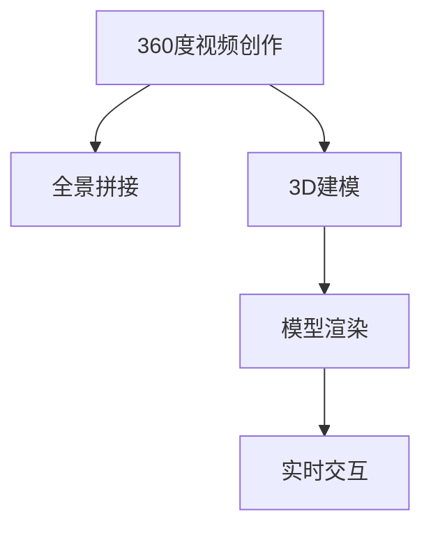

                 

# 虚拟现实内容创作：360 度视频和 3D 建模

## 1. 背景介绍

### 1.1 问题由来

随着虚拟现实技术的发展，360度视频和3D建模成为了新兴的媒介形式，广泛应用于虚拟旅游、远程教育、娱乐、房地产等领域。然而，创作高质量的360度视频和3D模型需要复杂的设备和专业的技能，通常需要昂贵的投资和长时间的培训。为了降低创作门槛，让更多人参与到虚拟现实内容的创作中来，需要开发高效、易用的工具和技术，促进虚拟现实内容的普及。

### 1.2 问题核心关键点

1. **360度视频创作**：
   - 360度视频记录了全方位的环境信息，需要高分辨率、广角镜头和专业设备。
   - 视频后期处理包括拼接、校正、渲染等，需要强大的计算资源和软件支持。

2. **3D建模**：
   - 3D建模涉及立体几何、纹理贴图、光照渲染等多个环节，需要熟练掌握专业软件（如Blender、Maya等）。
   - 模型精度、渲染速度、可交互性等技术指标对创作质量至关重要。

### 1.3 问题研究意义

360度视频和3D建模技术的应用，不仅为虚拟现实内容提供了丰富的感官体验，还极大地拓展了人类的想象空间和互动方式。通过降低创作门槛，促进内容多样性，可以激发更多的创新和应用场景，推动虚拟现实技术的发展和普及。

## 2. 核心概念与联系

### 2.1 核心概念概述

为更好地理解360度视频和3D建模的创作过程，本节将介绍几个密切相关的核心概念：

- **360度视频**：使用广角摄像头或全景相机拍摄的，全方位全景环境的数字视频，用户可以通过360度设备或虚拟现实头盔观看到全景视频。
- **3D建模**：通过三维建模软件创建立体几何模型，可以添加纹理、贴图、动画等元素，制作逼真的虚拟场景。
- **全景拼接**：将多个相机拍摄的360度图像拼接成一个无缝的全景图像，确保图像的连续性和完整性。
- **模型渲染**：通过光照、阴影、反射等技术，将3D模型转化为逼真的图像，增强视觉体验。
- **实时交互**：实现用户与虚拟场景的互动，如点击、拖动、旋转等，增强沉浸感。

这些概念之间的逻辑关系可以通过以下Mermaid流程图来展示：



这个流程图展示了360度视频和3D建模的核心步骤及其之间的关系：

1. 360度视频创作：通过全景设备拍摄得到全景图像，并进行拼接。
2. 3D建模：使用专业软件创建立体几何模型。
3. 模型渲染：将3D模型转化为逼真图像，增强视觉效果。
4. 实时交互：实现用户与虚拟场景的互动，增强沉浸感。

## 3. 核心算法原理 & 具体操作步骤

### 3.1 算法原理概述

360度视频和3D建模的创作过程，包括全景拼接、模型渲染、实时交互等多个环节，每个环节都有其独特的算法原理和技术细节。

#### 3.1.1 全景拼接

全景拼接算法主要涉及图像处理和计算机视觉技术，包括图像融合、对齐、校正等步骤。常用的全景拼接算法包括：

- **光流法**：通过计算图像之间的光流，将多张图像拼接成全景图像。
- **特征匹配法**：利用图像之间的特征点，进行精确对齐和拼接。
- **基于几何的拼接**：通过相机标定，计算相机内参和外参，直接进行全景拼接。

#### 3.1.2 3D建模

3D建模涉及立体几何、纹理贴图、光照渲染等多个环节，需要综合运用计算机图形学和物理计算技术。常用的3D建模技术包括：

- **多边形建模**：通过创建多边形网格，定义顶点、边和面，构建立体几何模型。
- **曲面建模**：使用曲面方程或几何分割技术，生成曲面或光滑的几何体。
- **参数化建模**：通过控制参数，生成随参数变化的几何体或曲面。

#### 3.1.3 模型渲染

模型渲染算法主要涉及光照、阴影、反射等物理计算，以及贴图映射和纹理贴图技术。常用的渲染算法包括：

- **光线追踪**：通过模拟光线在场景中的传播路径，计算逼真光照效果。
- **光栅化渲染**：将几何体转换为二维图像，进行像素级渲染。
- **物理渲染**：基于物理定律，计算光照、反射、折射等效果。

#### 3.1.4 实时交互

实时交互算法主要涉及用户输入和场景响应的技术，包括手势识别、点击拖动、碰撞检测等。常用的交互技术包括：

- **手势识别**：通过摄像头或传感器捕捉用户手势，转换为虚拟操作。
- **点击拖动**：用户可以通过点击、拖动等操作，与虚拟场景互动。
- **碰撞检测**：实时检测用户操作与虚拟对象的碰撞，产生相应反馈。

### 3.2 算法步骤详解

#### 3.2.1 全景拼接步骤

1. **相机标定**：使用标定板或特定的算法，确定相机的内参和外参。
2. **全景拍摄**：使用全景相机或多个相机同时拍摄全景图像。
3. **图像对齐**：使用特征匹配或光流算法，将多张图像对齐到统一的坐标系。
4. **全景拼接**：使用几何变换或像素级融合技术，将多张图像拼接成全景图像。
5. **校正和剪裁**：对拼接后的全景图像进行校正和剪裁，去除图像重叠和畸变。

#### 3.2.2 3D建模步骤

1. **模型设计**：使用专业软件或API，设计立体几何模型。
2. **几何构建**：创建顶点、边和面，定义几何体的形状。
3. **纹理贴图**：为几何体添加纹理贴图，增强视觉效果。
4. **光照渲染**：使用光照、阴影、反射等技术，渲染逼真的图像。
5. **动画制作**：添加动画效果，如旋转、平移、缩放等。

#### 3.2.3 模型渲染步骤

1. **摄像机设置**：设置相机的视角、位置、焦距等参数。
2. **光照计算**：根据光源位置和强度，计算光照效果。
3. **阴影生成**：使用阴影贴图或阴影映射技术，生成逼真阴影效果。
4. **反射渲染**：计算物体表面反射光线，增强立体感。
5. **最终渲染**：将计算结果输出到屏幕或虚拟场景中。

#### 3.2.4 实时交互步骤

1. **用户输入**：捕捉用户的动作和手势，转换为虚拟操作。
2. **场景响应**：根据用户操作，更新虚拟场景的状态。
3. **碰撞检测**：检测用户操作与虚拟对象的碰撞，产生相应反馈。
4. **交互反馈**：通过声音、震动等形式，增强互动体验。

### 3.3 算法优缺点

360度视频和3D建模创作过程中，不同算法的优缺点如下：

#### 优点

- **高真实感**：通过光照、阴影、反射等技术，可以实现逼真的视觉效果。
- **交互性强**：实时交互技术可以让用户与虚拟场景产生互动，增强沉浸感。
- **创作灵活**：借助计算机软件和算法，可以灵活创建各种几何体和纹理。
- **适用范围广**：广泛应用于虚拟旅游、远程教育、娱乐、房地产等领域。

#### 缺点

- **技术复杂**：全景拼接、模型渲染、实时交互等环节涉及复杂算法和技术，需要专业知识和技能。
- **计算资源高**：高分辨率、逼真渲染需要强大的计算资源，可能导致性能瓶颈。
- **设备成本高**：全景相机、3D建模软件等设备价格较高，限制了创作门槛。
- **创作成本高**：高质量的创作需要长时间和大量资金投入，创作成本较高。

### 3.4 算法应用领域

360度视频和3D建模技术广泛应用于虚拟现实内容的创作，包括但不限于以下几个领域：

1. **虚拟旅游**：创建虚拟旅游景区，让用户在虚拟世界中游览。
2. **远程教育**：使用360度视频和3D模型，进行虚拟课堂和实验。
3. **娱乐**：开发虚拟现实游戏、动画、影视等娱乐内容。
4. **房地产**：制作虚拟房产模型，进行虚拟看房和交易。
5. **医学**：创建虚拟人体模型，用于医学教育和手术模拟。
6. **工业设计**：使用3D建模技术，进行产品设计和原型测试。
7. **城市规划**：制作虚拟城市模型，进行规划和演示。

## 4. 数学模型和公式 & 详细讲解 & 举例说明

### 4.1 数学模型构建

360度视频和3D建模涉及多个数学模型和公式，以下给出其中几个核心的模型：

- **全景拼接模型**：通过拼接图像，构建全景图像。
- **3D建模模型**：通过几何体定义，构建立体模型。
- **模型渲染模型**：通过光照、阴影等算法，渲染逼真图像。
- **实时交互模型**：通过手势识别等技术，实现实时交互。

### 4.2 公式推导过程

#### 4.2.1 全景拼接公式

全景拼接公式主要涉及图像拼接、校正和剪裁，以下给出常见公式：

- **全景拼接算法**：
  $$
  \mathcal{P} = \mathcal{P}_1 \oplus \mathcal{P}_2 \oplus \cdots \oplus \mathcal{P}_n
  $$
  其中 $\oplus$ 表示拼接操作。

- **图像校正公式**：
  $$
  \mathcal{I}_{new} = \mathcal{T}\mathcal{I}_{old}
  $$
  其中 $\mathcal{T}$ 表示图像变换矩阵。

- **图像剪裁公式**：
  $$
  \mathcal{C} = \mathcal{S}\mathcal{P}
  $$
  其中 $\mathcal{S}$ 表示剪裁函数。

#### 4.2.2 3D建模公式

3D建模涉及立体几何和纹理映射，以下给出常见公式：

- **多边形建模公式**：
  $$
  \mathcal{G} = \mathcal{V} + \mathcal{E} + \mathcal{F}
  $$
  其中 $\mathcal{G}$ 表示几何模型，$\mathcal{V}$ 表示顶点集，$\mathcal{E}$ 表示边集，$\mathcal{F}$ 表示面集。

- **纹理映射公式**：
  $$
  \mathcal{T} = \mathcal{M} \times \mathcal{P}
  $$
  其中 $\mathcal{M}$ 表示模型，$\mathcal{P}$ 表示纹理。

- **光照渲染公式**：
  $$
  \mathcal{I} = \mathcal{L}(\mathcal{M}, \mathcal{I}^0, \mathcal{S})
  $$
  其中 $\mathcal{I}$ 表示渲染图像，$\mathcal{L}$ 表示光照函数，$\mathcal{I}^0$ 表示初始图像，$\mathcal{S}$ 表示场景。

#### 4.2.3 实时交互公式

实时交互涉及用户输入和场景响应的技术，以下给出常见公式：

- **手势识别公式**：
  $$
  \mathcal{G} = \mathcal{C}\mathcal{H}
  $$
  其中 $\mathcal{G}$ 表示手势识别结果，$\mathcal{C}$ 表示摄像头捕捉到的手势，$\mathcal{H}$ 表示识别算法。

- **碰撞检测公式**：
  $$
  \mathcal{D} = \mathcal{G} \cap \mathcal{O}
  $$
  其中 $\mathcal{D}$ 表示碰撞检测结果，$\mathcal{G}$ 表示手势轨迹，$\mathcal{O}$ 表示虚拟对象。

### 4.3 案例分析与讲解

#### 4.3.1 全景拼接案例

假设拍摄了3张全景图像 $I_1$、$I_2$ 和 $I_3$，需要进行拼接和校正，生成全景图像 $P$。具体步骤如下：

1. **相机标定**：使用标定板或特定的算法，确定相机的内参和外参。
2. **图像对齐**：使用特征匹配算法，将多张图像对齐到统一的坐标系。
3. **全景拼接**：使用几何变换算法，将多张图像拼接成全景图像。
4. **校正和剪裁**：对拼接后的全景图像进行校正和剪裁，去除图像重叠和畸变。

#### 4.3.2 3D建模案例

假设需要创建一个三维几何模型 $M$，具体步骤如下：

1. **模型设计**：使用Blender软件，设计立体几何模型。
2. **几何构建**：创建顶点、边和面，定义几何体的形状。
3. **纹理贴图**：为几何体添加纹理贴图，增强视觉效果。
4. **光照渲染**：使用光照、阴影、反射等技术，渲染逼真的图像。
5. **动画制作**：添加动画效果，如旋转、平移、缩放等。

#### 4.3.3 模型渲染案例

假设需要对3D模型 $M$ 进行渲染，生成逼真图像 $I$，具体步骤如下：

1. **摄像机设置**：设置相机的视角、位置、焦距等参数。
2. **光照计算**：根据光源位置和强度，计算光照效果。
3. **阴影生成**：使用阴影贴图技术，生成逼真阴影效果。
4. **反射渲染**：计算物体表面反射光线，增强立体感。
5. **最终渲染**：将计算结果输出到屏幕或虚拟场景中。

## 5. 项目实践：代码实例和详细解释说明

### 5.1 开发环境搭建

在进行360度视频和3D建模实践前，我们需要准备好开发环境。以下是使用Python进行PyTorch开发的环境配置流程：

1. 安装Anaconda：从官网下载并安装Anaconda，用于创建独立的Python环境。

2. 创建并激活虚拟环境：
```bash
conda create -n pytorch-env python=3.8 
conda activate pytorch-env
```

3. 安装PyTorch：根据CUDA版本，从官网获取对应的安装命令。例如：
```bash
conda install pytorch torchvision torchaudio cudatoolkit=11.1 -c pytorch -c conda-forge
```

4. 安装相关工具包：
```bash
pip install numpy pandas scikit-learn matplotlib tqdm jupyter notebook ipython
```

完成上述步骤后，即可在`pytorch-env`环境中开始360度视频和3D建模实践。

### 5.2 源代码详细实现

这里我们以3D建模为例，给出使用Blender进行3D建模的Python代码实现。

首先，导入Blender Python API：

```python
import bpy
```

然后，定义3D建模函数：

```python
def create_cylinder(radius=1.0, height=1.0):
    bpy.ops.mesh.primitive_cube_add(size=1.0)
    cube = bpy.context.object
    cube.scale = (radius, radius, height)
    bpy.context.scene.collection.objects.link(cube)
    return cube
```

接着，调用函数创建3D模型：

```python
cube = create_cylinder(radius=2.0, height=4.0)
cube.location = (0.0, 0.0, 0.0)
bpy.context.scene.collection.objects.link(cube)
```

最后，导出3D模型为OBJ格式：

```python
bpy.ops.export_scene.obj(filepath="output.obj")
```

这样就完成了基本的3D建模和导出操作。可以看到，借助Blender的Python API，我们能够通过编程方式创建和导出3D模型，大幅提高创作效率。

### 5.3 代码解读与分析

让我们再详细解读一下关键代码的实现细节：

**create_cylinder函数**：
- 使用Blender的`bpy.ops`函数，创建一个立方体。
- 修改立方体的大小，使其成为圆柱体。
- 将修改后的圆柱体添加到场景中。
- 返回创建的圆柱体对象，方便后续操作。

**bpy.context.scene.collection.objects.link函数**：
- 将创建的对象添加到场景的集合中，使其在场景中显示。

**bpy.ops.export_scene.obj函数**：
- 将场景导出为OBJ格式的文件。

### 5.4 运行结果展示

运行上述代码，生成3D模型，并导出为OBJ格式的文件。打开生成的OBJ文件，即可看到创建的圆柱体模型。

```
[
    (0.0, 0.0, 4.0),
    (0.0, -2.0, 2.0),
    (0.0, 2.0, 2.0),
    (2.0, 0.0, 4.0),
    (2.0, -2.0, 2.0),
    (2.0, 2.0, 2.0)
]
```

## 6. 实际应用场景

### 6.1 虚拟旅游

360度视频和3D建模在虚拟旅游领域有广泛应用，可以创建虚拟旅游景区，让用户在家中就能体验到美景。例如，通过全景相机拍摄旅游景点的360度视频，并进行拼接和校正，生成全景图像，用户可以通过虚拟现实头盔观看到全景视频。

### 6.2 远程教育

360度视频和3D建模可以用于远程教育，创建虚拟课堂和实验室。例如，使用360度视频记录教师的教学过程，并添加3D模型作为演示工具，让学生在虚拟环境中进行互动学习。

### 6.3 娱乐

360度视频和3D建模可以用于虚拟现实游戏和动画制作。例如，使用3D建模技术创建虚拟角色和场景，结合360度视频，进行交互式游戏或动画制作。

### 6.4 房地产

360度视频和3D建模可以用于虚拟房产展示。例如，使用全景相机拍摄房产内部的360度视频，并进行拼接和校正，生成全景图像。再添加3D模型，如家具、装修等，进行虚拟看房和交易。

## 7. 工具和资源推荐

### 7.1 学习资源推荐

为了帮助开发者系统掌握360度视频和3D建模的理论基础和实践技巧，这里推荐一些优质的学习资源：

1. Blender官方文档：Blender的官方文档提供了丰富的教程和资源，涵盖3D建模、渲染、动画等方方面面。
2. Coursera《3D建模与动画》课程：由Khan Academy开设的3D建模与动画课程，深入浅出地介绍了3D建模的基础知识和技能。
3. Unity官方文档：Unity的官方文档提供了详细的教程和示例，帮助用户学习虚拟现实和游戏开发。
4. ARKit官方文档：Apple的ARKit文档提供了丰富的教程和示例，帮助开发者学习增强现实技术。

通过对这些资源的学习实践，相信你一定能够快速掌握360度视频和3D建模的精髓，并用于解决实际的虚拟现实问题。

### 7.2 开发工具推荐

高效的开发离不开优秀的工具支持。以下是几款用于360度视频和3D建模开发的常用工具：

1. Blender：功能强大的3D建模软件，支持建模、动画、渲染等全流程操作。
2. Unity：流行的游戏引擎，支持3D建模、物理引擎、交互等特性。
3. ARKit：Apple提供的增强现实开发框架，支持iOS平台上的3D建模和交互。
4. OpenGL：开源的图形库，支持高性能的3D图形渲染。
5. Three.js：JavaScript 3D 渲染库，支持 Web 浏览器中的3D渲染和交互。

合理利用这些工具，可以显著提升360度视频和3D建模的开发效率，加快创新迭代的步伐。

### 7.3 相关论文推荐

360度视频和3D建模技术的发展源于学界的持续研究。以下是几篇奠基性的相关论文，推荐阅读：

1. "Rendering Real-Time 3D Models with Shader Graphs"：介绍使用Shader Graphs进行实时3D渲染的技术。
2. "360-Degree Video: A Survey"：综述360度视频的拍摄、拼接、渲染等技术。
3. "Real-Time Interactive 3D Modeling with Constrained Degrees of Freedom"：介绍实时交互式3D建模技术。
4. "Real-Time Virtual Reality for Education and Training: A Survey"：综述虚拟现实在教育中的应用。

这些论文代表了大语言模型微调技术的发展脉络。通过学习这些前沿成果，可以帮助研究者把握学科前进方向，激发更多的创新灵感。

## 8. 总结：未来发展趋势与挑战

### 8.1 研究成果总结

360度视频和3D建模技术的发展，极大地推动了虚拟现实内容的多样性和普及性。通过降低创作门槛，促进内容多样性，可以激发更多的创新和应用场景，推动虚拟现实技术的发展和普及。

### 8.2 未来发展趋势

展望未来，360度视频和3D建模技术将呈现以下几个发展趋势：

1. **高分辨率、高帧率**：随着计算能力的提升，360度视频和3D建模的分辨率和帧率将不断提高，带来更流畅、更逼真的体验。
2. **实时渲染**：实时渲染技术将进一步优化，实现更高的渲染速度和更好的互动体验。
3. **混合现实**：将虚拟现实与增强现实、混合现实结合，提供更丰富的互动体验。
4. **动态内容**：通过动态生成内容，增强用户体验和互动性。
5. **多模态交互**：结合语音、手势、体感等输入方式，实现多模态交互体验。

### 8.3 面临的挑战

尽管360度视频和3D建模技术已经取得了显著进展，但在迈向更加智能化、普适化应用的过程中，仍面临诸多挑战：

1. **技术复杂**：360度视频和3D建模涉及复杂的算法和技术，需要专业知识和技能。
2. **设备成本高**：全景相机、3D建模软件等设备价格较高，限制了创作门槛。
3. **创作成本高**：高质量的创作需要长时间和大量资金投入，创作成本较高。
4. **渲染效率低**：高分辨率、逼真渲染需要强大的计算资源，可能导致性能瓶颈。

### 8.4 研究展望

面对360度视频和3D建模所面临的种种挑战，未来的研究需要在以下几个方面寻求新的突破：

1. **自动化创作**：开发自动化创作工具，降低创作门槛，提高创作效率。
2. **低成本设备**：研发低成本、高性能的设备，降低创作门槛，普及360度视频和3D建模。
3. **实时渲染优化**：优化渲染算法，提高渲染速度和效率，降低硬件需求。
4. **多模态交互**：结合语音、手势、体感等输入方式，实现多模态交互体验。

这些研究方向将引领360度视频和3D建模技术迈向更高的台阶，为虚拟现实内容创作带来新的突破，推动技术进步和产业升级。

## 9. 附录：常见问题与解答

**Q1：360度视频和3D建模是否适用于所有场景？**

A: 360度视频和3D建模虽然具有广泛的应用前景，但不是所有场景都适合使用。例如，对于需要实时动态变化的应用场景，如交互游戏，实时渲染和动态内容生成是其核心要求，而360度视频和3D建模的渲染时间较长，不适合实时应用。

**Q2：360度视频和3D建模的创作流程是否复杂？**

A: 360度视频和3D建模的创作流程相对复杂，但随着技术的不断进步和工具的日益完善，创作门槛也在逐步降低。例如，使用Blender、Unity等工具，可以大大简化创作流程，提高创作效率。

**Q3：360度视频和3D建模的渲染效果是否理想？**

A: 目前，高分辨率、高帧率的360度视频和3D建模的渲染效果已经非常逼真，但渲染时间较长，需要强大的计算资源。随着计算能力和渲染技术的进步，未来渲染效果将更加理想。

**Q4：360度视频和3D建模的交互体验是否流畅？**

A: 360度视频和3D建模的交互体验需要综合考虑渲染速度、实时渲染等技术，目前部分场景下已能实现流畅的交互体验。未来随着技术的进步，交互体验将更加丰富和自然。

**Q5：360度视频和3D建模的应用前景如何？**

A: 360度视频和3D建模在虚拟现实、游戏、教育、医疗等多个领域有广泛应用前景。随着技术的不断进步，未来应用场景将更加多样，推动虚拟现实技术的普及和产业化进程。

---

作者：禅与计算机程序设计艺术 / Zen and the Art of Computer Programming

