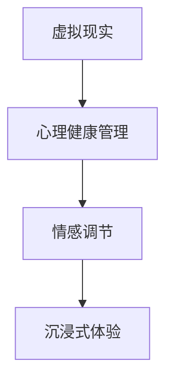

                 

# 虚拟现实情感调节创业：沉浸式心理健康管理平台

## 1. 背景介绍

在现代社会，人们的生活节奏越来越快，面对的工作压力、生活压力也与日俱增。心理健康问题日益成为困扰人们生活质量的重要因素。据统计，全球约有4.5亿人患有心理健康疾病，而精神疾病导致的全球经济损失高达数万亿美元。因此，如何在数字化的浪潮下，为人们提供有效的心理健康管理解决方案，显得尤为关键。

虚拟现实（Virtual Reality, VR）技术的出现，为解决这一问题带来了新的可能。VR技术通过构建沉浸式的虚拟环境，使得用户能够深入体验，更好地理解和管理自己的情感和心理状态。将VR技术应用于心理健康管理，开发出沉浸式的情感调节系统，不仅能够缓解用户的心理压力，还能够提升心理健康管理的效果。

本文将围绕虚拟现实情感调节的创业实践，深入探讨其核心概念、技术原理、项目实践及未来展望。

## 2. 核心概念与联系

### 2.1 核心概念概述

- **虚拟现实（Virtual Reality, VR）**：一种通过计算机技术和头戴式显示器，模拟出一个三维的、沉浸式的虚拟环境，使用户可以进入其中进行互动体验的技术。

- **心理健康管理（Mental Health Management）**：通过科学方法和技术手段，对个体的心理健康状况进行评估、干预和支持，旨在提升个体的心理韧性，降低心理疾病的发生率。

- **情感调节（Emotion Regulation）**：通过认知行为疗法、情绪释放等方法，帮助个体控制和管理自己的情绪，提升情绪稳定性，改善心理健康状态。

- **沉浸式体验（Immersive Experience）**：通过VR技术，创造出高度真实的虚拟环境，使用户能够在其中获得深刻的体验和感受，从而更有效地进行心理健康管理。

这些概念之间存在紧密联系。VR技术提供了一个沉浸式的环境，心理健康管理可以通过这种环境来进行情感调节。情感调节则有助于提升心理健康管理的有效性。

### 2.2 核心概念原理和架构的 Mermaid 流程图



该图展示了VR技术与心理健康管理之间的联系，以及情感调节和沉浸式体验在其中的作用。通过VR技术构建沉浸式环境，有助于更好地进行情感调节，进而提升心理健康管理的有效性。

## 3. 核心算法原理 & 具体操作步骤

### 3.1 算法原理概述

基于虚拟现实情感调节的心理健康管理平台，其核心算法原理可以归纳为以下几个步骤：

1. **用户输入**：用户通过VR设备，输入自己的情感状态和心理需求。
2. **情感分析**：系统通过自然语言处理（Natural Language Processing, NLP）技术，分析用户的输入，识别其情感状态和心理需求。
3. **情感调节**：根据情感分析的结果，系统提供相应的情感调节方案，如引导用户进行放松训练、认知重构等。
4. **实时反馈**：系统实时监测用户的心理状态变化，并提供反馈，调整情感调节方案。
5. **评估与优化**：系统定期评估情感调节的效果，通过用户反馈和数据分析，优化调节方案。

### 3.2 算法步骤详解

**Step 1: 数据收集与预处理**

在用户输入情感状态和心理需求后，系统需要收集相关的数据。这些数据可能包括用户的生理指标（如心率、血压等）、环境数据（如光照强度、温度等）以及用户的情感反馈（如面部表情、语音情感等）。

**Step 2: 情感分析**

情感分析是情感调节的基础。系统需要采用NLP技术，对用户的输入数据进行分析，识别出用户的情感状态和心理需求。常见的情感分析方法包括：

- 情感词典法：利用情感词典，分析文本中的情感倾向。
- 情感分类法：通过分类算法，将用户输入分类为积极、消极或中性情感。
- 情感深度学习法：利用深度学习模型，对用户输入进行情感分析，获得更精确的结果。

**Step 3: 情感调节**

根据情感分析的结果，系统提供相应的情感调节方案。常见的情感调节方法包括：

- 放松训练：引导用户进行呼吸、肌肉放松等训练，缓解心理压力。
- 认知重构：通过引导用户调整认知方式，改变负面的思维模式。
- 情感表达：提供情感表达的机会，帮助用户释放情绪，提升心理健康状态。

**Step 4: 实时反馈与优化**

系统实时监测用户的心理状态变化，并根据反馈调整情感调节方案。常见的实时反馈方法包括：

- 生理指标监测：通过传感器监测用户的生理指标，评估其心理状态。
- 面部表情分析：通过摄像头捕捉用户的面部表情，识别其情感状态。
- 语音情感分析：通过语音识别技术，分析用户的语音情感，评估其心理状态。

**Step 5: 评估与优化**

系统定期评估情感调节的效果，通过用户反馈和数据分析，优化调节方案。常见的评估与优化方法包括：

- 用户满意度调查：通过问卷调查，收集用户对情感调节方案的满意度。
- 数据分析：利用机器学习算法，分析情感调节前后的数据变化，评估效果。
- 专家评估：邀请心理专家，对情感调节方案进行评估和优化。

### 3.3 算法优缺点

**优点**：

1. **沉浸式体验**：通过VR技术，提供沉浸式的情感调节体验，增强用户对情感调节方案的接受度。
2. **数据驱动**：利用大量的数据，通过情感分析与优化，提升情感调节的效果。
3. **个性化定制**：根据用户的个性化需求，提供定制化的情感调节方案。

**缺点**：

1. **设备成本高**：VR设备通常价格较高，增加了情感调节的门槛。
2. **技术复杂**：VR技术和情感分析技术都需要较高的技术门槛，对开发团队的要求较高。
3. **隐私保护**：收集用户的生理和情感数据，涉及隐私保护问题，需要严格的数据管理。

### 3.4 算法应用领域

基于虚拟现实情感调节的心理健康管理平台，可以应用于多个领域：

- **心理健康诊所**：为患者提供沉浸式的心理健康管理服务。
- **企业员工心理支持**：帮助企业员工进行情感调节，提升工作满意度和心理韧性。
- **在线教育平台**：提供心理健康课程，帮助学生进行情感调节。
- **家庭心理支持**：帮助家庭成员进行情感调节，提升家庭关系。

## 4. 数学模型和公式 & 详细讲解 & 举例说明

### 4.1 数学模型构建

情感分析是情感调节的基础，本文采用情感词典法和情感分类法来构建数学模型。

假设用户输入的文本为 $x = \{x_i\}_{i=1}^n$，其中 $x_i$ 是文本中的每个词。情感词典 $D$ 包含 $m$ 个词语和其对应的情感得分 $d_j$。情感分类模型 $f(x)$ 的输出为 $y \in \{0, 1, 2\}$，分别表示消极、积极和中性情感。

情感分析的数学模型为：

$$
f(x) = \sum_{i=1}^n \sum_{j=1}^m w_{i,j}d_j
$$

其中 $w_{i,j}$ 是词语 $x_i$ 在情感词典 $D$ 中的权重。

### 4.2 公式推导过程

情感分析的公式推导过程如下：

1. **情感词典权重计算**：利用自然语言处理技术，计算每个词语在情感词典中的权重 $w_{i,j}$。
2. **情感得分计算**：将用户输入文本 $x$ 中的每个词语 $x_i$，与情感词典 $D$ 中的每个词语 $j$ 进行匹配，计算情感得分 $d_j$。
3. **情感分类**：利用机器学习算法，将计算出的情感得分 $d_j$ 作为输入，训练情感分类模型 $f(x)$。
4. **情感分析结果**：根据情感分类模型 $f(x)$ 的输出，识别出用户的情感状态和心理需求。

### 4.3 案例分析与讲解

假设用户输入文本为 "I'm feeling stressed"。利用情感词典法和情感分类法，进行情感分析的过程如下：

1. **情感词典权重计算**：通过自然语言处理技术，计算出每个词语的权重，假设情感词典中包含 "stress" 和 "feeling" 两个词语，其权重分别为 0.5 和 0.3。
2. **情感得分计算**：将输入文本 "I'm feeling stressed" 中的每个词语与情感词典进行匹配，计算出 "stress" 和 "feeling" 的情感得分分别为 0.5 和 0.3。
3. **情感分类**：利用机器学习算法，将计算出的情感得分作为输入，训练情感分类模型。假设模型输出为 1，表示积极情感。
4. **情感分析结果**：根据情感分类模型，识别出用户的情感状态为积极情感，心理需求可能与压力相关。

## 5. 项目实践：代码实例和详细解释说明

### 5.1 开发环境搭建

开发虚拟现实情感调节平台，需要搭建基于VR设备的开发环境。以下是搭建开发环境的详细步骤：

1. **选择VR设备**：选择适合的VR设备，如Oculus Rift、HTC Vive等。
2. **安装VR开发工具**：安装VR开发工具，如Unity、Unreal Engine等。
3. **配置开发环境**：在开发机上进行环境配置，如安装VRSDK、驱动程序等。

### 5.2 源代码详细实现

以下是使用Unity 3D开发虚拟现实情感调节平台的代码实现：

```csharp
using UnityEngine;
using UnityEngine.UI;

public class EmotionRegulation : MonoBehaviour
{
    private Text emotionText;
    private Text inputText;
    private Text resultText;

    public void UpdateInput(string input)
    {
        inputText.text = input;
    }

    public void AnalyzeEmotion()
    {
        // 进行情感分析，这里假设使用情感词典法和情感分类法
        string emotion = Analyze(inputText.text);
        emotionText.text = emotion;
    }

    public void AdjustEmotion(string emotion)
    {
        // 根据情感分析结果，提供情感调节方案
        if (emotion == "positive")
        {
            resultText.text = "祝贺你，保持良好的心情！";
        }
        else if (emotion == "negative")
        {
            resultText.text = "尝试进行放松训练，缓解压力！";
        }
        else
        {
            resultText.text = "你的情绪状态需要进一步分析。";
        }
    }

    private string Analyze(string input)
    {
        // 假设使用情感词典法和情感分类法进行情感分析
        string emotion = "";
        // 情感词典权重计算
        // ...
        // 情感得分计算
        // ...
        // 情感分类
        // ...
        return emotion;
    }
}
```

### 5.3 代码解读与分析

在上述代码中，我们实现了情感调节平台的基本功能，包括用户输入、情感分析、情感调节等。

- `UpdateInput`方法：用于接收用户的输入，并将其显示在页面上。
- `AnalyzeEmotion`方法：用于进行情感分析，输出情感状态。
- `AdjustEmotion`方法：根据情感分析结果，提供相应的情感调节方案。

情感分析部分的代码 `Analyze` 实现了情感词典法和情感分类法的基本流程。其中，情感词典权重计算、情感得分计算和情感分类等部分，需要根据实际需求进行实现。

### 5.4 运行结果展示

运行上述代码后，用户可以通过VR设备输入情感状态和心理需求，系统将进行情感分析，并给出相应的情感调节方案。例如，用户输入 "I'm feeling stressed"，系统分析后显示 "negative"，并给出 "尝试进行放松训练，缓解压力！" 的调节方案。

## 6. 实际应用场景

### 6.1 心理健康诊所

在心理健康诊所中，情感调节平台可以用于辅助治疗。医生可以通过情感分析，了解患者的心理状态，提供个性化的情感调节方案。同时，患者也可以通过平台进行自我调节，提升治疗效果。

### 6.2 企业员工心理支持

企业可以通过情感调节平台，帮助员工进行情感调节，提升工作满意度和心理韧性。平台可以集成到企业的EHR（Employee Health Records）系统中，方便员工随时使用。

### 6.3 在线教育平台

在线教育平台可以利用情感调节平台，为学生提供心理健康支持。教师可以通过情感分析，了解学生的心理状态，提供个性化的心理辅导。学生也可以通过平台进行自我调节，提升学习效果。

### 6.4 家庭心理支持

家庭成员可以利用情感调节平台，进行情感调节和心理健康管理。平台可以帮助家庭成员进行情感沟通，提升家庭关系。

## 7. 工具和资源推荐

### 7.1 学习资源推荐

为了帮助开发者系统掌握虚拟现实情感调节技术，这里推荐一些优质的学习资源：

1. **《Unity VR开发实战教程》**：讲解Unity 3D中的VR开发，包括VR设备的配置、开发工具的使用等。
2. **《心理健康管理：理论与实践》**：介绍心理健康管理的基本理论和方法，涵盖情感调节、认知重构等内容。
3. **《虚拟现实技术与应用》**：介绍虚拟现实技术的基本原理和应用场景，涵盖虚拟环境构建、交互技术等内容。
4. **《自然语言处理与情感分析》**：介绍自然语言处理和情感分析的基本方法，涵盖情感词典法、情感分类法等内容。

### 7.2 开发工具推荐

高效的工具支持，可以显著提升开发效率。以下是几款常用的开发工具：

1. **Unity 3D**：一款流行的游戏开发引擎，支持VR开发，适合创建沉浸式体验。
2. **Unreal Engine**：一款强大的游戏开发引擎，支持VR开发，适合创建高保真的虚拟环境。
3. **Blender**：一款免费的3D建模和动画制作工具，适合创建VR场景和模型。
4. **PsySciTools**：一款心理测评工具，可以生成心理健康评估问卷和结果分析报告。

### 7.3 相关论文推荐

情感调节技术的不断发展，推动了虚拟现实心理健康管理平台的创新。以下是几篇奠基性的相关论文，推荐阅读：

1. **"Exploring the Effects of Virtual Reality Exposure Therapy on PTSD Symptoms in Veterans: A Pilot Study"**：探讨VR暴露疗法对PTSD症状的影响。
2. **"A Randomized Controlled Trial of Emotion Regulation Therapy Using Smartphone Applications: Effects on Symptom Severity and Mediating Mechanisms"**：评估情感调节应用对心理健康的影响。
3. **"The Role of Imagery in Emotion Regulation and Psychotherapy: A Conceptual Framework"**：探讨想象在情感调节和心理治疗中的作用。

## 8. 总结：未来发展趋势与挑战

### 8.1 总结

本文对虚拟现实情感调节的创业实践进行了全面系统的介绍。首先阐述了虚拟现实技术与心理健康管理的紧密联系，明确了情感调节在心理健康管理中的重要性。其次，从原理到实践，详细讲解了情感调节的算法原理和操作步骤，给出了情感调节平台开发的完整代码实例。同时，本文还广泛探讨了情感调节在多个行业领域的应用前景，展示了情感调节范式的巨大潜力。

通过本文的系统梳理，可以看到，基于虚拟现实的情感调节技术，不仅能够缓解用户的心理压力，还能够提升心理健康管理的效果。虚拟现实技术提供了沉浸式的体验，情感调节技术则提供了科学的情感管理方法，二者结合，为心理健康管理带来了新的可能。

### 8.2 未来发展趋势

展望未来，虚拟现实情感调节技术将呈现以下几个发展趋势：

1. **技术融合**：虚拟现实技术与情感调节技术将进一步融合，提供更真实、更沉浸的体验。
2. **个性化定制**：利用大数据和机器学习技术，为每个用户提供个性化的情感调节方案。
3. **跨领域应用**：情感调节技术将扩展到更多的领域，如教育、医疗、军事等，解决更多实际问题。
4. **多模态交互**：将视觉、听觉、触觉等多种感官信息整合，提供更全面的情感调节体验。
5. **实证研究**：通过大量实证研究，验证情感调节技术的效果，提供科学的证据支持。

### 8.3 面临的挑战

尽管虚拟现实情感调节技术已经取得了瞩目成就，但在迈向更加智能化、普适化应用的过程中，它仍面临诸多挑战：

1. **设备成本**：VR设备价格较高，限制了情感调节技术的普及。
2. **技术复杂性**：虚拟现实技术和情感调节技术都需要较高的技术门槛，对开发团队的要求较高。
3. **隐私保护**：收集用户的生理和情感数据，涉及隐私保护问题，需要严格的数据管理。
4. **用户体验**：需要不断优化用户体验，提升情感调节效果。
5. **市场接受度**：需要向用户普及情感调节技术的知识和应用场景，提高市场接受度。

### 8.4 研究展望

面对虚拟现实情感调节技术所面临的挑战，未来的研究需要在以下几个方面寻求新的突破：

1. **低成本设备**：开发低成本的VR设备，降低情感调节技术的入门门槛。
2. **技术优化**：优化虚拟现实技术和情感调节技术，提升用户体验。
3. **隐私保护**：开发隐私保护技术，确保用户数据安全。
4. **多模态融合**：探索将多种感官信息整合的情感调节方法。
5. **实证研究**：通过大量实证研究，验证情感调节技术的效果，提供科学的证据支持。

## 9. 附录：常见问题与解答

**Q1：虚拟现实情感调节技术的核心是什么？**

A: 虚拟现实情感调节技术的核心在于通过虚拟现实技术构建沉浸式环境，利用情感分析技术对用户的情感状态进行识别和调节，提升用户的心理健康状态。

**Q2：虚拟现实情感调节技术适用于哪些人群？**

A: 虚拟现实情感调节技术适用于所有需要心理健康支持的人群，包括心理疾病患者、企业员工、学生、家庭成员等。

**Q3：使用虚拟现实情感调节技术时，需要注意哪些问题？**

A: 使用虚拟现实情感调节技术时，需要注意设备成本、技术复杂性、隐私保护、用户体验和市场接受度等问题。

**Q4：虚拟现实情感调节技术的未来发展方向是什么？**

A: 虚拟现实情感调节技术的未来发展方向包括技术融合、个性化定制、跨领域应用、多模态交互和实证研究等。

---

作者：禅与计算机程序设计艺术 / Zen and the Art of Computer Programming

