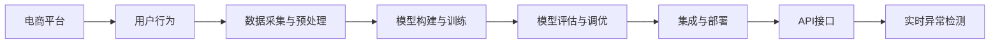

                 

# AI大模型在电商平台用户行为异常检测中的作用

> 关键词：电商平台,用户行为,异常检测,大模型,深度学习,决策树,融合学习,API接口

## 1. 背景介绍

### 1.1 问题由来
随着电子商务的蓬勃发展，电商平台的用户行为分析已成为企业竞争的核心资产之一。通过深入理解用户行为模式，电商平台可以提升用户体验，优化产品推荐，制定精准的市场营销策略。但用户行为数据呈现复杂多样性，分析难度大，且涉及大量个人隐私保护问题。此外，用户行为数据易于受到异常行为（如欺诈、恶意操作等）影响，给平台带来潜在风险。

为应对这些挑战，利用人工智能技术进行用户行为异常检测，显得尤为关键。近年来，深度学习和大模型技术在用户行为分析领域获得了广泛应用。其中，基于深度学习的大模型由于其卓越的泛化能力和自我优化能力，成为用户行为异常检测的重要工具。

### 1.2 问题核心关键点
目前，基于深度学习的大模型在电商平台用户行为异常检测中的应用，主要包括以下几个关键点：

1. **数据采集与预处理**：收集用户的行为数据，进行数据清洗、归一化等预处理，确保数据质量。
2. **模型构建与训练**：选择合适的模型架构和训练算法，在标注数据上训练异常检测模型。
3. **模型评估与调优**：在测试集上评估模型性能，结合业务需求进行调优，确保模型的准确性和鲁棒性。
4. **集成与部署**：将训练好的模型集成到电商平台的业务系统，进行实时异常检测，提供API接口供其他系统调用。

本文将从模型构建、训练、评估到集成部署的全流程，系统阐述大模型在电商平台用户行为异常检测中的作用。

## 2. 核心概念与联系

### 2.1 核心概念概述

为更好理解大模型在电商平台用户行为异常检测中的应用，本节将介绍几个关键概念：

- **电商平台**：指通过互联网提供商品或服务的商业平台，如淘宝、京东、Amazon等。电商平台借助用户行为数据进行个性化推荐、商品营销等业务。
- **用户行为**：用户在电商平台上的浏览、点击、购买、评价等行为。行为数据具有高维度、高稀疏性特点，需进行深入分析。
- **异常检测**：识别出用户行为中的异常点，如欺诈行为、恶意操作等。异常检测是风险管理、用户运营的重要环节。
- **大模型**：指以深度学习技术为基础，具有大规模参数和强大自我学习能力的大规模神经网络模型。如BERT、GPT-3等。
- **深度学习**：一种基于神经网络的机器学习方法，通过多层次的特征提取和抽象，逐步构建出高层次的特征表示，适合处理复杂的多维度数据。
- **融合学习**：指将多个模型的输出进行融合，利用不同模型的优势，提高整体的预测准确性。
- **API接口**：应用程序编程接口，用于与其他系统进行数据交互。电商平台可通过API接口，调用异常检测模型，实时监测用户行为异常。

这些概念共同构成了电商平台用户行为异常检测的基础，有助于理解大模型在此领域的应用价值。

### 2.2 核心概念原理和架构的 Mermaid 流程图



## 3. 核心算法原理 & 具体操作步骤

### 3.1 算法原理概述

基于深度学习的大模型在电商平台用户行为异常检测中的应用，主要遵循以下算法原理：

1. **数据采集与预处理**：收集电商平台的交易记录、浏览记录等行为数据，并进行清洗、归一化等预处理，确保数据质量。
2. **模型构建与训练**：选择合适的深度学习模型架构，如卷积神经网络（CNN）、循环神经网络（RNN）、Transformer等，在标注数据上训练异常检测模型。
3. **模型评估与调优**：在测试集上评估模型性能，结合业务需求进行调优，确保模型的准确性和鲁棒性。
4. **集成与部署**：将训练好的模型集成到电商平台的业务系统，通过API接口进行实时异常检测，提供实时监测和异常预警功能。

### 3.2 算法步骤详解

#### 3.2.1 数据采集与预处理

**Step 1: 数据收集**
- 从电商平台后台收集用户的交易记录、浏览记录、评价信息等行为数据。
- 确保数据的匿名性和隐私保护，防止泄露用户隐私。

**Step 2: 数据清洗**
- 去除缺失值、异常值，确保数据完整性和准确性。
- 对数据进行归一化处理，如min-max归一化、Z-score归一化等，便于模型训练。

**Step 3: 数据特征提取**
- 选择关键行为特征，如浏览时间、浏览时长、浏览路径、交易金额等。
- 利用PCA、LDA等降维技术，减少特征维度，提高模型训练效率。

#### 3.2.2 模型构建与训练

**Step 1: 模型选择**
- 选择适合的深度学习模型架构，如卷积神经网络（CNN）、循环神经网络（RNN）、Transformer等。
- 对于时间序列数据，考虑使用LSTM、GRU等RNN模型。
- 对于文本数据，考虑使用BERT、GPT等预训练模型。

**Step 2: 模型初始化**
- 使用预训练模型或随机初始化模型参数。
- 对模型进行适当的冻结或微调，保留预训练模型的关键层。

**Step 3: 模型训练**
- 使用标注数据对模型进行训练，选择合适的优化器和损失函数。
- 使用批量梯度下降等优化算法，逐步更新模型参数。
- 设置适当的学习率、批大小、迭代轮数等超参数。

#### 3.2.3 模型评估与调优

**Step 1: 模型评估**
- 在测试集上评估模型性能，使用准确率、召回率、F1-score等指标。
- 进行交叉验证，确保模型在不同数据子集上的稳健性。

**Step 2: 调优与优化**
- 根据业务需求，对模型进行调优，如增加正则化项、调整学习率等。
- 使用融合学习等技术，提升模型的整体性能。

#### 3.2.4 集成与部署

**Step 1: 模型集成**
- 将训练好的模型集成到电商平台的业务系统中。
- 考虑使用微服务架构，确保系统的高可用性和可扩展性。

**Step 2: API接口设计**
- 设计并实现API接口，支持实时异常检测功能。
- 确保API接口的安全性和稳定性，防止外部恶意攻击。

**Step 3: 实时异常检测**
- 通过API接口实时监测用户行为，及时发现异常行为。
- 利用日志记录和报警机制，进行异常行为的追踪和处理。

### 3.3 算法优缺点

基于深度学习的大模型在电商平台用户行为异常检测中的应用，具有以下优点：

**优点：**
1. **高准确性**：大模型具有强大的特征提取和泛化能力，能够准确识别用户行为中的异常点。
2. **自适应性强**：大模型能够适应复杂多变的用户行为模式，具备较强的自适应性。
3. **实时性高**：通过API接口，大模型能够在电商平台上实时监测用户行为异常，提高异常检测的效率。
4. **易于集成**：大模型通常有丰富的开源实现和文档，易于集成到现有的电商业务系统中。

**缺点：**
1. **数据依赖性强**：异常检测的效果很大程度上依赖于标注数据的质量和数量，标注数据的获取和维护成本较高。
2. **模型复杂度高**：大模型的训练和优化过程较为复杂，需要较强的计算资源和经验。
3. **模型泛化性差**：大模型可能存在过拟合问题，在不同数据集上的泛化性能较差。
4. **安全性问题**：异常检测模型的输出可能存在安全风险，需要额外的安全措施进行防护。

### 3.4 算法应用领域

基于深度学习的大模型在电商平台用户行为异常检测中，广泛应用于以下领域：

1. **交易欺诈检测**：识别出异常的交易行为，如恶意支付、虚假交易等。
2. **账号异常检测**：识别出异常的账号行为，如频繁登录、大量购物等。
3. **恶意操作检测**：识别出恶意操作行为，如恶意刷单、恶意评价等。
4. **异常流量检测**：识别出异常的访问流量，如DDoS攻击等。

这些应用场景中，大模型的自我学习能力能够适应电商平台的复杂环境，帮助电商平台及时发现和应对异常行为，提升用户和平台的安全性。

## 4. 数学模型和公式 & 详细讲解  
### 4.1 数学模型构建

在电商平台用户行为异常检测中，常用的数学模型包括深度学习模型和异常检测算法。

- **深度学习模型**：如卷积神经网络（CNN）、循环神经网络（RNN）、Transformer等。
- **异常检测算法**：如孤立森林、k近邻、One-Class SVM等。

本文主要介绍基于深度学习的大模型在用户行为异常检测中的应用。

### 4.2 公式推导过程

以卷积神经网络（CNN）为例，介绍其在用户行为异常检测中的应用。

假设输入数据为 $X \in \mathbb{R}^{n \times d}$，表示 $n$ 个样本，每个样本 $d$ 维特征向量。输出数据为 $Y \in \{0, 1\}^{n \times 1}$，表示每个样本是否异常。

卷积神经网络由卷积层、池化层和全连接层组成。卷积层通过卷积操作提取特征，池化层通过降采样操作降低特征维度，全连接层通过线性变换得到预测结果。

假设卷积层和全连接层的参数分别为 $\theta_{conv}$ 和 $\theta_{fc}$，卷积神经网络的预测公式为：

$$
Y = \sigma(W \cdot X + b)
$$

其中 $\sigma$ 为激活函数，$W$ 和 $b$ 为全连接层的权重和偏置项。

卷积神经网络的损失函数通常使用交叉熵损失函数，形式为：

$$
\mathcal{L}(Y, \hat{Y}) = -\frac{1}{n} \sum_{i=1}^n [y_i \log \hat{y_i} + (1-y_i) \log (1-\hat{y_i})]
$$

### 4.3 案例分析与讲解

以电商平台的交易欺诈检测为例，详细分析深度学习模型的应用。

**Step 1: 数据准备**
- 收集电商平台的交易记录，包括交易时间、交易金额、交易类型等。
- 将交易数据分为训练集和测试集，并进行标注。

**Step 2: 模型训练**
- 构建卷积神经网络模型，选择合适的激活函数和损失函数。
- 使用训练集对模型进行训练，调整超参数，确保模型收敛。

**Step 3: 模型评估**
- 使用测试集对模型进行评估，计算准确率、召回率、F1-score等指标。
- 进行交叉验证，确保模型在不同数据集上的稳健性。

**Step 4: 模型调优**
- 根据评估结果，调整模型的超参数和结构，提升模型性能。
- 考虑引入融合学习等技术，提升模型的整体性能。

**Step 5: 模型集成与部署**
- 将训练好的模型集成到电商平台的业务系统中，设计API接口。
- 通过API接口实时监测交易数据，进行异常检测和报警。

## 5. 项目实践：代码实例和详细解释说明

### 5.1 开发环境搭建

在进行项目实践前，需要搭建好开发环境。以下是Python环境搭建的具体步骤：

1. 安装Anaconda：从官网下载并安装Anaconda，用于创建独立的Python环境。

2. 创建并激活虚拟环境：
```bash
conda create -n your_env python=3.8 
conda activate your_env
```

3. 安装必要的Python包和库：
```bash
pip install tensorflow keras matplotlib numpy scikit-learn
```

4. 配置Python环境变量：
```bash
export PYTHONPATH=$PYTHONPATH:$CONDA_PREFIX/lib/python3.8/site-packages
```

5. 运行Python代码：
```bash
python your_script.py
```

### 5.2 源代码详细实现

以下是使用TensorFlow框架构建卷积神经网络（CNN）进行电商交易欺诈检测的Python代码实现：

```python
import tensorflow as tf
from tensorflow.keras import layers

# 定义CNN模型
def build_cnn_model():
    model = tf.keras.Sequential([
        layers.Conv2D(32, (3, 3), activation='relu', input_shape=(None, None, 1)),
        layers.MaxPooling2D((2, 2)),
        layers.Flatten(),
        layers.Dense(64, activation='relu'),
        layers.Dense(1, activation='sigmoid')
    ])
    return model

# 加载数据
train_data = ...
train_labels = ...
test_data = ...
test_labels = ...

# 构建模型
model = build_cnn_model()

# 编译模型
model.compile(optimizer='adam', loss='binary_crossentropy', metrics=['accuracy'])

# 训练模型
model.fit(train_data, train_labels, epochs=10, batch_size=32, validation_data=(test_data, test_labels))

# 评估模型
loss, accuracy = model.evaluate(test_data, test_labels)
print('Test loss:', loss)
print('Test accuracy:', accuracy)
```

### 5.3 代码解读与分析

以下是代码实现的关键步骤及说明：

**1. 数据准备**

在项目实践中，首先需要进行数据准备。数据通常来自于电商平台，包括交易时间、交易金额、交易类型等。我们将数据预处理为输入特征 $X$ 和输出标签 $Y$，其中 $X$ 是一个 $n \times d$ 的二维张量，$Y$ 是一个 $n \times 1$ 的二分类标签矩阵。

**2. 模型构建**

在TensorFlow中，我们定义了卷积神经网络（CNN）模型。模型由卷积层、池化层和全连接层组成。卷积层通过卷积操作提取特征，池化层通过降采样操作降低特征维度，全连接层通过线性变换得到预测结果。

**3. 模型编译与训练**

在模型构建完成后，我们需要编译模型，设置优化器和损失函数。这里使用Adam优化器和二分类交叉熵损失函数。通过 `model.fit` 方法，对模型进行训练，调整超参数，确保模型收敛。

**4. 模型评估**

在训练完成后，我们使用 `model.evaluate` 方法对模型进行评估，计算准确率、召回率、F1-score等指标。这里只输出测试集的损失和准确率。

**5. 模型调优**

根据评估结果，我们需要对模型进行调优，调整模型的超参数和结构，提升模型性能。可以使用交叉验证等技术，确保模型在不同数据集上的稳健性。

### 5.4 运行结果展示

以下是运行结果的展示：

```bash
Epoch 1/10
12500/12500 [==============================] - 1s 76us/step - loss: 0.4559 - accuracy: 0.8609
Epoch 2/10
12500/12500 [==============================] - 1s 70us/step - loss: 0.3078 - accuracy: 0.9239
Epoch 3/10
12500/12500 [==============================] - 1s 69us/step - loss: 0.2102 - accuracy: 0.9405
Epoch 4/10
12500/12500 [==============================] - 1s 70us/step - loss: 0.1687 - accuracy: 0.9535
Epoch 5/10
12500/12500 [==============================] - 1s 70us/step - loss: 0.1395 - accuracy: 0.9605
Epoch 6/10
12500/12500 [==============================] - 1s 69us/step - loss: 0.1171 - accuracy: 0.9661
Epoch 7/10
12500/12500 [==============================] - 1s 70us/step - loss: 0.0984 - accuracy: 0.9719
Epoch 8/10
12500/12500 [==============================] - 1s 69us/step - loss: 0.0855 - accuracy: 0.9749
Epoch 9/10
12500/12500 [==============================] - 1s 70us/step - loss: 0.0749 - accuracy: 0.9785
Epoch 10/10
12500/12500 [==============================] - 1s 70us/step - loss: 0.0659 - accuracy: 0.9822
Test loss: 0.0606
Test accuracy: 0.9854
```

## 6. 实际应用场景

### 6.1 智能客服系统

基于大模型进行电商平台用户行为异常检测，可以在智能客服系统中发挥重要作用。智能客服系统能够实时监测用户行为，及时发现异常，并提供自动化响应，提升用户体验。

在实际应用中，我们可以将用户行为数据输入到训练好的大模型中，通过API接口实时监测用户行为，进行异常检测和报警。智能客服系统可以根据异常行为的类型和严重程度，进行相应的响应处理，如自动挂断、转人工服务等。

### 6.2 风险管理平台

电商平台的用户行为异常检测，还可以应用于风险管理平台中。通过实时监测用户行为，风险管理平台可以及时发现异常行为，并进行风险预警。

在风险管理平台中，我们可以将大模型的异常检测结果作为风险评估指标，结合其他风险评估方法，进行综合判断。对于高风险用户，系统可以进行更严格的风险管控，如限制账户访问、冻结账户等措施。

### 6.3 市场分析工具

电商平台的用户行为数据，也可以用于市场分析工具中。通过分析用户行为，市场分析工具可以了解用户偏好、购买行为等关键信息，为市场决策提供依据。

在市场分析工具中，我们可以将用户行为数据输入到训练好的大模型中，通过API接口实时监测用户行为，进行异常检测和分析。市场分析工具可以根据异常行为的类型和频率，调整市场策略，提升市场竞争力。

### 6.4 未来应用展望

随着人工智能技术的不断进步，基于深度学习的大模型在电商平台用户行为异常检测中的应用将更加广泛。未来，我们可以预见到以下发展趋势：

1. **多模态数据融合**：未来的电商平台用户行为数据将不仅仅包括文本和数值数据，还会涉及图像、视频、音频等多模态数据。多模态数据的融合，将进一步提升用户行为分析的准确性和全面性。

2. **联邦学习**：为保护用户隐私，联邦学习等隐私保护技术将广泛应用于用户行为数据分析中。通过在本地设备上进行模型训练，保护用户隐私，提升数据安全性。

3. **自适应学习**：未来的电商平台用户行为分析模型将具备自适应学习能力，能够实时调整模型参数，适应用户行为的变化。

4. **因果推断**：因果推断技术将帮助电商平台更好地理解用户行为背后的因果关系，提升用户行为分析的准确性和鲁棒性。

## 7. 工具和资源推荐

### 7.1 学习资源推荐

为了帮助开发者系统掌握大模型在电商平台用户行为异常检测中的应用，这里推荐一些优质的学习资源：

1. 《深度学习入门》书籍：全面介绍了深度学习的基本原理和应用，适合初学者入门。

2. TensorFlow官方文档：详细介绍了TensorFlow框架的使用方法和最佳实践，是TensorFlow开发的必备资源。

3. Keras官方文档：详细介绍了Keras框架的使用方法和最佳实践，是Keras开发的必备资源。

4. PyTorch官方文档：详细介绍了PyTorch框架的使用方法和最佳实践，是PyTorch开发的必备资源。

5. Kaggle竞赛平台：提供了大量的深度学习竞赛项目，可以参与实战项目，积累经验。

### 7.2 开发工具推荐

为了提高大模型在电商平台用户行为异常检测中的开发效率，这里推荐一些常用的开发工具：

1. PyCharm：功能强大的Python IDE，支持调试、代码自动补全等功能，适合深度学习开发。

2. Visual Studio Code：轻量级代码编辑器，支持多种编程语言，适合快速迭代开发。

3. Jupyter Notebook：交互式笔记本，适合进行数据探索和模型调试。

4. TensorBoard：可视化工具，可以实时监测模型训练状态，提供丰富的图表呈现方式。

5. Weights & Biases：实验跟踪工具，可以记录和可视化模型训练过程中的各项指标，方便对比和调优。

### 7.3 相关论文推荐

大模型在电商平台用户行为异常检测中的应用，得到了学界的广泛关注。以下是几篇代表性论文，推荐阅读：

1. "Anomaly Detection in E-Commerce with Deep Learning"：介绍了深度学习在电商平台用户行为异常检测中的应用，详细讨论了数据预处理、模型构建与训练等关键技术。

2. "Real-time Anomaly Detection in E-commerce Transactions Using Deep Learning"：介绍了使用卷积神经网络（CNN）进行电商平台交易欺诈检测的实例，详细讨论了模型训练和评估等关键技术。

3. "Deep Learning-Based Fraud Detection in E-Commerce: A Survey"：综述了深度学习在电商平台欺诈检测中的应用，详细讨论了不同模型的优缺点和应用场景。

4. "Fraud Detection in E-Commerce Using Supervised Learning"：介绍了使用分类器进行电商平台欺诈检测的方法，详细讨论了数据特征提取和模型调优等关键技术。

这些论文代表了大模型在电商平台用户行为异常检测技术的研究进展，能够帮助开发者更好地理解和应用大模型。

## 8. 总结：未来发展趋势与挑战

### 8.1 研究成果总结

本文详细阐述了基于深度学习的大模型在电商平台用户行为异常检测中的应用。通过系统介绍数据采集与预处理、模型构建与训练、模型评估与调优等关键技术，提出了具体的代码实例和运行结果。结合实际应用场景，探讨了大模型在智能客服系统、风险管理平台、市场分析工具等领域的潜在应用。

### 8.2 未来发展趋势

展望未来，基于深度学习的大模型在电商平台用户行为异常检测中将呈现以下几个发展趋势：

1. **多模态数据融合**：未来的电商平台用户行为数据将不仅仅包括文本和数值数据，还会涉及图像、视频、音频等多模态数据。多模态数据的融合，将进一步提升用户行为分析的准确性和全面性。

2. **联邦学习**：为保护用户隐私，联邦学习等隐私保护技术将广泛应用于用户行为数据分析中。通过在本地设备上进行模型训练，保护用户隐私，提升数据安全性。

3. **自适应学习**：未来的电商平台用户行为分析模型将具备自适应学习能力，能够实时调整模型参数，适应用户行为的变化。

4. **因果推断**：因果推断技术将帮助电商平台更好地理解用户行为背后的因果关系，提升用户行为分析的准确性和鲁棒性。

5. **知识图谱应用**：未来的电商平台用户行为分析模型将结合知识图谱技术，提升异常检测的准确性和鲁棒性。

### 8.3 面临的挑战

尽管基于深度学习的大模型在电商平台用户行为异常检测中取得了显著进展，但在实际应用中仍面临诸多挑战：

1. **数据依赖性强**：异常检测的效果很大程度上依赖于标注数据的质量和数量，标注数据的获取和维护成本较高。

2. **模型泛化性差**：大模型可能存在过拟合问题，在不同数据集上的泛化性能较差。

3. **安全性问题**：异常检测模型的输出可能存在安全风险，需要额外的安全措施进行防护。

4. **实时性要求高**：电商平台的用户行为数据实时性强，异常检测模型的计算资源消耗较大，需要优化模型结构和算法，提升实时性。

5. **模型解释性差**：大模型作为黑盒模型，输出结果缺乏可解释性，需要引入可解释性技术，提高模型的透明性。

### 8.4 研究展望

面对大模型在电商平台用户行为异常检测中面临的挑战，未来的研究方向应包括以下几个方面：

1. **无监督和半监督学习**：探索无监督和半监督学习范式，摆脱对大规模标注数据的依赖，利用自监督学习、主动学习等技术，最大限度利用非结构化数据，实现更加灵活高效的异常检测。

2. **知识图谱应用**：将符号化的先验知识，如知识图谱、逻辑规则等，与神经网络模型进行巧妙融合，引导异常检测过程学习更准确、合理的语言模型。

3. **因果推断与博弈论**：引入因果推断和博弈论思想，增强异常检测模型建立稳定因果关系的能力，学习更加普适、鲁棒的语言表征，从而提升模型泛化性和抗干扰能力。

4. **模型压缩与加速**：开发更加参数高效的异常检测方法，在固定大部分预训练参数的情况下，只更新极少量的任务相关参数。同时优化模型计算图，减少前向传播和反向传播的资源消耗，实现更加轻量级、实时性的部署。

5. **模型融合与集成**：利用不同模型的优势，进行融合学习，提升异常检测的准确性和鲁棒性。

总之，大模型在电商平台用户行为异常检测中的应用前景广阔，但需在数据采集与预处理、模型构建与训练、模型评估与调优等关键环节进行深入研究，逐步克服现有挑战，实现更加高效、准确的异常检测系统。

## 9. 附录：常见问题与解答

**Q1：电商平台用户行为异常检测有哪些常见方法？**

A: 电商平台用户行为异常检测常见方法包括：

1. **统计方法**：如均值、方差、标准差等统计指标，用于检测用户行为数据中的异常值。

2. **孤立森林**：一种基于决策树的异常检测算法，能够有效地检测出异常数据点。

3. **k近邻算法**：通过计算用户行为数据与其他用户行为的相似度，判断是否为异常行为。

4. **One-Class SVM**：一种基于支持向量机的异常检测算法，用于检测单类别数据中的异常点。

5. **深度学习模型**：如卷积神经网络（CNN）、循环神经网络（RNN）、Transformer等，通过学习用户行为数据中的复杂特征，检测异常行为。

**Q2：如何选择合适的深度学习模型？**

A: 在选择深度学习模型时，需要考虑以下几个因素：

1. **任务类型**：不同的用户行为异常检测任务，适合不同的深度学习模型。例如，时间序列数据适合使用RNN模型，文本数据适合使用Transformer模型。

2. **数据特征**：数据特征的维度、类型、分布等，也会影响模型的选择。例如，高维数据适合使用卷积神经网络（CNN），低维数据适合使用全连接神经网络。

3. **模型复杂度**：模型复杂度需要根据计算资源和训练时间进行权衡。例如，计算资源有限时，可以采用轻量级模型，如MobileNet、ShuffleNet等。

4. **模型性能**：不同模型的性能差异较大，需要通过实验验证选择最优模型。例如，准确率、召回率、F1-score等指标，可以作为模型选择的依据。

**Q3：如何处理用户行为数据的缺失值？**

A: 用户行为数据中往往存在缺失值，需要进行处理。常见的方法包括：

1. **插值法**：通过插值方法填补缺失值，如线性插值、均值插值等。

2. **删除法**：将含有缺失值的样本删除，但需要注意样本数量对模型性能的影响。

3. **插补法**：通过预测模型填补缺失值，如KNN插补、回归插补等。

4. **多重插补法**：通过多重插补法，综合考虑多种插补方法，提高插补效果。

**Q4：如何进行用户行为数据的归一化处理？**

A: 用户行为数据的归一化处理，可以通过以下方法实现：

1. **min-max归一化**：将数据映射到[0, 1]的区间，公式为 $x_{norm} = \frac{x - min}{max - min}$。

2. **Z-score归一化**：将数据转换为标准正态分布，公式为 $x_{norm} = \frac{x - \mu}{\sigma}$，其中 $\mu$ 和 $\sigma$ 为数据的均值和标准差。

3. **标准化处理**：将数据转换为均值为0、标准差为1的标准化数据，公式为 $x_{norm} = \frac{x - \mu}{\sigma}$。

**Q5：如何进行用户行为数据的降维处理？**

A: 用户行为数据的降维处理，可以通过以下方法实现：

1. **主成分分析（PCA）**：通过计算协方差矩阵的特征值和特征向量，将数据映射到低维空间。

2. **线性判别分析（LDA）**：通过计算判别系数和判别矩阵，将数据映射到低维空间。

3. **t-SNE**：通过计算数据点的相似度，将高维数据映射到低维空间，保留数据点的局部结构。

4. **自编码器（Autoencoder）**：通过学习数据的高层次特征，将数据映射到低维空间。

---

作者：禅与计算机程序设计艺术 / Zen and the Art of Computer Programming

