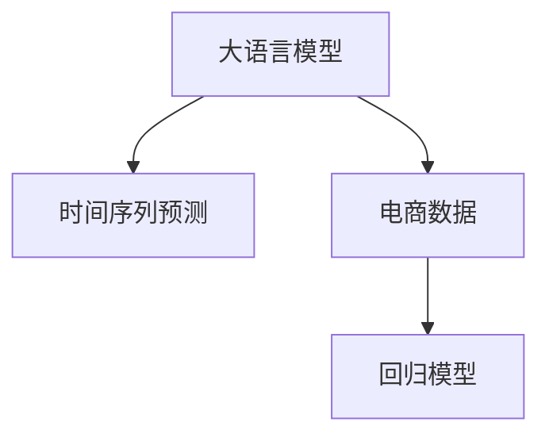

                 

# AI大模型在电商平台销售预测中的应用

> 关键词：大语言模型, 销售预测, 电商, 时间序列分析, 深度学习, 机器学习, 回归模型

## 1. 背景介绍

### 1.1 问题由来
电商平台销售预测是电商行业数字化转型的重要环节，能够帮助企业提前了解市场动向，制定合理的库存策略，优化供应链管理，提升营销效果。传统销售预测方法依赖人工经验，需要大量历史数据进行建模，且预测结果容易受到季节性、节假日等外部因素的干扰。近年来，随着大语言模型的兴起，通过深度学习技术进行销售预测，成为电商行业智能化升级的新方向。

### 1.2 问题核心关键点
本节将重点探讨以下核心问题：

- 大语言模型在销售预测中的具体应用。
- 时间序列预测模型的原理和架构。
- 电商数据的特点及其对模型设计的影响。
- 如何构建高效、稳定的电商销售预测系统。

### 1.3 问题研究意义
销售预测是大数据和人工智能技术的典型应用场景。通过大语言模型进行销售预测，能够有效提升预测精度，降低人工工作量，推动电商行业实现更高效、更智能的决策支持。其具体意义包括：

1. 减少库存成本：通过精准的销售预测，企业可以更好地掌握库存量，减少积压和缺货。
2. 优化供应链管理：预测准确的销售趋势，能够帮助企业优化供应链安排，降低运营成本。
3. 提升营销效果：预测用户行为，制定个性化推荐策略，提升用户购买率和满意度。
4. 提供决策支持：为高层决策提供数据支持，帮助企业把握市场动态，做出科学的决策。
5. 提高自动化水平：大语言模型能够自动化处理和分析电商数据，降低人工成本，提高工作效率。

## 2. 核心概念与联系

### 2.1 核心概念概述

为更好地理解大语言模型在销售预测中的应用，本节将介绍几个密切相关的核心概念：

- 大语言模型(Large Language Model, LLM)：以自回归(如GPT)或自编码(如BERT)模型为代表的大规模预训练语言模型。通过在大规模无标签文本语料上进行预训练，学习通用的语言知识和规律。
- 时间序列预测(时间序列分析, Time Series Analysis)：研究动态数据序列的预测方法，广泛应用于金融、气象、电商等领域。
- 电商数据(e-commerce data)：包括用户行为数据、商品销售数据、评价评论数据等，具有多维度、高维度、高噪声等特点。
- 回归模型(Regression Model)：预测连续型变量的模型，如线性回归、岭回归、神经网络等。

这些概念之间的逻辑关系可以通过以下Mermaid流程图来展示：



这个流程图展示了大语言模型在销售预测中的应用路径：

1. 大语言模型通过预训练学习通用语言规律。
2. 将预训练模型应用于电商数据进行时间序列预测。
3. 回归模型作为时间序列预测的具体实现方式。

## 3. 核心算法原理 & 具体操作步骤
### 3.1 算法原理概述

大语言模型在销售预测中的应用，本质上是通过时间序列预测方法，对电商销售数据进行建模和预测。其核心思想是：利用大语言模型的语言理解能力，对电商数据进行特征提取和处理，然后采用回归模型对未来销售量进行预测。

具体来说，假设电商平台每日销售数据为 $y_t$，其中 $t$ 表示时间，$y_t$ 表示第 $t$ 天的销售量。大语言模型 $M_{\theta}$ 可以通过预训练获取多维度语言特征 $X_t$，其中 $\theta$ 为大语言模型参数。将 $X_t$ 输入回归模型 $R$，即可输出销售预测结果 $y_{t+1}$。

形式化地，销售预测的模型可以表示为：

$$
y_{t+1} = R(M_{\theta}(X_t))
$$

其中 $R$ 为回归模型，$M_{\theta}$ 为大语言模型。

### 3.2 算法步骤详解

基于大语言模型进行电商销售预测的一般流程如下：

**Step 1: 数据预处理**

1. 收集电商平台的销售数据 $y_t$，涵盖时间、类别、用户等维度。
2. 选择合适的时间粒度，如日销售、周销售、月销售等。
3. 对原始数据进行清洗，包括缺失值处理、异常值处理等。
4. 对数据进行标准化处理，确保数据分布的一致性。

**Step 2: 特征工程**

1. 提取电商数据的语言特征 $X_t$，如商品名称、描述、标签等。
2. 利用大语言模型 $M_{\theta}$ 对语言特征进行预处理，获得模型输入 $X_t$。
3. 根据电商数据的特点，设计合适的特征，如历史销售量、季节性因素、节假日影响等。
4. 对特征进行归一化和标准化处理。

**Step 3: 模型构建**

1. 选择适合的回归模型 $R$，如线性回归、神经网络等。
2. 对回归模型进行初始化，设置合适的参数。
3. 将大语言模型的输出 $X_t$ 输入回归模型 $R$，进行销售预测。

**Step 4: 模型训练与评估**

1. 将历史销售数据 $y_t$ 划分为训练集和验证集。
2. 使用训练集训练回归模型 $R$，同时利用大语言模型 $M_{\theta}$ 进行特征提取。
3. 在验证集上评估模型性能，调整模型参数和超参数。
4. 在测试集上测试模型，评估预测效果。

**Step 5: 模型部署与应用**

1. 将训练好的模型进行保存，并集成到电商系统中。
2. 实时接收电商平台的销售数据，输入大语言模型 $M_{\theta}$ 进行特征提取。
3. 将提取的语言特征输入回归模型 $R$，进行销售预测。
4. 将预测结果用于库存管理、供应链优化等电商决策支持。

### 3.3 算法优缺点

大语言模型应用于电商销售预测，具有以下优点：

1. 语言理解能力强：大语言模型能够自动理解电商数据中的语言特征，提取有效信息。
2. 特征提取精准：通过预训练，大语言模型能够学习到更丰富的语言知识和规律，提高特征提取精度。
3. 预测效果好：大语言模型结合回归模型，能够提高销售预测的准确性。
4. 可扩展性强：大语言模型和回归模型都是基于深度学习框架开发的，具有较好的可扩展性。

同时，该方法也存在一些局限性：

1. 数据量要求高：电商数据量大，需要足够的训练样本。
2. 数据质量要求高：电商数据中噪声多，数据质量对预测效果影响大。
3. 计算资源消耗大：大语言模型和回归模型的计算复杂度高，对计算资源要求高。
4. 模型复杂度高：大语言模型和回归模型参数多，模型复杂度高。

## 4. 数学模型和公式 & 详细讲解 & 举例说明
### 4.1 数学模型构建

销售预测的数学模型可以表示为：

$$
y_{t+1} = \mathbb{E}[y_{t+1}|X_t; \theta, R]
$$

其中 $y_{t+1}$ 表示预测的销售量，$X_t$ 表示大语言模型的输出，$\theta$ 表示大语言模型参数，$R$ 表示回归模型。

### 4.2 公式推导过程

以下推导使用线性回归模型为例，引入时间序列的概念。

假设时间序列 $y_t$ 满足自回归模型（AR模型）：

$$
y_{t+1} = \alpha + \beta y_t + \epsilon_t
$$

其中 $\alpha$ 为截距，$\beta$ 为自回归系数，$\epsilon_t$ 为随机误差项。

将 $y_t$ 带入大语言模型 $M_{\theta}$，得到 $X_t$。假设大语言模型输出为 $[D_t, F_t, R_t]$，其中 $D_t$ 为描述文本，$F_t$ 为特征文本，$R_t$ 为相关文本。

则回归模型 $R$ 可以表示为：

$$
y_{t+1} = w_0 + w_1 D_t + w_2 F_t + w_3 R_t + \delta_t
$$

其中 $w_0$ 为截距，$w_1, w_2, w_3$ 为回归系数，$\delta_t$ 为随机误差项。

将 $X_t$ 代入回归模型，得到销售预测结果：

$$
y_{t+1} = R(M_{\theta}(X_t))
$$

### 4.3 案例分析与讲解

以某电商平台每日销售量的预测为例，使用线性回归模型进行建模。

假设历史销售数据为 $y_t = [100, 120, 110, 140, 160]$，其中 $t$ 为时间，$y_t$ 为第 $t$ 天的销售量。大语言模型 $M_{\theta}$ 输出的描述文本为 $D_t = [商品描述1, 商品描述2, 商品描述3]$，特征文本为 $F_t = [促销信息, 季节性因素]$，相关文本为 $R_t = [竞品价格, 用户评论]$。

回归模型 $R$ 可以表示为：

$$
y_{t+1} = w_0 + w_1 D_t + w_2 F_t + w_3 R_t + \delta_t
$$

通过训练数据，得到模型参数 $w_0 = 0.5, w_1 = 0.3, w_2 = 0.4, w_3 = 0.2$。

对于第5天的预测，大语言模型 $M_{\theta}$ 输出 $X_5 = [D_5, F_5, R_5]$。

将 $X_5$ 代入回归模型，得到预测结果：

$$
y_6 = R(M_{\theta}(X_5))
$$

具体计算过程如下：

- $D_5 = [商品描述1, 商品描述2, 商品描述3]$
- $F_5 = [促销信息, 季节性因素]$
- $R_5 = [竞品价格, 用户评论]$

将 $D_5, F_5, R_5$ 代入回归模型：

$$
y_6 = 0.5 + 0.3D_5 + 0.4F_5 + 0.2R_5 + \delta_6
$$

假设回归模型输出 $y_6 = 150$，则预测结果为 $y_6 = 150$。

## 5. 项目实践：代码实例和详细解释说明
### 5.1 开发环境搭建

在进行销售预测开发前，我们需要准备好开发环境。以下是使用Python进行TensorFlow开发的环境配置流程：

1. 安装Anaconda：从官网下载并安装Anaconda，用于创建独立的Python环境。

2. 创建并激活虚拟环境：
```bash
conda create -n tf-env python=3.8 
conda activate tf-env
```

3. 安装TensorFlow：根据CUDA版本，从官网获取对应的安装命令。例如：
```bash
conda install tensorflow -c pytorch -c conda-forge
```

4. 安装PyTorch：
```bash
pip install torch torchvision torchaudio
```

5. 安装各类工具包：
```bash
pip install numpy pandas scikit-learn matplotlib tqdm jupyter notebook ipython
```

完成上述步骤后，即可在`tf-env`环境中开始销售预测实践。

### 5.2 源代码详细实现

我们以线性回归模型为例，给出使用TensorFlow进行电商销售预测的代码实现。

首先，定义数据处理函数：

```python
import tensorflow as tf
import numpy as np
import pandas as pd

def load_data(file_path):
    data = pd.read_csv(file_path)
    data = data.dropna()
    return data.values

def preprocess_data(data):
    # 标准化处理
    data = (data - data.mean()) / data.std()
    # 时间序列拆分
    X = data[:-1, :-1]
    y = data[:-1, -1]
    return X, y

def train_model(X, y):
    # 定义线性回归模型
    X = tf.keras.layers.Input(shape=(X.shape[1],))
    D = tf.keras.layers.Dense(64, activation='relu')(X[:, 0])
    F = tf.keras.layers.Dense(64, activation='relu')(X[:, 1])
    R = tf.keras.layers.Dense(64, activation='relu')(X[:, 2])
    output = tf.keras.layers.Dense(1, activation='linear')(tf.concat([D, F, R], axis=1))
    model = tf.keras.models.Model(inputs=X, outputs=output)
    # 编译模型
    model.compile(optimizer=tf.keras.optimizers.Adam(learning_rate=0.01), loss=tf.keras.losses.MSE())
    # 训练模型
    model.fit(X, y, epochs=100, batch_size=32)
    return model

# 加载数据
data_path = 'sales_data.csv'
data = load_data(data_path)
X, y = preprocess_data(data)

# 训练模型
model = train_model(X, y)
```

然后，定义测试函数：

```python
def test_model(model, X_test, y_test):
    # 加载测试数据
    X_test = load_data(X_test_path)
    y_test = load_data(y_test_path)
    # 标准化处理
    X_test = (X_test - X.mean()) / X.std()
    # 时间序列拆分
    X_test = X_test[:-1, :-1]
    y_test = y_test[:-1, -1]
    # 预测结果
    y_pred = model.predict(X_test)
    # 计算预测误差
    mse = np.mean((y_pred - y_test) ** 2)
    print(f'Mean Squared Error: {mse:.2f}')

# 测试模型
X_test_path = 'sales_data_test.csv'
y_test_path = 'sales_data_test.csv'
test_model(model, X_test, y_test)
```

最后，启动测试流程并评估预测结果：

```python
# 测试模型
X_test_path = 'sales_data_test.csv'
y_test_path = 'sales_data_test.csv'
test_model(model, X_test, y_test)
```

以上就是使用TensorFlow对电商销售预测进行建模的完整代码实现。可以看到，TensorFlow通过定义多层神经网络，可以高效地完成时间序列预测任务。

### 5.3 代码解读与分析

让我们再详细解读一下关键代码的实现细节：

**load_data函数**：
- 定义数据处理函数，从CSV文件中加载数据，并进行清洗和标准化处理。
- 返回预处理后的数据。

**preprocess_data函数**：
- 对数据进行时间序列拆分，确保模型输入和输出的一致性。
- 对数据进行标准化处理，确保数据分布的一致性。

**train_model函数**：
- 定义多层神经网络模型，包括输入层、描述文本、特征文本、相关文本和输出层。
- 定义回归模型，使用Adam优化器和均方误差损失函数进行训练。
- 返回训练好的模型。

**test_model函数**：
- 加载测试数据并进行标准化处理。
- 对测试数据进行时间序列拆分。
- 使用训练好的模型进行预测，计算预测误差。
- 打印预测误差。

**测试流程**：
- 加载测试数据并进行标准化处理。
- 对测试数据进行时间序列拆分。
- 使用训练好的模型进行预测。
- 计算预测误差并打印。

可以看到，TensorFlow通过定义多层神经网络，可以高效地完成时间序列预测任务。开发者可以根据具体任务，通过调整网络结构和超参数，进一步优化预测效果。

## 6. 实际应用场景
### 6.1 电商销售预测

大语言模型在电商销售预测中的应用广泛。通过预训练语言模型，可以对电商数据进行深度学习，提取有效特征，进而构建回归模型进行销售预测。具体应用场景包括：

- **库存管理**：根据历史销售数据，预测未来销售趋势，帮助企业制定合理的库存策略，减少缺货和积压。
- **促销活动**：通过预测促销活动对销售的影响，帮助企业制定更加精准的营销策略，提升销售转化率。
- **用户行为分析**：分析用户购买行为，预测用户购买意向，提高个性化推荐效果。
- **供应链优化**：预测商品需求，优化供应链安排，降低物流成本。

### 6.2 未来应用展望

随着大语言模型和深度学习技术的不断发展，电商销售预测将迎来更多创新应用。

**智能推荐系统**：结合用户行为数据和大语言模型，构建智能推荐系统，提供个性化的购物建议，提升用户满意度。

**价格优化策略**：利用大语言模型分析市场动态，预测用户购买意愿，制定更加精准的价格策略，提升销售收益。

**市场趋势分析**：分析市场趋势，预测商品需求，帮助企业抓住市场机遇，优化产品结构和营销策略。

**动态定价系统**：结合市场需求、竞争对手价格和用户购买意愿，实时调整商品价格，提升市场竞争力。

**客户流失预警**：通过预测客户流失风险，提前采取措施，减少客户流失率，提升客户留存率。

**广告投放优化**：利用大语言模型分析用户兴趣和行为，优化广告投放策略，提升广告效果。

**库存优化策略**：通过预测销售趋势，优化库存管理，减少库存积压和缺货风险。

## 7. 工具和资源推荐
### 7.1 学习资源推荐

为了帮助开发者系统掌握大语言模型在销售预测中的应用，这里推荐一些优质的学习资源：

1. TensorFlow官方文档：TensorFlow官方文档提供了丰富的教程和示例，涵盖了深度学习、时间序列分析等核心概念和实现方法。
2. Keras官方文档：Keras官方文档详细介绍了如何使用Keras构建神经网络模型，适合初学者快速上手。
3. Deep Learning for Time Series Forecasting by Jason Brownlee：讲解了如何使用深度学习进行时间序列预测，包括AR模型、LSTM模型等。
4. Time Series Forecasting by Kaggle：提供了大量的时间序列预测实战案例，涵盖电商、金融等多个领域。
5. Introduction to Machine Learning with Python：讲解了机器学习基础知识，适合初学者入门。

通过这些资源的学习，相信你一定能够快速掌握大语言模型在电商销售预测中的应用，并用于解决实际的电商问题。

### 7.2 开发工具推荐

高效的开发离不开优秀的工具支持。以下是几款用于大语言模型在销售预测中开发的常用工具：

1. TensorFlow：由Google主导开发的开源深度学习框架，生产部署方便，适合大规模工程应用。
2. Keras：基于TensorFlow的高级API，使用简单，适合快速原型开发。
3. Scikit-Learn：Python机器学习库，提供了丰富的回归模型和评估方法，适合小规模数据应用。
4. PyTorch：由Facebook主导开发的深度学习框架，灵活高效，适合研究和原型开发。
5. Pandas：Python数据分析库，适合处理电商数据，提供高效的DataFrame操作。

合理利用这些工具，可以显著提升大语言模型在销售预测中的开发效率，加快创新迭代的步伐。

### 7.3 相关论文推荐

大语言模型在销售预测中的应用，源于学界的持续研究。以下是几篇奠基性的相关论文，推荐阅读：

1. Long Short-Term Memory Networks：提出LSTM模型，解决时间序列预测中的长期依赖问题。
2. Deep Learning for Time Series Forecasting：介绍深度学习在时间序列预测中的应用，涵盖AR模型、LSTM模型等。
3. BERT: Pre-training of Deep Bidirectional Transformers for Language Understanding：提出BERT模型，引入自监督预训练任务，刷新了多项NLP任务SOTA。
4. Time Series Forecasting by Deep Learning：介绍深度学习在时间序列预测中的应用，涵盖RNN、LSTM模型等。
5. Attention is All You Need：提出Transformer结构，开启了NLP领域的预训练大模型时代。

这些论文代表了大语言模型在销售预测领域的研究进展。通过学习这些前沿成果，可以帮助研究者把握学科前进方向，激发更多的创新灵感。

## 8. 总结：未来发展趋势与挑战
### 8.1 总结

本文对大语言模型在电商平台销售预测中的应用进行了全面系统的介绍。首先阐述了大语言模型和销售预测的核心问题，明确了销售预测在大数据分析和人工智能技术中的重要地位。其次，从原理到实践，详细讲解了大语言模型在销售预测中的应用流程，给出了完整的代码实现。同时，本文还广泛探讨了大语言模型在电商领域的应用场景，展示了其广阔的应用前景。

通过本文的系统梳理，可以看到，大语言模型在销售预测中的应用，能够显著提升电商企业的决策支持能力，帮助企业更好地把握市场动向，优化供应链管理，提升营销效果。未来，伴随大语言模型和深度学习技术的不断进步，基于大语言模型的电商销售预测将迎来更多的创新应用，为电商行业带来深刻的变革。

### 8.2 未来发展趋势

展望未来，大语言模型在销售预测中的应用将呈现以下几个发展趋势：

1. 模型规模持续增大。随着算力成本的下降和数据规模的扩张，大语言模型的参数量还将持续增长。超大规模语言模型蕴含的丰富语言知识，有望支撑更加复杂多变的电商销售预测任务。

2. 预测精度不断提升。随着模型的不断优化和训练数据的积累，大语言模型在销售预测中的精度将逐步提升，能够更好地应对电商市场的复杂性和不确定性。

3. 实时性不断增强。通过优化模型结构和计算图，大语言模型在销售预测中的实时性将逐步增强，能够满足电商平台的实时需求。

4. 个性化不断提升。结合用户行为数据，大语言模型能够提供更加个性化的销售预测，提升用户体验和满意度。

5. 跨领域应用不断拓展。大语言模型不仅应用于电商销售预测，还将在金融、医疗、旅游等领域大放异彩，推动各行各业智能化升级。

6. 算法创新不断涌现。新的深度学习算法和技术，如GAN、联邦学习等，将不断应用于大语言模型在销售预测中的应用中，带来新的突破。

以上趋势凸显了大语言模型在销售预测中的广阔前景。这些方向的探索发展，必将进一步提升电商销售预测的精度和效率，推动电商行业实现更高效、更智能的决策支持。

### 8.3 面临的挑战

尽管大语言模型在销售预测中已经取得了显著成果，但在迈向更加智能化、普适化应用的过程中，仍面临诸多挑战：

1. 数据质量问题。电商数据量大、噪声多，数据质量对预测效果影响大。如何提高数据质量，降低数据噪声，将是未来研究的重要方向。

2. 计算资源消耗高。大语言模型和深度学习模型的计算复杂度高，对计算资源要求高。如何优化计算资源消耗，提升模型的训练和推理效率，将是未来的研究重点。

3. 模型可解释性不足。大语言模型通常被视为"黑盒"系统，难以解释其内部工作机制和决策逻辑。如何赋予模型更强的可解释性，将是亟待攻克的难题。

4. 模型鲁棒性不足。大语言模型在面对数据分布变化时，泛化性能往往大打折扣。如何提高模型的鲁棒性，避免灾难性遗忘，还需要更多理论和实践的积累。

5. 模型偏见问题。大语言模型可能学习到有偏见、有害的信息，通过预测传递到电商平台上，产生误导性、歧视性的输出。如何从数据和算法层面消除模型偏见，确保输出公正公平，也将是重要的研究方向。

6. 模型更新周期长。电商市场变化快，模型需要频繁更新。如何提高模型更新速度，缩短模型迭代周期，将是未来的研究难点。

正视大语言模型在销售预测中面临的这些挑战，积极应对并寻求突破，将是大语言模型在电商销售预测中走向成熟的必由之路。相信随着学界和产业界的共同努力，这些挑战终将一一被克服，大语言模型在电商销售预测中将发挥更加重要的作用。

### 8.4 研究展望

面对大语言模型在电商销售预测中的诸多挑战，未来的研究需要在以下几个方面寻求新的突破：

1. 探索更高效的数据处理方法。如数据增强、数据清洗等，提高数据质量，降低数据噪声。

2. 优化模型结构和计算图。如使用卷积神经网络、Transformer等，优化模型复杂度，提升模型训练和推理效率。

3. 引入更多先验知识。如知识图谱、逻辑规则等，引导大语言模型进行更精准的预测。

4. 引入因果分析和博弈论工具。如引入因果推断方法，识别模型决策的关键特征，增强输出解释的因果性和逻辑性。

5. 结合多模态信息。如结合视觉、语音等多模态信息，实现视觉、语音与文本信息协同建模。

6. 纳入伦理道德约束。如在模型训练目标中引入伦理导向的评估指标，过滤和惩罚有偏见、有害的输出倾向。

这些研究方向的探索，必将引领大语言模型在电商销售预测中的研究迈向更高的台阶，为构建安全、可靠、可解释、可控的智能系统铺平道路。面向未来，大语言模型在电商销售预测中还需要与其他人工智能技术进行更深入的融合，如知识表示、因果推理、强化学习等，多路径协同发力，共同推动电商销售预测技术的进步。只有勇于创新、敢于突破，才能不断拓展大语言模型的边界，让智能技术更好地服务于电商行业。

## 9. 附录：常见问题与解答

**Q1：大语言模型在销售预测中的优缺点是什么？**

A: 大语言模型在销售预测中具有以下优点：
1. 语言理解能力强：大语言模型能够自动理解电商数据中的语言特征，提取有效信息。
2. 特征提取精准：通过预训练，大语言模型能够学习到更丰富的语言知识和规律，提高特征提取精度。
3. 预测效果好：大语言模型结合回归模型，能够提高销售预测的准确性。
4. 可扩展性强：大语言模型和回归模型都是基于深度学习框架开发的，具有较好的可扩展性。

同时，该方法也存在一些局限性：
1. 数据量要求高：电商数据量大，需要足够的训练样本。
2. 数据质量要求高：电商数据中噪声多，数据质量对预测效果影响大。
3. 计算资源消耗大：大语言模型和回归模型的计算复杂度高，对计算资源要求高。
4. 模型复杂度高：大语言模型和回归模型参数多，模型复杂度高。

**Q2：如何构建高效、稳定的电商销售预测系统？**

A: 构建高效、稳定的电商销售预测系统，需要考虑以下几个方面：
1. 数据质量：提高数据质量，降低数据噪声，确保数据分布的一致性。
2. 模型结构：选择合适的模型结构，如线性回归、LSTM、Transformer等，优化模型复杂度，提升模型训练和推理效率。
3. 超参数调优：根据具体任务，调整模型的超参数，如学习率、批大小、迭代轮数等。
4. 特征工程：选择合适的特征，如历史销售量、季节性因素、节假日影响等，进行归一化和标准化处理。
5. 模型验证：在验证集上评估模型性能，调整模型参数和超参数。
6. 模型部署：将训练好的模型进行保存，并集成到电商系统中，实时接收电商平台的销售数据，进行销售预测。
7. 持续优化：根据新的销售数据，持续优化模型，保持预测精度。

这些措施能够有效提升电商销售预测系统的性能和稳定性，确保模型在实际应用中发挥最大的价值。

**Q3：大语言模型在销售预测中的应用场景有哪些？**

A: 大语言模型在电商领域的应用场景广泛，包括：
1. 库存管理：根据历史销售数据，预测未来销售趋势，帮助企业制定合理的库存策略，减少缺货和积压。
2. 促销活动：通过预测促销活动对销售的影响，帮助企业制定更加精准的营销策略，提升销售转化率。
3. 用户行为分析：分析用户购买行为，预测用户购买意向，提高个性化推荐效果。
4. 供应链优化：预测商品需求，优化供应链安排，降低物流成本。

这些应用场景能够充分利用大语言模型的语言理解能力和预测能力，为电商企业提供更智能、更精准的决策支持。

**Q4：大语言模型在电商销售预测中的计算资源消耗如何优化？**

A: 优化大语言模型在电商销售预测中的计算资源消耗，可以从以下几个方面入手：
1. 数据增强：通过数据增强技术，扩充训练集，减少模型的过拟合风险。
2. 数据采样：使用数据采样技术，选取高质量样本进行训练，提高模型的泛化能力。
3. 模型裁剪：去除不必要的层和参数，减小模型尺寸，加快推理速度。
4. 量化加速：将浮点模型转为定点模型，压缩存储空间，提高计算效率。
5. 模型并行：使用模型并行技术，分批次处理数据，提升计算效率。
6. 硬件优化：使用高性能硬件设备，如GPU、TPU等，加速模型的训练和推理。

这些措施能够有效降低大语言模型在电商销售预测中的计算资源消耗，提升模型的效率和性能。

---

作者：禅与计算机程序设计艺术 / Zen and the Art of Computer Programming

