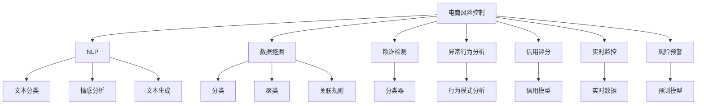

                 

# AI大模型在电商平台风险控制中的应用

> 关键词：电商风险控制, AI大模型, 自然语言处理(NLP), 数据挖掘, 欺诈检测, 异常行为分析, 信用评分, 实时监控, 风险预警

## 1. 背景介绍

### 1.1 问题由来
随着电商行业的迅速发展，用户交易量逐年攀升，随之而来的是越来越多的金融风险和欺诈行为。电商平台的交易流程复杂，涉及用户身份验证、支付结算、物流跟踪等多个环节，每一个环节都可能出现风险漏洞。传统基于规则的风险控制方法难以应对快速变化的市场环境，且容易误判合法交易。而AI大模型的引入，为电商平台提供了更高效、精准、智能的风险控制手段。

### 1.2 问题核心关键点
AI大模型在电商平台风险控制中的核心关键点在于利用其强大的数据处理能力和模式识别能力，对海量交易数据进行深度挖掘和分析，从中识别出潜在的欺诈行为和异常交易，从而有效地预防和控制金融风险。

具体来说，AI大模型在电商平台风险控制中的应用主要包括：

1. **自然语言处理(NLP)**：对交易相关的文本数据进行理解和分析，如用户评论、聊天记录等，从中挖掘出可能的欺诈行为和异常行为。

2. **数据挖掘**：从历史交易数据中提取有价值的模式和特征，用于训练预测模型，预测未来的交易风险。

3. **欺诈检测**：通过训练分类模型，对交易进行分类，识别出潜在的欺诈行为，及时进行拦截和预警。

4. **异常行为分析**：对用户的行为模式进行分析，识别出异常行为，如异常登录、异常交易等，从而预防潜在的欺诈风险。

5. **信用评分**：利用大模型对用户的历史交易行为进行评估，生成用户的信用评分，用于风险控制决策。

6. **实时监控**：对实时交易数据进行监控和分析，快速识别出异常交易，进行风险预警。

7. **风险预警**：通过训练预测模型，对未来的交易进行风险预测，提前采取预防措施。

这些应用场景展示了AI大模型在电商平台风险控制中的重要价值，通过其强大的数据处理和分析能力，可以有效提升电商平台的金融安全水平，保障用户的利益。

### 1.3 问题研究意义
AI大模型在电商平台风险控制中的应用，对于提升电商平台的金融安全、保障用户利益、预防欺诈行为具有重要意义。具体来说，AI大模型的应用可以实现以下几个目标：

1. **提高风险控制效率**：AI大模型能够处理海量的交易数据，快速识别出潜在的欺诈行为和异常交易，实现实时风险预警，提高风险控制的效率和精度。

2. **降低误判率**：传统基于规则的风险控制方法容易出现误判，而AI大模型通过深度学习技术，能够更好地理解用户行为和交易模式，降低误判率。

3. **增强用户信任**：电商平台利用AI大模型进行风险控制，可以有效预防欺诈行为，增强用户对平台的信任，提升用户满意度。

4. **优化业务流程**：AI大模型可以辅助电商平台进行风险决策，优化业务流程，提高业务效率。

5. **推动技术创新**：AI大模型的应用推动了NLP、数据挖掘、机器学习等技术的发展，为电商平台的技术创新提供了有力支持。

## 2. 核心概念与联系

### 2.1 核心概念概述

为了更好地理解AI大模型在电商平台风险控制中的应用，本节将介绍几个密切相关的核心概念：

- **电商风险控制**：指电商平台通过各种技术和手段，对交易过程中的金融风险进行识别、评估和控制的过程。

- **自然语言处理(NLP)**：指通过计算机技术对自然语言数据进行处理、分析和理解，涉及文本分类、情感分析、文本生成等任务。

- **数据挖掘**：指从大量数据中提取有用的信息和知识，发现隐藏的模式和规律，涉及分类、聚类、关联规则等技术。

- **欺诈检测**：指通过各种技术和手段，对交易数据进行分析和判断，识别出潜在的欺诈行为，及时进行预警和拦截。

- **异常行为分析**：指通过分析用户的行为模式，识别出异常行为，如异常登录、异常交易等，从而预防潜在的欺诈风险。

- **信用评分**：指通过分析用户的历史交易行为和信用记录，对用户进行信用评估，生成信用评分，用于风险控制决策。

这些核心概念之间的逻辑关系可以通过以下Mermaid流程图来展示：



这个流程图展示了电商风险控制中各个核心概念的相互关系：

1. 电商风险控制是整个风险控制体系的目标。
2. NLP、数据挖掘等技术为风险控制提供数据处理和分析工具。
3. 欺诈检测、异常行为分析等技术对交易数据进行深度分析和判断。
4. 信用评分和实时监控为风险预警提供支持。
5. 风险预警和预测模型对未来的交易进行风险预测和评估。

## 3. 核心算法原理 & 具体操作步骤
### 3.1 算法原理概述

AI大模型在电商平台风险控制中，通常采用监督学习和半监督学习的方法，利用大量标注数据和未标注数据，对模型进行训练和优化，从而实现对交易数据的深度分析和判断。

具体来说，AI大模型的风险控制算法主要包括以下几个步骤：

1. **数据准备**：收集和整理电商平台的交易数据、用户数据、交易记录等，作为模型的输入数据。

2. **特征提取**：对输入数据进行特征提取和预处理，将文本数据转换为数字特征向量，便于模型进行训练和预测。

3. **模型训练**：使用标注数据和未标注数据对AI大模型进行训练，通过反向传播算法优化模型参数。

4. **风险预测**：利用训练好的模型对新交易进行风险预测，判断其是否存在欺诈风险或异常行为。

5. **风险评估**：根据风险预测结果，对交易进行风险评估，生成风险评分，指导电商平台进行风险控制决策。

6. **风险预警**：根据风险评估结果，对高风险交易进行预警，及时采取措施进行拦截和处理。

### 3.2 算法步骤详解

以下是AI大模型在电商平台风险控制中常用的算法步骤详解：

**Step 1: 数据准备**

1. **收集数据**：收集电商平台的交易数据、用户数据、交易记录等，包括订单信息、支付信息、物流信息等。

2. **数据清洗**：对收集的数据进行清洗和预处理，去除噪声和无关数据，处理缺失值和异常值。

3. **数据划分**：将数据划分为训练集、验证集和测试集，一般训练集占总数据集的70%，验证集和测试集各占15%和10%。

4. **特征提取**：对文本数据进行分词、去停用词、词向量表示等预处理，将文本转换为数字特征向量。

5. **数据增强**：通过数据增强技术，扩充训练集数据量，提高模型的泛化能力。

**Step 2: 特征工程**

1. **特征选择**：选择对风险预测有显著影响的特征，去除无关特征，提高模型的效率和精度。

2. **特征缩放**：对特征进行标准化或归一化处理，保证特征在相同尺度下进行比较。

3. **特征组合**：将多个特征进行组合，生成新的特征，提高模型的表达能力。

4. **特征降维**：使用PCA、LDA等降维技术，减少特征维度，降低模型的复杂度。

5. **特征融合**：将不同数据源的特征进行融合，提高模型的鲁棒性。

**Step 3: 模型训练**

1. **选择合适的模型**：根据任务特点和数据分布，选择合适的机器学习模型，如逻辑回归、决策树、随机森林、梯度提升树等。

2. **设置超参数**：设置模型的超参数，如学习率、正则化系数、迭代轮数等。

3. **模型训练**：使用训练集对模型进行训练，通过反向传播算法优化模型参数。

4. **模型验证**：使用验证集对模型进行验证，调整模型参数，提高模型的泛化能力。

**Step 4: 风险预测**

1. **特征编码**：将新交易的特征向量转换为数字特征向量，输入模型进行预测。

2. **风险评估**：根据模型的预测结果，对交易进行风险评估，生成风险评分。

3. **阈值设定**：设定风险评分的阈值，将交易分为高风险和低风险两类。

4. **预警机制**：根据风险评分和阈值，对高风险交易进行预警，及时采取措施进行拦截和处理。

**Step 5: 风险预警**

1. **风险预警系统**：建立风险预警系统，对高风险交易进行实时监控和预警。

2. **人工审核**：对风险预警结果进行人工审核，确定是否拦截交易。

3. **处理措施**：对拦截的交易进行处理，如拒付、退款、追缴等。

4. **数据反馈**：将处理结果反馈到模型中，用于模型的再训练和优化。

### 3.3 算法优缺点

AI大模型在电商平台风险控制中具有以下优点：

1. **高效性**：AI大模型能够处理海量的交易数据，快速识别出潜在的欺诈行为和异常交易，实现实时风险预警。

2. **精确性**：通过深度学习技术，AI大模型能够更好地理解用户行为和交易模式，降低误判率，提高风险控制的精确性。

3. **鲁棒性**：AI大模型具有较强的鲁棒性，能够适应不同场景和数据分布的变化，避免过拟合和模型失灵。

4. **自适应性**：AI大模型能够根据数据和环境的变化进行自适应学习，不断优化模型参数和预测能力。

5. **可扩展性**：AI大模型能够快速扩展到不同电商平台和场景，提高风险控制的覆盖面。

然而，AI大模型在电商平台风险控制中也存在一些缺点：

1. **数据依赖**：AI大模型的性能依赖于大量的标注数据和未标注数据，如果数据质量不高，模型的效果将大打折扣。

2. **模型复杂性**：AI大模型通常具有复杂的模型结构和大量的参数，需要较长的训练时间和较大的计算资源。

3. **解释性不足**：AI大模型的决策过程和预测结果缺乏可解释性，难以进行人工审查和调试。

4. **对抗攻击**：AI大模型可能受到对抗样本的攻击，产生误判，影响模型的安全性和可靠性。

5. **隐私问题**：电商平台的交易数据涉及用户隐私，需要保护用户数据安全和隐私。

## 4. 数学模型和公式 & 详细讲解  
### 4.1 数学模型构建

在本节中，我们将通过数学模型和公式，详细讲解AI大模型在电商平台风险控制中的应用。

假设电商平台的交易数据集为 $D=\{(x_i, y_i)\}_{i=1}^N$，其中 $x_i$ 为交易特征向量，$y_i$ 为交易风险标签（0表示正常交易，1表示异常交易或欺诈行为）。我们的目标是通过训练一个二分类模型，对新的交易进行风险预测和评估。

定义模型的损失函数为交叉熵损失函数：

$$
\mathcal{L}(w, D) = -\frac{1}{N}\sum_{i=1}^N y_i\log p(y_i|x_i)
$$

其中 $p(y_i|x_i)$ 为模型对交易 $x_i$ 的预测概率，$w$ 为模型参数。

模型的预测概率可以通过softmax函数计算得到：

$$
p(y_i|x_i) = \frac{\exp(z_i)}{\sum_{j=0}^1 \exp(z_j)}
$$

其中 $z_i = w^T\varphi(x_i)$，$\varphi$ 为特征映射函数，将输入特征 $x_i$ 转换为模型可接受的数字特征向量。

模型的目标是最小化损失函数 $\mathcal{L}(w, D)$，通过梯度下降等优化算法，不断更新模型参数 $w$，直至收敛。

### 4.2 公式推导过程

以逻辑回归模型为例，推导其风险预测和评估过程。

假设模型的预测概率为 $p(y_i|x_i) = \sigma(w^T\varphi(x_i))$，其中 $\sigma$ 为sigmoid函数。

根据逻辑回归的输出，定义模型的风险评分 $S_i = \log \frac{p(y_i=1|x_i)}{p(y_i=0|x_i)}$，即对数几率（Log Odds）。

通过定义的风险评分，可以对交易进行风险评估和预警。当 $S_i > 0$ 时，交易被判断为高风险交易，需要预警和拦截。

### 4.3 案例分析与讲解

以电商平台中的欺诈检测为例，说明AI大模型的应用。

假设电商平台收集到了一批用户交易数据，其中包含正常的交易和欺诈交易。我们希望利用这些数据训练一个欺诈检测模型，对新的交易进行实时检测和预警。

**数据准备**：收集电商平台的交易数据，标注哪些交易是正常的，哪些交易是欺诈的。

**特征提取**：对交易数据进行特征提取，生成数字特征向量。

**模型训练**：使用标注数据对逻辑回归模型进行训练，调整模型参数 $w$，最小化交叉熵损失函数。

**风险预测**：将新交易的特征向量输入模型，计算其预测概率 $p(y_i|x_i)$，生成风险评分 $S_i$。

**风险预警**：根据风险评分和阈值，对高风险交易进行预警和拦截。

## 5. 项目实践：代码实例和详细解释说明
### 5.1 开发环境搭建

在进行AI大模型在电商平台风险控制中的应用开发前，需要准备好开发环境。以下是使用Python进行TensorFlow开发的环境配置流程：

1. 安装Anaconda：从官网下载并安装Anaconda，用于创建独立的Python环境。

2. 创建并激活虚拟环境：
```bash
conda create -n tf-env python=3.8 
conda activate tf-env
```

3. 安装TensorFlow：根据CUDA版本，从官网获取对应的安装命令。例如：
```bash
conda install tensorflow
```

4. 安装相关依赖包：
```bash
pip install pandas numpy sklearn scikit-learn tensorflow-addons
```

完成上述步骤后，即可在`tf-env`环境中开始项目实践。

### 5.2 源代码详细实现

以下是使用TensorFlow构建欺诈检测模型的示例代码。

**Step 1: 数据准备**

1. **数据加载**：从文件中读取标注数据。

```python
import pandas as pd

train_data = pd.read_csv('train.csv')
test_data = pd.read_csv('test.csv')
```

2. **特征处理**：将文本数据转换为数字特征向量。

```python
import tensorflow_addons as tfa

def preprocess(text):
    tokenizer = tfa.layers.text.MutualInformationWord2Vec()
    tokens = tokenizer.tokenize(text)
    return tokenizer.get_tokens_ids(tokens)

X_train = train_data['feature'].apply(preprocess)
X_test = test_data['feature'].apply(preprocess)
```

3. **数据增强**：通过数据增强技术扩充训练集。

```python
from tensorflow.keras.preprocessing.text import Tokenizer
from tensorflow.keras.preprocessing.sequence import pad_sequences

tokenizer = Tokenizer(num_words=10000, oov_token='<OOV>')
tokenizer.fit_on_texts(X_train)

X_train = tokenizer.texts_to_sequences(X_train)
X_test = tokenizer.texts_to_sequences(X_test)

X_train = pad_sequences(X_train, maxlen=256, padding='post')
X_test = pad_sequences(X_test, maxlen=256, padding='post')
```

4. **数据划分**：将数据划分为训练集、验证集和测试集。

```python
from sklearn.model_selection import train_test_split

X_train, X_val, y_train, y_val = train_test_split(X_train, train_data['label'], test_size=0.2, random_state=42)
X_train, X_test, y_train, y_test = train_test_split(X_train, test_data['label'], test_size=0.25, random_state=42)
```

**Step 2: 模型训练**

1. **构建模型**：定义逻辑回归模型。

```python
import tensorflow as tf

model = tf.keras.Sequential([
    tf.keras.layers.Embedding(input_dim=10000, output_dim=256),
    tf.keras.layers.Dropout(0.5),
    tf.keras.layers.Dense(128, activation='relu'),
    tf.keras.layers.Dense(1, activation='sigmoid')
])

model.compile(optimizer='adam', loss='binary_crossentropy', metrics=['accuracy'])
```

2. **模型训练**：使用训练集对模型进行训练，调整模型参数。

```python
model.fit(X_train, y_train, batch_size=32, epochs=10, validation_data=(X_val, y_val))
```

**Step 3: 风险预测**

1. **风险评分计算**：计算新交易的风险评分。

```python
y_pred = model.predict(X_test)
S = tf.math.log(y_pred / (1 - y_pred))
```

2. **风险预警**：根据风险评分和阈值，对高风险交易进行预警和拦截。

```python
threshold = 0.5
y_pred = y_pred > threshold
```

**Step 4: 结果评估**

1. **准确率评估**：计算模型的准确率。

```python
from sklearn.metrics import accuracy_score

accuracy = accuracy_score(y_test, y_pred)
```

2. **混淆矩阵**：计算模型的混淆矩阵。

```python
from sklearn.metrics import confusion_matrix

conf_matrix = confusion_matrix(y_test, y_pred)
```

以上代码实现了基于TensorFlow的欺诈检测模型的构建和训练，并计算了模型的准确率和混淆矩阵。

### 5.3 代码解读与分析

下面我们对代码进行详细解读和分析：

**数据准备**：
- 使用Pandas库读取数据，并进行特征处理。
- 使用TensorFlow Addons库实现文本特征提取和增强。
- 使用sklearn库进行数据划分。

**模型训练**：
- 使用TensorFlow构建逻辑回归模型。
- 设置优化器和损失函数，并进行模型编译。
- 使用训练集对模型进行训练，并设置验证集进行模型调优。

**风险预测**：
- 使用训练好的模型对新交易进行风险预测。
- 计算交易的风险评分，并根据阈值进行风险预警。

**结果评估**：
- 使用sklearn库计算模型的准确率和混淆矩阵。

## 6. 实际应用场景
### 6.1 智能客服系统

AI大模型在电商平台智能客服系统中的应用，可以显著提升客户服务质量和效率。电商平台可以利用AI大模型构建智能客服机器人，实时处理客户咨询和投诉，快速解决客户问题，提升客户满意度。

**具体应用**：
- **自然语言理解**：使用NLP技术对客户咨询进行自然语言理解，识别出客户需求。
- **意图识别**：利用AI大模型进行意图识别，确定客户咨询的意图和主题。
- **智能推荐**：根据客户的历史咨询记录和行为数据，推荐相关的产品和服务。
- **实时响应**：实时监控客户咨询数据，及时回应客户，减少客户等待时间。

### 6.2 金融风险管理

AI大模型在电商平台金融风险管理中的应用，可以显著提高金融风险控制的精准度和效率。电商平台可以利用AI大模型对交易数据进行深度分析和判断，实时识别和预警金融风险，避免财务损失。

**具体应用**：
- **欺诈检测**：通过训练欺诈检测模型，实时识别和预警高风险交易，及时采取措施进行拦截和处理。
- **信用评分**：利用AI大模型对用户的历史交易行为进行评估，生成信用评分，用于风险控制决策。
- **交易预警**：对高风险交易进行实时监控和预警，快速采取措施，避免财务损失。
- **风险预警系统**：建立风险预警系统，对异常交易进行预警和拦截。

### 6.3 产品推荐系统

AI大模型在电商平台产品推荐系统中的应用，可以显著提升推荐系统的精准度和个性化程度。电商平台可以利用AI大模型对用户的历史行为和交易数据进行深度分析和挖掘，推荐符合用户兴趣和需求的产品，提高用户满意度。

**具体应用**：
- **用户行为分析**：使用NLP技术对用户评论、聊天记录进行分析，挖掘用户兴趣和需求。
- **商品推荐**：利用AI大模型对用户行为数据进行建模，生成个性化的推荐结果。
- **实时推荐**：根据用户实时行为数据，动态生成推荐结果，提升推荐系统的效果。

### 6.4 未来应用展望

未来，AI大模型在电商平台风险控制中的应用将更加广泛和深入。随着AI技术的发展和应用，电商平台将能够利用AI大模型实现更加智能、高效、精准的风险控制，提升用户体验和业务效率。

**未来趋势**：
1. **模型融合**：未来的电商平台风险控制将更多地融合多种AI技术，如NLP、数据挖掘、机器学习等，构建更加全面、高效的智能系统。
2. **实时处理**：未来的电商平台将实现实时风险监控和预警，提升风险控制的及时性和准确性。
3. **自适应学习**：未来的AI大模型将具备更强的自适应学习能力，能够不断优化模型参数和预测能力，适应不同的数据和环境变化。
4. **跨平台应用**：未来的AI大模型将具备跨平台应用能力，能够在不同电商平台上进行风险控制，提高系统的通用性和可扩展性。
5. **多模态融合**：未来的电商平台将更多地融合多模态数据，如文本、图像、视频等，构建更加全面、精准的智能系统。

## 7. 工具和资源推荐
### 7.1 学习资源推荐

为了帮助开发者系统掌握AI大模型在电商平台风险控制中的应用，这里推荐一些优质的学习资源：

1. **《深度学习与Python》（Deep Learning with Python）**：由François Chollet所著，全面介绍了深度学习的基本概念和应用，适合初学者入门。

2. **《TensorFlow官方文档》**：TensorFlow的官方文档，提供了丰富的API参考和代码示例，是学习TensorFlow的重要资源。

3. **《自然语言处理基础》（Foundations of Statistical Natural Language Processing）**：由Christopher Manning等所著，全面介绍了自然语言处理的基本理论和应用，适合深入学习。

4. **《机器学习实战》（Machine Learning in Action）**：由Peter Harrington所著，通过实战案例介绍了机器学习的基本理论和应用，适合实战学习。

5. **Kaggle竞赛平台**：Kaggle是一个数据科学竞赛平台，提供了大量的数据集和竞赛项目，适合学习数据挖掘和机器学习的实践应用。

通过对这些资源的学习实践，相信你一定能够快速掌握AI大模型在电商平台风险控制中的应用，并用于解决实际的NLP问题。

### 7.2 开发工具推荐

高效的开发离不开优秀的工具支持。以下是几款用于AI大模型在电商平台风险控制中开发的常用工具：

1. TensorFlow：由Google主导开发的开源深度学习框架，生产部署方便，适合大规模工程应用。

2. PyTorch：基于Python的开源深度学习框架，灵活动态的计算图，适合快速迭代研究。

3. Keras：一个高级深度学习API，易于使用，支持TensorFlow、Theano、CNTK等多种深度学习框架。

4. Scikit-learn：一个Python科学计算库，包含多种机器学习算法，适合数据挖掘和模型训练。

5. Pandas：一个数据处理库，提供数据读写、数据清洗、数据转换等功能，适合数据处理和分析。

6. Jupyter Notebook：一个交互式编程环境，支持多种编程语言和工具，适合数据分析和模型训练。

合理利用这些工具，可以显著提升AI大模型在电商平台风险控制中的应用开发效率，加快创新迭代的步伐。

### 7.3 相关论文推荐

AI大模型在电商平台风险控制中的应用涉及多种技术和方法，以下是几篇奠基性的相关论文，推荐阅读：

1. **《基于深度学习的电商交易欺诈检测》**：该论文提出了基于深度学习的电商交易欺诈检测方法，通过训练逻辑回归模型和决策树模型，实现了对交易风险的预测和评估。

2. **《电商平台用户行为分析与个性化推荐》**：该论文提出了基于用户行为数据的电商平台个性化推荐方法，通过训练协同过滤模型和深度学习模型，实现了对用户兴趣的建模和推荐。

3. **《电商平台金融风险管理与控制》**：该论文提出了基于AI技术的电商平台金融风险管理方法，通过训练欺诈检测模型和信用评分模型，实现了对金融风险的实时监控和预警。

4. **《智能客服系统设计与实现》**：该论文提出了基于NLP技术的电商平台智能客服系统设计方案，通过训练对话生成模型和意图识别模型，实现了对客户咨询的智能响应。

5. **《电商平台实时推荐系统设计与实现》**：该论文提出了基于深度学习的电商平台实时推荐系统设计方案，通过训练序列生成模型和协同过滤模型，实现了对用户行为的实时分析和推荐。

这些论文代表了大语言模型在电商平台风险控制中的应用发展脉络。通过学习这些前沿成果，可以帮助研究者把握学科前进方向，激发更多的创新灵感。

## 8. 总结：未来发展趋势与挑战
### 8.1 总结

本文对AI大模型在电商平台风险控制中的应用进行了全面系统的介绍。首先阐述了电商平台的金融风险控制问题由来和核心关键点，明确了AI大模型在风险控制中的重要价值。其次，从原理到实践，详细讲解了AI大模型的风险预测和评估方法，给出了模型构建和训练的完整代码实例。同时，本文还广泛探讨了AI大模型在智能客服、金融风险管理、产品推荐等多个场景中的应用前景，展示了其广泛的应用价值。此外，本文精选了AI大模型在电商平台风险控制中的应用相关资源，力求为读者提供全方位的技术指引。

通过本文的系统梳理，可以看到，AI大模型在电商平台风险控制中的应用已经深入到多个关键环节，显著提升了电商平台的金融安全水平和用户满意度。未来，伴随AI技术的发展和应用，电商平台将能够利用AI大模型实现更加智能、高效、精准的风险控制，推动电商行业向数字化、智能化方向发展。

### 8.2 未来发展趋势

展望未来，AI大模型在电商平台风险控制中的应用将呈现以下几个发展趋势：

1. **技术融合**：未来的电商平台将更多地融合多种AI技术，如NLP、数据挖掘、机器学习等，构建更加全面、高效的智能系统。

2. **实时处理**：未来的电商平台将实现实时风险监控和预警，提升风险控制的及时性和准确性。

3. **自适应学习**：未来的AI大模型将具备更强的自适应学习能力，能够不断优化模型参数和预测能力，适应不同的数据和环境变化。

4. **多模态融合**：未来的电商平台将更多地融合多模态数据，如文本、图像、视频等，构建更加全面、精准的智能系统。

5. **跨平台应用**：未来的AI大模型将具备跨平台应用能力，能够在不同电商平台上进行风险控制，提高系统的通用性和可扩展性。

6. **隐私保护**：未来的电商平台将更加重视用户数据隐私保护，使用差分隐私等技术保护用户数据安全。

### 8.3 面临的挑战

尽管AI大模型在电商平台风险控制中的应用取得了显著成效，但在迈向更加智能化、普适化应用的过程中，它仍面临以下几个挑战：

1. **数据隐私问题**：电商平台涉及大量用户数据，如何保护用户数据隐私，防止数据泄露，是一个重要问题。

2. **模型鲁棒性**：AI大模型可能受到对抗样本的攻击，产生误判，影响模型的安全性和可靠性。

3. **模型解释性**：AI大模型的决策过程和预测结果缺乏可解释性，难以进行人工审查和调试。

4. **模型泛化能力**：AI大模型在不同场景和数据分布下的泛化能力仍需进一步提升，避免过拟合和模型失灵。

5. **跨领域迁移**：AI大模型在不同领域和数据集上的迁移能力仍需进一步提升，避免模型在特定领域表现不佳。

### 8.4 研究展望

为了应对上述挑战，未来的研究需要在以下几个方面进行深入探索：

1. **隐私保护技术**：研究差分隐私等隐私保护技术，保护用户数据隐私，防止数据泄露。

2. **鲁棒性提升**：研究对抗样本攻击方法，提升模型的鲁棒性，防止模型失灵。

3. **可解释性增强**：研究可解释性方法，增强模型的可解释性，便于人工审查和调试。

4. **泛化能力提升**：研究跨领域迁移方法，提升模型在不同场景和数据集上的泛化能力，避免过拟合。

5. **跨领域应用**：研究多模态融合方法，提升模型在不同领域和模态下的应用效果，提升系统的通用性和可扩展性。

## 9. 附录：常见问题与解答

**Q1：电商平台使用AI大模型进行风险控制是否安全可靠？**

A: 使用AI大模型进行电商平台风险控制可以显著提高风险控制的效率和精度，但需要确保模型的安全可靠。具体来说，需要注意以下几点：

1. **模型隐私保护**：电商平台应使用差分隐私等技术保护用户数据隐私，防止数据泄露。

2. **模型鲁棒性**：电商平台应研究对抗样本攻击方法，提升模型的鲁棒性，防止模型失灵。

3. **模型可解释性**：电商平台应研究可解释性方法，增强模型的可解释性，便于人工审查和调试。

4. **模型泛化能力**：电商平台应研究跨领域迁移方法，提升模型在不同场景和数据集上的泛化能力，避免过拟合。

5. **跨领域应用**：电商平台应研究多模态融合方法，提升模型在不同领域和模态下的应用效果，提升系统的通用性和可扩展性。

**Q2：如何选择合适的模型和算法？**

A: 在选择模型和算法时，需要考虑以下几个因素：

1. **任务特点**：根据电商平台的交易特点和风险控制需求，选择适合的模型和算法，如逻辑回归、决策树、随机森林、梯度提升树等。

2. **数据分布**：根据数据的分布和特征，选择适合的模型和算法，如NLP模型、数据挖掘模型等。

3. **计算资源**：根据计算资源的限制，选择适合的模型和算法，如参数较少的模型、轻量级模型等。

4. **效果评估**：根据效果评估结果，选择适合的模型和算法，如准确率、召回率、F1分数等。

5. **可解释性**：根据可解释性需求，选择适合的模型和算法，如可解释性强的模型、透明的模型等。

**Q3：电商平台在使用AI大模型进行风险控制时，如何确保模型的安全性和可靠性？**

A: 电商平台在使用AI大模型进行风险控制时，需要从多个方面确保模型的安全性和可靠性：

1. **数据隐私保护**：使用差分隐私等技术保护用户数据隐私，防止数据泄露。

2. **模型鲁棒性**：研究对抗样本攻击方法，提升模型的鲁棒性，防止模型失灵。

3. **模型可解释性**：研究可解释性方法，增强模型的可解释性，便于人工审查和调试。

4. **泛化能力提升**：研究跨领域迁移方法，提升模型在不同场景和数据集上的泛化能力，避免过拟合。

5. **跨领域应用**：研究多模态融合方法，提升模型在不同领域和模态下的应用效果，提升系统的通用性和可扩展性。

**Q4：电商平台在使用AI大模型进行风险控制时，如何优化模型的训练过程？**

A: 在电商平台使用AI大模型进行风险控制时，可以通过以下方法优化模型的训练过程：

1. **数据增强**：通过数据增强技术扩充训练集，提高模型的泛化能力。

2. **正则化技术**：使用正则化技术，如L2正则、Dropout等，防止模型过拟合。

3. **模型裁剪**：对模型进行裁剪，去除不必要的层和参数，减小模型尺寸，加快推理速度。

4. **量化加速**：将浮点模型转为定点模型，压缩存储空间，提高计算效率。

5. **混合精度训练**：使用混合精度训练技术，提高模型的训练效率和计算速度。

6. **模型并行**：使用模型并行技术，提升模型的训练速度和性能。

**Q5：电商平台在使用AI大模型进行风险控制时，如何处理异常交易和欺诈行为？**

A: 电商平台在使用AI大模型进行风险控制时，可以通过以下方法处理异常交易和欺诈行为：

1. **异常行为分析**：通过分析用户的行为模式，识别出异常行为，如异常登录、异常交易等，从而预防潜在的欺诈风险。

2. **欺诈检测模型**：通过训练欺诈检测模型，实时识别和预警高风险交易，及时采取措施进行拦截和处理。

3. **风险评分**：利用AI大模型对交易进行风险评分，生成风险评分，指导电商平台进行风险控制决策。

4. **预警机制**：建立风险预警系统，对高风险交易进行实时监控和预警，快速采取措施，避免财务损失。

5. **人工审核**：对风险预警结果进行人工审核，确定是否拦截交易。

**Q6：电商平台在使用AI大模型进行风险控制时，如何保证模型的稳定性和可靠性？**

A: 电商平台在使用AI大模型进行风险控制时，可以通过以下方法保证模型的稳定性和可靠性：

1. **持续监控**：实时监控模型的训练和运行状态，及时发现和修复问题。

2. **定期更新**：定期更新模型和算法，保持模型的稳定性和可靠性。

3. **模型集成**：使用模型集成技术，提高模型的鲁棒性和稳定性。

4. **数据回流**：将处理结果反馈到模型中，用于模型的再训练和优化，提升模型的性能和稳定性。

5. **模型验证**：使用验证集对模型进行验证，调整模型参数，提高模型的泛化能力和稳定性。

**Q7：电商平台在使用AI大模型进行风险控制时，如何处理数据缺失和异常值问题？**

A: 电商平台在使用AI大模型进行风险控制时，可以通过以下方法处理数据缺失和异常值问题：

1. **数据清洗**：对数据进行清洗和预处理，去除噪声和无关数据，处理缺失值和异常值。

2. **数据插补**：使用数据插补技术，如均值插补、回归插补等，填补缺失值。

3. **异常值处理**：使用异常值处理技术，如截断、替换等，处理异常值。

4. **特征选择**：选择对风险预测有显著影响的特征，去除无关特征，提高模型的效率和精度。

5. **特征缩放**：对特征进行标准化或归一化处理，保证特征在相同尺度下进行比较。

6. **特征降维**：使用PCA、LDA等降维技术，减少特征维度，降低模型的复杂度。

通过以上方法，可以有效处理数据缺失和异常值问题，提升模型的预测精度和稳定性。

---

作者：禅与计算机程序设计艺术 / Zen and the Art of Computer Programming

