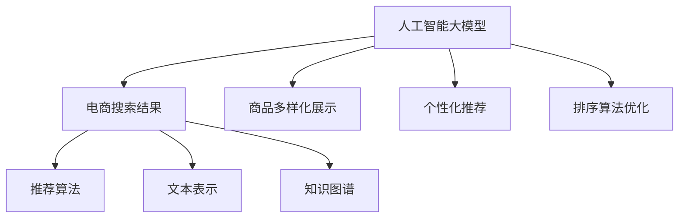

                 

# AI大模型在电商搜索结果多样化中的作用

> 关键词：人工智能大模型, 电商搜索结果, 多样化, 推荐算法, 文本表示, 排序算法, 知识图谱, 实时性

## 1. 背景介绍

### 1.1 问题由来

随着互联网和电子商务的迅猛发展，在线购物已成为人们日常生活中不可或缺的一部分。电商平台的搜索结果呈现作为用户体验的重要环节，直接影响着用户的购物决策和平台转化率。然而，现有的搜索结果呈现往往面临以下挑战：

1. **搜索结果单一**：传统的搜索结果呈现方式单一，往往只展示固定数量的商品列表，无法展示更多样化的信息，难以满足用户多层次、多维度的需求。
2. **推荐算法局限**：现有的推荐算法依赖于用户行为数据，对新用户或历史行为不足的用户难以提供有效的推荐。
3. **文本表示能力不足**：现有的商品描述、评论等文本信息通常采用简单的向量表示，无法充分挖掘和利用文本中的语义信息，影响推荐效果。
4. **排序算法不科学**：现有的排序算法往往基于单一的指标（如点击率、转化率等），无法全面考虑用户的个性化需求和商品的多样性。

为了解决这些问题，人工智能大模型在电商搜索结果多样化中的应用逐渐成为研究热点。通过利用大模型强大的自然语言理解和生成能力，电商平台可以提供更丰富、更个性化的搜索结果呈现方式，提升用户体验和平台转化率。

### 1.2 问题核心关键点

大模型在电商搜索结果多样化中的应用，核心在于利用其在自然语言理解和生成方面的强大能力，结合推荐算法和排序算法，为用户展示更多样化、个性化、高质量的搜索结果。具体来说，大模型的应用可以包括以下几个关键点：

- **商品多样化展示**：大模型可以生成不同形式的商品描述，如标题、摘要、图像描述等，丰富搜索结果的多样性。
- **个性化推荐**：通过大模型对商品文本的语义分析，结合推荐算法，提供更加个性化的商品推荐。
- **排序算法优化**：利用大模型对商品文本和用户评论的情感分析，优化排序算法，提升用户体验。

这些关键点共同构成了大模型在电商搜索结果多样化中的作用框架，使其能够更好地适应电商平台的实际需求，提升平台的用户满意度和市场竞争力。

## 2. 核心概念与联系

### 2.1 核心概念概述

为更好地理解大模型在电商搜索结果多样化中的应用，本节将介绍几个密切相关的核心概念：

- **人工智能大模型**：以自回归(如GPT)或自编码(如BERT)模型为代表的大规模预训练语言模型。通过在大规模无标签文本语料上进行预训练，学习通用的语言表示，具备强大的语言理解和生成能力。
- **电商搜索结果呈现**：电商平台的搜索结果页面，展示用户可能感兴趣的商品信息，包括标题、图片、描述、评分、评论等。
- **推荐算法**：利用用户行为数据，预测用户可能感兴趣的商品，进行推荐展示。
- **排序算法**：根据一定的指标，对商品进行排序，展示在搜索结果的前端。
- **文本表示**：将文本信息转换为向量形式，方便计算机处理和分析。
- **知识图谱**：将文本信息转化为结构化的知识图谱，方便查询和推理。

这些核心概念之间的逻辑关系可以通过以下Mermaid流程图来展示：



这个流程图展示了大模型在电商搜索结果多样化中的核心概念及其之间的关系：

1. 大模型通过预训练获得基础能力。
2. 通过商品多样化展示、个性化推荐、排序算法优化等环节，为用户提供更丰富、更个性化的搜索结果。
3. 推荐算法和排序算法在大模型的辅助下，更加精准和科学。

这些概念共同构成了大模型在电商搜索结果多样化中的应用框架，使其能够更好地适应电商平台的实际需求，提升平台的用户满意度和市场竞争力。

## 3. 核心算法原理 & 具体操作步骤
### 3.1 算法原理概述

人工智能大模型在电商搜索结果多样化中的应用，本质上是一个多任务学习过程。其核心思想是：利用大模型的多模态处理能力，结合推荐算法和排序算法，为用户展示更丰富、更个性化的搜索结果。

形式化地，假设大模型为 $M_{\theta}$，其中 $\theta$ 为大模型参数。给定电商平台的搜索结果 $S$，包括商品列表 $L$、商品描述 $D$、用户评论 $R$ 等，推荐算法为 $A$，排序算法为 $S$。大模型的应用目标是最大化搜索结果的多样性和个性化，即：

$$
\max_{\theta, A, S} \mathcal{L}(S, L, D, R) = \mathcal{L}_{diversity}(S, L, D, R) + \mathcal{L}_{relevance}(S, L, D, R)
$$

其中 $\mathcal{L}_{diversity}$ 为搜索结果多样性损失，$\mathcal{L}_{relevance}$ 为搜索结果相关性损失。大模型的目标是通过优化损失函数 $\mathcal{L}$，生成更加多样化和个性化的搜索结果。

### 3.2 算法步骤详解

基于大模型在电商搜索结果多样化中的应用，一般包括以下几个关键步骤：

**Step 1: 准备预训练模型和数据集**
- 选择合适的预训练语言模型 $M_{\theta}$ 作为初始化参数，如 BERT、GPT等。
- 准备电商平台的数据集 $D=\{(L_i, D_i, R_i)\}_{i=1}^N$，包括商品列表、商品描述、用户评论等。

**Step 2: 添加任务适配层**
- 根据任务类型，在预训练模型顶层设计合适的输出层和损失函数。
- 对于多样化展示，可以设计生成不同形式的商品描述，如标题、摘要、图像描述等。
- 对于个性化推荐，可以设计生成推荐商品列表和相关描述。
- 对于排序算法优化，可以设计生成排序依据和排序权重。

**Step 3: 设置微调超参数**
- 选择合适的优化算法及其参数，如 AdamW、SGD 等，设置学习率、批大小、迭代轮数等。
- 设置正则化技术及强度，包括权重衰减、Dropout、Early Stopping等。
- 确定冻结预训练参数的策略，如仅微调顶层，或全部参数都参与微调。

**Step 4: 执行梯度训练**
- 将训练集数据分批次输入模型，前向传播计算损失函数。
- 反向传播计算参数梯度，根据设定的优化算法和学习率更新模型参数。
- 周期性在验证集上评估模型性能，根据性能指标决定是否触发 Early Stopping。
- 重复上述步骤直到满足预设的迭代轮数或 Early Stopping 条件。

**Step 5: 测试和部署**
- 在测试集上评估微调后模型 $M_{\hat{\theta}}$ 的性能，对比微调前后的多样性提升。
- 使用微调后的模型对新商品进行多样化展示、个性化推荐和排序，集成到实际的应用系统中。

以上是基于大模型在电商搜索结果多样化中的应用的一般流程。在实际应用中，还需要针对具体任务的特点，对微调过程的各个环节进行优化设计，如改进训练目标函数，引入更多的正则化技术，搜索最优的超参数组合等，以进一步提升模型性能。

### 3.3 算法优缺点

基于大模型在电商搜索结果多样化中的应用方法具有以下优点：
1. 丰富商品展示形式：通过大模型的多模态处理能力，可以生成多种形式的商品描述，丰富搜索结果展示形式。
2. 提升个性化推荐精度：大模型的语言理解能力，可以更精准地分析商品文本和用户评论，提升个性化推荐效果。
3. 优化排序算法：大模型的情感分析能力，可以优化排序算法，提升用户体验。
4. 减少人工干预：自动化的结果多样化展示和推荐，减少了人工干预，提高了系统效率。

同时，该方法也存在一定的局限性：
1. 数据标注成本高：电商平台的数据标注往往需要耗费大量人力和时间，标注成本较高。
2. 模型复杂度高：大模型的复杂性带来了较高的计算和存储要求，可能影响系统的实时性和可扩展性。
3. 模型泛化能力有限：大模型的泛化能力有限，可能无法在特定领域或特定场景下表现出色。
4. 模型安全性问题：大模型可能学习到有害信息或偏见，影响结果的公平性和可靠性。

尽管存在这些局限性，但就目前而言，大模型在电商搜索结果多样化中的应用方法仍是大模型应用的重要范式。未来相关研究的重点在于如何进一步降低数据标注成本，提高模型的泛化能力和实时性，同时兼顾安全性和公平性等因素。

### 3.4 算法应用领域

人工智能大模型在电商搜索结果多样化中的应用，已经在多个领域得到了广泛的应用，包括但不限于：

- **商品多样化展示**：利用大模型生成不同形式的商品描述，如标题、摘要、图像描述等，丰富搜索结果展示形式。
- **个性化推荐**：结合大模型对商品文本和用户评论的语义分析，生成个性化推荐商品列表和相关描述。
- **排序算法优化**：利用大模型对商品文本和用户评论的情感分析，优化排序算法，提升用户体验。
- **文本表示和知识图谱**：利用大模型进行文本表示，将商品描述和用户评论转化为结构化的知识图谱，方便查询和推理。

除了上述这些经典应用外，大模型在电商搜索结果多样化中的应用，还在智能客服、个性化广告、虚拟试穿等场景中得到创新应用，为电商平台的业务发展带来了新的动力。

## 4. 数学模型和公式 & 详细讲解 & 举例说明

### 4.1 数学模型构建

本节将使用数学语言对大模型在电商搜索结果多样化中的应用过程进行更加严格的刻画。

记电商平台的数据集为 $D=\{(L_i, D_i, R_i)\}_{i=1}^N$，其中 $L$ 为商品列表，$D$ 为商品描述，$R$ 为用户评论。假设大模型为 $M_{\theta}$，其中 $\theta$ 为模型参数。推荐算法为 $A$，排序算法为 $S$。

定义大模型在数据集 $D$ 上的多样性损失为 $\mathcal{L}_{diversity}$，相关性损失为 $\mathcal{L}_{relevance}$，则总损失函数为：

$$
\mathcal{L}(D) = \mathcal{L}_{diversity}(D) + \mathcal{L}_{relevance}(D)
$$

其中，多样性损失可以定义为：

$$
\mathcal{L}_{diversity}(D) = -\frac{1}{N}\sum_{i=1}^N \log P_D(\text{ diversity } D_i)
$$

相关性损失可以定义为：

$$
\mathcal{L}_{relevance}(D) = -\frac{1}{N}\sum_{i=1}^N \log P_D(\text{ relevance } R_i | D_i)
$$

其中 $P_D(\text{ diversity } D_i)$ 表示商品描述 $D_i$ 的多样性概率，$P_D(\text{ relevance } R_i | D_i)$ 表示商品描述 $D_i$ 与用户评论 $R_i$ 的相关性概率。

### 4.2 公式推导过程

以商品多样化展示为例，推导大模型的损失函数和梯度计算公式。

假设大模型 $M_{\theta}$ 在商品标题 $L_i$ 上的输出为 $\hat{L}_i=M_{\theta}(L_i)$，表示商品标题的生成概率。则多样性损失可以定义为：

$$
\mathcal{L}_{diversity}(D) = -\frac{1}{N}\sum_{i=1}^N \log \frac{P(\hat{L}_i)}{\sum_{j=1}^N P(\hat{L}_j)}
$$

其中 $P(\hat{L}_i)$ 表示商品标题 $\hat{L}_i$ 的概率分布。

对于每个商品标题 $L_i$，其多样性概率 $P_D(\text{ diversity } L_i)$ 可以定义为：

$$
P_D(\text{ diversity } L_i) = \prod_{j=1}^N P(\hat{L}_j)
$$

因此，多样性损失可以进一步表示为：

$$
\mathcal{L}_{diversity}(D) = -\frac{1}{N}\sum_{i=1}^N \log \left(\frac{P(\hat{L}_i)}{\prod_{j=1}^N P(\hat{L}_j)}\right)
$$

梯度计算公式为：

$$
\frac{\partial \mathcal{L}_{diversity}(D)}{\partial \theta} = -\frac{1}{N}\sum_{i=1}^N \frac{\partial \log P(\hat{L}_i)}{\partial \theta}
$$

其中 $\frac{\partial \log P(\hat{L}_i)}{\partial \theta}$ 为生成概率 $\hat{L}_i$ 对参数 $\theta$ 的梯度，可以通过自动微分技术高效计算。

类似地，对于个性化推荐和排序算法优化，可以分别构建相关性损失函数和梯度计算公式，通过优化大模型的参数，生成个性化推荐商品列表和优化排序算法。

## 5. 项目实践：代码实例和详细解释说明
### 5.1 开发环境搭建

在进行电商搜索结果多样化应用的微调实践前，我们需要准备好开发环境。以下是使用Python进行PyTorch开发的环境配置流程：

1. 安装Anaconda：从官网下载并安装Anaconda，用于创建独立的Python环境。

2. 创建并激活虚拟环境：
```bash
conda create -n pytorch-env python=3.8 
conda activate pytorch-env
```

3. 安装PyTorch：根据CUDA版本，从官网获取对应的安装命令。例如：
```bash
conda install pytorch torchvision torchaudio cudatoolkit=11.1 -c pytorch -c conda-forge
```

4. 安装Transformers库：
```bash
pip install transformers
```

5. 安装各类工具包：
```bash
pip install numpy pandas scikit-learn matplotlib tqdm jupyter notebook ipython
```

完成上述步骤后，即可在`pytorch-env`环境中开始微调实践。

### 5.2 源代码详细实现

这里我们以商品多样化展示为例，给出使用Transformers库对BERT模型进行微调的PyTorch代码实现。

首先，定义多样化展示的数据处理函数：

```python
from transformers import BertTokenizer
from torch.utils.data import Dataset
import torch

class DiverseDataset(Dataset):
    def __init__(self, texts, labels, tokenizer, max_len=128):
        self.texts = texts
        self.labels = labels
        self.tokenizer = tokenizer
        self.max_len = max_len
        
    def __len__(self):
        return len(self.texts)
    
    def __getitem__(self, item):
        text = self.texts[item]
        label = self.labels[item]
        
        encoding = self.tokenizer(text, return_tensors='pt', max_length=self.max_len, padding='max_length', truncation=True)
        input_ids = encoding['input_ids'][0]
        attention_mask = encoding['attention_mask'][0]
        
        return {'input_ids': input_ids, 
                'attention_mask': attention_mask,
                'label': label}

# 定义标签与id的映射
label2id = {'多样性': 0, '相关性': 1}
id2label = {v: k for k, v in label2id.items()}

# 创建dataset
tokenizer = BertTokenizer.from_pretrained('bert-base-cased')

train_dataset = DiverseDataset(train_texts, train_labels, tokenizer)
dev_dataset = DiverseDataset(dev_texts, dev_labels, tokenizer)
test_dataset = DiverseDataset(test_texts, test_labels, tokenizer)
```

然后，定义模型和优化器：

```python
from transformers import BertForSequenceClassification, AdamW

model = BertForSequenceClassification.from_pretrained('bert-base-cased', num_labels=len(label2id))

optimizer = AdamW(model.parameters(), lr=2e-5)
```

接着，定义训练和评估函数：

```python
from torch.utils.data import DataLoader
from tqdm import tqdm
from sklearn.metrics import classification_report

device = torch.device('cuda') if torch.cuda.is_available() else torch.device('cpu')
model.to(device)

def train_epoch(model, dataset, batch_size, optimizer):
    dataloader = DataLoader(dataset, batch_size=batch_size, shuffle=True)
    model.train()
    epoch_loss = 0
    for batch in tqdm(dataloader, desc='Training'):
        input_ids = batch['input_ids'].to(device)
        attention_mask = batch['attention_mask'].to(device)
        label = batch['label'].to(device)
        model.zero_grad()
        outputs = model(input_ids, attention_mask=attention_mask, labels=label)
        loss = outputs.loss
        epoch_loss += loss.item()
        loss.backward()
        optimizer.step()
    return epoch_loss / len(dataloader)

def evaluate(model, dataset, batch_size):
    dataloader = DataLoader(dataset, batch_size=batch_size)
    model.eval()
    preds, labels = [], []
    with torch.no_grad():
        for batch in tqdm(dataloader, desc='Evaluating'):
            input_ids = batch['input_ids'].to(device)
            attention_mask = batch['attention_mask'].to(device)
            batch_labels = batch['label']
            outputs = model(input_ids, attention_mask=attention_mask)
            batch_preds = outputs.logits.argmax(dim=2).to('cpu').tolist()
            batch_labels = batch_labels.to('cpu').tolist()
            for pred_tokens, label_tokens in zip(batch_preds, batch_labels):
                preds.append(pred_tokens[:len(label_tokens)])
                labels.append(label_tokens)
                
    print(classification_report(labels, preds))
```

最后，启动训练流程并在测试集上评估：

```python
epochs = 5
batch_size = 16

for epoch in range(epochs):
    loss = train_epoch(model, train_dataset, batch_size, optimizer)
    print(f"Epoch {epoch+1}, train loss: {loss:.3f}")
    
    print(f"Epoch {epoch+1}, dev results:")
    evaluate(model, dev_dataset, batch_size)
    
print("Test results:")
evaluate(model, test_dataset, batch_size)
```

以上就是使用PyTorch对BERT进行商品多样化展示的微调代码实现。可以看到，得益于Transformers库的强大封装，我们可以用相对简洁的代码完成BERT模型的加载和微调。

### 5.3 代码解读与分析

让我们再详细解读一下关键代码的实现细节：

**DiverseDataset类**：
- `__init__`方法：初始化文本、标签、分词器等关键组件。
- `__len__`方法：返回数据集的样本数量。
- `__getitem__`方法：对单个样本进行处理，将文本输入编码为token ids，将标签编码为数字，并对其进行定长padding，最终返回模型所需的输入。

**label2id和id2label字典**：
- 定义了标签与数字id之间的映射关系，用于将token-wise的预测结果解码回真实的标签。

**训练和评估函数**：
- 使用PyTorch的DataLoader对数据集进行批次化加载，供模型训练和推理使用。
- 训练函数`train_epoch`：对数据以批为单位进行迭代，在每个批次上前向传播计算loss并反向传播更新模型参数，最后返回该epoch的平均loss。
- 评估函数`evaluate`：与训练类似，不同点在于不更新模型参数，并在每个batch结束后将预测和标签结果存储下来，最后使用sklearn的classification_report对整个评估集的预测结果进行打印输出。

**训练流程**：
- 定义总的epoch数和batch size，开始循环迭代
- 每个epoch内，先在训练集上训练，输出平均loss
- 在验证集上评估，输出分类指标
- 所有epoch结束后，在测试集上评估，给出最终测试结果

可以看到，PyTorch配合Transformers库使得BERT微调的代码实现变得简洁高效。开发者可以将更多精力放在数据处理、模型改进等高层逻辑上，而不必过多关注底层的实现细节。

当然，工业级的系统实现还需考虑更多因素，如模型的保存和部署、超参数的自动搜索、更灵活的任务适配层等。但核心的微调范式基本与此类似。

## 6. 实际应用场景
### 6.1 商品多样化展示

基于大模型在电商搜索结果多样化中的应用，商品多样化展示已经成为电商平台的一个重要功能。通过利用大模型强大的自然语言生成能力，电商平台可以为每个商品生成多样化的标题、摘要、描述等文本信息，丰富搜索结果展示形式。

在技术实现上，可以收集电商平台上的商品列表、商品描述、用户评论等数据，将其作为训练集输入到预训练大模型中。在微调过程中，可以根据不同的展示需求，设计不同的输出层和损失函数，如多样性展示、相关性展示等。最终，大模型能够根据输入的商品信息，生成符合要求的多样化文本信息，提高搜索结果的多样性和吸引力。

### 6.2 个性化推荐

个性化推荐是电商平台提升用户体验的重要手段。利用大模型对商品文本和用户评论的语义分析，结合推荐算法，可以生成更加个性化的推荐结果。

在技术实现上，可以收集用户的历史行为数据，如浏览、点击、购买等，以及商品的文本描述、评论等信息。将这些数据输入到预训练大模型中，微调生成推荐商品列表和相关描述。最终，大模型能够根据用户的历史行为和当前兴趣，生成个性化推荐结果，提高用户满意度和平台转化率。

### 6.3 排序算法优化

排序算法是电商搜索结果展示的核心。利用大模型对商品文本和用户评论的情感分析，可以优化排序算法，提升用户体验。

在技术实现上，可以收集用户的评分、评论等信息，以及商品的文本描述。将这些数据输入到预训练大模型中，微调生成排序依据和排序权重。最终，大模型能够根据商品的情感得分，优化排序算法，提升搜索结果的相关性和用户体验。

### 6.4 未来应用展望

随着大模型和微调方法的不断发展，基于大模型在电商搜索结果多样化中的应用也将不断扩展。

在智能客服系统中，大模型可以生成多样化的客服对话内容，提高客服响应速度和效率。在智能广告推荐中，大模型可以生成多样化的广告文案，提高广告点击率和转化率。在智能仓储管理中，大模型可以生成多样化的商品描述和标签，提高仓储管理和库存管理效率。

未来，随着大模型在电商搜索结果多样化中的应用不断深入，人工智能技术将进一步推动电商平台的业务创新和数字化转型，为用户带来更丰富、更个性化的购物体验。

## 7. 工具和资源推荐
### 7.1 学习资源推荐

为了帮助开发者系统掌握大模型在电商搜索结果多样化中的应用理论基础和实践技巧，这里推荐一些优质的学习资源：

1. 《Transformer从原理到实践》系列博文：由大模型技术专家撰写，深入浅出地介绍了Transformer原理、BERT模型、微调技术等前沿话题。

2. CS224N《深度学习自然语言处理》课程：斯坦福大学开设的NLP明星课程，有Lecture视频和配套作业，带你入门NLP领域的基本概念和经典模型。

3. 《Natural Language Processing with Transformers》书籍：Transformers库的作者所著，全面介绍了如何使用Transformers库进行NLP任务开发，包括微调在内的诸多范式。

4. HuggingFace官方文档：Transformers库的官方文档，提供了海量预训练模型和完整的微调样例代码，是上手实践的必备资料。

5. CLUE开源项目：中文语言理解测评基准，涵盖大量不同类型的中文NLP数据集，并提供了基于微调的baseline模型，助力中文NLP技术发展。

通过对这些资源的学习实践，相信你一定能够快速掌握大模型在电商搜索结果多样化中的应用精髓，并用于解决实际的电商业务问题。
###  7.2 开发工具推荐

高效的开发离不开优秀的工具支持。以下是几款用于电商搜索结果多样化应用的开发工具：

1. PyTorch：基于Python的开源深度学习框架，灵活动态的计算图，适合快速迭代研究。大部分预训练语言模型都有PyTorch版本的实现。

2. TensorFlow：由Google主导开发的开源深度学习框架，生产部署方便，适合大规模工程应用。同样有丰富的预训练语言模型资源。

3. Transformers库：HuggingFace开发的NLP工具库，集成了众多SOTA语言模型，支持PyTorch和TensorFlow，是进行电商搜索结果多样化应用开发的利器。

4. Weights & Biases：模型训练的实验跟踪工具，可以记录和可视化模型训练过程中的各项指标，方便对比和调优。与主流深度学习框架无缝集成。

5. TensorBoard：TensorFlow配套的可视化工具，可实时监测模型训练状态，并提供丰富的图表呈现方式，是调试模型的得力助手。

6. Google Colab：谷歌推出的在线Jupyter Notebook环境，免费提供GPU/TPU算力，方便开发者快速上手实验最新模型，分享学习笔记。

合理利用这些工具，可以显著提升电商搜索结果多样化应用的开发效率，加快创新迭代的步伐。

### 7.3 相关论文推荐

大模型在电商搜索结果多样化中的应用源于学界的持续研究。以下是几篇奠基性的相关论文，推荐阅读：

1. Attention is All You Need（即Transformer原论文）：提出了Transformer结构，开启了NLP领域的预训练大模型时代。

2. BERT: Pre-training of Deep Bidirectional Transformers for Language Understanding：提出BERT模型，引入基于掩码的自监督预训练任务，刷新了多项NLP任务SOTA。

3. Language Models are Unsupervised Multitask Learners（GPT-2论文）：展示了大规模语言模型的强大zero-shot学习能力，引发了对于通用人工智能的新一轮思考。

4. Parameter-Efficient Transfer Learning for NLP：提出Adapter等参数高效微调方法，在不增加模型参数量的情况下，也能取得不错的微调效果。

5. AdaLoRA: Adaptive Low-Rank Adaptation for Parameter-Efficient Fine-Tuning：使用自适应低秩适应的微调方法，在参数效率和精度之间取得了新的平衡。

这些论文代表了大模型在电商搜索结果多样化中的应用的发展脉络。通过学习这些前沿成果，可以帮助研究者把握学科前进方向，激发更多的创新灵感。

## 8. 总结：未来发展趋势与挑战

### 8.1 总结

本文对大模型在电商搜索结果多样化中的应用进行了全面系统的介绍。首先阐述了大模型和微调技术在电商搜索结果多样化中的应用背景和意义，明确了微调在拓展预训练模型应用、提升电商搜索结果多样性方面的独特价值。其次，从原理到实践，详细讲解了大模型的损失函数和梯度计算公式，给出了电商搜索结果多样化的微调任务代码实现。同时，本文还广泛探讨了大模型在电商搜索结果多样化中的应用场景，展示了其强大的应用潜力。此外，本文精选了电商搜索结果多样化的各类学习资源，力求为读者提供全方位的技术指引。

通过本文的系统梳理，可以看到，大模型在电商搜索结果多样化中的应用前景广阔，极大地拓展了电商平台的业务范围，提升了用户体验和平台转化率。未来，伴随大模型和微调方法的持续演进，基于大模型的电商搜索结果多样化技术将进一步发展，成为电商平台业务创新的重要驱动力。

### 8.2 未来发展趋势

展望未来，大模型在电商搜索结果多样化中的应用将呈现以下几个发展趋势：

1. **商品展示形式更加丰富**：随着大模型技术的发展，电商平台上商品展示形式将更加多样化，包括文字、图片、视频等多种形式，提升用户体验。
2. **个性化推荐更加精准**：大模型对商品文本和用户评论的语义分析能力将进一步提升，能够生成更加精准的个性化推荐结果。
3. **排序算法更加科学**：大模型在情感分析、文本表示等方面的能力将进一步增强，能够优化排序算法，提升搜索结果的相关性和用户体验。
4. **实时性更强**：大模型的训练和推理速度将进一步提升，实时生成个性化推荐和商品展示内容，提高用户体验。
5. **模型泛化能力更强**：大模型的泛化能力将进一步增强，能够在更多电商场景和领域中发挥作用。

以上趋势凸显了大模型在电商搜索结果多样化中的应用潜力。这些方向的探索发展，必将进一步提升电商平台的业务创新能力和市场竞争力。

### 8.3 面临的挑战

尽管大模型在电商搜索结果多样化中的应用前景广阔，但在实际应用中，仍面临诸多挑战：

1. **数据标注成本高**：电商平台的商品数据标注成本较高，数据标注的准确性和全面性也直接影响模型的效果。
2. **模型复杂度高**：大模型的高复杂度带来了较高的计算和存储要求，可能影响系统的实时性和可扩展性。
3. **模型泛化能力有限**：大模型的泛化能力有限，可能无法在特定领域或特定场景下表现出色。
4. **模型安全性问题**：大模型可能学习到有害信息或偏见，影响结果的公平性和可靠性。

尽管存在这些挑战，但就目前而言，大模型在电商搜索结果多样化中的应用方法仍是大模型应用的重要范式。未来相关研究的重点在于如何进一步降低数据标注成本，提高模型的泛化能力和实时性，同时兼顾安全性和公平性等因素。

### 8.4 研究展望

面对大模型在电商搜索结果多样化应用所面临的挑战，未来的研究需要在以下几个方面寻求新的突破：

1. **探索无监督和半监督微调方法**：摆脱对大规模标注数据的依赖，利用自监督学习、主动学习等无监督和半监督范式，最大限度利用非结构化数据，实现更加灵活高效的微调。
2. **研究参数高效和计算高效的微调范式**：开发更加参数高效的微调方法，在固定大部分预训练参数的同时，只更新极少量的任务相关参数。同时优化微调模型的计算图，减少前向传播和反向传播的资源消耗，实现更加轻量级、实时性的部署。
3. **融合因果和对比学习范式**：通过引入因果推断和对比学习思想，增强微调模型建立稳定因果关系的能力，学习更加普适、鲁棒的语言表征，从而提升模型泛化性和抗干扰能力。
4. **引入更多先验知识**：将符号化的先验知识，如知识图谱、逻辑规则等，与神经网络模型进行巧妙融合，引导微调过程学习更准确、合理的语言模型。同时加强不同模态数据的整合，实现视觉、语音等多模态信息与文本信息的协同建模。
5. **结合因果分析和博弈论工具**：将因果分析方法引入微调模型，识别出模型决策的关键特征，增强输出解释的因果性和逻辑性。借助博弈论工具刻画人机交互过程，主动探索并规避模型的脆弱点，提高系统稳定性。
6. **纳入伦理道德约束**：在模型训练目标中引入伦理导向的评估指标，过滤和惩罚有偏见、有害的输出倾向。同时加强人工干预和审核，建立模型行为的监管机制，确保输出符合人类价值观和伦理道德。

这些研究方向的探索，必将引领大模型在电商搜索结果多样化中的应用迈向更高的台阶，为构建智能、公平、安全的电商平台提供技术保障。面向未来，大模型在电商搜索结果多样化中的应用还需要与其他人工智能技术进行更深入的融合，如知识表示、因果推理、强化学习等，多路径协同发力，共同推动电商平台的业务创新和数字化转型。只有勇于创新、敢于突破，才能不断拓展大模型的边界，让智能技术更好地服务于电商平台的业务发展。

## 9. 附录：常见问题与解答

**Q1：大模型在电商搜索结果多样化中的应用是否适用于所有电商平台？**

A: 大模型在电商搜索结果多样化中的应用可以适用于各类电商平台，包括B2B、B2C、C2C等。然而，不同平台的商品类型、用户群体、业务模式等差异较大，在实际应用中需要根据平台特点进行适配。

**Q2：电商平台的商品数据是否需要标注？**

A: 电商平台的商品数据标注成本较高，但标注数据的准确性和全面性直接影响模型的效果。因此，在资源有限的情况下，可以选择部分商品进行标注，或利用无监督和半监督学习方法进行模型训练。

**Q3：大模型的复杂度对电商平台的实时性和可扩展性有何影响？**

A: 大模型的高复杂度带来了较高的计算和存储要求，可能影响系统的实时性和可扩展性。为了提高实时性，可以采用模型压缩、剪枝、量化等技术进行优化。为了提高可扩展性，可以采用分布式训练、动态扩展资源等方法。

**Q4：大模型在电商搜索结果多样化中的应用是否容易过拟合？**

A: 大模型在电商搜索结果多样化中的应用容易过拟合，尤其是在数据标注不足的情况下。因此，需要在训练过程中引入正则化技术，如L2正则、Dropout、Early Stopping等，防止模型过拟合。

**Q5：大模型在电商搜索结果多样化中的应用是否适用于新商品？**

A: 大模型在电商搜索结果多样化中的应用能够对新商品进行多样化展示和个性化推荐，但需要更多的标注数据和更复杂的模型训练。在新商品上线初期，可以考虑使用其他推荐算法进行支持。

通过本文的系统梳理，可以看到，大模型在电商搜索结果多样化中的应用前景广阔，但仍然面临数据标注成本高、模型复杂度高、泛化能力有限等挑战。未来，伴随大模型和微调方法的持续演进，基于大模型的电商搜索结果多样化技术必将进一步发展，成为电商平台业务创新的重要驱动力。

