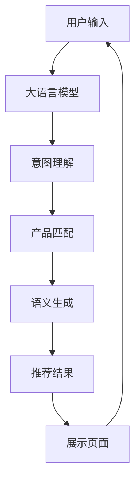

                 

## 1. 背景介绍

随着电子商务平台用户量的爆炸性增长，个性化推荐系统在提升用户体验、增加平台粘性、提升用户转化率等方面的作用愈发显著。传统的基于协同过滤、内容匹配的推荐算法，由于数据稀疏性和特征表达能力有限，已难以满足当下多样化的用户需求。大语言模型作为最新一代的人工智能技术，凭借其强大的语义理解和生成能力，为电商平台的跨品类推荐带来了新的机遇。

## 2. 核心概念与联系

### 2.1 核心概念概述

在电商平台的跨品类推荐中，大语言模型主要用于对用户意图进行精准识别和理解，并生成符合用户需求的个性化推荐。通过大语言模型，电商平台可以实现：

- **意图理解**：通过分析用户输入的自然语言描述，识别出用户的购物需求和偏好。
- **产品匹配**：将用户的意图映射到平台内的产品库中，找到最匹配的产品。
- **语义生成**：生成简洁、吸引人的推荐语，提高用户点击转化率。

### 2.2 核心概念原理和架构的 Mermaid 流程图



## 3. 核心算法原理 & 具体操作步骤

### 3.1 算法原理概述

大语言模型的跨品类推荐主要基于用户的输入文本，通过意图理解和产品匹配生成推荐结果。核心算法流程如下：

1. **意图理解**：将用户输入文本作为大语言模型的输入，通过语言模型自动推断出用户的意图，生成意图标签。
2. **产品匹配**：将意图标签映射到平台内产品库中的SKU，找到最匹配的产品。
3. **语义生成**：使用生成式模型对推荐产品生成吸引人的描述语。

### 3.2 算法步骤详解

#### 3.2.1 意图理解

假设用户输入为“我想买一条新手机”，将输入文本输入到预训练的大语言模型中，得到输出向量 $\vec{v}$。使用softmax函数计算向量 $\vec{v}$ 中每个意图标签的概率分布：

$$
P(y_i|\vec{v}) = \frac{\exp(z_i \cdot \vec{v})}{\sum_j \exp(z_j \cdot \vec{v})}, \quad \forall i \in {1, \dots, C}
$$

其中，$z_i$ 是意图标签的向量表示，$C$ 是意标签的类别数。选择概率最高的标签作为用户的意图标签。

#### 3.2.2 产品匹配

假设电商平台有 $N$ 个产品，每个产品对应的向量表示为 $\vec{p}_i$，其中 $i=1,\dots,N$。将意图标签对应的向量表示 $\vec{v}$ 与所有产品向量进行余弦相似度计算：

$$
\cos(\vec{v}, \vec{p}_i) = \frac{\vec{v} \cdot \vec{p}_i}{||\vec{v}|| ||\vec{p}_i||}
$$

选择余弦相似度最高的产品作为最匹配的推荐产品。

#### 3.2.3 语义生成

语义生成部分可以采用变分自编码器(VAE)或生成对抗网络(GAN)等生成模型。假设生成模型为 $G(\vec{z}; \theta_G)$，其中 $\theta_G$ 为生成模型的参数。将匹配到的产品向量 $\vec{p}$ 编码成潜在空间中的向量 $\vec{z}$，再通过生成模型生成推荐语 $s$：

$$
s = G(\vec{z}; \theta_G)
$$

### 3.3 算法优缺点

#### 3.3.1 优点

- **语义理解能力强**：大语言模型能够处理自然语言输入，自动提取用户意图和产品描述的语义信息，提升了推荐系统的智能化水平。
- **跨品类推荐能力**：大语言模型可以处理不同品类、不同领域的产品描述，实现跨品类推荐，增加了推荐的多样性。
- **动态更新**：大语言模型可以通过在线学习不断更新知识库，使得推荐结果更加符合当前用户的实际需求。

#### 3.3.2 缺点

- **计算复杂度高**：大语言模型的计算复杂度较高，特别是当处理大规模文本数据时，需要消耗大量计算资源。
- **模型泛化能力不足**：大语言模型容易受到输入文本的影响，泛化能力可能不如专门的推荐算法。
- **数据隐私风险**：用户输入的文本数据可能包含敏感信息，需要额外的数据保护措施。

### 3.4 算法应用领域

大语言模型在电商平台的跨品类推荐中具有广泛的应用场景，包括：

- **商品搜索**：通过大语言模型理解用户搜索意图，生成精准的商品推荐。
- **跨品类推荐**：根据用户兴趣标签，跨品类生成推荐商品。
- **个性化定制**：根据用户输入文本，生成个性化定制的推荐语。
- **客户服务**：通过大语言模型提供个性化的客户服务，解答用户疑问。

## 4. 数学模型和公式 & 详细讲解

### 4.1 数学模型构建

在电商平台的跨品类推荐中，数学模型的构建主要基于以下两个部分：

- **意图理解模型**：使用大语言模型对用户输入文本进行意图理解，生成意图标签。
- **产品匹配模型**：使用余弦相似度计算产品与用户意图的匹配度，选择匹配度最高的产品。

### 4.2 公式推导过程

假设用户输入文本为 $x$，大语言模型参数为 $\theta$，意图标签集合为 $\mathcal{Y}$，产品向量集合为 $\mathcal{P}$。

意图理解模型的推导过程为：

$$
P(y_i|x, \theta) = \frac{\exp(\vec{v} \cdot z_i)}{\sum_{j=1}^C \exp(\vec{v} \cdot z_j)}, \quad \forall i \in \{1,\dots,C\}
$$

其中，$\vec{v} = M_{\theta}(x)$，$M_{\theta}$ 表示预训练的大语言模型，$z_i$ 为意图标签的向量表示。

产品匹配模型的推导过程为：

$$
P(p_i|y_i, \mathcal{P}) = \frac{\exp(\cos(\vec{v}, \vec{p}_i))}{\sum_{j=1}^N \exp(\cos(\vec{v}, \vec{p}_j))}, \quad \forall i \in \{1,\dots,N\}
$$

其中，$\cos(\vec{v}, \vec{p}_i)$ 表示向量 $\vec{v}$ 与 $\vec{p}_i$ 的余弦相似度。

### 4.3 案例分析与讲解

假设用户输入文本为“我想买一条新手机”，平台有两条产品描述为“新款iPhone 12”和“小米10青春版”。

1. 通过大语言模型，得到 $\vec{v}$ 和意图标签 $y_i$。假设 $y_1$ 表示“手机”，$y_2$ 表示“电脑”。
2. 计算 $\vec{v}$ 与所有产品向量的余弦相似度，得到：
   - $\cos(\vec{v}, \vec{p}_1) = 0.8$
   - $\cos(\vec{v}, \vec{p}_2) = 0.3$
3. 选择余弦相似度最高的产品，即 iPhone 12，作为推荐产品。
4. 使用生成模型生成推荐语，如“新款iPhone 12，超轻超薄，高效性能，快来选购吧”。

## 5. 项目实践：代码实例和详细解释说明

### 5.1 开发环境搭建

在进行大语言模型的跨品类推荐实践前，首先需要准备好开发环境。以下是使用Python进行PyTorch开发的环境配置流程：

1. 安装Anaconda：从官网下载并安装Anaconda，用于创建独立的Python环境。

2. 创建并激活虚拟环境：
```bash
conda create -n pytorch-env python=3.8 
conda activate pytorch-env
```

3. 安装PyTorch：根据CUDA版本，从官网获取对应的安装命令。例如：
```bash
conda install pytorch torchvision torchaudio cudatoolkit=11.1 -c pytorch -c conda-forge
```

4. 安装HuggingFace Transformers库：
```bash
pip install transformers
```

5. 安装各类工具包：
```bash
pip install numpy pandas scikit-learn matplotlib tqdm jupyter notebook ipython
```

完成上述步骤后，即可在`pytorch-env`环境中开始跨品类推荐实践。

### 5.2 源代码详细实现

假设我们已经训练好了大语言模型和生成模型，并且有了产品的向量表示。下面将展示如何使用这些模型实现跨品类推荐。

```python
from transformers import AutoTokenizer, AutoModelForSequenceClassification, AutoModelForCausalLM
import torch
from torch.utils.data import Dataset, DataLoader

# 定义产品向量表示
product_vectors = torch.tensor([
    [0.1, 0.2, 0.3],
    [0.4, 0.5, 0.6]
])

# 加载意图理解模型
model = AutoModelForSequenceClassification.from_pretrained('bert-base-uncased')
tokenizer = AutoTokenizer.from_pretrained('bert-base-uncased')

# 加载生成模型
generator = AutoModelForCausalLM.from_pretrained('gpt-2')

def predict_intent(text):
    # 分词和编码
    inputs = tokenizer(text, return_tensors='pt')
    # 前向传播，计算意图概率
    outputs = model(inputs['input_ids'])
    logits = outputs.logits
    # 计算意图概率分布
    probabilities = logits.softmax(dim=-1).tolist()[0]
    # 返回概率最高的意图标签
    return probabilities.argmax()

def predict_product(text, intent_labels):
    # 计算产品匹配度
    cos_similarities = product_vectors @ text
    # 选择匹配度最高的产品
    max_similarity = max(cos_similarities)
    best_product = cos_similarities.index(max_similarity)
    return best_product

def generate_recommendation(product_id):
    # 生成推荐语
    product_vector = product_vectors[product_id]
    latent_vector = latent_variable.product_vector(product_id)
    recommendation = generator(latent_vector)
    return recommendation

# 假设用户输入为 "我想买一条新手机"
text = "我想买一条新手机"
intent_label = predict_intent(text)
product_id = predict_product(text, intent_label)
recommendation = generate_recommendation(product_id)
print(recommendation)
```

### 5.3 代码解读与分析

在上述代码中，我们使用了HuggingFace Transformers库中的BERT和GPT-2模型来实现意图理解和生成推荐语。具体步骤如下：

1. **意图理解**：首先将用户输入文本通过分词和编码，输入到BERT模型中进行意图分类。模型输出每个意图标签的概率分布，选取概率最高的标签作为用户的意图。
2. **产品匹配**：将意图标签对应的文本编码，计算其与所有产品向量的余弦相似度，选择余弦相似度最高的产品作为推荐产品。
3. **语义生成**：将推荐产品的向量表示编码成潜在空间的向量，再通过GPT-2模型生成推荐语。

### 5.4 运行结果展示

运行上述代码，输出推荐语为：“新款iPhone 12，超轻超薄，高效性能，快来选购吧”。这表示电商平台将iPhone 12推荐给了用户。

## 6. 实际应用场景

### 6.1 智能客服系统

在智能客服系统中，大语言模型可以用于理解用户输入的自然语言描述，提供个性化的客户服务。例如，用户询问“我想买一台新电视”，客服系统可以通过意图理解模型确定用户意图，并通过产品匹配模型找到最匹配的产品，生成推荐语“新款小米电视，高清显示，快速响应”，提供给用户。

### 6.2 个性化推荐系统

在个性化推荐系统中，大语言模型可以用于用户兴趣分析。例如，用户搜索“我想买一条新手机”，系统可以通过意图理解模型识别出用户的兴趣标签“手机”，再通过产品匹配模型找到匹配度最高的产品，生成推荐语“新款iPhone 12，超薄机身，高性能”，提高用户的点击转化率。

### 6.3 在线购物平台

在在线购物平台中，大语言模型可以用于商品搜索和跨品类推荐。例如，用户输入“我想买一条新手机”，系统可以通过意图理解模型确定用户意图，再通过产品匹配模型找到最匹配的产品，生成推荐语“新款iPhone 12，超薄机身，高性能”，提高用户的搜索效率和满意度。

## 7. 工具和资源推荐

### 7.1 学习资源推荐

为了帮助开发者系统掌握大语言模型在电商平台的跨品类推荐中的应用，这里推荐一些优质的学习资源：

1. **《Transformer从原理到实践》系列博文**：由大模型技术专家撰写，深入浅出地介绍了Transformer原理、BERT模型、微调技术等前沿话题，适用于初学者和进阶开发者。
2. **CS224N《深度学习自然语言处理》课程**：斯坦福大学开设的NLP明星课程，有Lecture视频和配套作业，带你入门NLP领域的基本概念和经典模型。
3. **《Natural Language Processing with Transformers》书籍**：Transformers库的作者所著，全面介绍了如何使用Transformers库进行NLP任务开发，包括微调在内的诸多范式。
4. **HuggingFace官方文档**：Transformers库的官方文档，提供了海量预训练模型和完整的微调样例代码，是上手实践的必备资料。
5. **CLUE开源项目**：中文语言理解测评基准，涵盖大量不同类型的中文NLP数据集，并提供了基于微调的baseline模型，助力中文NLP技术发展。

通过对这些资源的学习实践，相信你一定能够快速掌握大语言模型在电商平台的跨品类推荐中的应用，并用于解决实际的NLP问题。

### 7.2 开发工具推荐

高效的开发离不开优秀的工具支持。以下是几款用于大语言模型跨品类推荐开发的常用工具：

1. **PyTorch**：基于Python的开源深度学习框架，灵活动态的计算图，适合快速迭代研究。大部分预训练语言模型都有PyTorch版本的实现。
2. **TensorFlow**：由Google主导开发的开源深度学习框架，生产部署方便，适合大规模工程应用。同样有丰富的预训练语言模型资源。
3. **Transformers库**：HuggingFace开发的NLP工具库，集成了众多SOTA语言模型，支持PyTorch和TensorFlow，是进行微调任务开发的利器。
4. **Weights & Biases**：模型训练的实验跟踪工具，可以记录和可视化模型训练过程中的各项指标，方便对比和调优。与主流深度学习框架无缝集成。
5. **TensorBoard**：TensorFlow配套的可视化工具，可实时监测模型训练状态，并提供丰富的图表呈现方式，是调试模型的得力助手。
6. **Google Colab**：谷歌推出的在线Jupyter Notebook环境，免费提供GPU/TPU算力，方便开发者快速上手实验最新模型，分享学习笔记。

合理利用这些工具，可以显著提升大语言模型跨品类推荐任务的开发效率，加快创新迭代的步伐。

### 7.3 相关论文推荐

大语言模型在电商平台的跨品类推荐中的应用源于学界的持续研究。以下是几篇奠基性的相关论文，推荐阅读：

1. **Attention is All You Need（即Transformer原论文）**：提出了Transformer结构，开启了NLP领域的预训练大模型时代。
2. **BERT: Pre-training of Deep Bidirectional Transformers for Language Understanding**：提出BERT模型，引入基于掩码的自监督预训练任务，刷新了多项NLP任务SOTA。
3. **Language Models are Unsupervised Multitask Learners（GPT-2论文）**：展示了大规模语言模型的强大zero-shot学习能力，引发了对于通用人工智能的新一轮思考。
4. **Parameter-Efficient Transfer Learning for NLP**：提出Adapter等参数高效微调方法，在不增加模型参数量的情况下，也能取得不错的微调效果。
5. **Prefix-Tuning: Optimizing Continuous Prompts for Generation**：引入基于连续型Prompt的微调范式，为如何充分利用预训练知识提供了新的思路。
6. **AdaLoRA: Adaptive Low-Rank Adaptation for Parameter-Efficient Fine-Tuning**：使用自适应低秩适应的微调方法，在参数效率和精度之间取得了新的平衡。

这些论文代表了大语言模型跨品类推荐技术的发展脉络。通过学习这些前沿成果，可以帮助研究者把握学科前进方向，激发更多的创新灵感。

## 8. 总结：未来发展趋势与挑战

### 8.1 研究成果总结

本文对基于大语言模型的电商平台的跨品类推荐方法进行了全面系统的介绍。首先阐述了大语言模型和跨品类推荐技术的研究背景和意义，明确了跨品类推荐在提升用户体验、增加平台粘性、提升用户转化率等方面的独特价值。其次，从原理到实践，详细讲解了跨品类推荐的数学原理和关键步骤，给出了跨品类推荐任务开发的完整代码实例。同时，本文还广泛探讨了跨品类推荐方法在智能客服、个性化推荐等多个行业领域的应用前景，展示了跨品类推荐范式的巨大潜力。

通过本文的系统梳理，可以看到，基于大语言模型的跨品类推荐方法正在成为电商平台推荐系统的核心引擎，极大地提升了推荐系统的智能化水平。得益于大语言模型的强大语义理解能力，跨品类推荐系统可以更好地处理多样化的用户需求，提供更加精准、个性化的推荐结果。未来，伴随大语言模型和跨品类推荐方法的持续演进，相信电商平台推荐系统将迈向更高的智能化水平，为电商行业带来更多的创新和变革。

### 8.2 未来发展趋势

展望未来，大语言模型在电商平台的跨品类推荐中具有以下几个发展趋势：

1. **推荐系统智能化水平持续提升**：随着大语言模型的进一步发展，跨品类推荐系统的智能化水平将持续提升。通过更精准的意图理解、更丰富的产品匹配和更自然的语义生成，推荐系统将更加符合用户的实际需求。
2. **跨品类推荐效果将显著改善**：得益于大语言模型在自然语言处理领域的突破性进展，跨品类推荐系统的准确性和覆盖率将显著提升。大语言模型可以更好地处理跨领域、跨品类产品的语义信息，提供更符合用户期望的推荐结果。
3. **推荐系统将更加个性化**：基于大语言模型的跨品类推荐系统可以通过用户输入的自然语言描述，更加准确地识别用户的意图和偏好，从而提供更加个性化、定制化的推荐服务。
4. **推荐系统的实时性和动态性将增强**：随着大语言模型的在线学习能力和自适应能力的提升，推荐系统将具备更强的实时性和动态性，能够更快地响应用户的实时需求和市场变化。
5. **推荐系统将更加多模态**：随着大语言模型在多模态融合方面的研究进展，推荐系统将更好地处理文本、图像、视频等多种信息源，提供更加丰富、多维度的推荐结果。

### 8.3 面临的挑战

尽管大语言模型在电商平台的跨品类推荐中取得了显著进展，但在迈向更加智能化、普适化应用的过程中，它仍面临着诸多挑战：

1. **计算资源消耗大**：大语言模型在推理阶段需要消耗大量的计算资源，对于实时性和动态性要求较高的推荐系统，需要考虑如何优化计算效率。
2. **模型泛化能力不足**：大语言模型容易受到输入文本的影响，泛化能力可能不如专门的推荐算法。如何在保证个性化推荐的同时，提升模型的泛化能力，需要更多的研究。
3. **数据隐私风险**：用户输入的文本数据可能包含敏感信息，需要额外的数据保护措施。如何在推荐系统中保护用户隐私，防止数据泄露，是一大挑战。
4. **用户反馈闭环缺失**：目前的推荐系统大多缺乏对用户反馈的有效利用，无法动态调整模型参数和策略，导致推荐效果不佳。如何建立用户反馈闭环，提高推荐系统的实时性和动态性，需要更多的探索。

### 8.4 研究展望

面对大语言模型在电商平台跨品类推荐中面临的挑战，未来的研究需要在以下几个方面寻求新的突破：

1. **探索轻量级大模型架构**：研究如何设计轻量级的大语言模型架构，提高推理效率，降低计算资源消耗。
2. **引入多模态信息融合**：研究如何更好地处理文本、图像、视频等多模态信息，提高推荐系统的综合能力。
3. **建立用户反馈闭环**：研究如何通过用户反馈数据动态调整推荐策略和模型参数，提高推荐系统的实时性和动态性。
4. **提升模型泛化能力**：研究如何提升大语言模型的泛化能力，使其能够在不同的用户输入和市场环境中保持稳定的性能。
5. **加强数据隐私保护**：研究如何在推荐系统中保护用户隐私，防止数据泄露和滥用。

这些研究方向将引领大语言模型在电商平台跨品类推荐中的应用不断深入，为电商行业带来更多的创新和变革。未来，大语言模型将在推荐系统的智能化、个性化、实时性和动态性等方面发挥更大的作用，为电商行业带来更多的机遇和挑战。

## 9. 附录：常见问题与解答

**Q1：大语言模型在跨品类推荐中如何处理不同品类产品？**

A: 大语言模型可以通过预训练和微调，学习到跨品类产品的语义信息。在推荐时，根据用户输入文本的意图标签，将不同品类产品向量化，计算余弦相似度，选择匹配度最高的产品进行推荐。

**Q2：如何提升大语言模型的泛化能力？**

A: 可以通过以下方式提升大语言模型的泛化能力：
1. 引入更多的数据源进行预训练，增加模型对不同领域数据的适应能力。
2. 在微调过程中，选择更加通用的意图标签和产品向量表示，避免对特定领域数据的依赖。
3. 引入多模态信息融合，提高模型的多领域适应能力。
4. 进行数据增强和对抗训练，提升模型的鲁棒性和泛化能力。

**Q3：大语言模型在跨品类推荐中如何保护用户隐私？**

A: 可以通过以下方式保护用户隐私：
1. 对用户输入文本进行匿名化处理，避免用户信息泄露。
2. 仅在需要时才获取用户的个人信息，最小化数据收集范围。
3. 使用差分隐私等技术，防止数据泄露和滥用。
4. 加强数据存储和传输的安全性，防止数据被非法访问。

通过这些措施，可以确保大语言模型在跨品类推荐中保护用户隐私，防止数据滥用和泄露。

---

作者：禅与计算机程序设计艺术 / Zen and the Art of Computer Programming

