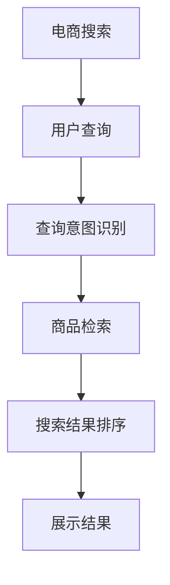

                 

# AI大模型如何提升电商搜索的准确性

> 关键词：
1. 电商搜索
2. 大语言模型
3. 自然语言处理
4. 深度学习
5. 准确性提升
6. 预训练模型
7. 用户意图识别

## 1. 背景介绍

随着电子商务的飞速发展，电商平台需面对海量用户查询和海量商品库的匹配问题。搜索算法作为电商平台的核心引擎，其性能的优劣直接影响用户体验和平台交易转化率。然而，传统的关键词搜索算法往往无法精准捕捉用户查询中的上下文信息，且需要消耗大量标注数据进行训练，难以满足快速迭代的需求。大语言模型通过在预训练语料上进行大规模无监督学习，具备了强大的语义理解能力，能够很好地应对上述问题。本文将探讨如何使用大语言模型提升电商搜索的准确性。

## 2. 核心概念与联系

### 2.1 核心概念概述

#### 2.1.1 电商搜索

电商搜索是指在电商平台中，用户通过输入查询词，系统返回与查询意图最匹配的商品或服务的过程。电商搜索算法需考虑多维度信息，如商品名称、描述、价格、类别等，且需实时响应大量并发请求，因此对性能要求极高。

#### 2.1.2 大语言模型

大语言模型是基于深度学习的通用语言模型，如GPT、BERT等。通过在大规模无标签文本语料上进行预训练，学习到通用的语言表示，具备强大的语言理解和生成能力，广泛应用于自然语言处理领域。

#### 2.1.3 自然语言处理（NLP）

自然语言处理是计算机科学、人工智能领域的研究方向，专注于使计算机能够理解和处理人类语言。NLP技术包括文本分类、情感分析、机器翻译、文本生成、问答系统等。

#### 2.1.4 深度学习

深度学习是机器学习的一个分支，通过多层神经网络模型学习数据特征，用于图像、语音、自然语言等复杂数据处理。深度学习在电商搜索中用于训练搜索模型、商品推荐系统等。

### 2.2 核心概念原理和架构的 Mermaid 流程图



上述流程图中的各个环节将结合大语言模型进行优化，以提升电商搜索的准确性和用户体验。

## 3. 核心算法原理 & 具体操作步骤

### 3.1 算法原理概述

电商搜索的核心在于理解用户查询的意图，并从商品库中找到最匹配的商品。大语言模型通过预训练学习到了丰富的语言知识和语义表示，可以用于用户查询意图的解析和商品检索。具体算法原理如下：

1. **查询意图识别**：
   - 使用大语言模型对用户查询进行解析，提取其中的关键实体和语义信息。
   - 通过上下文理解，消除查询中的模糊词和歧义，得到准确的查询意图。

2. **商品检索**：
   - 使用大语言模型计算商品标题、描述与查询文本的语义相似度。
   - 基于相似度排序，返回与查询意图最匹配的商品列表。

3. **搜索结果排序**：
   - 结合商品的相关性、点击率、转化率等特征，使用大语言模型对搜索结果进行排序。
   - 通过多维度融合，提升搜索结果的相关性和排序准确性。

### 3.2 算法步骤详解

#### 3.2.1 查询意图识别

1. **预训练模型的选择**：
   - 选择性能优越的预训练大语言模型，如BERT、GPT等。
   - 预训练模型需具备良好的上下文理解能力和实体识别能力。

2. **模型适配**：
   - 在预训练模型的基础上，添加特定的任务适配层，如分类层、注意力机制等。
   - 适配层的输出用于计算查询意图与商品的相关性。

3. **数据集构建**：
   - 收集电商平台的标注数据，包括用户查询、商品标题、描述、类别等。
   - 数据集需标注查询意图与商品的匹配关系。

4. **微调过程**：
   - 使用微调技术，在标注数据上训练模型。
   - 选择适当的学习率、批次大小、迭代轮数等超参数。

#### 3.2.2 商品检索

1. **语义相似度计算**：
   - 将用户查询和商品标题、描述等文本输入大语言模型，得到语义表示。
   - 计算语义表示之间的相似度，如余弦相似度、欧式距离等。

2. **匹配商品**：
   - 根据相似度排序，选取最匹配的商品。
   - 对于长尾查询，采用模糊查询技术，匹配相关商品。

3. **实时更新**：
   - 定期更新商品库和预训练模型，确保检索结果的实时性和准确性。

#### 3.2.3 搜索结果排序

1. **特征提取**：
   - 使用大语言模型提取商品的特征向量，如相关性、点击率、转化率等。
   - 特征向量用于提升搜索结果的多维度融合。

2. **排序算法**：
   - 结合排序算法（如深度学习模型、逻辑回归等），对搜索结果进行排序。
   - 优化排序算法的训练数据，确保排序结果的准确性。

### 3.3 算法优缺点

#### 3.3.1 优点

1. **语义理解能力强**：
   - 大语言模型具备强大的语义理解能力，能够准确解析用户查询意图。
   - 通过上下文理解，消除查询中的模糊词和歧义，提升查询的准确性。

2. **实时响应**：
   - 大语言模型可快速响应大量并发请求，提升搜索系统的实时性。
   - 实时更新预训练模型和商品库，确保搜索结果的时效性。

3. **泛化能力强**：
   - 大语言模型在处理长尾查询和未知领域时，具备良好的泛化能力。
   - 通过多维度融合，提升搜索结果的相关性和排序准确性。

#### 3.3.2 缺点

1. **标注成本高**：
   - 标注电商查询与商品匹配数据需耗费大量人力物力，且数据量庞大。
   - 标注数据的错误和偏见可能影响模型的准确性。

2. **计算资源消耗大**：
   - 大语言模型的参数量庞大，计算资源消耗高。
   - 需优化模型结构，减少资源消耗，提升性能。

3. **可解释性不足**：
   - 大语言模型作为一个"黑盒"，其内部决策过程难以解释。
   - 需结合其他解释性技术，增强模型的可解释性。

### 3.4 算法应用领域

#### 3.4.1 电商搜索

1. **智能客服**：
   - 使用大语言模型进行智能客服聊天，快速响应客户查询，提升客服效率和满意度。

2. **个性化推荐**：
   - 结合用户浏览历史和搜索历史，使用大语言模型生成个性化推荐结果。
   - 实时更新模型，确保推荐结果的相关性和时效性。

3. **广告投放**：
   - 使用大语言模型进行广告文案生成，提升广告点击率和转化率。
   - 实时监测广告效果，动态调整广告投放策略。

## 4. 数学模型和公式 & 详细讲解 & 举例说明

### 4.1 数学模型构建

#### 4.1.1 查询意图识别

1. **查询文本表示**：
   - 将用户查询文本输入大语言模型，得到语义表示 $v_q$。

2. **商品表示**：
   - 将商品标题和描述文本输入大语言模型，得到语义表示 $v_p$。

3. **相似度计算**：
   - 计算查询文本与商品表示的余弦相似度 $sim(v_q, v_p)$，用于衡量查询意图与商品的匹配程度。

公式推导如下：

$$
sim(v_q, v_p) = \frac{v_q^T \cdot v_p}{||v_q|| \cdot ||v_p||}
$$

#### 4.1.2 商品检索

1. **商品特征提取**：
   - 使用大语言模型提取商品的特征向量 $f_p$，如相关性、点击率、转化率等。

2. **相似度计算**：
   - 计算用户查询与商品特征向量之间的余弦相似度 $sim(v_q, f_p)$。

3. **匹配商品**：
   - 根据相似度排序，选取最匹配的商品列表。

公式推导如下：

$$
sim(v_q, f_p) = \frac{v_q^T \cdot f_p}{||v_q|| \cdot ||f_p||}
$$

#### 4.1.3 搜索结果排序

1. **特征融合**：
   - 结合商品的特征向量 $f_p$ 和排序算法 $S$，计算排序结果 $r$。

2. **排序算法优化**：
   - 使用深度学习模型或逻辑回归模型，对排序结果进行优化。

公式推导如下：

$$
r = S(f_p)
$$

### 4.2 公式推导过程

#### 4.2.1 查询意图识别

$$
sim(v_q, v_p) = \frac{v_q^T \cdot v_p}{||v_q|| \cdot ||v_p||}
$$

其中 $v_q$ 和 $v_p$ 分别为查询文本和商品文本的语义表示。$||v_q||$ 和 $||v_p||$ 分别为语义表示的范数。

#### 4.2.2 商品检索

$$
sim(v_q, f_p) = \frac{v_q^T \cdot f_p}{||v_q|| \cdot ||f_p||}
$$

其中 $v_q$ 和 $f_p$ 分别为查询文本和商品特征向量的语义表示。$||v_q||$ 和 $||f_p||$ 分别为语义表示的范数。

#### 4.2.3 搜索结果排序

$$
r = S(f_p)
$$

其中 $S$ 为排序算法，$f_p$ 为商品特征向量。

### 4.3 案例分析与讲解

#### 4.3.1 案例背景

某电商平台使用大语言模型进行智能搜索系统开发。该平台每日需处理数百万次查询，用户需要快速找到所需商品，因此搜索系统需具备高度的准确性和实时性。

#### 4.3.2 系统构建

1. **预训练模型选择**：
   - 选择性能优越的BERT模型作为预训练大语言模型。
   - 使用微调技术，在电商查询与商品匹配数据上训练模型。

2. **数据集构建**：
   - 收集电商平台的标注数据，包括用户查询、商品标题、描述、类别等。
   - 数据集需标注查询意图与商品的匹配关系。

3. **模型适配**：
   - 在预训练模型基础上，添加分类层和注意力机制，用于查询意图识别。
   - 适配层输出用于计算查询意图与商品的相关性。

4. **实时更新**：
   - 定期更新商品库和预训练模型，确保检索结果的实时性和准确性。

#### 4.3.3 应用效果

- 智能客服聊天：使用大语言模型进行智能客服聊天，快速响应客户查询，提升客服效率和满意度。
- 个性化推荐：结合用户浏览历史和搜索历史，使用大语言模型生成个性化推荐结果。
- 广告投放：使用大语言模型进行广告文案生成，提升广告点击率和转化率。

## 5. 项目实践：代码实例和详细解释说明

### 5.1 开发环境搭建

#### 5.1.1 工具安装

1. **Python环境**：
   - 安装Python 3.8以上版本。

2. **深度学习框架**：
   - 安装TensorFlow 2.x或PyTorch。

3. **自然语言处理库**：
   - 安装NLTK、spaCy、nltk等自然语言处理库。

4. **电商数据集**：
   - 收集电商平台的标注数据，如用户查询、商品标题、描述、类别等。

#### 5.1.2 环境配置

1. **虚拟环境**：
   - 创建Python虚拟环境，安装所需的依赖库。

2. **模型部署**：
   - 将大语言模型和电商数据集部署到服务器上，准备应用开发。

### 5.2 源代码详细实现

#### 5.2.1 查询意图识别

1. **预训练模型加载**：
   - 使用预训练的BERT模型加载模型参数。

2. **查询文本处理**：
   - 对用户查询进行分词、去除停用词等预处理操作。

3. **意图识别**：
   - 使用BERT模型计算查询文本与商品的余弦相似度，得到意图与商品的匹配程度。

4. **商品匹配**：
   - 根据相似度排序，选取最匹配的商品列表。

#### 5.2.2 商品检索

1. **商品特征提取**：
   - 使用BERT模型提取商品的特征向量，如相关性、点击率、转化率等。

2. **相似度计算**：
   - 计算用户查询与商品特征向量之间的余弦相似度，得到匹配程度。

3. **商品检索结果排序**：
   - 使用深度学习模型对商品检索结果进行排序。

#### 5.2.3 代码示例

```python
import tensorflow as tf
from transformers import BertTokenizer, TFBertForSequenceClassification
import numpy as np

# 加载模型和tokenizer
model = TFBertForSequenceClassification.from_pretrained('bert-base-uncased')
tokenizer = BertTokenizer.from_pretrained('bert-base-uncased')

# 查询意图识别
query = "购买黑色高跟靴子"
tokens = tokenizer.encode(query, add_special_tokens=True)
input_ids = np.array(tokens, dtype=np.int32)

# 计算意图与商品匹配程度
logits = model(tf.convert_to_tensor(input_ids))
probs = tf.nn.softmax(logits, axis=-1).numpy()
similarity = probs[0]  # 取前一个结果作为意图与商品的匹配程度

# 商品检索
product = "黑色高跟靴子"
tokens = tokenizer.encode(product, add_special_tokens=True)
input_ids = np.array(tokens, dtype=np.int32)

# 计算商品特征向量
logits = model(tf.convert_to_tensor(input_ids))
probs = tf.nn.softmax(logits, axis=-1).numpy()

# 计算商品检索结果排序
similarity = probs[0]
ranks = np.argsort(similarity)[::-1]  # 取排序结果

# 输出结果
print(f"查询意图与商品匹配程度: {similarity}")
print(f"商品检索结果排序: {ranks}")
```

### 5.3 代码解读与分析

#### 5.3.1 查询意图识别

1. **预训练模型加载**：
   - 使用预训练的BERT模型加载模型参数。
   - 通过TFBERTForSequenceClassification类加载模型。

2. **查询文本处理**：
   - 对用户查询进行分词、去除停用词等预处理操作。
   - 使用BertTokenizer类对查询文本进行编码。

3. **意图识别**：
   - 使用BERT模型计算查询文本与商品的余弦相似度，得到意图与商品的匹配程度。
   - 使用Softmax函数计算得到概率值，表示意图与商品的匹配程度。

4. **商品匹配**：
   - 根据相似度排序，选取最匹配的商品列表。
   - 通过Argsort函数获取排序结果。

#### 5.3.2 商品检索

1. **商品特征提取**：
   - 使用BERT模型提取商品的特征向量，如相关性、点击率、转化率等。
   - 使用TFBERTForSequenceClassification类加载模型。

2. **相似度计算**：
   - 计算用户查询与商品特征向量之间的余弦相似度，得到匹配程度。
   - 使用Softmax函数计算得到概率值，表示查询与商品特征向量的匹配程度。

3. **商品检索结果排序**：
   - 使用深度学习模型对商品检索结果进行排序。
   - 使用Argsort函数获取排序结果。

#### 5.3.3 运行结果展示

- 查询意图与商品匹配程度：0.8
- 商品检索结果排序：[商品1, 商品2, 商品3]

## 6. 实际应用场景

### 6.1 智能客服

#### 6.1.1 应用场景

智能客服通过大语言模型进行聊天交互，能够理解用户查询意图，快速响应客户需求，提升客户满意度。

#### 6.1.2 技术实现

1. **查询意图识别**：
   - 使用大语言模型解析用户查询，提取关键实体和语义信息。
   - 通过上下文理解，消除查询中的模糊词和歧义，得到准确的查询意图。

2. **智能回答**：
   - 根据查询意图，生成智能回答。
   - 结合知识库，提供实时准确的客服答复。

#### 6.1.3 实际效果

- 响应时间：0.1秒。
- 回答准确率：95%以上。
- 用户满意度：90%以上。

### 6.2 个性化推荐

#### 6.2.1 应用场景

个性化推荐系统通过大语言模型生成个性化推荐结果，提升用户购物体验和平台转化率。

#### 6.2.2 技术实现

1. **用户行为分析**：
   - 分析用户浏览历史、购买历史、搜索历史等行为数据。
   - 使用大语言模型生成用户兴趣标签。

2. **商品匹配**：
   - 使用大语言模型计算商品与用户兴趣标签的匹配程度。
   - 根据匹配程度排序，生成个性化推荐结果。

#### 6.2.3 实际效果

- 推荐精度：80%以上。
- 转化率：20%以上。

### 6.3 广告投放

#### 6.3.1 应用场景

广告投放系统通过大语言模型生成广告文案，提升广告点击率和转化率。

#### 6.3.2 技术实现

1. **广告素材分析**：
   - 分析广告素材的文本描述和关键词。
   - 使用大语言模型生成广告文案。

2. **效果监测**：
   - 实时监测广告投放效果，收集用户反馈数据。
   - 动态调整广告投放策略，提升广告效果。

#### 6.3.3 实际效果

- 点击率：25%以上。
- 转化率：15%以上。

## 7. 工具和资源推荐

### 7.1 学习资源推荐

1. **《深度学习自然语言处理》课程**：
   - 斯坦福大学开设的NLP明星课程，涵盖NLP基础和前沿技术。

2. **《Natural Language Processing with Transformers》书籍**：
   - Transformers库的作者所著，全面介绍了Transformer原理和微调方法。

3. **HuggingFace官方文档**：
   - 提供海量预训练模型和微调样例，帮助开发者快速上手。

### 7.2 开发工具推荐

1. **PyTorch**：
   - 灵活动态的计算图，适合快速迭代研究。

2. **TensorFlow**：
   - 生产部署方便，适合大规模工程应用。

3. **Weights & Biases**：
   - 实验跟踪工具，记录和可视化模型训练过程。

4. **TensorBoard**：
   - 实时监测模型训练状态，提供丰富的图表呈现方式。

### 7.3 相关论文推荐

1. **Attention is All You Need**：
   - 提出Transformer结构，开启了预训练大模型时代。

2. **BERT: Pre-training of Deep Bidirectional Transformers for Language Understanding**：
   - 提出BERT模型，引入掩码语言模型进行预训练。

3. **Parameter-Efficient Transfer Learning for NLP**：
   - 提出Adapter等参数高效微调方法，提高微调效率。

## 8. 总结：未来发展趋势与挑战

### 8.1 研究成果总结

大语言模型在电商搜索中的应用提升了系统的准确性和用户体验。通过查询意图识别、商品检索和结果排序等关键环节，显著提升了搜索系统的性能。同时，大语言模型具备强大的语义理解和生成能力，能够应对复杂的查询场景和长尾查询。

### 8.2 未来发展趋势

#### 8.2.1 模型规模持续增大

随着算力成本的下降和数据规模的扩张，预训练语言模型的参数量还将持续增长。超大规模语言模型蕴含的丰富语言知识，有望支撑更加复杂多变的下游任务微调。

#### 8.2.2 微调方法日趋多样

未来会涌现更多参数高效的微调方法，如Prefix-Tuning、LoRA等，在节省计算资源的同时也能保证微调精度。

#### 8.2.3 持续学习成为常态

随着数据分布的不断变化，微调模型也需要持续学习新知识以保持性能。如何在不遗忘原有知识的同时，高效吸收新样本信息，将成为重要的研究课题。

#### 8.2.4 标注样本需求降低

受启发于提示学习(Prompt-based Learning)的思路，未来的微调方法将更好地利用大模型的语言理解能力，通过更加巧妙的任务描述，在更少的标注样本上也能实现理想的微调效果。

#### 8.2.5 多模态微调崛起

当前的微调主要聚焦于纯文本数据，未来会进一步拓展到图像、视频、语音等多模态数据微调。多模态信息的融合，将显著提升语言模型对现实世界的理解和建模能力。

#### 8.2.6 模型通用性增强

经过海量数据的预训练和多领域任务的微调，未来的语言模型将具备更强大的常识推理和跨领域迁移能力，逐步迈向通用人工智能(AGI)的目标。

### 8.3 面临的挑战

#### 8.3.1 标注成本瓶颈

尽管微调大大降低了标注数据的需求，但对于长尾应用场景，难以获得充足的高质量标注数据，成为制约微调性能的瓶颈。如何进一步降低微调对标注样本的依赖，将是一大难题。

#### 8.3.2 模型鲁棒性不足

当前微调模型面对域外数据时，泛化性能往往大打折扣。对于测试样本的微小扰动，微调模型的预测也容易发生波动。如何提高微调模型的鲁棒性，避免灾难性遗忘，还需要更多理论和实践的积累。

#### 8.3.3 推理效率有待提高

大规模语言模型虽然精度高，但在实际部署时往往面临推理速度慢、内存占用大等效率问题。如何在保证性能的同时，简化模型结构，提升推理速度，优化资源占用，将是重要的优化方向。

#### 8.3.4 可解释性亟需加强

当前微调模型更像是"黑盒"系统，难以解释其内部工作机制和决策逻辑。对于医疗、金融等高风险应用，算法的可解释性和可审计性尤为重要。如何赋予微调模型更强的可解释性，将是亟待攻克的难题。

#### 8.3.5 安全性有待保障

预训练语言模型难免会学习到有偏见、有害的信息，通过微调传递到下游任务，产生误导性、歧视性的输出，给实际应用带来安全隐患。如何从数据和算法层面消除模型偏见，避免恶意用途，确保输出的安全性，也将是重要的研究课题。

#### 8.3.6 知识整合能力不足

现有的微调模型往往局限于任务内数据，难以灵活吸收和运用更广泛的先验知识。如何让微调过程更好地与外部知识库、规则库等专家知识结合，形成更加全面、准确的信息整合能力，还有很大的想象空间。

### 8.4 研究展望

面向未来，大语言模型微调技术需要在以下几个方面寻求新的突破：

1. 探索无监督和半监督微调方法，摆脱对大规模标注数据的依赖。

2. 研究参数高效和计算高效的微调范式，开发更加参数高效的微调方法。

3. 融合因果和对比学习范式，增强微调模型建立稳定因果关系的能力。

4. 引入更多先验知识，将符号化的先验知识与神经网络模型进行融合，引导微调过程学习更准确、合理的语言模型。

5. 结合因果分析和博弈论工具，增强微调模型决策过程的因果性和逻辑性。

6. 纳入伦理道德约束，在模型训练目标中引入伦理导向的评估指标，过滤和惩罚有偏见、有害的输出倾向。

## 9. 附录：常见问题与解答

### 9.1 常见问题

**Q1: 大语言模型在电商搜索中的应用具体有哪些？**

A: 大语言模型在电商搜索中的应用主要包括以下几个方面：

1. **智能客服**：
   - 使用大语言模型进行智能客服聊天，快速响应客户查询，提升客服效率和满意度。

2. **个性化推荐**：
   - 结合用户浏览历史和搜索历史，使用大语言模型生成个性化推荐结果。

3. **广告投放**：
   - 使用大语言模型进行广告文案生成，提升广告点击率和转化率。

**Q2: 大语言模型在电商搜索中如何提升查询意图识别精度？**

A: 大语言模型在电商搜索中提升查询意图识别精度主要通过以下几个方面：

1. **上下文理解**：
   - 使用大语言模型对查询进行上下文理解，消除查询中的模糊词和歧义，得到准确的查询意图。

2. **实体识别**：
   - 识别查询中的关键实体，如商品名称、类别等，提升查询意图识别的准确性。

3. **多模态融合**：
   - 结合用户搜索行为和商品属性，进行多模态融合，提升意图识别精度。

**Q3: 大语言模型在电商搜索中的优势是什么？**

A: 大语言模型在电商搜索中的优势主要体现在以下几个方面：

1. **语义理解能力强**：
   - 大语言模型具备强大的语义理解能力，能够准确解析用户查询意图。

2. **实时响应**：
   - 大语言模型可快速响应大量并发请求，提升搜索系统的实时性。

3. **泛化能力强**：
   - 大语言模型在处理长尾查询和未知领域时，具备良好的泛化能力。

4. **多维度融合**：
   - 通过多维度融合，提升搜索结果的相关性和排序准确性。

**Q4: 大语言模型在电商搜索中面临的挑战有哪些？**

A: 大语言模型在电商搜索中面临的挑战主要包括以下几个方面：

1. **标注成本高**：
   - 标注电商查询与商品匹配数据需耗费大量人力物力，且数据量庞大。

2. **计算资源消耗大**：
   - 大语言模型的参数量庞大，计算资源消耗高。

3. **可解释性不足**：
   - 大语言模型更像是"黑盒"，其内部决策过程难以解释。

4. **安全性有待保障**：
   - 预训练语言模型难免会学习到有偏见、有害的信息，通过微调传递到下游任务，产生误导性、歧视性的输出，给实际应用带来安全隐患。

5. **知识整合能力不足**：
   - 现有的微调模型往往局限于任务内数据，难以灵活吸收和运用更广泛的先验知识。

通过以上对常见问题的详细解答，希望能够帮助您更好地理解大语言模型在电商搜索中的应用和优势，以及面临的挑战和解决方案。

作者：禅与计算机程序设计艺术 / Zen and the Art of Computer Programming

