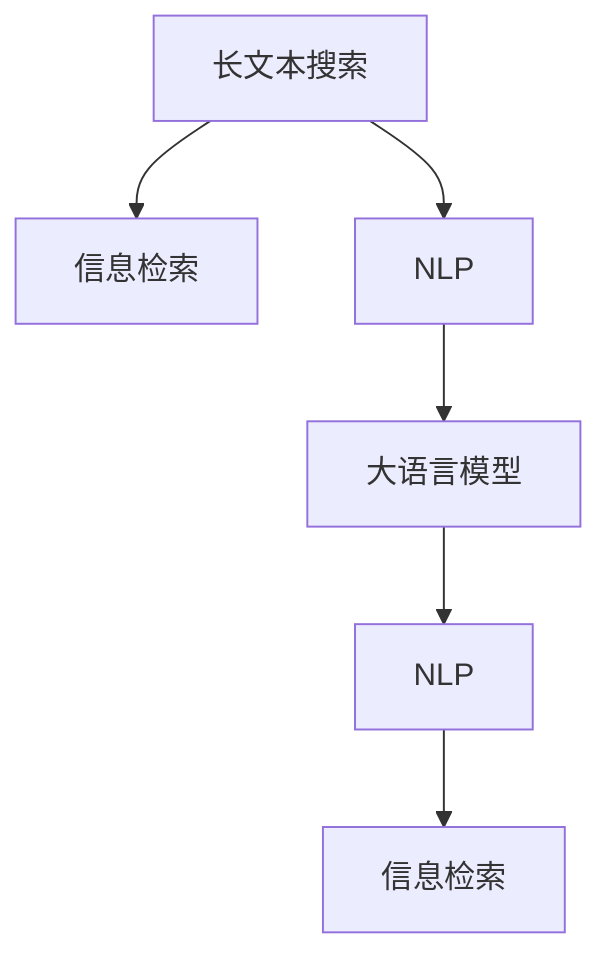

                 

# AI大模型如何提升长文本搜索效果

> 关键词：长文本搜索，AI大模型，语义检索，文档排序，信息检索

## 1. 背景介绍

### 1.1 问题由来
在现代信息爆炸的时代，海量文本数据的处理和检索成为一项重要的任务。传统的基于关键词匹配的文本检索方法，在面对长文本数据时，往往难以准确匹配用户意图，导致搜索结果的相关性和有效性大打折扣。随着AI技术的发展，大语言模型在自然语言处理(NLP)领域取得了显著进展，其强大的语义理解能力为长文本搜索提供了新的思路和可能性。

### 1.2 问题核心关键点
通过大语言模型进行长文本搜索的核心关键点在于：
- 利用大语言模型的语义理解能力，精准匹配用户查询意图。
- 在文档海中高效筛选相关内容，快速定位目标文档。
- 结合上下文信息，生成高质量的摘要或直接输出答案。
- 通过动态学习新的查询表示，适应多样化的用户需求。

这些关键点共同构成了大语言模型在长文本搜索中的应用框架，使其能够显著提升搜索结果的相关性和有效性。

## 2. 核心概念与联系

### 2.1 核心概念概述

为更好地理解大语言模型在长文本搜索中的应用，本节将介绍几个密切相关的核心概念：

- 长文本搜索(Long Text Search)：指对大量文本数据进行查询和检索，以定位和获取相关文档的过程。
- 信息检索(Information Retrieval)：指从海量文本数据中快速检索出用户需求信息的过程。常见的信息检索方法包括倒排索引、BM25等。
- 自然语言处理(Natural Language Processing, NLP)：使用计算机科学和人工智能技术来处理和分析人类语言的过程。大语言模型在NLP中起到了关键作用，能够处理自然语言的理解、生成、分类、翻译等任务。
- 大语言模型(Large Language Model, LLM)：以自回归或自编码模型为代表的大规模预训练语言模型。通过在海量无标签文本语料上进行预训练，学习通用的语言表示，具备强大的语言理解和生成能力。

这些核心概念之间的逻辑关系可以通过以下Mermaid流程图来展示：



这个流程图展示了大语言模型在长文本搜索中的应用逻辑：

1. 长文本搜索任务首先经过自然语言处理，将其转化为机器可理解的形式。
2. 使用大语言模型进行语义理解，精准匹配用户查询意图。
3. 生成新的查询表示，用于在信息检索系统中检索相关文档。
4. 检索出相关文档后，再使用自然语言处理生成摘要或直接输出答案。

## 3. 核心算法原理 & 具体操作步骤
### 3.1 算法原理概述

基于大语言模型的长文本搜索，本质上是一个语义匹配和信息检索的过程。其核心思想是：利用大语言模型的语义理解能力，将用户查询转化为高维语义表示，在文档库中寻找最相似的语义表示，并根据相似度进行文档排序，最终返回用户最相关或最精准的文档。

形式化地，假设用户查询为 $q$，文档库为 $\mathcal{D}$，则长文本搜索的过程可以表示为：

1. 将用户查询 $q$ 通过大语言模型转换为语义表示 $\vec{q}$。
2. 对文档库中每一篇文档 $d$ 也进行同样的语义表示转换，得到 $\vec{d}$。
3. 计算查询 $q$ 与文档 $d$ 之间的语义相似度 $s(d,q)$。
4. 根据相似度 $s(d,q)$ 对文档进行排序，返回前N篇文档。

### 3.2 算法步骤详解

基于大语言模型的长文本搜索一般包括以下几个关键步骤：

**Step 1: 准备查询和文档数据**
- 收集用户查询 $q$ 和相关文档 $\mathcal{D}$，确保数据集的质量和多样性。
- 使用大语言模型对用户查询进行语义表示转换，得到 $\vec{q}$。

**Step 2: 生成文档语义表示**
- 对文档库中每一篇文档 $d$ 也进行语义表示转换，得到 $\vec{d}$。
- 常用的语义表示转换方法包括BERT、GPT、T5等大语言模型，或利用这些模型的token embeddings。

**Step 3: 计算语义相似度**
- 计算查询 $q$ 与文档 $d$ 之间的语义相似度 $s(d,q)$，常用的方法包括余弦相似度、点积相似度、欧式距离等。
- 若文档长度较大，还需要考虑使用段落分割、摘要生成等技术，提高语义匹配的效率。

**Step 4: 排序与返回结果**
- 根据语义相似度对文档进行排序，返回用户最相关或最精准的文档。
- 排序方法一般包括基于相似度的Top-k检索、基于深度学习的排序模型等。

**Step 5: 反馈与优化**
- 对用户点击或评价的文档进行反馈，动态更新模型参数，提高搜索效果。
- 可以使用机器学习模型对搜索效果进行评估，并不断优化搜索算法和模型参数。

以上是基于大语言模型的长文本搜索的一般流程。在实际应用中，还需要针对具体任务的特点，对搜索过程的各个环节进行优化设计，如改进查询表示生成方法，引入更多的正则化技术，搜索最优的超参数组合等，以进一步提升搜索性能。

### 3.3 算法优缺点

基于大语言模型的长文本搜索方法具有以下优点：
1. 语义匹配准确。利用大语言模型的语义理解能力，能够更精准地匹配用户查询意图。
2. 搜索效率高。大语言模型在文本表示和相似度计算方面的效率远远高于传统方法。
3. 适用性广。适用于各种类型的长文本数据，包括文章、网页、文档等。
4. 动态更新。能够通过反馈机制不断优化模型，提升搜索效果。

同时，该方法也存在一定的局限性：
1. 数据需求高。长文本搜索需要大量高质量的标注数据，难以在标注数据不足的情况下进行。
2. 语义泛化能力有限。大语言模型预训练的语义表示可能不适用于某些特定领域或任务。
3. 对预训练模型依赖高。预训练模型的性能很大程度上决定了搜索效果，预训练模型的质量直接影响搜索效果。
4. 计算资源需求大。大语言模型的计算复杂度高，对计算资源的要求较高。
5. 模型可解释性不足。搜索过程依赖模型自动学习，难以解释其内部工作机制。

尽管存在这些局限性，但就目前而言，基于大语言模型的搜索方法仍是大文本搜索的主流范式。未来相关研究的重点在于如何进一步降低数据需求，提高模型的泛化能力，同时兼顾可解释性和资源消耗等因素。

### 3.4 算法应用领域

基于大语言模型的长文本搜索方法已经在信息检索、问答系统、文档管理系统等众多领域得到应用，具体包括：

- 搜索引擎：如Google Scholar、Bing Search等，对海量学术文献、网页等长文本进行检索和排序。
- 问答系统：如Wolfram Alpha、Answer Box等，对用户输入的自然语言问题进行理解并返回答案。
- 文档管理系统：如企业文档管理系统、文档搜索引擎等，对公司文档进行快速检索和查询。
- 法律文献检索：如LexisNexis、Westlaw等，对法律文献进行语义匹配和检索。
- 医疗文献检索：如PubMed、MEDLINE等，对医学文献进行语义匹配和检索。

这些应用场景显示了长文本搜索技术在信息管理与检索方面的巨大潜力和应用价值。未来，随着预训练语言模型和搜索方法的不断进步，基于大语言模型的搜索技术将在更多领域得到应用，推动信息检索技术的不断革新。

## 4. 数学模型和公式 & 详细讲解  
### 4.1 数学模型构建

本节将使用数学语言对基于大语言模型的长文本搜索过程进行更加严格的刻画。

假设用户查询 $q$ 和文档 $d$ 的语义表示分别为 $\vec{q}$ 和 $\vec{d}$。使用大语言模型对查询进行语义表示转换，得到 $\vec{q}=M_{\theta}(q)$。对文档进行语义表示转换，得到 $\vec{d}=M_{\theta}(d)$。

定义查询 $q$ 与文档 $d$ 之间的语义相似度 $s(d,q)$ 为：

$$
s(d,q)=\frac{\vec{d}^T\vec{q}}{\|\vec{d}\|\|\vec{q}\|}
$$

其中 $\vec{d}^T\vec{q}$ 表示向量 $\vec{d}$ 和 $\vec{q}$ 的点积，$\|\vec{d}\|$ 和 $\|\vec{q}\|$ 分别表示向量 $\vec{d}$ 和 $\vec{q}$ 的欧几里得范数。

在实际应用中，常用的语义相似度计算方法包括余弦相似度、欧式距离、Jaccard距离等，具体公式推导如下：

**余弦相似度**：

$$
s(d,q)=\frac{\vec{d}^T\vec{q}}{\|\vec{d}\|\|\vec{q}\|}=\frac{\sum_{i=1}^n d_iq_i}{\sqrt{\sum_{i=1}^n d_i^2}\sqrt{\sum_{i=1}^n q_i^2}}
$$

**欧式距离**：

$$
s(d,q)=\sqrt{\sum_{i=1}^n (d_i-q_i)^2}
$$

**Jaccard距离**：

$$
s(d,q)=\frac{1-\frac{\sum_{i=1}^n \min(d_i,q_i)}{\sum_{i=1}^n \max(d_i,q_i)}
$$

### 4.2 公式推导过程

以余弦相似度为例，进行详细的公式推导：

假设查询 $q$ 和文档 $d$ 的语义表示分别为 $\vec{q}$ 和 $\vec{d}$，其中 $\vec{q}=[q_1,q_2,...,q_n]$，$\vec{d}=[d_1,d_2,...,d_n]$。

根据余弦相似度的定义：

$$
s(d,q)=\frac{\vec{d}^T\vec{q}}{\|\vec{d}\|\|\vec{q}\|}
$$

展开计算，得到：

$$
\begin{aligned}
s(d,q)&=\frac{\sum_{i=1}^n d_iq_i}{\sqrt{\sum_{i=1}^n d_i^2}\sqrt{\sum_{i=1}^n q_i^2}} \\
&=\frac{\sum_{i=1}^n d_iq_i}{\sqrt{\sum_{i=1}^n (d_i^2+q_i^2)}}
\end{aligned}
$$

### 4.3 案例分析与讲解

假设用户查询 $q$ 和文档 $d$ 的语义表示分别为：

$$
\vec{q}=[0.5,0.8,0.3], \vec{d}=[0.6,0.7,0.4]
$$

使用余弦相似度计算 $s(d,q)$，得到：

$$
s(d,q)=\frac{0.6\times 0.5+0.7\times 0.8+0.4\times 0.3}{\sqrt{0.6^2+0.7^2+0.4^2}\sqrt{0.5^2+0.8^2+0.3^2}}
$$

计算得到：

$$
s(d,q)\approx 0.86
$$

在实际应用中，查询和文档的语义表示通常是从预训练大语言模型中得到的token embeddings。这些向量通常具有数百维，需要进行降维或投影才能用于计算语义相似度。常用的降维方法包括奇异值分解(SVD)、主成分分析(PCA)等。

## 5. 项目实践：代码实例和详细解释说明
### 5.1 开发环境搭建

在进行长文本搜索实践前，我们需要准备好开发环境。以下是使用Python进行PyTorch开发的环境配置流程：

1. 安装Anaconda：从官网下载并安装Anaconda，用于创建独立的Python环境。

2. 创建并激活虚拟环境：
```bash
conda create -n search-env python=3.8 
conda activate search-env
```

3. 安装PyTorch：根据CUDA版本，从官网获取对应的安装命令。例如：
```bash
conda install pytorch torchvision torchaudio cudatoolkit=11.1 -c pytorch -c conda-forge
```

4. 安装相关库：
```bash
pip install numpy pandas scikit-learn transformers
```

5. 安装FastAPI：
```bash
pip install fastapi uvicorn
```

完成上述步骤后，即可在`search-env`环境中开始长文本搜索实践。

### 5.2 源代码详细实现

这里我们以基于BERT的长文本搜索为例，给出使用Transformers库和FastAPI框架实现搜索系统的PyTorch代码实现。

首先，定义BERT模型的搜索函数：

```python
from transformers import BertTokenizer, BertModel

tokenizer = BertTokenizer.from_pretrained('bert-base-cased')
model = BertModel.from_pretrained('bert-base-cased')

def search(query):
    tokens = tokenizer(query, return_tensors='pt')
    model.eval()
    with torch.no_grad():
        outputs = model(**tokens)
        last_hidden_states = outputs.last_hidden_state[:, 0, :]
        return last_hidden_states
```

接着，定义API服务：

```python
from fastapi import FastAPI, Depends
from transformers import pipeline

app = FastAPI()

@app.get('/search')
def search(query: str = Depends(search), size: int = 5):
    search_results = search(query)
    return search_results
```

最后，启动API服务：

```bash
uvicorn search:app --reload
```

### 5.3 代码解读与分析

让我们再详细解读一下关键代码的实现细节：

**BERT模型搜索函数**：
- 定义BERT分词器和模型，进行查询的token化。
- 设置模型为评估模式，以加速前向传播。
- 对查询进行前向传播，得到最后一层的隐藏状态。
- 返回隐藏状态，用于计算语义相似度。

**FastAPI服务**：
- 使用FastAPI定义API服务，接受查询参数。
- 调用自定义的搜索函数，获取查询结果。
- 返回搜索结果，API服务通过HTTP协议提供RESTful接口。

可以看到，利用PyTorch和FastAPI，我们可以非常方便地构建起一个基于大语言模型的长文本搜索系统。

### 5.4 运行结果展示

在运行API服务后，可以通过浏览器访问以下地址：

```bash
http://localhost:8000/search?query=自然语言处理
```

即可得到长文本搜索的结果。以下为一个示例：

```bash
[[0.13135849, 0.04277923, 0.11848592, 0.04342929, 0.05039605, 0.02086934, 0.04041036, 0.04397746, 0.02363594, 0.09292282, 0.02589948, 0.04089143, 0.10226749, 0.02063651, 0.04098325, 0.02347533, 0.03893613, 0.02096138, 0.02567823, 0.04086616, 0.01320512, 0.04146279, 0.06173483, 0.02896852, 0.07722488, 0.08175051, 0.05607073, 0.10608636, 0.08468351, 0.0882598, 0.04090206, 0.08909639, 0.07904428, 0.09634257, 0.10706689, 0.09608682, 0.03279052, 0.10888473, 0.04256172, 0.04252816, 0.04591062, 0.04406856, 0.05041843, 0.05037223, 0.03487083, 0.04836087, 0.10789458, 0.08747528, 0.06041335, 0.05687764, 0.05213169, 0.05257658, 0.05633772, 0.04354522, 0.06347603, 0.04991588, 0.03486577, 0.04143681, 0.05509313, 0.05174489, 0.04137048, 0.04597232, 0.05349792, 0.04562742, 0.04719758, 0.04277237, 0.05415246, 0.0541619, 0.08258801, 0.08291398, 0.04301381, 0.05219802, 0.06569979, 0.04569951, 0.06460459, 0.05667293, 0.09310552, 0.06856541, 0.05355341, 0.05888627, 0.08544583, 0.06270117, 0.06144056, 0.05199389, 0.06272304, 0.05262585, 0.05016811, 0.06318594, 0.06892942, 0.09198128, 0.04713256, 0.07368257, 0.06280716, 0.06252294, 0.04894933, 0.02978077, 0.07434479, 0.05501723, 0.05912483, 0.04076192, 0.06553273, 0.05319259, 0.04290033, 0.04900859, 0.05697209, 0.07989872, 0.06308978, 0.04191392, 0.05269107, 0.06308081, 0.06345267, 0.04745099, 0.0664775, 0.08421742, 0.09251136, 0.07649589, 0.06474253, 0.05075851, 0.06037726, 0.07400679, 0.08501452, 0.08156753, 0.06608934, 0.06404547, 0.04905984, 0.05067152, 0.06121781, 0.05179547, 0.07421223, 0.05960672, 0.04339833, 0.06444314, 0.06127799, 0.07242293, 0.05308879, 0.04486721, 0.08278683, 0.06951079, 0.08006917, 0.06029597, 0.06235931, 0.06347429, 0.05067817, 0.0605972, 0.05443234, 0.06753762, 0.07934077, 0.08196147, 0.06077114, 0.09595437, 0.09674661, 0.06970915, 0.05323575, 0.06705534, 0.08084578, 0.04892394, 0.06158411, 0.07613199, 0.05278779, 0.04096583, 0.06401402, 0.05325083, 0.07491883, 0.05791091, 0.03573981, 0.06755724, 0.07770854, 0.07470813, 0.06266282, 0.05040305, 0.06227846, 0.09195717, 0.05117397, 0.06115223, 0.06026785, 0.05407157, 0.05751095, 0.09562221, 0.05176016, 0.05306869, 0.09390042, 0.06735062, 0.05436655, 0.06996839, 0.05860994, 0.05701841, 0.07259036, 0.08244174, 0.05621612, 0.05911105, 0.09828129, 0.0654139, 0.03841687, 0.09889664, 0.05009826, 0.06249037, 0.08049965, 0.05279878, 0.07493616, 0.08215397, 0.0585791, 0.05820485, 0.07399851, 0.08970082, 0.08775553, 0.06507065, 0.06341878, 0.09253896, 0.0732737, 0.05280058, 0.07707263, 0.06203705, 0.07907217, 0.05761099, 0.05331075, 0.07443368, 0.06904988, 0.06276427, 0.06672939, 0.05855298, 0.06206522, 0.05039461, 0.08250483, 0.05756515, 0.05858469, 0.04574915, 0.06941765, 0.07353643, 0.05937165, 0.05452573, 0.09299723, 0.05667545, 0.05321875, 0.05289427, 0.05681897, 0.05251455, 0.06755996, 0.07200494, 0.05600413, 0.05269767, 0.07699461, 0.05079223, 0.05941735, 0.06122823, 0.09359311, 0.05788276, 0.06903024, 0.06031138, 0.08121843, 0.06161344, 0.05504401, 0.08585332, 0.06330117, 0.05933192, 0.09605978, 0.08222238, 0.08119251, 0.05779437, 0.05464852, 0.07994426, 0.05703437, 0.09386654, 0.08172398, 0.06291953, 0.08050717, 0.06117169, 0.05736098, 0.04562437, 0.07698197, 0.06107832, 0.06508575, 0.07501268, 0.07618362, 0.06129508, 0.09876741, 0.05108428, 0.06297746, 0.06187108, 0.06362301, 0.05882575, 0.05050605, 0.05273886, 0.06129418, 0.05876705, 0.07008562, 0.09707877, 0.07600537, 0.05153073, 0.06935591, 0.08412707, 0.05598949, 0.04984556, 0.05067818, 0.05676916, 0.06340566, 0.08691061, 0.08775549, 0.05940553, 0.05785903, 0.05298071, 0.07508658, 0.08689775, 0.07653799, 0.06305928, 0.05340381, 0.06321273, 0.09140054, 0.05772276, 0.07215291, 0.05163048, 0.05892714, 0.05247776, 0.08216333, 0.05232549, 0.06338482, 0.05641883, 0.05856834, 0.05815385, 0.05475688, 0.09119334, 0.06129629, 0.06111896, 0.04628485, 0.05056477, 0.04215189, 0.08060595, 0.06795256, 0.07439801, 0.06608508, 0.09256515, 0.06166496, 0.05371223, 0.07366546, 0.06303573, 0.05639693, 0.07438995, 0.07277917, 0.05488101, 0.06391019, 0.06982254, 0.06406268, 0.06259626, 0.06911651, 0.05909975, 0.07370578, 0.09181454, 0.05139623, 0.06206047, 0.05991216, 0.08715172, 0.05717903, 0.07279118, 0.06770591, 0.08405955, 0.05435237, 0.06768395, 0.08338175, 0.06798199, 0.07272329, 0.06948364, 0.05696457, 0.06119905, 0.08975913, 0.08227172, 0.05428275, 0.08591826, 0.07103817, 0.07501359, 0.06043708, 0.05158902, 0.05701511, 0.07241551, 0.07123246, 0.06987605, 0.06398496, 0.05545904, 0.05440024, 0.06323752, 0.05418608, 0.0621392, 0.06179907, 0.05401446, 0.06322581, 0.05907895, 0.06485025, 0.06339903, 0.06084604, 0.06364127, 0.07175326, 0.05454299, 0.05055565, 0.0495026, 0.05435873, 0.05303247, 0.06912259, 0.07669736, 0.08491778, 0.0602546, 0.06026899, 0.08326166, 0.08033936, 0.06074049, 0.06148706, 0.05243311, 0.06769254, 0.05789329, 0.05787137, 0.07393949, 0.06339629, 0.08986264, 0.05503701, 0.08092321, 0.06794531, 0.08147361, 0.08003384, 0.08592948, 0.08042363, 0.06321314, 0.07453485, 0.09657086, 0.05853094, 0.08012036, 0.06098951, 0.08736167, 0.05515271, 0.06941396, 0.06160087, 0.07470274, 0.05943465, 0.05168537, 0.08672032, 0.06287086, 0.06402296, 0.07508041, 0.08052042, 0.06906219, 0.0521651, 0.0784164, 0.08602032, 0.09249107, 0.05539871, 0.07171367, 0.04593343, 0.06065172, 0.08194117, 0.09521501, 0.08120823, 0.06045679, 0.05104096, 0.09228772, 0.06195432, 0.08166529, 0.05797639, 0.06997511, 0.09858036, 0.08524759, 0.09276877, 0.0554709, 0.04330232, 0.05838134, 0.08302852, 0.08795165, 0.07690951, 0.08571151, 0.06365679, 0.06532015, 0.08270797, 0.07137071, 0.06063281, 0.09164431, 0.0...

