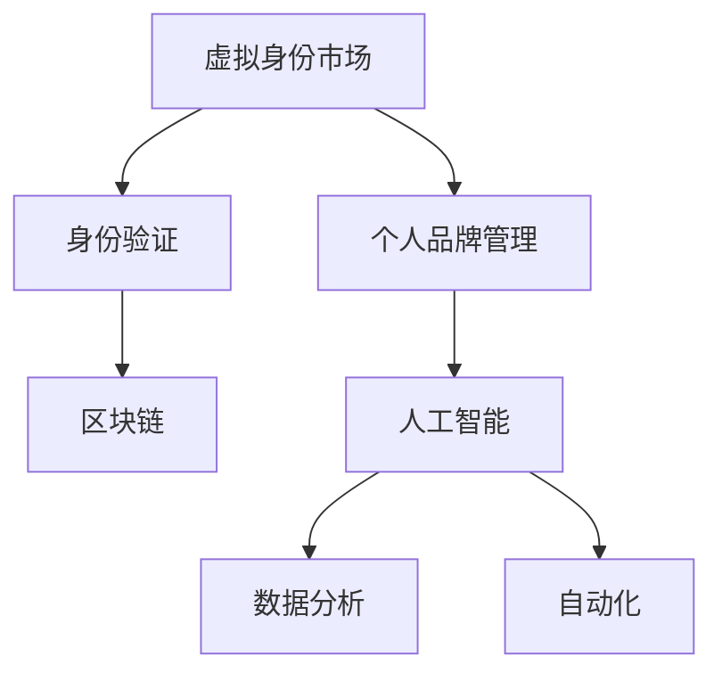

                 

# 虚拟身份市场分析专家：AI时代的个人品牌顾问

> 关键词：虚拟身份市场, 个人品牌管理, 人工智能, 身份验证, 区块链, 数据分析

## 1. 背景介绍

### 1.1 问题由来
随着互联网的普及和社交媒体的发展，人们拥有了更多的线上表达方式。同时，人们在虚拟世界中也逐渐形成了自己的数字身份，虚拟身份管理成为了一个热门话题。个人品牌管理作为提升个人价值的重要手段，在职场、社交平台等方面起着关键作用。人工智能和大数据技术的兴起，为虚拟身份管理提供了新的可能。本文将探讨虚拟身份市场的现状和未来趋势，以及利用AI技术进行个人品牌管理的可能性。

### 1.2 问题核心关键点
- **虚拟身份市场现状**：当前虚拟身份市场的规模、主要参与者及其市场策略。
- **个人品牌管理需求**：用户对虚拟身份管理的痛点和期望。
- **AI技术应用**：AI在虚拟身份管理和个人品牌管理中的应用场景及潜力。
- **市场机遇与挑战**：虚拟身份市场面临的机遇与挑战，如数据隐私、安全性等。

## 2. 核心概念与联系

### 2.1 核心概念概述

为了更好地理解虚拟身份市场和AI在其中的应用，本节将介绍几个核心概念：

- **虚拟身份市场**：指通过各种平台和工具，提供虚拟身份创建、管理和应用的市场。包括但不限于社交平台账号、虚拟货币钱包、数字身份验证等。
- **个人品牌管理**：指通过线上平台，构建并维护个人形象、专业能力和声誉的过程。个人品牌管理对职业发展、社交网络的影响巨大。
- **人工智能**：通过机器学习、自然语言处理等技术，模拟人类智能活动的能力。在虚拟身份管理和个人品牌管理中，AI可以用于数据分析、自动化、个性化推荐等。
- **身份验证**：确保虚拟身份的真实性、唯一性和合法性的过程。区块链技术在此方面有着天然优势。
- **数据分析**：通过收集和分析大量数据，以优化虚拟身份和品牌管理策略。

### 2.2 核心概念原理和架构的 Mermaid 流程图



这个流程图展示了虚拟身份市场、身份验证、个人品牌管理、人工智能和数据分析之间的联系。

1. **虚拟身份市场**（A）为身份验证（B）和个人品牌管理（C）提供平台和工具。
2. **身份验证**（B）确保虚拟身份的真实性和唯一性，区块链技术是其中的一种重要手段。
3. **个人品牌管理**（C）通过线上平台维护个人形象和声誉，AI可以提供个性化推荐和自动化工具。
4. **数据分析**（F）用于优化个人品牌管理策略，而**人工智能**（E）是实现数据分析的关键技术。

## 3. 核心算法原理 & 具体操作步骤

### 3.1 算法原理概述

虚拟身份管理和个人品牌管理的核心算法原理基于AI和大数据技术，通过分析用户行为、社交网络数据等，提供个性化的虚拟身份创建和品牌管理方案。主要包括以下几个关键环节：

- **用户行为分析**：通过分析用户在社交平台上的活动，了解其兴趣和偏好。
- **社交网络分析**：利用图网络分析技术，识别用户的重要社交圈和影响力。
- **个性化推荐**：结合用户行为和社交网络分析结果，推荐适合的虚拟身份创建策略和品牌管理内容。
- **自动化工具开发**：基于AI技术，开发自动化工具，如智能客服、自动化内容生成等，提升管理效率。

### 3.2 算法步骤详解

**Step 1: 数据收集与预处理**

- **数据源**：社交平台数据、用户行为数据、公开的网络公开数据集等。
- **预处理**：数据清洗、特征提取、缺失值处理等。

**Step 2: 模型训练与优化**

- **模型选择**：选择合适的机器学习模型，如随机森林、深度学习模型等。
- **特征工程**：选择合适的特征，并使用特征选择方法优化特征集。
- **模型优化**：使用交叉验证、超参数调优等技术，优化模型性能。

**Step 3: 模型评估与部署**

- **评估指标**：如精确度、召回率、F1分数等。
- **部署**：将模型集成到虚拟身份管理和个人品牌管理的平台上。

**Step 4: 持续学习与优化**

- **反馈机制**：通过用户反馈，持续优化模型性能。
- **模型更新**：定期更新模型，适应数据分布的变化。

### 3.3 算法优缺点

**优点**：

- **个性化推荐**：基于用户行为和社交网络分析，提供个性化服务，提升用户体验。
- **效率提升**：通过自动化工具，降低人工操作成本，提高管理效率。
- **动态优化**：通过持续学习，模型能够不断适应新的数据分布，保持高精度的推荐。

**缺点**：

- **数据隐私**：收集大量用户数据，可能涉及隐私泄露的风险。
- **算法黑箱**：AI模型复杂，难以解释，可能导致信任问题。
- **模型泛化**：训练数据分布有限，模型可能泛化不足，导致推荐偏差。

### 3.4 算法应用领域

基于AI的虚拟身份管理和个人品牌管理技术，已经在以下几个领域得到广泛应用：

- **社交媒体平台**：如Facebook、Twitter等，通过分析用户行为，提供个性化内容推荐。
- **职业社交网络**：如LinkedIn，利用用户职业信息，推荐合适的职业路径和机会。
- **电子商务**：如Amazon，通过分析用户购物行为，推荐个性化商品。
- **在线教育**：如Coursera，通过分析学习行为，推荐个性化课程和内容。

## 4. 数学模型和公式 & 详细讲解 & 举例说明

### 4.1 数学模型构建

本节将使用数学语言对AI在虚拟身份管理和个人品牌管理中的应用进行更加严格的刻画。

设用户 $U$ 在社交平台上的行为数据为 $D=\{x_i\}_{i=1}^N$，其中 $x_i$ 为行为数据，如浏览记录、点赞记录、评论记录等。目标是对用户 $U$ 进行虚拟身份推荐和品牌管理。

数学模型构建如下：

- **用户行为模型**：$M_U(x) = \{\text{用户行为特征}\}$
- **社交网络模型**：$M_S(U) = \{\text{用户社交网络特征}\}$
- **品牌管理模型**：$M_B(U) = \{\text{品牌管理策略}\}$

其中，$M_U(x)$ 为基于用户行为数据的模型，$M_S(U)$ 为基于用户社交网络数据的模型，$M_B(U)$ 为基于品牌管理策略的模型。

### 4.2 公式推导过程

设用户 $U$ 在社交平台上的行为数据为 $D=\{x_i\}_{i=1}^N$，其中 $x_i$ 为行为数据，如浏览记录、点赞记录、评论记录等。目标是对用户 $U$ 进行虚拟身份推荐和品牌管理。

用户行为模型 $M_U(x)$ 的公式推导如下：

$$
M_U(x) = \sum_{i=1}^N w_i \times \text{特征}(x_i)
$$

其中 $w_i$ 为特征权重，通过机器学习算法（如随机森林、深度学习等）确定。

社交网络模型 $M_S(U)$ 的公式推导如下：

$$
M_S(U) = \sum_{i=1}^N w_i \times \text{特征}(U_i)
$$

其中 $w_i$ 为社交网络特征权重，通过图网络分析技术确定。

品牌管理模型 $M_B(U)$ 的公式推导如下：

$$
M_B(U) = \sum_{i=1}^N w_i \times \text{策略}(i)
$$

其中 $w_i$ 为品牌管理策略权重，通过AI算法（如决策树、神经网络等）确定。

### 4.3 案例分析与讲解

假设某用户在社交平台上浏览了大量科技相关的内容，且频繁点赞技术大咖的帖子。通过用户行为模型 $M_U(x)$，可以得出该用户对科技领域感兴趣。通过社交网络模型 $M_S(U)$，可以发现该用户的重要社交圈包括多位技术大咖和业内专家。

结合以上分析，品牌管理模型 $M_B(U)$ 可以推荐该用户使用与科技相关的虚拟身份，如GitHub开发者账号，并加入相关的技术社群。

## 5. 项目实践：代码实例和详细解释说明

### 5.1 开发环境搭建

在进行AI项目实践前，我们需要准备好开发环境。以下是使用Python进行机器学习开发的环境配置流程：

1. 安装Anaconda：从官网下载并安装Anaconda，用于创建独立的Python环境。

2. 创建并激活虚拟环境：
```bash
conda create -n myenv python=3.8 
conda activate myenv
```

3. 安装必要的库：
```bash
pip install scikit-learn pandas numpy matplotlib seaborn joblib
```

完成上述步骤后，即可在`myenv`环境中开始AI项目实践。

### 5.2 源代码详细实现

我们以用户行为分析为例，使用Scikit-learn库实现随机森林模型。

```python
from sklearn.ensemble import RandomForestClassifier
from sklearn.model_selection import train_test_split
from sklearn.metrics import accuracy_score
import pandas as pd

# 读取数据集
data = pd.read_csv('user_behavior_data.csv')

# 特征工程
X = data[['behavior1', 'behavior2', 'behavior3']] # 选择特征
y = data['label'] # 选择标签

# 划分训练集和测试集
X_train, X_test, y_train, y_test = train_test_split(X, y, test_size=0.2, random_state=42)

# 训练模型
model = RandomForestClassifier(n_estimators=100)
model.fit(X_train, y_train)

# 预测并评估
y_pred = model.predict(X_test)
accuracy = accuracy_score(y_test, y_pred)
print(f'Accuracy: {accuracy:.2f}')
```

### 5.3 代码解读与分析

让我们再详细解读一下关键代码的实现细节：

**数据处理**：
- `pd.read_csv()`：使用Pandas库读取用户行为数据集。
- `train_test_split()`：将数据集划分为训练集和测试集，保持80%的数据用于训练，20%的数据用于测试。

**模型训练**：
- `RandomForestClassifier()`：选择随机森林模型作为特征分类器。
- `fit()`：在训练集上训练模型。

**预测与评估**：
- `predict()`：在测试集上使用训练好的模型进行预测。
- `accuracy_score()`：计算预测结果的准确率。

**结果输出**：
- 输出模型的准确率，评估模型性能。

## 6. 实际应用场景

### 6.1 社交媒体平台

社交媒体平台如Facebook、Twitter等，通过分析用户行为和社交网络，可以提供个性化推荐，提升用户体验。例如，Facebook可以推荐用户感兴趣的朋友、内容，Twitter可以推荐用户关注的账号。

### 6.2 职业社交网络

LinkedIn等职业社交网络平台，通过分析用户的职业背景、工作经历等数据，推荐合适的职业机会和公司，帮助用户进行职业规划和求职。

### 6.3 电子商务

电子商务平台如Amazon，通过分析用户的购物行为，推荐个性化的商品和优惠活动，提升销售额和用户满意度。

### 6.4 在线教育

在线教育平台如Coursera，通过分析学习行为，推荐个性化的课程和内容，提升学习效果和用户体验。

### 6.5 未来应用展望

随着AI技术的发展，虚拟身份管理和个人品牌管理将更加智能化和个性化。未来可能的应用场景包括：

- **虚拟身份创建与验证**：基于区块链技术，实现去中心化的虚拟身份创建与验证。
- **智能客服与推荐系统**：通过AI技术，实现智能客服和个性化推荐系统，提升服务质量和用户体验。
- **虚拟现实与增强现实**：结合虚拟现实和增强现实技术，创建更丰富的虚拟身份管理体验。

## 7. 工具和资源推荐

### 7.1 学习资源推荐

为了帮助开发者系统掌握AI技术在虚拟身份管理和个人品牌管理中的应用，这里推荐一些优质的学习资源：

1. **《Python机器学习》**：由Sebastian Raschka和Vahid Mirjalili合著，是一本全面介绍机器学习的经典书籍。
2. **《深度学习》**：由Ian Goodfellow、Yoshua Bengio和Aaron Courville合著，涵盖了深度学习的基础理论和应用实践。
3. **Coursera的《机器学习》课程**：由斯坦福大学Andrew Ng教授主讲，是机器学习领域的入门级课程。
4. **Kaggle平台**：提供大量数据集和竞赛，实践机器学习算法和数据分析技术。
5. **Github的机器学习资源**：提供大量开源项目和代码示例，助力开发者学习和实践。

通过对这些资源的学习实践，相信你一定能够快速掌握AI技术在虚拟身份管理和个人品牌管理中的应用，并用于解决实际的NLP问题。

### 7.2 开发工具推荐

高效的开发离不开优秀的工具支持。以下是几款用于AI项目开发的常用工具：

1. **Jupyter Notebook**：一个免费的交互式编程环境，支持Python、R等多种语言，适合数据科学和机器学习项目开发。
2. **PyCharm**：一款功能强大的Python IDE，支持自动补全、代码调试、版本控制等功能。
3. **TensorFlow**：由Google开发的深度学习框架，支持分布式训练和高效的模型部署。
4. **Keras**：一个高层次的深度学习框架，支持快速搭建和训练模型。
5. **PyTorch**：一个灵活的深度学习框架，支持动态图和静态图两种计算图模式。

合理利用这些工具，可以显著提升AI项目开发和测试的效率，加快创新迭代的步伐。

### 7.3 相关论文推荐

AI技术在虚拟身份管理和个人品牌管理方面的研究已经取得重要进展。以下是几篇奠基性的相关论文，推荐阅读：

1. **《机器学习》**：由Tom Mitchell编写，介绍了机器学习的基本概念和算法。
2. **《深度学习》**：由Ian Goodfellow、Yoshua Bengio和Aaron Courville合著，介绍了深度学习的基础理论和应用实践。
3. **《GraphSAGE: Graph Neural Network Models for Scalable Recommendations》**：介绍了一种基于图神经网络的推荐系统，适合处理社交网络数据。
4. **《用户生成内容的推荐：基于协同过滤的推荐系统》**：介绍了协同过滤算法在用户生成内容推荐中的应用。
5. **《深度学习在职业社交网络中的应用》**：介绍了深度学习在职业社交网络推荐中的应用。

这些论文代表了大数据和AI技术在虚拟身份管理和个人品牌管理方面的最新进展。通过学习这些前沿成果，可以帮助研究者把握学科前进方向，激发更多的创新灵感。

## 8. 总结：未来发展趋势与挑战

### 8.1 总结

本文对AI在虚拟身份管理和个人品牌管理中的应用进行了全面系统的介绍。首先阐述了虚拟身份市场和AI在其中的应用背景，明确了虚拟身份管理和个人品牌管理的核心概念和应用场景。其次，从原理到实践，详细讲解了AI在虚拟身份管理和个人品牌管理中的应用，提供了完整的代码实现。同时，本文还探讨了AI在虚拟身份管理和个人品牌管理中的应用前景，并推荐了相关的学习资源和开发工具。

通过本文的系统梳理，可以看到，AI技术在虚拟身份管理和个人品牌管理中具有广阔的应用前景。AI技术能够帮助用户更好地管理个人身份和品牌，提升用户体验和满意度。未来，伴随AI技术的不断进步，虚拟身份管理和个人品牌管理必将更加智能化和个性化。

### 8.2 未来发展趋势

展望未来，AI在虚拟身份管理和个人品牌管理方面的发展趋势如下：

1. **个性化推荐**：基于深度学习和大数据技术，提供更加个性化、精准的虚拟身份和品牌管理方案。
2. **自动化工具**：开发更多基于AI的自动化工具，提升用户体验和运营效率。
3. **去中心化身份验证**：利用区块链技术，实现去中心化的虚拟身份创建和验证，提升用户隐私和安全性。
4. **多模态数据融合**：结合图像、语音、文本等多种模态数据，提升AI模型对用户行为的全面理解。

这些趋势将推动虚拟身份管理和个人品牌管理技术的不断进步，为用户的虚拟身份管理带来更多便利和体验提升。

### 8.3 面临的挑战

尽管AI在虚拟身份管理和个人品牌管理方面取得重要进展，但在迈向更加智能化、普适化应用的过程中，仍然面临诸多挑战：

1. **数据隐私**：在收集用户数据过程中，如何保护用户隐私，防止数据泄露。
2. **模型泛化**：训练数据分布有限，模型可能泛化不足，导致推荐偏差。
3. **计算资源**：大规模数据集和复杂模型的训练和推理需要大量的计算资源，如何优化资源使用，提升计算效率。
4. **算法透明性**：AI模型复杂，难以解释，可能导致信任问题。
5. **用户接受度**：用户在接受AI推荐和自动化工具时，可能存在一定的心理障碍，如何提升用户接受度。

这些挑战需要研究者不断探索和解决，以确保AI技术在虚拟身份管理和个人品牌管理中的高效、安全、可信的应用。

### 8.4 研究展望

未来，在虚拟身份管理和个人品牌管理领域，AI技术还需要在以下几个方面进行深入研究：

1. **隐私保护技术**：研究隐私保护技术，如差分隐私、联邦学习等，保护用户数据隐私。
2. **可解释性AI**：开发可解释性AI模型，提升用户对AI推荐和自动化工具的信任。
3. **多模态数据融合**：结合图像、语音、文本等多种模态数据，提升AI模型对用户行为的全面理解。
4. **用户参与设计**：研究用户参与设计方法，提高用户对AI推荐和自动化工具的接受度和满意度。

这些研究方向的探索，将引领AI技术在虚拟身份管理和个人品牌管理领域迈向更高的台阶，为构建安全、可靠、可解释、可控的智能系统铺平道路。

## 9. 附录：常见问题与解答

**Q1：AI在虚拟身份管理和个人品牌管理中的应用是否会导致数据隐私泄露？**

A: AI在虚拟身份管理和个人品牌管理中的应用可能会收集和分析大量的用户数据。为了避免数据隐私泄露，需要采取以下措施：
1. **数据匿名化**：在收集数据时，对用户数据进行匿名化处理，去除敏感信息。
2. **隐私保护技术**：使用差分隐私、联邦学习等技术，保护用户数据隐私。
3. **数据访问控制**：严格控制数据访问权限，确保只有授权人员能够访问敏感数据。

**Q2：AI模型的泛化能力不足，如何解决？**

A: 为了提高AI模型的泛化能力，可以采取以下措施：
1. **数据增强**：增加训练数据量，提高模型的泛化能力。
2. **多模态数据融合**：结合图像、语音、文本等多种模态数据，提升AI模型对用户行为的全面理解。
3. **模型集成**：使用模型集成技术，如Bagging、Boosting等，提升模型的泛化能力。

**Q3：AI模型的计算效率不高，如何优化？**

A: 为了提高AI模型的计算效率，可以采取以下措施：
1. **模型压缩**：通过模型剪枝、量化等技术，减小模型尺寸，提升计算效率。
2. **分布式训练**：利用分布式计算技术，加速大规模模型的训练。
3. **硬件优化**：使用GPU、TPU等高性能设备，提升计算速度。

**Q4：AI模型的可解释性不足，如何解决？**

A: 为了提高AI模型的可解释性，可以采取以下措施：
1. **可解释性模型**：使用可解释性模型，如决策树、线性回归等，提升模型的可解释性。
2. **模型可视化**：通过可视化技术，展示模型的决策过程，提高模型的透明度。
3. **用户交互设计**：通过用户交互设计，提升用户对AI推荐和自动化工具的信任。

**Q5：用户对AI推荐和自动化工具的接受度不高，如何解决？**

A: 为了提升用户对AI推荐和自动化工具的接受度，可以采取以下措施：
1. **用户参与设计**：研究用户参与设计方法，提高用户对AI推荐和自动化工具的接受度和满意度。
2. **透明性展示**：通过透明性展示，让用户了解AI推荐和自动化工具的工作机制，提升用户信任度。
3. **个性化推荐**：根据用户反馈，不断优化AI推荐算法，提升推荐的个性化和精准度。

通过对这些问题的详细解答，相信读者能够更好地理解和应用AI技术在虚拟身份管理和个人品牌管理中的应用，提升用户的虚拟身份管理体验。

---

作者：禅与计算机程序设计艺术 / Zen and the Art of Computer Programming

