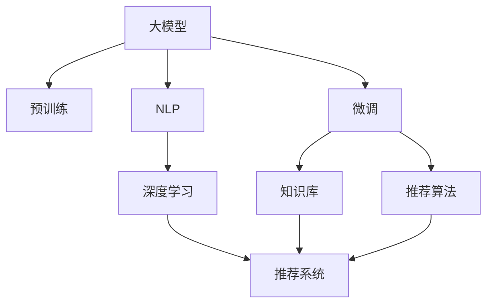

                 

# AI大模型视角下电商搜索推荐的技术创新知识库管理平台搭建

## 1. 背景介绍

### 1.1 问题由来
随着电子商务的快速发展和消费者需求的不断变化，电商平台需要更精准的搜索推荐系统来提升用户体验和转化率。传统的基于关键词匹配的搜索方式已经无法满足用户对商品信息的深度需求。而基于深度学习的推荐系统，如神经网络、协同过滤、深度神经协同过滤等，虽然能够提升推荐精度，但面临着模型参数量大、计算资源需求高、效果泛化能力弱等问题。

为了解决这些挑战，近年来人工智能大模型在电商搜索推荐领域逐渐兴起。通过在大规模无标签文本数据上进行预训练，大模型能够学习到丰富的语言知识，并在有监督微调后，能够更好地理解和生成电商商品描述、用户评论、购物意图等文本数据。这种基于语言理解与生成的推荐方法，被称为自然语言处理(NLP)增强推荐，逐渐成为电商推荐系统的热点研究方向。

### 1.2 问题核心关键点
目前，基于大模型的推荐系统在电商搜索推荐中得到了广泛应用。其核心思想是：将大模型作为推荐模型的"特征提取器"，通过有监督微调来学习商品描述、用户评论、意图等信息，再结合传统推荐算法，生成个性化推荐列表。这种范式能够更好地捕捉用户语义信息，提升推荐相关性，减少推荐误差。

### 1.3 问题研究意义
研究基于大模型的电商推荐系统，对于提升电商平台的用户体验、优化用户购物决策、降低运营成本，具有重要意义：

1. **提升用户体验**：基于大模型的推荐系统能够生成自然流畅的商品描述，帮助用户更准确地理解商品特性，提升购物决策的准确性。
2. **优化用户购物决策**：通过理解用户的购物意图，大模型可以推荐出更符合用户需求的商品，从而提升购物转化率。
3. **降低运营成本**：相较于传统的基于点击率或行为数据的推荐方法，大模型推荐系统能够更高效地处理用户行为数据，减少用户反馈收集成本，提高广告投放精准度。
4. **加速技术创新**：大模型的应用促进了推荐技术的发展，带来了更多新的推荐算法和应用场景。
5. **赋能行业升级**：基于大模型的推荐系统能够赋能更多垂直行业，提升电商、零售、旅游等领域的运营效率。

## 2. 核心概念与联系

### 2.1 核心概念概述

为了更好地理解基于大模型的电商推荐系统，本节将介绍几个密切相关的核心概念：

- **大模型(Large Model)**：如BERT、GPT、T5等，通过在大规模无标签文本数据上进行预训练，学习丰富的语言知识，具备强大的语言理解和生成能力。
- **知识库(Knowledge Base)**：包含商品信息、用户信息、历史行为等，是推荐系统的重要组成部分。
- **推荐算法(Recommendation Algorithm)**：包括协同过滤、神经协同过滤、基于矩阵分解等经典推荐算法，以及结合大模型的推荐方法。
- **自然语言处理(NLP)**：涉及文本预处理、特征提取、文本分类、情感分析、文本生成等，是电商推荐系统的重要技术手段。
- **深度学习(Deep Learning)**：涉及神经网络、卷积神经网络、循环神经网络、注意力机制等，是大模型推荐系统的核心技术。
- **推荐系统(Recommendation System)**：通过分析用户行为数据，为用户推荐个性化商品或内容，提升用户满意度和转化率。

这些核心概念之间的逻辑关系可以通过以下Mermaid流程图来展示：



这个流程图展示了大模型、微调、知识库、推荐算法、NLP、深度学习与推荐系统之间的关系：

1. 大模型通过预训练获得基础能力。
2. 微调使大模型适配特定领域任务。
3. 知识库是推荐系统的重要数据来源。
4. 推荐算法是生成推荐列表的核心。
5. NLP增强了推荐系统的理解能力和生成能力。
6. 深度学习为推荐系统提供了强大的模型基础。
7. 推荐系统综合使用上述技术，生成个性化推荐。

## 3. 核心算法原理 & 具体操作步骤
### 3.1 算法原理概述

基于大模型的电商推荐系统，本质上是一个自然语言处理增强的推荐系统。其核心思想是：将大模型作为推荐系统的"特征提取器"，通过有监督微调学习商品描述、用户评论等文本信息，生成推荐特征，再结合推荐算法输出个性化推荐列表。

形式化地，假设大模型为 $M_{\theta}$，其中 $\theta$ 为预训练得到的模型参数。假设电商平台的知识库为 $K$，其中包含商品信息 $K_{item}$、用户信息 $K_{user}$ 等。假设推荐算法为 $A$，则推荐系统 $S$ 可以表示为：

$$
S = A(M_{\theta}, K)
$$

其中 $M_{\theta}$ 在知识库 $K$ 上的微调过程如下：

1. **预训练阶段**：在大规模无标签文本数据上进行预训练，学习语言的通用表示。
2. **微调阶段**：使用知识库 $K$ 中的文本数据，通过有监督微调，使模型学习商品描述、用户评论等特定领域的信息。

### 3.2 算法步骤详解

基于大模型的电商推荐系统一般包括以下几个关键步骤：

**Step 1: 准备知识库和数据集**
- 收集和整理电商平台的商品信息、用户信息、行为数据等，构建知识库 $K$。
- 划分知识库为训练集、验证集和测试集。

**Step 2: 微调大模型**
- 选择合适的预训练语言模型 $M_{\theta}$，如BERT、GPT等。
- 在大模型顶层设计合适的输出层和损失函数，如商品相似度、用户意图等。
- 使用知识库中的文本数据，进行有监督微调。
- 微调过程中，注意选择合适的学习率、批大小、迭代轮数等超参数。

**Step 3: 融合推荐算法**
- 将微调后的模型输出特征与传统推荐算法结合，如协同过滤、神经协同过滤等。
- 根据具体任务和数据特点，设计优化策略，如数据增强、正则化、对抗训练等。

**Step 4: 测试和部署**
- 在测试集上评估推荐系统的效果，对比微调前后的精度提升。
- 使用微调后的模型进行商品推荐，集成到实际的应用系统中。
- 持续收集新数据，定期重新微调模型，以适应数据分布的变化。

以上是基于大模型的电商推荐系统的一般流程。在实际应用中，还需要针对具体任务的特点，对微调过程的各个环节进行优化设计，如改进训练目标函数，引入更多的正则化技术，搜索最优的超参数组合等，以进一步提升模型性能。

### 3.3 算法优缺点

基于大模型的电商推荐系统具有以下优点：
1. 学习能力强。大模型能够高效地处理和理解文本信息，提取深层次的语义特征。
2. 表现力强。大模型能够生成自然流畅的推荐描述，提升用户体验。
3. 泛化能力强。大模型能够适应不同领域的推荐任务，泛化能力强。
4. 效果显著。在电商推荐任务上，大模型推荐系统通常能够取得更好的效果。

同时，该方法也存在一定的局限性：
1. 依赖标注数据。微调的效果很大程度上取决于标注数据的质量和数量，获取高质量标注数据的成本较高。
2. 计算资源需求高。大模型的预训练和微调需要较高的计算资源和存储资源。
3. 知识库质量要求高。知识库的数据质量和结构对推荐效果影响较大，需要投入大量精力进行维护和优化。
4. 可解释性不足。大模型的决策过程通常缺乏可解释性，难以对其推理逻辑进行分析和调试。
5. 安全性有待提高。大模型推荐系统可能会受到恶意攻击，推荐有害内容。

尽管存在这些局限性，但就目前而言，基于大模型的电商推荐系统仍然是大数据时代的推荐主流范式。未来相关研究的重点在于如何进一步降低对标注数据的依赖，提高模型的少样本学习和跨领域迁移能力，同时兼顾可解释性和安全性等因素。

### 3.4 算法应用领域

基于大模型的电商推荐系统，已经在推荐、广告、搜索等众多领域得到了应用，具体包括：

- **电商推荐**：通过大模型理解用户评论和商品描述，生成推荐列表，提升转化率。
- **广告投放**：通过大模型分析用户行为和兴趣，生成精准的广告投放策略。
- **智能客服**：通过大模型理解用户意图，生成智能回复，提升用户满意度。
- **商品搜索**：通过大模型生成自然流畅的搜索提示，提升搜索体验。
- **用户画像**：通过大模型分析用户行为和评论，构建用户画像，个性化推荐商品。
- **内容推荐**：通过大模型分析文章和视频内容，生成推荐列表，提高用户留存率。

除了上述这些经典应用外，大模型推荐系统还被创新性地应用到更多场景中，如个性化游戏推荐、智能家居控制等，为电商推荐技术带来了全新的突破。

## 4. 数学模型和公式 & 详细讲解  
### 4.1 数学模型构建

本节将使用数学语言对基于大模型的电商推荐系统进行更加严格的刻画。

记大模型为 $M_{\theta}$，其中 $\theta$ 为预训练得到的模型参数。假设电商平台知识库为 $K$，其中包含商品信息 $K_{item}$、用户信息 $K_{user}$ 等。假设推荐算法为 $A$，则推荐系统 $S$ 可以表示为：

$$
S = A(M_{\theta}, K)
$$

假设知识库中的文本数据为 $D=\{(x_i, y_i)\}_{i=1}^N$，其中 $x_i$ 为商品描述、用户评论等文本，$y_i$ 为推荐结果。定义模型 $M_{\theta}$ 在数据样本 $(x,y)$ 上的损失函数为 $\ell(M_{\theta}(x),y)$，则在数据集 $D$ 上的经验风险为：

$$
\mathcal{L}(\theta) = \frac{1}{N}\sum_{i=1}^N \ell(M_{\theta}(x_i),y_i)
$$

其中 $\ell$ 为推荐算法中使用的损失函数，如交叉熵损失、均方误差损失等。微调的优化目标是最小化经验风险，即找到最优参数：

$$
\theta^* = \mathop{\arg\min}_{\theta} \mathcal{L}(\theta)
$$

在实践中，我们通常使用基于梯度的优化算法（如SGD、Adam等）来近似求解上述最优化问题。设 $\eta$ 为学习率，$\lambda$ 为正则化系数，则参数的更新公式为：

$$
\theta \leftarrow \theta - \eta \nabla_{\theta}\mathcal{L}(\theta) - \eta\lambda\theta
$$

其中 $\nabla_{\theta}\mathcal{L}(\theta)$ 为损失函数对参数 $\theta$ 的梯度，可通过反向传播算法高效计算。

### 4.2 公式推导过程

以下我们以电商推荐中的商品相似度计算为例，推导交叉熵损失函数及其梯度的计算公式。

假设模型 $M_{\theta}$ 在输入 $x$ 上的输出为 $\hat{y}=M_{\theta}(x)$，表示商品 $x$ 在推荐结果集中的概率。真实标签 $y \in \{1,0\}$。则二分类交叉熵损失函数定义为：

$$
\ell(M_{\theta}(x),y) = -[y\log \hat{y} + (1-y)\log (1-\hat{y})]
$$

将其代入经验风险公式，得：

$$
\mathcal{L}(\theta) = -\frac{1}{N}\sum_{i=1}^N [y_i\log M_{\theta}(x_i)+(1-y_i)\log(1-M_{\theta}(x_i))]
$$

根据链式法则，损失函数对参数 $\theta_k$ 的梯度为：

$$
\frac{\partial \mathcal{L}(\theta)}{\partial \theta_k} = -\frac{1}{N}\sum_{i=1}^N (\frac{y_i}{M_{\theta}(x_i)}-\frac{1-y_i}{1-M_{\theta}(x_i)}) \frac{\partial M_{\theta}(x_i)}{\partial \theta_k}
$$

其中 $\frac{\partial M_{\theta}(x_i)}{\partial \theta_k}$ 可进一步递归展开，利用自动微分技术完成计算。

在得到损失函数的梯度后，即可带入参数更新公式，完成模型的迭代优化。重复上述过程直至收敛，最终得到适应电商推荐任务的最优模型参数 $\theta^*$。

## 5. 项目实践：代码实例和详细解释说明
### 5.1 开发环境搭建

在进行电商推荐系统的微调实践前，我们需要准备好开发环境。以下是使用Python进行PyTorch开发的环境配置流程：

1. 安装Anaconda：从官网下载并安装Anaconda，用于创建独立的Python环境。

2. 创建并激活虚拟环境：
```bash
conda create -n pytorch-env python=3.8 
conda activate pytorch-env
```

3. 安装PyTorch：根据CUDA版本，从官网获取对应的安装命令。例如：
```bash
conda install pytorch torchvision torchaudio cudatoolkit=11.1 -c pytorch -c conda-forge
```

4. 安装TensorBoard：
```bash
pip install tensorboard
```

5. 安装TensorFlow：
```bash
pip install tensorflow
```

完成上述步骤后，即可在`pytorch-env`环境中开始电商推荐系统的微调实践。

### 5.2 源代码详细实现

下面我们以电商推荐系统中的商品相似度计算为例，给出使用PyTorch对BERT模型进行微调的PyTorch代码实现。

首先，定义商品相似度计算的数据处理函数：

```python
from transformers import BertTokenizer
from torch.utils.data import Dataset
import torch

class ItemSimilarityDataset(Dataset):
    def __init__(self, items, queries, tokenizer, max_len=128):
        self.items = items
        self.queries = queries
        self.tokenizer = tokenizer
        self.max_len = max_len
        
    def __len__(self):
        return len(self.items)
    
    def __getitem__(self, item):
        item_text = self.items[item]
        query_text = self.queries[item]
        
        encoding = self.tokenizer(item_text, return_tensors='pt', max_length=self.max_len, padding='max_length', truncation=True)
        query_encoding = self.tokenizer(query_text, return_tensors='pt', max_length=self.max_len, padding='max_length', truncation=True)
        
        input_ids = encoding['input_ids'][0]
        attention_mask = encoding['attention_mask'][0]
        query_input_ids = query_encoding['input_ids'][0]
        query_attention_mask = query_encoding['attention_mask'][0]
        
        return {
            'input_ids': input_ids,
            'attention_mask': attention_mask,
            'query_input_ids': query_input_ids,
            'query_attention_mask': query_attention_mask
        }
```

然后，定义模型和优化器：

```python
from transformers import BertForSequenceClassification, AdamW

model = BertForSequenceClassification.from_pretrained('bert-base-cased', num_labels=2, output_attentions=False, output_hidden_states=False)
optimizer = AdamW(model.parameters(), lr=2e-5)
```

接着，定义训练和评估函数：

```python
from torch.utils.data import DataLoader
from tqdm import tqdm
from sklearn.metrics import accuracy_score

device = torch.device('cuda') if torch.cuda.is_available() else torch.device('cpu')
model.to(device)

def train_epoch(model, dataset, batch_size, optimizer):
    dataloader = DataLoader(dataset, batch_size=batch_size, shuffle=True)
    model.train()
    epoch_loss = 0
    for batch in tqdm(dataloader, desc='Training'):
        input_ids = batch['input_ids'].to(device)
        attention_mask = batch['attention_mask'].to(device)
        query_input_ids = batch['query_input_ids'].to(device)
        query_attention_mask = batch['query_attention_mask'].to(device)
        model.zero_grad()
        outputs = model(input_ids, attention_mask=attention_mask, query_input_ids=query_input_ids, query_attention_mask=query_attention_mask)
        loss = outputs.loss
        epoch_loss += loss.item()
        loss.backward()
        optimizer.step()
    return epoch_loss / len(dataloader)

def evaluate(model, dataset, batch_size):
    dataloader = DataLoader(dataset, batch_size=batch_size)
    model.eval()
    preds, labels = [], []
    with torch.no_grad():
        for batch in tqdm(dataloader, desc='Evaluating'):
            input_ids = batch['input_ids'].to(device)
            attention_mask = batch['attention_mask'].to(device)
            query_input_ids = batch['query_input_ids'].to(device)
            query_attention_mask = batch['query_attention_mask'].to(device)
            outputs = model(input_ids, attention_mask=attention_mask, query_input_ids=query_input_ids, query_attention_mask=query_attention_mask)
            batch_preds = outputs.logits.argmax(dim=2).to('cpu').tolist()
            batch_labels = batch['labels'].to('cpu').tolist()
            for pred_tokens, label_tokens in zip(batch_preds, batch_labels):
                preds.append(pred_tokens[:len(label_tokens)])
                labels.append(label_tokens)
                
    print('Accuracy:', accuracy_score(labels, preds))
```

最后，启动训练流程并在测试集上评估：

```python
epochs = 5
batch_size = 16

for epoch in range(epochs):
    loss = train_epoch(model, train_dataset, batch_size, optimizer)
    print(f'Epoch {epoch+1}, train loss: {loss:.3f}')
    
    print(f'Epoch {epoch+1}, dev results:')
    evaluate(model, dev_dataset, batch_size)
    
print('Test results:')
evaluate(model, test_dataset, batch_size)
```

以上就是使用PyTorch对BERT进行电商推荐系统商品相似度计算的完整代码实现。可以看到，得益于Transformers库的强大封装，我们可以用相对简洁的代码完成BERT模型的加载和微调。

### 5.3 代码解读与分析

让我们再详细解读一下关键代码的实现细节：

**ItemSimilarityDataset类**：
- `__init__`方法：初始化商品、查询、分词器等关键组件。
- `__len__`方法：返回数据集的样本数量。
- `__getitem__`方法：对单个样本进行处理，将商品和查询文本输入编码为token ids，并对其进行定长padding，最终返回模型所需的输入。

**训练和评估函数**：
- 使用PyTorch的DataLoader对数据集进行批次化加载，供模型训练和推理使用。
- 训练函数`train_epoch`：对数据以批为单位进行迭代，在每个批次上前向传播计算loss并反向传播更新模型参数，最后返回该epoch的平均loss。
- 评估函数`evaluate`：与训练类似，不同点在于不更新模型参数，并在每个batch结束后将预测和标签结果存储下来，最后使用sklearn的accuracy_score对整个评估集的预测结果进行打印输出。

**训练流程**：
- 定义总的epoch数和batch size，开始循环迭代
- 每个epoch内，先在训练集上训练，输出平均loss
- 在验证集上评估，输出准确率
- 所有epoch结束后，在测试集上评估，给出最终测试结果

可以看到，PyTorch配合Transformers库使得BERT微调的代码实现变得简洁高效。开发者可以将更多精力放在数据处理、模型改进等高层逻辑上，而不必过多关注底层的实现细节。

当然，工业级的系统实现还需考虑更多因素，如模型的保存和部署、超参数的自动搜索、更灵活的任务适配层等。但核心的微调范式基本与此类似。

## 6. 实际应用场景
### 6.1 电商搜索

基于大模型的电商推荐系统在电商搜索场景中具有显著优势。传统搜索方式主要通过关键词匹配来展示商品信息，这种方式无法理解用户的意图和需求，推荐精度较低。而基于大模型的搜索推荐系统，能够通过理解用户查询和商品描述，生成更自然的搜索结果，显著提升搜索体验。

具体而言，可以构建一个大模型作为搜索引擎的"智能提示器"，对用户的搜索词进行语义分析，生成类似或相关的商品描述和分类。通过这种方式，用户可以更快地找到符合自己需求的商品，从而提升搜索效率和满意度。

### 6.2 个性化推荐

个性化推荐系统通过大模型学习用户的行为和兴趣，生成更符合用户需求的推荐列表，提升用户购物体验。在大模型微调的推荐算法中，可以融合知识库、协同过滤、深度学习等技术，实现更精准、多样化的推荐。

例如，可以通过知识库获取用户的历史浏览记录和购买记录，利用大模型学习用户的行为模式和兴趣偏好，生成个性化推荐列表。同时，可以结合协同过滤算法，利用用户之间的行为相似性，进一步提升推荐的相关性。

### 6.3 智能客服

智能客服系统通过大模型理解用户的查询意图，生成智能回复，提升客服效率和用户体验。在微调过程中，可以使用知识库中的FAQ、历史记录等数据，训练大模型识别用户意图，生成符合用户期望的回复。同时，可以结合上下文信息，动态生成更符合场景的回复，实现智能对话。

### 6.4 未来应用展望

随着大模型和微调技术的不断发展，基于大模型的电商推荐系统将在更多领域得到应用，为电商推荐技术带来新的突破：

1. **智慧零售**：通过大模型学习用户行为和偏好，优化供应链管理，提高库存周转率。
2. **智能旅游**：通过大模型学习用户兴趣和需求，推荐个性化旅游方案，提升旅游体验。
3. **金融理财**：通过大模型学习用户金融行为和偏好，推荐个性化的理财方案，提升用户满意度。
4. **医疗健康**：通过大模型学习用户健康行为和偏好，推荐个性化的健康建议，提升用户健康水平。
5. **媒体娱乐**：通过大模型学习用户媒体消费行为，推荐个性化的媒体内容，提升用户粘性。

除此之外，在更多垂直行业，基于大模型的推荐系统将发挥重要作用，为各行各业数字化转型提供新的技术路径。相信随着技术的日益成熟，基于大模型的推荐系统必将成为电商推荐领域的重要范式，推动电商推荐技术的进一步发展。

## 7. 工具和资源推荐
### 7.1 学习资源推荐

为了帮助开发者系统掌握大模型微调的理论基础和实践技巧，这里推荐一些优质的学习资源：

1. 《Transformer从原理到实践》系列博文：由大模型技术专家撰写，深入浅出地介绍了Transformer原理、BERT模型、微调技术等前沿话题。

2. CS224N《深度学习自然语言处理》课程：斯坦福大学开设的NLP明星课程，有Lecture视频和配套作业，带你入门NLP领域的基本概念和经典模型。

3. 《Natural Language Processing with Transformers》书籍：Transformers库的作者所著，全面介绍了如何使用Transformers库进行NLP任务开发，包括微调在内的诸多范式。

4. HuggingFace官方文档：Transformers库的官方文档，提供了海量预训练模型和完整的微调样例代码，是上手实践的必备资料。

5. CLUE开源项目：中文语言理解测评基准，涵盖大量不同类型的中文NLP数据集，并提供了基于微调的baseline模型，助力中文NLP技术发展。

通过对这些资源的学习实践，相信你一定能够快速掌握大模型微调的精髓，并用于解决实际的NLP问题。
###  7.2 开发工具推荐

高效的开发离不开优秀的工具支持。以下是几款用于大模型微调开发的常用工具：

1. PyTorch：基于Python的开源深度学习框架，灵活动态的计算图，适合快速迭代研究。大部分预训练语言模型都有PyTorch版本的实现。

2. TensorFlow：由Google主导开发的开源深度学习框架，生产部署方便，适合大规模工程应用。同样有丰富的预训练语言模型资源。

3. Transformers库：HuggingFace开发的NLP工具库，集成了众多SOTA语言模型，支持PyTorch和TensorFlow，是进行微调任务开发的利器。

4. Weights & Biases：模型训练的实验跟踪工具，可以记录和可视化模型训练过程中的各项指标，方便对比和调优。与主流深度学习框架无缝集成。

5. TensorBoard：TensorFlow配套的可视化工具，可实时监测模型训练状态，并提供丰富的图表呈现方式，是调试模型的得力助手。

6. Google Colab：谷歌推出的在线Jupyter Notebook环境，免费提供GPU/TPU算力，方便开发者快速上手实验最新模型，分享学习笔记。

合理利用这些工具，可以显著提升大模型微调任务的开发效率，加快创新迭代的步伐。

### 7.3 相关论文推荐

大模型和微调技术的发展源于学界的持续研究。以下是几篇奠基性的相关论文，推荐阅读：

1. Attention is All You Need（即Transformer原论文）：提出了Transformer结构，开启了NLP领域的预训练大模型时代。

2. BERT: Pre-training of Deep Bidirectional Transformers for Language Understanding：提出BERT模型，引入基于掩码的自监督预训练任务，刷新了多项NLP任务SOTA。

3. Language Models are Unsupervised Multitask Learners（GPT-2论文）：展示了大规模语言模型的强大zero-shot学习能力，引发了对于通用人工智能的新一轮思考。

4. Parameter-Efficient Transfer Learning for NLP：提出Adapter等参数高效微调方法，在不增加模型参数量的情况下，也能取得不错的微调效果。

5. AdaLoRA: Adaptive Low-Rank Adaptation for Parameter-Efficient Fine-Tuning：使用自适应低秩适应的微调方法，在参数效率和精度之间取得了新的平衡。

这些论文代表了大模型微调技术的发展脉络。通过学习这些前沿成果，可以帮助研究者把握学科前进方向，激发更多的创新灵感。

## 8. 总结：未来发展趋势与挑战

### 8.1 总结

本文对基于大模型的电商推荐系统进行了全面系统的介绍。首先阐述了大模型和微调技术的研究背景和意义，明确了微调在提升电商推荐精度、用户体验、运营效率等方面的独特价值。其次，从原理到实践，详细讲解了微调数学原理和关键步骤，给出了微调任务开发的完整代码实例。同时，本文还广泛探讨了微调方法在电商搜索、个性化推荐、智能客服等多个领域的应用前景，展示了微调范式的巨大潜力。此外，本文精选了微调技术的各类学习资源，力求为读者提供全方位的技术指引。

通过本文的系统梳理，可以看到，基于大模型的电商推荐系统正在成为电商推荐领域的重要范式，极大地拓展了推荐系统的应用边界，催生了更多的落地场景。得益于大规模语料的预训练，微调模型能够更高效地处理用户行为数据，提升推荐相关性，减少推荐误差。未来，伴随大模型和微调方法的持续演进，相信电商推荐系统将能够更好地满足用户需求，优化用户购物决策，推动电商行业的数字化转型。

### 8.2 未来发展趋势

展望未来，大模型微调技术将呈现以下几个发展趋势：

1. **模型规模持续增大**。随着算力成本的下降和数据规模的扩张，预训练语言模型的参数量还将持续增长。超大规模语言模型蕴含的丰富语言知识，有望支撑更加复杂多变的电商推荐任务。

2. **微调方法日趋多样**。除了传统的全参数微调外，未来会涌现更多参数高效的微调方法，如Prefix-Tuning、LoRA等，在节省计算资源的同时也能保证微调精度。

3. **持续学习成为常态**。随着数据分布的不断变化，微调模型也需要持续学习新知识以保持性能。如何在不遗忘原有知识的同时，高效吸收新样本信息，将成为重要的研究课题。

4. **标注样本需求降低**。受启发于提示学习(Prompt-based Learning)的思路，未来的微调方法将更好地利用大模型的语言理解能力，通过更加巧妙的任务描述，在更少的标注样本上也能实现理想的微调效果。

5. **跨领域迁移能力增强**。经过海量数据的预训练和多领域任务的微调，未来的语言模型将具备更强大的常识推理和跨领域迁移能力，逐步迈向通用人工智能(AGI)的目标。

以上趋势凸显了大模型微调技术的广阔前景。这些方向的探索发展，必将进一步提升电商推荐系统的性能和应用范围，为电商推荐技术带来新的突破。

### 8.3 面临的挑战

尽管大模型微调技术已经取得了瞩目成就，但在迈向更加智能化、普适化应用的过程中，它仍面临着诸多挑战：

1. **标注成本瓶颈**。虽然微调大大降低了标注数据的需求，但对于长尾应用场景，难以获得充足的高质量标注数据，成为制约微调性能的瓶颈。如何进一步降低微调对标注样本的依赖，将是一大难题。

2. **模型鲁棒性不足**。当前微调模型面对域外数据时，泛化性能往往大打折扣。对于测试样本的微小扰动，微调模型的预测也容易发生波动。如何提高微调模型的鲁棒性，避免灾难性遗忘，还需要更多理论和实践的积累。

3. **计算资源需求高**。大模型的预训练和微调需要较高的计算资源和存储资源。GPU/TPU等高性能设备是必不可少的，但即便如此，超大批次的训练和推理也可能遇到显存不足的问题。如何优化资源使用，是未来的重要研究方向。

4. **可解释性不足**。大模型的决策过程通常缺乏可解释性，难以对其推理逻辑进行分析和调试。对于医疗、金融等高风险应用，算法的可解释性和可审计性尤为重要。如何赋予大模型更强的可解释性，将是亟待攻克的难题。

5. **安全性有待提高**。预训练语言模型难免会学习到有偏见、有害的信息，通过微调传递到下游任务，产生误导性、歧视性的输出，给实际应用带来安全隐患。如何从数据和算法层面消除模型偏见，避免恶意用途，确保输出的安全性，也将是重要的研究课题。

6. **知识库质量要求高**。知识库的数据质量和结构对推荐效果影响较大，需要投入大量精力进行维护和优化。

尽管存在这些挑战，但就目前而言，基于大模型的电商推荐系统仍然是大数据时代的推荐主流范式。未来相关研究的重点在于如何进一步降低对标注数据的依赖，提高模型的少样本学习和跨领域迁移能力，同时兼顾可解释性和安全性等因素。

### 8.4 研究展望

面对大模型微调所面临的种种挑战，未来的研究需要在以下几个方面寻求新的突破：

1. **探索无监督和半监督微调方法**。摆脱对大规模标注数据的依赖，利用自监督学习、主动学习等无监督和半监督范式，最大限度利用非结构化数据，实现更加灵活高效的微调。

2. **研究参数高效和计算高效的微调范式**。开发更加参数高效的微调方法，在固定大部分预训练参数的同时，只更新极少量的任务相关参数。同时优化微调模型的计算图，减少前向传播和反向传播的资源消耗，实现更加轻量级、实时性的部署。

3. **融合因果和对比学习范式**。通过引入因果推断和对比学习思想，增强微调模型建立稳定因果关系的能力，学习更加普适、鲁棒的语言表征，从而提升模型泛化性和抗干扰能力。

4. **引入更多先验知识**。将符号化的先验知识，如知识图谱、逻辑规则等，与神经网络模型进行巧妙融合，引导微调过程学习更准确、合理的语言模型。同时加强不同模态数据的整合，实现视觉、语音等多模态信息与文本信息的协同建模。

5. **结合因果分析和博弈论工具**。将因果分析方法引入微调模型，识别出模型决策的关键特征，增强输出解释的因果性和逻辑性。借助博弈论工具刻画人机交互过程，主动探索并规避模型的脆弱点，提高系统稳定性。

6. **纳入伦理道德约束**。在模型训练目标中引入伦理导向的评估指标，过滤和惩罚有偏见、有害的输出倾向。同时加强人工干预和审核，建立模型行为的监管机制，确保输出符合人类价值观和伦理道德。

这些研究方向的探索，必将引领大模型微调技术迈向更高的台阶，为构建安全、可靠、可解释、可控的智能系统铺平道路。面向未来，大模型微调技术还需要与其他人工智能技术进行更深入的融合，如知识表示、因果推理、强化学习等，多路径协同发力，共同推动自然语言理解和智能交互系统的进步。只有勇于创新、敢于突破，才能不断拓展语言模型的边界，让智能技术更好地造福人类社会。

## 9. 附录：常见问题与解答

**Q1：大模型微调是否适用于所有电商推荐任务？**

A: 大模型微调在大多数电商推荐任务上都能取得不错的效果，特别是对于数据量较小的任务。但对于一些特定领域的任务，如医学、法律等，仅仅依靠通用语料预训练的模型可能难以很好地适应。此时需要在特定领域语料上进一步预训练，再进行微调，才能获得理想效果。

**Q2：微调过程中如何选择合适的学习率？**

A: 微调的学习率一般要比预训练时小1-2个数量级，如果使用过大的学习率，容易破坏预训练权重，导致过拟合。一般建议从1e-5开始调参，逐步减小学习率，直至收敛。也可以使用warmup策略，在开始阶段使用较小的学习率，再逐渐过渡到预设值。需要注意的是，不同的优化器(如AdamW、Adafactor等)以及不同的学习率调度策略，可能需要设置不同的学习率阈值。

**Q3：采用大模型微调时会面临哪些资源瓶颈？**

A: 目前主流的预训练大模型动辄以亿计的参数规模，对算力、内存、存储都提出了很高的要求。GPU/TPU等高性能设备是必不可少的，但即便如此，超大批次的训练和推理也可能遇到显存不足的问题。因此需要采用一些资源优化技术，如梯度积累、混合精度训练、模型并行等，来突破硬件瓶颈。同时，模型的存储和读取也可能占用大量时间和空间，需要采用模型压缩、稀疏化存储等方法进行优化。

**Q4：如何缓解微调过程中的过拟合问题？**

A: 过拟合是微调面临的主要挑战，尤其是在标注数据不足的情况下。常见的缓解策略包括：
1. 数据增强：通过回译、近义替换等方式扩充训练集
2. 正则化：使用L2正则、Dropout、Early Stopping等避免过拟合
3. 对抗训练：引入对抗样本，提高模型鲁棒性
4. 参数高效微调：只调整少量参数(如Adapter、Prefix等)，减小过拟合风险
5. 多模型集成：训练多个微调模型，取平均输出，抑制过拟合

这些策略往往需要根据具体任务和数据特点进行灵活组合。只有在数据、模型、训练、推理等各环节进行全面优化，才能最大限度地发挥大模型微调的威力。

**Q5：微调模型在落地部署时需要注意哪些问题？**

A: 将微调模型转化为实际应用，还需要考虑以下因素：
1. 模型裁剪：去除不必要的层和参数，减小模型尺寸，加快推理速度
2. 量化加速：将浮点模型转为定点模型，压缩存储空间，提高计算效率
3. 服务化封装：将模型封装为标准化服务接口，便于集成调用
4. 弹性伸缩：根据请求流量动态调整资源配置，平衡服务质量和成本
5. 监控告警：实时采集系统指标，设置异常告警阈值，确保服务稳定性
6. 安全防护：采用访问鉴权、数据脱敏等措施，保障数据和模型安全

大模型微调为电商推荐系统提供了更强大的语言理解能力，但如何将强大的性能转化为稳定、高效、安全的业务价值，还需要工程实践的不断打磨。唯有从数据、算法、工程、业务等多个维度协同发力，才能真正实现人工智能技术在垂直行业的规模化落地。总之，微调需要开发者根据具体任务，不断迭代和优化模型、数据和算法，方能得到理想的效果。

