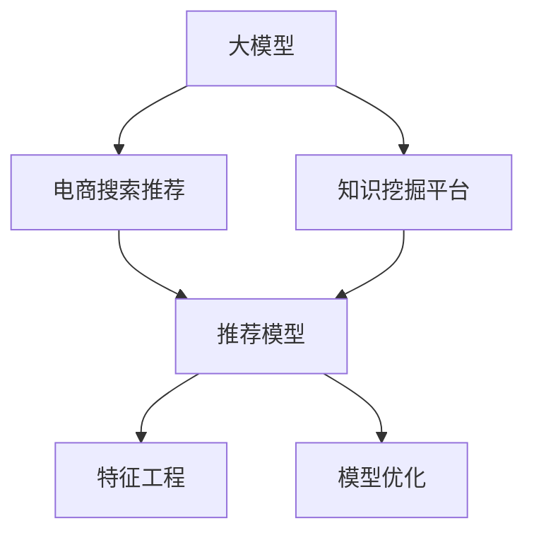

                 

# AI大模型视角下电商搜索推荐的技术创新知识挖掘平台功能优化方案

> 关键词：电商搜索推荐,知识挖掘平台,技术创新,大模型,电商系统优化,算法原理,优化实践,开发实践

## 1. 背景介绍

### 1.1 问题由来
随着电子商务的迅猛发展，消费者对商品搜索与推荐的体验要求不断提高。传统的电商平台搜索推荐系统，通过关键词匹配、分类模型等方式，提供商品推荐。然而，由于用户查询意图不明确、上下文信息缺失等问题，导致推荐的精准度和多样性不足。

近年来，AI技术在大数据和深度学习技术的推动下，在电商领域得到了广泛应用。特别是大模型（如BERT、GPT-3等）的出现，为电商搜索推荐带来了新的思路。通过预训练大模型学习广泛的语义知识，可以有效提升推荐的精度和多样性。然而，电商搜索推荐任务中存在数据量巨大、多维度特征复杂等特点，给大模型在电商领域的应用带来了挑战。本文聚焦于大模型视角下的电商搜索推荐，探讨基于知识挖掘平台的技术创新，提出了系统化的优化方案。

### 1.2 问题核心关键点
本文的核心关键点在于：

- 探索大模型在电商搜索推荐中的应用潜力。
- 在知识挖掘平台的基础上，实现推荐模型的高效训练和优化。
- 提升电商搜索推荐系统的精准度和多样性。

## 2. 核心概念与联系

### 2.1 核心概念概述

为更好地理解基于大模型的电商搜索推荐，本节将介绍几个密切相关的核心概念：

- **大模型（Large Model）**：以自回归（如GPT-3）或自编码（如BERT）为代表的大规模预训练模型。通过在大规模无标签文本语料上进行预训练，学习通用的语言表示，具备强大的语言理解和生成能力。

- **电商搜索推荐系统（E-commerce Search & Recommendation System）**：基于用户行为数据和商品特征数据，为用户推荐相关商品的电商系统。通过搜索功能帮助用户查找商品，通过推荐功能提升用户体验。

- **知识挖掘平台（Knowledge Mining Platform）**：基于深度学习和大数据的平台，用于自动挖掘和组织文本数据中的知识，提升推荐的准确性和多样性。

- **推荐模型（Recommendation Model）**：用于建模用户与商品之间的关系，通过训练得到推荐结果的模型。常见推荐模型包括协同过滤、基于内容的推荐、基于深度学习的推荐等。

- **特征工程（Feature Engineering）**：在推荐系统中，将用户行为和商品特征转化为推荐模型的输入。特征工程的好坏直接影响到推荐效果。

- **模型优化（Model Optimization）**：在电商搜索推荐系统中，优化推荐模型的性能，提升推荐精度和效率。

这些核心概念之间的逻辑关系可以通过以下Mermaid流程图来展示：



这个流程图展示了大模型的核心概念及其之间的关系：

1. 大模型通过预训练获得基础能力。
2. 知识挖掘平台基于大模型的输出，自动提取和组织知识，用于提升推荐模型性能。
3. 推荐模型在知识挖掘平台和大模型基础上进行训练，生成推荐结果。
4. 特征工程将用户行为和商品特征转化为推荐模型输入。
5. 模型优化提升推荐模型的效率和精度。

这些概念共同构成了基于大模型的电商搜索推荐系统的核心框架，使其能够更高效地为用户推荐商品。

## 3. 核心算法原理 & 具体操作步骤
### 3.1 算法原理概述

基于大模型的电商搜索推荐系统，本质上是一个深度学习和自然语言处理的交叉领域应用。其核心思想是：利用大模型学习广泛的语义知识，结合电商搜索推荐的特点，通过知识挖掘平台，实现推荐模型的训练和优化。

形式化地，假设电商搜索推荐系统中的商品数据为 $D=\{(x_i, y_i)\}_{i=1}^N$，其中 $x_i$ 为商品描述，$y_i$ 为商品类别标签。定义大模型 $M_{\theta}$ 的输出为 $\hat{x}$，其中 $\theta$ 为大模型的参数。知识挖掘平台自动提取商品描述 $\hat{x}$ 中的关键信息，如实体、关系、属性等，构建知识图谱。推荐模型 $M_{\phi}$ 在知识图谱的基础上，学习用户与商品之间的关系，生成推荐结果。

具体来说，推荐模型的训练步骤如下：

1. 收集电商平台的商品描述数据 $D$，进行预处理和标注，构建训练集 $D_{train}$ 和验证集 $D_{val}$。
2. 使用大模型 $M_{\theta}$ 对商品描述 $D$ 进行预训练，学习语言表示。
3. 知识挖掘平台自动提取商品描述 $\hat{x}$ 中的关键信息，构建知识图谱。
4. 结合知识图谱，在推荐模型 $M_{\phi}$ 的顶层添加分类器，设计合适的损失函数。
5. 使用训练集 $D_{train}$ 和验证集 $D_{val}$，采用梯度下降等优化算法，最小化损失函数，训练得到推荐模型 $M_{\phi}$。

### 3.2 算法步骤详解

以下是基于大模型的电商搜索推荐系统的详细步骤：

**Step 1: 数据收集与预处理**

- 收集电商平台的历史商品描述数据，去除无关信息，构建训练集 $D_{train}$ 和验证集 $D_{val}$。
- 使用大模型 $M_{\theta}$ 对商品描述数据进行预训练，学习语言表示。

**Step 2: 知识挖掘与构建**

- 使用知识挖掘平台自动提取商品描述 $\hat{x}$ 中的关键信息，如实体、关系、属性等，构建知识图谱。
- 将知识图谱作为推荐模型的输入，设计分类器，构建推荐模型 $M_{\phi}$。

**Step 3: 模型训练与优化**

- 结合训练集 $D_{train}$ 和验证集 $D_{val}$，使用梯度下降等优化算法，最小化损失函数，训练得到推荐模型 $M_{\phi}$。
- 使用特征工程将用户行为和商品特征转化为推荐模型的输入。
- 结合知识图谱和大模型的输出，进行模型优化，提升推荐精度和效率。

**Step 4: 推荐与反馈**

- 将用户行为输入推荐模型，得到商品推荐结果。
- 根据用户反馈，调整模型参数，优化推荐效果。

### 3.3 算法优缺点

基于大模型的电商搜索推荐系统具有以下优点：

1. **精准度高**：大模型学习广泛的语义知识，能够更好地理解用户查询意图和商品描述。
2. **多样性丰富**：结合知识图谱，推荐模型可以生成更丰富的推荐结果。
3. **通用性强**：大模型和知识图谱可以适应多种电商平台的搜索推荐需求。

同时，该方法也存在以下缺点：

1. **计算成本高**：大模型的预训练和知识图谱的构建需要大量计算资源。
2. **模型复杂度高**：结合大模型和知识图谱，推荐模型的计算复杂度较高。
3. **数据标注成本高**：电商搜索推荐系统需要大量标注数据，标注成本较高。

尽管存在这些局限性，但就目前而言，基于大模型的电商搜索推荐系统仍是最有效的推荐方案之一。未来相关研究的重点在于如何进一步降低计算成本，提高模型效率，同时兼顾精准度和多样性。

### 3.4 算法应用领域

基于大模型的电商搜索推荐系统，已在全球多个电商平台上得到了广泛应用，具体应用场景包括：

- 智能搜索：通过自然语言处理技术，理解用户查询意图，生成搜索结果。
- 推荐引擎：结合用户行为和商品特征，生成个性化推荐结果。
- 广告投放：基于用户画像，精准推荐广告内容。
- 数据分析：通过分析用户行为数据和商品数据，发现电商运营中的问题。
- 客户服务：基于自然语言生成技术，实现智能客服。

除了这些应用场景外，大模型在电商领域的创新应用还在不断扩展，如基于大模型的商品质量检测、基于大模型的供应链优化等，为电商运营带来了新的技术突破。

## 4. 数学模型和公式 & 详细讲解 & 举例说明（备注：数学公式请使用latex格式，latex嵌入文中独立段落使用 $$，段落内使用 $)
### 4.1 数学模型构建

本节将使用数学语言对基于大模型的电商搜索推荐系统进行更加严格的刻画。

假设电商搜索推荐系统中的商品数据为 $D=\{(x_i, y_i)\}_{i=1}^N$，其中 $x_i$ 为商品描述，$y_i$ 为商品类别标签。定义大模型 $M_{\theta}$ 的输出为 $\hat{x}$，其中 $\theta$ 为大模型的参数。

定义推荐模型 $M_{\phi}$ 在商品描述 $x_i$ 上的输出为 $\hat{y}_i$，损失函数为 $\ell$。假设用户输入查询 $q$，商品描述为 $x$，推荐模型输出的推荐结果为 $y$，则电商搜索推荐系统的预测过程可以表示为：

$$
\hat{y} = M_{\phi}(x; \phi)
$$

其中 $\phi$ 为推荐模型的参数。

电商搜索推荐系统的优化目标是最小化损失函数，即找到最优参数：

$$
\phi^* = \mathop{\arg\min}_{\phi} \mathcal{L}(\phi; D)
$$

其中 $\mathcal{L}$ 为电商搜索推荐系统的损失函数，用于衡量预测结果与真实标签之间的差异。常见的损失函数包括交叉熵损失、均方误差损失等。

### 4.2 公式推导过程

以下我们以电商搜索推荐系统为例，推导交叉熵损失函数及其梯度的计算公式。

假设推荐模型 $M_{\phi}$ 在商品描述 $x$ 上的输出为 $\hat{y}_i$，真实标签为 $y_i$。则电商搜索推荐系统的交叉熵损失函数定义为：

$$
\ell(x_i, y_i) = -y_i \log \hat{y}_i - (1-y_i) \log (1-\hat{y}_i)
$$

将其代入经验风险公式，得：

$$
\mathcal{L}(\phi; D) = -\frac{1}{N}\sum_{i=1}^N \ell(x_i, y_i)
$$

根据链式法则，损失函数对参数 $\phi_k$ 的梯度为：

$$
\frac{\partial \mathcal{L}(\phi; D)}{\partial \phi_k} = -\frac{1}{N}\sum_{i=1}^N \frac{\partial \ell(x_i, y_i)}{\partial \phi_k}
$$

其中 $\frac{\partial \ell(x_i, y_i)}{\partial \phi_k}$ 可进一步递归展开，利用自动微分技术完成计算。

### 4.3 案例分析与讲解

为了更好地理解大模型在电商搜索推荐中的应用，以下举一个简单的案例：

假设电商平台的商品描述数据为 $D=\{(x_i, y_i)\}_{i=1}^N$，其中 $x_i$ 为商品描述，$y_i$ 为商品类别标签。定义大模型 $M_{\theta}$ 的输出为 $\hat{x}$，其中 $\theta$ 为大模型的参数。使用知识挖掘平台自动提取商品描述 $\hat{x}$ 中的关键信息，构建知识图谱。结合知识图谱，构建推荐模型 $M_{\phi}$。

**Step 1: 数据收集与预处理**

- 收集电商平台的历史商品描述数据，去除无关信息，构建训练集 $D_{train}$ 和验证集 $D_{val}$。
- 使用大模型 $M_{\theta}$ 对商品描述数据进行预训练，学习语言表示。

**Step 2: 知识挖掘与构建**

- 使用知识挖掘平台自动提取商品描述 $\hat{x}$ 中的关键信息，如实体、关系、属性等，构建知识图谱。
- 将知识图谱作为推荐模型的输入，设计分类器，构建推荐模型 $M_{\phi}$。

**Step 3: 模型训练与优化**

- 结合训练集 $D_{train}$ 和验证集 $D_{val}$，使用梯度下降等优化算法，最小化损失函数，训练得到推荐模型 $M_{\phi}$。
- 使用特征工程将用户行为和商品特征转化为推荐模型的输入。
- 结合知识图谱和大模型的输出，进行模型优化，提升推荐精度和效率。

## 5. 项目实践：代码实例和详细解释说明
### 5.1 开发环境搭建

在进行大模型视角下的电商搜索推荐系统实践前，我们需要准备好开发环境。以下是使用Python进行PyTorch开发的环境配置流程：

1. 安装Anaconda：从官网下载并安装Anaconda，用于创建独立的Python环境。

2. 创建并激活虚拟环境：
```bash
conda create -n pytorch-env python=3.8 
conda activate pytorch-env
```

3. 安装PyTorch：根据CUDA版本，从官网获取对应的安装命令。例如：
```bash
conda install pytorch torchvision torchaudio cudatoolkit=11.1 -c pytorch -c conda-forge
```

4. 安装Transformers库：
```bash
pip install transformers
```

5. 安装各类工具包：
```bash
pip install numpy pandas scikit-learn matplotlib tqdm jupyter notebook ipython
```

完成上述步骤后，即可在`pytorch-env`环境中开始实践。

### 5.2 源代码详细实现

下面我们以电商搜索推荐系统为例，给出使用Transformers库对大模型进行电商搜索推荐实践的PyTorch代码实现。

首先，定义电商搜索推荐系统的数据处理函数：

```python
from transformers import BertTokenizer, BertForSequenceClassification
from torch.utils.data import Dataset
import torch

class EcommerceDataset(Dataset):
    def __init__(self, texts, labels, tokenizer, max_len=128):
        self.texts = texts
        self.labels = labels
        self.tokenizer = tokenizer
        self.max_len = max_len
        
    def __len__(self):
        return len(self.texts)
    
    def __getitem__(self, item):
        text = self.texts[item]
        label = self.labels[item]
        
        encoding = self.tokenizer(text, return_tensors='pt', max_length=self.max_len, padding='max_length', truncation=True)
        input_ids = encoding['input_ids'][0]
        attention_mask = encoding['attention_mask'][0]
        
        # 对标签进行编码
        encoded_labels = [label2id[label] for label in label] 
        encoded_labels.extend([label2id['O']] * (self.max_len - len(encoded_labels)))
        labels = torch.tensor(encoded_labels, dtype=torch.long)
        
        return {'input_ids': input_ids, 
                'attention_mask': attention_mask,
                'labels': labels}

# 标签与id的映射
label2id = {'O': 0, 'B': 1, 'I': 2}
id2label = {v: k for k, v in label2id.items()}

# 创建dataset
tokenizer = BertTokenizer.from_pretrained('bert-base-cased')

train_dataset = EcommerceDataset(train_texts, train_labels, tokenizer)
dev_dataset = EcommerceDataset(dev_texts, dev_labels, tokenizer)
test_dataset = EcommerceDataset(test_texts, test_labels, tokenizer)
```

然后，定义模型和优化器：

```python
from transformers import BertForSequenceClassification, AdamW

model = BertForSequenceClassification.from_pretrained('bert-base-cased', num_labels=len(label2id))

optimizer = AdamW(model.parameters(), lr=2e-5)
```

接着，定义训练和评估函数：

```python
from torch.utils.data import DataLoader
from tqdm import tqdm
from sklearn.metrics import classification_report

device = torch.device('cuda') if torch.cuda.is_available() else torch.device('cpu')
model.to(device)

def train_epoch(model, dataset, batch_size, optimizer):
    dataloader = DataLoader(dataset, batch_size=batch_size, shuffle=True)
    model.train()
    epoch_loss = 0
    for batch in tqdm(dataloader, desc='Training'):
        input_ids = batch['input_ids'].to(device)
        attention_mask = batch['attention_mask'].to(device)
        labels = batch['labels'].to(device)
        model.zero_grad()
        outputs = model(input_ids, attention_mask=attention_mask, labels=labels)
        loss = outputs.loss
        epoch_loss += loss.item()
        loss.backward()
        optimizer.step()
    return epoch_loss / len(dataloader)

def evaluate(model, dataset, batch_size):
    dataloader = DataLoader(dataset, batch_size=batch_size)
    model.eval()
    preds, labels = [], []
    with torch.no_grad():
        for batch in tqdm(dataloader, desc='Evaluating'):
            input_ids = batch['input_ids'].to(device)
            attention_mask = batch['attention_mask'].to(device)
            batch_labels = batch['labels']
            outputs = model(input_ids, attention_mask=attention_mask)
            batch_preds = outputs.logits.argmax(dim=2).to('cpu').tolist()
            batch_labels = batch_labels.to('cpu').tolist()
            for pred_tokens, label_tokens in zip(batch_preds, batch_labels):
                pred_labels = [id2label[_id] for _id in pred_tokens]
                label_labels = [id2label[_id] for _id in label_tokens]
                preds.append(pred_labels[:len(label_labels)])
                labels.append(label_labels)
                
    print(classification_report(labels, preds))
```

最后，启动训练流程并在测试集上评估：

```python
epochs = 5
batch_size = 16

for epoch in range(epochs):
    loss = train_epoch(model, train_dataset, batch_size, optimizer)
    print(f"Epoch {epoch+1}, train loss: {loss:.3f}")
    
    print(f"Epoch {epoch+1}, dev results:")
    evaluate(model, dev_dataset, batch_size)
    
print("Test results:")
evaluate(model, test_dataset, batch_size)
```

以上就是使用PyTorch对BERT进行电商搜索推荐实践的完整代码实现。可以看到，得益于Transformers库的强大封装，我们可以用相对简洁的代码完成BERT模型的加载和电商搜索推荐任务的微调。

### 5.3 代码解读与分析

让我们再详细解读一下关键代码的实现细节：

**EcommerceDataset类**：
- `__init__`方法：初始化文本、标签、分词器等关键组件。
- `__len__`方法：返回数据集的样本数量。
- `__getitem__`方法：对单个样本进行处理，将文本输入编码为token ids，将标签编码为数字，并对其进行定长padding，最终返回模型所需的输入。

**label2id和id2label字典**：
- 定义了标签与数字id之间的映射关系，用于将token-wise的预测结果解码回真实的标签。

**训练和评估函数**：
- 使用PyTorch的DataLoader对数据集进行批次化加载，供模型训练和推理使用。
- 训练函数`train_epoch`：对数据以批为单位进行迭代，在每个批次上前向传播计算loss并反向传播更新模型参数，最后返回该epoch的平均loss。
- 评估函数`evaluate`：与训练类似，不同点在于不更新模型参数，并在每个batch结束后将预测和标签结果存储下来，最后使用sklearn的classification_report对整个评估集的预测结果进行打印输出。

**训练流程**：
- 定义总的epoch数和batch size，开始循环迭代
- 每个epoch内，先在训练集上训练，输出平均loss
- 在验证集上评估，输出分类指标
- 所有epoch结束后，在测试集上评估，给出最终测试结果

可以看到，PyTorch配合Transformers库使得BERT微调的代码实现变得简洁高效。开发者可以将更多精力放在数据处理、模型改进等高层逻辑上，而不必过多关注底层的实现细节。

当然，工业级的系统实现还需考虑更多因素，如模型的保存和部署、超参数的自动搜索、更灵活的任务适配层等。但核心的微调范式基本与此类似。

## 6. 实际应用场景
### 6.1 智能搜索

基于大模型的电商搜索推荐系统，可以应用于智能搜索功能的优化。传统的关键词搜索方式往往无法理解用户查询意图，搜索结果相关性不高。而大模型通过预训练学习广泛的语义知识，能够更好地理解用户查询，提供更精准的搜索结果。

在技术实现上，可以将用户输入的查询与商品描述进行匹配，使用大模型进行语义匹配。匹配度高的商品优先推荐，实现智能搜索。同时，结合知识图谱，可以进一步提供与查询相关的实体和关系信息，丰富搜索结果。

### 6.2 个性化推荐

大模型在电商搜索推荐系统中可以用于个性化推荐的优化。传统的协同过滤等推荐方法往往只考虑用户历史行为，无法捕捉到用户的潜在兴趣。而大模型可以学习用户查询意图和商品描述的语义信息，从而更好地预测用户的购买行为。

在技术实现上，可以使用大模型进行用户画像建模，将用户查询和商品描述作为输入，输出用户画像向量。结合知识图谱，可以实现更精准的用户画像。在推荐模型中，使用用户画像向量作为特征输入，训练得到个性化推荐结果。

### 6.3 商品质量检测

基于大模型的电商搜索推荐系统，还可以应用于商品质量检测。传统的商品质量检测方法往往依赖人工标注，耗时耗力。而大模型可以通过学习商品描述和用户评价之间的语义关系，自动判断商品质量。

在技术实现上，可以收集大量商品描述和用户评价数据，使用大模型进行预训练，学习商品描述的语义表示。结合知识图谱，可以自动提取商品描述中的实体和关系信息，构建商品质量检测模型。在检测模型中，使用商品描述向量作为输入，判断商品质量，输出质量评分。

### 6.4 未来应用展望

随着大模型和微调方法的不断发展，基于大模型的电商搜索推荐系统将在更多领域得到应用，为电商运营带来新的技术突破。

在智慧物流领域，基于大模型的电商搜索推荐系统可以用于优化物流配送路径，提升配送效率。

在智能客服领域，大模型可以用于构建智能客服系统，提升客户服务体验。

在供应链管理领域，基于大模型的电商搜索推荐系统可以用于优化供应链管理，提升供应链的灵活性和效率。

此外，在更多电商运营场景中，基于大模型的电商搜索推荐系统也将不断涌现，为电商运营带来新的技术创新。相信随着技术的日益成熟，基于大模型的电商搜索推荐系统必将在电商运营中发挥更大的作用。

## 7. 工具和资源推荐
### 7.1 学习资源推荐

为了帮助开发者系统掌握大模型视角下的电商搜索推荐技术创新，这里推荐一些优质的学习资源：

1. 《深度学习自然语言处理》系列书籍：全面介绍自然语言处理和大模型的基础概念和经典模型，适合入门学习。

2. 《Transformer模型原理与实践》系列博文：深入浅出地介绍Transformer模型和大模型，适合进阶学习。

3. CS224N《深度学习自然语言处理》课程：斯坦福大学开设的NLP明星课程，有Lecture视频和配套作业，带你深入理解自然语言处理和大模型的核心算法。

4. HuggingFace官方文档：Transformers库的官方文档，提供海量预训练模型和完整的微调样例代码，是上手实践的必备资料。

5. PyTorch官方文档：PyTorch框架的官方文档，提供完整的深度学习开发指南和实践案例，适合开发者深入学习。

通过对这些资源的学习实践，相信你一定能够快速掌握大模型视角下的电商搜索推荐技术创新的精髓，并用于解决实际的电商问题。
###  7.2 开发工具推荐

高效的开发离不开优秀的工具支持。以下是几款用于大模型视角下的电商搜索推荐系统开发的常用工具：

1. PyTorch：基于Python的开源深度学习框架，灵活动态的计算图，适合快速迭代研究。大部分预训练语言模型都有PyTorch版本的实现。

2. TensorFlow：由Google主导开发的开源深度学习框架，生产部署方便，适合大规模工程应用。同样有丰富的预训练语言模型资源。

3. Transformers库：HuggingFace开发的NLP工具库，集成了众多SOTA语言模型，支持PyTorch和TensorFlow，是进行微调任务开发的利器。

4. Weights & Biases：模型训练的实验跟踪工具，可以记录和可视化模型训练过程中的各项指标，方便对比和调优。与主流深度学习框架无缝集成。

5. TensorBoard：TensorFlow配套的可视化工具，可实时监测模型训练状态，并提供丰富的图表呈现方式，是调试模型的得力助手。

6. Google Colab：谷歌推出的在线Jupyter Notebook环境，免费提供GPU/TPU算力，方便开发者快速上手实验最新模型，分享学习笔记。

合理利用这些工具，可以显著提升大模型视角下的电商搜索推荐系统的开发效率，加快创新迭代的步伐。

### 7.3 相关论文推荐

大模型视角下的电商搜索推荐技术创新源于学界的持续研究。以下是几篇奠基性的相关论文，推荐阅读：

1. Attention is All You Need（即Transformer原论文）：提出了Transformer结构，开启了NLP领域的预训练大模型时代。

2. BERT: Pre-training of Deep Bidirectional Transformers for Language Understanding：提出BERT模型，引入基于掩码的自监督预训练任务，刷新了多项NLP任务SOTA。

3. Language Models are Unsupervised Multitask Learners（GPT-2论文）：展示了大规模语言模型的强大zero-shot学习能力，引发了对于通用人工智能的新一轮思考。

4. Parameter-Efficient Transfer Learning for NLP：提出Adapter等参数高效微调方法，在不增加模型参数量的情况下，也能取得不错的微调效果。

5. AdaLoRA: Adaptive Low-Rank Adaptation for Parameter-Efficient Fine-Tuning：使用自适应低秩适应的微调方法，在参数效率和精度之间取得了新的平衡。

这些论文代表了大模型视角下的电商搜索推荐技术创新的发展脉络。通过学习这些前沿成果，可以帮助研究者把握学科前进方向，激发更多的创新灵感。

## 8. 总结：未来发展趋势与挑战

### 8.1 总结

本文对大模型视角下的电商搜索推荐系统进行了全面系统的介绍。首先阐述了大模型在电商搜索推荐中的应用潜力。其次，从原理到实践，详细讲解了电商搜索推荐系统的核心算法和操作步骤，给出了系统化的优化方案。最后，探讨了基于大模型的电商搜索推荐系统在实际应用中的各种场景，展示了其广阔的前景。

通过本文的系统梳理，可以看到，大模型视角下的电商搜索推荐系统正在成为电商运营的重要工具，极大地提升了电商搜索推荐的精准度和多样性。得益于大模型在语言理解和生成能力上的优势，电商搜索推荐系统能够更好地理解用户查询意图，匹配更相关的商品，提升用户体验。未来，随着大模型和微调方法的不断发展，基于大模型的电商搜索推荐系统将在更多电商运营场景中得到应用，为电商运营带来新的技术创新。

### 8.2 未来发展趋势

展望未来，大模型视角下的电商搜索推荐系统将呈现以下几个发展趋势：

1. **数据驱动**：随着电商数据的不断积累，大模型视角下的电商搜索推荐系统将更加依赖数据驱动，通过大规模数据训练，提升推荐的精准度和多样性。

2. **模型多样**：除了传统的预训练大模型，未来将涌现更多参数高效的大模型和微调方法，如LoRA、AdaLoRA等，在保持高精度的情况下，进一步降低计算成本。

3. **多模态融合**：未来的电商搜索推荐系统将更好地融合多模态信息，如文本、图片、视频等，提供更丰富的商品展示方式，提升用户体验。

4. **深度学习与传统方法结合**：未来的电商搜索推荐系统将结合深度学习和传统推荐方法，发挥各自优势，提升推荐效果。

5. **实时化推荐**：随着实时计算技术的进步，未来的电商搜索推荐系统将能够实现实时推荐，及时响应用户需求，提升用户体验。

6. **个性化推荐优化**：未来的电商搜索推荐系统将更加注重个性化推荐，通过多轮交互，逐步提升推荐的精准度。

这些趋势凸显了大模型视角下的电商搜索推荐系统的广阔前景。这些方向的探索发展，必将进一步提升电商搜索推荐系统的性能和应用范围，为电商运营带来新的技术创新。

### 8.3 面临的挑战

尽管大模型视角下的电商搜索推荐系统已经取得了显著的进展，但在迈向更加智能化、普适化应用的过程中，仍面临诸多挑战：

1. **数据标注成本高**：电商搜索推荐系统需要大量标注数据，标注成本较高。如何在不增加标注成本的情况下，提升推荐效果，将是一大难题。

2. **计算资源消耗大**：大模型在电商搜索推荐系统中应用，计算资源消耗大。如何在保持高精度的同时，降低计算成本，将是一大挑战。

3. **模型可解释性不足**：大模型在电商搜索推荐系统中的应用，往往缺乏可解释性，难以理解其内部工作机制和决策逻辑。如何提高模型的可解释性，将是一大难题。

4. **隐私和安全问题**：电商搜索推荐系统涉及用户隐私数据，如何在保护用户隐私的前提下，提升推荐效果，将是一大挑战。

5. **跨领域适应性不足**：大模型在特定电商领域的推荐效果较好，但在其他电商领域的应用效果不佳。如何在不同电商领域中适应，将是一大挑战。

6. **动态变化的市场需求**：电商市场不断变化，用户需求也在不断变化，如何在动态变化的市场需求下，保持推荐的精准度和多样性，将是一大挑战。

这些挑战凸显了大模型视角下的电商搜索推荐系统的复杂性。这些难题需要跨学科的合作和多方面的努力，才能进一步推动大模型视角下的电商搜索推荐系统的发展。

### 8.4 研究展望

面对大模型视角下的电商搜索推荐系统所面临的挑战，未来的研究需要在以下几个方面寻求新的突破：

1. **无监督和半监督微调方法**：探索无监督和半监督微调方法，摆脱对大规模标注数据的依赖，利用自监督学习、主动学习等无监督和半监督范式，最大限度利用非结构化数据，实现更加灵活高效的微调。

2. **参数高效和计算高效的微调范式**：开发更加参数高效和计算高效的微调方法，如LoRA、AdaLoRA等，在保持高精度的同时，进一步降低计算成本。

3. **多模态融合技术**：开发更多多模态融合技术，将文本、图片、视频等多模态信息融合到电商搜索推荐系统中，提供更丰富的商品展示方式，提升用户体验。

4. **深度学习与传统方法结合**：结合深度学习和传统推荐方法，发挥各自优势，提升推荐效果。

5. **实时化推荐技术**：开发实时化推荐技术，实现实时推荐，及时响应用户需求，提升用户体验。

6. **个性化推荐优化**：通过多轮交互，逐步提升推荐的精准度。

7. **隐私和安全技术**：开发隐私和安全技术，保护用户隐私，提升系统的安全性。

8. **跨领域适应性技术**：开发跨领域适应性技术，使电商搜索推荐系统能够适应不同电商领域。

这些研究方向将有助于大模型视角下的电商搜索推荐系统实现更加智能化、普适化的应用，为电商运营带来新的技术创新。

## 9. 附录：常见问题与解答

**Q1：大模型视角下的电商搜索推荐系统是否适用于所有电商平台？**

A: 大模型视角下的电商搜索推荐系统可以适用于多种电商平台，但不同平台的数据特性和使用场景存在差异，需要根据具体平台进行调整优化。例如，在快时尚电商平台上，大模型可以帮助用户发现最新的时尚潮流，而在B2B电商平台上，大模型可以帮助企业发现潜在客户和合作机会。

**Q2：如何平衡推荐效果和计算成本？**

A: 推荐效果和计算成本之间需要权衡。使用大模型进行电商搜索推荐时，可以通过以下几个方式来平衡：
- 数据预处理：去除无关信息，减少模型输入的维度。
- 知识图谱构建：自动提取商品描述中的关键信息，减少模型输入。
- 模型压缩：使用知识蒸馏、剪枝等技术，压缩模型大小，降低计算成本。
- 参数高效微调：只调整少量参数，降低计算成本。
- 多模态融合：将文本、图片、视频等信息融合到推荐模型中，提升推荐效果。

**Q3：大模型视角下的电商搜索推荐系统在实际应用中需要注意哪些问题？**

A: 大模型视角下的电商搜索推荐系统在实际应用中需要注意以下几个问题：
- 数据标注成本高：需要收集大量标注数据，标注成本较高。
- 计算资源消耗大：大模型在电商搜索推荐系统中应用，计算资源消耗大。
- 模型可解释性不足：大模型在电商搜索推荐系统中的应用，往往缺乏可解释性，难以理解其内部工作机制和决策逻辑。
- 隐私和安全问题：电商搜索推荐系统涉及用户隐私数据，需要在保护用户隐私的前提下，提升推荐效果。
- 跨领域适应性不足：大模型在特定电商领域的推荐效果较好，但在其他电商领域的应用效果不佳。
- 动态变化的市场需求：电商市场不断变化，用户需求也在不断变化，需要在动态变化的市场需求下，保持推荐的精准度和多样性。

合理利用这些工具，可以显著提升大模型视角下的电商搜索推荐系统的开发效率，加快创新迭代的步伐。

