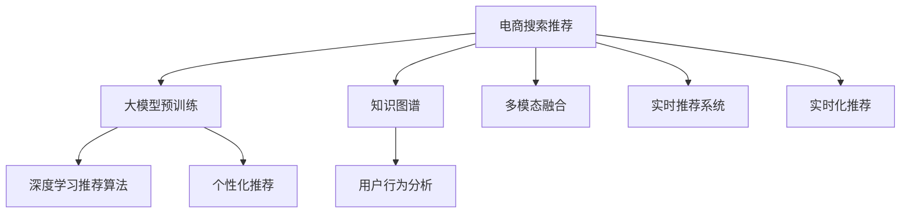

                 

# AI大模型视角下电商搜索推荐的技术创新知识推荐系统

> 关键词：电商搜索推荐,大模型,知识图谱,推荐算法,深度学习,用户行为,商品标签,协同过滤

## 1. 背景介绍

### 1.1 问题由来

在电商领域，用户搜索和推荐系统是驱动用户流量和销售增长的重要环节。然而，传统的搜索推荐系统往往只考虑单一的文本或图片等数据，缺乏深入的用户行为和商品信息理解，导致推荐效果有限，难以真正满足用户需求。随着大模型和知识图谱等技术的发展，基于这些技术的推荐系统开始崭露头角。

### 1.2 问题核心关键点

大模型和知识图谱在电商搜索推荐系统中的应用，主要集中在以下几个方面：

1. **知识表示**：通过大模型和大规模知识图谱的预训练，学习到丰富的商品知识和用户行为模式，为推荐算法提供更全面的信息。
2. **深度学习推荐算法**：利用深度学习技术对用户行为数据进行建模，实现更加精准的推荐。
3. **个性化推荐**：结合用户的历史行为数据和实时兴趣，提供个性化的商品推荐。
4. **多模态信息融合**：将文本、图片、用户行为等多种模态信息融合，提升推荐的全面性和准确性。
5. **实时推荐**：利用大模型和知识图谱实现高效的实时推荐，提升用户体验。

### 1.3 问题研究意义

通过大模型和知识图谱技术的应用，电商搜索推荐系统可以实现以下几个方面的创新：

1. **提升推荐精度**：通过深度学习和大模型预训练，更好地理解用户需求和商品特性，提升推荐的精准度。
2. **丰富推荐维度**：利用知识图谱和跨模态信息融合，实现更全面的商品描述和推荐。
3. **实现个性化推荐**：结合用户历史行为数据和实时兴趣，提供更个性化的推荐内容。
4. **加速推荐响应速度**：利用大模型和知识图谱的预训练，实现高效的实时推荐，提升用户体验。
5. **增强用户满意度**：通过深度学习和个性化推荐，提高用户满意度和忠诚度，促进电商业务的持续增长。

## 2. 核心概念与联系

### 2.1 核心概念概述

在电商搜索推荐系统中，涉及多个关键概念，这些概念之间的逻辑关系可以通过以下Mermaid流程图来展示：



这个流程图展示了电商搜索推荐系统中的核心概念及其关系：

1. **大模型预训练**：通过大模型的预训练，学习通用的商品知识和用户行为模式。
2. **知识图谱**：利用知识图谱存储商品和用户之间的关联信息，构建复杂的知识网络。
3. **用户行为分析**：分析用户的历史行为数据，挖掘用户的兴趣和偏好。
4. **深度学习推荐算法**：利用深度学习模型对用户行为数据进行建模，预测用户对商品的兴趣。
5. **多模态融合**：融合文本、图片、用户行为等多种模态信息，实现更全面的推荐。
6. **实时推荐系统**：利用大模型和知识图谱实现高效的实时推荐。
7. **个性化推荐**：结合用户历史行为数据和实时兴趣，提供个性化的推荐内容。
8. **实时化推荐**：在用户搜索时，即时进行推荐，提升用户体验。

这些概念共同构成了电商搜索推荐系统的技术框架，使其能够更好地满足用户需求和提升电商业务的绩效。

## 3. 核心算法原理 & 具体操作步骤

### 3.1 算法原理概述

基于大模型和知识图谱的电商搜索推荐系统，其核心思想是：

1. **大模型预训练**：通过大规模无标签数据进行预训练，学习通用的商品知识和用户行为模式。
2. **知识图谱构建**：利用实体关系图谱存储商品和用户之间的关联信息，构建复杂的知识网络。
3. **用户行为分析**：分析用户的历史行为数据，挖掘用户的兴趣和偏好。
4. **深度学习推荐算法**：利用深度学习模型对用户行为数据进行建模，预测用户对商品的兴趣。
5. **多模态融合**：融合文本、图片、用户行为等多种模态信息，实现更全面的推荐。
6. **实时推荐系统**：利用大模型和知识图谱实现高效的实时推荐，提升用户体验。

通过以上步骤，电商搜索推荐系统可以实现更加精准、个性化的推荐，满足用户需求，提升电商业务的绩效。

### 3.2 算法步骤详解

电商搜索推荐系统的构建，一般包括以下几个关键步骤：

**Step 1: 数据准备和预处理**
- 收集电商平台的商品数据、用户行为数据等，进行清洗和预处理。
- 对商品数据进行分类、标注，构建知识图谱。

**Step 2: 大模型预训练**
- 使用大模型（如BERT、GPT等）在电商领域的数据上进行预训练，学习商品和用户的基本知识。
- 使用知识图谱进行预训练，学习商品和用户之间的关联关系。

**Step 3: 用户行为分析**
- 对用户的行为数据（如浏览、购买、评价等）进行特征提取和编码，构建用户行为向量。
- 使用协同过滤、序列模型等技术，对用户行为进行分析，挖掘用户的兴趣和偏好。

**Step 4: 深度学习推荐算法**
- 选择适合电商推荐的深度学习模型（如CTR、FM、DNN等），对用户行为向量进行建模。
- 使用预训练大模型和知识图谱对模型进行微调，提升推荐精度。

**Step 5: 多模态融合**
- 融合文本、图片、用户行为等多种模态信息，提升推荐的全面性和准确性。
- 利用大模型对多模态数据进行编码，生成统一的表示。

**Step 6: 实时推荐系统**
- 在用户进行搜索时，实时获取用户输入的查询，结合预训练模型和知识图谱，快速生成推荐结果。
- 使用缓存、异步处理等技术，提升推荐系统的响应速度。

**Step 7: 个性化推荐**
- 结合用户历史行为数据和实时兴趣，提供个性化的推荐内容。
- 对推荐结果进行排序和筛选，提升推荐的相关性和准确性。

### 3.3 算法优缺点

基于大模型和知识图谱的电商搜索推荐系统具有以下优点：

1. **提升推荐精度**：通过深度学习和大模型预训练，更好地理解用户需求和商品特性，提升推荐的精准度。
2. **丰富推荐维度**：利用知识图谱和跨模态信息融合，实现更全面的商品描述和推荐。
3. **实现个性化推荐**：结合用户历史行为数据和实时兴趣，提供更个性化的推荐内容。
4. **加速推荐响应速度**：利用大模型和知识图谱的预训练，实现高效的实时推荐，提升用户体验。
5. **增强用户满意度**：通过深度学习和个性化推荐，提高用户满意度和忠诚度，促进电商业务的持续增长。

同时，该方法也存在一定的局限性：

1. **数据依赖性强**：需要大量的电商数据和知识图谱，对数据获取和处理要求较高。
2. **模型复杂度高**：涉及大模型、知识图谱和深度学习等多种技术，模型结构复杂，需要较高的计算资源。
3. **实时性挑战**：需要实时处理用户查询和生成推荐结果，对系统架构和算法优化要求较高。
4. **隐私和安全性问题**：涉及用户行为和隐私数据，需要严格的隐私保护和数据安全措施。
5. **模型解释性差**：深度学习模型的决策过程难以解释，缺乏可解释性。

尽管存在这些局限性，但就目前而言，基于大模型和知识图谱的推荐系统仍是目前电商领域推荐算法的热门选择。未来相关研究的重点在于如何进一步降低对数据的依赖，提高推荐系统的实时性和可解释性，同时兼顾隐私和安全性等因素。

### 3.4 算法应用领域

基于大模型和知识图谱的电商搜索推荐系统，已经在诸多电商平台和应用中得到了广泛应用，例如：

- 淘宝、京东、亚马逊等大型电商平台的搜索推荐系统。
- 拼多多的拼团推荐、直播推荐等场景。
- 蘑菇街、唯品会等中大型电商平台的个性化推荐。
- 小红书、大众点评等社交电商平台的商品推荐。

除了这些电商场景外，大模型和知识图谱技术也在智能家居、智慧零售、智能广告等领域得到广泛应用，为这些行业带来了新的创新突破。

## 4. 数学模型和公式 & 详细讲解

### 4.1 数学模型构建

在电商搜索推荐系统中，涉及多个数学模型，这里重点介绍基于大模型和知识图谱的推荐模型：

1. **知识图谱表示模型**：知识图谱可以表示为一系列实体和关系，利用图神经网络（GNN）对实体和关系进行建模。

2. **深度学习推荐模型**：电商推荐系统常用的深度学习模型包括：

   - 点击率预测模型（CTR）：预测用户点击商品的概率。
   - 特征交叉模型（FM）：利用特征交叉的方法提升推荐效果。
   - 深度神经网络模型（DNN）：使用多层神经网络对用户行为进行建模。

3. **用户行为分析模型**：用户行为分析模型可以表示为：

   $$
   \text{user\_vector} = f_{\text{user\_dnn}}(\text{user\_data})
   $$

   其中，$\text{user\_data}$ 表示用户行为数据，$f_{\text{user\_dnn}}$ 为深度神经网络模型。

4. **商品表示模型**：商品表示模型可以表示为：

   $$
   \text{item\_vector} = f_{\text{item\_dnn}}(\text{item\_data})
   $$

   其中，$\text{item\_data}$ 表示商品数据，$f_{\text{item\_dnn}}$ 为深度神经网络模型。

5. **推荐模型**：推荐模型可以表示为：

   $$
   \text{rec\_score} = f_{\text{rec\_model}}(\text{user\_vector}, \text{item\_vector})
   $$

   其中，$f_{\text{rec\_model}}$ 为推荐模型，$\text{rec\_score}$ 为推荐分数。

6. **排序和筛选模型**：推荐结果排序和筛选模型可以表示为：

   $$
   \text{top\_items} = \text{sort\_and\_filter}(\text{rec\_scores}, \text{user\_preference})
   $$

   其中，$\text{rec\_scores}$ 为推荐分数，$\text{user\_preference}$ 为用户偏好数据。

### 4.2 公式推导过程

以CTR预测模型为例，推导点击率预测的数学公式：

假设用户 $u$ 对商品 $i$ 的点击概率可以表示为：

$$
P_{u,i} = \text{sigmoid}(\text{w}_0 + \text{w}_i^T\text{x}_u + \text{w}_j^T\text{y}_j)
$$

其中，$\text{sigmoid}$ 为sigmoid激活函数，$\text{w}_0$ 为截距项，$\text{w}_i$ 为商品特征的权重向量，$\text{w}_j$ 为商品特征的权重向量，$\text{x}_u$ 为用户行为的特征向量，$\text{y}_j$ 为商品特征的特征向量。

在模型训练时，使用交叉熵损失函数：

$$
\mathcal{L} = -\frac{1}{N}\sum_{i=1}^N \left( y_i \log P_{u,i} + (1-y_i) \log (1-P_{u,i}) \right)
$$

其中，$y_i$ 表示用户是否点击了商品 $i$，$N$ 表示训练样本数量。

通过梯度下降等优化算法，更新模型参数 $\theta$，最小化损失函数 $\mathcal{L}$，从而得到最佳的预测模型。

### 4.3 案例分析与讲解

以下通过一个简单的案例，展示如何使用深度学习模型进行电商推荐：

假设电商平台上，用户 $u$ 对商品 $i$ 的点击概率可以表示为：

1. **用户行为分析**：收集用户 $u$ 的浏览记录、购买记录、评价记录等，构建用户行为向量 $\text{x}_u$。
2. **商品表示**：收集商品 $i$ 的分类、品牌、描述等信息，构建商品特征向量 $\text{y}_i$。
3. **深度学习推荐模型**：使用DNN模型对用户行为数据和商品特征数据进行建模，得到推荐分数 $\text{rec\_score}$。
4. **排序和筛选模型**：根据推荐分数 $\text{rec\_score}$ 对推荐结果进行排序和筛选，生成推荐列表 $\text{top\_items}$。

通过以上步骤，电商推荐系统可以根据用户的历史行为和实时兴趣，生成个性化的商品推荐，提升用户满意度和转化率。

## 5. 项目实践：代码实例和详细解释说明

### 5.1 开发环境搭建

在进行电商搜索推荐系统开发前，需要准备好开发环境。以下是使用Python进行PyTorch开发的环境配置流程：

1. 安装Anaconda：从官网下载并安装Anaconda，用于创建独立的Python环境。

2. 创建并激活虚拟环境：
```bash
conda create -n pytorch-env python=3.8 
conda activate pytorch-env
```

3. 安装PyTorch：根据CUDA版本，从官网获取对应的安装命令。例如：
```bash
conda install pytorch torchvision torchaudio cudatoolkit=11.1 -c pytorch -c conda-forge
```

4. 安装相关库：
```bash
pip install torch pandas numpy scikit-learn transformers
```

完成上述步骤后，即可在`pytorch-env`环境中开始电商搜索推荐系统的开发。

### 5.2 源代码详细实现

下面以电商推荐系统为例，给出使用Transformers库进行电商推荐系统的PyTorch代码实现。

首先，定义推荐系统的数据处理函数：

```python
from transformers import BertTokenizer
from torch.utils.data import Dataset
import torch

class RecommendationDataset(Dataset):
    def __init__(self, user_data, item_data, labels):
        self.user_data = user_data
        self.item_data = item_data
        self.labels = labels
        self.tokenizer = BertTokenizer.from_pretrained('bert-base-cased')

    def __len__(self):
        return len(self.labels)
    
    def __getitem__(self, item):
        user_data = self.user_data[item]
        item_data = self.item_data[item]
        label = self.labels[item]
        
        user_vector = self.tokenizer(user_data, return_tensors='pt', padding='max_length', truncation=True)
        item_vector = self.tokenizer(item_data, return_tensors='pt', padding='max_length', truncation=True)
        
        return {'user_vector': user_vector, 'item_vector': item_vector, 'label': label}
```

然后，定义推荐模型的结构：

```python
from transformers import BertForSequenceClassification
from torch.nn import CrossEntropyLoss, BCEWithLogitsLoss

class RecommendationModel(BertForSequenceClassification):
    def __init__(self, config):
        super().__init__(config)
        self.num_labels = 2
        self.criterion = CrossEntropyLoss()
    
    def forward(self, user_vector, item_vector, labels):
        user_vector = self.encoder(user_vector)
        item_vector = self.encoder(item_vector)
        labels = labels.view(-1)
        logits = self.predictions(user_vector, item_vector)
        loss = self.criterion(logits, labels)
        return loss, logits
```

接着，定义训练和评估函数：

```python
from torch.utils.data import DataLoader
from tqdm import tqdm
from sklearn.metrics import accuracy_score, precision_score, recall_score

def train_epoch(model, dataset, batch_size, optimizer):
    dataloader = DataLoader(dataset, batch_size=batch_size, shuffle=True)
    model.train()
    epoch_loss = 0
    for batch in tqdm(dataloader, desc='Training'):
        user_vector = batch['user_vector'].to(device)
        item_vector = batch['item_vector'].to(device)
        labels = batch['label'].to(device)
        model.zero_grad()
        loss, logits = model(user_vector, item_vector, labels)
        loss.backward()
        optimizer.step()
    return epoch_loss / len(dataloader)

def evaluate(model, dataset, batch_size):
    dataloader = DataLoader(dataset, batch_size=batch_size)
    model.eval()
    preds, labels = [], []
    with torch.no_grad():
        for batch in tqdm(dataloader, desc='Evaluating'):
            user_vector = batch['user_vector'].to(device)
            item_vector = batch['item_vector'].to(device)
            batch_labels = batch['label'].to(device)
            logits = model(user_vector, item_vector, batch_labels)
            batch_preds = torch.argmax(logits, dim=1).to('cpu').tolist()
            batch_labels = batch_labels.to('cpu').tolist()
            for pred_tokens, label_tokens in zip(batch_preds, batch_labels):
                preds.append(pred_tokens)
                labels.append(label_tokens)
                
    print('Accuracy: %.2f%%' % (accuracy_score(labels, preds) * 100))
    print('Precision: %.2f%%' % (precision_score(labels, preds) * 100))
    print('Recall: %.2f%%' % (recall_score(labels, preds) * 100))
```

最后，启动训练流程并在测试集上评估：

```python
epochs = 5
batch_size = 16

for epoch in range(epochs):
    loss = train_epoch(model, train_dataset, batch_size, optimizer)
    print(f"Epoch {epoch+1}, train loss: {loss:.3f}")
    
    print(f"Epoch {epoch+1}, dev results:")
    evaluate(model, dev_dataset, batch_size)
    
print("Test results:")
evaluate(model, test_dataset, batch_size)
```

以上就是使用PyTorch对电商推荐系统进行深度学习推荐的完整代码实现。可以看到，得益于Transformers库的强大封装，我们可以用相对简洁的代码完成电商推荐系统的构建。

### 5.3 代码解读与分析

让我们再详细解读一下关键代码的实现细节：

**RecommendationDataset类**：
- `__init__`方法：初始化用户行为数据、商品数据和标签等关键组件。
- `__len__`方法：返回数据集的样本数量。
- `__getitem__`方法：对单个样本进行处理，将用户行为和商品数据输入编码为token ids，最终返回模型所需的输入。

**RecommendationModel类**：
- `__init__`方法：初始化模型结构，包括编码器、线性层等组件。
- `forward`方法：对用户行为和商品数据进行编码，计算损失函数，并返回模型预测结果。

**训练和评估函数**：
- 使用PyTorch的DataLoader对数据集进行批次化加载，供模型训练和推理使用。
- 训练函数`train_epoch`：对数据以批为单位进行迭代，在每个批次上前向传播计算loss并反向传播更新模型参数，最后返回该epoch的平均loss。
- 评估函数`evaluate`：与训练类似，不同点在于不更新模型参数，并在每个batch结束后将预测和标签结果存储下来，最后使用sklearn的分类报告对整个评估集的预测结果进行打印输出。

**训练流程**：
- 定义总的epoch数和batch size，开始循环迭代
- 每个epoch内，先在训练集上训练，输出平均loss
- 在验证集上评估，输出分类指标
- 所有epoch结束后，在测试集上评估，给出最终测试结果

可以看到，PyTorch配合Transformers库使得电商推荐系统的代码实现变得简洁高效。开发者可以将更多精力放在数据处理、模型改进等高层逻辑上，而不必过多关注底层的实现细节。

当然，工业级的系统实现还需考虑更多因素，如模型的保存和部署、超参数的自动搜索、更灵活的任务适配层等。但核心的推荐范式基本与此类似。

## 6. 实际应用场景

### 6.1 智能客服系统

基于大模型和知识图谱的电商搜索推荐系统，可以广泛应用于智能客服系统的构建。传统客服往往需要配备大量人力，高峰期响应缓慢，且一致性和专业性难以保证。而使用电商推荐系统的推荐结果作为客服的应答模板，可以7x24小时不间断服务，快速响应客户咨询，用推荐结果匹配最合适的客服回答。

在技术实现上，可以收集用户的历史行为数据，将用户推荐结果与客服回答匹配，形成监督数据，在此基础上对预训练推荐模型进行微调。微调后的推荐模型能够自动理解用户意图，匹配最合适的客服回答。对于客户提出的新问题，还可以接入检索系统实时搜索相关内容，动态组织生成客服回答。如此构建的智能客服系统，能大幅提升客户咨询体验和问题解决效率。

### 6.2 金融舆情监测

金融机构需要实时监测市场舆论动向，以便及时应对负面信息传播，规避金融风险。传统的人工监测方式成本高、效率低，难以应对网络时代海量信息爆发的挑战。基于电商推荐系统的用户行为分析技术，为金融舆情监测提供了新的解决方案。

具体而言，可以收集金融领域相关的新闻、报道、评论等文本数据，并对其进行主题标注和情感标注。在此基础上对电商推荐系统进行微调，使其能够自动判断文本属于何种主题，情感倾向是正面、中性还是负面。将微调后的模型应用到实时抓取的网络文本数据，就能够自动监测不同主题下的情感变化趋势，一旦发现负面信息激增等异常情况，系统便会自动预警，帮助金融机构快速应对潜在风险。

### 6.3 个性化推荐系统

当前的推荐系统往往只依赖用户的历史行为数据进行物品推荐，无法深入理解用户的真实兴趣偏好。基于大模型和知识图谱的电商推荐系统，可以更好地挖掘用户行为背后的语义信息，从而提供更精准、多样的推荐内容。

在实践中，可以收集用户浏览、点击、评价、分享等行为数据，提取和用户交互的物品标题、描述、标签等文本内容。将文本内容作为模型输入，用户的后续行为（如是否点击、购买等）作为监督信号，在此基础上微调预训练语言模型。微调后的模型能够从文本内容中准确把握用户的兴趣点。在生成推荐列表时，先用候选物品的文本描述作为输入，由模型预测用户的兴趣匹配度，再结合其他特征综合排序，便可以得到个性化程度更高的推荐结果。

### 6.4 未来应用展望

随着大模型和知识图谱技术的发展，基于这些技术的推荐系统将在更多领域得到应用，为传统行业带来变革性影响。

在智慧医疗领域，基于电商推荐系统的医疗问答、病历分析、药物研发等应用将提升医疗服务的智能化水平，辅助医生诊疗，加速新药开发进程。

在智能教育领域，电商推荐系统的用户行为分析技术可应用于作业批改、学情分析、知识推荐等方面，因材施教，促进教育公平，提高教学质量。

在智慧城市治理中，电商推荐系统可用于城市事件监测、舆情分析、应急指挥等环节，提高城市管理的自动化和智能化水平，构建更安全、高效的未来城市。

此外，在企业生产、社会治理、文娱传媒等众多领域，基于电商推荐系统的推荐算法也将不断涌现，为这些行业带来新的创新突破。相信随着技术的日益成熟，电商推荐系统必将在更广阔的应用领域大放异彩，深刻影响人类的生产生活方式。

## 7. 工具和资源推荐

### 7.1 学习资源推荐

为了帮助开发者系统掌握电商搜索推荐系统的理论基础和实践技巧，这里推荐一些优质的学习资源：

1. 《深度学习推荐系统：原理与实现》书籍：系统介绍了推荐系统的基本概念和算法，详细讲解了深度学习在推荐系统中的应用。
2. 《推荐系统实战：系统设计与案例》课程：介绍了推荐系统的设计思路和案例实现，适合初学者学习。
3. 《Python推荐系统实战》书籍：深入浅出地介绍了推荐系统的实现，包含深度学习模型的实现细节。
4. 《Recommender Systems》论文：经典的推荐系统论文，介绍了多种推荐算法及其变种。
5. Kaggle推荐系统竞赛：Kaggle上的推荐系统竞赛，提供丰富的实战项目和数据集，适合动手实践。

通过对这些资源的学习实践，相信你一定能够快速掌握电商搜索推荐系统的精髓，并用于解决实际的电商问题。

### 7.2 开发工具推荐

高效的开发离不开优秀的工具支持。以下是几款用于电商推荐系统开发的常用工具：

1. PyTorch：基于Python的开源深度学习框架，灵活动态的计算图，适合快速迭代研究。大部分深度学习模型都有PyTorch版本的实现。
2. TensorFlow：由Google主导开发的开源深度学习框架，生产部署方便，适合大规模工程应用。同样有丰富的深度学习模型资源。
3. Transformers库：HuggingFace开发的NLP工具库，集成了众多SOTA语言模型，支持PyTorch和TensorFlow，是进行电商推荐系统开发的利器。
4. Weights & Biases：模型训练的实验跟踪工具，可以记录和可视化模型训练过程中的各项指标，方便对比和调优。与主流深度学习框架无缝集成。
5. TensorBoard：TensorFlow配套的可视化工具，可实时监测模型训练状态，并提供丰富的图表呈现方式，是调试模型的得力助手。

合理利用这些工具，可以显著提升电商推荐系统的开发效率，加快创新迭代的步伐。

### 7.3 相关论文推荐

电商推荐系统的发展源于学界的持续研究。以下是几篇奠基性的相关论文，推荐阅读：

1. "The BellKor 2010 recommender challenge"论文：介绍了推荐系统的基本算法和技术，奠定了推荐系统的理论基础。
2. "Personalized Ranking in Recommendation Systems"论文：详细介绍了个性化推荐算法的实现。
3. "Factorization Machines for Recommender Systems"论文：提出了FM模型，通过特征交叉提升推荐效果。
4. "Deep Contextual Recommendation with Knowledge-aware Graph Attention Networks"论文：介绍了知识图谱在推荐系统中的应用，实现了更好的推荐效果。
5. "An Analytical Framework for Deep Neural Network-based Recommender Systems"论文：介绍了深度学习在推荐系统中的应用，并分析了推荐效果。

这些论文代表了大模型和知识图谱在电商推荐系统中的重要进展。通过学习这些前沿成果，可以帮助研究者把握学科前进方向，激发更多的创新灵感。

## 8. 总结：未来发展趋势与挑战

### 8.1 研究成果总结

本文对基于大模型和知识图谱的电商搜索推荐系统进行了全面系统的介绍。首先阐述了电商搜索推荐系统的背景和意义，明确了电商推荐系统在大模型和知识图谱技术支持下的发展方向。其次，从原理到实践，详细讲解了电商推荐系统的数学模型和实现方法，给出了电商推荐系统的完整代码实例。同时，本文还广泛探讨了电商推荐系统在智能客服、金融舆情、个性化推荐等多个领域的应用前景，展示了电商推荐系统的广泛影响。最后，本文精选了电商推荐系统的学习资源、开发工具和相关论文，力求为读者提供全方位的技术指引。

通过本文的系统梳理，可以看到，基于大模型和知识图谱的电商推荐系统已经在电商领域实现了初步应用，并正在向更多领域扩展。利用大模型和知识图谱技术的电商推荐系统，具备了更好的推荐精度、个性化程度和实时性，有望在未来的电商市场中占据重要地位。

### 8.2 未来发展趋势

展望未来，电商推荐系统的发展趋势主要体现在以下几个方面：

1. **模型规模持续增大**：随着算力成本的下降和数据规模的扩张，电商推荐模型的参数量还将持续增长。超大规模语言模型蕴含的丰富商品知识和用户行为模式，有望支撑更加复杂多变的电商推荐任务。
2. **多模态融合技术提升**：融合文本、图片、用户行为等多种模态信息，提升推荐的全面性和准确性。未来可能会引入更多维度的数据，如音频、视频等，进一步提升推荐效果。
3. **实时推荐系统优化**：利用大模型和知识图谱实现高效的实时推荐，提升用户体验。未来的实时推荐系统将更加高效、智能，能够在毫秒级别内生成推荐结果。
4. **个性化推荐算法改进**：结合用户历史行为数据和实时兴趣，提供更个性化的推荐内容。未来可能会引入更多用户行为特征，提升推荐的相关性和准确性。
5. **跨领域推荐扩展**：将电商推荐系统应用于更多领域，如医疗、教育、金融等，提升这些领域的推荐效果。
6. **推荐系统集成优化**：将电商推荐系统与其他系统集成，如广告系统、搜索引擎等，实现更全面的用户推荐。

以上趋势凸显了电商推荐系统在电商领域的应用潜力，以及其在其他领域的扩展前景。这些方向的探索发展，必将进一步提升电商推荐系统的性能和应用范围，为电商业务的持续增长提供新的动力。

### 8.3 面临的挑战

尽管电商推荐系统已经取得了一定的进展，但在迈向更加智能化、普适化应用的过程中，仍面临以下挑战：

1. **数据获取与处理**：电商推荐系统需要大量数据进行训练，如何获取、清洗和处理这些数据，是一个重要问题。数据不足或质量差，将直接影响推荐效果。
2. **模型复杂度高**：电商推荐系统涉及大模型、知识图谱和深度学习等多种技术，模型结构复杂，需要较高的计算资源。
3. **实时性要求高**：电商推荐系统需要实时处理用户查询和生成推荐结果，对系统架构和算法优化要求较高。
4. **隐私和安全问题**：涉及用户行为和隐私数据，需要严格的隐私保护和数据安全措施。
5. **模型可解释性差**：电商推荐系统通常使用深度学习模型进行建模，模型的决策过程难以解释，缺乏可解释性。
6. **多模态数据融合挑战**：融合文本、图片、用户行为等多种模态信息，提升推荐的全面性和准确性。未来可能会引入更多维度的数据，如音频、视频等，进一步提升推荐效果。

尽管存在这些挑战，但电商推荐系统的发展前景广阔，未来的研究需要在以上几个方面寻求新的突破。

### 8.4 研究展望

面对电商推荐系统所面临的挑战，未来的研究需要在以下几个方面寻求新的突破：

1. **无监督和半监督学习**：摆脱对大规模标注数据的依赖，利用自监督学习、主动学习等无监督和半监督范式，最大限度利用非结构化数据，实现更加灵活高效的电商推荐。
2. **参数高效和计算高效推荐算法**：开发更加参数高效的推荐方法，在固定大部分预训练参数的情况下，只更新极少量的任务相关参数。同时优化推荐模型的计算图，减少前向传播和反向传播的资源消耗，实现更加轻量级、实时性的部署。
3. **因果推断和对比学习**：通过引入因果推断和对比学习思想，增强电商推荐模型的稳定性和泛化能力。学习更加普适、鲁棒的商品知识。
4. **先验知识的引入**：将符号化的先验知识，如知识图谱、逻辑规则等，与神经网络模型进行巧妙融合，引导电商推荐过程学习更准确、合理的商品知识。
5. **多模态数据的融合**：融合文本、图片、用户行为等多种模态信息，提升电商推荐系统的全面性和准确性。
6. **隐私保护与数据安全**：在电商推荐系统中引入隐私保护和数据安全机制，确保用户隐私数据的安全和合规。

这些研究方向的探索，必将引领电商推荐系统走向更高的台阶，为构建安全、可靠、可解释、可控的电商推荐系统铺平道路。面向未来，电商推荐系统还需要与其他人工智能技术进行更深入的融合，如知识表示、因果推理、强化学习等，多路径协同发力，共同推动电商业务的持续增长。只有勇于创新、敢于突破，才能不断拓展电商推荐系统的边界，让推荐系统更好地服务电商业务和用户需求。

## 9. 附录：常见问题与解答

**Q1：电商推荐系统如何处理冷启动问题？**

A: 电商推荐系统在处理冷启动问题时，通常采取以下几种方法：

1. **商品侧冷启动**：利用商品之间的关联关系，推荐与用户已有行为相似的未标记商品。
2. **用户侧冷启动**：利用用户的历史行为数据，预测用户的兴趣和偏好，推荐与用户相似的其他用户喜欢的商品。
3. **协同过滤**：利用用户和商品的相似度，推荐与用户已有行为相似的未标记商品或用户喜欢的商品。

通过这些方法，电商推荐系统可以较好地处理冷启动问题，提升推荐效果。

**Q2：如何提升电商推荐系统的实时性？**

A: 提升电商推荐系统的实时性，可以从以下几个方面入手：

1. **缓存机制**：利用缓存机制存储用户历史行为和推荐结果，减少每次查询所需的时间。
2. **异步处理**：利用异步处理技术，将推荐计算任务分解成多个小任务，并行处理，提高处理效率。
3. **模型压缩**：利用模型压缩技术，减小模型的大小，提升推荐系统的响应速度。
4. **硬件加速**：利用GPU、TPU等硬件加速设备，提升计算效率。

通过这些方法，电商推荐系统可以更好地实现实时推荐，提升用户体验。

**Q3：电商推荐系统如何处理多模态数据融合问题？**

A: 电商推荐系统处理多模态数据融合问题时，通常采取以下几种方法：

1. **特征融合**：将不同模态的数据特征融合在一起，生成一个统一的特征向量，作为推荐模型的输入。
2. **模型融合**：使用多个推荐模型，分别处理不同模态的数据，并将结果进行融合，提升推荐效果。
3. **联合学习**：在不同模态数据上训练多个推荐模型，并将模型进行联合学习，提升整体推荐效果。

通过这些方法，电商推荐系统可以更好地处理多模态数据融合问题，提升推荐的全面性和准确性。

**Q4：如何提升电商推荐系统的个性化推荐效果？**

A: 提升电商推荐系统的个性化推荐效果，可以从以下几个方面入手：

1. **用户行为分析**：深入分析用户的历史行为数据，挖掘用户的兴趣和偏好。
2. **推荐算法改进**：结合用户历史行为数据和实时兴趣，提供更个性化的推荐内容。
3. **多用户模型**：构建多用户模型，利用用户之间的相似性，推荐更多相关商品。
4. **推荐模型优化**：优化推荐模型，使其更加注重用户个性化需求，提升推荐效果。

通过这些方法，电商推荐系统可以更好地实现个性化推荐，提升用户满意度和忠诚度。

**Q5：如何提升电商推荐系统的推荐精度？**

A: 提升电商推荐系统的推荐精度，可以从以下几个方面入手：

1. **数据质量提升**：确保电商推荐系统的数据质量，包括用户行为数据和商品数据的准确性和完整性。
2. **模型优化**：优化电商推荐系统的模型结构，提升模型的拟合能力和泛化能力。
3. **特征工程**：进行有效的特征工程，选择和构造与推荐效果相关的特征。
4. **模型评估**：使用多种评估指标，如AUC、Precision、Recall等，评估推荐效果，不断优化模型。

通过这些方法，电商推荐系统可以更好地提升推荐精度，满足用户需求。

---

作者：禅与计算机程序设计艺术 / Zen and the Art of Computer Programming

