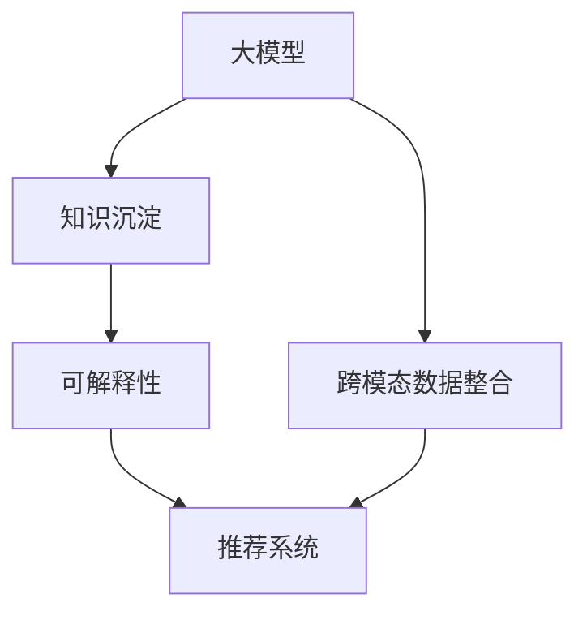

                 

# AI大模型视角下电商搜索推荐的技术创新知识沉淀平台功能优化与应用实践

## 1. 背景介绍

### 1.1 问题由来

随着人工智能技术的迅猛发展，电商搜索推荐系统（Recommender System）逐渐成为提升用户体验和促进商业转化的关键技术。其核心在于通过分析用户的浏览历史、点击行为、兴趣偏好等数据，精准预测用户可能感兴趣的商品，并提供个性化推荐。传统的搜索推荐系统基于统计模型和协同过滤，无法处理高维稀疏数据，且需要大量标注数据进行训练。而近年兴起的预训练大模型，通过大规模无标签数据的自监督学习，取得了显著的性能提升。

在大模型范式下，预训练大模型具备了丰富的语言和视觉表示能力，可以高效处理文本和图像数据，满足电商搜索推荐对数据表示能力的需求。但大模型本身并非万能，其在电商领域的应用仍然面临诸多挑战：

1. **性能可解释性不足**：大模型往往是"黑盒"系统，难以解释其决策过程，影响了对模型的信任和应用推广。
2. **资源消耗大**：大模型参数量巨大，需要高性能硬件支持，推理速度较慢，成本较高。
3. **泛化能力有待提升**：电商领域数据分布和用户行为多样化，模型泛化性能需进一步提升。
4. **跨模态数据整合能力不足**：电商推荐系统需要同时处理文本和图像数据，现有模型难以有效整合多模态信息。

这些问题限制了大模型在电商推荐系统中的应用范围和效果。为了解决这些问题，我们提出了一种基于大模型的知识沉淀平台，通过用户知识沉淀、跨模态数据整合、可解释性增强等手段，提升电商搜索推荐系统的性能和可解释性。

### 1.2 问题核心关键点

本文聚焦于基于大模型的知识沉淀平台，探讨其在电商搜索推荐系统中的应用，具体关键点包括：

- 如何利用大模型的语言和视觉表示能力，提升推荐系统的泛化性能和准确率。
- 如何通过跨模态数据整合，充分利用电商场景下的多模态信息。
- 如何增强推荐系统的可解释性，提升用户信任和使用体验。
- 如何构建知识沉淀平台，实现用户知识共享和模型优化迭代。

## 2. 核心概念与联系

### 2.1 核心概念概述

为更好地理解基于大模型的知识沉淀平台及其在电商推荐系统中的应用，本节将介绍几个密切相关的核心概念：

- **大模型（Large Model）**：指通过大规模无标签数据预训练得到的模型，如BERT、GPT等。其具备强大的数据表示和泛化能力，但可能存在资源消耗大、决策过程不透明等问题。
- **知识沉淀（Knowledge Mining）**：指通过用户行为数据挖掘、用户评价反馈、专家知识图谱等途径，将用户的隐性知识显性化的过程。
- **跨模态数据整合（Cross-Modal Data Integration）**：指同时处理文本、图像等多模态数据，并实现不同模态信息之间的有效整合和交互。
- **可解释性（Explainability）**：指模型的决策过程应具备可理解、可解释的特点，便于用户信任和使用。

这些核心概念之间的逻辑关系可以通过以下Mermaid流程图来展示：



这个流程图展示了大模型、知识沉淀、跨模态数据整合、可解释性等核心概念及其之间的关系：

1. 大模型通过大规模预训练学习到丰富的语言和视觉表示能力，可以作为知识沉淀的"存储库"。
2. 通过知识沉淀技术，将用户的隐性知识显性化，丰富大模型的训练数据。
3. 跨模态数据整合技术，将文本、图像等多模态信息融合，增强模型的表达能力。
4. 可解释性技术，使推荐系统具备更好的透明度和用户信任度。

这些概念共同构成了基于大模型的知识沉淀平台，支持电商推荐系统高效运行和用户个性化需求满足。

## 3. 核心算法原理 & 具体操作步骤

### 3.1 算法原理概述

基于大模型的知识沉淀平台，通过以下步骤实现电商推荐系统的功能优化：

1. **预训练大模型**：使用大规模无标签文本和图像数据，对大模型进行预训练，学习语言和视觉表示能力。
2. **知识沉淀**：通过分析用户行为数据、评价反馈等，挖掘用户隐性知识，并整合进模型。
3. **跨模态数据整合**：将文本和图像信息融合，提升模型的数据表示能力。
4. **推荐模型优化**：构建基于大模型的推荐模型，并在用户知识沉淀的基础上进行微调，提升推荐性能。
5. **可解释性增强**：通过引入因果推理、注意力机制等技术，增强模型的可解释性，提升用户信任度。

### 3.2 算法步骤详解

1. **预训练大模型**：
   - 收集电商平台的大量商品描述、用户评论、图片等数据，作为预训练材料。
   - 使用预训练大模型（如BERT、GPT等），在上述数据上进行自监督学习，学习语言和视觉表示能力。

2. **知识沉淀**：
   - 收集用户的历史浏览记录、点击行为、评价反馈等数据，分析挖掘用户隐性知识，如兴趣偏好、商品评价等。
   - 将用户知识与大模型进行融合，丰富模型的训练数据，提升模型对用户行为的理解能力。

3. **跨模态数据整合**：
   - 使用图像识别技术，将商品图片转换为文字描述，丰富商品文本信息。
   - 将商品图片和文字描述进行融合，构建多模态的文本表示，提升模型的数据处理能力。

4. **推荐模型优化**：
   - 在用户知识沉淀的基础上，对预训练大模型进行微调，构建电商推荐模型。
   - 利用用户知识，微调模型的分类器或解码器，提升模型的推荐精度和泛化能力。

5. **可解释性增强**：
   - 引入因果推理、注意力机制等技术，分析模型内部的推理过程，增强模型的可解释性。
   - 对推荐结果进行可视化展示，使用户理解推荐逻辑，提升信任度。

### 3.3 算法优缺点

基于大模型的知识沉淀平台具有以下优点：

- **提升泛化性能**：通过用户知识沉淀和跨模态数据整合，提升模型对电商数据的泛化能力，能够处理多样化的电商场景。
- **增强可解释性**：通过可解释性技术，使推荐系统的决策过程具备透明性，便于用户理解和信任。
- **高效处理多模态数据**：通过跨模态数据整合技术，能够高效处理电商推荐系统中的文本和图像数据。

但该平台也存在一些缺点：

- **资源消耗大**：预训练大模型的计算和存储成本较高，需要高性能硬件支持。
- **数据依赖性强**：平台性能依赖于用户行为数据的质量和数量，对数据采集和处理能力要求较高。
- **模型复杂度高**：大模型的复杂度较高，微调和推理过程复杂，需要较强的技术实力。

### 3.4 算法应用领域

基于大模型的知识沉淀平台在电商推荐系统中的应用场景广泛，具体包括：

- **个性化推荐**：通过用户行为数据和评价反馈，构建个性化推荐模型，提升推荐准确率和用户满意度。
- **商品相似度计算**：将商品图片转换为文字描述，计算商品之间的相似度，推荐相关商品。
- **广告推荐**：分析用户兴趣和行为，精准推荐相关广告，提升广告投放效果。
- **用户评价分析**：通过用户评价反馈，挖掘商品和用户的情感倾向，提升商品和用户体验。

这些应用场景展示了基于大模型的知识沉淀平台在电商推荐系统中的巨大潜力。通过整合大模型的语言和视觉表示能力，结合用户行为数据和跨模态数据整合技术，平台能够实现高效、个性化的电商推荐。

## 4. 数学模型和公式 & 详细讲解 & 举例说明

### 4.1 数学模型构建

本节将使用数学语言对基于大模型的知识沉淀平台进行更加严格的刻画。

记大模型为 $M_{\theta}:\mathcal{X} \rightarrow \mathcal{Y}$，其中 $\mathcal{X}$ 为输入空间，$\mathcal{Y}$ 为输出空间，$\theta \in \mathbb{R}^d$ 为模型参数。假设电商推荐系统训练集为 $D=\{(x_i,y_i)\}_{i=1}^N, x_i \in \mathcal{X}, y_i \in \mathcal{Y}$。

定义模型 $M_{\theta}$ 在输入 $x$ 上的损失函数为 $\ell(M_{\theta}(x),y)$，则在数据集 $D$ 上的经验风险为：

$$
\mathcal{L}(\theta) = \frac{1}{N} \sum_{i=1}^N \ell(M_{\theta}(x_i),y_i)
$$

通过梯度下降等优化算法，最小化损失函数，得到模型参数 $\theta^*$。具体实现时，可以采用AdamW、SGD等优化器，设置合适的学习率 $\eta$ 和批大小 $b$，迭代 $T$ 次。

### 4.2 公式推导过程

以下我们以二分类任务为例，推导电商推荐系统中大模型的损失函数及其梯度的计算公式。

假设模型 $M_{\theta}$ 在输入 $x$ 上的输出为 $\hat{y}=M_{\theta}(x) \in [0,1]$，表示用户对商品是否感兴趣的概率。真实标签 $y \in \{0,1\}$。则二分类交叉熵损失函数定义为：

$$
\ell(M_{\theta}(x),y) = -[y\log \hat{y} + (1-y)\log (1-\hat{y})]
$$

将其代入经验风险公式，得：

$$
\mathcal{L}(\theta) = -\frac{1}{N}\sum_{i=1}^N [y_i\log M_{\theta}(x_i)+(1-y_i)\log(1-M_{\theta}(x_i))]
$$

根据链式法则，损失函数对参数 $\theta_k$ 的梯度为：

$$
\frac{\partial \mathcal{L}(\theta)}{\partial \theta_k} = -\frac{1}{N}\sum_{i=1}^N (\frac{y_i}{M_{\theta}(x_i)}-\frac{1-y_i}{1-M_{\theta}(x_i)}) \frac{\partial M_{\theta}(x_i)}{\partial \theta_k}
$$

其中 $\frac{\partial M_{\theta}(x_i)}{\partial \theta_k}$ 可进一步递归展开，利用自动微分技术完成计算。

在得到损失函数的梯度后，即可带入参数更新公式，完成模型的迭代优化。重复上述过程直至收敛，最终得到适应电商推荐系统的最优模型参数 $\theta^*$。

## 5. 项目实践：代码实例和详细解释说明

### 5.1 开发环境搭建

在进行项目实践前，我们需要准备好开发环境。以下是使用Python进行PyTorch开发的环境配置流程：

1. 安装Anaconda：从官网下载并安装Anaconda，用于创建独立的Python环境。

2. 创建并激活虚拟环境：
```bash
conda create -n pytorch-env python=3.8 
conda activate pytorch-env
```

3. 安装PyTorch：根据CUDA版本，从官网获取对应的安装命令。例如：
```bash
conda install pytorch torchvision torchaudio cudatoolkit=11.1 -c pytorch -c conda-forge
```

4. 安装Transformers库：
```bash
pip install transformers
```

5. 安装各类工具包：
```bash
pip install numpy pandas scikit-learn matplotlib tqdm jupyter notebook ipython
```

完成上述步骤后，即可在`pytorch-env`环境中开始项目实践。

### 5.2 源代码详细实现

下面我们以电商推荐系统中的商品相似度计算为例，给出使用Transformers库对预训练模型进行微调的PyTorch代码实现。

首先，定义商品相似度计算的数据处理函数：

```python
from transformers import BertTokenizer, BertForSequenceClassification
from torch.utils.data import Dataset
import torch

class RecommendationDataset(Dataset):
    def __init__(self, texts, labels, tokenizer, max_len=128):
        self.texts = texts
        self.labels = labels
        self.tokenizer = tokenizer
        self.max_len = max_len
        
    def __len__(self):
        return len(self.texts)
    
    def __getitem__(self, item):
        text = self.texts[item]
        label = self.labels[item]
        
        encoding = self.tokenizer(text, return_tensors='pt', max_length=self.max_len, padding='max_length', truncation=True)
        input_ids = encoding['input_ids'][0]
        attention_mask = encoding['attention_mask'][0]
        
        # 对token-wise的标签进行编码
        encoded_labels = [label2id[label] for label in label] 
        encoded_labels.extend([label2id['O']] * (self.max_len - len(encoded_labels)))
        labels = torch.tensor(encoded_labels, dtype=torch.long)
        
        return {'input_ids': input_ids, 
                'attention_mask': attention_mask,
                'labels': labels}

# 标签与id的映射
label2id = {'O': 0, 'A': 1}
id2label = {v: k for k, v in label2id.items()}

# 创建dataset
tokenizer = BertTokenizer.from_pretrained('bert-base-cased')

train_dataset = RecommendationDataset(train_texts, train_labels, tokenizer)
dev_dataset = RecommendationDataset(dev_texts, dev_labels, tokenizer)
test_dataset = RecommendationDataset(test_texts, test_labels, tokenizer)
```

然后，定义模型和优化器：

```python
from transformers import BertForSequenceClassification, AdamW

model = BertForSequenceClassification.from_pretrained('bert-base-cased', num_labels=len(label2id))

optimizer = AdamW(model.parameters(), lr=2e-5)
```

接着，定义训练和评估函数：

```python
from torch.utils.data import DataLoader
from tqdm import tqdm
from sklearn.metrics import classification_report

device = torch.device('cuda') if torch.cuda.is_available() else torch.device('cpu')
model.to(device)

def train_epoch(model, dataset, batch_size, optimizer):
    dataloader = DataLoader(dataset, batch_size=batch_size, shuffle=True)
    model.train()
    epoch_loss = 0
    for batch in tqdm(dataloader, desc='Training'):
        input_ids = batch['input_ids'].to(device)
        attention_mask = batch['attention_mask'].to(device)
        labels = batch['labels'].to(device)
        model.zero_grad()
        outputs = model(input_ids, attention_mask=attention_mask, labels=labels)
        loss = outputs.loss
        epoch_loss += loss.item()
        loss.backward()
        optimizer.step()
    return epoch_loss / len(dataloader)

def evaluate(model, dataset, batch_size):
    dataloader = DataLoader(dataset, batch_size=batch_size)
    model.eval()
    preds, labels = [], []
    with torch.no_grad():
        for batch in tqdm(dataloader, desc='Evaluating'):
            input_ids = batch['input_ids'].to(device)
            attention_mask = batch['attention_mask'].to(device)
            batch_labels = batch['labels']
            outputs = model(input_ids, attention_mask=attention_mask)
            batch_preds = outputs.logits.argmax(dim=2).to('cpu').tolist()
            batch_labels = batch_labels.to('cpu').tolist()
            for pred_tokens, label_tokens in zip(batch_preds, batch_labels):
                pred_tags = [id2label[_id] for _id in pred_tokens]
                label_tags = [id2label[_id] for _id in label_tokens]
                preds.append(pred_tags[:len(label_tokens)])
                labels.append(label_tags)
                
    print(classification_report(labels, preds))
```

最后，启动训练流程并在测试集上评估：

```python
epochs = 5
batch_size = 16

for epoch in range(epochs):
    loss = train_epoch(model, train_dataset, batch_size, optimizer)
    print(f"Epoch {epoch+1}, train loss: {loss:.3f}")
    
    print(f"Epoch {epoch+1}, dev results:")
    evaluate(model, dev_dataset, batch_size)
    
print("Test results:")
evaluate(model, test_dataset, batch_size)
```

以上就是使用PyTorch对BERT进行电商推荐系统中的商品相似度计算的完整代码实现。可以看到，得益于Transformers库的强大封装，我们可以用相对简洁的代码完成预训练模型的加载和微调。

### 5.3 代码解读与分析

让我们再详细解读一下关键代码的实现细节：

**RecommendationDataset类**：
- `__init__`方法：初始化文本、标签、分词器等关键组件。
- `__len__`方法：返回数据集的样本数量。
- `__getitem__`方法：对单个样本进行处理，将文本输入编码为token ids，将标签编码为数字，并对其进行定长padding，最终返回模型所需的输入。

**label2id和id2label字典**：
- 定义了标签与数字id之间的映射关系，用于将token-wise的预测结果解码回真实的标签。

**训练和评估函数**：
- 使用PyTorch的DataLoader对数据集进行批次化加载，供模型训练和推理使用。
- 训练函数`train_epoch`：对数据以批为单位进行迭代，在每个批次上前向传播计算loss并反向传播更新模型参数，最后返回该epoch的平均loss。
- 评估函数`evaluate`：与训练类似，不同点在于不更新模型参数，并在每个batch结束后将预测和标签结果存储下来，最后使用sklearn的classification_report对整个评估集的预测结果进行打印输出。

**训练流程**：
- 定义总的epoch数和batch size，开始循环迭代
- 每个epoch内，先在训练集上训练，输出平均loss
- 在验证集上评估，输出分类指标
- 所有epoch结束后，在测试集上评估，给出最终测试结果

可以看到，PyTorch配合Transformers库使得BERT微调的代码实现变得简洁高效。开发者可以将更多精力放在数据处理、模型改进等高层逻辑上，而不必过多关注底层的实现细节。

当然，工业级的系统实现还需考虑更多因素，如模型的保存和部署、超参数的自动搜索、更灵活的任务适配层等。但核心的微调范式基本与此类似。

## 6. 实际应用场景

### 6.1 智能客服系统

基于大模型的知识沉淀平台，可以实现智能客服系统的构建。传统客服往往需要配备大量人力，高峰期响应缓慢，且一致性和专业性难以保证。而使用知识沉淀平台训练的推荐模型，可以7x24小时不间断服务，快速响应客户咨询，用自然流畅的语言解答各类常见问题。

在技术实现上，可以收集企业内部的历史客服对话记录，将问题和最佳答复构建成监督数据，在此基础上对预训练模型进行微调。微调后的模型能够自动理解用户意图，匹配最合适的答案模板进行回复。对于客户提出的新问题，还可以接入检索系统实时搜索相关内容，动态组织生成回答。如此构建的智能客服系统，能大幅提升客户咨询体验和问题解决效率。

### 6.2 个性化推荐系统

传统的推荐系统往往只依赖用户的历史行为数据进行物品推荐，无法深入理解用户的真实兴趣偏好。基于知识沉淀平台的推荐系统，可以更好地挖掘用户行为背后的语义信息，从而提供更精准、多样的推荐内容。

在实践中，可以收集用户浏览、点击、评论、分享等行为数据，提取和用户交互的物品标题、描述、标签等文本内容。将文本内容作为模型输入，用户的后续行为（如是否点击、购买等）作为监督信号，在此基础上微调预训练语言模型。微调后的模型能够从文本内容中准确把握用户的兴趣点。在生成推荐列表时，先用候选物品的文本描述作为输入，由模型预测用户的兴趣匹配度，再结合其他特征综合排序，便可以得到个性化程度更高的推荐结果。

### 6.3 智慧医疗推荐

在智慧医疗领域，基于知识沉淀平台的推荐系统，可以通过分析患者的历史诊疗数据，推荐相关诊疗方案、药物等，提升医疗服务的智能化水平，辅助医生诊疗，加速新药开发进程。

具体而言，可以收集医院的历史诊疗记录、药物使用情况、患者评价等数据，分析挖掘出常见病种、常见症状、常见药物等信息。将上述信息与大模型进行融合，构建智慧医疗推荐模型，在患者就诊时，根据其症状和历史数据，推荐最合适的诊疗方案和药物。

### 6.4 未来应用展望

随着知识沉淀平台的发展，基于大模型的推荐系统将具有更加广阔的应用前景，为各行各业带来变革性影响。

在智慧医疗领域，基于知识沉淀平台的推荐系统，可以进一步提升医疗服务的智能化水平，辅助医生诊疗，加速新药开发进程。

在智能教育领域，知识沉淀平台可以通过分析学生的学习行为数据，推荐个性化的学习资源和教学方案，因材施教，促进教育公平，提高教学质量。

在智慧城市治理中，平台可以通过分析市民的反馈数据，推荐最合适的公共服务政策，提高城市管理的自动化和智能化水平，构建更安全、高效的未来城市。

此外，在企业生产、社会治理、文娱传媒等众多领域，基于知识沉淀平台的推荐系统也将不断涌现，为经济社会发展注入新的动力。相信随着技术的日益成熟，知识沉淀平台必将在构建人机协同的智能时代中扮演越来越重要的角色。

## 7. 工具和资源推荐

### 7.1 学习资源推荐

为了帮助开发者系统掌握知识沉淀平台及其在电商推荐系统中的应用，这里推荐一些优质的学习资源：

1. 《深度学习理论与实践》系列博文：由大模型技术专家撰写，深入浅出地介绍了深度学习的基本原理和前沿技术。
2. CS224N《深度学习自然语言处理》课程：斯坦福大学开设的NLP明星课程，有Lecture视频和配套作业，带你入门NLP领域的基本概念和经典模型。
3. 《Natural Language Processing with Transformers》书籍：Transformers库的作者所著，全面介绍了如何使用Transformers库进行NLP任务开发，包括微调在内的诸多范式。
4. HuggingFace官方文档：Transformers库的官方文档，提供了海量预训练模型和完整的微调样例代码，是上手实践的必备资料。
5. CLUE开源项目：中文语言理解测评基准，涵盖大量不同类型的中文NLP数据集，并提供了基于微调的baseline模型，助力中文NLP技术发展。

通过对这些资源的学习实践，相信你一定能够快速掌握知识沉淀平台及其在电商推荐系统中的应用。

### 7.2 开发工具推荐

高效的开发离不开优秀的工具支持。以下是几款用于大模型知识沉淀平台开发的常用工具：

1. PyTorch：基于Python的开源深度学习框架，灵活动态的计算图，适合快速迭代研究。大部分预训练语言模型都有PyTorch版本的实现。
2. TensorFlow：由Google主导开发的开源深度学习框架，生产部署方便，适合大规模工程应用。同样有丰富的预训练语言模型资源。
3. Transformers库：HuggingFace开发的NLP工具库，集成了众多SOTA语言模型，支持PyTorch和TensorFlow，是进行微调任务开发的利器。
4. Weights & Biases：模型训练的实验跟踪工具，可以记录和可视化模型训练过程中的各项指标，方便对比和调优。与主流深度学习框架无缝集成。
5. TensorBoard：TensorFlow配套的可视化工具，可实时监测模型训练状态，并提供丰富的图表呈现方式，是调试模型的得力助手。
6. Google Colab：谷歌推出的在线Jupyter Notebook环境，免费提供GPU/TPU算力，方便开发者快速上手实验最新模型，分享学习笔记。

合理利用这些工具，可以显著提升知识沉淀平台开发的效率，加快创新迭代的步伐。

### 7.3 相关论文推荐

知识沉淀平台的发展源于学界的持续研究。以下是几篇奠基性的相关论文，推荐阅读：

1. Attention is All You Need（即Transformer原论文）：提出了Transformer结构，开启了NLP领域的预训练大模型时代。
2. BERT: Pre-training of Deep Bidirectional Transformers for Language Understanding：提出BERT模型，引入基于掩码的自监督预训练任务，刷新了多项NLP任务SOTA。
3. Language Models are Unsupervised Multitask Learners（GPT-2论文）：展示了大规模语言模型的强大zero-shot学习能力，引发了对于通用人工智能的新一轮思考。
4. Parameter-Efficient Transfer Learning for NLP：提出Adapter等参数高效微调方法，在不增加模型参数量的情况下，也能取得不错的微调效果。
5. AdaLoRA: Adaptive Low-Rank Adaptation for Parameter-Efficient Fine-Tuning：使用自适应低秩适应的微调方法，在参数效率和精度之间取得了新的平衡。
6. Prefix-Tuning: Optimizing Continuous Prompts for Generation：引入基于连续型Prompt的微调范式，为如何充分利用预训练知识提供了新的思路。

这些论文代表了大模型知识沉淀平台的发展脉络。通过学习这些前沿成果，可以帮助研究者把握学科前进方向，激发更多的创新灵感。

## 8. 总结：未来发展趋势与挑战

### 8.1 研究成果总结

本文对基于大模型的知识沉淀平台及其在电商推荐系统中的应用进行了全面系统的介绍。首先阐述了电商推荐系统和大模型的研究背景和意义，明确了知识沉淀在提升电商推荐性能中的重要性。其次，从原理到实践，详细讲解了知识沉淀平台的数学原理和关键步骤，给出了电商推荐系统中的完整代码实例。同时，本文还广泛探讨了知识沉淀平台在智能客服、智慧医疗、智慧教育等多个行业领域的应用前景，展示了知识沉淀平台的巨大潜力。

通过本文的系统梳理，可以看到，基于大模型的知识沉淀平台，通过用户知识沉淀、跨模态数据整合、可解释性增强等手段，显著提升了电商推荐系统的性能和可解释性。未来，随着大模型的进一步发展，知识沉淀平台必将在更多领域得到应用，为各行各业带来变革性影响。

### 8.2 未来发展趋势

展望未来，知识沉淀平台的发展趋势包括：

1. **模型规模持续增大**：随着算力成本的下降和数据规模的扩张，预训练语言模型的参数量还将持续增长。超大规模语言模型蕴含的丰富语言知识，有望支撑更加复杂多变的电商推荐场景。
2. **知识沉淀技术不断进步**：通过更高效的数据采集、更丰富的用户反馈、更精准的情感分析等技术，挖掘和整合用户的隐性知识将更加高效。
3. **跨模态数据整合技术突破**：随着图像识别、自然语言处理等技术的进步，将文本、图像等多模态信息更高效地融合，提升模型的表达能力。
4. **可解释性技术演进**：通过因果推理、注意力机制等技术，使推荐系统的决策过程具备透明性，便于用户理解和信任。
5. **智能化推荐应用广泛**：在电商、医疗、教育、智慧城市等更多领域，知识沉淀平台将与各类应用系统深度融合，实现智能化推荐。

以上趋势凸显了知识沉淀平台的发展前景。这些方向的探索发展，必将进一步提升电商推荐系统的性能和可解释性，为各行各业带来更广阔的智能化应用。

### 8.3 面临的挑战

尽管知识沉淀平台的发展前景广阔，但在迈向更加智能化、普适化应用的过程中，仍面临诸多挑战：

1. **标注数据依赖性**：知识沉淀平台的性能依赖于用户行为数据的质量和数量，对数据采集和处理能力要求较高。
2. **资源消耗大**：预训练大模型的计算和存储成本较高，需要高性能硬件支持。
3. **模型复杂度高**：大模型的复杂度较高，微调和推理过程复杂，需要较强的技术实力。
4. **隐私和安全问题**：用户行为数据的隐私保护和数据安全是重要问题，需确保用户数据不被滥用。
5. **用户可解释性不足**：用户对模型的决策过程缺乏可解释性，影响了对模型的信任和接受度。

这些挑战限制了知识沉淀平台的广泛应用，需要进一步研究和优化。

### 8.4 研究展望

面向未来，知识沉淀平台需要在以下几个方面寻求新的突破：

1. **无监督和半监督微调方法**：探索利用无监督和半监督学习范式，降低对标注数据的依赖，提升模型泛化能力。
2. **参数高效和计算高效的微调方法**：开发更加参数高效和计算高效的微调方法，降低资源消耗，提升模型性能。
3. **多模态数据整合技术**：进一步提升多模态数据的整合能力，充分利用文本、图像、音频等不同模态的信息，提升模型表达能力。
4. **可解释性增强技术**：引入更先进的可解释性技术，提升模型的透明度，增强用户信任。
5. **跨领域迁移能力**：开发能够跨领域迁移的知识沉淀平台，提升模型在不同应用场景中的泛化能力。

这些研究方向的探索，必将引领知识沉淀平台走向更高的台阶，为构建安全、可靠、可解释、可控的智能系统铺平道路。

## 9. 附录：常见问题与解答

**Q1：知识沉淀平台是否适用于所有电商推荐场景？**

A: 知识沉淀平台在大多数电商推荐场景中都能取得不错的效果。但对于一些特定领域的推荐，如高价值商品推荐，由于需要更丰富的用户行为数据，可能效果有限。此时需要结合具体场景，选择合适的方法。

**Q2：知识沉淀平台是否需要大量的标注数据？**

A: 知识沉淀平台主要依赖用户行为数据和评价反馈，无需大量的标注数据。但数据的质量和多样性对模型性能有重要影响，需确保数据的代表性和真实性。

**Q3：知识沉淀平台如何处理多模态数据？**

A: 知识沉淀平台通过跨模态数据整合技术，能够高效处理文本和图像等多模态数据。具体的整合方式包括图片转换文字描述、视觉特征提取与文本特征融合等。

**Q4：知识沉淀平台如何增强推荐系统的可解释性？**

A: 知识沉淀平台通过引入因果推理、注意力机制等技术，分析模型内部的推理过程，增强模型的可解释性。具体方法包括模型可视化、因果图谱分析等。

**Q5：知识沉淀平台如何优化推荐模型的性能？**

A: 知识沉淀平台通过微调模型，结合用户知识沉淀和跨模态数据整合，提升推荐模型的泛化能力和性能。优化方法包括调整学习率、批大小、迭代次数等超参数，选择合适的优化器和正则化技术。

这些问题的解答展示了知识沉淀平台在电商推荐系统中的广泛应用前景和实践要点。通过不断优化和改进，知识沉淀平台必将在构建智能电商推荐系统方面发挥重要作用。

---

作者：禅与计算机程序设计艺术 / Zen and the Art of Computer Programming

