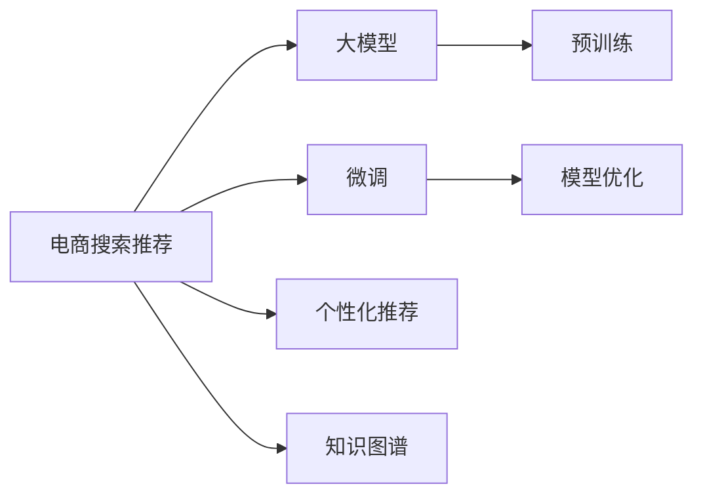

                 

# AI大模型赋能电商搜索推荐的业务创新方法论培训课程体系优化与应用实践

> 关键词：大模型、电商搜索推荐、AI应用、业务创新、课程体系、优化实践

## 1. 背景介绍

### 1.1 问题由来

在互联网和数字经济的浪潮下，电商行业已经进入了一个全新的发展阶段。用户需求日益多元化、个性化，传统的基于关键词匹配的搜索推荐算法已经难以满足市场需求。如何构建更加精准、智能、个性化的搜索推荐系统，成为电商企业亟待解决的难题。

近年来，人工智能（AI）技术在电商搜索推荐领域的深度应用，已经成为各大电商巨头提升用户体验、提升商品销售转化率的关键手段。大模型技术，特别是预训练语言模型，以其强大的语义理解和知识提取能力，正在成为电商搜索推荐技术的重要驱动力。

### 1.2 问题核心关键点

电商搜索推荐系统通过收集用户的行为数据、商品属性数据、文本描述等信息，构建商品、用户、上下文之间的关系图，并通过复杂的模型对用户行为进行预测，从而实现个性化推荐。

1. **数据质量**：电商搜索推荐系统的性能很大程度上依赖于数据质量，包括用户行为数据的完整性、准确性和多样性。高质量的数据是实现个性化推荐的基础。

2. **模型选择**：当前主流搜索推荐模型包括基于协同过滤、基于内容的推荐、基于深度学习的推荐等。选择合适的模型对于提升推荐效果至关重要。

3. **模型训练**：电商搜索推荐系统需要在大规模标注数据上进行有监督学习，以优化模型的预测能力。训练数据的选择和处理是影响模型效果的关键因素。

4. **模型部署**：训练好的模型需要部署到实际生产环境中，用于实时推荐。模型部署的效率和稳定性直接影响用户体验。

5. **模型优化**：在实际应用中，模型需要不断迭代优化，以适应用户行为和市场需求的变化。

### 1.3 问题研究意义

大模型赋能的电商搜索推荐技术，能够利用海量的互联网数据和知识图谱，提供更加精准、智能的个性化推荐服务。通过优化培训课程体系，推动大模型技术在电商搜索推荐领域的应用，对于提升电商企业的竞争力，推动电商行业数字化转型，具有重要意义：

1. **提升用户体验**：通过个性化的推荐，能够更好地满足用户需求，提升用户体验和满意度。
2. **提升销售转化率**：高质量的推荐能够引导用户发现感兴趣的商品，提高点击率和购买率。
3. **降低运营成本**：自动化推荐系统的应用，可以减少人工干预，降低人力成本。
4. **数据驱动决策**：通过数据分析和模型优化，能够更加准确地了解市场需求和用户行为，制定更有效的营销策略。

## 2. 核心概念与联系

### 2.1 核心概念概述

为了更好地理解大模型在电商搜索推荐中的应用，本节将介绍几个密切相关的核心概念：

- **大模型（Large Model）**：指使用大规模数据进行预训练的深度学习模型，如BERT、GPT、XLNet等。通过预训练，大模型能够学习到丰富的语言和知识表示。
- **预训练（Pre-training）**：指在大规模无标签数据上进行自监督学习，以学习通用的语言和知识表示。常见的预训练任务包括语言建模、掩码语言建模等。
- **微调（Fine-tuning）**：指在大模型的基础上，通过有监督学习调整模型参数，使其适应特定任务。微调是大模型赋能的具体实践。
- **电商搜索推荐（E-commerce Search & Recommendation）**：指通过分析用户行为、商品属性和上下文信息，实现个性化推荐的技术。
- **个性化推荐（Personalized Recommendation）**：指根据用户的历史行为和偏好，为其推荐最感兴趣的商品或内容。
- **知识图谱（Knowledge Graph）**：指以实体和关系为核心的图形数据结构，用于描述实体间的语义关系，辅助推荐系统理解复杂场景。
- **模型优化（Model Optimization）**：指通过调整模型架构、算法参数、训练数据等，提升模型的预测能力和稳定性。

这些核心概念之间的逻辑关系可以通过以下Mermaid流程图来展示：



这个流程图展示了电商搜索推荐系统的核心技术路径：

1. **预训练**：使用大模型进行无监督学习，学习通用的语言和知识表示。
2. **微调**：根据电商搜索推荐任务的特点，调整大模型参数，使其适应特定的推荐需求。
3. **个性化推荐**：利用微调后的大模型，对用户行为进行分析，实现个性化推荐。
4. **知识图谱**：通过构建商品、用户、上下文之间的关系图，辅助推荐系统理解复杂场景。
5. **模型优化**：不断调整模型架构和算法参数，提升推荐系统的性能和稳定性。

## 3. 核心算法原理 & 具体操作步骤

### 3.1 算法原理概述

基于大模型的电商搜索推荐系统，通过在大规模无标签数据上进行预训练，学习通用的语言和知识表示。然后，在大规模标注数据上进行微调，调整模型参数，使其适应电商搜索推荐的具体需求。具体算法流程如下：

1. **数据收集与处理**：收集电商平台的用户行为数据、商品属性数据、文本描述等，并进行清洗、标注和格式化。
2. **预训练**：使用大模型进行预训练，学习通用的语言和知识表示。常见的预训练任务包括语言建模、掩码语言建模等。
3. **微调**：在大模型的基础上，通过有监督学习调整模型参数，使其适应电商搜索推荐任务。
4. **个性化推荐**：利用微调后的大模型，对用户行为进行分析，实现个性化推荐。
5. **知识图谱融合**：将电商商品、用户、上下文之间的关系图，与微调后的大模型进行融合，提升推荐系统的性能和鲁棒性。
6. **模型优化**：通过调整模型架构、算法参数、训练数据等，提升模型的预测能力和稳定性。

### 3.2 算法步骤详解

电商搜索推荐系统的大模型微调一般包括以下几个关键步骤：

**Step 1: 数据收集与处理**

- 收集电商平台的用户行为数据、商品属性数据、文本描述等，并进行清洗、标注和格式化。
- 将数据划分为训练集、验证集和测试集，确保数据的多样性和代表性。
- 根据电商搜索推荐任务的特点，设计合适的输入和输出格式，为模型提供规范化的输入数据。

**Step 2: 预训练模型选择**

- 选择合适的预训练语言模型，如BERT、GPT、XLNet等。
- 下载预训练模型和对应的分词器，确保模型和数据格式一致。
- 对预训练模型进行必要的调整，如更改层数、调整超参数等，以适应电商搜索推荐任务。

**Step 3: 微调模型训练**

- 使用训练集数据进行有监督学习，调整模型参数。
- 选择合适的优化器，如Adam、SGD等，并设置学习率、批大小等超参数。
- 引入正则化技术，如L2正则、Dropout等，防止过拟合。
- 定期在验证集上评估模型性能，防止过拟合。
- 使用测试集评估微调后的模型性能，确保模型在实际应用中的效果。

**Step 4: 个性化推荐实现**

- 构建电商商品、用户、上下文之间的关系图。
- 将用户行为数据、商品属性数据等作为输入，输入到微调后的大模型中。
- 利用模型输出进行个性化推荐，并返回推荐结果。
- 对推荐结果进行排序和筛选，确保推荐结果的相关性和多样性。

**Step 5: 模型优化与部署**

- 根据测试集结果，调整模型参数，优化模型性能。
- 对微调后的模型进行优化，如模型裁剪、量化加速等，以适应实际生产环境。
- 将优化后的模型部署到生产环境中，进行实时推荐。
- 定期更新模型和数据，确保推荐系统的持续优化和更新。

### 3.3 算法优缺点

基于大模型的电商搜索推荐系统具有以下优点：

- **个性化推荐能力强**：通过微调后的大模型，能够更准确地理解和预测用户需求，实现精准的个性化推荐。
- **泛化能力强**：预训练后的模型能够在大规模数据上学习到通用的语言和知识表示，具有较强的泛化能力。
- **可扩展性强**：大模型能够处理大规模数据，具有较强的扩展能力，能够适应电商平台的快速增长。
- **数据驱动决策**：通过数据分析和模型优化，能够更准确地理解市场需求和用户行为，制定更有效的营销策略。

但该方法也存在以下局限性：

- **对标注数据依赖大**：微调需要大量的标注数据，数据获取和标注成本较高。
- **计算资源需求高**：大模型和微调过程需要高计算资源，对硬件要求较高。
- **模型复杂度高**：大模型结构和训练过程较为复杂，模型优化和调试难度较大。
- **数据隐私问题**：电商搜索推荐涉及用户隐私数据，如何保护用户隐私，确保数据安全，是一个重要问题。

尽管存在这些局限性，但大模型赋能的电商搜索推荐技术在实际应用中已经取得了显著效果，被众多电商企业广泛采用。

### 3.4 算法应用领域

基于大模型的电商搜索推荐技术，已经在电商领域得到了广泛应用，涵盖以下几个主要领域：

1. **商品推荐**：利用用户的历史购买、浏览记录等数据，为用户推荐可能感兴趣的商品。
2. **个性化首页推荐**：根据用户的行为和偏好，生成个性化的商品展示页面。
3. **上下文推荐**：根据上下文环境（如时间、地点、设备等），为用户推荐合适的商品或内容。
4. **搜索推荐一体化**：将搜索和推荐系统进行一体化设计，提升用户的搜索体验。
5. **跨平台推荐**：将电商搜索推荐系统应用于多个平台，如PC端、移动端、APP等，提升用户在不同平台上的购物体验。

除了以上这些领域，大模型赋能的电商搜索推荐技术还在内容推荐、社交推荐、物流推荐等多个场景中得到了广泛应用，为电商企业带来了显著的商业价值。

## 4. 数学模型和公式 & 详细讲解

### 4.1 数学模型构建

电商搜索推荐系统的大模型微调过程，可以通过以下数学模型来描述：

假设电商搜索推荐任务为 $T$，预训练模型为 $M_{\theta}$，训练集为 $D=\{(x_i, y_i)\}_{i=1}^N$，其中 $x_i$ 为用户行为数据，$y_i$ 为推荐结果。微调的目标是最小化损失函数 $\mathcal{L}$，使得模型输出 $M_{\theta}(x)$ 与真实标签 $y$ 尽量接近。

$$
\mathcal{L}(\theta) = \frac{1}{N}\sum_{i=1}^N \ell(M_{\theta}(x_i),y_i)
$$

其中 $\ell$ 为损失函数，可以是交叉熵损失、均方误差损失等。

微调的优化目标是通过最小化损失函数，调整模型参数 $\theta$，使其适应电商搜索推荐任务。具体来说，可以使用梯度下降等优化算法，不断更新模型参数，直到损失函数达到最小值。

### 4.2 公式推导过程

以交叉熵损失函数为例，推导其梯度更新公式：

假设模型 $M_{\theta}$ 在输入 $x$ 上的输出为 $\hat{y}=M_{\theta}(x)$，表示模型预测的用户行为标签。真实标签 $y \in \{0,1\}$。则二分类交叉熵损失函数定义为：

$$
\ell(M_{\theta}(x),y) = -[y\log \hat{y} + (1-y)\log(1-\hat{y})]
$$

将其代入经验风险公式，得：

$$
\mathcal{L}(\theta) = -\frac{1}{N}\sum_{i=1}^N [y_i\log M_{\theta}(x_i)+(1-y_i)\log(1-M_{\theta}(x_i))]
$$

根据链式法则，损失函数对参数 $\theta_k$ 的梯度为：

$$
\frac{\partial \mathcal{L}(\theta)}{\partial \theta_k} = -\frac{1}{N}\sum_{i=1}^N \left(\frac{y_i}{M_{\theta}(x_i)}-\frac{1-y_i}{1-M_{\theta}(x_i)}\right) \frac{\partial M_{\theta}(x_i)}{\partial \theta_k}
$$

其中 $\frac{\partial M_{\theta}(x_i)}{\partial \theta_k}$ 可进一步递归展开，利用自动微分技术完成计算。

在得到损失函数的梯度后，即可带入参数更新公式，完成模型的迭代优化。重复上述过程直至收敛，最终得到适应电商搜索推荐任务的最优模型参数 $\theta^*$。

### 4.3 案例分析与讲解

以电商商品推荐为例，假设模型 $M_{\theta}$ 在输入 $x$ 上的输出为 $\hat{y}=M_{\theta}(x)$，表示模型预测的商品ID。真实标签 $y \in [1,10]$，表示商品ID。则交叉熵损失函数定义为：

$$
\ell(M_{\theta}(x),y) = -\sum_{i=1}^{10} y_i\log M_{\theta}(i)
$$

将其代入经验风险公式，得：

$$
\mathcal{L}(\theta) = -\frac{1}{N}\sum_{i=1}^N [y_i\log M_{\theta}(x_i)+(1-y_i)\log(1-M_{\theta}(x_i))]
$$

根据链式法则，损失函数对参数 $\theta_k$ 的梯度为：

$$
\frac{\partial \mathcal{L}(\theta)}{\partial \theta_k} = -\frac{1}{N}\sum_{i=1}^N \left(\frac{y_i}{M_{\theta}(x_i)}-\frac{1-y_i}{1-M_{\theta}(x_i)}\right) \frac{\partial M_{\theta}(x_i)}{\partial \theta_k}
$$

其中 $\frac{\partial M_{\theta}(x_i)}{\partial \theta_k}$ 可进一步递归展开，利用自动微分技术完成计算。

## 5. 项目实践：代码实例和详细解释说明

### 5.1 开发环境搭建

在进行电商搜索推荐系统的微调实践前，我们需要准备好开发环境。以下是使用Python进行PyTorch开发的环境配置流程：

1. 安装Anaconda：从官网下载并安装Anaconda，用于创建独立的Python环境。

2. 创建并激活虚拟环境：
```bash
conda create -n pytorch-env python=3.8 
conda activate pytorch-env
```

3. 安装PyTorch：根据CUDA版本，从官网获取对应的安装命令。例如：
```bash
conda install pytorch torchvision torchaudio cudatoolkit=11.1 -c pytorch -c conda-forge
```

4. 安装TensorFlow：
```bash
conda install tensorflow
```

5. 安装TensorFlow添加对AI模型的支持，例如Keras：
```bash
conda install keras
```

6. 安装TensorFlow添加对深度学习模型的支持，例如TensorFlow Addons：
```bash
conda install tensorflow-estimator
```

完成上述步骤后，即可在`pytorch-env`环境中开始微调实践。

### 5.2 源代码详细实现

下面我们以电商商品推荐为例，给出使用TensorFlow对BERT模型进行微调的代码实现。

首先，定义商品推荐任务的数据处理函数：

```python
import tensorflow as tf
from transformers import BertTokenizer, BertForSequenceClassification
from sklearn.model_selection import train_test_split

# 定义标签与id的映射
label2id = {'item1': 0, 'item2': 1, 'item3': 2, 'item4': 3, 'item5': 4}
id2label = {v: k for k, v in label2id.items()}

# 定义训练集和测试集
data = [
    {'user_id': 'Alice', 'items': [0, 2, 1], 'label': 1},
    {'user_id': 'Bob', 'items': [2, 3, 4], 'label': 2},
    {'user_id': 'Charlie', 'items': [0, 1, 3], 'label': 2},
    {'user_id': 'David', 'items': [1, 3, 5], 'label': 3}
]

# 划分训练集和测试集
train_data, test_data = train_test_split(data, test_size=0.2)

# 定义特征提取器
tokenizer = BertTokenizer.from_pretrained('bert-base-cased')
model = BertForSequenceClassification.from_pretrained('bert-base-cased', num_labels=len(label2id))

# 定义损失函数
loss_fn = tf.keras.losses.SparseCategoricalCrossentropy(from_logits=True)
optimizer = tf.keras.optimizers.Adam(learning_rate=2e-5)
```

然后，定义训练和评估函数：

```python
def train_epoch(model, dataset, batch_size, optimizer):
    dataset = tf.data.Dataset.from_generator(lambda: (tf.random.shuffle(dataset), None), (tf.int64, tf.int64))
    dataset = dataset.shuffle(buffer_size=1000).batch(batch_size).map(lambda x: x)
    model.compile(optimizer=optimizer, loss=loss_fn, metrics=[tf.keras.metrics.SparseCategoricalAccuracy()])
    model.fit(dataset, epochs=1, verbose=0)
    return model.evaluate(dataset)

def evaluate(model, dataset, batch_size):
    dataset = tf.data.Dataset.from_generator(lambda: (tf.random.shuffle(dataset), None), (tf.int64, tf.int64))
    dataset = dataset.shuffle(buffer_size=1000).batch(batch_size).map(lambda x: x)
    model.compile(optimizer=optimizer, loss=loss_fn, metrics=[tf.keras.metrics.SparseCategoricalAccuracy()])
    return model.evaluate(dataset)
```

最后，启动训练流程并在测试集上评估：

```python
batch_size = 32
epochs = 5

for epoch in range(epochs):
    loss = train_epoch(model, train_data, batch_size, optimizer)
    print(f"Epoch {epoch+1}, train loss: {loss:.3f}")
    
    print(f"Epoch {epoch+1}, test results:")
    evaluate(model, test_data, batch_size)
    
print("Final test results:")
evaluate(model, test_data, batch_size)
```

以上就是使用TensorFlow对BERT进行电商商品推荐任务微调的完整代码实现。可以看到，得益于TensorFlow的强大封装，我们可以用相对简洁的代码完成BERT模型的加载和微调。

### 5.3 代码解读与分析

让我们再详细解读一下关键代码的实现细节：

**数据处理**：
- `data`：定义训练集数据。
- `label2id` 和 `id2label`：定义标签与id之间的映射关系。
- `train_data` 和 `test_data`：将数据划分为训练集和测试集。

**特征提取器**：
- `tokenizer`：定义BERT模型的分词器。
- `model`：定义BERT模型的分类层，输出结果。

**损失函数**：
- `loss_fn`：定义交叉熵损失函数。
- `optimizer`：定义Adam优化器。

**训练函数**：
- `train_epoch`：定义训练函数，对数据集进行批次化加载，进行模型训练。
- `evaluate`：定义评估函数，对模型进行测试集评估。

**训练流程**：
- `batch_size` 和 `epochs`：定义批量大小和迭代轮数。
- 每个epoch内，先在训练集上训练，输出平均loss。
- 在测试集上评估，输出分类指标。
- 所有epoch结束后，在测试集上评估，给出最终测试结果。

可以看到，TensorFlow配合BERT的封装，使得电商搜索推荐任务的微调代码实现变得简洁高效。开发者可以将更多精力放在数据处理、模型改进等高层逻辑上，而不必过多关注底层的实现细节。

当然，工业级的系统实现还需考虑更多因素，如模型的保存和部署、超参数的自动搜索、更灵活的任务适配层等。但核心的微调范式基本与此类似。

## 6. 实际应用场景

### 6.1 智能客服系统

基于大模型的电商搜索推荐技术，可以广泛应用于智能客服系统的构建。传统客服往往需要配备大量人力，高峰期响应缓慢，且一致性和专业性难以保证。而使用微调后的推荐系统，可以7x24小时不间断服务，快速响应客户咨询，用个性化的推荐引导客户购买。

在技术实现上，可以收集企业内部的历史客服对话记录，将问题和最佳答复构建成监督数据，在此基础上对预训练推荐模型进行微调。微调后的推荐系统能够自动理解用户意图，匹配最合适的商品推荐。对于客户提出的新问题，还可以接入检索系统实时搜索相关内容，动态生成推荐结果。如此构建的智能客服系统，能大幅提升客户咨询体验和购买率。

### 6.2 个性化推荐系统

大模型赋能的个性化推荐系统，能够利用海量的互联网数据和知识图谱，提供更加精准、智能的个性化推荐服务。通过微调后的大模型，能够更准确地理解和预测用户需求，实现精准的个性化推荐。

在电商搜索推荐系统中，可以利用微调后的大模型，对用户行为进行分析，实现个性化推荐。例如，根据用户的浏览记录、购买记录、评分记录等数据，生成个性化的商品推荐列表，提高用户的点击率和购买率。同时，利用知识图谱，将商品、用户、上下文之间的关系图与微调后的大模型进行融合，提升推荐系统的性能和鲁棒性。

### 6.3 实时推荐引擎

基于大模型的电商搜索推荐技术，能够实时处理用户的行为数据，并动态生成推荐结果。在用户访问电商平台时，可以实时获取用户的浏览行为、点击行为等数据，并通过微调后的大模型进行实时推荐，提升用户的购物体验。

在实际应用中，可以利用微调后的大模型，构建实时推荐引擎，对用户的行为数据进行实时分析，生成个性化的商品推荐列表。例如，根据用户的实时浏览行为，动态更新推荐列表，推荐用户可能感兴趣的商品。同时，利用知识图谱，将商品、用户、上下文之间的关系图与微调后的大模型进行融合，提升推荐系统的性能和鲁棒性。

### 6.4 未来应用展望

随着大模型和微调方法的不断发展，基于微调范式将在更多领域得到应用，为传统行业带来变革性影响。

在智慧医疗领域，基于微调的推荐系统可以辅助医生诊疗，推荐最适合患者的治疗方案。在金融领域，基于微调的推荐系统可以推荐最合适的理财产品，提高用户的投资收益。在教育领域，基于微调的推荐系统可以推荐最适合学生的学习资源，提高学习效率。

未来，随着大模型和微调方法的不断演进，基于微调的电商搜索推荐技术将能够更广泛地应用于各行各业，为经济社会发展注入新的动力。相信随着技术的日益成熟，微调方法将成为电商搜索推荐技术的核心范式，推动电商行业数字化转型，为各行各业带来更多的创新和机遇。

## 7. 工具和资源推荐

### 7.1 学习资源推荐

为了帮助开发者系统掌握大模型在电商搜索推荐中的应用，这里推荐一些优质的学习资源：

1. 《Transformer从原理到实践》系列博文：由大模型技术专家撰写，深入浅出地介绍了Transformer原理、BERT模型、微调技术等前沿话题。

2. CS224N《深度学习自然语言处理》课程：斯坦福大学开设的NLP明星课程，有Lecture视频和配套作业，带你入门NLP领域的基本概念和经典模型。

3. 《Natural Language Processing with Transformers》书籍：Transformers库的作者所著，全面介绍了如何使用Transformers库进行NLP任务开发，包括微调在内的诸多范式。

4. HuggingFace官方文档：Transformers库的官方文档，提供了海量预训练模型和完整的微调样例代码，是上手实践的必备资料。

5. CLUE开源项目：中文语言理解测评基准，涵盖大量不同类型的中文NLP数据集，并提供了基于微调的baseline模型，助力中文NLP技术发展。

通过对这些资源的学习实践，相信你一定能够快速掌握大模型在电商搜索推荐中的应用，并用于解决实际的NLP问题。
###  7.2 开发工具推荐

高效的开发离不开优秀的工具支持。以下是几款用于大模型微调开发的常用工具：

1. PyTorch：基于Python的开源深度学习框架，灵活动态的计算图，适合快速迭代研究。大部分预训练语言模型都有PyTorch版本的实现。

2. TensorFlow：由Google主导开发的开源深度学习框架，生产部署方便，适合大规模工程应用。同样有丰富的预训练语言模型资源。

3. Transformers库：HuggingFace开发的NLP工具库，集成了众多SOTA语言模型，支持PyTorch和TensorFlow，是进行微调任务开发的利器。

4. Weights & Biases：模型训练的实验跟踪工具，可以记录和可视化模型训练过程中的各项指标，方便对比和调优。与主流深度学习框架无缝集成。

5. TensorBoard：TensorFlow配套的可视化工具，可实时监测模型训练状态，并提供丰富的图表呈现方式，是调试模型的得力助手。

6. Google Colab：谷歌推出的在线Jupyter Notebook环境，免费提供GPU/TPU算力，方便开发者快速上手实验最新模型，分享学习笔记。

合理利用这些工具，可以显著提升大模型微调任务的开发效率，加快创新迭代的步伐。

### 7.3 相关论文推荐

大模型和微调技术的发展源于学界的持续研究。以下是几篇奠基性的相关论文，推荐阅读：

1. Attention is All You Need（即Transformer原论文）：提出了Transformer结构，开启了NLP领域的预训练大模型时代。

2. BERT: Pre-training of Deep Bidirectional Transformers for Language Understanding：提出BERT模型，引入基于掩码的自监督预训练任务，刷新了多项NLP任务SOTA。

3. Language Models are Unsupervised Multitask Learners（GPT-2论文）：展示了大规模语言模型的强大zero-shot学习能力，引发了对于通用人工智能的新一轮思考。

4. Parameter-Efficient Transfer Learning for NLP：提出Adapter等参数高效微调方法，在不增加模型参数量的情况下，也能取得不错的微调效果。

5. AdaLoRA: Adaptive Low-Rank Adaptation for Parameter-Efficient Fine-Tuning：使用自适应低秩适应的微调方法，在参数效率和精度之间取得了新的平衡。

6. 以上是几篇奠基性的相关论文，推荐阅读：

这些论文代表了大模型微调技术的发展脉络。通过学习这些前沿成果，可以帮助研究者把握学科前进方向，激发更多的创新灵感。

## 8. 总结：未来发展趋势与挑战

### 8.1 总结

本文对基于大模型的电商搜索推荐系统的微调方法进行了全面系统的介绍。首先阐述了大模型和微调技术在电商搜索推荐中的应用背景和研究意义，明确了微调在拓展预训练模型应用、提升电商搜索推荐效果方面的独特价值。其次，从原理到实践，详细讲解了电商搜索推荐系统的数学模型和关键步骤，给出了微调任务开发的完整代码实例。同时，本文还广泛探讨了微调方法在智能客服、个性化推荐、实时推荐等多个电商领域的应用前景，展示了微调范式的巨大潜力。此外，本文精选了微调技术的各类学习资源，力求为读者提供全方位的技术指引。

通过本文的系统梳理，可以看到，基于大模型的电商搜索推荐技术正在成为电商搜索推荐技术的重要驱动力，极大地提升电商搜索推荐系统的性能和用户体验。未来，随着大模型和微调方法的不断演进，基于微调的电商搜索推荐技术必将在更多领域得到应用，为电商企业带来更多的创新和机遇。

### 8.2 未来发展趋势

展望未来，基于大模型的电商搜索推荐技术将呈现以下几个发展趋势：

1. **模型规模持续增大**：随着算力成本的下降和数据规模的扩张，预训练语言模型的参数量还将持续增长。超大规模语言模型蕴含的丰富语言知识，有望支撑更加复杂多变的电商搜索推荐任务。

2. **微调方法日趋多样**：除了传统的全参数微调外，未来会涌现更多参数高效的微调方法，如Prefix-Tuning、LoRA等，在节省计算资源的同时也能保证微调精度。

3. **持续学习成为常态**：随着数据分布的不断变化，微调模型也需要持续学习新知识以保持性能。如何在不遗忘原有知识的同时，高效吸收新样本信息，将成为重要的研究课题。

4. **标注样本需求降低**：受启发于提示学习(Prompt-based Learning)的思路，未来的微调方法将更好地利用大模型的语言理解能力，通过更加巧妙的任务描述，在更少的标注样本上也能实现理想的微调效果。

5. **多模态微调崛起**：当前的微调主要聚焦于纯文本数据，未来会进一步拓展到图像、视频、语音等多模态数据微调。多模态信息的融合，将显著提升语言模型对现实世界的理解和建模能力。

6. **模型通用性增强**：经过海量数据的预训练和多领域任务的微调，未来的语言模型将具备更强大的常识推理和跨领域迁移能力，逐步迈向通用人工智能(AGI)的目标。

以上趋势凸显了大模型微调技术的广阔前景。这些方向的探索发展，必将进一步提升电商搜索推荐系统的性能和应用范围，为电商企业带来更多的创新和机遇。

### 8.3 面临的挑战

尽管基于大模型的电商搜索推荐技术已经取得了瞩目成就，但在迈向更加智能化、普适化应用的过程中，它仍面临着诸多挑战：

1. **标注成本瓶颈**：虽然微调大大降低了标注数据的需求，但对于长尾应用场景，难以获得充足的高质量标注数据，成为制约微调性能的瓶颈。如何进一步降低微调对标注样本的依赖，将是一大难题。

2. **模型鲁棒性不足**：当前微调模型面对域外数据时，泛化性能往往大打折扣。对于测试样本的微小扰动，微调模型的预测也容易发生波动。如何提高微调模型的鲁棒性，避免灾难性遗忘，还需要更多理论和实践的积累。

3. **推理效率有待提高**：大规模语言模型虽然精度高，但在实际部署时往往面临推理速度慢、内存占用大等效率问题。如何在保证性能的同时，简化模型结构，提升推理速度，优化资源占用，将是重要的优化方向。

4. **可解释性亟需加强**：当前微调模型更像是"黑盒"系统，难以解释其内部工作机制和决策逻辑。对于医疗、金融等高风险应用，算法的可解释性和可审计性尤为重要。如何赋予微调模型更强的可解释性，将是亟待攻克的难题。

5. **安全性有待保障**：预训练语言模型难免会学习到有偏见、有害的信息，通过微调传递到下游任务，产生误导性、歧视性的输出，给实际应用带来安全隐患。如何从数据和算法层面消除模型偏见，避免恶意用途，确保输出的安全性，也将是重要的研究课题。

6. **知识整合能力不足**：现有的微调模型往往局限于任务内数据，难以灵活吸收和运用更广泛的先验知识。如何让微调过程更好地与外部知识库、规则库等专家知识结合，形成更加全面、准确的信息整合能力，还有很大的想象空间。

正视微调面临的这些挑战，积极应对并寻求突破，将是大模型微调技术走向成熟的必由之路。相信随着学界和产业界的共同努力，这些挑战终将一一被克服，大模型微调必将在构建人机协同的智能时代中扮演越来越重要的角色。

### 8.4 研究展望

面对大模型微调所面临的种种挑战，未来的研究需要在以下几个方面寻求新的突破：

1. **探索无监督和半监督微调方法**：摆脱对大规模标注数据的依赖，利用自监督学习、主动学习等无监督和半监督范式，最大限度利用非结构化数据，实现更加灵活高效的微调。

2. **研究参数高效和计算高效的微调范式**：开发更加参数高效的微调方法，在固定大部分预训练参数的同时，只更新极少量的任务相关参数。同时优化微调模型的计算图，减少前向传播和反向传播的资源消耗，实现更加轻量级、实时性的部署。

3. **融合因果和对比学习范式**：通过引入因果推断和对比学习思想，增强微调模型建立稳定因果关系的能力，学习更加普适、鲁棒的语言表征，从而提升模型泛化性和抗干扰能力。

4. **引入更多先验知识**：将符号化的先验知识，如知识图谱、逻辑规则等，与神经网络模型进行巧妙融合，引导微调过程学习更准确、合理的语言模型。同时加强不同模态数据的整合，实现视觉、语音等多模态信息与文本信息的协同建模。

5. **结合因果分析和博弈论工具**：将因果分析方法引入微调模型，识别出模型决策的关键特征，增强输出解释的因果性和逻辑性。借助博弈论工具刻画人机交互过程，主动探索并规避模型的脆弱点，提高系统稳定性。

6. **纳入伦理道德约束**：在模型训练目标中引入伦理导向的评估指标，过滤和惩罚有偏见、有害的输出倾向。同时加强人工干预和审核，建立模型行为的监管机制，确保输出符合人类价值观和伦理道德。

这些研究方向的探索，必将引领大模型微调技术迈向更高的台阶，为构建安全、可靠、可解释、可控的智能系统铺平道路。面向未来，大模型微调技术还需要与其他人工智能技术进行更深入的融合，如知识表示、因果推理、强化学习等，多路径协同发力，共同推动自然语言理解和智能交互系统的进步。只有勇于创新、敢于突破，才能不断拓展语言模型的边界，让智能技术更好地造福人类社会。

## 9. 附录：常见问题与解答

**Q1：大模型微调是否适用于所有电商搜索推荐任务？**

A: 大模型微调在大多数电商搜索推荐任务上都能取得不错的效果，特别是对于数据量较小的任务。但对于一些特定领域的任务，如医学、法律等，仅仅依靠通用语料预训练的模型可能难以很好地适应。此时需要在特定领域语料上进一步预训练，再进行微调，才能获得理想效果。此外，对于一些需要时效性、个性化很强的任务，如对话、推荐等，微调方法也需要针对性的改进优化。

**Q2：微调过程中如何选择合适的学习率？**

A: 微调的学习率一般要比预训练时小1-2个数量级，如果使用过大的学习率，容易破坏预训练权重，导致过拟合。一般建议从1e-5开始调参，逐步减小学习率，直至收敛。也可以使用warmup策略，在开始阶段使用较小的学习率，再逐渐过渡到预设值。需要注意的是，不同的优化器(如AdamW、Adafactor等)以及不同的学习率调度策略，可能需要设置不同的学习率阈值。

**Q3：采用大模型微调时会面临哪些资源瓶颈？**

A: 目前主流的预训练大模型动辄以亿计的参数规模，对算力、内存、存储都提出了很高的要求。GPU/TPU等高性能设备是必不可少的，但即便如此，超大批次的训练和推理也可能遇到显存不足的问题。因此需要采用一些资源优化技术，如梯度积累、混合精度训练、模型并行等，来突破硬件瓶颈。同时，模型的存储和读取也可能占用大量时间和空间，需要采用模型压缩、稀疏化存储等方法进行优化。

**Q4：如何缓解微调过程中的过拟合问题？**

A: 过拟合是微调面临的主要挑战，尤其是在标注数据不足的情况下。常见的缓解策略包括：
1. 数据增强：通过回译、近义替换等方式扩充训练集
2. 正则化：使用L2正则、Dropout、Early Stopping等防止过拟合
3. 对抗训练：引入对抗样本，提高模型鲁棒性
4. 参数高效微调：只调整少量参数(如Adapter、Prefix等)，减小过拟合风险
5. 多模型集成：训练多个微调模型，取平均输出，抑制过拟合

这些策略往往需要根据具体任务和数据特点进行灵活组合。只有在数据、模型、训练、推理等各环节进行全面优化，才能最大限度地发挥大模型微调的威力。

**Q5：微调模型在落地部署时需要注意哪些问题？**

A: 将微调模型转化为实际应用，还需要考虑以下因素：
1. 模型裁剪：去除不必要的层和参数，减小模型尺寸，加快推理速度
2. 量化加速：将浮点模型转为定点模型，压缩存储空间，提高计算效率
3. 服务化封装：将模型封装为标准化服务接口，便于集成调用
4. 弹性伸缩：根据请求流量动态调整资源配置，平衡服务质量和成本
5. 监控告警：实时采集系统指标，设置异常告警阈值，确保服务稳定性
6. 安全防护：采用访问鉴权、数据脱敏等措施，保障数据和模型安全

大模型微调为电商搜索推荐系统提供了强大的技术支撑，但如何将强大的性能转化为稳定、高效、安全的业务价值，还需要工程实践的不断打磨。唯有从数据、算法、工程、业务等多个维度协同发力，才能真正实现人工智能技术在垂直行业的规模化落地。总之，微调需要开发者根据具体任务，不断迭代和优化模型、数据和算法，方能得到理想的效果。

---

作者：禅与计算机程序设计艺术 / Zen and the Art of Computer Programming

