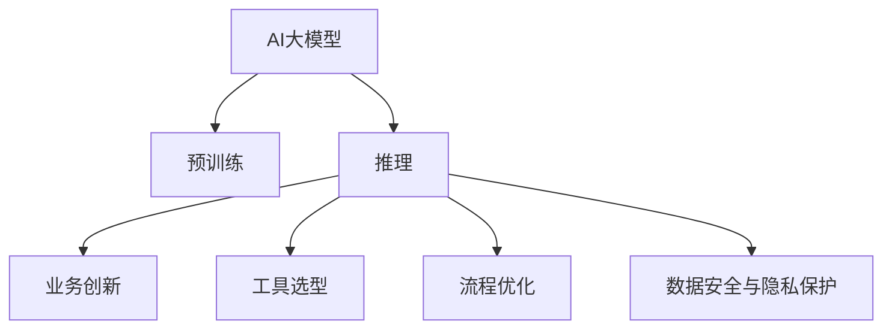

                 

# AI大模型赋能电商搜索推荐的业务创新流程优化工具选型

> 关键词：电商搜索推荐、AI大模型、业务创新、流程优化、工具选型

## 1. 背景介绍

### 1.1 问题由来

随着电子商务的飞速发展，用户购买行为变得越来越复杂多样，对电商平台的搜索推荐系统提出了更高的要求。传统的搜索推荐算法往往依赖于单一的特征向量，难以处理高维稀疏数据，缺乏语义理解和上下文感知能力。AI大模型通过学习海量文本数据，具备强大的语义理解能力和上下文感知能力，能够更准确地理解和匹配用户需求。

然而，AI大模型在电商搜索推荐中的应用还面临诸多挑战。模型的训练和部署需要高性能的硬件设施，对资源和成本提出了较高要求。模型的推理速度和效果评估也存在一定的瓶颈，需要进一步优化。此外，电商搜索推荐业务流程复杂，涉及用户数据、商品数据、营销策略等多个环节，如何构建高效、稳定的系统架构也是一大难点。

### 1.2 问题核心关键点

为了应对上述挑战，我们需要选择适合电商搜索推荐应用的AI大模型，并设计优化工具和流程，使其能够在电商场景中发挥最佳性能。核心关键点包括：

- 选择合适的AI大模型：根据电商搜索推荐任务特点，选择性能最优的预训练语言模型，如BERT、GPT-3、StructBERT等。
- 优化模型推理流程：设计高效的推理架构和工具，提升模型推理速度和效果评估效率。
- 构建业务创新流程：设计灵活可扩展的业务架构，支持多样化的业务需求，促进业务创新。
- 数据安全与隐私保护：保障用户数据和模型隐私，防止数据泄露和滥用。

### 1.3 问题研究意义

研究AI大模型在电商搜索推荐中的工具选型和流程优化，对于提高电商平台的搜索推荐效果，提升用户体验，推动电商业务创新，具有重要意义：

1. 提升搜索推荐效果：AI大模型具备强大的语义理解能力，能够更好地理解用户需求，匹配优质商品，提升推荐效果。
2. 促进业务创新：电商搜索推荐业务流程优化，能够灵活适应业务需求变化，实现更多场景的业务创新。
3. 降低资源成本：优化的推理流程和工具选型，能够提升模型推理速度和效果评估效率，降低资源成本。
4. 保障数据隐私：设计严格的数据安全与隐私保护机制，保障用户数据和模型隐私，构建信任系统。

## 2. 核心概念与联系

### 2.1 核心概念概述

为更好地理解AI大模型在电商搜索推荐中的应用，本节将介绍几个密切相关的核心概念：

- AI大模型(AI Large Model)：以自回归(如GPT)或自编码(如BERT)模型为代表的大规模预训练语言模型。通过学习海量文本数据，具备强大的语义理解能力和上下文感知能力，广泛应用于各种NLP任务。

- 预训练(Pre-training)：指在大规模无标签文本语料上，通过自监督学习任务训练通用语言模型的过程。常见的预训练任务包括言语建模、遮挡语言模型等。

- 推理(Inferring)：指将预训练模型应用到实际任务中，对新输入进行语义理解、生成等操作的过程。高效的推理流程能够提升模型的应用效率。

- 业务创新(Business Innovation)：通过优化工具和流程，支持电商搜索推荐业务的灵活扩展和创新应用，提升业务价值。

- 工具选型(Tool Selection)：根据电商搜索推荐任务需求，选择合适的技术和工具进行模型部署和应用。

- 流程优化(Process Optimization)：设计高效稳定的业务流程，确保模型应用效果的稳定性和可扩展性。

- 数据安全与隐私保护(Data Security and Privacy)：保障用户数据和模型隐私，防止数据泄露和滥用。

这些核心概念之间的逻辑关系可以通过以下Mermaid流程图来展示：



这个流程图展示了大模型在电商搜索推荐中的核心概念及其之间的关系：

1. AI大模型通过预训练获得基础能力。
2. 推理过程应用大模型解决具体任务。
3. 业务创新依赖于高效的推理和工具选型。
4. 工具选型直接影响业务流程的稳定性和效率。
5. 流程优化确保模型应用的稳定性和可扩展性。
6. 数据安全与隐私保护保障用户数据和模型隐私。

这些概念共同构成了大模型在电商搜索推荐应用中的整体框架，使其能够在电商场景中发挥最佳性能。通过理解这些核心概念，我们可以更好地把握大模型在电商搜索推荐中的工作原理和优化方向。

## 3. 核心算法原理 & 具体操作步骤

### 3.1 算法原理概述

AI大模型在电商搜索推荐中的应用，本质上是将预训练语言模型应用于具体的电商业务任务中。其核心思想是：将预训练模型视作一个强大的"特征提取器"，通过推理过程提取用户需求和商品特征，预测并推荐最佳匹配的商品。

形式化地，假设电商搜索推荐任务为 $T$，用户输入为 $u$，商品集合为 $I$。目标是从商品集合中，预测用户最可能感兴趣的商品 $i$，使得：

$$
\hat{i}=\mathop{\arg\min}_{i} \mathcal{L}(u,i)
$$

其中 $\mathcal{L}$ 为任务定义的损失函数，用于衡量用户输入 $u$ 和预测商品 $i$ 之间的差距。常见的损失函数包括交叉熵损失、均方误差损失等。

通过梯度下降等优化算法，推理过程不断更新模型参数，最小化损失函数 $\mathcal{L}$，使得预测商品与用户输入 $u$ 尽量匹配。由于预训练模型已经通过预训练获得了较好的初始化，因此推理过程能够较快收敛到理想的商品推荐结果。

### 3.2 算法步骤详解

AI大模型在电商搜索推荐中的应用，一般包括以下几个关键步骤：

**Step 1: 准备预训练模型和数据集**
- 选择合适的预训练语言模型 $M_{\theta}$ 作为初始化参数，如 BERT、GPT-3、StructBERT等。
- 准备电商搜索推荐任务的标注数据集 $D$，划分为训练集、验证集和测试集。一般要求标注数据与电商场景的数据分布不要差异过大。

**Step 2: 优化模型推理流程**
- 设计高效的推理架构，如采用GPU加速、使用混合精度训练、优化计算图等，提升模型推理速度和效果评估效率。
- 设计灵活可扩展的业务流程，支持多样化的业务需求。
- 设计严格的权限管理机制，保障数据安全和隐私保护。

**Step 3: 业务创新流程设计**
- 构建业务架构，如商品推荐模块、上下文理解模块、用户行为分析模块等，支持业务需求变化。
- 设计数据采集和存储架构，支持电商搜索推荐业务的实时数据处理和存储。
- 设计营销策略模块，支持用户个性化推荐和营销活动设计。

**Step 4: 效果评估与反馈**
- 在测试集上评估模型推理效果，对比优化前后的精度提升。
- 收集用户反馈和业务数据，进行效果评估和业务优化，不断迭代优化模型和业务流程。

以上是AI大模型在电商搜索推荐中的应用的一般流程。在实际应用中，还需要针对具体业务场景，对模型推理过程和业务流程进行优化设计，以进一步提升推荐效果和用户体验。

### 3.3 算法优缺点

AI大模型在电商搜索推荐中的应用具有以下优点：

1. 强大的语义理解能力：大模型具备强大的语义理解能力，能够更好地理解用户需求，匹配优质商品。
2. 上下文感知能力：大模型能够利用用户行为数据和商品数据，进行上下文感知推理，提升推荐效果。
3. 灵活可扩展性：大模型通过优化推理流程和业务流程，能够支持多种业务需求和场景。
4. 高效推理速度：优化推理架构和工具选型，能够提升模型推理速度和效果评估效率。

同时，该方法也存在一定的局限性：

1. 资源需求高：大模型的训练和推理需要高性能硬件设施，对资源和成本提出了较高要求。
2. 推理速度慢：大模型参数量大，推理速度较慢，可能影响业务实时响应。
3. 精度不确定性：大模型存在模型偏差，推理精度可能受数据分布和模型参数的影响。
4. 数据安全风险：电商搜索推荐业务涉及用户数据和商品数据，需要严格的数据安全与隐私保护机制。

尽管存在这些局限性，但就目前而言，AI大模型在电商搜索推荐中的应用仍然是最先进的技术范式。未来相关研究的重点在于如何进一步降低模型推理的资源需求，提高推理速度和精度，同时兼顾数据安全与隐私保护。

### 3.4 算法应用领域

AI大模型在电商搜索推荐中的应用，已经在多个电商平台得到了广泛应用，覆盖了商品推荐、个性化营销、用户行为分析等多个业务场景，具体包括：

- 商品推荐：根据用户浏览、购买等行为数据，推荐相关商品。通过优化推理流程和业务流程，提升推荐效果。
- 个性化营销：设计个性化的营销活动，提升用户转化率。通过优化营销策略和业务流程，实现精准营销。
- 用户行为分析：分析用户行为数据，理解用户需求和偏好，提升业务决策的科学性。通过优化数据分析流程和业务流程，支持业务创新。
- 实时响应：优化推理架构和工具选型，支持电商平台的实时响应需求。通过优化推理速度和业务流程，提升用户体验。

除了上述这些经典场景外，AI大模型还被创新性地应用到更多电商业务中，如智能客服、商品评价、库存管理等，为电商平台的业务创新和智能化转型提供了新的动力。随着AI大模型技术的持续演进，相信其在电商搜索推荐领域的应用将更加广泛和深入。

## 4. 数学模型和公式 & 详细讲解 & 举例说明

### 4.1 数学模型构建

本节将使用数学语言对AI大模型在电商搜索推荐中的应用进行更加严格的刻画。

记电商搜索推荐任务为 $T$，用户输入为 $u$，商品集合为 $I$。定义任务定义的损失函数为 $\mathcal{L}(u,i)$，用于衡量用户输入 $u$ 和预测商品 $i$ 之间的差距。常见的损失函数包括交叉熵损失、均方误差损失等。

假设大模型为 $M_{\theta}$，其输出为 $\hat{i}$。目标是最小化损失函数，即：

$$
\hat{i}=\mathop{\arg\min}_{i} \mathcal{L}(u,i) = \mathop{\arg\min}_{i} \mathcal{L}(M_{\theta}(u),i)
$$

在实践中，我们通常使用基于梯度的优化算法（如Adam、SGD等）来近似求解上述最优化问题。设 $\eta$ 为学习率，$\lambda$ 为正则化系数，则参数的更新公式为：

$$
\theta \leftarrow \theta - \eta \nabla_{\theta}\mathcal{L}(\theta) - \eta\lambda\theta
$$

其中 $\nabla_{\theta}\mathcal{L}(\theta)$ 为损失函数对参数 $\theta$ 的梯度，可通过反向传播算法高效计算。

### 4.2 公式推导过程

以下我们以电商搜索推荐任务为例，推导基于大模型的推荐损失函数及其梯度的计算公式。

假设大模型 $M_{\theta}$ 在用户输入 $u$ 上的输出为 $\hat{i}$，表示模型预测的商品编号。真实标签 $i \in I$。则推荐损失函数定义为：

$$
\mathcal{L}(u,i) = -\log\frac{e^{\hat{i}\cdot \mathbf{w}_i}}{\sum_{j \in I} e^{j\cdot \mathbf{w}_j}}
$$

其中 $\mathbf{w}_i$ 为商品 $i$ 的权重向量，$j\cdot \mathbf{w}_j$ 表示商品 $j$ 的得分。将其代入经验风险公式，得：

$$
\mathcal{L}(\theta) = -\frac{1}{N}\sum_{i=1}^N \log\frac{e^{\hat{i}\cdot \mathbf{w}_i}}{\sum_{j \in I} e^{j\cdot \mathbf{w}_j}}
$$

根据链式法则，损失函数对参数 $\theta_k$ 的梯度为：

$$
\frac{\partial \mathcal{L}(\theta)}{\partial \theta_k} = -\frac{1}{N}\sum_{i=1}^N \frac{\partial}{\partial \theta_k}\log\frac{e^{\hat{i}\cdot \mathbf{w}_i}}{\sum_{j \in I} e^{j\cdot \mathbf{w}_j}}
$$

其中 $\frac{\partial}{\partial \theta_k}\log\frac{e^{\hat{i}\cdot \mathbf{w}_i}}{\sum_{j \in I} e^{j\cdot \mathbf{w}_j}}$ 的计算可以通过对偶方法进行推导，在此不再赘述。

在得到损失函数的梯度后，即可带入参数更新公式，完成模型的迭代优化。重复上述过程直至收敛，最终得到适应电商搜索推荐任务的最优模型参数 $\theta^*$。

## 5. 项目实践：代码实例和详细解释说明

### 5.1 开发环境搭建

在进行电商搜索推荐应用的开发前，我们需要准备好开发环境。以下是使用Python进行PyTorch开发的环境配置流程：

1. 安装Anaconda：从官网下载并安装Anaconda，用于创建独立的Python环境。

2. 创建并激活虚拟环境：
```bash
conda create -n pytorch-env python=3.8 
conda activate pytorch-env
```

3. 安装PyTorch：根据CUDA版本，从官网获取对应的安装命令。例如：
```bash
conda install pytorch torchvision torchaudio cudatoolkit=11.1 -c pytorch -c conda-forge
```

4. 安装Transformers库：
```bash
pip install transformers
```

5. 安装各类工具包：
```bash
pip install numpy pandas scikit-learn matplotlib tqdm jupyter notebook ipython
```

完成上述步骤后，即可在`pytorch-env`环境中开始电商搜索推荐应用的开发。

### 5.2 源代码详细实现

下面我们以电商搜索推荐任务为例，给出使用Transformers库对BERT模型进行微调的PyTorch代码实现。

首先，定义电商搜索推荐任务的数据处理函数：

```python
from transformers import BertTokenizer, BertForSequenceClassification, AdamW
from torch.utils.data import Dataset, DataLoader
import torch

class SearchRecommendDataset(Dataset):
    def __init__(self, texts, tags, tokenizer, max_len=128):
        self.texts = texts
        self.tags = tags
        self.tokenizer = tokenizer
        self.max_len = max_len
        
    def __len__(self):
        return len(self.texts)
    
    def __getitem__(self, item):
        text = self.texts[item]
        tags = self.tags[item]
        
        encoding = self.tokenizer(text, return_tensors='pt', max_length=self.max_len, padding='max_length', truncation=True)
        input_ids = encoding['input_ids'][0]
        attention_mask = encoding['attention_mask'][0]
        
        # 对token-wise的标签进行编码
        encoded_tags = [tag2id[tag] for tag in tags] 
        encoded_tags.extend([tag2id['O']] * (self.max_len - len(encoded_tags)))
        labels = torch.tensor(encoded_tags, dtype=torch.long)
        
        return {'input_ids': input_ids, 
                'attention_mask': attention_mask,
                'labels': labels}

# 标签与id的映射
tag2id = {'O': 0, 'buy': 1, 'sell': 2}
id2tag = {v: k for k, v in tag2id.items()}

# 创建dataset
tokenizer = BertTokenizer.from_pretrained('bert-base-cased')

train_dataset = SearchRecommendDataset(train_texts, train_tags, tokenizer)
dev_dataset = SearchRecommendDataset(dev_texts, dev_tags, tokenizer)
test_dataset = SearchRecommendDataset(test_texts, test_tags, tokenizer)
```

然后，定义模型和优化器：

```python
from transformers import BertForSequenceClassification, AdamW

model = BertForSequenceClassification.from_pretrained('bert-base-cased', num_labels=len(tag2id))

optimizer = AdamW(model.parameters(), lr=2e-5)
```

接着，定义训练和评估函数：

```python
from torch.utils.data import DataLoader
from tqdm import tqdm
from sklearn.metrics import classification_report

device = torch.device('cuda') if torch.cuda.is_available() else torch.device('cpu')
model.to(device)

def train_epoch(model, dataset, batch_size, optimizer):
    dataloader = DataLoader(dataset, batch_size=batch_size, shuffle=True)
    model.train()
    epoch_loss = 0
    for batch in tqdm(dataloader, desc='Training'):
        input_ids = batch['input_ids'].to(device)
        attention_mask = batch['attention_mask'].to(device)
        labels = batch['labels'].to(device)
        model.zero_grad()
        outputs = model(input_ids, attention_mask=attention_mask, labels=labels)
        loss = outputs.loss
        epoch_loss += loss.item()
        loss.backward()
        optimizer.step()
    return epoch_loss / len(dataloader)

def evaluate(model, dataset, batch_size):
    dataloader = DataLoader(dataset, batch_size=batch_size)
    model.eval()
    preds, labels = [], []
    with torch.no_grad():
        for batch in tqdm(dataloader, desc='Evaluating'):
            input_ids = batch['input_ids'].to(device)
            attention_mask = batch['attention_mask'].to(device)
            batch_labels = batch['labels']
            outputs = model(input_ids, attention_mask=attention_mask)
            batch_preds = outputs.logits.argmax(dim=2).to('cpu').tolist()
            batch_labels = batch_labels.to('cpu').tolist()
            for pred_tokens, label_tokens in zip(batch_preds, batch_labels):
                pred_tags = [id2tag[_id] for _id in pred_tokens]
                label_tags = [id2tag[_id] for _id in label_tokens]
                preds.append(pred_tags[:len(label_tags)])
                labels.append(label_tags)
                
    print(classification_report(labels, preds))
```

最后，启动训练流程并在测试集上评估：

```python
epochs = 5
batch_size = 16

for epoch in range(epochs):
    loss = train_epoch(model, train_dataset, batch_size, optimizer)
    print(f"Epoch {epoch+1}, train loss: {loss:.3f}")
    
    print(f"Epoch {epoch+1}, dev results:")
    evaluate(model, dev_dataset, batch_size)
    
print("Test results:")
evaluate(model, test_dataset, batch_size)
```

以上就是使用PyTorch对BERT进行电商搜索推荐任务微调的完整代码实现。可以看到，得益于Transformers库的强大封装，我们可以用相对简洁的代码完成BERT模型的加载和微调。

### 5.3 代码解读与分析

让我们再详细解读一下关键代码的实现细节：

**SearchRecommendDataset类**：
- `__init__`方法：初始化文本、标签、分词器等关键组件。
- `__len__`方法：返回数据集的样本数量。
- `__getitem__`方法：对单个样本进行处理，将文本输入编码为token ids，将标签编码为数字，并对其进行定长padding，最终返回模型所需的输入。

**tag2id和id2tag字典**：
- 定义了标签与数字id之间的映射关系，用于将token-wise的预测结果解码回真实的标签。

**训练和评估函数**：
- 使用PyTorch的DataLoader对数据集进行批次化加载，供模型训练和推理使用。
- 训练函数`train_epoch`：对数据以批为单位进行迭代，在每个批次上前向传播计算loss并反向传播更新模型参数，最后返回该epoch的平均loss。
- 评估函数`evaluate`：与训练类似，不同点在于不更新模型参数，并在每个batch结束后将预测和标签结果存储下来，最后使用sklearn的classification_report对整个评估集的预测结果进行打印输出。

**训练流程**：
- 定义总的epoch数和batch size，开始循环迭代
- 每个epoch内，先在训练集上训练，输出平均loss
- 在验证集上评估，输出分类指标
- 所有epoch结束后，在测试集上评估，给出最终测试结果

可以看到，PyTorch配合Transformers库使得BERT微调的代码实现变得简洁高效。开发者可以将更多精力放在数据处理、模型改进等高层逻辑上，而不必过多关注底层的实现细节。

当然，工业级的系统实现还需考虑更多因素，如模型的保存和部署、超参数的自动搜索、更灵活的任务适配层等。但核心的微调范式基本与此类似。

## 6. 实际应用场景

### 6.1 智能客服系统

基于AI大模型微调的对话技术，可以广泛应用于智能客服系统的构建。传统客服往往需要配备大量人力，高峰期响应缓慢，且一致性和专业性难以保证。而使用微调后的对话模型，可以7x24小时不间断服务，快速响应客户咨询，用自然流畅的语言解答各类常见问题。

在技术实现上，可以收集企业内部的历史客服对话记录，将问题和最佳答复构建成监督数据，在此基础上对预训练对话模型进行微调。微调后的对话模型能够自动理解用户意图，匹配最合适的答案模板进行回复。对于客户提出的新问题，还可以接入检索系统实时搜索相关内容，动态组织生成回答。如此构建的智能客服系统，能大幅提升客户咨询体验和问题解决效率。

### 6.2 金融舆情监测

金融机构需要实时监测市场舆论动向，以便及时应对负面信息传播，规避金融风险。传统的人工监测方式成本高、效率低，难以应对网络时代海量信息爆发的挑战。基于AI大模型微调的文本分类和情感分析技术，为金融舆情监测提供了新的解决方案。

具体而言，可以收集金融领域相关的新闻、报道、评论等文本数据，并对其进行主题标注和情感标注。在此基础上对预训练语言模型进行微调，使其能够自动判断文本属于何种主题，情感倾向是正面、中性还是负面。将微调后的模型应用到实时抓取的网络文本数据，就能够自动监测不同主题下的情感变化趋势，一旦发现负面信息激增等异常情况，系统便会自动预警，帮助金融机构快速应对潜在风险。

### 6.3 个性化推荐系统

当前的推荐系统往往只依赖用户的历史行为数据进行物品推荐，无法深入理解用户的真实兴趣偏好。基于AI大模型微调技术，个性化推荐系统可以更好地挖掘用户行为背后的语义信息，从而提供更精准、多样的推荐内容。

在实践中，可以收集用户浏览、点击、评论、分享等行为数据，提取和用户交互的物品标题、描述、标签等文本内容。将文本内容作为模型输入，用户的后续行为（如是否点击、购买等）作为监督信号，在此基础上微调预训练语言模型。微调后的模型能够从文本内容中准确把握用户的兴趣点。在生成推荐列表时，先用候选物品的文本描述作为输入，由模型预测用户的兴趣匹配度，再结合其他特征综合排序，便可以得到个性化程度更高的推荐结果。

### 6.4 未来应用展望

随着AI大模型和微调方法的不断发展，基于微调范式将在更多领域得到应用，为传统行业带来变革性影响。

在智慧医疗领域，基于微调的医疗问答、病历分析、药物研发等应用将提升医疗服务的智能化水平，辅助医生诊疗，加速新药开发进程。

在智能教育领域，微调技术可应用于作业批改、学情分析、知识推荐等方面，因材施教，促进教育公平，提高教学质量。

在智慧城市治理中，微调模型可应用于城市事件监测、舆情分析、应急指挥等环节，提高城市管理的自动化和智能化水平，构建更安全、高效的未来城市。

此外，在企业生产、社会治理、文娱传媒等众多领域，基于大模型微调的人工智能应用也将不断涌现，为经济社会发展注入新的动力。相信随着技术的日益成熟，微调方法将成为人工智能落地应用的重要范式，推动人工智能技术在垂直行业的规模化落地。总之，微调需要开发者根据具体任务，不断迭代和优化模型、数据和算法，方能得到理想的效果。

## 7. 工具和资源推荐
### 7.1 学习资源推荐

为了帮助开发者系统掌握AI大模型在电商搜索推荐中的应用，这里推荐一些优质的学习资源：

1. 《Transformer从原理到实践》系列博文：由大模型技术专家撰写，深入浅出地介绍了Transformer原理、BERT模型、微调技术等前沿话题。

2. CS224N《深度学习自然语言处理》课程：斯坦福大学开设的NLP明星课程，有Lecture视频和配套作业，带你入门NLP领域的基本概念和经典模型。

3. 《Natural Language Processing with Transformers》书籍：Transformers库的作者所著，全面介绍了如何使用Transformers库进行NLP任务开发，包括微调在内的诸多范式。

4. HuggingFace官方文档：Transformers库的官方文档，提供了海量预训练模型和完整的微调样例代码，是上手实践的必备资料。

5. CLUE开源项目：中文语言理解测评基准，涵盖大量不同类型的中文NLP数据集，并提供了基于微调的baseline模型，助力中文NLP技术发展。

通过对这些资源的学习实践，相信你一定能够快速掌握AI大模型在电商搜索推荐中的应用精髓，并用于解决实际的NLP问题。
###  7.2 开发工具推荐

高效的开发离不开优秀的工具支持。以下是几款用于AI大模型微调开发的常用工具：

1. PyTorch：基于Python的开源深度学习框架，灵活动态的计算图，适合快速迭代研究。大部分预训练语言模型都有PyTorch版本的实现。

2. TensorFlow：由Google主导开发的开源深度学习框架，生产部署方便，适合大规模工程应用。同样有丰富的预训练语言模型资源。

3. Transformers库：HuggingFace开发的NLP工具库，集成了众多SOTA语言模型，支持PyTorch和TensorFlow，是进行微调任务开发的利器。

4. Weights & Biases：模型训练的实验跟踪工具，可以记录和可视化模型训练过程中的各项指标，方便对比和调优。与主流深度学习框架无缝集成。

5. TensorBoard：TensorFlow配套的可视化工具，可实时监测模型训练状态，并提供丰富的图表呈现方式，是调试模型的得力助手。

6. Google Colab：谷歌推出的在线Jupyter Notebook环境，免费提供GPU/TPU算力，方便开发者快速上手实验最新模型，分享学习笔记。

合理利用这些工具，可以显著提升AI大模型微调的开发效率，加快创新迭代的步伐。

### 7.3 相关论文推荐

AI大模型和微调技术的发展源于学界的持续研究。以下是几篇奠基性的相关论文，推荐阅读：

1. Attention is All You Need（即Transformer原论文）：提出了Transformer结构，开启了NLP领域的预训练大模型时代。

2. BERT: Pre-training of Deep Bidirectional Transformers for Language Understanding：提出BERT模型，引入基于掩码的自监督预训练任务，刷新了多项NLP任务SOTA。

3. Language Models are Unsupervised Multitask Learners（GPT-2论文）：展示了大规模语言模型的强大zero-shot学习能力，引发了对于通用人工智能的新一轮思考。

4. Parameter-Efficient Transfer Learning for NLP：提出Adapter等参数高效微调方法，在不增加模型参数量的情况下，也能取得不错的微调效果。

5. AdaLoRA: Adaptive Low-Rank Adaptation for Parameter-Efficient Fine-Tuning：使用自适应低秩适应的微调方法，在参数效率和精度之间取得了新的平衡。

6. Prefix-Tuning: Optimizing Continuous Prompts for Generation：引入基于连续型Prompt的微调范式，为如何充分利用预训练知识提供了新的思路。

这些论文代表了大语言模型微调技术的发展脉络。通过学习这些前沿成果，可以帮助研究者把握学科前进方向，激发更多的创新灵感。

## 8. 总结：未来发展趋势与挑战

### 8.1 总结

本文对AI大模型在电商搜索推荐中的应用进行了全面系统的介绍。首先阐述了AI大模型和微调技术的研究背景和意义，明确了微调在拓展预训练模型应用、提升电商搜索推荐效果方面的独特价值。其次，从原理到实践，详细讲解了AI大模型在电商搜索推荐中的数学模型和算法流程，给出了电商搜索推荐任务的代码实例。同时，本文还广泛探讨了AI大模型在电商搜索推荐业务中的实际应用场景，展示了其广阔的应用前景。此外，本文精选了微调技术的各类学习资源，力求为读者提供全方位的技术指引。

通过本文的系统梳理，可以看到，AI大模型在电商搜索推荐中的应用前景广阔，具备强大的语义理解能力和上下文感知能力，能够显著提升电商平台的搜索推荐效果。未来，伴随AI大模型技术的持续演进，相信其在电商搜索推荐领域的应用将更加广泛和深入。

### 8.2 未来发展趋势

展望未来，AI大模型在电商搜索推荐中的应用将呈现以下几个发展趋势：

1. 模型规模持续增大。随着算力成本的下降和数据规模的扩张，预训练语言模型的参数量还将持续增长。超大规模语言模型蕴含的丰富语言知识，有望支撑更加复杂多变的电商搜索推荐任务。

2. 微调方法日趋多样。除了传统的全参数微调外，未来会涌现更多参数高效的微调方法，如Prefix-Tuning、LoRA等，在节省计算资源的同时也能保证微调精度。

3. 持续学习成为常态。随着数据分布的不断变化，微调模型也需要持续学习新知识以保持性能。如何在不遗忘原有知识的同时，高效吸收新样本信息，将成为重要的研究课题。

4. 标注样本需求降低。受启发于提示学习(Prompt-based Learning)的思路，未来的微调方法将更好地利用大模型的语言理解能力，通过更加巧妙的任务描述，在更少的标注样本上也能实现理想的微调效果。

5. 模型通用性增强。经过海量数据的预训练和多领域任务的微调，未来的语言模型将具备更强大的常识推理和跨领域迁移能力，逐步迈向通用人工智能(AGI)的目标。

以上趋势凸显了AI大模型在电商搜索推荐中的广阔前景。这些方向的探索发展，必将进一步提升电商搜索推荐系统的性能和应用范围，为电商平台的智能化转型提供新的动力。

### 8.3 面临的挑战

尽管AI大模型在电商搜索推荐中的应用已经取得了瞩目成就，但在迈向更加智能化、普适化应用的过程中，它仍面临诸多挑战：

1. 标注成本瓶颈。虽然微调大大降低了标注数据的需求，但对于长尾应用场景，难以获得充足的高质量标注数据，成为制约微调性能的瓶颈。如何进一步降低微调对标注样本的依赖，将是一大难题。

2. 模型鲁棒性不足。当前微调模型面对域外数据时，泛化性能往往大打折扣。对于测试样本的微小扰动，微调模型的预测也容易发生波动。如何提高微调模型的鲁棒性，避免灾难性遗忘，还需要更多理论和实践的积累。

3. 推理效率有待提高。大规模语言模型虽然精度高，但在实际部署时往往面临推理速度慢、内存占用大等效率问题。如何在保证性能的同时，简化模型结构，提升推理速度，优化资源占用，将是重要的优化方向。

4. 可解释性亟需加强。当前微调模型更像是"黑盒"系统，难以解释其内部工作机制和决策逻辑。对于医疗、金融等高风险应用，算法的可解释性和可审计性尤为重要。如何赋予微调模型更强的可解释性，将是亟待攻克的难题。

5. 安全性有待保障。预训练语言模型难免会学习到有偏见、有害的信息，通过微调传递到下游任务，产生误导性、歧视性的输出，给实际应用带来安全隐患。如何从数据和算法层面消除模型偏见，避免恶意用途，确保输出的安全性，也将是重要的研究课题。

6. 知识整合能力不足。现有的微调模型往往局限于任务内数据，难以灵活吸收和运用更广泛的先验知识。如何让微调过程更好地与外部知识库、规则库等专家知识结合，形成更加全面、准确的信息整合能力，还有很大的想象空间。

正视AI大模型在电商搜索推荐中面临的这些挑战，积极应对并寻求突破，将是大模型技术迈向成熟的必由之路。相信随着学界和产业界的共同努力，这些挑战终将一一被克服，AI大模型在电商搜索推荐中的应用将更加成熟和可靠。

### 8.4 研究展望

面对AI大模型在电商搜索推荐中的挑战，未来的研究需要在以下几个方面寻求新的突破：

1. 探索无监督和半监督微调方法。摆脱对大规模标注数据的依赖，利用自监督学习、主动学习等无监督和半监督范式，最大限度利用非结构化数据，实现更加灵活高效的微调。

2. 研究参数高效和计算高效的微调范式。开发更加参数高效的微调方法，在固定大部分预训练参数的同时，只更新极少量的任务相关参数。同时优化微调模型的计算图，减少前向传播和反向传播的资源消耗，实现更加轻量级、实时性的部署。

3. 融合因果和对比学习范式。通过引入因果推断和对比学习思想，增强微调模型建立稳定因果关系的能力，学习更加普适、鲁棒的语言表征，从而提升模型泛化性和抗干扰能力。

4. 引入更多先验知识。将符号化的先验知识，如知识图谱、逻辑规则等，与神经网络模型进行巧妙融合，引导微调过程学习更准确、合理的语言模型。同时加强不同模态数据的整合，实现视觉、语音等多模态信息与文本信息的协同建模。

5. 结合因果分析和博弈论工具。将因果分析方法引入微调模型，识别出模型决策的关键特征，增强输出解释的因果性和逻辑性。借助博弈论工具刻画人机交互过程，主动探索并规避模型的脆弱点，提高系统稳定性。

6. 纳入伦理道德约束。在模型训练目标中引入伦理导向的评估指标，过滤和惩罚有偏见、有害的输出倾向。同时加强人工干预和审核，建立模型行为的监管机制，确保输出符合人类价值观和伦理道德。

这些研究方向的探索，必将引领AI大模型在电商搜索推荐中的技术演进，为构建安全、可靠、可解释、可控的智能系统铺平道路。面向未来，AI大模型在电商搜索推荐领域的应用需要与其他人工智能技术进行更深入的融合，如知识表示、因果推理、强化学习等，多路径协同发力，共同推动自然语言理解和智能交互系统的进步。只有勇于创新、敢于突破，才能不断拓展AI大模型的边界，让智能技术更好地造福人类社会。

## 9. 附录：常见问题与解答

**Q1：AI大模型在电商搜索推荐中的应用是否适用于所有电商场景？**

A: AI大模型在电商搜索推荐中的应用，通常适用于用户行为数据较为丰富，商品种类繁多，用户需求多样化的电商场景。例如大型电商平台、新零售品牌等。而对于一些小型电商平台或特定垂直电商，可能需要结合业务特点进行针对性优化和适配。

**Q2：AI大模型在电商搜索推荐中的推理速度如何？**

A: 目前主流的AI大模型推理速度较慢，主要原因在于模型参数量大，计算复杂度高。为了提高推理速度，可以采用以下方法：

1. 优化计算图：简化计算图，去除不必要的计算节点，提升推理效率。
2. 模型压缩：采用模型压缩技术，减少模型参数量和计算资源消耗。
3. 推理加速：利用GPU/TPU等高性能硬件设备，提升推理速度。
4. 分布式推理：采用分布式推理架构，将推理任务分布到多台设备上进行并行计算，提升推理效率。

**Q3：AI大模型在电商搜索推荐中的效果如何？**

A: AI大模型在电商搜索推荐中的效果通常优于传统的推荐算法，能够更好地理解用户需求和商品特征，匹配优质商品，提升推荐效果。但具体效果还需根据电商场景的特点和数据质量进行评估和优化。

**Q4：AI大模型在电商搜索推荐中的数据安全与隐私保护如何保障？**

A: 数据安全与隐私保护是AI大模型在电商搜索推荐中的重要问题。保障用户数据和模型隐私，防止数据泄露和滥用，需要采取以下措施：

1. 数据加密：对用户数据进行加密处理，防止数据在传输和存储过程中的泄露。
2. 权限管理：设计严格的权限管理机制，确保只有授权人员可以访问和操作数据。
3. 匿名化处理：对用户数据进行匿名化处理，保护用户隐私。
4. 安全审计：定期进行安全审计，检测和修复潜在的安全漏洞。
5. 合规监管：遵循相关的数据保护法规和标准，确保数据处理过程合法合规。

这些措施需要结合具体电商场景进行设计和实施，以保障数据安全与隐私保护。

**Q5：AI大模型在电商搜索推荐中的模型优化有哪些方法？**

A: AI大模型在电商搜索推荐中的模型优化，可以从以下几个方面入手：

1. 参数高效微调：采用Adapter、Prefix等参数高效微调方法，减少模型参数量，提高推理速度。
2. 模型压缩：采用模型压缩技术，如剪枝、量化等，减小模型大小，提升推理效率。
3. 混合精度训练：采用混合精度训练技术，减小计算资源消耗，提升推理速度。
4. 优化计算图：简化计算图，去除不必要的计算节点，提升推理效率。
5. 模型并行：采用模型并行技术，将推理任务分布到多台设备上进行并行计算，提升推理速度。

这些优化方法需要根据具体电商场景和业务需求进行合理选择和组合，以提升AI大模型在电商搜索推荐中的性能。

---

作者：禅与计算机程序设计艺术 / Zen and the Art of Computer Programming

