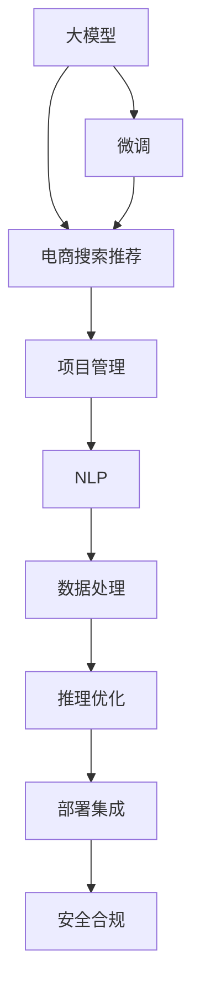

                 

# AI大模型赋能电商搜索推荐的业务创新项目管理平台搭建

> 关键词：大模型,电商搜索,推荐系统,项目管理,自然语言处理,NLP,深度学习,机器学习,软件工程

## 1. 背景介绍

### 1.1 问题由来

随着电商行业的迅猛发展，消费者对购物体验的需求日益增长。传统的基于关键词的搜索推荐系统已无法满足用户个性化、多样化的需求。人工智能技术尤其是大模型技术的兴起，为电商搜索推荐带来了新的突破。

在传统电商搜索推荐系统中，关键词匹配是核心的技术手段。但用户输入的关键词往往具有高度抽象性和泛化性，难以全面反映其真实的购物需求。而基于大模型的搜索推荐系统，可以深度理解用户输入的自然语言描述，从语义层面识别用户意图，从而提供更精准、个性化的搜索结果和推荐内容。

### 1.2 问题核心关键点

大模型赋能电商搜索推荐的核心在于其强大的语言理解和生成能力。通过在大规模文本数据上进行预训练，模型能够学习到丰富的语言知识和语义特征。在搜索推荐任务中，通过微调这些模型，可以显著提升系统性能，满足用户的多样化需求。

目前，基于大模型的电商搜索推荐系统主要面临以下关键问题：

1. **模型选型与适配**：选择合适的预训练模型，并针对电商搜索推荐任务进行适配微调。
2. **数据处理与增强**：如何高效地处理电商数据，并利用数据增强技术提升模型性能。
3. **推理优化与部署**：如何在保证性能的前提下，优化模型的推理速度和部署效率，满足实时服务需求。
4. **系统集成与协同**：如何将大模型与现有的电商搜索推荐系统进行有效集成，并实现无缝协同。
5. **安全与合规**：如何保障系统安全性，符合电商行业的合规要求。

## 2. 核心概念与联系

### 2.1 核心概念概述

本节将介绍构建AI大模型赋能电商搜索推荐业务创新项目管理平台所需的关键概念：

- **大模型**：以Transformer、BERT、GPT等为代表的大规模预训练语言模型。通过在大规模文本数据上进行自监督预训练，学习到丰富的语言知识和语义特征。
- **微调**：在大模型的基础上，针对特定任务进行有监督学习，优化模型在任务上的性能。
- **电商搜索推荐**：利用大模型的语言理解和生成能力，为用户提供更精准、个性化的搜索结果和推荐内容。
- **项目管理**：用于协调大模型赋能电商搜索推荐项目的各个环节，确保项目顺利推进和目标实现。
- **自然语言处理(NLP)**：研究如何让计算机理解、处理和生成自然语言的技术，是构建电商搜索推荐系统的关键技术之一。

这些核心概念之间的联系可以通过以下Mermaid流程图来展示：



这个流程图展示了大模型赋能电商搜索推荐的核心概念及其之间的关系：

1. 大模型通过自监督预训练学习到丰富的语言知识。
2. 通过微调，模型能够适应电商搜索推荐任务，提升性能。
3. 电商搜索推荐系统利用微调后的模型，提供个性化、多样化的搜索结果和推荐内容。
4. 项目管理协调各个环节，确保项目顺利推进。
5. NLP技术辅助模型训练和任务适配。
6. 数据处理和增强提升模型性能。
7. 推理优化和部署集成确保系统高效运行。
8. 安全合规保障系统可靠性和用户隐私。

## 3. 核心算法原理 & 具体操作步骤
### 3.1 算法原理概述

基于大模型的电商搜索推荐系统，本质上是通过自监督预训练和有监督微调两种方式，构建起用户意图与商品信息之间的桥梁，从而实现个性化搜索推荐。

在具体实现中，我们首先在大规模电商文本数据上，对预训练模型进行微调。微调的目标是优化模型在电商搜索推荐任务上的性能，使其能够从用户输入的自然语言描述中，准确识别用户意图，并提供最合适的搜索结果和推荐内容。

微调的数学模型和算法步骤如下：

- **数学模型构建**：定义损失函数 $\mathcal{L}$，用于衡量模型输出与真实标签之间的差异。损失函数通常包括交叉熵损失、均方误差损失等。
- **公式推导过程**：通过对输入数据的前向传播和反向传播，计算损失函数的梯度，使用优化算法（如Adam、SGD等）更新模型参数。
- **案例分析与讲解**：以具体任务为例，展示微调算法的实现过程。

### 3.2 算法步骤详解

#### 3.2.1 数据准备与预处理

电商搜索推荐系统通常涉及海量的商品信息、用户行为数据和自然语言描述。在微调前，需要对这些数据进行预处理，确保数据质量和一致性。

1. **商品数据预处理**：清洗并标准化商品标题、描述、标签等文本信息，去除无关噪音。
2. **用户数据预处理**：清洗并标准化用户历史浏览、点击、购买等行为数据，去除重复和不完整记录。
3. **自然语言数据预处理**：清洗并标准化用户输入的自然语言描述，去除无关噪音和错误拼写，进行分词、去除停用词等处理。

#### 3.2.2 模型选择与微调

选择适合电商搜索推荐的预训练模型，并在任务特定的数据集上进行微调。

1. **模型选择**：根据任务需求，选择适合的预训练模型，如BERT、GPT、ELMo等。
2. **微调步骤**：
   - 初始化预训练模型。
   - 划分训练集、验证集和测试集。
   - 设计任务适配层，如线性分类器、注意力机制等。
   - 选择合适的优化算法和超参数，如学习率、批大小、迭代轮数等。
   - 加载训练数据，执行梯度下降优化算法，更新模型参数。
   - 周期性在验证集上评估模型性能，根据性能指标决定是否触发Early Stopping。
   - 重复上述步骤直至满足预设的迭代轮数或Early Stopping条件。
   - 在测试集上评估微调后模型的性能，对比微调前后的精度提升。

#### 3.2.3 推理优化与部署

将微调后的模型部署到电商搜索推荐系统中，并优化推理性能，确保系统实时响应需求。

1. **模型压缩与剪枝**：去除不必要的层和参数，减小模型尺寸，加快推理速度。
2. **量化加速**：将浮点模型转为定点模型，压缩存储空间，提高计算效率。
3. **服务化封装**：将模型封装为标准化服务接口，便于集成调用。
4. **弹性伸缩**：根据请求流量动态调整资源配置，平衡服务质量和成本。
5. **监控告警**：实时采集系统指标，设置异常告警阈值，确保服务稳定性。
6. **安全防护**：采用访问鉴权、数据脱敏等措施，保障数据和模型安全。

### 3.3 算法优缺点

基于大模型的电商搜索推荐系统具有以下优点：

1. **精度高**：大模型能够从自然语言描述中准确理解用户意图，提供更精准的搜索结果和推荐内容。
2. **扩展性强**：通过微调，模型可以适应不同类型的电商搜索推荐任务，具有较强的泛化能力。
3. **数据效率高**：在大模型的基础上，只需要少量标注数据即可进行微调，提升模型性能。
4. **实时响应**：微调后的模型可以实时处理用户输入，快速响应搜索请求。

但同时也存在以下缺点：

1. **计算资源需求高**：大模型和微调过程需要较高的计算资源，包括GPU、内存、存储等。
2. **模型复杂度高**：大模型参数量庞大，推理过程复杂，容易遇到内存不足等问题。
3. **数据依赖性强**：微调效果依赖于电商数据的质量和数量，数据不足时难以获得理想效果。
4. **可解释性差**：大模型的输出缺乏可解释性，难以理解其内部工作机制。

## 4. 数学模型和公式 & 详细讲解 & 举例说明

### 4.1 数学模型构建

电商搜索推荐系统的数学模型主要包括以下几个组成部分：

1. **用户输入表示**：将用户输入的自然语言描述转换为向量表示。
2. **商品表示**：将商品信息（如标题、描述、标签等）转换为向量表示。
3. **用户意图识别**：通过大模型的预测，识别用户输入的自然语言描述对应的意图。
4. **商品推荐**：根据用户意图和商品向量，使用评分函数计算商品的相关性，并返回推荐结果。

数学模型可以表示为：

$$
\begin{aligned}
&\text{用户输入表示} \quad x \in \mathcal{X} \\
&\text{商品表示} \quad y \in \mathcal{Y} \\
&\text{用户意图识别} \quad \hat{c} = M_{\theta}(x) \\
&\text{商品推荐} \quad r = f(\hat{c}, y) \\
&\text{损失函数} \quad \mathcal{L}(\theta) = \mathbb{E}_{(x,y)}[\ell(\hat{c}, y)]
\end{aligned}
$$

其中 $M_{\theta}$ 表示预训练模型，$\ell(\hat{c}, y)$ 为损失函数，$x$ 为用户输入的自然语言描述，$y$ 为商品信息，$\hat{c}$ 为用户意图的向量表示，$r$ 为商品的相关性评分。

### 4.2 公式推导过程

以二分类任务为例，展示电商搜索推荐系统的数学模型推导过程。

假设用户输入的自然语言描述 $x$ 经过BERT模型处理后得到向量表示 $\hat{c}$，商品信息 $y$ 经过BERT模型处理后得到向量表示 $z$。二分类任务的目标是判断用户意图是否与商品相关，即判断 $\hat{c}$ 是否与 $z$ 相似。

定义模型 $M_{\theta}$ 在输入 $x$ 上的输出为 $\hat{c}=M_{\theta}(x) \in [0,1]$，表示用户意图与商品相关的概率。真实标签 $y \in \{0,1\}$。则二分类交叉熵损失函数定义为：

$$
\ell(M_{\theta}(x),y) = -[y\log \hat{c} + (1-y)\log (1-\hat{c})]
$$

将其代入经验风险公式，得：

$$
\mathcal{L}(\theta) = -\frac{1}{N}\sum_{i=1}^N [y_i\log M_{\theta}(x_i)+(1-y_i)\log(1-M_{\theta}(x_i))]
$$

根据链式法则，损失函数对参数 $\theta_k$ 的梯度为：

$$
\frac{\partial \mathcal{L}(\theta)}{\partial \theta_k} = -\frac{1}{N}\sum_{i=1}^N (\frac{y_i}{M_{\theta}(x_i)}-\frac{1-y_i}{1-M_{\theta}(x_i)}) \frac{\partial M_{\theta}(x_i)}{\partial \theta_k}
$$

其中 $\frac{\partial M_{\theta}(x_i)}{\partial \theta_k}$ 可进一步递归展开，利用自动微分技术完成计算。

在得到损失函数的梯度后，即可带入参数更新公式，完成模型的迭代优化。重复上述过程直至收敛，最终得到适应电商搜索推荐任务的最优模型参数 $\theta^*$。

### 4.3 案例分析与讲解

以电商商品搜索为例，展示大模型微调的具体实现过程。

假设某电商网站需要根据用户输入的自然语言描述，为用户推荐最相关的商品。具体步骤如下：

1. **数据预处理**：清洗并标准化用户输入的自然语言描述，进行分词、去除停用词等处理。
2. **商品表示**：将商品信息（如标题、描述、标签等）转换为向量表示，使用BERT模型进行预训练。
3. **模型微调**：在电商商品数据集上进行微调，使用交叉熵损失函数进行优化。
4. **推理过程**：将用户输入的自然语言描述输入微调后的模型，得到用户意图向量 $\hat{c}$。根据用户意图向量与商品向量计算相关性评分 $r$，返回相关商品。

## 5. 项目实践：代码实例和详细解释说明

### 5.1 开发环境搭建

在进行项目实践前，我们需要准备好开发环境。以下是使用Python进行PyTorch开发的环境配置流程：

1. 安装Anaconda：从官网下载并安装Anaconda，用于创建独立的Python环境。

2. 创建并激活虚拟环境：
```bash
conda create -n pytorch-env python=3.8 
conda activate pytorch-env
```

3. 安装PyTorch：根据CUDA版本，从官网获取对应的安装命令。例如：
```bash
conda install pytorch torchvision torchaudio cudatoolkit=11.1 -c pytorch -c conda-forge
```

4. 安装Transformers库：
```bash
pip install transformers
```

5. 安装各类工具包：
```bash
pip install numpy pandas scikit-learn matplotlib tqdm jupyter notebook ipython
```

完成上述步骤后，即可在`pytorch-env`环境中开始项目实践。

### 5.2 源代码详细实现

下面我们以电商商品搜索任务为例，给出使用Transformers库对BERT模型进行微调的PyTorch代码实现。

首先，定义任务的数据处理函数：

```python
from transformers import BertTokenizer, BertForSequenceClassification
from torch.utils.data import Dataset, DataLoader
import torch

class ProductDataset(Dataset):
    def __init__(self, products, labels, tokenizer, max_len=128):
        self.products = products
        self.labels = labels
        self.tokenizer = tokenizer
        self.max_len = max_len
        
    def __len__(self):
        return len(self.products)
    
    def __getitem__(self, item):
        product = self.products[item]
        label = self.labels[item]
        
        encoding = self.tokenizer(product, return_tensors='pt', max_length=self.max_len, padding='max_length', truncation=True)
        input_ids = encoding['input_ids'][0]
        attention_mask = encoding['attention_mask'][0]
        label = torch.tensor(label, dtype=torch.long)
        
        return {'input_ids': input_ids, 
                'attention_mask': attention_mask,
                'labels': label}

# 加载数据集
tokenizer = BertTokenizer.from_pretrained('bert-base-uncased')
train_dataset = ProductDataset(train_products, train_labels, tokenizer)
test_dataset = ProductDataset(test_products, test_labels, tokenizer)
```

然后，定义模型和优化器：

```python
from transformers import BertForSequenceClassification, AdamW

model = BertForSequenceClassification.from_pretrained('bert-base-uncased', num_labels=2)

optimizer = AdamW(model.parameters(), lr=2e-5)
```

接着，定义训练和评估函数：

```python
from torch.utils.data import DataLoader
from tqdm import tqdm
from sklearn.metrics import classification_report

device = torch.device('cuda') if torch.cuda.is_available() else torch.device('cpu')
model.to(device)

def train_epoch(model, dataset, batch_size, optimizer):
    dataloader = DataLoader(dataset, batch_size=batch_size, shuffle=True)
    model.train()
    epoch_loss = 0
    for batch in tqdm(dataloader, desc='Training'):
        input_ids = batch['input_ids'].to(device)
        attention_mask = batch['attention_mask'].to(device)
        labels = batch['labels'].to(device)
        model.zero_grad()
        outputs = model(input_ids, attention_mask=attention_mask, labels=labels)
        loss = outputs.loss
        epoch_loss += loss.item()
        loss.backward()
        optimizer.step()
    return epoch_loss / len(dataloader)

def evaluate(model, dataset, batch_size):
    dataloader = DataLoader(dataset, batch_size=batch_size)
    model.eval()
    preds, labels = [], []
    with torch.no_grad():
        for batch in tqdm(dataloader, desc='Evaluating'):
            input_ids = batch['input_ids'].to(device)
            attention_mask = batch['attention_mask'].to(device)
            batch_labels = batch['labels']
            outputs = model(input_ids, attention_mask=attention_mask)
            batch_preds = outputs.logits.argmax(dim=2).to('cpu').tolist()
            batch_labels = batch_labels.to('cpu').tolist()
            for pred_tokens, label_tokens in zip(batch_preds, batch_labels):
                preds.append(pred_tokens)
                labels.append(label_tokens)
                
    print(classification_report(labels, preds))
```

最后，启动训练流程并在测试集上评估：

```python
epochs = 5
batch_size = 16

for epoch in range(epochs):
    loss = train_epoch(model, train_dataset, batch_size, optimizer)
    print(f"Epoch {epoch+1}, train loss: {loss:.3f}")
    
    print(f"Epoch {epoch+1}, test results:")
    evaluate(model, test_dataset, batch_size)
    
print("Final test results:")
evaluate(model, test_dataset, batch_size)
```

以上就是使用PyTorch对BERT进行电商商品搜索任务微调的完整代码实现。可以看到，得益于Transformers库的强大封装，我们可以用相对简洁的代码完成BERT模型的加载和微调。

### 5.3 代码解读与分析

让我们再详细解读一下关键代码的实现细节：

**ProductDataset类**：
- `__init__`方法：初始化产品、标签、分词器等关键组件。
- `__len__`方法：返回数据集的样本数量。
- `__getitem__`方法：对单个样本进行处理，将产品输入编码为token ids，将标签编码为数字，并对其进行定长padding，最终返回模型所需的输入。

**模型微调**：
- 使用BertForSequenceClassification模型，指定二分类任务。
- 使用AdamW优化器，设置学习率为2e-5。

**训练和评估函数**：
- 使用PyTorch的DataLoader对数据集进行批次化加载，供模型训练和推理使用。
- 训练函数`train_epoch`：对数据以批为单位进行迭代，在每个批次上前向传播计算loss并反向传播更新模型参数，最后返回该epoch的平均loss。
- 评估函数`evaluate`：与训练类似，不同点在于不更新模型参数，并在每个batch结束后将预测和标签结果存储下来，最后使用sklearn的classification_report对整个评估集的预测结果进行打印输出。

**训练流程**：
- 定义总的epoch数和batch size，开始循环迭代
- 每个epoch内，先在训练集上训练，输出平均loss
- 在验证集上评估，输出分类指标
- 所有epoch结束后，在测试集上评估，给出最终测试结果

可以看到，PyTorch配合Transformers库使得BERT微调的代码实现变得简洁高效。开发者可以将更多精力放在数据处理、模型改进等高层逻辑上，而不必过多关注底层的实现细节。

当然，工业级的系统实现还需考虑更多因素，如模型的保存和部署、超参数的自动搜索、更灵活的任务适配层等。但核心的微调范式基本与此类似。

## 6. 实际应用场景

### 6.1 智能客服系统

基于大模型微调的对话技术，可以广泛应用于智能客服系统的构建。传统客服往往需要配备大量人力，高峰期响应缓慢，且一致性和专业性难以保证。而使用微调后的对话模型，可以7x24小时不间断服务，快速响应客户咨询，用自然流畅的语言解答各类常见问题。

在技术实现上，可以收集企业内部的历史客服对话记录，将问题和最佳答复构建成监督数据，在此基础上对预训练对话模型进行微调。微调后的对话模型能够自动理解用户意图，匹配最合适的答案模板进行回复。对于客户提出的新问题，还可以接入检索系统实时搜索相关内容，动态组织生成回答。如此构建的智能客服系统，能大幅提升客户咨询体验和问题解决效率。

### 6.2 金融舆情监测

金融机构需要实时监测市场舆论动向，以便及时应对负面信息传播，规避金融风险。传统的人工监测方式成本高、效率低，难以应对网络时代海量信息爆发的挑战。基于大语言模型微调的文本分类和情感分析技术，为金融舆情监测提供了新的解决方案。

具体而言，可以收集金融领域相关的新闻、报道、评论等文本数据，并对其进行主题标注和情感标注。在此基础上对预训练语言模型进行微调，使其能够自动判断文本属于何种主题，情感倾向是正面、中性还是负面。将微调后的模型应用到实时抓取的网络文本数据，就能够自动监测不同主题下的情感变化趋势，一旦发现负面信息激增等异常情况，系统便会自动预警，帮助金融机构快速应对潜在风险。

### 6.3 个性化推荐系统

当前的推荐系统往往只依赖用户的历史行为数据进行物品推荐，无法深入理解用户的真实兴趣偏好。基于大语言模型微调技术，个性化推荐系统可以更好地挖掘用户行为背后的语义信息，从而提供更精准、多样的推荐内容。

在实践中，可以收集用户浏览、点击、评论、分享等行为数据，提取和用户交互的物品标题、描述、标签等文本内容。将文本内容作为模型输入，用户的后续行为（如是否点击、购买等）作为监督信号，在此基础上微调预训练语言模型。微调后的模型能够从文本内容中准确把握用户的兴趣点。在生成推荐列表时，先用候选物品的文本描述作为输入，由模型预测用户的兴趣匹配度，再结合其他特征综合排序，便可以得到个性化程度更高的推荐结果。

### 6.4 未来应用展望

随着大语言模型微调技术的发展，其应用场景将更加广阔。

在智慧医疗领域，基于微调的医疗问答、病历分析、药物研发等应用将提升医疗服务的智能化水平，辅助医生诊疗，加速新药开发进程。

在智能教育领域，微调技术可应用于作业批改、学情分析、知识推荐等方面，因材施教，促进教育公平，提高教学质量。

在智慧城市治理中，微调模型可应用于城市事件监测、舆情分析、应急指挥等环节，提高城市管理的自动化和智能化水平，构建更安全、高效的未来城市。

此外，在企业生产、社会治理、文娱传媒等众多领域，基于大模型微调的人工智能应用也将不断涌现，为经济社会发展注入新的动力。相信随着技术的日益成熟，微调方法将成为人工智能落地应用的重要范式，推动人工智能技术在各行各业大放异彩。

## 7. 工具和资源推荐
### 7.1 学习资源推荐

为了帮助开发者系统掌握大语言模型微调的理论基础和实践技巧，这里推荐一些优质的学习资源：

1. 《Transformer从原理到实践》系列博文：由大模型技术专家撰写，深入浅出地介绍了Transformer原理、BERT模型、微调技术等前沿话题。

2. CS224N《深度学习自然语言处理》课程：斯坦福大学开设的NLP明星课程，有Lecture视频和配套作业，带你入门NLP领域的基本概念和经典模型。

3. 《Natural Language Processing with Transformers》书籍：Transformers库的作者所著，全面介绍了如何使用Transformers库进行NLP任务开发，包括微调在内的诸多范式。

4. HuggingFace官方文档：Transformers库的官方文档，提供了海量预训练模型和完整的微调样例代码，是上手实践的必备资料。

5. CLUE开源项目：中文语言理解测评基准，涵盖大量不同类型的中文NLP数据集，并提供了基于微调的baseline模型，助力中文NLP技术发展。

通过对这些资源的学习实践，相信你一定能够快速掌握大语言模型微调的精髓，并用于解决实际的NLP问题。
###  7.2 开发工具推荐

高效的开发离不开优秀的工具支持。以下是几款用于大语言模型微调开发的常用工具：

1. PyTorch：基于Python的开源深度学习框架，灵活动态的计算图，适合快速迭代研究。大部分预训练语言模型都有PyTorch版本的实现。

2. TensorFlow：由Google主导开发的开源深度学习框架，生产部署方便，适合大规模工程应用。同样有丰富的预训练语言模型资源。

3. Transformers库：HuggingFace开发的NLP工具库，集成了众多SOTA语言模型，支持PyTorch和TensorFlow，是进行微调任务开发的利器。

4. Weights & Biases：模型训练的实验跟踪工具，可以记录和可视化模型训练过程中的各项指标，方便对比和调优。与主流深度学习框架无缝集成。

5. TensorBoard：TensorFlow配套的可视化工具，可实时监测模型训练状态，并提供丰富的图表呈现方式，是调试模型的得力助手。

6. Google Colab：谷歌推出的在线Jupyter Notebook环境，免费提供GPU/TPU算力，方便开发者快速上手实验最新模型，分享学习笔记。

合理利用这些工具，可以显著提升大语言模型微调任务的开发效率，加快创新迭代的步伐。

### 7.3 相关论文推荐

大语言模型和微调技术的发展源于学界的持续研究。以下是几篇奠基性的相关论文，推荐阅读：

1. Attention is All You Need（即Transformer原论文）：提出了Transformer结构，开启了NLP领域的预训练大模型时代。

2. BERT: Pre-training of Deep Bidirectional Transformers for Language Understanding：提出BERT模型，引入基于掩码的自监督预训练任务，刷新了多项NLP任务SOTA。

3. Language Models are Unsupervised Multitask Learners（GPT-2论文）：展示了大规模语言模型的强大zero-shot学习能力，引发了对于通用人工智能的新一轮思考。

4. Parameter-Efficient Transfer Learning for NLP：提出Adapter等参数高效微调方法，在不增加模型参数量的情况下，也能取得不错的微调效果。

5. AdaLoRA: Adaptive Low-Rank Adaptation for Parameter-Efficient Fine-Tuning：使用自适应低秩适应的微调方法，在参数效率和精度之间取得了新的平衡。

这些论文代表了大语言模型微调技术的发展脉络。通过学习这些前沿成果，可以帮助研究者把握学科前进方向，激发更多的创新灵感。

## 8. 总结：未来发展趋势与挑战

### 8.1 总结

本文对大模型赋能电商搜索推荐业务创新项目管理平台的搭建进行了全面系统的介绍。首先阐述了大模型和微调技术的研究背景和意义，明确了微调在拓展预训练模型应用、提升下游任务性能方面的独特价值。其次，从原理到实践，详细讲解了微调算法的数学模型和关键步骤，给出了微调任务开发的完整代码实例。同时，本文还广泛探讨了微调方法在电商搜索推荐、智能客服、金融舆情、个性化推荐等多个业务场景中的应用前景，展示了微调范式的巨大潜力。此外，本文精选了微调技术的各类学习资源，力求为读者提供全方位的技术指引。

通过本文的系统梳理，可以看到，大模型赋能电商搜索推荐系统不仅能够提升用户购物体验，还能为电商企业带来显著的经济效益。得益于深度学习技术的突破，电商搜索推荐系统正在从传统的关键词匹配转向更加智能化的语义理解。未来，随着技术的不断演进，大模型微调技术必将在更多业务场景中发挥重要作用，推动电商行业迈向智能化、个性化、高效化的新高度。

### 8.2 未来发展趋势

展望未来，大模型赋能电商搜索推荐系统将呈现以下几个发展趋势：

1. **多模态融合**：结合图像、视频、音频等多模态数据，提升对商品信息的理解和推荐效果。
2. **实时计算优化**：利用分布式计算、边缘计算等技术，优化模型推理过程，实现实时推荐。
3. **个性化推荐优化**：引入推荐算法如协同过滤、深度学习推荐系统等，提升推荐效果和用户满意度。
4. **用户反馈闭环**：引入用户反馈机制，不断优化模型参数和推荐策略，实现自适应推荐。
5. **安全与隐私保护**：加强数据加密、隐私保护等措施，保障用户数据安全。
6. **技术社区建设**：构建技术社区，推动技术交流与合作，推动大模型微调技术的持续进步。

以上趋势凸显了大模型赋能电商搜索推荐系统的广阔前景。这些方向的探索发展，必将进一步提升电商搜索推荐系统的性能和应用范围，为电商行业带来新的商业价值。

### 8.3 面临的挑战

尽管大模型赋能电商搜索推荐系统取得了显著成效，但在其发展过程中也面临一些挑战：

1. **计算资源需求高**：大模型和微调过程需要较高的计算资源，包括GPU、内存、存储等，导致系统成本较高。
2. **模型可解释性差**：大模型的输出缺乏可解释性，难以理解其内部工作机制，给业务应用带来了一定挑战。
3. **数据依赖性强**：微调效果依赖于电商数据的质量和数量，数据不足时难以获得理想效果。
4. **模型鲁棒性不足**：面对不同类型的数据，模型泛化性能可能有限，需要进一步提升模型的鲁棒性。
5. **技术生态不够成熟**：现有的技术框架和工具库仍然存在一些不足，影响系统的稳定性和开发效率。

### 8.4 研究展望

未来，大模型赋能电商搜索推荐系统需要在以下几个方面寻求新的突破：

1. **轻量化模型**：探索更加轻量级的模型架构，降低计算资源需求，提升系统效率。
2. **模型压缩与优化**：研究模型压缩、量化加速等技术，进一步优化模型推理过程。
3. **可解释性与透明性**：探索可解释性模型，提升用户对系统的信任度。
4. **多模态数据融合**：结合多模态数据，提升系统对商品信息的理解和推荐效果。
5. **技术生态完善**：推动技术框架和工具库的完善，提升系统的稳定性和开发效率。

总之，大模型赋能电商搜索推荐系统正处于快速发展阶段，未来的研究和应用前景广阔。只有不断突破技术瓶颈，完善技术生态，才能将大模型微调技术推向新的高度，为电商行业带来更多的商业价值。

## 9. 附录：常见问题与解答

**Q1：如何选择合适的预训练模型？**

A: 选择预训练模型时，需要考虑模型的结构和性能。常见的预训练模型包括BERT、GPT、ELMo等。对于电商搜索推荐任务，可以选择结构简单、效果优良的BERT模型。

**Q2：如何降低模型训练的计算资源需求？**

A: 可以通过模型压缩、剪枝等技术，降低模型参数量，减小计算资源需求。同时，可以使用分布式训练、混合精度训练等技术，优化模型训练过程。

**Q3：如何提升模型的可解释性？**

A: 探索可解释性模型，如LIME、SHAP等，可以部分解释模型的预测结果。同时，可以通过分析模型梯度和特征重要性，了解模型的关键特征和决策逻辑。

**Q4：如何处理电商搜索推荐中的长尾问题？**

A: 对于长尾商品，可以在模型微调时引入正则化技术，如Dropout、L2正则等，避免过拟合。同时，可以使用数据增强技术，扩充训练集，提升模型的泛化能力。

**Q5：如何在电商搜索推荐系统中集成大模型微调？**

A: 可以在电商搜索推荐系统中集成微调后的模型，作为推荐策略的一部分，实现实时推荐。同时，可以通过A/B测试等方法，评估微调模型的效果，优化推荐策略。

以上是本文系统梳理的大模型赋能电商搜索推荐业务创新项目管理平台的搭建。通过深入理解大模型微调的理论和实践，相信你能在设计系统时更加得心应手。

