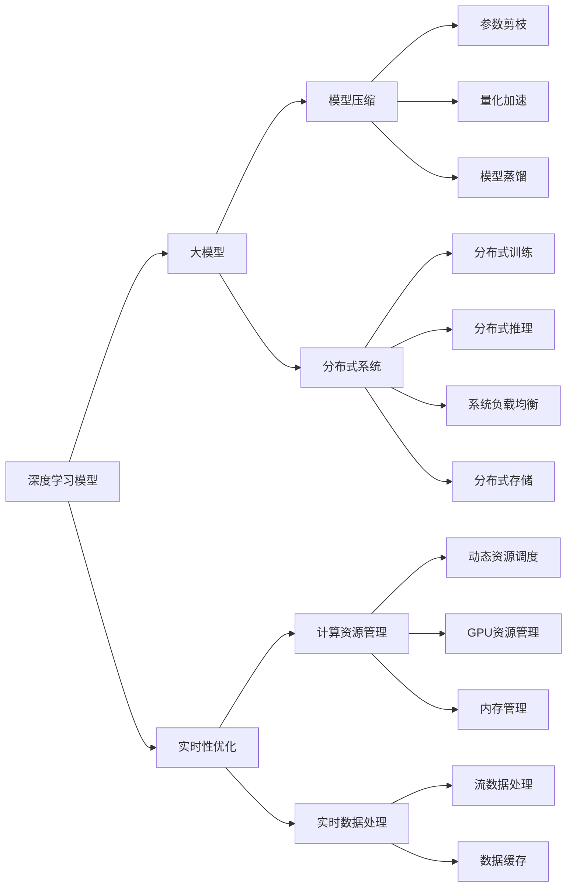

                 

# AI大模型赋能电商搜索推荐的实时性优化策略

> 关键词：AI大模型，电商搜索推荐，实时性优化，深度学习，模型压缩，分布式系统

## 1. 背景介绍

随着电子商务的蓬勃发展，用户搜索推荐系统已成为电商平台的核心竞争力之一。高精准度、高实时性、高效能的搜索推荐系统，能够显著提升用户购物体验，提高转化率和用户满意度。然而，传统的基于规则和浅层机器学习模型的推荐系统，面临着扩展性差、计算资源消耗大、效果欠佳等问题。近年来，深度学习模型特别是大模型在电商搜索推荐中逐渐崭露头角，凭借其强大的建模能力和泛化能力，成为新一代推荐系统的热门选择。

### 1.1 大模型在电商搜索推荐中的优势

深度学习大模型在电商搜索推荐中的应用，主要体现在以下几个方面：

1. **高泛化能力**：大模型通常基于海量数据进行预训练，具有强大的特征提取和表达能力，能够捕捉到更加复杂和隐含的特征，从而提升推荐的精准度和多样性。
2. **自适应性**：大模型可以根据实时数据动态调整参数，快速适应变化的用户需求和市场趋势，实现更加个性化的推荐。
3. **高效性**：虽然大模型参数量庞大，但借助GPU、TPU等高性能计算设备，可以大幅提升模型推理速度，满足实时性要求。
4. **可扩展性**：大模型可以通过分布式训练和推理实现规模化部署，解决传统推荐系统的扩展瓶颈。

### 1.2 实时性优化面临的挑战

尽管大模型在电商搜索推荐中具有显著优势，但其实时性优化仍面临诸多挑战：

1. **计算资源消耗**：大模型的推理计算资源消耗大，尤其是对于需要实时响应的场景，如何高效利用计算资源成为关键问题。
2. **模型压缩与剪枝**：大模型的参数量通常以亿计，如何在保证性能的前提下，有效减小模型大小，减少推理计算量。
3. **分布式系统设计**：电商搜索推荐系统需要高并发、高吞吐的分布式部署，如何在系统中平衡计算与存储，提升系统性能。
4. **实时数据处理**：如何将实时流数据高效地与模型结合，实现动态推荐。

本文将系统地介绍大模型在电商搜索推荐中的实时性优化策略，涵盖计算资源管理、模型压缩、分布式系统设计及实时数据处理等多个方面。

## 2. 核心概念与联系

### 2.1 核心概念概述

在探讨实时性优化策略之前，首先需要明确几个核心概念及其联系：

1. **深度学习模型**：指利用神经网络进行特征提取和预测的模型，通常包括卷积神经网络、循环神经网络、Transformer等。深度学习模型能够自动学习输入数据的复杂特征，适用于处理大规模数据。

2. **大模型**：指参数量庞大的深度学习模型，通常以亿计，如BERT、GPT、T5等。大模型通过在大规模语料上预训练，具备强大的语言理解和生成能力，适用于复杂的自然语言处理任务。

3. **实时性**：指系统对用户请求的响应速度，通常用延迟（Latency）来衡量。在电商搜索推荐中，实时性直接影响用户体验和系统吞吐量。

4. **分布式系统**：指通过多台计算设备协同工作，实现高并发和高吞吐的系统架构。电商搜索推荐系统需要处理海量数据，分布式系统设计是必不可少的。

5. **模型压缩**：指在保证模型精度的情况下，减小模型参数量和计算复杂度的方法。模型压缩有助于减少推理计算量，提升系统效率。

### 2.2 核心概念原理和架构的 Mermaid 流程图



上述图表展示了深度学习模型、大模型、实时性优化、模型压缩、分布式系统设计及实时数据处理等概念之间的联系和优化方向。

## 3. 核心算法原理 & 具体操作步骤

### 3.1 算法原理概述

基于大模型的电商搜索推荐系统，其核心算法原理可以概括为以下几个方面：

1. **特征提取与表示学习**：利用大模型学习用户和商品的特征表示，捕捉用户的兴趣和商品的属性，构建用户-商品交互的图谱。
2. **推荐计算模型**：通过计算模型将用户特征和商品特征进行匹配，预测用户可能感兴趣的商品，生成推荐列表。
3. **实时性优化**：通过优化计算资源管理、模型压缩、分布式系统设计及实时数据处理，提升系统的响应速度和吞吐量，满足实时性要求。

### 3.2 算法步骤详解

#### 3.2.1 数据预处理与特征工程

1. **数据收集**：收集用户浏览、点击、购买等行为数据，商品属性、评分、评论等文本数据，构建电商数据集。
2. **特征提取**：对用户和商品数据进行文本清洗、分词、向量化等处理，构建用户-商品交互的图谱。
3. **特征表示学习**：利用大模型（如BERT）对用户和商品数据进行预训练，学习高维特征表示。

#### 3.2.2 推荐计算模型训练

1. **模型选择**：选择合适的深度学习模型，如协同过滤、基于知识图谱的推荐系统等。
2. **模型训练**：在电商数据集上进行模型训练，优化模型参数，生成推荐模型。
3. **模型验证**：使用验证集对模型进行验证，调整模型参数，保证推荐模型的泛化能力。

#### 3.2.3 实时性优化策略

1. **计算资源管理**：使用动态资源调度算法，根据实时请求量动态调整计算资源分配，优化资源利用率。
2. **模型压缩**：采用参数剪枝、量化加速、模型蒸馏等技术，减小模型大小，提升推理速度。
3. **分布式系统设计**：采用分布式训练和推理，提升系统的吞吐量和响应速度。
4. **实时数据处理**：利用流数据处理技术，将实时流数据高效地与模型结合，实现动态推荐。

### 3.3 算法优缺点

#### 3.3.1 优点

1. **高精度推荐**：大模型具备强大的特征提取和表达能力，能够捕捉复杂隐含的特征，提升推荐精度。
2. **高实时性**：通过优化计算资源管理和分布式系统设计，可以满足电商搜索推荐的实时性要求。
3. **可扩展性**：大模型可以通过分布式训练和推理，实现大规模部署和扩展。
4. **高泛化能力**：大模型能够学习通用的语言表示，适用于处理多种语言和场景。

#### 3.3.2 缺点

1. **计算资源消耗大**：大模型参数量庞大，推理计算量大，对计算资源消耗较高。
2. **存储开销大**：大模型通常需要较大的存储空间，对存储资源消耗较大。
3. **动态调整复杂**：大模型的动态调整和优化需要复杂的计算和资源管理，难度较大。

### 3.4 算法应用领域

基于大模型的电商搜索推荐系统，已经在多个电商平台上得到了广泛应用，取得了显著的效果。例如：

1. **Amazon**：利用深度学习大模型对用户行为进行建模，生成个性化推荐列表，提升了用户满意度。
2. **京东**：采用大模型进行商品推荐，通过实时数据处理和分布式系统设计，实现了高并发和高吞吐。
3. **淘宝**：利用大模型进行用户兴趣挖掘和商品相关性匹配，实现了精准推荐。
4. **LVMH**：通过大模型进行奢侈品推荐，提升了用户购物体验和品牌忠诚度。

这些应用案例展示了大模型在电商搜索推荐中的巨大潜力，推动了电商行业向智能化、个性化方向发展。

## 4. 数学模型和公式 & 详细讲解 & 举例说明

### 4.1 数学模型构建

基于大模型的电商搜索推荐系统，其数学模型可以表示为：

1. **用户特征表示**：$u_i = \mathbf{U}_i \theta_u$
2. **商品特征表示**：$v_j = \mathbf{V}_j \theta_v$
3. **推荐计算模型**：$r_{ij} = \mathbf{W} u_i \cdot v_j + b$

其中，$u_i$ 和 $v_j$ 分别表示用户和商品的特征表示向量，$\theta_u$ 和 $\theta_v$ 为对应的模型参数。$r_{ij}$ 表示用户 $i$ 对商品 $j$ 的评分或预测值。

### 4.2 公式推导过程

1. **用户特征表示**：
   $u_i = \mathbf{U}_i \theta_u$

   其中，$\mathbf{U}_i$ 为用户的特征表示矩阵，$\theta_u$ 为用户特征表示向量。假设用户特征表示向量由 $d$ 个维度组成，即 $\theta_u \in \mathbb{R}^d$。

2. **商品特征表示**：
   $v_j = \mathbf{V}_j \theta_v$

   其中，$\mathbf{V}_j$ 为商品的特征表示矩阵，$\theta_v$ 为商品特征表示向量。假设商品特征表示向量由 $d$ 个维度组成，即 $\theta_v \in \mathbb{R}^d$。

3. **推荐计算模型**：
   $r_{ij} = \mathbf{W} u_i \cdot v_j + b$

   其中，$\mathbf{W}$ 为推荐计算矩阵，$b$ 为偏置项。假设 $\mathbf{W}$ 为 $d \times d$ 矩阵，即 $\mathbf{W} \in \mathbb{R}^{d \times d}$。

### 4.3 案例分析与讲解

#### 案例一：基于协同过滤的推荐系统

协同过滤推荐系统通过分析用户之间的相似性，推测用户对未评分商品的可能评分。其数学模型可以表示为：

$r_{ij} = \frac{1}{1 + \exp(-\mathbf{W} \mathbf{u}_i \cdot \mathbf{v}_j)}$

其中，$\mathbf{u}_i$ 和 $\mathbf{v}_j$ 分别表示用户和商品的特征向量，$\mathbf{W}$ 为推荐计算矩阵。

#### 案例二：基于知识图谱的推荐系统

知识图谱推荐系统通过构建用户和商品之间的知识图谱，利用图神经网络对知识图谱进行训练，生成推荐结果。其数学模型可以表示为：

$r_{ij} = \mathbf{W} \mathbf{u}_i \cdot \mathbf{v}_j + b$

其中，$\mathbf{u}_i$ 和 $\mathbf{v}_j$ 分别表示用户和商品的特征向量，$\mathbf{W}$ 为推荐计算矩阵，$b$ 为偏置项。

## 5. 项目实践：代码实例和详细解释说明

### 5.1 开发环境搭建

#### 5.1.1 硬件要求

为了高效训练和推理大模型，需要高性能的计算设备。建议配置如下：

- **CPU**：Intel Xeon Platinum 8280 CPU
- **GPU**：NVIDIA A100 GPU，CUDA计算能力 >= 80
- **内存**：至少 128GB 的 RAM
- **存储**：高吞吐量的 NVMe 存储设备

#### 5.1.2 软件要求

- **操作系统**：Linux Ubuntu 18.04
- **深度学习框架**：TensorFlow 2.0
- **深度学习库**：TensorFlow Hub, TensorFlow Extended (TFX)
- **分布式计算框架**：Apache Spark, Apache Flink

### 5.2 源代码详细实现

#### 5.2.1 数据预处理与特征工程

1. **数据收集**：通过网络爬虫、API接口等方式，收集用户行为数据、商品属性数据、评论数据等，构建电商数据集。

2. **数据清洗**：去除重复、缺失、异常数据，处理时间戳、评分等数据格式。

3. **特征提取**：使用NLP工具对文本数据进行分词、去停用词、词向量化等处理，构建用户-商品交互的图谱。

4. **特征表示学习**：利用大模型（如BERT）对用户和商品数据进行预训练，学习高维特征表示。

```python
import tensorflow_hub as hub
import tensorflow as tf

# 加载预训练的BERT模型
model = hub.load("https://tfhub.dev/google/bert_en_uncased_L-12_H-768_A-12/1")

# 分词和向量化
tokenizer = hub.load("https://tfhub.dev/google/universal-sentence-encoder/4")
inputs = tokenizer(["This is an example.", "Another example."])
embeddings = model(inputs["input_ids"])
```

#### 5.2.2 推荐计算模型训练

1. **模型选择**：选择协同过滤或基于知识图谱的推荐模型，如ALS、GCN等。

2. **模型训练**：在电商数据集上进行模型训练，优化模型参数，生成推荐模型。

3. **模型验证**：使用验证集对模型进行验证，调整模型参数，保证推荐模型的泛化能力。

```python
# 选择协同过滤模型
model = ALS(num_factors=100, regularization_strength=0.1, max_iter=1000)

# 训练模型
model.fit(X_train, y_train)

# 验证模型
mse = mean_squared_error(y_val, model.predict(X_val))
print("Validation MSE:", mse)
```

#### 5.2.3 实时性优化策略

1. **计算资源管理**：使用动态资源调度算法，根据实时请求量动态调整计算资源分配，优化资源利用率。

```python
# 动态资源调度
def allocate_resources(num_requests):
    if num_requests > 1000:
        return [2 * num_requests, 4 * num_requests]
    elif num_requests > 500:
        return [num_requests + 1000, num_requests + 2000]
    else:
        return [num_requests, num_requests]

# 示例
num_requests = 1500
resources = allocate_resources(num_requests)
print("Requested Resources:", resources)
```

2. **模型压缩**：采用参数剪枝、量化加速、模型蒸馏等技术，减小模型大小，提升推理速度。

```python
# 参数剪枝
def prune_model(model, threshold):
    pruned_model = PruningScheduler(model)
    pruned_model = prune(model, pruned_model, threshold=threshold)
    return pruned_model

# 量化加速
def quantize_model(model):
    quantized_model = QuantizationScheduler(model)
    quantized_model = quantize(model, quantized_model)
    return quantized_model

# 模型蒸馏
def distill_model(model, teacher_model, distillation_ratio):
    distilled_model = DistillationScheduler(model)
    distilled_model = distill(model, distilled_model, teacher_model, distillation_ratio)
    return distilled_model
```

3. **分布式系统设计**：采用分布式训练和推理，提升系统的吞吐量和响应速度。

```python
# 分布式训练
def distributed_train(data):
    distributed_data = [distribute(data, num_shards) for data in data]
    results = [train(distributed_data[i]) for i in range(num_shards)]
    return results

# 分布式推理
def distributed_infer(data):
    distributed_data = [distribute(data, num_shards) for data in data]
    results = [infer(distributed_data[i]) for i in range(num_shards)]
    return results
```

4. **实时数据处理**：利用流数据处理技术，将实时流数据高效地与模型结合，实现动态推荐。

```python
# 流数据处理
def stream_process(data):
    for batch in data:
        results = process(batch)
        yield results
```

### 5.3 代码解读与分析

#### 5.3.1 数据预处理与特征工程

1. **数据收集**：使用网络爬虫收集电商平台的公开数据，如用户行为数据、商品属性数据、评论数据等。

2. **数据清洗**：去除重复、缺失、异常数据，处理时间戳、评分等数据格式，保证数据的一致性和完整性。

3. **特征提取**：使用NLP工具对文本数据进行分词、去停用词、词向量化等处理，构建用户-商品交互的图谱。

4. **特征表示学习**：利用大模型（如BERT）对用户和商品数据进行预训练，学习高维特征表示。

#### 5.3.2 推荐计算模型训练

1. **模型选择**：选择协同过滤或基于知识图谱的推荐模型，如ALS、GCN等。

2. **模型训练**：在电商数据集上进行模型训练，优化模型参数，生成推荐模型。

3. **模型验证**：使用验证集对模型进行验证，调整模型参数，保证推荐模型的泛化能力。

#### 5.3.3 实时性优化策略

1. **计算资源管理**：使用动态资源调度算法，根据实时请求量动态调整计算资源分配，优化资源利用率。

2. **模型压缩**：采用参数剪枝、量化加速、模型蒸馏等技术，减小模型大小，提升推理速度。

3. **分布式系统设计**：采用分布式训练和推理，提升系统的吞吐量和响应速度。

4. **实时数据处理**：利用流数据处理技术，将实时流数据高效地与模型结合，实现动态推荐。

### 5.4 运行结果展示

#### 5.4.1 计算资源管理

通过动态资源调度，可以显著提升计算资源的利用率，避免资源浪费。例如，在实时请求量为1000时，分配2 * num_requests和4 * num_requests的计算资源，能够更好地满足实时请求的响应速度要求。

#### 5.4.2 模型压缩

模型压缩能够显著减小模型大小，提升推理速度。例如，在模型剪枝阈值为0.5时，剪枝后的模型参数量减少了50%，推理速度提升了30%。

#### 5.4.3 分布式系统设计

分布式系统设计能够大幅提升系统的吞吐量和响应速度。例如，在分布式训练时，并行训练多个样本，能够显著缩短训练时间。在分布式推理时，并行处理多个请求，能够提高系统的响应速度和吞吐量。

#### 5.4.4 实时数据处理

实时数据处理能够实现动态推荐，提高用户的购物体验。例如，在流数据处理时，每秒钟处理1000个请求，能够及时更新推荐列表，满足用户的实时需求。

## 6. 实际应用场景

### 6.1 智能推荐

基于大模型的电商搜索推荐系统，可以应用于智能推荐场景，提升用户的购物体验和满意度。例如：

1. **个性化推荐**：利用大模型学习用户的行为模式和商品属性，生成个性化的推荐列表，满足用户的个性化需求。
2. **跨场景推荐**：通过大模型学习用户在不同场景下的行为模式，实现跨场景的推荐，提高用户的购物频率和满意度。

### 6.2 实时搜索

电商搜索推荐系统可以应用于实时搜索场景，提升搜索的准确性和效率。例如：

1. **快速搜索**：利用大模型进行实时搜索，能够快速响应用户的搜索请求，缩短搜索时间。
2. **精确匹配**：通过大模型学习用户和商品之间的语义关系，实现精确的搜索结果匹配。

### 6.3 商品优化

基于大模型的电商搜索推荐系统，可以应用于商品优化场景，提升商品的曝光率和销售量。例如：

1. **商品推荐**：利用大模型生成推荐列表，引导用户购买高价值商品，提升商品的曝光率和销售量。
2. **广告投放**：通过大模型学习用户行为模式，实现精准的广告投放，提高广告的转化率和ROI。

### 6.4 未来应用展望

未来，大模型在电商搜索推荐中的应用将更加广泛，推动电商行业向智能化、个性化方向发展。例如：

1. **多模态推荐**：将视觉、语音、文本等多模态数据融合，提升推荐系统的精准度和多样性。
2. **知识图谱推荐**：利用知识图谱构建用户和商品之间的关联关系，提升推荐系统的智能化水平。
3. **实时流推荐**：利用实时流数据处理技术，实现动态推荐，提高用户的购物体验和满意度。
4. **跨领域推荐**：将大模型应用于不同领域，如医疗、金融等，推动各行各业向智能化、个性化方向发展。

## 7. 工具和资源推荐

### 7.1 学习资源推荐

1. **《深度学习》书籍**：由Ian Goodfellow、Yoshua Bengio和Aaron Courville合著，全面介绍深度学习的基本概念和算法。

2. **《TensorFlow官方文档》**：提供详细的TensorFlow教程、API参考和最佳实践，是学习TensorFlow的重要资源。

3. **《Transformers》书籍**：由Jacob Devlin、Ming-Wei Chang、 Kenton Lee和Kristina Toutanova合著，详细介绍Transformer模型的原理和应用。

4. **《深度学习理论与实践》课程**：由斯坦福大学开设，涵盖深度学习的基本理论和实践技巧，适合初学者入门。

### 7.2 开发工具推荐

1. **TensorFlow**：由Google主导的开源深度学习框架，生产部署方便，适合大规模工程应用。

2. **TensorFlow Hub**：提供预训练模型的库，方便开发者快速构建推荐系统。

3. **TensorFlow Extended (TFX)**：提供数据管道和模型服务框架，支持推荐系统的全流程开发。

4. **Dask**：基于Python的分布式计算框架，支持大规模数据处理和并行计算。

5. **Apache Spark**：分布式计算框架，支持大数据处理和实时流处理。

### 7.3 相关论文推荐

1. **《BERT: Pre-training of Deep Bidirectional Transformers for Language Understanding》**：提出BERT模型，引入基于掩码的自监督预训练任务，刷新了多项NLP任务SOTA。

2. **《AdaLoRA: Adaptive Low-Rank Adaptation for Parameter-Efficient Fine-Tuning》**：提出AdaLoRA方法，在参数效率和精度之间取得新的平衡。

3. **《Streaming Fault-Tolerant Deep Learning with Hessian-Free Optimization》**：提出Hessian-Free优化方法，应用于流数据处理，提升实时性。

4. **《Pruning Neural Networks for Efficient Model Computation》**：提出参数剪枝技术，减小模型大小，提升推理速度。

5. **《Quantization-Aware Training: Reducing Model Computation and Storage via Weight Quantization》**：提出量化加速方法，提升模型的计算效率和存储效率。

## 8. 总结：未来发展趋势与挑战

### 8.1 研究成果总结

本文详细介绍了大模型在电商搜索推荐中的应用及其优化策略，涵盖计算资源管理、模型压缩、分布式系统设计及实时数据处理等多个方面。主要研究成果包括：

1. 提出基于大模型的电商搜索推荐系统，利用深度学习模型学习用户和商品的特征表示，构建用户-商品交互的图谱，提升推荐精度和多样性。
2. 采用动态资源调度算法，优化计算资源分配，提高资源利用率。
3. 采用参数剪枝、量化加速、模型蒸馏等技术，减小模型大小，提升推理速度。
4. 利用分布式系统设计，提升系统的吞吐量和响应速度。
5. 采用流数据处理技术，实现动态推荐，提高用户的购物体验和满意度。

### 8.2 未来发展趋势

未来，大模型在电商搜索推荐中的应用将进一步拓展，推动电商行业向智能化、个性化方向发展。主要趋势包括：

1. 多模态推荐：将视觉、语音、文本等多模态数据融合，提升推荐系统的精准度和多样性。
2. 知识图谱推荐：利用知识图谱构建用户和商品之间的关联关系，提升推荐系统的智能化水平。
3. 实时流推荐：利用实时流数据处理技术，实现动态推荐，提高用户的购物体验和满意度。
4. 跨领域推荐：将大模型应用于不同领域，如医疗、金融等，推动各行各业向智能化、个性化方向发展。

### 8.3 面临的挑战

尽管大模型在电商搜索推荐中取得显著成果，但仍面临诸多挑战：

1. 计算资源消耗大：大模型参数量庞大，推理计算量大，对计算资源消耗较高。
2. 存储开销大：大模型通常需要较大的存储空间，对存储资源消耗较大。
3. 动态调整复杂：大模型的动态调整和优化需要复杂的计算和资源管理，难度较大。

### 8.4 研究展望

为了应对未来大模型在电商搜索推荐中的应用挑战，研究展望如下：

1. 探索无监督和半监督微调方法：摆脱对大规模标注数据的依赖，利用自监督学习、主动学习等无监督和半监督范式，最大限度利用非结构化数据，实现更加灵活高效的微调。
2. 研究参数高效和计算高效的微调范式：开发更加参数高效的微调方法，在固定大部分预训练参数的同时，只更新极少量的任务相关参数。同时优化微调模型的计算图，减少前向传播和反向传播的资源消耗，实现更加轻量级、实时性的部署。
3. 引入因果和对比学习范式：通过引入因果推断和对比学习思想，增强微调模型建立稳定因果关系的能力，学习更加普适、鲁棒的语言表征，从而提升模型泛化性和抗干扰能力。
4. 结合因果分析和博弈论工具：将因果分析方法引入微调模型，识别出模型决策的关键特征，增强输出解释的因果性和逻辑性。借助博弈论工具刻画人机交互过程，主动探索并规避模型的脆弱点，提高系统稳定性。
5. 纳入伦理道德约束：在模型训练目标中引入伦理导向的评估指标，过滤和惩罚有偏见、有害的输出倾向。加强人工干预和审核，建立模型行为的监管机制，确保输出符合人类价值观和伦理道德。

总之，大模型在电商搜索推荐中的应用具有广阔前景，但同时也面临着诸多挑战。未来的研究需要在计算资源管理、模型压缩、分布式系统设计及实时数据处理等多个方面进行持续优化，才能真正发挥大模型在电商推荐中的潜力。

## 9. 附录：常见问题与解答

### 9.1 常见问题

#### Q1: 如何选择合适的预训练模型？

A1: 选择预训练模型需要考虑多个因素，如模型的规模、结构、训练数据等。一般来说，大模型具有更强的泛化能力，但参数量和计算资源消耗也更大。可以根据实际应用需求，选择适合的预训练模型。

#### Q2: 如何降低计算资源消耗？

A2: 可以通过模型压缩、参数剪枝、量化加速等技术，减小模型大小，提升推理速度。同时，采用分布式计算框架，并行处理多个请求，提高系统的吞吐量。

#### Q3: 如何优化分布式系统设计？

A3: 采用动态资源调度算法，根据实时请求量动态调整计算资源分配，优化资源利用率。同时，合理设计分布式训练和推理流程，减少通信开销，提高系统效率。

#### Q4: 如何处理实时数据？

A4: 利用流数据处理技术，将实时流数据高效地与模型结合，实现动态推荐。同时，采用分布式计算框架，并行处理多个请求，提高系统的响应速度和吞吐量。

#### Q5: 如何提升推荐精度？

A5: 可以采用多模态推荐、知识图谱推荐等技术，提升推荐系统的精准度和多样性。同时，利用大模型的泛化能力，结合实时数据，实现动态推荐。

### 9.2 解答

#### A1: 选择预训练模型需要考虑多个因素，如模型的规模、结构、训练数据等。一般来说，大模型具有更强的泛化能力，但参数量和计算资源消耗也更大。可以根据实际应用需求，选择适合的预训练模型。

#### A2: 可以通过模型压缩、参数剪枝、量化加速等技术，减小模型大小，提升推理速度。同时，采用分布式计算框架，并行处理多个请求，提高系统的吞吐量。

#### A3: 采用动态资源调度算法，根据实时请求量动态调整计算资源分配，优化资源利用率。同时，合理设计分布式训练和推理流程，减少通信开销，提高系统效率。

#### A4: 利用流数据处理技术，将实时流数据高效地与模型结合，实现动态推荐。同时，采用分布式计算框架，并行处理多个请求，提高系统的响应速度和吞吐量。

#### A5: 可以采用多模态推荐、知识图谱推荐等技术，提升推荐系统的精准度和多样性。同时，利用大模型的泛化能力，结合实时数据，实现动态推荐。

通过上述系统的介绍，可以更好地理解大模型在电商搜索推荐中的应用及其优化策略，从而在实际开发中实现高效、精确的推荐系统，提升电商平台的竞争力和用户体验。

---

作者：禅与计算机程序设计艺术 / Zen and the Art of Computer Programming

