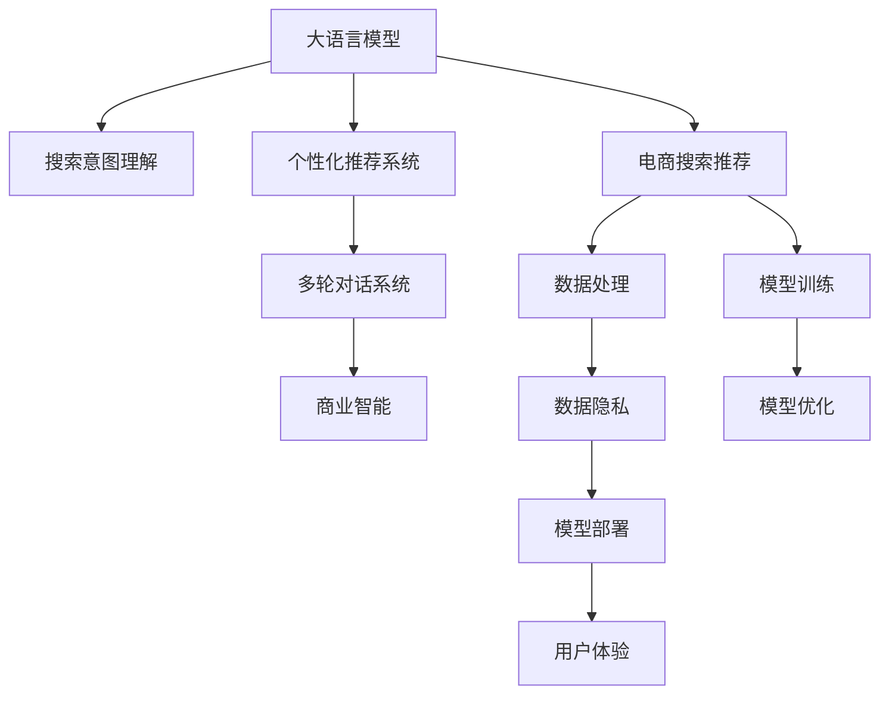

                 

# AI大模型重构电商搜索推荐的业务形态

> 关键词：大语言模型, 电商搜索推荐, 重构业务形态, 搜索引擎, 自然语言处理, 个性化推荐系统, 商业智能

## 1. 背景介绍

### 1.1 问题由来

随着人工智能技术的不断发展，大语言模型在电商搜索推荐领域的应用变得越来越广泛。传统的搜索推荐系统多依赖于统计模型和规则引擎，难以处理复杂的用户行为和商品特征。而大语言模型能够理解自然语言，捕捉用户意图，从而为电商搜索推荐带来新的突破。

当前，许多电商巨头如亚马逊、京东、阿里巴巴等都在积极探索大语言模型在搜索推荐中的应用，以提升用户体验和销售转化率。例如，亚马逊的Alexa语音助手，京东的达摩院，阿里巴巴的天机模型，都在探索大语言模型在电商领域的应用，力求打造更智能、更个性化的购物体验。

### 1.2 问题核心关键点

目前，大语言模型在电商搜索推荐中的应用，主要集中在以下几个方面：

- **搜索意图理解**：通过自然语言理解技术，理解用户搜索的意图和上下文信息，提高搜索结果的相关性。
- **商品推荐**：利用自然语言生成技术，为每个用户推荐符合其兴趣和需求的商品。
- **对话交互**：利用大语言模型进行多轮对话，解答用户问题，提供个性化建议。

这些应用的核心在于大语言模型的深度理解和自然语言处理能力，可以大大提升电商搜索推荐的精准度和用户体验。然而，大语言模型在电商领域的重构，还面临着许多挑战，如数据隐私、模型训练成本、搜索效率等。本文将系统探讨这些挑战，并提出相应的解决方案。

### 1.3 问题研究意义

大语言模型在电商搜索推荐中的应用，将彻底改变电商的业务形态，带来以下几个方面的变革：

- **提升用户体验**：通过深度理解用户需求和行为，提供更加个性化和精准的搜索结果和推荐，提升用户满意度。
- **优化营销策略**：通过分析用户行为数据，为电商营销提供更有价值的洞察，优化广告投放策略，提高转化率。
- **提高运营效率**：自动化处理海量搜索请求，减少人工干预，提升运营效率，降低成本。
- **推动创新**：为电商企业提供新的业务模式和技术工具，推动电商行业的技术创新和业务升级。

## 2. 核心概念与联系

### 2.1 核心概念概述

为更好地理解大语言模型在电商搜索推荐中的应用，本节将介绍几个关键概念：

- **大语言模型**：以Transformer为代表的深度学习模型，通过大规模无监督训练，具备强大的自然语言处理能力。例如GPT-3、BERT、T5等。
- **电商搜索推荐**：基于用户搜索行为和商品特征，为用户推荐符合其需求的商品，提升用户体验和转化率。包括搜索、排序、推荐、对话等多个环节。
- **搜索意图理解**：通过自然语言处理技术，理解用户搜索的意图和上下文信息，提高搜索结果的相关性。
- **个性化推荐系统**：利用用户历史行为数据和商品属性，为每个用户推荐符合其兴趣和需求的商品。
- **多轮对话系统**：通过多轮对话，解答用户问题，提供个性化建议，提升用户购物体验。
- **商业智能**：利用数据挖掘、统计分析、预测建模等技术，提升电商决策的科学性和精准度。

这些概念之间的逻辑关系可以通过以下Mermaid流程图来展示：



这个流程图展示了大语言模型在电商搜索推荐中各个环节的逻辑联系：

1. 大语言模型通过自然语言处理技术，理解用户搜索意图和商品特征。
2. 利用搜索意图理解，构建个性化推荐系统，为每个用户推荐符合其兴趣的商品。
3. 通过多轮对话系统，解答用户问题，提供个性化建议。
4. 结合商业智能，提升电商决策的科学性和精准度。

这些概念共同构成了大语言模型在电商搜索推荐中的应用框架，使其能够深度整合电商业务，提升用户体验和运营效率。

## 3. 核心算法原理 & 具体操作步骤

### 3.1 算法原理概述

大语言模型在电商搜索推荐中的应用，本质上是一个深度学习模型和自然语言处理的结合问题。其核心思想是：利用大语言模型的深度理解能力，通过自然语言处理技术，构建电商搜索推荐系统，提升用户体验和转化率。

具体来说，步骤如下：

1. 收集电商平台的海量用户搜索数据和商品数据，构建训练集。
2. 利用大语言模型进行预训练，学习通用的语言表示。
3. 在电商搜索推荐任务的监督数据上，对大语言模型进行微调，提升其对特定任务的理解能力。
4. 利用微调后的模型进行搜索意图理解、个性化推荐、多轮对话等任务，构建电商搜索推荐系统。

### 3.2 算法步骤详解

**Step 1: 数据收集与处理**

- **数据来源**：电商平台的搜索日志、用户点击数据、商品属性、评分等。
- **数据预处理**：清洗数据、标准化处理、特征提取等，构建训练集。

**Step 2: 大语言模型预训练**

- **预训练模型**：选择GPT-3、BERT、T5等预训练模型，加载并初始化模型参数。
- **预训练任务**：通过自监督学习任务（如语言模型、掩码语言模型、下一句预测等），对预训练模型进行训练，学习通用的语言表示。

**Step 3: 大语言模型微调**

- **微调目标**：构建电商搜索推荐任务的监督数据集，对预训练模型进行微调，提升其对特定任务的推理能力。
- **微调数据**：用户搜索意图、商品属性、用户行为数据等。
- **微调模型**：利用监督学习算法（如SGD、Adam等），最小化损失函数（如交叉熵损失），优化模型参数。
- **微调策略**：根据电商搜索推荐任务的特点，设计合适的任务适配层和损失函数，优化超参数（如学习率、批大小等）。

**Step 4: 电商搜索推荐系统构建**

- **搜索意图理解**：利用微调后的语言模型，理解用户搜索的意图和上下文信息。
- **个性化推荐**：构建推荐模型，利用用户历史行为数据和商品属性，为每个用户推荐符合其兴趣的商品。
- **多轮对话**：利用对话模型，解答用户问题，提供个性化建议。
- **商业智能**：结合数据挖掘、统计分析等技术，提升电商决策的科学性和精准度。

### 3.3 算法优缺点

大语言模型在电商搜索推荐中的应用，具有以下优点：

- **自然语言理解能力强**：大语言模型能够理解自然语言，捕捉用户意图，提高搜索结果的相关性。
- **个性化推荐准确度高**：利用大语言模型的深度理解能力，构建个性化推荐系统，提升用户满意度。
- **多轮对话流畅**：通过多轮对话系统，解答用户问题，提供个性化建议，提升用户体验。

同时，该方法也存在一定的局限性：

- **数据隐私问题**：电商搜索推荐涉及大量用户隐私数据，需要严格保护，避免数据泄露。
- **模型训练成本高**：大语言模型训练需要大量的计算资源和标注数据，成本较高。
- **搜索效率问题**：大语言模型处理自然语言的能力较强，但处理大规模搜索请求时效率较低。
- **多轮对话复杂**：多轮对话系统需要高精度的理解和生成模型，设计和调试复杂。

尽管存在这些局限性，但就目前而言，大语言模型在电商搜索推荐中的应用范式，仍然具有显著的潜力。未来相关研究的重点在于如何进一步降低训练成本，提高搜索效率，保护用户隐私，同时兼顾可解释性和业务适用性等因素。

### 3.4 算法应用领域

大语言模型在电商搜索推荐中的应用，可以覆盖电商业务中的各个环节，包括搜索、推荐、客服、营销等多个方面。以下是几个典型的应用场景：

- **搜索意图理解**：用户搜索“苹果iPhone 12”，系统理解其意图为购买iPhone 12手机，从搜索结果中优先推荐该产品。
- **个性化推荐**：根据用户历史购买记录和浏览行为，推荐用户可能感兴趣的商品，提升转化率。
- **多轮对话**：解答用户关于商品属性、配送时间、价格等问题，提升用户体验。
- **商业智能**：分析用户行为数据，发现电商运营中的趋势和规律，优化广告投放策略，提升营销效果。

除了这些经典应用外，大语言模型还可以应用于用户行为分析、商品标签生成、客服自动化等更多场景中，为电商业务带来新的价值。

## 4. 数学模型和公式 & 详细讲解 & 举例说明

### 4.1 数学模型构建

本节将使用数学语言对大语言模型在电商搜索推荐中的应用进行更加严格的刻画。

记电商平台的搜索数据为 $D=\{(x_i, y_i)\}_{i=1}^N$，其中 $x_i$ 为搜索语句，$y_i$ 为搜索结果。

定义搜索意图理解模型的损失函数为 $\ell_\text{sg}(M_\theta, D)$，其目标是最小化模型 $M_\theta$ 在数据集 $D$ 上的预测结果与真实标签之间的差距。假设模型输出为 $\hat{y}_i=M_\theta(x_i)$，则损失函数为：

$$
\ell_\text{sg}(M_\theta, D) = \frac{1}{N}\sum_{i=1}^N \ell_\text{sg}(M_\theta(x_i), y_i)
$$

其中 $\ell_\text{sg}$ 为搜索意图理解模型的损失函数，可采用交叉熵损失、负对数似然损失等。

对于个性化推荐系统，假设商品集合为 $G=\{g_k\}_{k=1}^K$，用户历史行为数据为 $H=\{h_j\}_{j=1}^M$，推荐模型为 $R_\theta$。定义推荐模型的损失函数为 $\ell_\text{rc}(R_\theta, H, G)$，其目标是最小化模型 $R_\theta$ 对用户 $j$ 的推荐结果与真实用户行为 $h_j$ 之间的差距。推荐模型输出为 $\hat{r}_{jk} = R_\theta(h_j, g_k)$，则损失函数为：

$$
\ell_\text{rc}(R_\theta, H, G) = \frac{1}{M}\sum_{j=1}^M \ell_\text{rc}(R_\theta(h_j), H, G)
$$

其中 $\ell_\text{rc}$ 为个性化推荐模型的损失函数，可采用均方误差损失、Huber损失等。

### 4.2 公式推导过程

以搜索意图理解为例，推导其损失函数的计算公式。

假设搜索意图理解模型 $M_\theta$ 在输入 $x_i$ 上的输出为 $\hat{y}_i=M_\theta(x_i)$，真实标签 $y_i \in \{1, 0\}$，表示搜索结果是否包含用户请求的商品。则二分类交叉熵损失函数定义为：

$$
\ell_\text{sg}(M_\theta(x_i), y_i) = -[y_i\log \hat{y}_i + (1-y_i)\log (1-\hat{y}_i)]
$$

将其代入经验风险公式，得：

$$
\ell_\text{sg}(M_\theta, D) = -\frac{1}{N}\sum_{i=1}^N [y_i\log M_\theta(x_i)+(1-y_i)\log(1-M_\theta(x_i))]
$$

在得到损失函数的梯度后，即可带入参数更新公式，完成模型的迭代优化。

### 4.3 案例分析与讲解

假设用户搜索“苹果iPhone 12”，系统会调用搜索意图理解模型 $M_\theta$ 进行意图分析，输出 $\hat{y}_i$。如果 $\hat{y}_i=1$，则表示系统理解该搜索意图为购买iPhone 12手机，从搜索结果中优先推荐该产品。如果 $\hat{y}_i=0$，则表示系统理解该搜索意图为查询iPhone 12手机信息，不进行优先推荐。

对于个性化推荐，假设用户 $j$ 的历史行为数据为 $h_j$，商品集合为 $G=\{g_k\}_{k=1}^K$。系统调用推荐模型 $R_\theta$，计算用户 $j$ 对商品 $g_k$ 的兴趣匹配度 $\hat{r}_{jk} = R_\theta(h_j, g_k)$。如果 $\hat{r}_{jk}$ 较高，则系统推荐该商品给用户 $j$。

## 5. 项目实践：代码实例和详细解释说明

### 5.1 开发环境搭建

在进行电商搜索推荐应用的开发前，我们需要准备好开发环境。以下是使用Python进行PyTorch开发的环境配置流程：

1. 安装Anaconda：从官网下载并安装Anaconda，用于创建独立的Python环境。

2. 创建并激活虚拟环境：
```bash
conda create -n ecomm-env python=3.8 
conda activate ecomm-env
```

3. 安装PyTorch：根据CUDA版本，从官网获取对应的安装命令。例如：
```bash
conda install pytorch torchvision torchaudio cudatoolkit=11.1 -c pytorch -c conda-forge
```

4. 安装Transformers库：
```bash
pip install transformers
```

5. 安装各类工具包：
```bash
pip install numpy pandas scikit-learn matplotlib tqdm jupyter notebook ipython
```

完成上述步骤后，即可在`ecomm-env`环境中开始电商搜索推荐应用的开发。

### 5.2 源代码详细实现

下面我们以搜索意图理解任务为例，给出使用Transformers库对BERT模型进行微调的PyTorch代码实现。

首先，定义搜索意图理解任务的数据处理函数：

```python
from transformers import BertTokenizer
from torch.utils.data import Dataset
import torch

class SearchIntentDataset(Dataset):
    def __init__(self, texts, labels, tokenizer, max_len=128):
        self.texts = texts
        self.labels = labels
        self.tokenizer = tokenizer
        self.max_len = max_len
        
    def __len__(self):
        return len(self.texts)
    
    def __getitem__(self, item):
        text = self.texts[item]
        label = self.labels[item]
        
        encoding = self.tokenizer(text, return_tensors='pt', max_length=self.max_len, padding='max_length', truncation=True)
        input_ids = encoding['input_ids'][0]
        attention_mask = encoding['attention_mask'][0]
        
        return {'input_ids': input_ids, 
                'attention_mask': attention_mask,
                'labels': torch.tensor(label, dtype=torch.long)}
```

然后，定义模型和优化器：

```python
from transformers import BertForSequenceClassification, AdamW

model = BertForSequenceClassification.from_pretrained('bert-base-cased', num_labels=2)

optimizer = AdamW(model.parameters(), lr=2e-5)
```

接着，定义训练和评估函数：

```python
from torch.utils.data import DataLoader
from tqdm import tqdm
from sklearn.metrics import classification_report

device = torch.device('cuda') if torch.cuda.is_available() else torch.device('cpu')
model.to(device)

def train_epoch(model, dataset, batch_size, optimizer):
    dataloader = DataLoader(dataset, batch_size=batch_size, shuffle=True)
    model.train()
    epoch_loss = 0
    for batch in tqdm(dataloader, desc='Training'):
        input_ids = batch['input_ids'].to(device)
        attention_mask = batch['attention_mask'].to(device)
        labels = batch['labels'].to(device)
        model.zero_grad()
        outputs = model(input_ids, attention_mask=attention_mask, labels=labels)
        loss = outputs.loss
        epoch_loss += loss.item()
        loss.backward()
        optimizer.step()
    return epoch_loss / len(dataloader)

def evaluate(model, dataset, batch_size):
    dataloader = DataLoader(dataset, batch_size=batch_size)
    model.eval()
    preds, labels = [], []
    with torch.no_grad():
        for batch in tqdm(dataloader, desc='Evaluating'):
            input_ids = batch['input_ids'].to(device)
            attention_mask = batch['attention_mask'].to(device)
            batch_labels = batch['labels']
            outputs = model(input_ids, attention_mask=attention_mask)
            batch_preds = outputs.logits.argmax(dim=2).to('cpu').tolist()
            batch_labels = batch_labels.to('cpu').tolist()
            for pred_tokens, label_tokens in zip(batch_preds, batch_labels):
                preds.append(pred_tokens)
                labels.append(label_tokens)
                
    print(classification_report(labels, preds))
```

最后，启动训练流程并在验证集上评估：

```python
epochs = 5
batch_size = 16

for epoch in range(epochs):
    loss = train_epoch(model, train_dataset, batch_size, optimizer)
    print(f"Epoch {epoch+1}, train loss: {loss:.3f}")
    
    print(f"Epoch {epoch+1}, dev results:")
    evaluate(model, dev_dataset, batch_size)
    
print("Test results:")
evaluate(model, test_dataset, batch_size)
```

以上就是使用PyTorch对BERT进行搜索意图理解任务微调的完整代码实现。可以看到，得益于Transformers库的强大封装，我们可以用相对简洁的代码完成BERT模型的加载和微调。

### 5.3 代码解读与分析

让我们再详细解读一下关键代码的实现细节：

**SearchIntentDataset类**：
- `__init__`方法：初始化文本、标签、分词器等关键组件。
- `__len__`方法：返回数据集的样本数量。
- `__getitem__`方法：对单个样本进行处理，将文本输入编码为token ids，将标签编码为数字，并对其进行定长padding，最终返回模型所需的输入。

**训练和评估函数**：
- 使用PyTorch的DataLoader对数据集进行批次化加载，供模型训练和推理使用。
- 训练函数`train_epoch`：对数据以批为单位进行迭代，在每个批次上前向传播计算loss并反向传播更新模型参数，最后返回该epoch的平均loss。
- 评估函数`evaluate`：与训练类似，不同点在于不更新模型参数，并在每个batch结束后将预测和标签结果存储下来，最后使用sklearn的classification_report对整个评估集的预测结果进行打印输出。

**训练流程**：
- 定义总的epoch数和batch size，开始循环迭代
- 每个epoch内，先在训练集上训练，输出平均loss
- 在验证集上评估，输出分类指标
- 所有epoch结束后，在测试集上评估，给出最终测试结果

可以看到，PyTorch配合Transformers库使得BERT微调的代码实现变得简洁高效。开发者可以将更多精力放在数据处理、模型改进等高层逻辑上，而不必过多关注底层的实现细节。

当然，工业级的系统实现还需考虑更多因素，如模型的保存和部署、超参数的自动搜索、更灵活的任务适配层等。但核心的微调范式基本与此类似。

## 6. 实际应用场景

### 6.1 智能客服系统

基于大语言模型在电商搜索推荐中的应用，智能客服系统可以进一步提升用户体验和运营效率。传统客服往往需要配备大量人力，高峰期响应缓慢，且一致性和专业性难以保证。而使用微调后的搜索意图理解模型，可以7x24小时不间断服务，快速响应客户咨询，用自然流畅的语言解答各类常见问题。

在技术实现上，可以收集企业内部的历史客服对话记录，将问题和最佳答复构建成监督数据，在此基础上对预训练搜索意图理解模型进行微调。微调后的搜索意图理解模型能够自动理解用户意图，匹配最合适的答案模板进行回复。对于客户提出的新问题，还可以接入检索系统实时搜索相关内容，动态组织生成回答。如此构建的智能客服系统，能大幅提升客户咨询体验和问题解决效率。

### 6.2 个性化推荐系统

当前的推荐系统往往只依赖于用户的历史行为数据进行物品推荐，难以处理复杂的用户行为和商品特征。而大语言模型能够理解自然语言，捕捉用户意图，从而为电商推荐带来新的突破。

在实践中，可以收集用户浏览、点击、评论、分享等行为数据，提取和商品交互的物品标题、描述、标签等文本内容。将文本内容作为模型输入，用户的后续行为（如是否点击、购买等）作为监督信号，在此基础上微调预训练语言模型。微调后的模型能够从文本内容中准确把握用户的兴趣点。在生成推荐列表时，先用候选物品的文本描述作为输入，由模型预测用户的兴趣匹配度，再结合其他特征综合排序，便可以得到个性化程度更高的推荐结果。

### 6.3 对话交互

大语言模型在电商搜索推荐中的应用，还可以扩展到多轮对话交互中。通过多轮对话，解答用户问题，提供个性化建议，提升用户体验。例如，用户搜索“苹果iPhone 12”，系统会调用搜索意图理解模型进行分析，然后根据用户的历史行为数据和商品信息，生成个性化的推荐结果。

在对话过程中，系统会记录用户的每一轮输入和输出，实时更新用户的兴趣点，并调整推荐结果，以确保推荐的实时性和个性化。多轮对话交互能够大大提升用户的购物体验，减少用户的搜索时间和操作步骤。

### 6.4 未来应用展望

随着大语言模型在电商搜索推荐中的应用不断深入，未来将带来更多的创新和突破：

1. **多模态搜索推荐**：除了文本搜索，还可以扩展到图像、视频等多模态数据。例如，用户上传图片搜索商品，系统会调用图像识别模型进行分析，并提供推荐结果。

2. **实时个性化推荐**：利用实时数据流处理技术，实现基于用户即时行为数据的推荐，提升推荐的实时性和个性化。例如，用户浏览某商品5分钟未点击，系统会调整推荐结果，优先推荐该商品。

3. **情感分析与舆情监控**：利用自然语言处理技术，分析用户的情感倾向和舆情变化，为电商运营提供更丰富的数据支持。例如，分析用户在社交媒体上的评论，评估品牌声誉和市场趋势。

4. **个性化营销策略**：通过分析用户行为数据，发现电商运营中的趋势和规律，优化广告投放策略，提升营销效果。例如，基于用户兴趣标签，精准投放广告，提高转化率。

5. **多语言搜索推荐**：利用多语言处理技术，实现对全球用户的支持，拓展电商市场。例如，支持多语言搜索、推荐和客服，满足全球用户的需求。

6. **智能客服与智能运营**：通过自然语言处理技术，构建智能客服系统，提升客服效率和用户满意度。通过数据分析和智能调度，优化运营策略，提升运营效率。

总之，大语言模型在电商搜索推荐中的应用，将彻底改变电商的业务形态，带来更高效、更智能、更个性化的用户体验。未来，随着技术的不断进步和应用的不断深入，大语言模型在电商领域将发挥更大的价值。

## 7. 工具和资源推荐

### 7.1 学习资源推荐

为了帮助开发者系统掌握大语言模型在电商搜索推荐中的应用，这里推荐一些优质的学习资源：

1. **《深度学习与自然语言处理》课程**：由斯坦福大学开设的NLP明星课程，系统讲解自然语言处理的基本概念和前沿技术，包括搜索意图理解、个性化推荐等。

2. **《自然语言处理与搜索推荐》书籍**：系统介绍自然语言处理技术在搜索推荐中的应用，涵盖搜索引擎、推荐系统、多轮对话等。

3. **Transformers官方文档**：详细介绍BERT、GPT等预训练模型的使用方法和微调技术，适合初学者和进阶开发者。

4. **HuggingFace官方博客**：提供大量实用的NLP应用案例和代码示例，适合实战学习。

5. **Kaggle竞赛平台**：举办多项自然语言处理和推荐系统竞赛，提供丰富的数据集和挑战任务，适合练习和提升。

通过这些资源的学习实践，相信你一定能够快速掌握大语言模型在电商搜索推荐中的应用技巧，并用于解决实际的NLP问题。

### 7.2 开发工具推荐

高效的开发离不开优秀的工具支持。以下是几款用于大语言模型在电商搜索推荐中应用的常用工具：

1. **PyTorch**：基于Python的开源深度学习框架，灵活动态的计算图，适合快速迭代研究。

2. **TensorFlow**：由Google主导开发的开源深度学习框架，生产部署方便，适合大规模工程应用。

3. **Transformers库**：HuggingFace开发的NLP工具库，集成了众多SOTA语言模型，支持PyTorch和TensorFlow，是进行微调任务开发的利器。

4. **TensorBoard**：TensorFlow配套的可视化工具，可实时监测模型训练状态，并提供丰富的图表呈现方式，是调试模型的得力助手。

5. **Jupyter Notebook**：免费在线编辑器，支持代码编写、数据可视化、模型训练等，适合学习和研究。

合理利用这些工具，可以显著提升大语言模型在电商搜索推荐中的开发效率，加快创新迭代的步伐。

### 7.3 相关论文推荐

大语言模型在电商搜索推荐中的应用，源于学界的持续研究。以下是几篇奠基性的相关论文，推荐阅读：

1. **《基于深度学习的搜索引擎》**：介绍搜索引擎的构建方法和核心技术，包括自然语言处理和搜索意图理解。

2. **《个性化推荐系统综述》**：系统综述个性化推荐算法和技术，涵盖协同过滤、内容推荐、混合推荐等。

3. **《多模态搜索推荐》**：研究多模态数据在搜索推荐中的应用，包括文本、图像、视频等多种数据类型。

4. **《多轮对话系统》**：介绍多轮对话系统的构建方法，涵盖对话理解、对话生成、对话管理等。

5. **《智能客服系统》**：系统介绍智能客服系统的构建方法和技术，涵盖自然语言处理、对话理解、推荐系统等。

这些论文代表了大语言模型在电商搜索推荐技术的发展脉络。通过学习这些前沿成果，可以帮助研究者把握学科前进方向，激发更多的创新灵感。

## 8. 总结：未来发展趋势与挑战

### 8.1 总结

本文对大语言模型在电商搜索推荐中的应用进行了全面系统的介绍。首先阐述了大语言模型和电商搜索推荐的研究背景和意义，明确了其在大规模电商平台中的应用前景。其次，从原理到实践，详细讲解了大语言模型在电商搜索推荐中的数学模型、公式推导和代码实现，提供了完整的微调流程和案例分析。同时，本文还广泛探讨了其在大规模电商平台中的应用场景，展示了其在智能客服、个性化推荐、对话交互等方面的巨大潜力。此外，本文精选了相关学习资源，力求为读者提供全方位的技术指引。

通过本文的系统梳理，可以看到，大语言模型在电商搜索推荐中的应用，正在逐步改变电商的业务形态，提升用户体验和运营效率。得益于深度学习和自然语言处理技术的不断进步，大语言模型在电商领域将发挥更大的价值。

### 8.2 未来发展趋势

展望未来，大语言模型在电商搜索推荐中的应用，将呈现以下几个发展趋势：

1. **多模态搜索推荐**：除文本外，将更多模态数据（如图像、视频）整合到搜索推荐系统中，提升推荐效果。例如，用户上传图片搜索商品，系统调用图像识别模型进行分析，并提供推荐结果。

2. **实时个性化推荐**：利用实时数据流处理技术，实现基于用户即时行为数据的推荐，提升推荐实时性和个性化。例如，用户浏览某商品5分钟未点击，系统会调整推荐结果，优先推荐该商品。

3. **多语言搜索推荐**：利用多语言处理技术，实现对全球用户的支持，拓展电商市场。例如，支持多语言搜索、推荐和客服，满足全球用户的需求。

4. **多轮对话系统**：通过多轮对话，解答用户问题，提供个性化建议，提升用户体验。例如，用户搜索“苹果iPhone 12”，系统会调用搜索意图理解模型进行分析，然后根据用户的历史行为数据和商品信息，生成个性化的推荐结果。

5. **情感分析与舆情监控**：利用自然语言处理技术，分析用户的情感倾向和舆情变化，为电商运营提供更丰富的数据支持。例如，分析用户在社交媒体上的评论，评估品牌声誉和市场趋势。

6. **个性化营销策略**：通过分析用户行为数据，发现电商运营中的趋势和规律，优化广告投放策略，提升营销效果。例如，基于用户兴趣标签，精准投放广告，提高转化率。

这些趋势凸显了大语言模型在电商搜索推荐中的应用前景。这些方向的探索发展，必将进一步提升电商搜索推荐的精准度和用户体验，为电商业务带来新的变革。

### 8.3 面临的挑战

尽管大语言模型在电商搜索推荐中的应用取得了显著成效，但在迈向更加智能化、普适化应用的过程中，仍面临诸多挑战：

1. **数据隐私问题**：电商搜索推荐涉及大量用户隐私数据，需要严格保护，避免数据泄露。如何在大规模数据处理中保护用户隐私，是个亟待解决的难题。

2. **模型训练成本高**：大语言模型训练需要大量的计算资源和标注数据，成本较高。如何降低模型训练成本，提高训练效率，是个重要研究方向。

3. **搜索效率问题**：大语言模型处理自然语言的能力较强，但处理大规模搜索请求时效率较低。如何在大规模数据下保持高效率，是个关键技术挑战。

4. **多轮对话复杂**：多轮对话系统需要高精度的理解和生成模型，设计和调试复杂。如何构建高精度的多轮对话系统，是个重要研究方向。

5. **可解释性不足**：大语言模型往往是“黑盒”系统，难以解释其内部工作机制和决策逻辑。如何增强模型的可解释性，提高用户信任，是个重要研究方向。

6. **应用场景限制**：大语言模型在某些特定场景下，如医疗、金融等，应用效果有限。如何拓展大语言模型的应用范围，是个重要研究方向。

尽管存在这些挑战，但就目前而言，大语言模型在电商搜索推荐中的应用范式，仍然具有显著的潜力。未来相关研究的重点在于如何进一步降低训练成本，提高搜索效率，保护用户隐私，同时兼顾可解释性和业务适用性等因素。

### 8.4 研究展望

面对大语言模型在电商搜索推荐中应用所面临的种种挑战，未来的研究需要在以下几个方面寻求新的突破：

1. **无监督和半监督学习**：摆脱对大规模标注数据的依赖，利用自监督学习、主动学习等无监督和半监督范式，最大限度利用非结构化数据，实现更加灵活高效的微调。

2. **参数高效微调**：开发更加参数高效的微调方法，在固定大部分预训练参数的同时，只更新极少量的任务相关参数。同时优化微调模型的计算图，减少前向传播和反向传播的资源消耗，实现更加轻量级、实时性的部署。

3. **因果学习和对比学习**：通过引入因果推断和对比学习思想，增强微调模型建立稳定因果关系的能力，学习更加普适、鲁棒的语言表征，从而提升模型泛化性和抗干扰能力。

4. **多模态数据整合**：将符号化的先验知识，如知识图谱、逻辑规则等，与神经网络模型进行巧妙融合，引导微调过程学习更准确、合理的语言模型。同时加强不同模态数据的整合，实现视觉、语音等多模态信息与文本信息的协同建模。

5. **因果分析和博弈论**：将因果分析方法引入微调模型，识别出模型决策的关键特征，增强输出解释的因果性和逻辑性。借助博弈论工具刻画人机交互过程，主动探索并规避模型的脆弱点，提高系统稳定性。

6. **伦理道德约束**：在模型训练目标中引入伦理导向的评估指标，过滤和惩罚有偏见、有害的输出倾向。同时加强人工干预和审核，建立模型行为的监管机制，确保输出符合人类价值观和伦理道德。

这些研究方向的探索，必将引领大语言模型在电商搜索推荐中的应用进入新的发展阶段，为构建智能、高效、安全的电商搜索推荐系统提供更坚实的技术基础。面向未来，大语言模型在电商领域的应用将不断拓展，为电商业务带来更多创新和突破。

## 9. 附录：常见问题与解答

**Q1：大语言模型在电商搜索推荐中的应用有哪些优势？**

A: 大语言模型在电商搜索推荐中的应用，具有以下优势：

1. **自然语言理解能力强**：大语言模型能够理解自然语言，捕捉用户意图，提高搜索结果的相关性。

2. **个性化推荐准确度高**：利用大语言模型的深度理解能力，构建个性化推荐系统，提升用户满意度。

3. **多轮对话流畅**：通过多轮对话，解答用户问题，提供个性化建议，提升用户体验。

4. **实时个性化推荐**：利用实时数据流处理技术，实现基于用户即时行为数据的推荐，提升推荐实时性和个性化。

5. **多语言支持**：利用多语言处理技术，实现对全球用户的支持，拓展电商市场。

**Q2：大语言模型在电商搜索推荐中面临哪些挑战？**

A: 大语言模型在电商搜索推荐中的应用，面临以下挑战：

1. **数据隐私问题**：电商搜索推荐涉及大量用户隐私数据，需要严格保护，避免数据泄露。

2. **模型训练成本高**：大语言模型训练需要大量的计算资源和标注数据，成本较高。

3. **搜索效率问题**：大语言模型处理自然语言的能力较强，但处理大规模搜索请求时效率较低。

4. **多轮对话复杂**：多轮对话系统需要高精度的理解和生成模型，设计和调试复杂。

5. **可解释性不足**：大语言模型往往是“黑盒”系统，难以解释其内部工作机制和决策逻辑。

6. **应用场景限制**：大语言模型在某些特定场景下，如医疗、金融等，应用效果有限。

**Q3：如何优化大语言模型在电商搜索推荐中的性能？**

A: 为了优化大语言模型在电商搜索推荐中的性能，可以采取以下措施：

1. **数据增强**：通过回译、近义替换等方式扩充训练集，减少过拟合风险。

2. **正则化技术**：使用L2正则、Dropout、Early Stopping等正则化技术，防止模型过度适应小规模训练集。

3. **模型裁剪**：去除不必要的层和参数，减小模型尺寸，加快推理速度。

4. **量化加速**：将浮点模型转为定点模型，压缩存储空间，提高计算效率。

5. **多模型集成**：训练多个微调模型，取平均输出，抑制过拟合。

6. **因果分析和博弈论**：将因果分析方法引入微调模型，识别出模型决策的关键特征，增强输出解释的因果性和逻辑性。

这些优化措施可以提升大语言模型在电商搜索推荐中的性能，确保其在实际应用中的高效和稳定。

**Q4：如何保护电商搜索推荐中的用户隐私？**

A: 保护电商搜索推荐中的用户隐私，可以采取以下措施：

1. **数据匿名化**：对用户数据进行匿名化处理，去除个人敏感信息。

2. **数据加密**：采用加密技术保护数据传输和存储的安全性。

3. **访问控制**：对用户数据进行严格的访问控制，确保只有授权人员可以访问数据。

4. **差分隐私**：利用差分隐私技术，在保护隐私的前提下，提供有价值的信息。

5. **隐私计算**：采用隐私计算技术，在数据不出本地的情况下，进行数据分析和处理。

这些措施可以有效保护电商搜索推荐中的用户隐私，确保用户数据的安全和合规。

**Q5：如何构建高精度的多轮对话系统？**

A: 构建高精度的多轮对话系统，可以采取以下措施：

1. **多轮对话理解**：利用多轮对话理解技术，捕捉用户意图和上下文信息，提高对话质量。

2. **上下文管理**：利用上下文管理技术，记录用户对话历史，维护对话上下文，提升对话连贯性。

3. **生成模型优化**：利用生成模型优化技术，生成自然流畅的回复，提升用户体验。

4. **对话策略设计**：设计合理的对话策略，引导用户自然互动，提升对话效率。

5. **持续学习**：利用持续学习技术，不断更新对话模型，提高对话系统的适应性。

这些措施可以有效提升多轮对话系统的精度和流畅度，确保其在实际应用中的效果和稳定性。

---

作者：禅与计算机程序设计艺术 / Zen and the Art of Computer Programming

