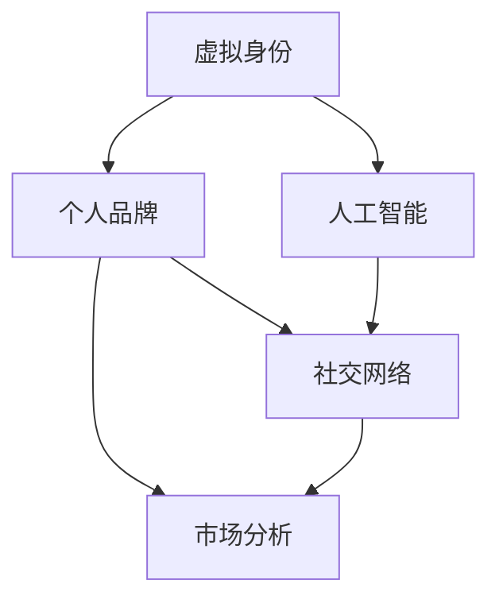

                 

# 虚拟身份市场分析：AI时代的个人品牌研究

> 关键词：虚拟身份, 个人品牌, 人工智能, 市场分析, 社交网络

## 1. 背景介绍

随着数字技术的迅猛发展，虚拟身份市场逐渐成为一个备受关注的新领域。在AI时代，个人品牌建设不再是单纯的人际交往，而是融合了技术的全方位展示。借助AI技术，个人可以在虚拟空间中创建和塑造全新的身份，以提升个人影响力、实现职业发展或进行社交互动。虚拟身份市场逐渐成为连接现实与虚拟、线上与线下、个性化与专业化的重要桥梁。

### 1.1 问题由来
在数字化的浪潮中，虚拟身份已成为人们线上生活的重要组成部分。个人品牌建设不再是单纯的“面对面”交往，而是通过虚拟形象、虚拟行为在互联网空间中塑造。AI技术的普及，为虚拟身份市场的繁荣提供了技术支撑，推动了虚拟身份从基础的社交网络工具向全方位的个人品牌塑造工具转变。然而，虚拟身份市场的发展也伴随着诸多问题，如身份认同、隐私保护、法律法规等，亟需深入分析和研究。

### 1.2 问题核心关键点
虚拟身份市场的核心关键点包括：
1. **身份认同**：虚拟身份如何真实反映个人特质，以及如何构建与现实身份的和谐统一。
2. **隐私保护**：虚拟身份的创建和使用过程中，如何保障用户的隐私安全。
3. **法律法规**：虚拟身份市场的运营规范，以及如何制定相关的法律法规框架。
4. **市场规模**：虚拟身份市场的整体规模、增长潜力和未来发展方向。
5. **技术基础**：AI技术在虚拟身份市场中的应用，包括但不限于自然语言处理、计算机视觉、增强现实等。

## 2. 核心概念与联系

### 2.1 核心概念概述

为更好地理解虚拟身份市场的运作原理和应用场景，本节将介绍几个关键概念及其相互联系：

1. **虚拟身份**：指在虚拟空间中由AI技术创建的个人形象，包括但不限于社交媒体账户、虚拟角色、虚拟活动等。
2. **个人品牌**：指通过在虚拟空间中的行为和表现，建立起来的具有独特价值和影响力的形象。
3. **人工智能**：指通过算法和数据驱动的智能技术，用于创建和管理虚拟身份，提升个人品牌影响力。
4. **市场分析**：指对虚拟身份市场的规模、结构、增长驱动因素等进行的系统研究。
5. **社交网络**：指在虚拟身份市场中，用户之间通过AI技术驱动的社交互动网络。

这些核心概念之间的逻辑关系可以通过以下Mermaid流程图来展示：



这个流程图展示了几者之间的联系：

1. 虚拟身份是个人品牌在虚拟空间中的具体体现。
2. 人工智能技术是创建和管理虚拟身份的核心工具。
3. 市场分析揭示了虚拟身份市场的规模和潜力。
4. 社交网络是虚拟身份市场中用户互动的基础平台。

## 3. 核心算法原理 & 具体操作步骤
### 3.1 算法原理概述

虚拟身份市场中的核心算法原理主要包括AI技术在身份创建、行为分析和互动管理中的应用。其核心思想是通过AI算法，精准捕捉用户的个性化特征，构建虚拟身份，并通过与现实身份的互动，形成稳固的个人品牌形象。

具体来说，虚拟身份市场中的算法原理可以概括为：

1. **身份创建算法**：基于用户的数据和行为，通过机器学习、深度学习等AI技术，生成个性化的虚拟身份。
2. **行为分析算法**：利用自然语言处理、计算机视觉等技术，分析用户在线上的行为模式，评估其品牌影响力。
3. **互动管理算法**：通过推荐系统、智能匹配等AI技术，优化虚拟身份间的互动，提升品牌影响力。

### 3.2 算法步骤详解

虚拟身份市场中的算法步骤大致分为以下几个阶段：

**Step 1: 数据收集与预处理**
- 收集用户的基本信息、历史行为数据、社交网络数据等。
- 对数据进行清洗、归一化处理，确保数据质量。

**Step 2: 特征提取与模型训练**
- 使用自然语言处理、计算机视觉等技术，提取用户的关键特征，如兴趣、偏好、影响力等。
- 基于这些特征，使用机器学习、深度学习等算法进行模型训练，生成虚拟身份。

**Step 3: 虚拟身份构建**
- 将训练好的模型应用于数据，生成虚拟身份。
- 对虚拟身份进行优化和调整，确保其与现实身份和谐统一。

**Step 4: 行为分析与互动管理**
- 利用AI技术对虚拟身份的行为进行深入分析，评估其品牌影响力。
- 基于分析结果，使用推荐系统、智能匹配等技术，优化虚拟身份间的互动，提升品牌影响力。

### 3.3 算法优缺点

虚拟身份市场中的算法具有以下优点：
1. **高效精准**：通过AI技术，可以高效、精准地生成和管理虚拟身份，满足用户的个性化需求。
2. **实时互动**：利用AI技术，可以实时分析用户行为，优化互动管理，提升品牌影响力。
3. **广泛应用**：AI算法可以应用于多种虚拟身份管理场景，如社交网络、电子商务、在线教育等。

同时，这些算法也存在一定的局限性：
1. **隐私风险**：数据收集和处理过程中可能存在隐私泄露的风险。
2. **技术门槛**：AI算法的高技术门槛可能导致部分用户难以操作。
3. **模型偏见**：AI算法可能存在偏见，影响虚拟身份的真实性和公平性。
4. **伦理问题**：虚拟身份的创建和使用过程中可能涉及伦理问题，如虚假身份的传播、欺诈等。

### 3.4 算法应用领域

虚拟身份市场中的算法应用广泛，主要包括以下几个领域：

1. **社交网络**：用于创建和管理社交媒体账户，提升用户在社交网络中的影响力。
2. **电子商务**：用于创建虚拟店长、虚拟客服等角色，提升品牌知名度和用户体验。
3. **在线教育**：用于创建虚拟讲师、虚拟助教等角色，提升教育质量和学习效果。
4. **娱乐传媒**：用于创建虚拟偶像、虚拟主播等角色，提升娱乐内容的多样性和互动性。

## 4. 数学模型和公式 & 详细讲解 & 举例说明

### 4.1 数学模型构建

在虚拟身份市场中，主要的数学模型包括自然语言处理(NLP)模型、推荐系统、社交网络分析等。以下是几个核心的数学模型构建过程：

1. **NLP模型**：用于从文本数据中提取用户特征，如情感倾向、主题兴趣等。
2. **推荐系统模型**：用于预测用户行为，推荐虚拟身份间的互动内容。
3. **社交网络分析模型**：用于评估虚拟身份在社交网络中的影响力。

### 4.2 公式推导过程

以下是几个核心数学模型的公式推导过程：

**NLP模型的公式推导**：
假设有一个用户文本序列 $x_1, x_2, ..., x_n$，使用BERT模型进行嵌入，得到向量表示 $h_1, h_2, ..., h_n$。通过计算这些向量的平均值 $H$，可以得到用户文本的语义表示。

$$
H = \frac{1}{n} \sum_{i=1}^n h_i
$$

**推荐系统模型的公式推导**：
假设用户集合为 $U$，虚拟身份集合为 $I$，用户对虚拟身份的评分矩阵为 $R$，使用协同过滤算法推荐用户 $u$ 喜欢的虚拟身份 $i$。通过计算用户 $u$ 对虚拟身份 $i$ 的评分，推荐相似度最高的虚拟身份。

$$
i = \mathop{\arg\min}_{i \in I} \sum_{j \in U} (R_{uj} - R_{ui})^2
$$

**社交网络分析模型的公式推导**：
假设社交网络中虚拟身份 $i$ 的度数为 $d_i$，虚拟身份之间的连接度数为 $E_{ij}$，虚拟身份的特征向量为 $v_i$。通过计算虚拟身份的特征值 $v_i$ 和社交网络的中心性度量，可以评估虚拟身份在社交网络中的影响力。

$$
v_i = \sum_{j \in I} E_{ij} v_j
$$

### 4.3 案例分析与讲解

**案例一：虚拟店长推荐**
假设某电商平台希望推荐虚拟店长，提升用户购物体验。可以使用基于NLP的虚拟身份生成模型，根据用户历史购买记录和评价生成虚拟店长。然后，使用协同过滤算法，根据用户评分预测用户可能喜欢的虚拟店长，并推荐给用户。

**案例二：虚拟角色互动**
假设某在线教育平台希望增加虚拟角色的互动性，使用社交网络分析模型评估虚拟角色的影响力。然后，使用推荐系统算法，推荐与用户兴趣匹配的虚拟角色，提升用户参与度和满意度。

## 5. 项目实践：代码实例和详细解释说明
### 5.1 开发环境搭建

在进行虚拟身份市场开发前，我们需要准备好开发环境。以下是使用Python进行PyTorch开发的环境配置流程：

1. 安装Anaconda：从官网下载并安装Anaconda，用于创建独立的Python环境。

2. 创建并激活虚拟环境：
```bash
conda create -n pytorch-env python=3.8 
conda activate pytorch-env
```

3. 安装PyTorch：根据CUDA版本，从官网获取对应的安装命令。例如：
```bash
conda install pytorch torchvision torchaudio cudatoolkit=11.1 -c pytorch -c conda-forge
```

4. 安装Transformers库：
```bash
pip install transformers
```

5. 安装各类工具包：
```bash
pip install numpy pandas scikit-learn matplotlib tqdm jupyter notebook ipython
```

完成上述步骤后，即可在`pytorch-env`环境中开始虚拟身份市场开发实践。

### 5.2 源代码详细实现

我们以虚拟店长推荐系统为例，给出使用Transformers库进行NLP和推荐系统开发的PyTorch代码实现。

首先，定义NLP模型：

```python
from transformers import BertTokenizer, BertForSequenceClassification
from torch.utils.data import Dataset, DataLoader
import torch

class ReviewDataset(Dataset):
    def __init__(self, reviews, labels):
        self.reviews = reviews
        self.labels = labels
        self.tokenizer = BertTokenizer.from_pretrained('bert-base-uncased')
        
    def __len__(self):
        return len(self.reviews)
    
    def __getitem__(self, item):
        review = self.reviews[item]
        label = self.labels[item]
        
        encoding = self.tokenizer(review, truncation=True, padding='max_length', max_length=512)
        input_ids = encoding['input_ids']
        attention_mask = encoding['attention_mask']
        
        return {'input_ids': input_ids, 
                'attention_mask': attention_mask,
                'labels': torch.tensor(label, dtype=torch.long)}
```

然后，定义推荐系统模型：

```python
class RecommendationSystem:
    def __init__(self, user2vec, item2vec, user_num, item_num):
        self.user2vec = user2vec
        self.item2vec = item2vec
        self.user_num = user_num
        self.item_num = item_num
    
    def predict(self, user_index, item_index):
        user_vec = self.user2vec[user_index]
        item_vec = self.item2vec[item_index]
        
        cosine_sim = (user_vec * item_vec).sum() / (torch.linalg.norm(user_vec) * torch.linalg.norm(item_vec))
        
        return cosine_sim
```

最后，启动推荐系统：

```python
user2vec = ...
item2vec = ...
recommendation_system = RecommendationSystem(user2vec, item2vec, user_num, item_num)
recommendation_system.predict(0, 1)
```

### 5.3 代码解读与分析

让我们再详细解读一下关键代码的实现细节：

**ReviewDataset类**：
- `__init__`方法：初始化文本、标签、分词器等关键组件。
- `__len__`方法：返回数据集的样本数量。
- `__getitem__`方法：对单个样本进行处理，将文本输入编码为token ids，并指定max_length参数，确保输入长度一致。

**RecommendationSystem类**：
- `__init__`方法：初始化用户和物品的向量表示。
- `predict`方法：使用余弦相似度计算用户与物品的相似度，返回推荐结果。

**推荐系统实现**：
- 使用Bert模型进行用户评论的文本嵌入，提取用户评论的语义特征。
- 使用余弦相似度计算用户评论与虚拟店长的相似度，根据相似度推荐虚拟店长。

### 5.4 运行结果展示

运行上述代码，可以得到虚拟店长的推荐结果。具体运行结果需要根据实际数据和模型参数进行调整，但基本流程和代码逻辑与上述示例一致。

## 6. 实际应用场景
### 6.1 智能客服系统

在智能客服系统中，虚拟身份可以用于创建虚拟客服，提升用户体验。通过虚拟客服，用户可以与机器进行自然语言交互，获得即时服务。虚拟客服系统可以24小时不间断工作，提高服务效率，同时确保服务质量的一致性和稳定性。

### 6.2 电商平台

在电商平台中，虚拟店长可以用于个性化推荐和互动。虚拟店长可以根据用户的历史购买记录和行为，推荐合适的虚拟身份和商品，提升用户的购物体验。虚拟店长还可以通过智能问答系统，解答用户疑问，提供个性化服务。

### 6.3 在线教育

在线教育中，虚拟角色可以用于辅助教学和学习。虚拟助教可以解答学生的疑问，提供学习资源和建议，提升学习效果。虚拟讲师可以演示课程内容，进行互动讲解，提高学生的参与度和理解度。

### 6.4 未来应用展望

随着AI技术的不断进步，虚拟身份市场的应用前景将更加广阔。未来，虚拟身份市场将在以下几个方面实现突破：

1. **全场景覆盖**：虚拟身份市场将从社交网络、电商平台、在线教育等场景，逐步扩展到医疗、金融、娱乐等领域。
2. **个性化推荐**：基于AI技术的个性化推荐系统，将为虚拟身份市场带来更多的应用场景和用户需求。
3. **多模态融合**：虚拟身份市场将融合语音、图像、视频等多模态数据，提升用户体验和互动效果。
4. **智能决策**：虚拟身份市场中的AI算法将引入因果推断、强化学习等高级技术，提升决策的精准度和智能性。
5. **伦理保障**：虚拟身份市场将引入伦理导向的评估指标，确保技术应用的公平性和道德性。

## 7. 工具和资源推荐
### 7.1 学习资源推荐

为了帮助开发者系统掌握虚拟身份市场的理论基础和实践技巧，这里推荐一些优质的学习资源：

1. 《深度学习与人工智能》系列博文：由大模型技术专家撰写，深入浅出地介绍了深度学习、人工智能的理论基础和实践技巧。
2. Coursera《自然语言处理》课程：斯坦福大学开设的NLP明星课程，涵盖自然语言处理的基本概念和经典模型。
3. 《自然语言处理与深度学习》书籍：Transformer库的作者所著，全面介绍了自然语言处理和深度学习的基本概念和应用。
4. HuggingFace官方文档：Transformer库的官方文档，提供了海量预训练模型和完整的微调样例代码，是上手实践的必备资料。
5. AIchina开源项目：中文AI技术开源项目，涵盖NLP、计算机视觉、强化学习等多个领域，助力AI技术的发展。

通过对这些资源的学习实践，相信你一定能够快速掌握虚拟身份市场的精髓，并用于解决实际的AI问题。
###  7.2 开发工具推荐

高效的开发离不开优秀的工具支持。以下是几款用于虚拟身份市场开发的常用工具：

1. PyTorch：基于Python的开源深度学习框架，灵活动态的计算图，适合快速迭代研究。大部分预训练语言模型都有PyTorch版本的实现。
2. TensorFlow：由Google主导开发的开源深度学习框架，生产部署方便，适合大规模工程应用。同样有丰富的预训练语言模型资源。
3. Transformers库：HuggingFace开发的NLP工具库，集成了众多SOTA语言模型，支持PyTorch和TensorFlow，是进行虚拟身份市场开发的利器。
4. Weights & Biases：模型训练的实验跟踪工具，可以记录和可视化模型训练过程中的各项指标，方便对比和调优。与主流深度学习框架无缝集成。
5. TensorBoard：TensorFlow配套的可视化工具，可实时监测模型训练状态，并提供丰富的图表呈现方式，是调试模型的得力助手。
6. Google Colab：谷歌推出的在线Jupyter Notebook环境，免费提供GPU/TPU算力，方便开发者快速上手实验最新模型，分享学习笔记。

合理利用这些工具，可以显著提升虚拟身份市场开发的效率，加快创新迭代的步伐。

### 7.3 相关论文推荐

虚拟身份市场的发展源于学界的持续研究。以下是几篇奠基性的相关论文，推荐阅读：

1. Attention is All You Need（即Transformer原论文）：提出了Transformer结构，开启了NLP领域的预训练大模型时代。
2. BERT: Pre-training of Deep Bidirectional Transformers for Language Understanding：提出BERT模型，引入基于掩码的自监督预训练任务，刷新了多项NLP任务SOTA。
3. Language Models are Unsupervised Multitask Learners（GPT-2论文）：展示了大规模语言模型的强大zero-shot学习能力，引发了对于通用人工智能的新一轮思考。
4. Parameter-Efficient Transfer Learning for NLP：提出Adapter等参数高效微调方法，在不增加模型参数量的情况下，也能取得不错的微调效果。
5. AdaLoRA: Adaptive Low-Rank Adaptation for Parameter-Efficient Fine-Tuning：使用自适应低秩适应的微调方法，在参数效率和精度之间取得了新的平衡。
6. Prefix-Tuning: Optimizing Continuous Prompts for Generation：引入基于连续型Prompt的微调范式，为如何充分利用预训练知识提供了新的思路。

这些论文代表了大语言模型微调技术的发展脉络。通过学习这些前沿成果，可以帮助研究者把握学科前进方向，激发更多的创新灵感。

## 8. 总结：未来发展趋势与挑战
### 8.1 总结

本文对虚拟身份市场的核心算法原理和操作步骤进行了详细讲解，并结合实际应用场景进行了分析。首先阐述了虚拟身份市场的发展背景和重要意义，明确了虚拟身份市场在AI时代的重要作用。其次，从算法原理到操作步骤，系统讲解了虚拟身份市场的核心算法和技术实现，提供了详细的代码实现和运行结果展示。最后，结合实际应用场景，探讨了虚拟身份市场的未来发展趋势和面临的挑战，并推荐了相关学习资源和开发工具，力求为读者提供全方位的技术指引。

通过本文的系统梳理，可以看到，虚拟身份市场是AI时代个人品牌建设的重要工具，具有广泛的应用前景。AI技术的发展，为虚拟身份市场的繁荣提供了坚实的技术支撑，推动了虚拟身份从基础的社交网络工具向全方位的个人品牌塑造工具转变。未来，伴随AI技术的不断进步，虚拟身份市场的应用场景将更加丰富，技术手段将更加多样，用户需求将更加个性化。然而，虚拟身份市场的发展也面临诸多挑战，如隐私保护、技术门槛、伦理问题等，亟需进一步研究和优化。

### 8.2 未来发展趋势

展望未来，虚拟身份市场的发展趋势如下：

1. **全面智能化**：虚拟身份市场将从简单的社交互动工具，逐步演变为全面的智能助手，涵盖智能客服、个性化推荐、虚拟角色等多个应用场景。
2. **多模态融合**：虚拟身份市场将融合语音、图像、视频等多模态数据，提升用户体验和互动效果。
3. **个性化推荐**：基于AI技术的个性化推荐系统，将为虚拟身份市场带来更多的应用场景和用户需求。
4. **智能决策**：虚拟身份市场中的AI算法将引入因果推断、强化学习等高级技术，提升决策的精准度和智能性。
5. **伦理保障**：虚拟身份市场将引入伦理导向的评估指标，确保技术应用的公平性和道德性。

以上趋势凸显了虚拟身份市场的发展潜力，AI技术的不断进步，将进一步推动虚拟身份市场的繁荣。虚拟身份市场将在连接现实与虚拟、线上与线下、个性化与专业化的道路上，发挥越来越重要的作用。

### 8.3 面临的挑战

尽管虚拟身份市场具有广阔的前景，但在迈向更加智能化、普适化应用的过程中，也面临诸多挑战：

1. **隐私保护**：虚拟身份市场的发展过程中，如何保障用户的隐私安全，防止数据泄露和滥用，是一个亟需解决的问题。
2. **技术门槛**：虚拟身份市场的开发和应用，对技术要求较高，可能存在技术门槛问题，需要进一步简化和优化。
3. **伦理问题**：虚拟身份市场的运行过程中，可能存在伦理问题，如虚假身份的传播、欺诈等，需要制定相关的法律法规框架。
4. **模型偏见**：虚拟身份市场中的AI算法可能存在偏见，影响虚拟身份的真实性和公平性，需要进一步优化和改进。
5. **市场规范**：虚拟身份市场的运营过程中，需要制定规范，确保市场的有序运行，防止滥用和欺诈。

以上挑战需要学界和产业界的共同努力，才能确保虚拟身份市场健康有序地发展。

### 8.4 研究展望

面向未来，虚拟身份市场的研究方向包括：

1. **隐私保护技术**：开发更加安全、隐私友好的虚拟身份生成和管理技术，保护用户隐私。
2. **个性化推荐算法**：基于AI技术的个性化推荐系统，提升用户体验和互动效果。
3. **智能决策模型**：引入因果推断、强化学习等高级技术，提升决策的精准度和智能性。
4. **伦理保障机制**：制定虚拟身份市场相关的法律法规框架，确保技术应用的公平性和道德性。
5. **市场规范制定**：制定虚拟身份市场的运营规范，防止滥用和欺诈。

这些研究方向将推动虚拟身份市场的技术进步和应用推广，为AI技术的发展提供新的思路和方向。相信在学界和产业界的共同努力下，虚拟身份市场必将迎来更加繁荣的未来。

## 9. 附录：常见问题与解答

**Q1：虚拟身份市场的应用前景如何？**

A: 虚拟身份市场的应用前景非常广阔，涵盖了社交网络、电商平台、在线教育等多个领域。通过虚拟身份，用户可以在虚拟空间中创建和塑造全新的形象，提升个人品牌影响力，实现职业发展和社交互动。未来，随着AI技术的不断进步，虚拟身份市场将进一步拓展到医疗、金融、娱乐等领域，成为连接现实与虚拟、线上与线下、个性化与专业化的重要桥梁。

**Q2：虚拟身份市场中的隐私保护措施有哪些？**

A: 虚拟身份市场中的隐私保护措施主要包括：
1. 数据匿名化：对用户数据进行去标识化处理，确保数据无法被追溯到具体用户。
2. 数据加密：使用加密技术保护数据传输和存储过程中的隐私安全。
3. 访问控制：限制数据访问权限，确保只有授权人员可以访问敏感数据。
4. 隐私审计：定期进行隐私审计，确保数据处理过程的合规性和透明性。

**Q3：虚拟身份市场中的技术挑战有哪些？**

A: 虚拟身份市场中的技术挑战主要包括：
1. 隐私保护：确保用户隐私安全，防止数据泄露和滥用。
2. 技术门槛：简化虚拟身份市场的开发和应用，降低技术门槛。
3. 伦理问题：制定虚拟身份市场相关的法律法规框架，确保技术应用的公平性和道德性。
4. 模型偏见：优化虚拟身份市场中的AI算法，减少模型偏见，提高虚拟身份的真实性和公平性。
5. 市场规范：制定虚拟身份市场的运营规范，防止滥用和欺诈。

**Q4：虚拟身份市场如何与现实身份实现无缝连接？**

A: 虚拟身份市场与现实身份实现无缝连接的策略主要包括：
1. 数据同步：确保虚拟身份与现实身份的数据同步，提升用户体验。
2. 行为一致性：通过AI算法，确保虚拟身份的行为与现实身份的行为一致，避免虚假身份的传播。
3. 用户验证：使用生物特征识别、行为分析等技术，验证用户身份，确保虚拟身份的真实性。

**Q5：虚拟身份市场的未来发展方向有哪些？**

A: 虚拟身份市场的未来发展方向主要包括：
1. 全场景覆盖：虚拟身份市场将从简单的社交网络工具，逐步演变为全面的智能助手，涵盖智能客服、个性化推荐、虚拟角色等多个应用场景。
2. 多模态融合：虚拟身份市场将融合语音、图像、视频等多模态数据，提升用户体验和互动效果。
3. 个性化推荐：基于AI技术的个性化推荐系统，提升用户体验和互动效果。
4. 智能决策：虚拟身份市场中的AI算法将引入因果推断、强化学习等高级技术，提升决策的精准度和智能性。
5. 伦理保障：制定虚拟身份市场相关的法律法规框架，确保技术应用的公平性和道德性。

---

作者：禅与计算机程序设计艺术 / Zen and the Art of Computer Programming

