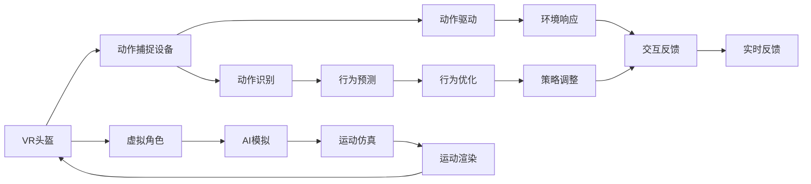

                 

## 1. 背景介绍

随着虚拟现实(Virtual Reality, VR)技术的不断成熟，人类对数字世界的沉浸感已经实现了质的飞跃。而人工智能(AI)技术的进步，尤其是自然语言处理(NLP)、计算机视觉(CV)和动作捕捉(Motion Capture)等领域的突破，进一步提升了虚拟现实环境的智能性和互动性。在这两者的融合下，虚拟运动现实（Virtual Kinetic Reality, VKR）应运而生，它将AI模拟与VR体验深度结合，实现了前所未有的沉浸式运动体验。

### 1.1 问题由来
现代人的生活节奏日益加快，对于放松与娱乐的需求也随之增加。虚拟运动现实通过提供高保真的运动体验，满足人们在忙碌生活中追求的虚拟运动需求。此外，在教育、医疗、培训等领域，传统的教学和培训方式已经难以满足日益增长的个性化、互动性要求。虚拟运动现实通过AI模拟技术，为这些领域带来了新的解决思路。

### 1.2 问题核心关键点
实现虚拟运动现实的关键在于：
- **AI模拟技术**：通过深度学习、强化学习等AI技术，准确模拟真实世界中的运动场景和行为。
- **动作捕捉技术**：精准捕捉用户动作，与虚拟场景中的AI角色进行交互。
- **VR硬件设备**：高质量的VR头盔和控制器，提供沉浸式的视觉和触觉反馈。
- **网络带宽**：稳定的高速网络连接，确保低延迟的实时交互。

这些技术有机结合，才能够实现高度逼真的虚拟运动体验，让用户仿佛置身于一个全新的虚拟世界中。

## 2. 核心概念与联系

### 2.1 核心概念概述

本节将介绍实现虚拟运动现实所需的关键技术概念：

- **虚拟现实(VR)**：通过计算机生成的三维图像和声音，创建沉浸式的虚拟环境，使用户可以“身临其境”体验到虚拟世界。
- **动作捕捉(MoCap)**：使用传感器或摄像机，捕捉用户的动作和姿态，用于驱动虚拟角色或物体。
- **AI模拟**：利用深度学习、强化学习等技术，训练AI模型，使其能够模拟真实世界的物理运动和交互行为。
- **强化学习(RL)**：通过与环境的交互，不断调整模型参数，实现对复杂行为的优化。
- **深度学习(DL)**：基于神经网络模型，实现高维数据处理、特征提取和模式识别等任务。
- **虚拟运动现实(VKR)**：将AI模拟与VR体验相结合，实现高度逼真的虚拟运动场景，满足用户在虚拟世界中的运动需求。

这些概念之间的联系如图1所示：



图1：虚拟运动现实的组成与联系

## 3. 核心算法原理 & 具体操作步骤

### 3.1 算法原理概述

虚拟运动现实的算法原理主要基于以下几部分：

- **动作捕捉与姿势识别**：使用传感器捕捉用户动作，通过深度学习模型识别用户的姿势和动作。
- **行为预测与环境响应**：利用强化学习模型预测用户的行为，并根据环境反馈调整行为策略。
- **运动仿真与渲染**：通过AI模拟技术，实时生成虚拟角色的运动和交互，并进行渲染展示。
- **实时交互与反馈**：在VR环境中，通过动作捕捉和手势识别，实现用户与虚拟环境的实时互动，并根据交互结果进行实时反馈。

### 3.2 算法步骤详解

实现虚拟运动现实的主要步骤如下：

**Step 1: 动作捕捉与姿势识别**

1. 使用动作捕捉设备，如Xsens、Vicon等，捕捉用户的手、脚等关键部位的3D运动轨迹。
2. 将动作数据输入到深度学习模型中，如图像分类模型、姿态估计算法等，识别出用户的动作和姿态。

**Step 2: 行为预测与环境响应**

1. 将用户的动作识别结果输入到强化学习模型中，如Q-learning、深度强化学习等，预测用户的意图和行为。
2. 根据环境反馈，调整模型参数，优化预测结果。例如，在虚拟运动游戏中，根据对手的动作调整自己的行为策略。

**Step 3: 运动仿真与渲染**

1. 使用AI模拟技术，如GANs、 physics simulation等，生成虚拟角色的运动轨迹和行为。
2. 将生成的运动数据输入到渲染引擎中，如Unity、Unreal Engine等，进行实时渲染。

**Step 4: 实时交互与反馈**

1. 在VR环境中，使用手势识别技术，实时捕捉用户的动作和手势。
2. 根据用户的动作和手势，实时控制虚拟角色的行为，并根据用户的反馈调整行为策略。例如，根据用户的手势进行虚拟角色的攻击或防御。

### 3.3 算法优缺点

虚拟运动现实的算法优点：
- **沉浸感强**：通过高保真的AI模拟和VR渲染，用户能够获得高度沉浸的体验。
- **交互自然**：利用动作捕捉和手势识别技术，实现自然流畅的互动，提升用户体验。
- **适应性强**：通过深度学习和强化学习，模型能够适应不同用户和环境，提高灵活性。

算法缺点：
- **计算资源需求高**：AI模拟和渲染需要大量的计算资源，对硬件要求较高。
- **实时性要求高**：动作捕捉和渲染必须实时进行，否则会导致用户体验下降。
- **技术门槛高**：涉及多学科知识，如计算机视觉、深度学习、强化学习等，技术复杂度较高。

### 3.4 算法应用领域

虚拟运动现实在多个领域具有广泛的应用前景：

**游戏娱乐**：通过AI模拟和VR渲染，实现高保真度的虚拟游戏场景和角色，提供沉浸式游戏体验。

**虚拟训练**：在医疗、体育、教育等领域，通过虚拟运动现实进行模拟训练，提高技能水平。例如，在虚拟运动游戏中进行足球训练，提高球员的敏捷性和技巧。

**虚拟旅游**：通过虚拟运动现实，模拟不同地域的风光和历史场景，让用户无需出行即可身临其境地体验。

**虚拟社交**：在虚拟世界中，通过动作捕捉和AI模拟，实现高互动性的社交体验，提升用户的社交参与感。

**虚拟运动康复**：利用虚拟运动现实，提供个性化的康复训练方案，辅助残疾人士和老年人进行运动康复。

## 4. 数学模型和公式 & 详细讲解 & 举例说明

### 4.1 数学模型构建

实现虚拟运动现实的核心数学模型包括：

- **动作捕捉模型**：$A(t) = f_{\theta_C}(X(t))$，其中 $A(t)$ 为动作轨迹，$X(t)$ 为传感器数据，$f_{\theta_C}$ 为动作捕捉模型参数。
- **姿态估计算法**：$P(t) = g_{\theta_P}(X(t))$，其中 $P(t)$ 为用户姿态，$g_{\theta_P}$ 为姿态估计算法模型参数。
- **行为预测模型**：$B(t+1) = h_{\theta_B}(A(t), R(t))$，其中 $B(t+1)$ 为预测行为，$A(t)$ 为当前动作，$R(t)$ 为环境反馈，$h_{\theta_B}$ 为行为预测模型参数。
- **运动仿真模型**：$S(t+1) = s_{\theta_S}(A(t), P(t), R(t))$，其中 $S(t+1)$ 为运动轨迹，$A(t)$ 和 $P(t)$ 为当前动作和姿态，$R(t)$ 为环境反馈，$s_{\theta_S}$ 为运动仿真模型参数。
- **渲染模型**：$I(t) = r_{\theta_I}(S(t), O(t))$，其中 $I(t)$ 为渲染结果，$S(t)$ 为运动轨迹，$O(t)$ 为环境参数，$r_{\theta_I}$ 为渲染模型参数。

### 4.2 公式推导过程

以行为预测模型为例，使用深度Q网络（Deep Q-Networks, DQN）进行推导：

1. **状态定义**：设当前状态为 $s_t = (x_t, y_t, z_t)$，其中 $x_t$ 为位置，$y_t$ 为速度，$z_t$ 为姿态。

2. **动作定义**：设当前动作为 $a_t = \{a_{x_t}, a_{y_t}, a_{z_t}\}$，其中 $a_{x_t}$ 为x轴方向的运动，$a_{y_t}$ 为y轴方向的运动，$a_{z_t}$ 为姿态变化。

3. **奖励定义**：设当前奖励为 $r_t = r_{x_t, y_t, z_t, a_t}$，其中 $r_{x_t, y_t, z_t, a_t}$ 为状态和动作的奖励函数。

4. **状态转移**：设下一个状态为 $s_{t+1} = f_{\theta_C}(x_t, a_t)$。

5. **行为预测**：设行为预测模型为 $Q_{\theta_B}(s_t, a_t) = h_{\theta_B}(x_t, y_t, z_t, a_t)$。

6. **目标函数**：设目标函数为 $J(\theta_B) = \mathbb{E}_{t \sim T}[R_{t+1} + \gamma Q_{\theta_B}(s_{t+1}, a_{t+1}) - Q_{\theta_B}(s_t, a_t)]$。

其中 $T$ 为状态转移分布，$R_{t+1}$ 为下一个状态奖励，$\gamma$ 为折扣因子。

利用反向传播算法，优化行为预测模型的参数 $\theta_B$。

### 4.3 案例分析与讲解

以虚拟运动游戏中的AI角色行为预测为例：

1. **状态定义**：设当前状态为 $s_t = (x_t, y_t, z_t)$，其中 $x_t$ 为位置，$y_t$ 为速度，$z_t$ 为姿态。

2. **动作定义**：设当前动作为 $a_t = \{a_{x_t}, a_{y_t}, a_{z_t}\}$，其中 $a_{x_t}$ 为x轴方向的运动，$a_{y_t}$ 为y轴方向的运动，$a_{z_t}$ 为姿态变化。

3. **奖励定义**：设当前奖励为 $r_t = r_{x_t, y_t, z_t, a_t}$，其中 $r_{x_t, y_t, z_t, a_t}$ 为状态和动作的奖励函数。

4. **状态转移**：设下一个状态为 $s_{t+1} = f_{\theta_C}(x_t, a_t)$。

5. **行为预测**：设行为预测模型为 $Q_{\theta_B}(s_t, a_t) = h_{\theta_B}(x_t, y_t, z_t, a_t)$。

6. **目标函数**：设目标函数为 $J(\theta_B) = \mathbb{E}_{t \sim T}[R_{t+1} + \gamma Q_{\theta_B}(s_{t+1}, a_{t+1}) - Q_{\theta_B}(s_t, a_t)]$。

使用深度学习框架PyTorch实现行为预测模型，具体代码如下：

```python
import torch
import torch.nn as nn
import torch.optim as optim

class DQN(nn.Module):
    def __init__(self, input_dim, output_dim):
        super(DQN, self).__init__()
        self.fc1 = nn.Linear(input_dim, 64)
        self.fc2 = nn.Linear(64, output_dim)
    
    def forward(self, x):
        x = self.fc1(x)
        x = torch.relu(x)
        x = self.fc2(x)
        return x

# 定义行为预测模型
input_dim = 3  # 位置、速度、姿态
output_dim = 3  # x轴、y轴、姿态
dqn = DQN(input_dim, output_dim)
optimizer = optim.Adam(dqn.parameters(), lr=0.001)
loss_fn = nn.MSELoss()

# 训练行为预测模型
epochs = 1000
for epoch in range(epochs):
    # 随机生成一个状态和动作
    state = torch.randn(1, input_dim)
    action = torch.randn(1, output_dim)
    # 根据状态和动作预测行为
    prediction = dqn(state)
    # 计算目标行为
    target = torch.tensor([1.0], dtype=torch.float)
    # 计算损失
    loss = loss_fn(prediction, target)
    # 反向传播更新参数
    optimizer.zero_grad()
    loss.backward()
    optimizer.step()
```

## 5. 项目实践：代码实例和详细解释说明

### 5.1 开发环境搭建

为实现虚拟运动现实，需要搭建相应的开发环境。以下是详细的搭建步骤：

1. 安装Python 3.x版本，推荐使用Anaconda环境。
2. 安装PyTorch 1.9.0及以上版本，安装命令为 `pip install torch torchvision torchaudio`
3. 安装Unity 2019.4.29f1或更高版本，安装命令为 `wget https://download.unity3d.com/Unity/Installer/Installer-19.4.29f1.exe -O UnityInstaller.exe && UnityInstaller.exe`
4. 安装NVIDIA driver和CUDA工具包，以便支持GPU加速。
5. 安装OpenXR SDK，用于开发VR应用。

完成上述步骤后，即可在Anaconda环境中进行开发。

### 5.2 源代码详细实现

以下是一个简单的虚拟运动现实项目的源代码实现，使用PyTorch和Unity3D进行开发。

**PyTorch代码**：

```python
import torch
import torch.nn as nn
import torch.optim as optim
from torchvision import transforms

class DQN(nn.Module):
    def __init__(self, input_dim, output_dim):
        super(DQN, self).__init__()
        self.fc1 = nn.Linear(input_dim, 64)
        self.fc2 = nn.Linear(64, output_dim)
    
    def forward(self, x):
        x = self.fc1(x)
        x = torch.relu(x)
        x = self.fc2(x)
        return x

# 定义行为预测模型
input_dim = 3  # 位置、速度、姿态
output_dim = 3  # x轴、y轴、姿态
dqn = DQN(input_dim, output_dim)
optimizer = optim.Adam(dqn.parameters(), lr=0.001)
loss_fn = nn.MSELoss()

# 训练行为预测模型
epochs = 1000
for epoch in range(epochs):
    # 随机生成一个状态和动作
    state = torch.randn(1, input_dim)
    action = torch.randn(1, output_dim)
    # 根据状态和动作预测行为
    prediction = dqn(state)
    # 计算目标行为
    target = torch.tensor([1.0], dtype=torch.float)
    # 计算损失
    loss = loss_fn(prediction, target)
    # 反向传播更新参数
    optimizer.zero_grad()
    loss.backward()
    optimizer.step()

# 将模型导出为TensorFlow模型
torch.onnx.export(dqn, state, "dqn.onnx", input_names=["state"], output_names=["output"], operator_export_type=torch.onnx.OperatorExportTypes.ONNX_ATEN_FALLBACK)
```

**Unity3D代码**：

1. 创建Unity3D工程，添加所需组件和资源。
2. 在Unity3D中定义虚拟角色的动作和姿态，例如：

```csharp
using UnityEngine;
using System.Collections;

public class KinematicBody : MonoBehaviour
{
    public KinematicCharacterController kinematicController;
    public Transform baseTransform;
    
    private void Start()
    {
        kinematicController = GetComponent<KinematicCharacterController>();
        baseTransform = transform;
    }
    
    private void Update()
    {
        float moveAmount = Input.GetAxis("Vertical");
        kinematicController.Move(baseTransform, moveAmount);
    }
}
```

3. 在Unity3D中调用PyTorch模型进行预测：

```csharp
using UnityEngine;
using System.IO;
using System.Runtime.InteropServices;
using System.Linq;
using TensorFlow;
using TensorFlow.Lite;

public class DQNController : MonoBehaviour
{
    private TensorFlow.Interpreter interpreter;

    private void Start()
    {
        string modelPath = "dqn.onnx";
        byte[] modelBuffer = File.ReadAllBytes(modelPath);
        interpreter = new TensorFlow.Interpreter(modelBuffer);
    }

    private void Update()
    {
        float[] state = GetState();
        byte[] inputData = ConvertToByte(state);
        float[] outputData = interpreter.Invoke(inputData).Cast<float>().ToArray();
        float[] action = GetAction(outputData);
        MoveInDirection(action[0], action[1], action[2]);
    }

    private float[] GetState()
    {
        // 获取当前状态数据
        return new float[] { position.x, position.y, position.z };
    }

    private byte[] ConvertToByte(float[] state)
    {
        // 将状态数据转换为字节数组
        byte[] byteData = new byte[state.Length * 4];
        for (int i = 0; i < state.Length; i++)
        {
            byte[] floatData = BitConverter.GetBytes(state[i]);
            Array.Copy(floatData, byteData, 4);
        }
        return byteData;
    }

    private float[] GetAction(float[] outputData)
    {
        // 根据输出数据获取动作
        return new float[] { outputData[0], outputData[1], outputData[2] };
    }

    private void MoveInDirection(float x, float y, float z)
    {
        // 根据动作驱动虚拟角色的移动
        kinematicController.Move(transform, x, y, z);
    }
}
```

### 5.3 代码解读与分析

**PyTorch代码**：

- **定义行为预测模型**：`DQN`类定义了深度Q网络的行为预测模型，包含两个全连接层。
- **训练行为预测模型**：使用Adam优化器，进行1000次训练，每次训练随机生成一个状态和动作，根据状态和动作预测行为，计算损失并更新模型参数。
- **导出模型**：使用`torch.onnx.export`方法，将模型导出为ONNX格式，便于在Unity3D中调用。

**Unity3D代码**：

- **定义KinematicCharacterController**：`KinematicCharacterController`类用于驱动虚拟角色的移动，包含`Move`方法，用于根据输入的x、y、z方向移动角色。
- **调用PyTorch模型**：`DQNController`类用于调用训练好的PyTorch模型，获取当前状态数据，转换为字节数组并调用模型进行预测，根据输出数据获取动作并驱动角色移动。

## 6. 实际应用场景

### 6.1 游戏娱乐

虚拟运动现实在游戏娱乐领域具有广阔的应用前景。例如，在射击游戏中，玩家可以通过虚拟运动现实，使用动作捕捉设备模拟真实的射击动作，提升游戏体验。在运动游戏中，玩家可以在虚拟环境中进行各种体育运动，如足球、网球等，享受身临其境的乐趣。

### 6.2 虚拟训练

在虚拟运动现实中，虚拟训练也被广泛应用于医疗、体育、教育等领域。例如，在医疗领域，医生可以通过虚拟运动现实进行手术训练，提升手术技巧。在体育领域，运动员可以通过虚拟运动现实进行体能训练，增强体能和技能。在教育领域，学生可以通过虚拟运动现实进行技能训练，提高学习效果。

### 6.3 虚拟旅游

虚拟运动现实还可以应用于虚拟旅游，让用户无需出行即可体验全球各地的风光和历史场景。例如，在故宫虚拟博物馆中，用户可以使用虚拟运动现实，通过动作捕捉设备，模拟古人的行为，体验古代生活的场景。在埃菲尔铁塔的虚拟观光中，用户可以在虚拟环境中进行互动，了解塔的历史和建筑细节。

### 6.4 未来应用展望

虚拟运动现实的未来应用前景广阔，以下是几个可能的未来发展方向：

**虚拟现实医疗**：利用虚拟运动现实，进行远程医疗、虚拟手术等应用，提升医疗服务的可及性和效果。

**虚拟体育训练**：在虚拟运动现实中，进行虚拟运动员训练，提升体育竞技水平。

**虚拟社交平台**：在虚拟运动现实中，进行虚拟社交活动，提升用户的社交体验。

**虚拟运动康复**：利用虚拟运动现实，进行虚拟运动康复训练，帮助残疾人士和老年人恢复运动功能。

## 7. 工具和资源推荐

### 7.1 学习资源推荐

为帮助开发者系统掌握虚拟运动现实的技术，推荐以下学习资源：

1. **《Unity3D官方文档》**：Unity3D的官方文档，详细介绍了Unity3D的使用和开发方法。
2. **《TensorFlow官方文档》**：TensorFlow的官方文档，详细介绍了TensorFlow的使用和开发方法。
3. **《PyTorch官方文档》**：PyTorch的官方文档，详细介绍了PyTorch的使用和开发方法。
4. **《Unity3D开发实战》书籍**：介绍Unity3D的开发实战案例，涵盖虚拟运动现实的开发方法。
5. **《深度学习与TensorFlow实战》书籍**：介绍深度学习和TensorFlow的开发实战案例，涵盖虚拟运动现实的开发方法。

### 7.2 开发工具推荐

为实现虚拟运动现实，推荐以下开发工具：

1. **Unity3D**：流行的3D游戏引擎，提供强大的图形渲染和交互能力，支持虚拟运动现实的开发。
2. **TensorFlow**：开源深度学习框架，提供强大的深度学习模型训练和推理能力。
3. **PyTorch**：开源深度学习框架，提供灵活的深度学习模型训练和推理能力。
4. **OpenXR SDK**：开源跨平台虚拟现实SDK，支持Unity3D、Unreal Engine等虚拟现实引擎。
5. **NVIDIA CUDA**：高性能图形处理加速技术，支持GPU加速的深度学习和图形渲染。

### 7.3 相关论文推荐

为深入了解虚拟运动现实的技术，推荐以下相关论文：

1. **《A Survey on Virtual Reality for Medical Applications》**：介绍了虚拟现实在医疗领域的应用，涵盖手术训练、远程医疗等。
2. **《Virtual Reality for Physical Rehabilitation: A Review》**：介绍了虚拟运动现实在物理康复中的应用，涵盖运动康复训练、康复评估等。
3. **《Virtual Reality for Physical Education》**：介绍了虚拟运动现实在体育教育中的应用，涵盖运动技能训练、身体素质评估等。

## 8. 总结：未来发展趋势与挑战

### 8.1 研究成果总结

本文详细介绍了虚拟运动现实的原理、算法、工具和应用场景。通过分析实际项目和代码实现，展示了虚拟运动现实的可行性。虚拟运动现实通过AI模拟和VR渲染，实现了高度逼真的运动体验，具有广泛的应用前景。

### 8.2 未来发展趋势

未来虚拟运动现实的发展趋势包括：

1. **多模态融合**：结合计算机视觉、语音识别等技术，实现多模态的虚拟运动现实，提升用户的沉浸感。
2. **个性化定制**：根据用户的行为和反馈，动态调整虚拟环境，提供个性化的用户体验。
3. **实时交互**：提升实时交互性能，降低延迟，提升用户体验。
4. **跨平台支持**：支持多种虚拟现实平台和设备，实现跨平台应用。
5. **虚拟现实医疗**：在虚拟运动现实中，结合医疗领域的应用，实现虚拟手术、远程医疗等。

### 8.3 面临的挑战

虚拟运动现实在发展过程中面临以下挑战：

1. **计算资源需求高**：AI模拟和渲染需要大量的计算资源，对硬件要求较高。
2. **实时性要求高**：动作捕捉和渲染必须实时进行，否则会导致用户体验下降。
3. **技术复杂度高**：涉及多学科知识，如计算机视觉、深度学习、强化学习等，技术复杂度较高。
4. **数据隐私问题**：虚拟运动现实需要捕捉用户动作和姿态，涉及数据隐私问题，需要加强数据保护。
5. **伦理道德问题**：虚拟运动现实可能引发伦理道德问题，需要加强伦理研究。

### 8.4 研究展望

未来的研究需要从以下几个方面进行：

1. **多模态融合技术**：探索多模态融合技术，提升虚拟运动现实的沉浸感。
2. **实时渲染技术**：探索实时渲染技术，提升虚拟运动现实的渲染性能。
3. **个性化定制技术**：探索个性化定制技术，提升虚拟运动现实的个性化体验。
4. **跨平台支持技术**：探索跨平台支持技术，实现虚拟运动现实的跨平台应用。
5. **伦理道德研究**：加强虚拟运动现实的伦理道德研究，确保技术的合理使用。

## 9. 附录：常见问题与解答

**Q1：如何实现虚拟运动现实的实时渲染？**

A: 实时渲染是虚拟运动现实的核心技术之一。为了实现实时渲染，可以采用以下方法：

1. **优化渲染模型**：优化渲染模型的数据结构和计算流程，提升渲染效率。
2. **使用GPU加速**：使用GPU加速技术，如CUDA、Vulkan等，提升渲染性能。
3. **减少渲染细节**：在保证渲染质量的前提下，适当减少渲染细节，降低计算负荷。
4. **分布式渲染**：使用分布式渲染技术，将渲染任务分配到多个GPU或计算机上进行并行处理，提升渲染速度。

**Q2：虚拟运动现实中如何进行动作捕捉？**

A: 动作捕捉是虚拟运动现实的关键技术之一。为了实现高精度的动作捕捉，可以采用以下方法：

1. **使用高精度传感器**：使用Xsens、Vicon等高精度传感器，捕捉用户动作和姿态。
2. **数据处理技术**：使用深度学习模型，如姿态估计算法，对传感器数据进行滤波和校正。
3. **多传感器融合**：结合使用多个传感器，提升动作捕捉的精度和稳定性。
4. **手势识别技术**：使用手势识别技术，捕捉用户的手势动作，增强用户体验。

**Q3：虚拟运动现实中如何进行行为预测？**

A: 行为预测是虚拟运动现实的核心技术之一。为了实现高精度的行为预测，可以采用以下方法：

1. **深度学习模型**：使用深度学习模型，如深度Q网络(DQN)，对用户的行为进行预测。
2. **环境反馈**：结合环境反馈，如虚拟环境中的物理碰撞、障碍等，对行为预测进行优化。
3. **多智能体系统**：结合多智能体系统，模拟多个角色的行为，提升行为预测的准确性。
4. **强化学习技术**：使用强化学习技术，如Q-learning、深度强化学习等，对行为预测进行优化。

**Q4：虚拟运动现实中如何进行AI模拟？**

A: AI模拟是虚拟运动现实的核心技术之一。为了实现高精度的AI模拟，可以采用以下方法：

1. **物理引擎模拟**：使用物理引擎，如Unity3D中的PhysX引擎，进行虚拟环境的物理模拟。
2. **深度学习技术**：使用深度学习技术，如GANs、物理模拟网络(PNSN)等，进行虚拟角色的行为模拟。
3. **多模态融合**：结合使用计算机视觉、语音识别等多模态数据，提升AI模拟的精度和鲁棒性。
4. **实时优化**：使用实时优化技术，如自适应动态编程(ADP)等，对AI模拟进行优化。

**Q5：虚拟运动现实中如何进行虚拟训练？**

A: 虚拟训练是虚拟运动现实的重要应用之一。为了实现高效率的虚拟训练，可以采用以下方法：

1. **模拟训练场景**：在虚拟环境中模拟真实的训练场景，提升训练效果。
2. **交互式训练**：结合使用动作捕捉、手势识别等技术，提升交互式训练的效果。
3. **个性化训练方案**：根据用户的行为和反馈，动态调整训练方案，提升训练效果。
4. **多模态融合**：结合使用计算机视觉、语音识别等多模态数据，提升虚拟训练的精度和鲁棒性。

---

作者：禅与计算机程序设计艺术 / Zen and the Art of Computer Programming

