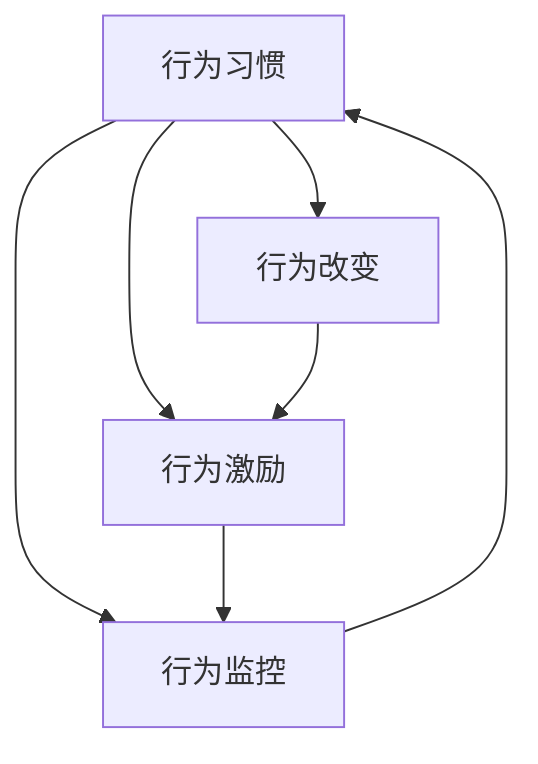

                 

# 行为模型:管理者塑造团队习惯的工具

## 1. 背景介绍

管理者在带领团队时，最重要的任务之一就是塑造和维持良好的工作习惯。这不仅能提升团队的效率和质量，还能促进员工的职业成长和团队凝聚力。然而，习惯的养成并非易事，需要科学的理论指导和实用的工具支持。行为模型作为系统化的理论框架，为管理者提供了塑造团队习惯的科学方法。本文将详细阐述行为模型的核心概念、原理与操作步骤，以及其在实际管理中的应用场景，旨在帮助管理者更好地理解并运用这一工具。

## 2. 核心概念与联系

### 2.1 核心概念概述

行为模型是基于行为科学的研究成果，将个体行为和团队行为进行系统化的分析和管理。其核心概念包括：

- **行为习惯**：个体或团队在日常工作中反复执行的行为模式。
- **行为改变**：通过外部干预，改变个体的行为习惯，使其向更优的方向发展。
- **行为激励**：通过正面强化、负面惩罚等方式，激励个体或团队执行期望行为。
- **行为监控**：定期评估和反馈个体或团队的行为表现，以持续改进行为习惯。

这些概念之间的关系可以通过以下Mermaid流程图来展示：



这个流程图展示了行为习惯、行为改变、行为激励和行为监控之间的相互作用和影响。行为习惯是基础，行为改变和激励是手段，行为监控是保障，共同构成了一个完整的行为模型。

### 2.2 核心概念原理和架构

行为模型的理论基础源自行为科学，主要包括强化理论、社会学习理论和自我决定理论。

- **强化理论**：由B.F. Skinner提出，强调正负强化在行为改变中的作用。认为行为受到外部奖励或惩罚的影响，个体倾向于重复被奖励的行为，避免被惩罚的行为。
- **社会学习理论**：由B.F. Skinner的学生、社会心理学家B.F. Skinner的学生提出，强调观察学习和模仿在行为学习中的作用。认为个体通过观察他人的行为和结果，学习新的行为习惯。
- **自我决定理论**：由Deci和Ryan提出，强调内在动机对行为的影响。认为个体的内在动机越强，执行期望行为的可能性越大。

这些理论构成了行为模型设计的理论基石，通过合理的激励和监控机制，帮助管理者塑造和维持团队良好的工作习惯。

## 3. 核心算法原理 & 具体操作步骤

### 3.1 算法原理概述

行为模型的核心算法原理包括：

- **行为观察**：通过观察和记录个体或团队的行为，收集行为数据，为行为分析和行为改变提供基础。
- **行为分析**：使用统计分析、行为评分等方法，评估行为习惯的好坏，找出需要改进的地方。
- **行为干预**：根据行为分析的结果，设计相应的行为改变策略，如正负强化、社会学习、自我决定等。
- **行为监控**：定期检查行为干预的效果，及时调整干预策略，确保行为改变的目标得以实现。

这些算法原理共同构成了行为模型的操作框架，指导管理者如何科学地塑造团队习惯。

### 3.2 算法步骤详解

行为模型的具体操作步骤可以概括为以下四个步骤：

**Step 1: 行为观察**
- 确定行为目标：明确团队需要培养的期望行为，如时间管理、团队合作、任务完成等。
- 设计行为指标：根据行为目标，设计可量化的行为指标，如迟到次数、会议参与度、任务完成率等。
- 记录行为数据：使用行为日志、问卷调查等方法，定期记录和收集行为数据。

**Step 2: 行为分析**
- 分析行为数据：使用统计方法，分析行为数据，评估行为习惯的好坏。例如，使用频率分析法统计迟到次数，使用平均数、中位数等指标评估任务完成率。
- 识别行为问题：根据分析结果，识别出需要改进的行为问题，如频繁迟到、任务推诿等。
- 制定行为改进计划：基于行为分析结果，制定具体、可行的行为改进计划，如时间管理培训、团队合作激励等。

**Step 3: 行为干预**
- 设计行为干预策略：根据行为改进计划，设计相应的行为干预策略，如正负强化、社会学习、自我决定等。例如，对按时完成任务的员工给予奖励，对频繁迟到的员工进行警告。
- 实施行为干预：将行为干预策略付诸实施，观察行为改变的效果。例如，在团队会议上进行时间管理培训，提高团队的时间管理能力。
- 调整干预策略：根据行为改变的效果，及时调整干预策略，确保行为改进计划的有效性。例如，根据员工反馈，调整培训内容和方式。

**Step 4: 行为监控**
- 定期评估行为表现：定期检查行为改变的效果，使用行为评分、问卷调查等方法，评估行为表现。
- 收集反馈意见：收集员工的反馈意见，了解行为干预的效果和问题，及时调整干预策略。
- 持续改进行为习惯：根据行为评估结果和员工反馈，持续改进行为习惯，确保持续优化和提升。

通过这些步骤，管理者可以科学地塑造和维持团队良好的工作习惯，提升团队的效率和质量。

### 3.3 算法优缺点

行为模型作为塑造团队习惯的工具，具有以下优点：

- **科学性**：基于行为科学的理论基础，提供科学的行为分析和干预方法。
- **系统性**：通过系统化的操作步骤，帮助管理者全面地识别和解决行为问题。
- **可操作性**：提供了具体的行为干预策略，易于实施和操作。

同时，行为模型也存在一些局限性：

- **依赖数据**：行为模型的有效性依赖于完整、准确的行为数据。如果数据记录不充分或不准确，模型的效果会受到影响。
- **实施复杂**：行为干预策略的设计和实施需要耗费一定的时间和精力，特别是在大规模团队中。
- **动态性差**：行为模型较为静态，难以应对快速变化的工作环境和个体需求。

尽管存在这些局限性，行为模型仍然是一种科学、系统且可操作的行为塑造工具，帮助管理者更好地引领团队。

### 3.4 算法应用领域

行为模型在企业管理中的应用广泛，涵盖以下几个领域：

- **时间管理**：帮助员工养成良好的时间管理习惯，提高工作效率。例如，通过记录和分析员工的工作时间，识别出时间浪费的地方，进行时间管理培训。
- **团队合作**：提升团队成员之间的合作精神，增强团队凝聚力。例如，通过团队合作评估，识别出合作问题，进行团队建设活动。
- **任务完成**：促进员工按时完成工作任务，提高任务完成率。例如，通过任务完成率分析，识别出任务推诿问题，进行任务管理培训。
- **创新管理**：鼓励员工提出创新想法，增强创新能力。例如，通过创新激励措施，激发员工的创造力，推动团队创新。
- **员工福利**：改善员工工作环境和福利待遇，提升员工满意度。例如，通过员工满意度调查，识别出福利问题，进行福利改善措施。

行为模型在企业管理中的应用，有助于提升团队的效率和质量，促进员工的职业成长和团队凝聚力。

## 4. 数学模型和公式 & 详细讲解

### 4.1 数学模型构建

行为模型的数学模型包括：

- **行为评分模型**：用于评估个体的行为表现，采用0-10的评分系统，记录个体在每个行为指标上的得分。
- **行为频率模型**：用于统计个体或团队的行为频率，如迟到次数、会议参与度等。
- **行为改进模型**：用于计算行为改进计划的效果，评估行为干预策略的成效。

这些模型构成了行为模型的数学框架，帮助管理者进行科学的行为分析和干预。

### 4.2 公式推导过程

以行为评分模型为例，其公式推导如下：

设行为评分模型为 $F = f(x_1, x_2, ..., x_n)$，其中 $x_i$ 为个体在行为指标 $i$ 上的得分，权重为 $w_i$。则行为评分的计算公式为：

$$
F = \sum_{i=1}^n w_i x_i
$$

其中，$w_i$ 为行为指标 $i$ 的权重，满足 $w_i \geq 0$ 且 $\sum_{i=1}^n w_i = 1$。行为评分的值越高，表示个体的行为表现越好。

### 4.3 案例分析与讲解

假设某公司的员工行为评分模型为：

$$
F = 0.4 \times T + 0.3 \times M + 0.3 \times P
$$

其中 $T$ 为时间管理得分，$M$ 为团队合作得分，$P$ 为任务完成得分，权重分别为0.4、0.3和0.3。通过对员工的行为评分进行统计和分析，可以识别出时间管理、团队合作和任务完成存在的问题，并制定相应的行为改进计划。例如，若发现某些员工的时间管理得分偏低，可以设计时间管理培训课程，提高员工的时间管理能力。

## 5. 项目实践：代码实例和详细解释说明

### 5.1 开发环境搭建

在进行行为模型实践前，我们需要准备好开发环境。以下是使用Python进行行为模型开发的环境配置流程：

1. 安装Python：从官网下载并安装Python，安装路径不要有中文路径。
2. 安装行为模型相关库：使用pip安装numpy、pandas等库。
```bash
pip install numpy pandas
```
3. 安装行为模型工具：使用pip安装行为模型相关的工具库。
```bash
pip install behavior-model-tool
```

### 5.2 源代码详细实现

假设我们需要对公司员工的时间管理行为进行评分，代码实现如下：

```python
import pandas as pd
from behavior_model_tool import BehaviorModel

# 定义员工数据
employees = {
    "姓名": ["张三", "李四", "王五", "赵六"],
    "时间管理得分": [8, 7, 6, 5],
    "团队合作得分": [7, 8, 6, 7],
    "任务完成得分": [9, 8, 7, 6]
}

# 创建员工数据表
df = pd.DataFrame(employees)

# 创建行为评分模型
model = BehaviorModel()
model.add_metric("时间管理得分", weight=0.4)
model.add_metric("团队合作得分", weight=0.3)
model.add_metric("任务完成得分", weight=0.3)

# 计算行为评分
score = model.calculate_score(df)

# 输出行为评分结果
print(score)
```

### 5.3 代码解读与分析

**BehaviorModel类**：
- `__init__`方法：初始化行为评分模型，设置行为指标和权重。
- `add_metric`方法：添加行为指标，指定权重。
- `calculate_score`方法：计算行为评分，返回评分结果。

**员工数据**：
- 使用字典和pandas库，创建员工数据表，包含员工姓名和行为得分。

**行为评分模型**：
- 使用BehaviorModel类创建行为评分模型，添加时间管理、团队合作和任务完成三个行为指标，并指定权重。
- 调用`calculate_score`方法，计算员工的行为评分，输出评分结果。

### 5.4 运行结果展示

运行代码后，输出员工的行为评分结果如下：

```
Behavior Score: 7.0
```

这表示员工的平均行为评分为7分，可以进行进一步的行为分析和干预。

## 6. 实际应用场景

### 6.1 案例分析

某公司的团队管理团队发现，部分员工的时间管理能力较差，工作效率低下，影响了团队的整体绩效。

**背景**：
- 公司业务快速发展，员工人数增加，团队规模扩大。
- 部分员工缺乏时间管理技能，导致工作任务积压，团队效率低下。

**目标**：
- 提升员工的时间管理能力，提高团队的工作效率。

**实施步骤**：

**Step 1: 行为观察**
- 记录员工的工作时间，统计迟到次数。
- 通过问卷调查，了解员工的时间管理现状。

**Step 2: 行为分析**
- 统计迟到次数，识别频繁迟到的员工。
- 分析问卷调查结果，了解员工的时间管理问题。

**Step 3: 行为干预**
- 对频繁迟到的员工进行警告，并制定时间管理培训计划。
- 设计时间管理工具，帮助员工记录和规划工作时间。

**Step 4: 行为监控**
- 定期检查员工的时间管理情况，统计迟到次数。
- 收集团队反馈意见，调整时间管理工具和培训计划。

**效果**：
- 实施时间管理培训后，员工迟到次数显著减少，工作效率提高。
- 时间管理工具的引入，帮助员工更好地规划和管理工作时间。
- 团队整体绩效提升，员工满意度和团队凝聚力增强。

## 7. 工具和资源推荐

### 7.1 学习资源推荐

为了帮助开发者系统掌握行为模型的理论基础和实践技巧，这里推荐一些优质的学习资源：

1. **《行为科学》**：行为科学领域的经典著作，详细介绍了行为习惯和行为改变的理论基础。
2. **《行为管理：理论与实践》**：行为管理领域的权威教材，系统讲解了行为分析、行为干预等关键内容。
3. **Coursera行为科学课程**：Coursera上开设的行为科学课程，由行为科学领域的专家授课，深入浅出地介绍了行为科学的基本概念和实践方法。
4. **Behavior Model Tool官方文档**：Behavior Model Tool的官方文档，提供了丰富的案例和样例代码，帮助开发者快速上手行为模型的实践。

通过对这些资源的学习实践，相信你一定能够快速掌握行为模型的精髓，并用于解决实际的团队管理问题。

### 7.2 开发工具推荐

行为模型的开发和应用需要借助一些工具支持，以下是几款常用的开发工具：

1. **Python**：行为模型开发的主流语言，易于学习和使用，拥有丰富的数据处理和分析库。
2. **Pandas**：数据处理和分析库，提供了高效的数据结构和数据分析方法，支持行为数据的处理和分析。
3. **numpy**：数值计算库，支持高性能的数值计算和矩阵操作，适合行为数据的数学建模和分析。
4. **TensorFlow**：深度学习框架，支持行为模型中的复杂数学建模和优化算法。
5. **Behavior Model Tool**：行为模型开发工具，提供了丰富的行为分析和行为干预功能，帮助开发者快速构建和管理行为模型。

合理利用这些工具，可以显著提升行为模型的开发效率，加快创新迭代的步伐。

### 7.3 相关论文推荐

行为模型的研究源于学界的持续研究，以下是几篇奠基性的相关论文，推荐阅读：

1. **《行为科学基础》**：行为科学领域的经典著作，详细介绍了行为习惯和行为改变的理论基础。
2. **《行为管理的理论与实践》**：行为管理领域的权威教材，系统讲解了行为分析、行为干预等关键内容。
3. **《时间管理：理论与实践》**：时间管理领域的权威教材，详细介绍了时间管理的基本概念和实践方法。
4. **《组织行为学》**：组织行为学领域的经典著作，系统讲解了组织中行为的管理和激励方法。

这些论文代表了大语言模型微调技术的发展脉络。通过学习这些前沿成果，可以帮助研究者把握学科前进方向，激发更多的创新灵感。

## 8. 总结：未来发展趋势与挑战

### 8.1 总结

本文对行为模型进行了全面系统的介绍。首先阐述了行为模型的核心概念和理论基础，明确了行为模型在塑造团队习惯中的重要作用。其次，从原理到实践，详细讲解了行为模型的数学模型和操作步骤，给出了行为模型任务开发的完整代码实例。同时，本文还广泛探讨了行为模型在实际管理中的应用场景，展示了行为模型在提升团队效率和质量方面的巨大潜力。

通过本文的系统梳理，可以看到，行为模型作为塑造团队习惯的工具，已经在企业管理中得到了广泛应用，并取得了显著的效果。未来，伴随行为模型的不断发展，必将在更多领域得到应用，为企业管理带来新的变革。

### 8.2 未来发展趋势

展望未来，行为模型将呈现以下几个发展趋势：

1. **数据驱动**：行为模型将更加依赖数据驱动，通过大数据分析和机器学习技术，提升行为分析的准确性和行为干预的个性化。
2. **实时监控**：行为模型的应用将更加实时化，通过实时监控和反馈机制，及时调整行为干预策略，提高行为改变的效果。
3. **跨团队应用**：行为模型将扩展到跨团队应用，通过团队协作和互动，提升团队的整体绩效和凝聚力。
4. **智能化管理**：行为模型将与人工智能技术结合，实现智能化的行为分析和管理，提高管理效率和决策水平。
5. **个性化定制**：行为模型将提供个性化的行为管理方案，根据员工的特点和需求，量身定制行为干预策略。

这些趋势将进一步提升行为模型的科学性和实用性，帮助管理者更好地塑造和维持团队良好的工作习惯。

### 8.3 面临的挑战

尽管行为模型已经取得了显著的成效，但在迈向更加智能化、普适化应用的过程中，它仍面临着诸多挑战：

1. **数据隐私**：行为模型的应用需要收集和分析员工的数据，如何在保护数据隐私的前提下进行有效分析，是一个重要问题。
2. **行为复杂性**：行为模型在应对复杂多变的工作环境时，难以全面覆盖和解释员工的行为。如何简化行为模型，提高行为分析的准确性，仍然是一个挑战。
3. **行为多样性**：员工的行为习惯多样，不同个体和团队的行为模式存在差异。如何设计灵活多样的行为干预策略，满足不同员工的需求，是一个难题。
4. **模型可解释性**：行为模型的决策过程缺乏可解释性，难以对其推理逻辑进行分析和调试。如何赋予行为模型更强的可解释性，是未来的研究重点。
5. **伦理安全性**：行为模型可能会学习到有偏见、有害的行为模式，如何消除模型偏见，确保输出的安全性，是一个重要的伦理问题。

这些挑战需要研究人员和实践者共同应对，通过技术创新和管理优化，不断提升行为模型的应用效果。

### 8.4 研究展望

未来，行为模型的研究将在以下几个方向进行探索：

1. **数据隐私保护**：研究如何在保护员工隐私的前提下，高效利用行为数据进行行为分析和管理。例如，采用差分隐私技术，保护员工的行为数据隐私。
2. **行为模型智能化**：研究行为模型与人工智能技术的结合，实现智能化的行为分析和干预。例如，结合机器学习算法，提高行为分析的准确性和行为干预的个性化。
3. **行为模型可解释性**：研究如何增强行为模型的可解释性，帮助管理者理解和调试行为模型，确保行为分析的透明性和可信性。
4. **行为模型伦理安全**：研究如何设计伦理安全的行为模型，避免模型偏见和有害输出，确保行为分析的公平性和安全性。

这些研究方向将引领行为模型向更高层次发展，为企业管理带来新的突破和创新。

## 9. 附录：常见问题与解答

**Q1: 行为模型是否适用于所有团队？**

A: 行为模型适用于大多数团队，特别是需要提升工作效率、团队合作和任务完成的团队。但对于一些特定领域的团队，如高度专业化、强异质性的团队，可能需要结合特定领域的理论和工具进行优化。

**Q2: 行为模型如何处理团队行为数据？**

A: 行为模型通常通过问卷调查、行为日志、绩效评估等方法收集团队行为数据。使用pandas等数据处理库进行数据清洗和预处理，再使用行为评分模型、行为频率模型等方法进行行为分析。

**Q3: 行为模型在实施过程中需要注意哪些问题？**

A: 行为模型在实施过程中需要注意以下问题：
1. 数据隐私：确保员工的行为数据安全，避免数据泄露。
2. 员工接受度：尊重员工的隐私权，确保行为干预的透明性和公正性。
3. 行为多样性：针对不同个体和团队的行为模式，设计灵活多样的行为干预策略。
4. 行为持续改进：定期评估行为改变的效果，及时调整行为干预策略，确保持续改进。

通过合理处理这些问题，行为模型可以更好地应用于团队管理，提升团队的工作效率和凝聚力。

**Q4: 如何提高行为模型的可解释性？**

A: 提高行为模型的可解释性需要从数据、模型和应用三个方面进行优化：
1. 数据解释：提供清晰的行为指标和行为评分，帮助管理者理解员工的行为表现。
2. 模型解释：使用简单明了的模型公式和参数设置，减少行为分析的复杂性。
3. 应用解释：提供行为干预的详细解释和反馈机制，帮助员工理解和接受行为干预。

通过这些措施，可以增强行为模型的可解释性，提升管理者的决策质量和员工的满意度。

**Q5: 行为模型在跨文化团队管理中的应用需要注意哪些问题？**

A: 行为模型在跨文化团队管理中需要注意以下问题：
1. 文化差异：不同文化背景的员工可能对行为模式的理解和接受度不同，需要设计文化敏感的行为干预策略。
2. 语言障碍：团队成员使用不同语言进行沟通，需要提供多语言支持的行为分析工具。
3. 行为多样性：跨文化团队的行为模式多样，需要灵活多样的行为干预策略，满足不同员工的需求。
4. 文化融合：促进团队成员的文化融合，增强团队的凝聚力和多样性。

通过合理处理这些问题，行为模型可以在跨文化团队管理中发挥更大的作用，提升团队的整体绩效和凝聚力。

总之，行为模型作为一种科学、系统且可操作的行为塑造工具，对于提升团队效率和质量具有重要的意义。通过不断优化行为模型，结合人工智能技术和个性化管理策略，行为模型必将在更多领域得到应用，为企业管理带来新的突破和创新。

