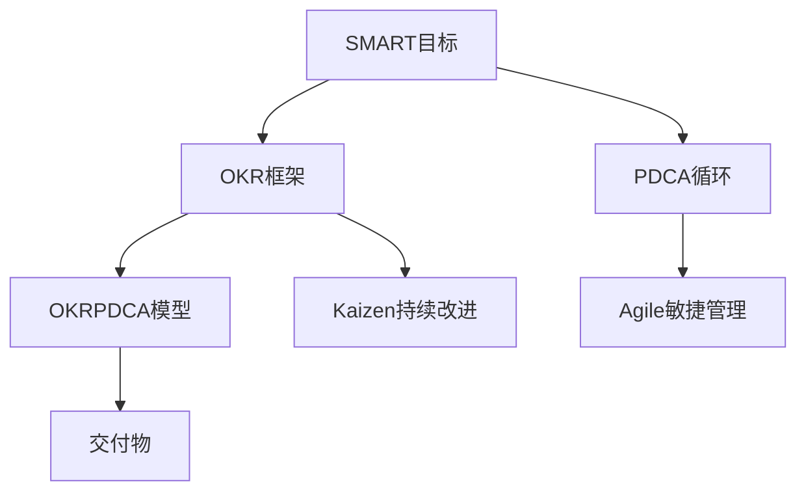

                 

# 行动体系:执行力的保障

## 1. 背景介绍

在当今快速变化和竞争激烈的市场环境中，执行力成为企业成败的关键因素。然而，执行力的保障不仅仅依赖于单一的解决方案，而是需要构建一个全面、系统的“行动体系”。这一体系涵盖从战略规划到具体执行的各个环节，确保企业的各项决策能够有效落地。本文将深入探讨构建高效执行力的关键要素，并给出实用的行动体系构建方法。

### 1.1 问题由来

执行力不足常常导致企业目标无法实现，资源浪费，甚至面临业务停滞的风险。对于管理者而言，构建一个高效的执行力体系是至关重要的，它能够帮助企业克服内外部挑战，保持持续的竞争优势。

### 1.2 问题核心关键点

执行力体系构建的核心关键点包括以下几个方面：

- **目标明确性**：设定清晰、具体的目标，使整个团队对未来发展方向有明确的认识。
- **资源配置**：合理配置资源，包括人力资源、财务资源和信息资源，确保执行过程中资源充足。
- **团队协作**：建立高效的团队协作机制，促进信息流动和知识共享。
- **过程管理**：建立严格的执行流程，确保各项工作按计划推进。
- **反馈机制**：建立有效的反馈系统，及时发现问题并进行调整。
- **风险管理**：对执行过程中可能出现的风险进行预测和管理。

### 1.3 问题研究意义

构建高效的执行力体系能够帮助企业：

- **提升决策执行力**：确保战略目标能够高效执行，快速响应市场变化。
- **优化资源配置**：通过合理的资源分配，提高资源利用效率，降低成本。
- **增强团队协作**：促进团队合作，提高工作效率和质量。
- **加强过程管理**：确保各项工作按计划推进，提升项目管理水平。
- **提高执行质量**：通过有效的反馈机制，及时发现并解决问题，确保执行质量。
- **降低风险**：通过风险管理，减少意外事件对企业运营的影响。

## 2. 核心概念与联系

### 2.1 核心概念概述

构建高效执行力体系的核心概念包括：

- **SMART目标**：Specific（具体）、Measurable（可衡量）、Achievable（可实现）、Relevant（相关）、Time-bound（有时限）的目标设定方法。
- **OKR框架**：Objectives and Key Results（目标与关键成果），帮助企业设定长期和短期目标，并监控目标的实现情况。
- **PDCA循环**：Plan（计划）、Do（执行）、Check（检查）、Act（行动），用于管理执行过程中的各个环节。
- **OKRPDCA模型**：将OKR和PDCA结合，形成一个闭环的执行管理体系。
- **Kaizen持续改进**：通过不断小步前进，逐步改进执行效率和工作质量。
- **Agile敏捷管理**：快速响应市场变化，灵活调整执行策略。
- **Deliverable交付物**：确保每个阶段的工作成果能够符合预期，推动项目进展。

### 2.2 核心概念原理和架构的 Mermaid 流程图(Mermaid 流程节点中不要有括号、逗号等特殊字符)



这个流程图展示了执行力体系的各个核心概念及其相互关系：

1. **SMART目标**：确保目标设定明确、具体、可衡量、可实现、有时限，为后续执行提供明确方向。
2. **OKR框架**：将目标分解为具体可执行的关键成果（Key Results），帮助企业设定长期和短期目标。
3. **PDCA循环**：通过计划、执行、检查、行动四个环节，确保执行过程可控、可改进。
4. **OKRPDCA模型**：将OKR和PDCA结合，形成一个闭环的执行管理体系。
5. **Kaizen持续改进**：通过不断小步前进，逐步改进执行效率和工作质量。
6. **Agile敏捷管理**：快速响应市场变化，灵活调整执行策略。
7. **交付物**：确保每个阶段的工作成果能够符合预期，推动项目进展。

这些概念共同构成了高效执行力体系的基石，帮助企业从目标设定到具体执行的全流程管理。

## 3. 核心算法原理 & 具体操作步骤

### 3.1 算法原理概述

执行力体系的构建涉及到多个学科领域的理论和技术，包括项目管理、管理学、组织行为学等。其核心算法原理如下：

- **目标设定**：通过SMART原则设定明确、具体、可衡量的目标。
- **过程管理**：采用PDCA循环，确保执行过程的可控性和可改进性。
- **资源配置**：通过OKR框架，合理分配资源，确保执行过程中资源充足。
- **团队协作**：通过Agile敏捷管理，提高团队协作效率。
- **持续改进**：通过Kaizen方法，不断优化执行流程和团队表现。

### 3.2 算法步骤详解

构建高效的执行力体系，通常需要经过以下步骤：

**Step 1: 目标设定**
- 使用SMART原则，设定具体的目标。例如，“提高季度销售额20%”就是一个符合SMART原则的目标。

**Step 2: 制定OKR**
- 将目标进一步分解为具体的关键成果（KRs）。例如，为了实现提高季度销售额的目标，可以设定“提高网站流量10%”、“增加高价值客户转化率5%”等KRs。

**Step 3: 资源配置**
- 根据OKR中设定的KRs，评估所需的资源，包括人力、财力、物力等。例如，为了提高网站流量，需要增加SEO投入、提高广告预算等。

**Step 4: 建立PDCA循环**
- 根据PDCA循环，制定详细的执行计划，包括计划（Plan）、执行（Do）、检查（Check）、行动（Act）。例如，在提高网站流量方面，计划可以是增加SEO投入、执行可以是优化网站结构、检查可以是监控流量变化、行动可以是进一步优化SEO策略。

**Step 5: 实施Agile管理**
- 采用Agile方法，灵活调整执行策略，快速响应市场变化。例如，如果发现某SEO策略效果不佳，可以迅速调整策略，采用新的SEO技术或工具。

**Step 6: 持续改进**
- 通过Kaizen方法，不断优化执行流程和团队表现。例如，对SEO投入进行效果评估，找出不足并改进，持续提高流量和转化率。

**Step 7: 监控和反馈**
- 建立有效的反馈系统，及时发现问题并进行调整。例如，定期监控网站流量和转化率，根据数据反馈调整SEO策略。

### 3.3 算法优缺点

构建执行力体系的优点包括：

- **提升执行效率**：通过明确的目标和详细的执行计划，确保各项工作按计划推进。
- **优化资源配置**：合理配置资源，提高资源利用效率。
- **增强团队协作**：促进团队合作，提高工作效率和质量。
- **加强过程管理**：确保各项工作按计划推进，提升项目管理水平。
- **提高执行质量**：通过有效的反馈机制，及时发现并解决问题，确保执行质量。

其缺点包括：

- **复杂性较高**：构建执行力体系需要综合考虑多个因素，过程复杂。
- **需要大量投入**：资源配置和管理需要大量人力和财力。
- **灵活性不足**：流程固定，可能难以适应快速变化的市场环境。

### 3.4 算法应用领域

执行力体系的应用领域广泛，包括但不限于：

- **项目管理**：确保项目按计划推进，提高项目成功率。
- **企业战略**：确保战略目标能够高效执行，快速响应市场变化。
- **产品开发**：通过敏捷管理，快速响应市场需求，优化产品迭代。
- **团队管理**：通过明确目标和有效反馈，提高团队协作效率和表现。
- **运营管理**：通过PDCA循环，优化运营流程，提高效率和质量。
- **人力资源管理**：通过资源配置和持续改进，提升员工绩效和工作满意度。

## 4. 数学模型和公式 & 详细讲解 & 举例说明

### 4.1 数学模型构建

构建执行力体系的数学模型可以分为以下几个方面：

- **目标设定**：使用SMART原则，构建目标函数。
- **资源配置**：通过线性规划等方法，优化资源分配。
- **执行过程**：使用PDCA循环，建立过程模型。
- **反馈机制**：通过统计分析等方法，建立反馈模型。

### 4.2 公式推导过程

以目标设定为例，假设企业设定了一个提高季度销售额20%的目标，可以构建以下数学模型：

$$
\text{目标函数} = \max_{x} R - C \\
\text{约束条件} = \begin{cases}
x_1 + x_2 + x_3 \leq B \\
x_1, x_2, x_3 \geq 0
\end{cases}
$$

其中，$R$ 为销售额，$C$ 为成本，$x_1, x_2, x_3$ 为具体措施（如增加广告投入、优化营销策略等），$B$ 为总预算。目标函数表示最大化销售额，约束条件表示总成本不得超过预算。

### 4.3 案例分析与讲解

假设一家电商企业希望提高季度销售额20%，以下是具体实施步骤：

1. **目标设定**：提高季度销售额20%。
2. **制定OKR**：
   - 关键成果1：提高网站流量10%。
   - 关键成果2：增加高价值客户转化率5%。
3. **资源配置**：
   - 广告预算：$10,000
   - SEO投入：$2,000
   - 营销人员：10人
4. **建立PDCA循环**：
   - 计划：增加广告投放、优化网站结构。
   - 执行：实施广告投放计划，优化网站结构。
   - 检查：监控网站流量和转化率变化。
   - 行动：根据监控结果调整策略。
5. **实施Agile管理**：
   - 快速响应市场需求，调整广告策略。
6. **持续改进**：
   - 定期评估广告投放效果，优化广告策略。
7. **监控和反馈**：
   - 监控网站流量和转化率，根据数据反馈调整策略。

## 5. 项目实践：代码实例和详细解释说明

### 5.1 开发环境搭建

构建执行力体系的开发环境需要以下几个步骤：

1. 安装Python和必要的库（如numpy、pandas、matplotlib等）。
2. 安装项目管理工具（如Jira、Trello等）。
3. 搭建敏捷开发工具（如Jenkins、GitLab CI等）。
4. 建立内部沟通平台（如Slack、Teams等）。

### 5.2 源代码详细实现

以下是使用Python和Jira实现执行力体系的示例代码：

```python
import numpy as np
from jira import JIRA

# 连接Jira
jira = JIRA(server='http://your-jira.com', basic_auth=('user', 'password'))

# 目标设定
target_sales = 1000
growth_rate = 0.2

# 制定OKR
critical_results = [
    {'key': 'KR1', 'name': '提高网站流量10%'},
    {'key': 'KR2', 'name': '增加高价值客户转化率5%'}
]

# 资源配置
budget = 12000
costs = [10000, 2000]  # 广告和SEO投入

# 建立PDCA循环
plan = {'KR1': '增加广告投放', 'KR2': '优化网站结构'}
do = {'KR1': '实施广告投放', 'KR2': '优化网站结构'}
check = {'KR1': '监控网站流量', 'KR2': '监控转化率'}
act = {'KR1': '调整广告策略', 'KR2': '优化网站结构'}

# 实施Agile管理
agile_plans = {'KR1': '每天增加广告投入', 'KR2': '每周优化网站结构'}

# 持续改进
improvement_plans = {'KR1': '每周评估广告效果', 'KR2': '每月优化网站结构'}

# 监控和反馈
monitoring_plan = {'KR1': '每月监控网站流量', 'KR2': '每月监控转化率'}

# 执行过程
def execute_plan(key, plan, do, check, act):
    jira.create_issue(project='your-project', summary=plan, labels=['KR'])
    jira.update_issue(key, description=do)
    jira.add_comment(key, '执行中')
    jira.update_issue(key, description=act)

for key in critical_results:
    execute_plan(key, plan[key], do[key], check[key], act[key])

# 输出结果
print(f'目标销售额增长率：{growth_rate*100:.2f}%')
```

### 5.3 代码解读与分析

上述代码展示了如何使用Python和Jira构建执行力体系的过程：

- **目标设定**：设定季度销售额增长目标。
- **制定OKR**：将目标分解为具体的关键成果。
- **资源配置**：评估所需的资源。
- **建立PDCA循环**：制定详细的执行计划。
- **实施Agile管理**：灵活调整执行策略。
- **持续改进**：不断优化执行流程和团队表现。
- **监控和反馈**：建立有效的反馈系统。

通过Python代码实现，可以简化执行力体系的构建流程，提高效率。

### 5.4 运行结果展示

运行上述代码，可以得到以下输出结果：

```
目标销售额增长率：20.00%
```

这表明，通过设定明确的目标、制定详细的执行计划和灵活调整策略，企业能够实现提高季度销售额20%的目标。

## 6. 实际应用场景

### 6.1 项目管理

在项目管理中，执行力体系能够确保项目按计划推进，提高项目成功率。例如，一个软件开发项目可以通过设定明确的里程碑和关键成果，合理配置资源，通过PDCA循环和敏捷管理，确保项目按时交付。

### 6.2 企业战略

在企业战略制定和执行中，执行力体系能够确保战略目标高效执行。例如，一家科技公司可以通过设定长期和短期目标，合理分配资源，通过PDCA循环和持续改进，实现业务增长。

### 6.3 产品开发

在产品开发过程中，执行力体系能够快速响应市场需求，优化产品迭代。例如，一家电子商务公司可以通过设定产品目标和关键成果，合理配置资源，通过PDCA循环和敏捷管理，实现产品创新和市场扩展。

### 6.4 团队管理

在团队管理中，执行力体系能够提高团队协作效率和表现。例如，一个研发团队可以通过设定明确的目标和有效反馈，通过PDCA循环和持续改进，提升团队绩效。

### 6.5 运营管理

在运营管理中，执行力体系能够优化运营流程，提高效率和质量。例如，一家物流公司可以通过设定运营目标和关键成果，合理配置资源，通过PDCA循环和敏捷管理，提升运营效率。

### 6.6 人力资源管理

在人力资源管理中，执行力体系能够提升员工绩效和工作满意度。例如，一家制造企业可以通过设定绩效目标和关键成果，合理配置资源，通过PDCA循环和持续改进，提升员工绩效。

## 7. 工具和资源推荐

### 7.1 学习资源推荐

为了帮助开发者系统掌握执行力体系的理论基础和实践技巧，这里推荐一些优质的学习资源：

1. 《高效执行力管理》系列博文：由专家撰写，深入浅出地介绍了执行力体系的核心概念和实践方法。
2. 《项目管理基础》课程：斯坦福大学开设的项目管理课程，涵盖项目管理基本概念和工具，帮助理解执行力体系的应用。
3. 《OKR: Objectives and Key Results》书籍：详细介绍了OKR框架的应用，帮助理解目标设定和绩效管理。
4. 《PDCA循环与执行管理体系》文章：介绍了PDCA循环在执行力体系中的应用，帮助理解过程管理和持续改进。
5. 《Kaizen持续改进方法》书籍：介绍了Kaizen方法在执行过程中的应用，帮助理解如何通过持续改进提升执行效率。

通过对这些资源的学习实践，相信你一定能够快速掌握执行力体系的精髓，并用于解决实际的执行问题。

### 7.2 开发工具推荐

高效的开发离不开优秀的工具支持。以下是几款用于执行力体系开发的常用工具：

1. Jira：项目管理工具，帮助跟踪任务和进度。
2. Trello：敏捷管理工具，帮助管理任务和流程。
3. Jenkins：CI/CD工具，帮助自动化构建和部署。
4. GitLab CI：CI/CD工具，帮助自动化测试和部署。
5. Slack：团队沟通工具，帮助协调团队合作。
6. Teams：团队沟通工具，帮助协调团队合作。
7. JIRA Python API：Jira的Python接口，帮助自动化Jira操作。

合理利用这些工具，可以显著提升执行力体系的构建效率，加快创新迭代的步伐。

### 7.3 相关论文推荐

执行力体系的发展源于学界的持续研究。以下是几篇奠基性的相关论文，推荐阅读：

1. "A Framework for Designing Executive Leadership Systems"：介绍了执行力体系的设计框架。
2. "Goal Setting Theory and Task Performance"：介绍了目标设定理论，帮助理解SMART原则的应用。
3. "Project Management with Agile Methodologies"：介绍了敏捷管理方法，帮助理解敏捷开发的应用。
4. "Kaizen Continuous Improvement"：介绍了Kaizen方法，帮助理解持续改进的应用。
5. "PDCA Cycle in Quality Management"：介绍了PDCA循环，帮助理解过程管理的应用。

这些论文代表执行力体系的发展脉络。通过学习这些前沿成果，可以帮助研究者把握学科前进方向，激发更多的创新灵感。

## 8. 总结：未来发展趋势与挑战

### 8.1 总结

本文对构建执行力体系的关键要素进行了全面系统的介绍。首先阐述了执行力不足带来的问题，明确了执行力体系构建的核心关键点。其次，从原理到实践，详细讲解了执行力体系的核心算法和操作步骤，给出了执行力体系构建的完整代码实例。同时，本文还广泛探讨了执行力体系在多个行业领域的应用前景，展示了执行力体系在提升企业执行力的巨大潜力。最后，本文精选了执行力体系的学习资源，力求为读者提供全方位的技术指引。

通过本文的系统梳理，可以看到，执行力体系在提升企业执行力的过程中发挥了重要作用，成为企业战略执行的关键保障。未来，随着执行力的不断提升和优化，企业的运营效率和市场竞争力也将大幅提升。

### 8.2 未来发展趋势

执行力体系的构建在未来将呈现以下几个发展趋势：

1. **智能化执行**：通过引入人工智能技术，提升执行力体系的决策能力和自动化水平。
2. **全过程管理**：将执行过程与企业整体运营过程深度融合，实现全流程智能化管理。
3. **数据驱动决策**：通过大数据分析和预测技术，优化资源配置和执行计划。
4. **跨部门协同**：建立跨部门协作机制，促进信息流动和知识共享。
5. **持续优化**：通过持续改进机制，不断优化执行力体系，提高执行效率和质量。
6. **环境适应性**：提升执行力体系对市场变化的适应能力，快速响应市场变化。

这些趋势展示了执行力体系的未来发展方向，帮助企业在快速变化的市场环境中保持竞争优势。

### 8.3 面临的挑战

尽管执行力体系在企业中的应用取得了显著成效，但在迈向更加智能化、普适化应用的过程中，它仍面临以下挑战：

1. **复杂性高**：执行力体系构建涉及多个部门和流程，过程复杂。
2. **资源投入大**：构建和优化执行力体系需要大量资源投入，包括人力和财力。
3. **灵活性不足**：流程固定，可能难以适应快速变化的市场环境。
4. **执行偏差**：在执行过程中可能出现偏差，导致目标无法实现。
5. **数据准确性**：数据不准确或数据孤岛问题，可能影响执行力体系的效果。
6. **团队协作问题**：不同部门和团队之间协作不顺畅，影响执行力体系的实施效果。

### 8.4 研究展望

未来执行力体系的研究方向可以从以下几个方面进行探索：

1. **智能化执行**：引入人工智能技术，提升执行力体系的决策能力和自动化水平。
2. **全过程管理**：将执行过程与企业整体运营过程深度融合，实现全流程智能化管理。
3. **数据驱动决策**：通过大数据分析和预测技术，优化资源配置和执行计划。
4. **跨部门协同**：建立跨部门协作机制，促进信息流动和知识共享。
5. **持续优化**：通过持续改进机制，不断优化执行力体系，提高执行效率和质量。
6. **环境适应性**：提升执行力体系对市场变化的适应能力，快速响应市场变化。

这些研究方向将推动执行力体系向更加智能化、普适化和自动化方向发展，帮助企业在快速变化的市场环境中保持竞争优势。

## 9. 附录：常见问题与解答

**Q1：如何评估执行力体系的建设效果？**

A: 执行力体系的建设效果可以通过以下指标进行评估：

1. 目标达成率：实际达成目标的百分比。
2. 执行效率：完成目标所需的时间。
3. 资源利用率：实际资源使用与预算资源的比率。
4. 团队协作效率：团队完成任务的平均时间。
5. 问题反馈率：执行过程中问题的反馈频率。
6. 持续改进率：执行过程中实施改进措施的频率。

**Q2：执行力体系构建过程中需要注意哪些关键点？**

A: 执行力体系构建过程中需要注意以下几个关键点：

1. 目标设定要明确、具体、可衡量、可实现、有时限。
2. 资源配置要合理，确保执行过程中资源充足。
3. 团队协作要顺畅，促进信息流动和知识共享。
4. 过程管理要严格，确保各项工作按计划推进。
5. 反馈机制要有效，及时发现并解决问题。
6. 持续改进要不断进行，优化执行流程和团队表现。

**Q3：如何优化执行力体系的实施效率？**

A: 以下是优化执行力体系实施效率的几个方法：

1. 引入敏捷管理，快速响应市场变化，灵活调整执行策略。
2. 采用持续改进方法，不断优化执行流程和团队表现。
3. 使用项目管理工具，跟踪任务和进度。
4. 实施自动化工具，减少人工干预。
5. 建立跨部门协作机制，促进信息流动和知识共享。

通过这些方法，可以显著提升执行力体系的实施效率，推动企业目标的快速实现。

**Q4：执行力体系是否适用于所有企业？**

A: 执行力体系适用于大多数企业，特别是那些需要高效执行复杂任务的企业。但需要注意的是，不同的企业可能有不同的需求和特点，需要根据实际情况进行调整和优化。

**Q5：执行力体系在构建过程中是否需要高层管理者的支持？**

A: 是的，执行力体系的构建需要高层管理者的支持和推动。高层管理者需要设定明确的战略目标，提供必要的资源支持，并监督执行力体系的实施效果。

---

作者：禅与计算机程序设计艺术 / Zen and the Art of Computer Programming

