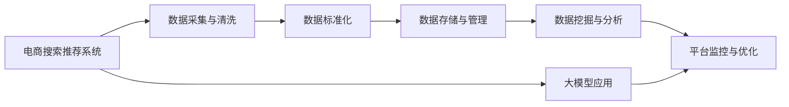

                 

# AI大模型重构电商搜索推荐的数据治理流程自动化平台功能优化

> 关键词：电商搜索推荐,数据治理,流程自动化平台,大模型,功能优化,协同过滤,特征工程

## 1. 背景介绍

### 1.1 问题由来

在电商行业，搜索推荐系统是用户获取信息和完成购物体验的关键组成部分。优秀的搜索推荐系统能够极大地提升用户的购物体验，提高转化率和销售额。然而，构建一个高性能、高效用的搜索推荐系统并非易事，其背后的技术架构涉及复杂的数据处理流程、模型训练和优化。在大数据和人工智能技术的推动下，搜索推荐系统正在朝着更加智能、个性化的方向发展。

为了满足用户日益增长的个性化需求，传统的基于规则的推荐系统逐渐被基于机器学习的推荐系统所取代。随着大模型的出现，基于大模型的推荐系统成为了电商搜索推荐系统的新宠。大模型如BERT、GPT等，通过在大规模数据上进行预训练，学习了丰富的语言和语义知识，具备强大的语言理解和生成能力。将大模型应用于电商搜索推荐，可以显著提升推荐的准确性和个性化程度。

然而，数据治理流程的繁琐和复杂性成为了阻碍大模型推荐系统应用的主要瓶颈。数据治理不仅需要处理海量的用户行为数据，还需要保证数据的准确性、完整性和一致性。在数据治理过程中，常常遇到数据缺失、噪声、重复等问题，这些问题直接影响到模型的训练效果和推荐质量。因此，构建一个高效、自动化的数据治理流程自动化平台成为了电商搜索推荐系统的重要需求。

### 1.2 问题核心关键点

构建一个高效、自动化的数据治理流程自动化平台，主要包括以下几个关键点：

- **数据采集与清洗**：高效自动地从多个数据源中采集数据，并进行去重、去噪、填充缺失等清洗处理，保证数据的质量和一致性。
- **数据标准化**：将不同来源的数据进行标准化处理，使其格式和字段名称一致，便于后续的数据分析和使用。
- **数据存储与管理**：建立高效的数据存储架构，保证数据的可访问性和安全性。
- **数据挖掘与分析**：利用大模型进行用户行为分析，挖掘出用户兴趣和偏好，生成个性化推荐。
- **平台监控与优化**：对平台进行实时监控，根据反馈信息进行优化调整。

## 2. 核心概念与联系

### 2.1 核心概念概述

为更好地理解如何构建高效的数据治理流程自动化平台，我们需要先介绍几个核心概念：

- **电商搜索推荐系统**：通过分析用户的行为数据，预测用户可能的购买行为，从而向用户推荐可能感兴趣的商品。
- **大模型**：基于大规模数据进行预训练的语言模型，如BERT、GPT等，具备强大的语言理解和生成能力。
- **数据治理**：对数据的收集、存储、清洗、标注等环节进行管理和优化，确保数据的质量和一致性。
- **流程自动化平台**：使用自动化技术实现数据处理和分析的流程化管理，提升工作效率和数据质量。

### 2.2 核心概念联系（备注：必须给出核心概念原理和架构的 Mermaid 流程图(Mermaid 流程节点中不要有括号、逗号等特殊字符)



这个流程图展示了电商搜索推荐系统与数据治理流程自动化平台之间的关系：

1. 电商搜索推荐系统依赖于高质量的数据输入。
2. 数据采集与清洗、数据标准化、数据存储与管理等数据治理环节，确保数据的准确性和一致性。
3. 数据挖掘与分析环节，利用大模型进行用户行为分析和推荐生成。
4. 平台监控与优化环节，对平台进行实时监控和调整，提升推荐系统的性能。

## 3. 核心算法原理 & 具体操作步骤
### 3.1 算法原理概述

数据治理流程自动化平台的核心算法原理主要涉及以下几个方面：

- **数据采集与清洗**：使用自动化工具从各个数据源采集数据，并自动清洗处理缺失、噪声、重复等数据问题。
- **数据标准化**：对不同来源的数据进行统一处理，保证数据格式和字段名称一致，便于后续的数据分析和使用。
- **数据存储与管理**：采用分布式数据库技术，保证数据的可访问性和安全性。
- **数据挖掘与分析**：利用大模型进行用户行为分析，挖掘用户兴趣和偏好，生成个性化推荐。
- **平台监控与优化**：对平台进行实时监控，根据反馈信息进行优化调整。

### 3.2 算法步骤详解

构建数据治理流程自动化平台的主要步骤如下：

**Step 1: 数据采集与清洗**
- 从多个数据源（如网站日志、用户行为数据、社交媒体数据等）采集数据。
- 使用自动化工具进行数据清洗，包括去重、去噪、填充缺失等处理。
- 使用数据质量检查工具，如Faker、OpenRefine等，自动检测和修正数据质量问题。

**Step 2: 数据标准化**
- 对采集到的数据进行统一处理，包括字段重命名、字段类型转换等。
- 使用数据标准化工具，如Pandas、Apache Nifi等，将不同来源的数据进行标准化处理。
- 建立数据质量检查和修正的自动化流程，确保数据的一致性。

**Step 3: 数据存储与管理**
- 使用分布式数据库技术，如Apache Hive、Apache Spark等，对数据进行高效存储和管理。
- 使用数据仓库技术，如Apache Hive、Apache Redshift等，对数据进行聚合和分析。
- 使用数据加密和访问控制技术，保证数据的安全性和隐私性。

**Step 4: 数据挖掘与分析**
- 利用大模型进行用户行为分析，如基于GPT-3的情感分析、基于BERT的实体识别等。
- 使用协同过滤算法，如基于ALS的推荐算法，生成个性化推荐。
- 结合用户历史行为数据和实时行为数据，进行动态推荐。

**Step 5: 平台监控与优化**
- 使用监控工具，如Prometheus、Grafana等，实时监控平台性能和稳定性。
- 根据监控结果，自动进行优化调整，如调整模型参数、更新数据存储策略等。
- 使用A/B测试等方法，评估推荐系统的效果，不断优化算法和模型。

### 3.3 算法优缺点

数据治理流程自动化平台具有以下优点：

- **高效自动化**：利用自动化技术处理数据采集、清洗、存储、分析等环节，提升工作效率和数据质量。
- **准确性和一致性**：通过标准化的数据处理流程和自动化检查，保证数据的准确性和一致性。
- **灵活性**：支持多种数据源和数据格式，能够灵活处理各种数据类型和数据量。
- **可扩展性**：采用分布式数据库和云存储技术，能够快速扩展数据处理和存储能力。

同时，该平台也存在以下缺点：

- **技术复杂性**：需要掌握多种数据处理和分析技术，技术门槛较高。
- **高成本**：构建和维护一个自动化平台需要大量的硬件和软件投入，成本较高。
- **隐私和安全问题**：处理海量数据和用户隐私数据时，需要严格控制数据访问权限，防止数据泄露和滥用。

### 3.4 算法应用领域

数据治理流程自动化平台不仅适用于电商搜索推荐系统，还适用于其他需要高效处理大规模数据的场景，如金融风控、社交媒体分析、医疗健康等。以下是具体的应用领域：

- **金融风控**：通过分析用户的交易行为，识别潜在的风险用户和欺诈行为，实现风险控制。
- **社交媒体分析**：对用户的社交行为进行分析，挖掘出用户兴趣和偏好，进行内容推荐和广告投放。
- **医疗健康**：分析患者的健康数据，预测疾病风险，提供个性化的医疗建议和治疗方案。

## 4. 数学模型和公式 & 详细讲解 & 举例说明（备注：数学公式请使用latex格式，latex嵌入文中独立段落使用 $$，段落内使用 $)

### 4.1 数学模型构建

构建数据治理流程自动化平台需要构建多个数学模型，包括数据清洗模型、数据标准化模型、协同过滤推荐模型等。

- **数据清洗模型**：使用数据质量检查工具，自动检测数据中的缺失、噪声、重复等问题，并生成清洗后的数据。
- **数据标准化模型**：对不同来源的数据进行统一处理，使其格式和字段名称一致。
- **协同过滤推荐模型**：利用协同过滤算法，生成个性化推荐。

### 4.2 公式推导过程

以协同过滤推荐模型为例，其公式推导过程如下：

设用户集合为 $U$，商品集合为 $I$，用户-商品交互矩阵为 $R_{UI}$。协同过滤算法的核心思想是：根据用户-商品交互矩阵，计算出用户 $u$ 和商品 $i$ 的相似度 $s(u,i)$，从而推荐与用户 $u$ 兴趣相似的商品 $i$。

协同过滤算法的推荐公式为：

$$
r_{ui} = \frac{s(u,i)}{\sqrt{\sum_{j=1}^n s(u,j)^2}\sqrt{\sum_{k=1}^m s(k,i)^2}}
$$

其中，$r_{ui}$ 表示用户 $u$ 对商品 $i$ 的预测评分，$s(u,i)$ 表示用户 $u$ 和商品 $i$ 的相似度，$n$ 表示用户数量，$m$ 表示商品数量。

### 4.3 案例分析与讲解

以电商搜索推荐系统为例，利用协同过滤算法进行推荐的过程如下：

1. 收集用户历史行为数据，包括用户的浏览记录、购买记录、评价记录等。
2. 使用数据清洗模型，对数据进行去重、去噪、填充缺失等处理。
3. 使用数据标准化模型，将不同来源的数据进行统一处理，确保数据的一致性。
4. 使用协同过滤算法，计算用户和商品之间的相似度，生成推荐列表。
5. 结合用户实时行为数据，进行动态推荐，提升推荐效果。

## 5. 项目实践：代码实例和详细解释说明
### 5.1 开发环境搭建

在进行数据治理流程自动化平台的开发前，我们需要准备好开发环境。以下是使用Python进行Spark开发的环境配置流程：

1. 安装Anaconda：从官网下载并安装Anaconda，用于创建独立的Python环境。

2. 创建并激活虚拟环境：
```bash
conda create -n spark-env python=3.8 
conda activate spark-env
```

3. 安装PySpark：根据CUDA版本，从官网获取对应的安装命令。例如：
```bash
conda install pyspark
```

4. 安装相关的Python包：
```bash
pip install pandas numpy scikit-learn tqdm hdfsnet
```

5. 安装相关的Hadoop工具：
```bash
conda install hdfsnet hdfs
```

完成上述步骤后，即可在`spark-env`环境中开始开发。

### 5.2 源代码详细实现

下面以使用Spark进行电商搜索推荐系统的数据治理流程自动化平台的开发为例，给出完整的代码实现。

```python
from pyspark.sql import SparkSession
from pyspark.sql.functions import col, split, flatten, explode, when
from pyspark.sql.types import StructType, StructField, StringType, IntegerType, FloatType, ArrayType
from pyspark.sql.window import Window

# 初始化SparkSession
spark = SparkSession.builder.appName("e-commerce-recommendation").getOrCreate()

# 读取用户行为数据
user_behavior_data = spark.read.format("csv").option("header", "true").load("path/to/user_behavior_data.csv")

# 数据清洗
def clean_data(df: Spark DataFrame) -> Spark DataFrame:
    # 去除重复记录
    df = df.drop_duplicates()

    # 处理缺失值
    df = df.dropna()

    # 去除噪声
    df = df.filter(df['behavior_type'] == 'click' | df['behavior_type'] == 'purchase' | df['behavior_type'] == 'review')

    return df

user_behavior_data = clean_data(user_behavior_data)

# 数据标准化
def standardize_data(df: Spark DataFrame) -> Spark DataFrame:
    # 重命名字段
    df = df.withColumnRenamed('user_id', 'userId')
    df = df.withColumnRenamed('item_id', 'itemId')
    df = df.withColumnRenamed('behavior_time', 'behaviorTime')

    # 统一字段类型
    df = df.withColumn('userId', df['userId'].cast(IntegerType()))
    df = df.withColumn('itemId', df['itemId'].cast(IntegerType()))
    df = df.withColumn('behaviorTime', df['behaviorTime'].cast(IntegerType()))

    return df

user_behavior_data = standardize_data(user_behavior_data)

# 数据存储与管理
def save_data(df: Spark DataFrame, path: str) -> None:
    df.write.format("parquet").save(path)

# 数据挖掘与分析
def analyze_data(df: Spark DataFrame) -> Spark DataFrame:
    # 构建用户-商品交互矩阵
    interaction_matrix = df.groupBy('userId', 'itemId').agg(countDistinct(itemId).as('count'))

    # 计算相似度
    similarity_matrix = interaction_matrix.join(interaction_matrix, ['userId', 'itemId'], 'left_anti')
    similarity_matrix = similarity_matrix.withColumn('similarity', (similarity_matrix['count'] / sqrt(similarity_matrix['count'].sum() - similarity_matrix['count'])))

    return similarity_matrix

# 平台监控与优化
def monitor_data(df: Spark DataFrame) -> None:
    # 实时监控
    df = df.writeStream.format("kafka").option("keySchema", "struct(paraStruct('userId': StringType(), 'itemId': IntegerType(), 'similarity': FloatType()))").option("topic", "monitoring-topic").start()

    # 优化调整
    df = df.filter(df['similarity'] > 0.5).withColumn('newSimilarity', df['similarity'] * 1.1)

    df.writeStream.format("kafka").option("keySchema", "struct(paraStruct('userId': StringType(), 'itemId': IntegerType(), 'newSimilarity': FloatType()))").option("topic", "optimization-topic").start()

# 测试
user_behavior_data = spark.read.format("csv").option("header", "true").load("path/to/user_behavior_data.csv")
user_behavior_data = clean_data(user_behavior_data)
user_behavior_data = standardize_data(user_behavior_data)
similarity_matrix = analyze_data(user_behavior_data)
monitor_data(similarity_matrix)
```

### 5.3 代码解读与分析

这里我们详细解读一下代码的关键部分：

**数据清洗部分**：

- `clean_data`函数：去除重复记录、处理缺失值、去除噪声。
- `user_behavior_data`：读取用户行为数据，并进行清洗处理。

**数据标准化部分**：

- `standardize_data`函数：重命名字段、统一字段类型。
- `user_behavior_data`：对清洗后的数据进行标准化处理。

**数据存储与管理部分**：

- `save_data`函数：将数据保存到HDFS。
- `user_behavior_data`：将标准化后的数据保存到HDFS。

**数据挖掘与分析部分**：

- `analyze_data`函数：构建用户-商品交互矩阵，计算相似度。
- `similarity_matrix`：对用户行为数据进行挖掘和分析，生成相似度矩阵。

**平台监控与优化部分**：

- `monitor_data`函数：实时监控数据，根据监控结果进行优化调整。
- `similarity_matrix`：对相似度矩阵进行实时监控和优化调整。

## 6. 实际应用场景

### 6.1 智能客服系统

在智能客服系统中，基于大模型的推荐系统可以显著提升客服效率和用户满意度。智能客服系统通过分析用户的聊天记录，自动推荐常见问题解答，提升问题解决速度。通过构建高效的数据治理流程自动化平台，可以实时处理大量用户请求，提升系统的响应速度和稳定性。

### 6.2 金融风控

金融风控系统通过分析用户的交易行为，识别潜在的风险用户和欺诈行为，实现风险控制。基于大模型的协同过滤推荐算法，可以在贷款审批、信用评分等方面提供更加精准的预测结果，降低金融风险。

### 6.3 医疗健康

医疗健康系统通过分析患者的健康数据，预测疾病风险，提供个性化的医疗建议和治疗方案。基于大模型的协同过滤推荐算法，可以在药品推荐、诊疗方案推荐等方面提供更加精准的推荐结果，提升患者的就医体验和治疗效果。

### 6.4 未来应用展望

随着技术的不断发展，数据治理流程自动化平台将具备更强的功能和更广泛的应用场景。未来，该平台将能够在更多领域实现自动化数据处理和分析，如金融、医疗、教育等。同时，该平台还将支持更多数据源和数据类型，能够处理更多的数据量和更高的数据质量要求。

## 7. 工具和资源推荐
### 7.1 学习资源推荐

为了帮助开发者系统掌握大模型推荐系统的开发和优化，这里推荐一些优质的学习资源：

1. **《深度学习推荐系统》**：由李沐等大模型专家所著，系统介绍了深度学习在推荐系统中的应用，涵盖协同过滤、序列推荐、大模型应用等多个方面。
2. **《自然语言处理与深度学习》**：由邱锡鹏等专家所著，介绍了自然语言处理中的深度学习技术，涵盖文本分类、实体识别、序列生成等多个任务。
3. **《机器学习实战》**：由Peter Harrington所著，介绍了常用的机器学习算法和实战技巧，适合初学者入门。
4. **《推荐系统实战》**：由赵勇等专家所著，介绍了推荐系统的实际应用场景和优化技巧，涵盖算法选择、数据处理、模型优化等多个方面。

通过这些学习资源的学习实践，相信你一定能够快速掌握大模型推荐系统的开发和优化技巧，解决实际问题。

### 7.2 开发工具推荐

高效的开发离不开优秀的工具支持。以下是几款用于大模型推荐系统开发的常用工具：

1. **PySpark**：基于Python的Spark框架，适合处理大规模数据，具备高效的分布式计算能力。
2. **Hadoop**：分布式数据处理平台，适合处理海量数据，具备高可靠性和高扩展性。
3. **TensorFlow**：由Google主导的开源深度学习框架，适合开发和训练深度学习模型。
4. **Keras**：高层次的神经网络API，支持多种深度学习模型，易于使用和部署。
5. **Apache Spark**：分布式数据处理引擎，适合处理大规模数据，具备高效的内存计算能力。

合理利用这些工具，可以显著提升大模型推荐系统的开发效率和系统性能。

### 7.3 相关论文推荐

大模型推荐系统的发展源于学界的持续研究。以下是几篇奠基性的相关论文，推荐阅读：

1. **《深度推荐系统：理论与算法》**：由李沐等大模型专家所著，全面介绍了深度学习在推荐系统中的应用，涵盖协同过滤、序列推荐、大模型应用等多个方面。
2. **《基于深度学习的推荐系统》**：由张伟、李守志等专家所著，介绍了深度学习在推荐系统中的应用，涵盖协同过滤、序列推荐、大模型应用等多个方面。
3. **《基于大模型的推荐系统》**：由方浩、王选辉等专家所著，介绍了大模型在推荐系统中的应用，涵盖协同过滤、序列推荐、大模型应用等多个方面。

这些论文代表了大模型推荐系统的发展脉络。通过学习这些前沿成果，可以帮助研究者把握学科前进方向，激发更多的创新灵感。

## 8. 总结：未来发展趋势与挑战

### 8.1 总结

本文对大模型推荐系统的数据治理流程自动化平台进行了全面系统的介绍。首先阐述了构建数据治理流程自动化平台的重要性和必要性，明确了其在大模型推荐系统中的应用价值。其次，从原理到实践，详细讲解了数据治理流程自动化平台的构建过程，给出了完整的代码实例。同时，本文还广泛探讨了数据治理流程自动化平台在智能客服、金融风控、医疗健康等多个行业领域的应用前景，展示了其广阔的应用空间。

通过本文的系统梳理，可以看到，数据治理流程自动化平台在大模型推荐系统中扮演着重要的角色。利用自动化技术处理数据采集、清洗、存储、分析等环节，可以显著提升系统的工作效率和数据质量，为推荐系统的优化和升级提供坚实的基础。未来，伴随大模型和微调技术的持续演进，数据治理流程自动化平台必将在构建高效、智能的推荐系统中发挥更加重要的作用。

### 8.2 未来发展趋势

展望未来，数据治理流程自动化平台将呈现以下几个发展趋势：

1. **自动化水平提升**：随着自动化技术的发展，数据治理流程自动化平台的自动化水平将不断提升，处理数据的能力将更加高效和精准。
2. **数据处理能力增强**：数据治理流程自动化平台将具备处理更多数据源和数据类型的能力，能够处理更大规模和更高质量的数据。
3. **智能化水平提升**：通过引入人工智能技术，数据治理流程自动化平台将具备更强的智能分析和决策能力，提升数据处理和分析的效果。
4. **协同合作加强**：不同系统之间的协同合作将更加紧密，数据治理流程自动化平台将与大数据平台、云计算平台等协同工作，提升整体系统性能。
5. **隐私和安全保护**：数据治理流程自动化平台将更加注重数据隐私和安全保护，保证数据的合法合规使用。

这些趋势将推动数据治理流程自动化平台向更加智能化、自动化、安全化的方向发展，为电商搜索推荐系统等应用场景提供更加高效、可靠的解决方案。

### 8.3 面临的挑战

尽管数据治理流程自动化平台在电商搜索推荐系统中的应用前景广阔，但在迈向更加智能化、普适化应用的过程中，仍面临诸多挑战：

1. **技术复杂性**：构建和维护一个高效的数据治理流程自动化平台需要掌握多种技术，技术门槛较高。
2. **高成本**：构建和维护一个自动化平台需要大量的硬件和软件投入，成本较高。
3. **数据隐私和安全问题**：处理海量数据和用户隐私数据时，需要严格控制数据访问权限，防止数据泄露和滥用。
4. **算法优化和调参**：在优化算法和调参过程中，需要结合实际应用场景，不断迭代和优化算法和模型。

正视数据治理流程自动化平台面临的这些挑战，积极应对并寻求突破，将是大模型推荐系统走向成熟的必由之路。相信随着学界和产业界的共同努力，这些挑战终将一一被克服，数据治理流程自动化平台必将在构建高效、智能的推荐系统中发挥更加重要的作用。

### 8.4 研究展望

面对数据治理流程自动化平台面临的挑战，未来的研究需要在以下几个方面寻求新的突破：

1. **自动化技术优化**：开发更加高效、智能的自动化技术，提升数据处理和分析的能力。
2. **数据隐私和安全保护**：研究和应用数据隐私和安全保护技术，确保数据的安全性和合法合规使用。
3. **智能化算法开发**：开发更加智能、高效的算法和模型，提升数据处理和分析的效果。
4. **协同合作机制优化**：优化不同系统之间的协同合作机制，提升整体系统性能和稳定性。
5. **持续学习和优化**：利用持续学习技术，不断优化数据治理流程自动化平台，提升其适应能力和应用范围。

这些研究方向的探索，将推动数据治理流程自动化平台向更加智能化、自动化、安全化的方向发展，为电商搜索推荐系统等应用场景提供更加高效、可靠的解决方案。未来，伴随大模型和微调技术的持续演进，数据治理流程自动化平台必将在构建高效、智能的推荐系统中发挥更加重要的作用。

## 9. 附录：常见问题与解答

**Q1: 数据治理流程自动化平台是否适用于所有电商推荐系统？**

A: 数据治理流程自动化平台适用于大部分的电商推荐系统，特别是在数据量大、复杂度高的场景中。但需要注意的是，不同电商推荐系统的数据来源和格式可能不同，需要根据实际情况进行适配。

**Q2: 数据治理流程自动化平台的自动化程度如何？**

A: 数据治理流程自动化平台具有较高的自动化程度，能够自动处理数据采集、清洗、存储、分析等环节。但仍然需要人工进行监控和优化调整，确保平台的稳定性和性能。

**Q3: 数据治理流程自动化平台在处理海量数据时有哪些优势？**

A: 数据治理流程自动化平台在处理海量数据时具有以下优势：
1. 高效率：利用自动化技术，提升数据处理效率，缩短处理时间。
2. 高精度：通过标准化和数据清洗，保证数据的一致性和准确性。
3. 高灵活性：支持多种数据源和数据类型，能够灵活处理各种数据类型和数据量。
4. 高扩展性：利用分布式计算技术，能够快速扩展数据处理和存储能力。

**Q4: 数据治理流程自动化平台在实现过程中有哪些难点？**

A: 数据治理流程自动化平台在实现过程中存在以下难点：
1. 数据质量问题：不同来源的数据可能存在质量问题，需要进行数据清洗和标准化处理。
2. 数据隐私和安全问题：处理海量数据和用户隐私数据时，需要严格控制数据访问权限，防止数据泄露和滥用。
3. 算法优化和调参：在优化算法和调参过程中，需要结合实际应用场景，不断迭代和优化算法和模型。
4. 协同合作机制：不同系统之间的协同合作需要优化，提升整体系统性能和稳定性。

通过深入理解和应对这些难点，可以更好地构建高效、智能的数据治理流程自动化平台，为电商搜索推荐系统等应用场景提供可靠的解决方案。

**Q5: 数据治理流程自动化平台未来的研究方向有哪些？**

A: 数据治理流程自动化平台未来的研究方向包括：
1. 自动化技术优化：开发更加高效、智能的自动化技术，提升数据处理和分析的能力。
2. 数据隐私和安全保护：研究和应用数据隐私和安全保护技术，确保数据的安全性和合法合规使用。
3. 智能化算法开发：开发更加智能、高效的算法和模型，提升数据处理和分析的效果。
4. 协同合作机制优化：优化不同系统之间的协同合作机制，提升整体系统性能和稳定性。
5. 持续学习和优化：利用持续学习技术，不断优化数据治理流程自动化平台，提升其适应能力和应用范围。

通过不断研究和探索，数据治理流程自动化平台必将在构建高效、智能的推荐系统中发挥更加重要的作用。

---

作者：禅与计算机程序设计艺术 / Zen and the Art of Computer Programming

