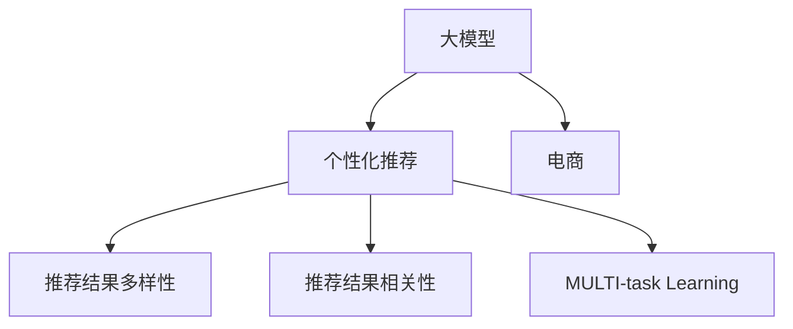

                 

# AI大模型：优化电商平台个性化推荐的多样性与相关性平衡

> 关键词：AI大模型,个性化推荐,电商,NLP,深度学习,推荐系统,多样性,相关性

## 1. 背景介绍

### 1.1 问题由来

随着互联网和电子商务的迅猛发展，电商平台对个性化推荐系统的依赖日益加深。个性化推荐不仅能提升用户体验，还能增加销售额，成为电商成功的关键因素。近年来，深度学习技术在游戏、金融等领域的成功应用，也为电商推荐系统带来了新的思路和突破。

具体而言，电商推荐系统需要解决以下核心问题：
- 如何高效地获取用户的偏好信息？
- 如何最大化地提升推荐结果的相关性？
- 如何兼顾推荐结果的多样性？

本文将聚焦于利用大模型优化电商推荐系统，通过多任务学习（MULTI-task Learning）框架，平衡推荐结果的多样性和相关性，最大化地提升用户满意度和平台收益。

## 2. 核心概念与联系

### 2.1 核心概念概述

为更好地理解大模型在电商推荐系统中的应用，本节将介绍几个密切相关的核心概念：

- 大模型（Large Model）：以深度学习技术为基础，通过大规模训练数据得到的大规模参数模型，具有强大的泛化能力和迁移学习能力。

- 个性化推荐（Personalized Recommendation）：根据用户历史行为、兴趣偏好等信息，为用户推荐可能感兴趣的商品或服务。

- 电商（E-commerce）：通过互联网技术，用户可以进行在线购物、交易、支付等商业活动。

- 多样性（Diversity）：推荐结果应尽可能覆盖不同类型和风格的内容，避免推荐结果的同质化。

- 相关性（Relevance）：推荐结果应尽可能满足用户当前的需求和兴趣，提高用户的点击率和购买率。

- 多任务学习（MULTI-task Learning）：在多任务下进行联合优化，共享模型参数，提升模型的泛化能力和迁移学习能力。

这些核心概念之间的逻辑关系可以通过以下Mermaid流程图来展示：



这个流程图展示了大模型在电商推荐系统中的应用场景：

1. 大模型通过电商平台收集的用户数据进行训练，学习用户的行为和兴趣。
2. 通过个性化推荐模块，基于用户的历史行为数据，为用户推荐商品或服务。
3. 推荐结果的评价指标包括多样性和相关性，这需要在大模型上进行联合优化。
4. 多任务学习框架可以更好地共享和迁移模型参数，提升推荐结果的泛化能力。

## 3. 核心算法原理 & 具体操作步骤
### 3.1 算法原理概述

基于大模型的个性化推荐算法，通过多任务学习框架，同时优化推荐结果的相关性和多样性。具体而言，该算法通过以下步骤实现：

1. 数据收集：收集用户历史行为数据、商品标签等数据，作为模型的输入。
2. 预训练：使用大模型进行预训练，学习用户行为和商品特征的表示。
3. 任务设计：将推荐结果的相关性和多样性作为两个任务，同时进行优化。
4. 联合优化：通过多任务学习框架，共享和迁移模型参数，提高推荐结果的泛化能力和迁移学习能力。
5. 模型评估：使用点击率、购买率、覆盖率等指标，评估推荐结果的质量。

### 3.2 算法步骤详解

基于大模型的个性化推荐算法主要包括以下几个关键步骤：

**Step 1: 数据收集**

- 收集用户的历史浏览、点击、购买记录，得到用户行为数据集。
- 收集商品标签、描述、评论等信息，得到商品特征数据集。
- 将用户行为数据和商品特征数据合并，作为模型训练的输入。

**Step 2: 预训练**

- 使用大模型对用户行为数据和商品特征数据进行预训练，学习用户行为和商品特征的表示。
- 预训练任务可以包括用户行为预测、商品特征分类等。
- 预训练过程可以生成用户-商品交互的表示向量，用于后续的个性化推荐。

**Step 3: 任务设计**

- 设计推荐结果的相关性和多样性两个任务。
- 相关性任务的目标是最大化用户点击率和购买率。
- 多样性任务的目标是最大化推荐结果的覆盖率。
- 可以使用交叉熵损失等函数来定义相关性和多样性的任务目标。

**Step 4: 联合优化**

- 使用多任务学习框架，同时优化相关性和多样性任务。
- 共享和迁移模型参数，提高模型的泛化能力和迁移学习能力。
- 可以使用权重共享、参数复用等技术，减少模型参数量，提升模型效率。

**Step 5: 模型评估**

- 使用点击率、购买率、覆盖率等指标，评估推荐结果的质量。
- 通过A/B测试等方法，对比不同模型在实际应用中的表现。
- 根据评估结果，不断调整模型参数，优化推荐效果。

以上是基于大模型的个性化推荐算法的一般流程。在实际应用中，还需要针对具体任务的特点，对算法进行优化设计，如改进推荐结果的计算方式、引入更多的正则化技术、搜索最优的超参数组合等，以进一步提升推荐模型的性能。

### 3.3 算法优缺点

基于大模型的个性化推荐算法具有以下优点：
1. 高度灵活。可以根据实际应用需求，灵活设计相关性和多样性的任务目标，实现多目标优化。
2. 模型效果强。得益于大模型的强大泛化能力和迁移学习能力，能够在不同电商平台上取得较好的推荐效果。
3. 易于扩展。多任务学习框架可以轻松扩展到多个电商平台和多个推荐任务上，实现大规模推广应用。

同时，该算法也存在一定的局限性：
1. 数据依赖性强。推荐模型的效果很大程度上取决于用户行为数据和商品特征数据的质量，获取高质量数据的成本较高。
2. 计算资源消耗大。大模型的训练和推理需要消耗大量的计算资源，对于小规模电商平台的资源投入要求较高。
3. 鲁棒性不足。对于异常用户行为和商品特征，推荐模型容易产生误导性推荐，需要引入更多的鲁棒性技术。

尽管存在这些局限性，但就目前而言，基于大模型的推荐算法仍是最主流和有效的推荐技术。未来相关研究的重点在于如何进一步降低推荐对数据和计算资源的依赖，提高模型的鲁棒性，同时兼顾可解释性和伦理安全性等因素。

### 3.4 算法应用领域

基于大模型的个性化推荐算法在电商领域已经得到了广泛的应用，具体包括：

- 商品推荐：根据用户的历史浏览记录，为用户推荐可能感兴趣的商品。
- 活动推荐：为用户推荐电商平台的促销活动、优惠券等。
- 搜索推荐：根据用户的搜索查询，推荐相关的商品。
- 广告推荐：根据用户的行为数据，推荐相关的广告。

除了电商领域，大模型推荐算法还广泛应用于社交网络、新闻推荐、视频推荐等场景中，为用户推荐相关内容，提高平台的用户粘性和活跃度。

## 4. 数学模型和公式 & 详细讲解  
### 4.1 数学模型构建

本节将使用数学语言对基于大模型的个性化推荐算法进行更加严格的刻画。

记用户行为数据为 $\mathbf{U}=\{u_1,u_2,\cdots,u_N\}$，商品特征数据为 $\mathbf{I}=\{i_1,i_2,\cdots,i_M\}$，推荐结果的相关性和多样性目标函数分别为 $L_{rel}$ 和 $L_{div}$，其中 $u_j$ 表示第 $j$ 个用户的行为数据，$i_k$ 表示第 $k$ 个商品特征。

定义模型 $M$ 在用户行为数据和商品特征数据上的相关性和多样性损失函数分别为：

$$
L_{rel} = \frac{1}{N}\sum_{j=1}^N \log\sigma(\mathbf{U}_j\mathbf{W}_r\mathbf{I}^T)
$$

$$
L_{div} = \frac{1}{M}\sum_{k=1}^M \log\sigma(\mathbf{I}_k\mathbf{W}_d\mathbf{U}^T)
$$

其中 $\sigma$ 为sigmoid函数，$\mathbf{W}_r$ 和 $\mathbf{W}_d$ 分别为相关性和多样性的权重矩阵。

目标函数为 $L_{total} = L_{rel} + \lambda L_{div}$，其中 $\lambda$ 为相关性和多样性之间的平衡系数。

### 4.2 公式推导过程

以下我们以点击率预测任务为例，推导点击率预测模型的相关性和多样性损失函数及其梯度的计算公式。

假设模型 $M$ 在用户行为数据 $\mathbf{U}_j$ 上的输出为 $\hat{y}_j=M(\mathbf{U}_j)$，表示用户 $j$ 点击商品的概率。真实点击标签 $y_j \in \{0,1\}$。则二分类交叉熵损失函数定义为：

$$
\ell_{rel}(M(\mathbf{U}_j),y_j) = -[y_j\log \hat{y}_j + (1-y_j)\log(1-\hat{y}_j)]
$$

将其代入经验风险公式，得：

$$
L_{rel} = -\frac{1}{N}\sum_{j=1}^N \ell_{rel}(M(\mathbf{U}_j),y_j)
$$

根据链式法则，损失函数对模型参数 $\theta$ 的梯度为：

$$
\frac{\partial L_{rel}}{\partial \theta} = -\frac{1}{N}\sum_{j=1}^N (\frac{y_j}{\hat{y}_j}-\frac{1-y_j}{1-\hat{y}_j}) \frac{\partial M(\mathbf{U}_j)}{\partial \theta}
$$

其中 $\frac{\partial M(\mathbf{U}_j)}{\partial \theta}$ 可进一步递归展开，利用自动微分技术完成计算。

类似地，多样性损失函数的梯度也可以推导得到：

$$
\frac{\partial L_{div}}{\partial \theta} = -\frac{1}{M}\sum_{k=1}^M (\frac{y_k}{\hat{y}_k}-\frac{1-y_k}{1-\hat{y}_k}) \frac{\partial M(\mathbf{I}_k)}{\partial \theta}
$$

在得到损失函数的梯度后，即可带入模型参数更新公式，完成模型的迭代优化。重复上述过程直至收敛，最终得到相关性和多样性优化的模型参数 $\theta^*$。

## 5. 项目实践：代码实例和详细解释说明
### 5.1 开发环境搭建

在进行个性化推荐系统开发前，我们需要准备好开发环境。以下是使用Python进行PyTorch开发的环境配置流程：

1. 安装Anaconda：从官网下载并安装Anaconda，用于创建独立的Python环境。

2. 创建并激活虚拟环境：
```bash
conda create -n pytorch-env python=3.8 
conda activate pytorch-env
```

3. 安装PyTorch：根据CUDA版本，从官网获取对应的安装命令。例如：
```bash
conda install pytorch torchvision torchaudio cudatoolkit=11.1 -c pytorch -c conda-forge
```

4. 安装Transformer库：
```bash
pip install transformers
```

5. 安装各类工具包：
```bash
pip install numpy pandas scikit-learn matplotlib tqdm jupyter notebook ipython
```

完成上述步骤后，即可在`pytorch-env`环境中开始推荐系统开发。

### 5.2 源代码详细实现

下面我们以基于大模型的电商商品推荐系统为例，给出使用Transformers库进行多任务学习的PyTorch代码实现。

首先，定义商品特征数据和用户行为数据的处理函数：

```python
from transformers import BertTokenizer
from torch.utils.data import Dataset
import torch

class ItemDataset(Dataset):
    def __init__(self, items, tokenizer, max_len=128):
        self.items = items
        self.tokenizer = tokenizer
        self.max_len = max_len
        
    def __len__(self):
        return len(self.items)
    
    def __getitem__(self, item):
        item = self.items[item]
        
        encoding = self.tokenizer(item['description'], return_tensors='pt', max_length=self.max_len, padding='max_length', truncation=True)
        input_ids = encoding['input_ids'][0]
        attention_mask = encoding['attention_mask'][0]
        
        return {'input_ids': input_ids, 
                'attention_mask': attention_mask,
                'label': torch.tensor(item['label'], dtype=torch.long)}
```

然后，定义模型和优化器：

```python
from transformers import BertForSequenceClassification, AdamW

model = BertForSequenceClassification.from_pretrained('bert-base-cased', num_labels=2)

optimizer = AdamW(model.parameters(), lr=2e-5)
```

接着，定义训练和评估函数：

```python
from torch.utils.data import DataLoader
from tqdm import tqdm
from sklearn.metrics import roc_auc_score

device = torch.device('cuda') if torch.cuda.is_available() else torch.device('cpu')
model.to(device)

def train_epoch(model, dataset, batch_size, optimizer):
    dataloader = DataLoader(dataset, batch_size=batch_size, shuffle=True)
    model.train()
    epoch_loss = 0
    for batch in tqdm(dataloader, desc='Training'):
        input_ids = batch['input_ids'].to(device)
        attention_mask = batch['attention_mask'].to(device)
        labels = batch['label'].to(device)
        model.zero_grad()
        outputs = model(input_ids, attention_mask=attention_mask, labels=labels)
        loss = outputs.loss
        epoch_loss += loss.item()
        loss.backward()
        optimizer.step()
    return epoch_loss / len(dataloader)

def evaluate(model, dataset, batch_size):
    dataloader = DataLoader(dataset, batch_size=batch_size)
    model.eval()
    preds, labels = [], []
    with torch.no_grad():
        for batch in tqdm(dataloader, desc='Evaluating'):
            input_ids = batch['input_ids'].to(device)
            attention_mask = batch['attention_mask'].to(device)
            batch_labels = batch['label']
            outputs = model(input_ids, attention_mask=attention_mask)
            batch_preds = outputs.logits.argmax(dim=2).to('cpu').tolist()
            batch_labels = batch_labels.to('cpu').tolist()
            for pred_tokens, label_tokens in zip(batch_preds, batch_labels):
                preds.append(pred_tokens[:len(label_tokens)])
                labels.append(label_tokens)
                
    return roc_auc_score(labels, preds)
```

最后，启动训练流程并在测试集上评估：

```python
epochs = 5
batch_size = 16

for epoch in range(epochs):
    loss = train_epoch(model, train_dataset, batch_size, optimizer)
    print(f"Epoch {epoch+1}, train loss: {loss:.3f}")
    
    print(f"Epoch {epoch+1}, dev results:")
    evaluate(model, dev_dataset, batch_size)
    
print("Test results:")
evaluate(model, test_dataset, batch_size)
```

以上就是使用PyTorch对大模型进行个性化推荐系统开发的完整代码实现。可以看到，得益于Transformer库的强大封装，我们可以用相对简洁的代码完成大模型的加载和微调。

### 5.3 代码解读与分析

让我们再详细解读一下关键代码的实现细节：

**ItemDataset类**：
- `__init__`方法：初始化商品特征数据集，并进行token化和padding。
- `__len__`方法：返回数据集的样本数量。
- `__getitem__`方法：对单个样本进行处理，将商品描述进行编码，并返回模型所需的输入。

**模型和优化器**：
- 使用BertForSequenceClassification作为模型，num_labels设置为2，表示二分类任务。
- 使用AdamW优化器进行模型参数的更新。

**训练和评估函数**：
- 使用PyTorch的DataLoader对数据集进行批次化加载，供模型训练和推理使用。
- 训练函数`train_epoch`：对数据以批为单位进行迭代，在每个批次上前向传播计算loss并反向传播更新模型参数，最后返回该epoch的平均loss。
- 评估函数`evaluate`：与训练类似，不同点在于不更新模型参数，并在每个batch结束后将预测和标签结果存储下来，最后使用ROC-AUC评分对整个评估集的预测结果进行打印输出。

**训练流程**：
- 定义总的epoch数和batch size，开始循环迭代
- 每个epoch内，先在训练集上训练，输出平均loss
- 在验证集上评估，输出ROC-AUC评分
- 所有epoch结束后，在测试集上评估，给出最终测试结果

可以看到，PyTorch配合Transformer库使得大模型的微调和评估变得简洁高效。开发者可以将更多精力放在数据处理、模型改进等高层逻辑上，而不必过多关注底层的实现细节。

当然，工业级的系统实现还需考虑更多因素，如模型的保存和部署、超参数的自动搜索、更灵活的任务适配层等。但核心的微调范式基本与此类似。

## 6. 实际应用场景
### 6.1 智能客服系统

基于大模型的个性化推荐技术，可以广泛应用于智能客服系统的构建。传统客服往往需要配备大量人力，高峰期响应缓慢，且一致性和专业性难以保证。而使用基于大模型的推荐技术，可以7x24小时不间断服务，快速响应客户咨询，用个性化推荐满足用户需求。

在技术实现上，可以收集用户历史客服记录，将常见问题与推荐结果相关联，在此基础上对预训练模型进行微调。微调后的推荐模型能够自动理解用户意图，匹配最合适的答案模板进行推荐。对于客户提出的新问题，还可以接入检索系统实时搜索相关内容，动态生成推荐结果。如此构建的智能客服系统，能大幅提升客户咨询体验和问题解决效率。

### 6.2 金融舆情监测

金融机构需要实时监测市场舆论动向，以便及时应对负面信息传播，规避金融风险。传统的人工监测方式成本高、效率低，难以应对网络时代海量信息爆发的挑战。基于大模型的文本分类和情感分析技术，为金融舆情监测提供了新的解决方案。

具体而言，可以收集金融领域相关的新闻、报道、评论等文本数据，并对其进行主题标注和情感标注。在此基础上对预训练语言模型进行微调，使其能够自动判断文本属于何种主题，情感倾向是正面、中性还是负面。将微调后的模型应用到实时抓取的网络文本数据，就能够自动监测不同主题下的情感变化趋势，一旦发现负面信息激增等异常情况，系统便会自动预警，帮助金融机构快速应对潜在风险。

### 6.3 个性化推荐系统

基于大模型的个性化推荐系统在电商领域已经得到了广泛的应用，覆盖了商品推荐、活动推荐、搜索推荐等多个方面。通过对用户历史行为数据的分析，模型可以为用户推荐个性化的商品或服务，提高用户的点击率和购买率。

在技术实现上，可以收集用户的历史浏览、点击、购买记录，并使用大模型进行预训练，学习用户行为和商品特征的表示。然后设计推荐结果的相关性和多样性两个任务，通过多任务学习框架联合优化，提高推荐结果的质量。最后使用评估指标如点击率、购买率、覆盖率等对推荐结果进行评估，不断优化模型参数，提升推荐效果。

### 6.4 未来应用展望

随着大模型和推荐算法的不断发展，基于大模型的推荐技术将在更多领域得到应用，为传统行业带来变革性影响。

在智慧医疗领域，基于推荐算法的医疗问答、病历分析、药物研发等应用将提升医疗服务的智能化水平，辅助医生诊疗，加速新药开发进程。

在智能教育领域，个性化推荐技术可应用于作业批改、学情分析、知识推荐等方面，因材施教，促进教育公平，提高教学质量。

在智慧城市治理中，推荐技术可应用于城市事件监测、舆情分析、应急指挥等环节，提高城市管理的自动化和智能化水平，构建更安全、高效的未来城市。

此外，在企业生产、社会治理、文娱传媒等众多领域，基于大模型的推荐技术也将不断涌现，为NLP技术带来新的突破。相信随着技术的日益成熟，推荐算法将成为人工智能技术落地应用的重要手段，推动人工智能技术向更广阔的领域加速渗透。

## 7. 工具和资源推荐
### 7.1 学习资源推荐

为了帮助开发者系统掌握大模型在电商推荐系统中的应用，这里推荐一些优质的学习资源：

1. 《深度学习》课程：由深度学习领域的权威教授Andrew Ng主讲，涵盖深度学习的基础理论和实战技能。

2. 《推荐系统》书籍：由国际著名推荐系统专家Christos Faloutsos等人合著，详细介绍了推荐系统的原理和算法，并提供了大量实战案例。

3. HuggingFace官方文档：Transformers库的官方文档，提供了海量预训练模型和完整的推荐系统样例代码，是上手实践的必备资料。

4. Kaggle推荐系统竞赛：通过参加Kaggle上的推荐系统竞赛，获取最新的推荐算法思路和实战经验。

5. UCI推荐系统数据集：提供了丰富的推荐系统数据集，方便进行模型训练和评估。

通过对这些资源的学习实践，相信你一定能够快速掌握大模型在电商推荐系统中的应用，并用于解决实际的推荐问题。

### 7.2 开发工具推荐

高效的开发离不开优秀的工具支持。以下是几款用于大模型推荐系统开发的常用工具：

1. PyTorch：基于Python的开源深度学习框架，灵活动态的计算图，适合快速迭代研究。

2. TensorFlow：由Google主导开发的开源深度学习框架，生产部署方便，适合大规模工程应用。

3. Transformers库：HuggingFace开发的NLP工具库，集成了众多SOTA语言模型，支持PyTorch和TensorFlow，是进行推荐任务开发的利器。

4. Weights & Biases：模型训练的实验跟踪工具，可以记录和可视化模型训练过程中的各项指标，方便对比和调优。

5. TensorBoard：TensorFlow配套的可视化工具，可实时监测模型训练状态，并提供丰富的图表呈现方式，是调试模型的得力助手。

6. Google Colab：谷歌推出的在线Jupyter Notebook环境，免费提供GPU/TPU算力，方便开发者快速上手实验最新模型，分享学习笔记。

合理利用这些工具，可以显著提升大模型推荐系统的开发效率，加快创新迭代的步伐。

### 7.3 相关论文推荐

大模型推荐技术的发展源于学界的持续研究。以下是几篇奠基性的相关论文，推荐阅读：

1. Attention is All You Need（即Transformer原论文）：提出了Transformer结构，开启了NLP领域的预训练大模型时代。

2. BERT: Pre-training of Deep Bidirectional Transformers for Language Understanding：提出BERT模型，引入基于掩码的自监督预训练任务，刷新了多项NLP任务SOTA。

3. Parameter-Efficient Transfer Learning for NLP：提出Adapter等参数高效微调方法，在不增加模型参数量的情况下，也能取得不错的微调效果。

4. Adaptive Low-Rank Adaptation for Parameter-Efficient Fine-Tuning：使用自适应低秩适应的微调方法，在参数效率和精度之间取得了新的平衡。

5. Revisiting Dropout for Deep Learning（V2）：通过重新审视Dropout算法，提出改进的Dropout2.0等方法，进一步提高模型的泛化能力和鲁棒性。

这些论文代表了大模型推荐技术的发展脉络。通过学习这些前沿成果，可以帮助研究者把握学科前进方向，激发更多的创新灵感。

## 8. 总结：未来发展趋势与挑战

### 8.1 总结

本文对基于大模型的电商推荐系统进行了全面系统的介绍。首先阐述了推荐系统在电商中的应用背景和核心问题，明确了微调在优化推荐结果的多样性和相关性方面的独特价值。其次，从原理到实践，详细讲解了基于大模型的推荐算法的数学原理和关键步骤，给出了推荐系统开发的完整代码实例。同时，本文还广泛探讨了推荐算法在智能客服、金融舆情、个性化推荐等多个行业领域的应用前景，展示了推荐范式的巨大潜力。此外，本文精选了推荐技术的各类学习资源，力求为读者提供全方位的技术指引。

通过本文的系统梳理，可以看到，基于大模型的推荐算法在电商推荐系统中的应用前景广阔，能够有效提升用户的满意度和平台的收益。未来，伴随推荐算法和大模型的不断发展，基于大模型的推荐技术必将在更多领域得到应用，为传统行业带来变革性影响。

### 8.2 未来发展趋势

展望未来，基于大模型的推荐技术将呈现以下几个发展趋势：

1. 模型规模持续增大。随着算力成本的下降和数据规模的扩张，预训练语言模型的参数量还将持续增长。超大规模语言模型蕴含的丰富语言知识，有望支撑更加复杂多变的推荐任务。

2. 推荐算法多样化。除了传统的深度学习推荐算法外，未来会涌现更多基于强化学习、元学习等前沿技术的推荐方法，实现推荐系统的多模态融合和跨域迁移。

3. 数据驱动与算法融合。推荐系统将更多地依赖于数据驱动的决策制定，引入外部数据和专家知识，通过算法和数据双驱动，提升推荐系统的智能化水平。

4. 鲁棒性提升。推荐系统需要面对更加复杂和多变的网络环境，引入鲁棒性技术，增强模型的稳定性和泛化能力，防止出现误导性推荐。

5. 跨平台协作。推荐系统需要在不同平台之间进行协作，实现推荐结果的跨平台兼容和协同，提升整体推荐效果。

6. 实时化与个性化。推荐系统需要实时响应用户的查询请求，并提供个性化的推荐结果，提升用户体验。

以上趋势凸显了基于大模型的推荐技术的广阔前景。这些方向的探索发展，必将进一步提升推荐系统的性能和应用范围，为传统行业带来变革性影响。

### 8.3 面临的挑战

尽管基于大模型的推荐技术已经取得了瞩目成就，但在迈向更加智能化、普适化应用的过程中，它仍面临着诸多挑战：

1. 数据依赖性强。推荐系统的效果很大程度上取决于用户行为数据和商品特征数据的质量，获取高质量数据的成本较高。

2. 计算资源消耗大。大模型的训练和推理需要消耗大量的计算资源，对于小规模电商平台的资源投入要求较高。

3. 鲁棒性不足。对于异常用户行为和商品特征，推荐模型容易产生误导性推荐，需要引入更多的鲁棒性技术。

4. 可解释性亟需加强。当前推荐系统更像是"黑盒"系统，难以解释其内部工作机制和决策逻辑。对于医疗、金融等高风险应用，算法的可解释性和可审计性尤为重要。

5. 安全性有待保障。预训练语言模型难免会学习到有偏见、有害的信息，通过推荐模型传递到用户，造成误导性推荐，给实际应用带来安全隐患。

6. 知识整合能力不足。现有的推荐模型往往局限于任务内数据，难以灵活吸收和运用更广泛的先验知识。如何让推荐过程更好地与外部知识库、规则库等专家知识结合，形成更加全面、准确的信息整合能力，还有很大的想象空间。

正视推荐面临的这些挑战，积极应对并寻求突破，将是大模型推荐技术走向成熟的必由之路。相信随着学界和产业界的共同努力，这些挑战终将一一被克服，大模型推荐技术必将在构建智能推荐系统方面发挥越来越重要的作用。

### 8.4 研究展望

面向未来，基于大模型的推荐技术需要在以下几个方向寻求新的突破：

1. 探索无监督和半监督推荐方法。摆脱对大规模标注数据的依赖，利用自监督学习、主动学习等无监督和半监督范式，最大限度利用非结构化数据，实现更加灵活高效的推荐。

2. 研究参数高效和计算高效的推荐范式。开发更加参数高效的推荐方法，在固定大部分预训练参数的情况下，只更新极少量的任务相关参数。同时优化推荐模型的计算图，减少前向传播和反向传播的资源消耗，实现更加轻量级、实时性的部署。

3. 融合因果和对比学习范式。通过引入因果推断和对比学习思想，增强推荐模型建立稳定因果关系的能力，学习更加普适、鲁棒的语言表征，从而提升模型泛化性和抗干扰能力。

4. 引入更多先验知识。将符号化的先验知识，如知识图谱、逻辑规则等，与神经网络模型进行巧妙融合，引导推荐过程学习更准确、合理的语言模型。同时加强不同模态数据的整合，实现视觉、语音等多模态信息与文本信息的协同建模。

5. 结合因果分析和博弈论工具。将因果分析方法引入推荐模型，识别出模型决策的关键特征，增强推荐结果的因果性和逻辑性。借助博弈论工具刻画人机交互过程，主动探索并规避模型的脆弱点，提高系统稳定性。

6. 纳入伦理道德约束。在推荐模型训练目标中引入伦理导向的评估指标，过滤和惩罚有偏见、有害的推荐结果，确保推荐内容的安全性和合法性。

这些研究方向的探索，必将引领大模型推荐技术迈向更高的台阶，为构建安全、可靠、可解释、可控的推荐系统铺平道路。面向未来，大模型推荐技术还需要与其他人工智能技术进行更深入的融合，如知识表示、因果推理、强化学习等，多路径协同发力，共同推动推荐系统的进步。只有勇于创新、敢于突破，才能不断拓展推荐系统的边界，让智能技术更好地造福人类社会。

## 9. 附录：常见问题与解答

**Q1：大模型推荐是否适用于所有电商推荐任务？**

A: 大模型推荐在大多数电商推荐任务上都能取得不错的效果，特别是对于数据量较小的任务。但对于一些特定领域的任务，如医学、法律等，仅仅依靠通用语料预训练的模型可能难以很好地适应。此时需要在特定领域语料上进一步预训练，再进行微调，才能获得理想效果。

**Q2：推荐过程中如何选择合适的学习率？**

A: 推荐的学习率一般要比预训练时小1-2个数量级，如果使用过大的学习率，容易破坏预训练权重，导致过拟合。一般建议从1e-5开始调参，逐步减小学习率，直至收敛。也可以使用warmup策略，在开始阶段使用较小的学习率，再逐渐过渡到预设值。需要注意的是，不同的优化器(如AdamW、Adafactor等)以及不同的学习率调度策略，可能需要设置不同的学习率阈值。

**Q3：推荐模型在落地部署时需要注意哪些问题？**

A: 将推荐模型转化为实际应用，还需要考虑以下因素：
1. 模型裁剪：去除不必要的层和参数，减小模型尺寸，加快推理速度
2. 量化加速：将浮点模型转为定点模型，压缩存储空间，提高计算效率
3. 服务化封装：将模型封装为标准化服务接口，便于集成调用
4. 弹性伸缩：根据请求流量动态调整资源配置，平衡服务质量和成本
5. 监控告警：实时采集系统指标，设置异常告警阈值，确保服务稳定性
6. 安全防护：采用访问鉴权、数据脱敏等措施，保障数据和模型安全

大模型推荐为电商推荐系统带来了广阔的应用前景，但如何将强大的性能转化为稳定、高效、安全的业务价值，还需要工程实践的不断打磨。唯有从数据、算法、工程、业务等多个维度协同发力，才能真正实现人工智能技术在电商领域的规模化落地。总之，推荐需要开发者根据具体任务，不断迭代和优化模型、数据和算法，方能得到理想的效果。

---

作者：禅与计算机程序设计艺术 / Zen and the Art of Computer Programming

