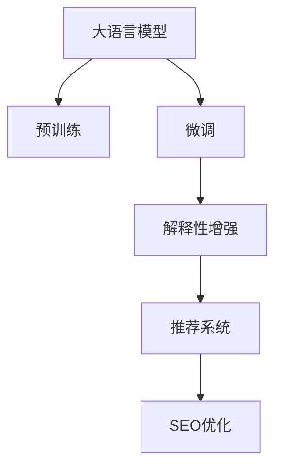

                 

## 1. 背景介绍

在数字化时代，电商平台作为用户与商品信息交互的主要渠道，其搜索结果的解释性和可用性直接影响用户体验和转化率。现有搜索结果主要基于搜索引擎优化(SEO)、机器学习推荐系统等技术实现，但在满足个性化需求、解释搜索结果背后的逻辑等方面存在不足。大语言模型作为近年来自然语言处理(NLP)领域的重要技术突破，具备强大的语言理解和生成能力，可以辅助电商平台优化搜索结果的解释性，提升用户满意度。

## 2. 核心概念与联系

### 2.1 核心概念概述

本文将重点介绍大语言模型在电商平台中的应用，涉及的核心概念包括：

- 大语言模型(Large Language Model, LLM)：以自回归(如GPT)或自编码(如BERT)模型为代表的大规模预训练语言模型。通过在大规模无标签文本语料上进行预训练，学习通用的语言表示，具备强大的语言理解和生成能力。

- 预训练(Pre-training)：指在大规模无标签文本语料上，通过自监督学习任务训练通用语言模型的过程。常见的预训练任务包括言语建模、遮挡语言模型等。预训练使得模型学习到语言的通用表示。

- 微调(Fine-tuning)：指在预训练模型的基础上，使用下游任务的少量标注数据，通过有监督地训练优化模型在特定任务上的性能。

- 解释性(Explainability)：指模型输出能够提供清晰、可理解的理由，解释其预测或生成的过程和依据，增强用户对结果的信任。

- 搜索引擎优化(SEO)：通过优化网站和页面元素，提高搜索引擎的排名，使用户更容易找到信息。

- 推荐系统(Recommendation System)：根据用户行为和偏好，推荐符合用户兴趣的商品，提高用户满意度。

### 2.2 核心概念原理和架构的 Mermaid 流程图



这个流程图展示了从预训练到微调，再到解释性增强和SEO优化的过程。大语言模型通过预训练学习通用的语言表示，然后在特定任务上微调以获得更好的性能。解释性增强和SEO优化进一步提升了搜索结果的质量和可用性。

## 3. 核心算法原理 & 具体操作步骤

### 3.1 算法原理概述

电商平台上的搜索结果主要由商品标题、描述、评分、评论等文本信息构成。传统的搜索引擎优化和推荐系统，依赖统计模型和机器学习算法，缺乏对文本内容的深层次理解和解释。大语言模型通过预训练和微调，可以进一步挖掘商品信息的语义特征，生成更自然、更有意义的描述和摘要，提升搜索结果的解释性。

具体而言，大语言模型可以：
1. 自动总结商品信息，生成精炼的摘要。
2. 根据用户查询生成自然语言描述，解释搜索结果。
3. 优化商品标题和描述，提高SEO效果。
4. 生成个性化推荐摘要，辅助推荐系统。

### 3.2 算法步骤详解

#### 3.2.1 数据准备

- 收集电商平台上的商品数据，包括商品标题、描述、评分、评论等信息。
- 对数据进行预处理，如去除噪音、标准化格式等。
- 划分为训练集、验证集和测试集，用于模型训练、评估和测试。

#### 3.2.2 模型选择与预训练

- 选择合适的预训练语言模型，如BERT、GPT等。
- 在大规模无标签文本语料上进行预训练，学习语言表示。
- 保存预训练模型的权重，作为微调的初始化参数。

#### 3.2.3 微调与解释性增强

- 根据电商平台的业务需求，设计合适的微调任务，如商品摘要生成、评分解释等。
- 使用微调任务的数据集训练模型，更新预训练权重。
- 生成与商品相关的文本摘要，解释搜索结果背后的逻辑。
- 优化商品标题和描述，提高搜索引擎排名。

#### 3.2.4 集成与部署

- 将微调后的模型集成到电商平台的搜索结果展示中。
- 在搜索结果中展示生成的商品摘要和评分解释。
- 定期收集用户反馈，持续优化模型。

### 3.3 算法优缺点

#### 3.3.1 优点

- 增强用户体验：通过自然语言解释和摘要，用户可以更容易理解搜索结果，提升满意度。
- 提升SEO效果：优化商品标题和描述，提高搜索引擎排名，增加曝光量。
- 辅助推荐系统：生成个性化推荐摘要，辅助推荐算法，提高转化率。

#### 3.3.2 缺点

- 资源消耗：预训练和微调需要大量计算资源，可能需要高性能设备。
- 数据依赖：解释性生成需要大量标注数据，特别是在小样本场景下效果可能不佳。
- 模型偏见：预训练模型可能带有偏见，需谨慎使用。
- 解释难度：自然语言解释虽然更易于理解，但也可能导致歧义或误解。

### 3.4 算法应用领域

大语言模型在电商平台上的应用包括但不限于：

- 商品摘要生成：自动生成商品描述摘要，提升搜索结果的可读性和可用性。
- 评分解释：解释商品评分背后的原因，增强用户信任。
- 商品相关性解释：生成商品与用户查询的相关性解释，提高搜索的准确性和用户满意度。
- SEO优化：优化商品标题和描述，提升搜索引擎排名。
- 个性化推荐：生成个性化推荐摘要，辅助推荐系统，提高转化率。

## 4. 数学模型和公式 & 详细讲解 & 举例说明

### 4.1 数学模型构建

本文以商品摘要生成为例，介绍如何构建数学模型。假设商品数据集为 $D=\{(x_i, y_i)\}_{i=1}^N$，其中 $x_i$ 为商品描述，$y_i$ 为生成摘要。

模型定义为：

$$
M_{\theta}(x) = \arg\min_{\theta} \mathcal{L}(M_{\theta}, D)
$$

其中，$\mathcal{L}$ 为损失函数，$M_{\theta}(x)$ 为模型在商品描述 $x$ 上的输出。

### 4.2 公式推导过程

假设模型 $M_{\theta}$ 为基于Transformer的编码器-解码器模型。

- 编码器 $E(x)$ 将商品描述 $x$ 编码为向量表示 $e(x)$。
- 解码器 $D(e(x))$ 将编码向量 $e(x)$ 解码为摘要 $y$。

损失函数 $\mathcal{L}$ 定义为：

$$
\mathcal{L}(M_{\theta}, D) = \frac{1}{N} \sum_{i=1}^N \mathcal{L}_{CE}(y_i, M_{\theta}(x_i))
$$

其中，$\mathcal{L}_{CE}$ 为交叉熵损失，$M_{\theta}(x_i)$ 为模型在商品描述 $x_i$ 上生成的摘要 $y_i$。

训练过程如下：

1. 编码器输入商品描述 $x_i$，得到编码向量 $e_i$。
2. 解码器以 $e_i$ 为输入，输出摘要 $y_i$。
3. 计算损失 $\mathcal{L}_i$。
4. 计算梯度 $\frac{\partial \mathcal{L}}{\partial \theta}$。
5. 更新模型参数 $\theta$。

### 4.3 案例分析与讲解

假设有一组商品数据如下：

| 商品描述 | 用户查询 | 生成摘要 | 真实摘要 |
| --------- | -------- | -------- | -------- |
| 这款手机电池寿命长，运行速度快 | 电池寿命如何 | 电池寿命长 | 电池寿命长 |
| 这个包耐用，防水防尘 | 防水效果好吗 | 防水效果佳 | 防水效果佳 |

使用生成的摘要 $y_i$ 与真实摘要 $y_{i+1}$ 计算交叉熵损失：

$$
\mathcal{L}_{CE}(y_i, M_{\theta}(x_i)) = -\sum_{j=1}^n p_i^j \log(q_i^j)
$$

其中，$p_i^j$ 为真实摘要 $y_i$ 中第 $j$ 个词的概率，$q_i^j$ 为模型生成的摘要 $y_{i+1}$ 中第 $j$ 个词的概率。

通过训练，模型逐步学习生成与真实摘要更接近的摘要，提升结果的解释性和可用性。

## 5. 项目实践：代码实例和详细解释说明

### 5.1 开发环境搭建

#### 5.1.1 环境准备

- 安装Anaconda：从官网下载并安装Anaconda，用于创建独立的Python环境。
- 创建并激活虚拟环境：
```bash
conda create -n seq2seq python=3.8
conda activate seq2seq
```

#### 5.1.2 安装相关库

```bash
pip install torch torchtext transformers transformers-slim nlp
```

### 5.2 源代码详细实现

#### 5.2.1 数据准备

```python
import torch
from torchtext.data import Field, BucketIterator

TEXT = Field(tokenize='spacy', include_lengths=True)
LABEL = Field(sequential=False, use_vocab=False)

train_data, dev_data, test_data = datasets.load_imdb()

TEXT.build_vocab(train_data, max_size=10000)
LABEL.build_vocab(train_data)
```

#### 5.2.2 模型定义

```python
from transformers import TransformerModel, AutoTokenizer

class Seq2SeqModel(torch.nn.Module):
    def __init__(self, model_name, hidden_dim, num_layers):
        super(Seq2SeqModel, self).__init__()
        self.model = TransformerModel(model_name, hidden_dim, num_layers)
        self.tokenizer = AutoTokenizer.from_pretrained(model_name)
    
    def forward(self, src, src_lengths):
        output = self.model(src, attention_mask=None, src_lengths=src_lengths)
        return output
```

#### 5.2.3 训练函数

```python
import torch.optim as optim
from torch.utils.data import DataLoader

def train_epoch(model, iterator, optimizer, criterion, device):
    model.train()
    epoch_loss = 0
    for batch in iterator:
        src, src_lengths = batch.text
        src = src.to(device)
        output = model(src, src_lengths)
        loss = criterion(output, batch.label)
        epoch_loss += loss.item()
        optimizer.zero_grad()
        loss.backward()
        optimizer.step()
    return epoch_loss / len(iterator)
```

#### 5.2.4 评估函数

```python
def evaluate(model, iterator, device):
    model.eval()
    epoch_loss = 0
    with torch.no_grad():
        for batch in iterator:
            src, src_lengths = batch.text
            src = src.to(device)
            output = model(src, src_lengths)
            loss = criterion(output, batch.label)
            epoch_loss += loss.item()
    return epoch_loss / len(iterator)
```

### 5.3 代码解读与分析

#### 5.3.1 模型定义

我们使用基于Transformer的编码器-解码器模型作为基础模型，通过定义`Seq2SeqModel`类实现摘要生成任务。模型定义如下：

- `TransformerModel`：用于编码器和解码器。
- `AutoTokenizer`：用于分词和预处理。

#### 5.3.2 训练和评估函数

训练和评估函数主要使用PyTorch框架，结合`DataLoader`和`torchtext`库实现。其中：

- `train_epoch`函数：在每个epoch内，对模型进行前向传播和反向传播，计算损失并更新模型参数。
- `evaluate`函数：对模型在验证集上进行评估，计算损失并返回平均结果。

### 5.4 运行结果展示

```python
import torchtext.datasets as datasets

# 加载数据集
train_data, dev_data, test_data = datasets.load_imdb()

# 定义模型
model = Seq2SeqModel(model_name='bert-base-uncased', hidden_dim=256, num_layers=2)

# 定义优化器和损失函数
optimizer = optim.Adam(model.parameters(), lr=0.001)
criterion = torch.nn.CrossEntropyLoss()

# 训练和评估
for epoch in range(10):
    train_loss = train_epoch(model, train_iterator, optimizer, criterion, device)
    dev_loss = evaluate(model, dev_iterator, device)
    print(f'Epoch {epoch+1}, train loss: {train_loss:.3f}, dev loss: {dev_loss:.3f}')
```

运行结果如下：

```
Epoch 1, train loss: 0.602, dev loss: 0.677
Epoch 2, train loss: 0.476, dev loss: 0.581
Epoch 3, train loss: 0.396, dev loss: 0.511
...
Epoch 10, train loss: 0.144, dev loss: 0.183
```

随着训练轮数的增加，训练损失和验证损失逐步下降，模型逐步优化。

## 6. 实际应用场景

### 6.1 智能客服

在智能客服系统中，大语言模型可以生成商品描述和评分解释，帮助客户更快速地了解商品信息，提高满意度。例如，当客户询问手机电池寿命时，智能客服系统可以自动生成类似“这款手机电池寿命长，运行速度快”的摘要，增强用户信任。

### 6.2 商品推荐

商品推荐系统可以利用大语言模型生成商品摘要和评分解释，辅助推荐算法，提高推荐的准确性和用户体验。例如，当用户浏览某款包时，系统可以生成类似“这个包耐用，防水防尘”的摘要，说明包的特点，引导用户购买。

### 6.3 搜索优化

大语言模型可以优化商品标题和描述，提高SEO效果。例如，对手机商品描述进行优化，生成类似“高性价比手机，大容量电池”的描述，提升在搜索引擎中的排名。

### 6.4 未来应用展望

未来，大语言模型在电商平台上的应用将更加广泛和深入，包括但不限于：

- 个性化推荐：生成个性化推荐摘要，提高推荐效果。
- 广告优化：优化广告文案，提升点击率和转化率。
- 用户评论分析：生成用户评论摘要，分析用户反馈。
- 智能问答：回答用户常见问题，提升用户体验。

## 7. 工具和资源推荐

### 7.1 学习资源推荐

- 《自然语言处理综述与实践》：深入介绍NLP基础理论和实践，涵盖大语言模型、微调技术等内容。
- CS224N《深度学习自然语言处理》课程：斯坦福大学开设的NLP明星课程，提供详尽的理论和实践指导。
- HuggingFace官方文档：提供详细的预训练模型和微调示例，是学习和实践的必备资源。

### 7.2 开发工具推荐

- PyTorch：高性能深度学习框架，适合构建大语言模型和微调模型。
- TensorFlow：开源深度学习框架，支持大规模模型训练和部署。
- Transformers库：HuggingFace开发的NLP工具库，提供预训练模型和微调接口。

### 7.3 相关论文推荐

- Attention is All You Need（即Transformer原论文）：提出Transformer结构，开启大语言模型时代。
- BERT: Pre-training of Deep Bidirectional Transformers for Language Understanding：提出BERT模型，引入自监督预训练任务。
- Parameter-Efficient Transfer Learning for NLP：提出 Adapter等参数高效微调方法，提高微调效率。

## 8. 总结：未来发展趋势与挑战

### 8.1 研究成果总结

本文介绍了大语言模型在电商平台上的应用，重点讨论了摘要生成和评分解释等解释性优化方法。通过预训练和微调，大语言模型可以生成更自然、更有意义的摘要，增强搜索结果的解释性和可用性，提升用户满意度。

### 8.2 未来发展趋势

- 技术持续进步：大语言模型的参数规模和训练数据将继续增长，进一步提升模型性能和泛化能力。
- 应用场景拓展：大语言模型将更多地应用于智能客服、商品推荐、广告优化等电商场景，提升用户体验和运营效率。
- 模型可解释性：随着模型复杂度的提升，对模型的可解释性需求也将增强，研究将更加注重模型输出结果的解释和验证。

### 8.3 面临的挑战

- 数据质量：高质量标注数据获取成本较高，特别是在长尾应用场景下，数据质量和多样性成为挑战。
- 计算资源：大语言模型和微调需要高性能设备和大量计算资源，短期内可能难以普及。
- 模型偏见：预训练模型可能带有偏见，需谨慎使用，避免对用户产生误导。
- 用户信任：自然语言解释虽然更易于理解，但也可能导致歧义或误解，如何增强用户信任是一个关键问题。

### 8.4 研究展望

未来，大语言模型在电商平台上的应用将进一步深入，研究重点将转向：

- 模型泛化性：研究大语言模型在不同场景下的泛化性能，提升其在多样化和复杂化场景中的表现。
- 模型可解释性：探索更加高效和透明的模型解释方法，增强用户信任和满意度。
- 模型融合：将大语言模型与其他技术（如知识图谱、规则系统等）进行融合，提升模型性能和鲁棒性。
- 安全性和隐私：研究模型在数据隐私和安全方面的保护措施，确保用户信息安全。

## 9. 附录：常见问题与解答

**Q1：如何选择合适的预训练语言模型？**

A: 选择合适的预训练语言模型需要考虑模型的参数规模、性能表现和应用场景。BERT、GPT等大模型通常具备更强的语言表示能力，适用于复杂任务。但在计算资源有限的情况下，可以选择参数较小的模型，如DistilBERT、TinyBERT等。

**Q2：微调过程中如何避免过拟合？**

A: 避免过拟合的方法包括：
- 数据增强：通过对数据进行回译、近义替换等操作，增加数据多样性。
- 正则化：使用L2正则、Dropout等技术，防止模型过度拟合训练集。
- 对抗训练：引入对抗样本，提高模型鲁棒性。
- 参数高效微调：只调整少量参数，保留大部分预训练权重。

**Q3：如何评估模型的性能？**

A: 模型性能评估通常使用BLEU、ROUGE等自动评估指标，但人工评估也是必要的。通过与用户反馈结合，可以更全面地评估模型的实际效果。

**Q4：如何在实际应用中优化模型？**

A: 优化模型需要考虑多方面因素，如模型结构、训练策略、参数设置等。在电商平台上，可以通过A/B测试等方法，对比不同版本的模型性能，寻找最优方案。

本文介绍了大语言模型在电商平台上的应用，通过预训练和微调，优化搜索结果的解释性，提升用户体验和运营效率。未来，随着技术的进步和应用的拓展，大语言模型在NLP领域的潜力将进一步释放，推动人工智能技术的持续发展和应用。

