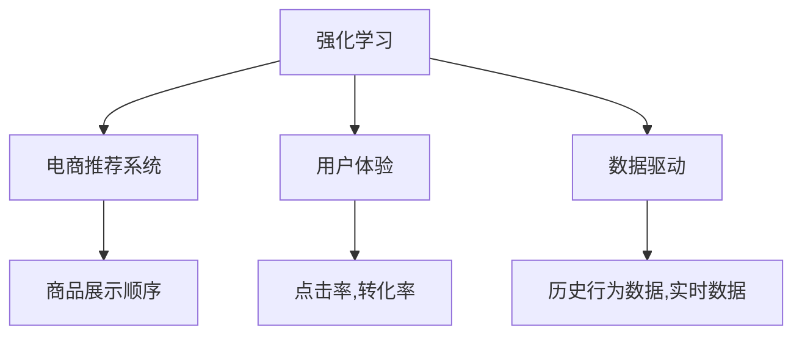

                 

# AI如何优化电商平台的商品展示顺序

> 关键词：自然语言处理(NLP),深度学习,强化学习,电商推荐,用户体验(UX),数据驱动

## 1. 背景介绍

### 1.1 问题由来
在电商平台上，商品展示顺序的优化是一个复杂且重要的任务。合理的展示顺序可以显著提升用户体验和销售转化率。传统的商品展示顺序多基于固定的算法（如基于点击率或购买率的排序算法），未充分考虑用户的个性化需求和行为特征。而人工智能（AI）技术的引入，为电商平台的商品展示优化提供了全新的视角和方法。

### 1.2 问题核心关键点
商品展示顺序优化本质上是一个强化学习问题，旨在通过学习用户行为数据，最大化平台收益（如销售额、点击率等）。这一过程中，需要考虑多维度的因素，包括但不限于用户的历史行为、实时兴趣、个性化偏好、当前环境等因素。

### 1.3 问题研究意义
通过优化商品展示顺序，电商平台可以：
1. 提升用户体验：通过个性化推荐，提供更符合用户兴趣的商品，减少浏览疲劳和流失率。
2. 提高转化率：优化展示顺序可以引导用户点击和购买，直接增加销售额。
3. 降低运营成本：减少无效曝光和点击，提高广告投放效率。
4. 提升用户粘性：个性化推荐增加用户停留时间，提高平台粘性。
5. 促进销售增长：通过精准推荐，带来新的用户和销售机会。

## 2. 核心概念与联系

### 2.1 核心概念概述

为更好地理解AI如何优化电商平台的商品展示顺序，本节将介绍几个密切相关的核心概念：

- 强化学习(Reinforcement Learning)：一种通过智能体在环境中采取行动，获得奖励或惩罚，进而优化策略的学习方法。
- 电商推荐系统(E-commerce Recommendation System)：利用AI技术，根据用户行为和商品属性，推荐可能感兴趣的商品的系统。
- 用户体验(User Experience, UX)：用户在使用产品或服务过程中产生的体验和满意度，直接影响到用户的留存率和忠诚度。
- 数据驱动(Data-Driven)：基于大量数据进行决策，而非主观经验，是AI优化的重要基础。

这些核心概念之间的逻辑关系可以通过以下Mermaid流程图来展示：



这个流程图展示出这些核心概念的相互关系：

1. 强化学习用于训练推荐系统，优化商品展示顺序。
2. 电商推荐系统实现基于展示顺序的个性化推荐。
3. 用户体验评价推荐系统的推荐效果。
4. 数据驱动为模型训练和优化提供数据支撑。

## 3. 核心算法原理 & 具体操作步骤
### 3.1 算法原理概述

AI优化电商平台的商品展示顺序，主要是通过强化学习框架，学习用户行为数据，最大化用户满意度（如点击率、购买率）和平台收益（如销售额）。

### 3.2 算法步骤详解

**Step 1: 收集用户行为数据**
- 定义用户行为特征，包括但不限于：浏览历史、点击行为、购买记录、评价评分等。
- 收集这些数据，存储在数据仓库中。

**Step 2: 构建强化学习模型**
- 定义状态(state)：用户在平台上的浏览和行为状态。
- 定义动作(actions)：平台可展示的商品列表顺序。
- 定义奖励(rewards)：用户点击、购买、评价等行为产生的收益或损失。
- 定义状态转移概率(transitions)：用户在不同状态之间转移的概率。
- 定义学习目标：最大化预期奖励（即用户的点击和购买行为）。

**Step 3: 训练强化学习模型**
- 使用Q-learning或深度Q网络(DQN)等算法，训练模型学习最优策略。
- 采用经验回放、目标网络、优先经验回放等技术优化训练过程。
- 选择合适的超参数，如学习率、网络结构、探索率等。

**Step 4: 评估和部署**
- 使用A/B测试等方法评估推荐模型的效果。
- 部署优化后的商品展示顺序模型，实时调整商品展示顺序。
- 持续收集新数据，重新训练模型以适应用户行为变化。

### 3.3 算法优缺点

AI优化商品展示顺序具有以下优点：
1. 自适应性强：能够根据用户实时行为和兴趣动态调整展示顺序。
2. 用户体验提升：通过个性化推荐，增加用户粘性，提升点击率和购买率。
3. 运营效率提高：优化展示顺序能够减少无效曝光和点击，提高广告投放效率。
4. 数据驱动决策：基于大量历史和实时数据进行决策，提升决策的准确性和科学性。

同时，该方法也存在一些局限性：
1. 数据需求高：需要大规模的历史和实时数据进行训练。
2. 模型复杂度：深度学习模型训练复杂，计算资源消耗较大。
3. 用户隐私问题：个性化推荐需要收集大量用户行为数据，可能引发隐私问题。
4. 动态平衡：如何在探索和利用之间平衡，需要设计合理的策略。
5. 模型解释性：深度学习模型通常缺乏解释性，难以调试和优化。

尽管存在这些局限性，AI优化商品展示顺序仍为电商平台带来了显著的用户体验提升和销售增长，成为电商平台优化策略的重要方向。

### 3.4 算法应用领域

AI优化商品展示顺序在电商平台的实际应用中，具有广泛的应用场景，例如：

- 个性化推荐：根据用户的历史行为和实时兴趣，推荐可能感兴趣的商品，提升点击率和购买率。
- 搜索排序：优化搜索结果的排序，提升用户的浏览体验和满意度。
- 广告投放：优化广告展示顺序，提高广告点击率和转化率。
- 商品召回：根据用户历史行为和实时查询，推荐相关商品，增加销售机会。
- 多模态推荐：结合用户浏览历史、评价评分、图片特征等数据，提供更全面和精准的推荐。
- 动态定价：根据用户行为和市场供需，实时调整商品价格，提升收益。

此外，AI优化展示顺序的方法也被广泛应用于智能客服、金融风控、医疗推荐等众多领域，推动了各行各业数字化转型的进程。

## 4. 数学模型和公式 & 详细讲解 & 举例说明

### 4.1 数学模型构建

假设电商平台有 $N$ 种商品，用户的当前状态为 $s_t$，商品展示顺序为 $a_t$。状态 $s_t$ 表示用户当前在浏览商品 $i$ 的展示顺序上，用户的实时兴趣为 $r_t$，点击率为 $c_t$，购买率为 $p_t$，实际购买商品为 $i_t$，预期购买商品为 $\hat{i}_t$。奖励函数定义为 $r_t = \lambda_i (c_t + p_t) - \lambda_i c_t p_t$，其中 $\lambda_i$ 为商品 $i$ 的权值。

模型的目标是最大化预期收益 $J$，即：

$$
J = \sum_{t=1}^{\infty} \gamma^t r_t
$$

其中 $\gamma$ 为折扣因子。

### 4.2 公式推导过程

为了最大化预期收益，我们需要求解最优策略 $\pi^*$，即在给定状态下，选择最佳动作的概率。Q-learning算法的核心是更新动作-状态值函数 $Q(s_t,a_t)$：

$$
Q(s_t,a_t) \leftarrow Q(s_t,a_t) + \alpha (r_t + \gamma \max_{a'} Q(s_{t+1},a') - Q(s_t,a_t))
$$

其中 $\alpha$ 为学习率。在DQN中，我们将 $Q$ 值函数的参数化表示为神经网络，并通过反向传播算法更新模型参数。具体步骤包括：

1. 随机采样一批状态-动作对 $(s_t, a_t)$。
2. 对每个 $(s_t, a_t)$ 计算 $Q(s_t,a_t)$。
3. 对每个 $s_{t+1}$ 计算 $\max_{a'} Q(s_{t+1},a')$。
4. 更新神经网络参数。

### 4.3 案例分析与讲解

假设我们有一个电商平台，收集了用户的历史行为数据和当前浏览行为，使用DQN算法进行商品展示顺序优化。模型训练过程中，每个时刻随机选择一个商品展示顺序，根据用户的点击和购买行为计算奖励，更新网络参数。

1. 模型输入：用户的历史浏览记录、当前浏览的商品列表、用户实时兴趣等。
2. 模型输出：每个展示顺序的动作值。
3. 奖励计算：用户点击和购买的加权收益。
4. 网络更新：使用经验回放、目标网络等技术优化模型。
5. 评估与部署：在测试集上评估模型效果，部署到实际平台上实时调整展示顺序。

## 5. 项目实践：代码实例和详细解释说明

### 5.1 开发环境搭建

在进行商品展示顺序优化实践前，我们需要准备好开发环境。以下是使用Python进行TensorFlow开发的环境配置流程：

1. 安装Anaconda：从官网下载并安装Anaconda，用于创建独立的Python环境。

2. 创建并激活虚拟环境：
```bash
conda create -n tf-env python=3.8 
conda activate tf-env
```

3. 安装TensorFlow：从官网获取对应的安装命令。例如：
```bash
pip install tensorflow tensorflow-addons
```

4. 安装TensorBoard：
```bash
pip install tensorboard
```

5. 安装TensorFlow Addons：
```bash
pip install tensorboard
```

6. 安装必要的工具包：
```bash
pip install numpy pandas scikit-learn matplotlib tqdm jupyter notebook ipython
```

完成上述步骤后，即可在`tf-env`环境中开始商品展示顺序优化的实践。

### 5.2 源代码详细实现

以下是一个基于TensorFlow的DQN模型实现，用于优化电商平台的商品展示顺序。

```python
import tensorflow as tf
import numpy as np
import random
from tensorflow.keras.models import Sequential
from tensorflow.keras.layers import Dense, Flatten, Conv2D
from tensorflow.keras.optimizers import Adam
from tensorflow.keras.callbacks import ModelCheckpoint

class DQNAgent:
    def __init__(self, state_size, action_size):
        self.state_size = state_size
        self.action_size = action_size
        self.memory = []
        self.gamma = 0.95  # 折扣因子
        self.epsilon = 1.0  # 探索率
        self.epsilon_min = 0.01
        self.epsilon_decay = 0.995
        self.learning_rate = 0.001
        self.model = self._build_model()

    def _build_model(self):
        model = Sequential()
        model.add(Flatten(input_shape=(self.state_size,)))
        model.add(Dense(24, activation='relu'))
        model.add(Dense(self.action_size, activation='linear'))
        model.compile(loss='mse', optimizer=Adam(lr=self.learning_rate))
        return model

    def remember(self, state, action, reward, next_state, done):
        self.memory.append((state, action, reward, next_state, done))

    def act(self, state):
        if np.random.rand() <= self.epsilon:
            return random.randrange(self.action_size)
        act_values = self.model.predict(state)
        return np.argmax(act_values[0])

    def replay(self, batch_size):
        minibatch = random.sample(self.memory, batch_size)
        for state, action, reward, next_state, done in minibatch:
            target = reward
            if not done:
                target = (reward + self.gamma * np.amax(self.model.predict(next_state)[0]))
            target_f = self.model.predict(state)
            target_f[0][action] = target
            self.model.fit(state, target_f, epochs=1, verbose=0)
        if self.epsilon > self.epsilon_min:
            self.epsilon *= self.epsilon_decay

    def load(self, name):
        self.model.load_weights(name)

    def save(self, name):
        self.model.save_weights(name)
```

在实际应用中，还需要对模型进行一些扩展和调整，例如：

- 数据预处理：将用户行为数据转化为模型可接受的格式。
- 状态设计：定义适合电商平台的商品展示顺序表示。
- 奖励设计：设计适合电商平台的奖励函数。
- 训练控制：设定训练轮数、批量大小等训练参数。
- 探索与利用：通过设置探索率，平衡探索新行为和利用已有经验。

### 5.3 代码解读与分析

**DQNAgent类**：
- `__init__`方法：初始化模型参数，如状态大小、动作空间、折扣因子、学习率等。
- `_build_model`方法：定义DQN模型结构，包括输入层、隐藏层和输出层。
- `remember`方法：记录用户的浏览行为数据。
- `act`方法：根据当前状态，选择动作（展示顺序），采用ε-贪心策略。
- `replay`方法：从记忆中随机抽取一批数据，训练模型。
- `load`和`save`方法：加载和保存模型权重。

**实际应用**：
- 首先需要对用户行为数据进行预处理，将其转化为模型可接受的输入格式。
- 设计状态表示，如用户浏览的商品列表、用户历史浏览行为等。
- 设计奖励函数，根据用户的点击和购买行为计算奖励。
- 在训练过程中，合理设置探索率和利用率，平衡模型探索新行为和利用已有经验。
- 使用TensorBoard可视化训练过程，评估模型效果。

## 6. 实际应用场景

### 6.1 电商推荐系统

AI优化商品展示顺序在电商推荐系统中的应用非常广泛，例如：

- 个性化推荐：根据用户的历史行为和实时兴趣，推荐可能感兴趣的商品，提升点击率和购买率。
- 商品排序：优化搜索结果的排序，提升用户的浏览体验和满意度。
- 广告投放：优化广告展示顺序，提高广告点击率和转化率。
- 商品召回：根据用户历史行为和实时查询，推荐相关商品，增加销售机会。
- 多模态推荐：结合用户浏览历史、评价评分、图片特征等数据，提供更全面和精准的推荐。
- 动态定价：根据用户行为和市场供需，实时调整商品价格，提升收益。

### 6.2 金融风险控制

AI优化商品展示顺序的方法在金融风险控制中也有广泛应用，例如：

- 风险预测：基于用户的历史交易行为，预测其潜在风险。
- 交易推荐：推荐低风险的交易产品，降低用户风险。
- 投资组合优化：根据用户风险偏好和市场情况，优化投资组合。
- 信用评估：基于用户的消费行为，评估其信用风险。

### 6.3 医疗推荐系统

AI优化商品展示顺序的方法在医疗推荐系统中的应用也日益广泛，例如：

- 疾病诊断：基于患者的症状和历史记录，推荐可能的疾病诊断。
- 治疗方案推荐：根据患者的历史治疗记录，推荐合适的治疗方案。
- 药品推荐：基于患者的疾病信息，推荐适合的药品。
- 健康管理：根据患者的行为数据，推荐健康管理方案。

## 7. 工具和资源推荐

### 7.1 学习资源推荐

为了帮助开发者系统掌握AI优化电商平台的商品展示顺序的理论基础和实践技巧，这里推荐一些优质的学习资源：

1. 《强化学习》系列书籍：深入浅出地介绍了强化学习的理论基础和实际应用，是理解AI优化商品展示顺序的核心。
2. 《深度学习》系列书籍：全面介绍了深度学习的理论框架和实践技巧，为电商推荐系统提供了技术支持。
3. 《自然语言处理》系列书籍：介绍了自然语言处理的基本概念和前沿技术，为电商推荐系统的数据处理提供了方法。
4. 《TensorFlow官方文档》：提供了TensorFlow的详细API和使用指南，是实现AI优化展示顺序的关键工具。
5. 《TensorBoard官方文档》：介绍了TensorBoard的使用方法和可视化技巧，有助于调试和优化模型。

通过对这些资源的学习实践，相信你一定能够快速掌握AI优化电商平台的商品展示顺序的精髓，并用于解决实际的电商推荐问题。

### 7.2 开发工具推荐

高效的开发离不开优秀的工具支持。以下是几款用于AI优化商品展示顺序开发的常用工具：

1. TensorFlow：基于Python的开源深度学习框架，灵活动态的计算图，适合快速迭代研究。
2. Keras：基于TensorFlow的高级API，提供了丰富的模型构建和训练工具。
3. PyTorch：基于Python的开源深度学习框架，动态计算图，适合动态模型和算法开发。
4. Scikit-learn：Python机器学习库，提供了简单易用的模型训练和评估工具。
5. Weights & Biases：模型训练的实验跟踪工具，可以记录和可视化模型训练过程中的各项指标，方便对比和调优。
6. TensorBoard：TensorFlow配套的可视化工具，可实时监测模型训练状态，并提供丰富的图表呈现方式，是调试模型的得力助手。

合理利用这些工具，可以显著提升AI优化展示顺序任务的开发效率，加快创新迭代的步伐。

### 7.3 相关论文推荐

AI优化商品展示顺序的发展源于学界的持续研究。以下是几篇奠基性的相关论文，推荐阅读：

1. Q-learning：由Watkins在1989年提出，是最早的强化学习算法之一，奠定了强化学习的基础。
2. Deep Q-Networks：由Mnih等人在2015年提出，通过深度神经网络优化Q-learning算法，提升了算法的稳定性和效率。
3. Prioritized Experience Replay：由Schaul等人在2016年提出，通过优先经验回放技术，提高了训练效率和效果。
4. Dueling DQN：由Wang等人在2016年提出，通过双Q网络结构，提升了模型的稳定性和精度。
5. Rainbow DQN：由Hessel等人在2018年提出，结合了经验回放、优先经验回放、重要性采样等技术，提升了算法的性能。

这些论文代表了大语言模型微调技术的发展脉络。通过学习这些前沿成果，可以帮助研究者把握学科前进方向，激发更多的创新灵感。

## 8. 总结：未来发展趋势与挑战

### 8.1 总结

本文对AI如何优化电商平台的商品展示顺序进行了全面系统的介绍。首先阐述了商品展示顺序优化在电商平台中的重要性，明确了AI优化商品展示顺序在提升用户体验和销售转化率方面的独特价值。其次，从原理到实践，详细讲解了强化学习框架下的商品展示顺序优化方法，给出了完整的代码实例。同时，本文还广泛探讨了AI优化商品展示顺序在电商推荐、金融风控、医疗推荐等多个领域的应用前景，展示了其广泛的应用价值。

通过本文的系统梳理，可以看到，AI优化商品展示顺序方法在电商平台中具有广阔的应用前景，能够显著提升用户满意度和平台收益。未来，伴随AI技术和数据的持续发展，商品展示顺序优化将更具智能化和个性化，为电商平台带来更多的创新可能。

### 8.2 未来发展趋势

展望未来，AI优化商品展示顺序技术将呈现以下几个发展趋势：

1. 多模态融合：结合用户浏览历史、评价评分、图片特征等数据，提供更全面和精准的推荐。
2. 个性化推荐：通过深度学习模型，实现基于用户行为的精准推荐，提升用户体验。
3. 实时优化：利用流式数据处理技术，实时调整商品展示顺序，提升用户满意度和平台收益。
4. 社交网络效应：基于用户的社交关系和行为数据，优化推荐策略，提升推荐效果。
5. 跨平台协同：通过跨平台数据共享和协同推荐，提升整体推荐效果。
6. 动态定价：根据市场供需和用户行为，实时调整商品价格，优化收益。

这些趋势凸显了AI优化展示顺序技术的广阔前景。这些方向的探索发展，必将进一步提升电商平台的用户体验和销售转化率，为电商行业的数字化转型提供新的动力。

### 8.3 面临的挑战

尽管AI优化商品展示顺序技术已经取得了瞩目成就，但在迈向更加智能化、普适化应用的过程中，它仍面临着诸多挑战：

1. 数据需求高：需要大规模的历史和实时数据进行训练，数据收集和管理成本较高。
2. 模型复杂度：深度学习模型训练复杂，计算资源消耗较大，需要高性能硬件支持。
3. 用户隐私问题：个性化推荐需要收集大量用户行为数据，可能引发隐私问题，需要合理设计和保护用户数据。
4. 动态平衡：需要在探索新行为和利用已有经验之间找到平衡，避免过拟合和欠拟合。
5. 模型解释性：深度学习模型通常缺乏解释性，难以调试和优化，需要更多的可解释性技术支持。
6. 跨平台协同：跨平台数据共享和协同推荐需要解决数据格式、数据质量等问题，需要多平台协同设计。

尽管存在这些挑战，AI优化商品展示顺序技术仍为电商平台带来了显著的用户体验提升和销售增长，成为电商平台优化策略的重要方向。相信随着学界和产业界的共同努力，这些挑战终将一一被克服，AI优化展示顺序必将在构建人机协同的智能时代中扮演越来越重要的角色。

### 8.4 研究展望

面对AI优化商品展示顺序所面临的种种挑战，未来的研究需要在以下几个方面寻求新的突破：

1. 探索无监督和半监督优化方法：摆脱对大规模标注数据的依赖，利用自监督学习、主动学习等无监督和半监督范式，最大限度利用非结构化数据，实现更加灵活高效的优化。
2. 研究参数高效优化方法：开发更加参数高效的优化方法，在固定大部分预训练参数的情况下，只更新极少量的任务相关参数。
3. 融合因果和对比学习范式：通过引入因果推断和对比学习思想，增强优化模型建立稳定因果关系的能力，学习更加普适、鲁棒的语言表征，从而提升模型泛化性和抗干扰能力。
4. 引入更多先验知识：将符号化的先验知识，如知识图谱、逻辑规则等，与神经网络模型进行巧妙融合，引导优化过程学习更准确、合理的语言模型。
5. 结合因果分析和博弈论工具：将因果分析方法引入优化模型，识别出模型决策的关键特征，增强输出解释的因果性和逻辑性。借助博弈论工具刻画人机交互过程，主动探索并规避模型的脆弱点，提高系统稳定性。
6. 纳入伦理道德约束：在模型训练目标中引入伦理导向的评估指标，过滤和惩罚有偏见、有害的输出倾向。同时加强人工干预和审核，建立模型行为的监管机制，确保输出符合人类价值观和伦理道德。

这些研究方向的探索，必将引领AI优化展示顺序技术迈向更高的台阶，为构建安全、可靠、可解释、可控的智能系统铺平道路。面向未来，AI优化展示顺序技术还需要与其他人工智能技术进行更深入的融合，如知识表示、因果推理、强化学习等，多路径协同发力，共同推动自然语言理解和智能交互系统的进步。只有勇于创新、敢于突破，才能不断拓展语言模型的边界，让智能技术更好地造福人类社会。

## 9. 附录：常见问题与解答

**Q1: AI优化商品展示顺序的原理是什么？**

A: AI优化商品展示顺序的原理基于强化学习框架，通过学习用户行为数据，最大化用户满意度和平台收益。模型通过观察用户的点击、购买等行为，更新展示顺序策略，以提升用户体验和平台收益。

**Q2: 如何选择合适的超参数？**

A: 超参数的选择需要结合具体任务和数据特点。常见的超参数包括学习率、折扣因子、探索率等。可以通过网格搜索、随机搜索、贝叶斯优化等方法进行超参数调优。

**Q3: 如何平衡探索和利用？**

A: 在优化过程中，需要在探索新行为和利用已有经验之间找到平衡。可以通过设置探索率（如ε-贪心策略）和利用率（如优先经验回放），合理控制探索和利用的比例。

**Q4: 如何处理冷启动问题？**

A: 冷启动问题指的是模型在新用户或新商品面前无法有效推荐。可以通过预训练模型、迁移学习、零样本学习等方法，利用已有知识和新数据进行快速优化。

**Q5: 如何确保模型的可解释性？**

A: 在深度学习模型中，模型的可解释性是一个重要问题。可以通过模型可视化、特征重要性分析、因果推断等方法，提升模型的可解释性，便于调试和优化。

综上所述，AI优化商品展示顺序方法在电商平台中具有广阔的应用前景，能够显著提升用户满意度和平台收益。通过深入理解其原理和算法，合理选择超参数，处理冷启动和可解释性问题，可以更好地应用于实际电商推荐系统中，为用户带来更好的购物体验。

