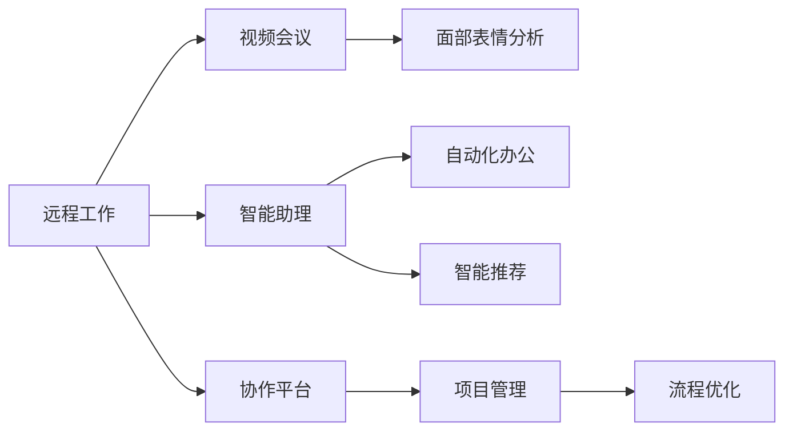

                 

# AI如何促进远程工作和协作

在当前全球化与信息化不断加速的背景下，远程工作（Remote Work）和团队协作（Team Collaboration）已成为许多企业和组织的核心工作模式。AI（人工智能）技术的进步，为远程工作和协作带来了前所未有的便利和效率提升，正在重新定义未来的工作方式。本文将深入探讨AI在促进远程工作和协作中的具体应用，分析其原理与操作步骤，评估其优缺点，并展望其未来发展趋势与挑战。

## 1. 背景介绍

### 1.1 问题由来

新冠疫情的全球爆发，使得远程工作成为一种现实需求。传统面对面办公模式受到挑战，企业与个人需要寻找新的沟通和协作方式。AI技术的发展，特别是自然语言处理（NLP）、计算机视觉（CV）和机器学习（ML）等领域的突破，提供了强有力的技术支撑，使得远程工作和协作变得更加高效和智能。

### 1.2 问题核心关键点

远程工作和协作的核心在于高效的沟通与协作工具的使用。AI技术的应用，可以实现以下几个关键点：

1. **自动化办公流程**：通过AI自动化工具，减少人工操作，提高工作效率。
2. **智能推荐与信息检索**：利用AI推荐系统，提供个性化的工作推荐和信息检索服务。
3. **智能助理与聊天机器人**：提供即时沟通和问题解答服务，减轻人工压力。
4. **视频会议与面部表情分析**：通过面部表情和语调分析，增强视频会议的互动性和情感交流。
5. **协作平台与项目管理**：利用AI优化团队协作平台，提高项目管理效率。

### 1.3 问题研究意义

远程工作与协作的发展，有助于企业提高灵活性和效率，降低办公成本，同时也促进了全球人才流动和知识共享。AI技术的应用，可以进一步提升远程工作和协作的智能化水平，推动全球职场的数字化转型。

## 2. 核心概念与联系

### 2.1 核心概念概述

在探讨AI如何促进远程工作和协作时，需要关注以下核心概念：

- **远程工作（Remote Work）**：指通过互联网等通讯技术，在家中或任何地方进行工作的模式。
- **协作平台（Collaboration Platform）**：如Slack、Microsoft Teams等，提供团队沟通和文件共享的工具。
- **视频会议（Video Conference）**：如Zoom、Google Meet等，提供高清音频和视频通话功能。
- **智能助理（Smart Assistant）**：如GPT-3、ChatGPT等，提供自动化办公、智能推荐等功能。
- **自然语言处理（Natural Language Processing, NLP）**：指计算机处理人类语言的技术。
- **计算机视觉（Computer Vision）**：指计算机理解和处理视觉信息的技术。

这些概念之间的逻辑关系可以通过以下Mermaid流程图来展示：



### 2.2 核心概念原理和架构

AI在促进远程工作和协作中的关键技术主要包括自然语言处理（NLP）和计算机视觉（CV）：

- **NLP**：通过语言模型和预训练技术，使计算机能够理解和生成自然语言，支持文本分类、信息检索、问答系统等功能。
- **CV**：通过图像识别和深度学习技术，使计算机能够理解和处理视觉信息，支持面部表情识别、手势识别等功能。

## 3. 核心算法原理 & 具体操作步骤

### 3.1 算法原理概述

AI促进远程工作和协作的核心算法包括以下几个方面：

1. **自然语言处理（NLP）**：通过语言模型和预训练技术，使计算机能够理解和生成自然语言，支持文本分类、信息检索、问答系统等功能。
2. **计算机视觉（CV）**：通过图像识别和深度学习技术，使计算机能够理解和处理视觉信息，支持面部表情识别、手势识别等功能。
3. **推荐系统（Recommendation System）**：通过协同过滤和基于内容的推荐算法，为用户推荐个性化的工作内容。
4. **自然语言生成（NLG）**：通过生成对抗网络（GAN）和神经机器翻译（NMT）等技术，生成高质量的文本内容。
5. **智能调度（Smart Scheduling）**：通过优化算法和AI算法，自动安排会议和任务，提高日程管理效率。

### 3.2 算法步骤详解

AI促进远程工作和协作的步骤一般包括以下几个关键步骤：

**Step 1: 准备数据与模型**

- 收集远程工作与协作相关的数据，包括工作日志、会议记录、邮件等。
- 选择合适的预训练模型，如BERT、GPT等，作为初始化参数。
- 准备标注数据，用于模型的监督学习。

**Step 2: 设计任务与适配层**

- 根据具体需求，设计适合的NLP和CV任务，如情感分析、信息检索、面部表情识别等。
- 设计任务适配层，将预训练模型与具体任务进行适配，调整输出层和损失函数。

**Step 3: 训练与优化**

- 在准备好的数据集上，使用训练算法训练模型。
- 使用正则化技术，如L2正则、Dropout等，防止模型过拟合。
- 定期评估模型性能，使用交叉验证等方法进行模型调优。

**Step 4: 部署与集成**

- 将训练好的模型部署到生产环境中，集成到协作平台或视频会议系统中。
- 提供API接口，支持自动化办公和智能推荐等功能。

### 3.3 算法优缺点

AI在促进远程工作和协作中的优点包括：

1. **提高效率**：自动化办公流程和智能推荐，大大提高了工作效率。
2. **增强沟通**：通过面部表情分析和语音识别，增强视频会议的互动性和情感交流。
3. **降低成本**：减少传统办公场所的租金和设备投入，提高资源利用率。

其缺点主要包括：

1. **数据隐私问题**：大量数据的收集和处理，可能带来隐私和安全性问题。
2. **技术门槛高**：需要较强的技术背景和资源投入，对中小企业不友好。
3. **依赖网络环境**：需要稳定的网络环境，无法解决断网问题。

### 3.4 算法应用领域

AI在促进远程工作和协作中的应用领域包括：

1. **自动化办公**：通过AI工具自动化处理日常办公任务，如邮件分类、会议安排等。
2. **智能推荐系统**：根据用户的行为和偏好，推荐个性化的工作内容和工具。
3. **视频会议增强**：通过面部表情分析和语音识别，提高视频会议的互动性和效率。
4. **协作平台优化**：利用AI技术优化协作平台，提高团队协作效率。

## 4. 数学模型和公式 & 详细讲解 & 举例说明

### 4.1 数学模型构建

AI促进远程工作和协作的数学模型主要基于自然语言处理和计算机视觉技术。以下是NLP和CV模型的一般构建过程：

- **NLP模型**：基于Transformer架构，包括自注意力机制和位置编码。假设输入为 $x$，输出为 $y$，模型参数为 $\theta$。模型的训练目标为最小化损失函数 $L(x,y,\theta)$，通常使用交叉熵损失或序列到序列的损失函数。
- **CV模型**：基于卷积神经网络（CNN）和循环神经网络（RNN），用于图像识别和面部表情分析。模型参数同样为 $\theta$，训练目标同样为最小化损失函数 $L(x,y,\theta)$，通常使用分类交叉熵损失。

### 4.2 公式推导过程

**NLP模型的损失函数推导**：

设输入序列为 $x=(x_1,x_2,\dots,x_n)$，输出序列为 $y=(y_1,y_2,\dots,y_n)$，其中 $y_i$ 为 $x_i$ 的标签。假设模型参数为 $\theta$，模型输出为 $y_i'$。则NLP模型的损失函数为：

$$
L(x,y,\theta) = -\frac{1}{n} \sum_{i=1}^n [y_i\log y_i' + (1-y_i)\log(1-y_i')]
$$

**CV模型的损失函数推导**：

设输入图像为 $x$，输出标签为 $y$。假设模型参数为 $\theta$，模型输出为 $y'$。则CV模型的损失函数为：

$$
L(x,y,\theta) = -\sum_{i=1}^m \sum_{j=1}^c y_{ij}\log y'_{ij}
$$

其中 $m$ 为图像数，$c$ 为类别数。

### 4.3 案例分析与讲解

以面部表情分析为例，利用CNN和RNN模型，对视频会议中参与者的面部表情进行识别。假设输入为 $x$，输出为 $y$，模型参数为 $\theta$。模型的训练目标为最小化损失函数 $L(x,y,\theta)$。具体步骤如下：

1. **数据准备**：收集视频会议参与者的面部表情图像，并标注表情类别。
2. **模型构建**：使用CNN提取图像特征，再通过RNN捕捉时间序列信息。
3. **模型训练**：在标注数据上训练模型，最小化损失函数。
4. **模型评估**：在测试数据上评估模型性能，使用准确率、召回率等指标。

## 5. 项目实践：代码实例和详细解释说明

### 5.1 开发环境搭建

在进行AI促进远程工作和协作的开发时，需要搭建适合的环境：

1. **安装Python**：在开发机器上安装Python 3.8及以上版本。
2. **安装TensorFlow和PyTorch**：使用pip安装TensorFlow和PyTorch，支持深度学习模型的训练和推理。
3. **安装OpenCV和Matplotlib**：用于计算机视觉相关的图像处理和可视化。
4. **安装Keras**：用于快速搭建和训练深度学习模型。

### 5.2 源代码详细实现

以下是一个简单的面部表情识别项目的代码实现：

```python
import tensorflow as tf
from tensorflow.keras import layers
from tensorflow.keras.preprocessing.image import ImageDataGenerator
from tensorflow.keras.callbacks import ModelCheckpoint
from tensorflow.keras.applications import MobileNetV2
from tensorflow.keras.models import Model

# 加载预训练的MobileNetV2模型
base_model = MobileNetV2(input_shape=(224, 224, 3), include_top=False, weights='imagenet')

# 添加自定义的面部表情分类器
x = base_model.output
x = layers.GlobalAveragePooling2D()(x)
x = layers.Dense(128, activation='relu')(x)
predictions = layers.Dense(7, activation='softmax')(x)

# 构建模型
model = Model(inputs=base_model.input, outputs=predictions)

# 冻结预训练的权重
for layer in base_model.layers:
    layer.trainable = False

# 编译模型
model.compile(optimizer=tf.keras.optimizers.Adam(), loss='categorical_crossentropy', metrics=['accuracy'])

# 准备数据
train_datagen = ImageDataGenerator(rescale=1./255, shear_range=0.2, zoom_range=0.2, horizontal_flip=True)
test_datagen = ImageDataGenerator(rescale=1./255)
train_generator = train_datagen.flow_from_directory('train', target_size=(224, 224), batch_size=32, class_mode='categorical')
test_generator = test_datagen.flow_from_directory('test', target_size=(224, 224), batch_size=32, class_mode='categorical')

# 训练模型
model.fit(train_generator, epochs=10, validation_data=test_generator, callbacks=[ModelCheckpoint('model.h5', save_best_only=True)])

# 加载模型进行预测
model.load_weights('model.h5')
predictions = model.predict(test_generator)
```

### 5.3 代码解读与分析

**数据准备**：
- `ImageDataGenerator`：用于图像预处理，包括缩放、旋转、翻转等操作。
- `flow_from_directory`：用于从文件夹中读取图像数据，并进行批处理。

**模型构建**：
- `MobileNetV2`：加载预训练的MobileNetV2模型，用于提取特征。
- `GlobalAveragePooling2D`：全局平均池化层，用于将特征图压缩成固定长度的向量。
- `Dense`：全连接层，用于分类。

**模型训练**：
- `Adam`：使用Adam优化器进行模型训练。
- `categorical_crossentropy`：使用分类交叉熵损失函数。

**模型评估**：
- `ModelCheckpoint`：保存训练过程中性能最好的模型权重。

**模型预测**：
- `predict`：使用模型进行预测，返回预测结果。

## 6. 实际应用场景

### 6.1 视频会议增强

AI可以通过面部表情分析和语音识别，提高视频会议的互动性和情感交流。具体应用包括：

1. **表情识别**：在视频会议中，实时识别参与者的面部表情，分析情绪状态。
2. **语音识别**：识别会议参与者的语音，自动生成会议记录，提高会议效率。
3. **情感分析**：分析参与者的情感倾向，提供情感反馈，优化会议氛围。

### 6.2 自动化办公

AI可以自动化处理日常办公任务，提高工作效率。具体应用包括：

1. **邮件分类**：自动分类和归档邮件，减少人工操作。
2. **日程管理**：自动安排会议和任务，优化日程安排。
3. **文档生成**：利用自然语言生成技术，自动生成报告和摘要。

### 6.3 协作平台优化

AI可以优化协作平台，提高团队协作效率。具体应用包括：

1. **智能推荐**：根据用户的行为和偏好，推荐个性化的工作内容和工具。
2. **文件共享**：自动分类和标注文件，提高文件检索效率。
3. **任务分配**：自动分配任务，优化团队协作。

## 7. 工具和资源推荐

### 7.1 学习资源推荐

以下是几个推荐的AI促进远程工作和协作的学习资源：

1. **《深度学习》（Goodfellow et al.）**：深度学习领域的经典教材，涵盖了机器学习、深度学习的基本概念和算法。
2. **《自然语言处理综论》（ Jurafsky and Martin）**：自然语言处理领域的经典教材，详细介绍了NLP的技术和应用。
3. **《计算机视觉：模型、学习和推理》（Hinton and Salakhutdinov）**：计算机视觉领域的经典教材，介绍了CV的基本概念和算法。
4. **Kaggle竞赛**：Kaggle是一个数据科学竞赛平台，提供大量的AI应用案例和数据集，适合学习和实践。
5. **DeepLearning.AI Coursera课程**：由Andrew Ng教授主讲的深度学习课程，涵盖深度学习的基本概念和应用。

### 7.2 开发工具推荐

以下是几个推荐的AI促进远程工作和协作的开发工具：

1. **Jupyter Notebook**：用于编写和运行Python代码，支持交互式编程和数据可视化。
2. **TensorFlow**：由Google开发的深度学习框架，支持分布式训练和部署。
3. **PyTorch**：由Facebook开发的深度学习框架，支持动态图和静态图，易于使用。
4. **Keras**：高级深度学习框架，提供简单易用的API，适合快速搭建模型。
5. **OpenCV**：计算机视觉库，支持图像处理和分析。

### 7.3 相关论文推荐

以下是几篇推荐的相关论文：

1. **Attention is All You Need**：Transformer的开创性论文，提出了自注意力机制，开启了NLP预训练大模型时代。
2. **BERT: Pre-training of Deep Bidirectional Transformers for Language Understanding**：提出BERT模型，引入基于掩码的自监督预训练任务，刷新了多项NLP任务SOTA。
3. **Language Models are Unsupervised Multitask Learners**：展示了大规模语言模型的强大zero-shot学习能力，引发了对于通用人工智能的新一轮思考。
4. **Fine-tuning Multilingual BERT for Sequence Labeling Tasks**：介绍如何在多语言场景下进行微调，提升模型的泛化能力。
5. **Towards Energy-Efficient Machine Learning**：探讨如何提高深度学习模型的能效，减少计算资源消耗。

## 8. 总结：未来发展趋势与挑战

### 8.1 研究成果总结

AI在促进远程工作和协作中的应用，取得了显著的成果。通过自动化办公、智能推荐、视频会议增强等方式，极大地提高了工作效率和团队协作效率。

### 8.2 未来发展趋势

未来AI促进远程工作和协作的发展趋势包括：

1. **跨领域融合**：AI技术将与其他技术（如区块链、物联网）融合，提供更全面的解决方案。
2. **个性化定制**：根据用户的行为和偏好，提供个性化的工作内容和工具。
3. **多模态融合**：利用多模态数据，提升AI系统的感知和理解能力。
4. **实时性增强**：通过边缘计算和实时数据处理，提高系统的实时性和响应速度。
5. **伦理和安全**：关注AI系统的伦理和安全问题，保障数据隐私和系统安全。

### 8.3 面临的挑战

尽管AI在促进远程工作和协作中取得了显著的成果，但仍面临诸多挑战：

1. **技术门槛高**：需要较强的技术背景和资源投入，对中小企业不友好。
2. **数据隐私问题**：大量数据的收集和处理，可能带来隐私和安全性问题。
3. **依赖网络环境**：需要稳定的网络环境，无法解决断网问题。
4. **鲁棒性不足**：模型在面对复杂多变的数据时，可能表现不稳定。
5. **成本高**：部署和维护AI系统，需要较高的技术和资源投入。

### 8.4 研究展望

未来需要在以下几个方面进行研究：

1. **降低技术门槛**：开发更易于使用和部署的AI工具和平台，降低中小企业的使用门槛。
2. **增强数据隐私保护**：设计隐私保护机制，保障用户数据安全。
3. **提升模型鲁棒性**：研究鲁棒性更强的算法和模型，提高系统应对复杂数据的能力。
4. **优化成本**：提高模型的能效和部署效率，降低资源消耗和成本。

## 9. 附录：常见问题与解答

**Q1：如何选择合适的预训练模型？**

A: 选择合适的预训练模型需要考虑以下几个方面：

1. **任务相关性**：选择与当前任务最相关的预训练模型。
2. **模型大小**：根据计算资源和任务需求，选择合适大小的模型。
3. **模型质量**：选择性能最优的预训练模型，避免选择性能较差的模型。

**Q2：如何在有限的数据集上进行微调？**

A: 在有限的数据集上进行微调时，可以采用以下方法：

1. **数据增强**：通过数据增强技术，扩充训练数据集。
2. **迁移学习**：利用预训练模型和少量标注数据，进行微调。
3. **超参数调优**：使用网格搜索、贝叶斯优化等方法，寻找最优超参数组合。

**Q3：如何提高AI系统的实时性？**

A: 提高AI系统的实时性，可以采用以下方法：

1. **边缘计算**：在设备端进行数据处理和计算，减少延迟。
2. **模型压缩**：通过模型压缩和剪枝技术，减小模型大小，提高计算速度。
3. **异步计算**：使用异步计算和分布式计算，提高系统并发处理能力。

**Q4：如何保障AI系统的安全性？**

A: 保障AI系统的安全性，可以采用以下方法：

1. **数据隐私保护**：设计隐私保护机制，保障用户数据安全。
2. **模型鲁棒性**：研究鲁棒性更强的算法和模型，提高系统应对复杂数据的能力。
3. **伦理审查**：建立伦理审查机制，确保AI系统符合伦理规范。

---

作者：禅与计算机程序设计艺术 / Zen and the Art of Computer Programming

