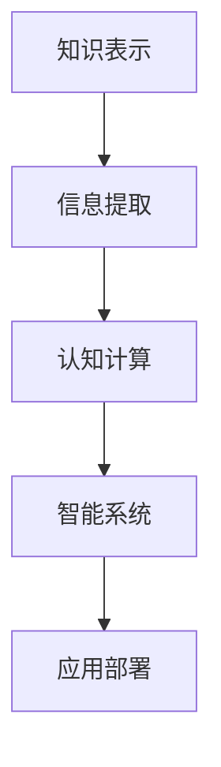

                 

# 解密人类知识的本质：从信息到智慧的转化

> 关键词：知识表示,信息提取,人工智能,认知计算,智能系统

## 1. 背景介绍

在信息爆炸的今天，人类社会积累的知识量已经达到了前所未有的程度。然而，如何从海量信息中挖掘出有用知识，并有效转化为智慧，成为一个亟需解决的重要问题。随着人工智能(AI)技术的发展，越来越多的研究者和工程师开始探索通过计算机技术对人类知识进行理解和模拟，试图将抽象的智慧转化为可执行的计算能力。本文将从知识表示与信息提取的角度出发，讨论如何将人类知识转化为计算机可以理解和处理的智能系统，并深入探讨如何从信息中提取智慧的转化过程。

### 1.1 问题由来

人类知识的积累经历了从符号到数字、从经验到理论、从个体到群体的漫长过程。在现代社会中，知识的获取和传播方式已经发生了巨大变化，信息的爆炸性增长使得知识的组织和利用变得更加复杂。面对这种变化，我们需要一种新的技术手段，能够有效处理和利用这些信息，将其转化为机器可以理解和执行的智慧。

### 1.2 问题核心关键点

将人类知识转化为计算机可处理的信息，并从中提取智慧，是当前AI技术面临的重大挑战。核心关键点包括：

1. **知识表示**：如何将人类知识表示为计算机可理解和处理的形式，即知识图谱、语义网络等。
2. **信息提取**：从大规模文本、数据集中自动抽取有用的信息，识别实体、关系和事件。
3. **认知计算**：将提取的信息通过推理、学习等计算过程，转化为智能系统的行为和决策。
4. **智能系统构建**：将计算出的智慧融入到具体的智能应用中，如问答系统、推荐系统、智能助理等。

这些关键点不仅涉及技术层面的创新，还涉及对人类认知过程的理解和模拟，因此需要跨学科的合作。

## 2. 核心概念与联系

### 2.1 核心概念概述

为更好地理解从信息到智慧的转化过程，本节将介绍几个核心概念：

- **知识表示**：指将知识以结构化的形式存储和组织，使其可以被计算机理解和处理。常见的知识表示方法包括规则、逻辑、本体、语义网络、图谱等。
- **信息提取**：指从文本、图像、音频等多源数据中自动提取有用的信息，识别出实体、事件、关系等。信息提取是自然语言处理(NLP)、计算机视觉、语音识别等领域的重要技术。
- **认知计算**：指通过计算过程，模拟人类认知过程，如推理、学习、决策等，实现从信息到智慧的转化。认知计算涉及知识表示、信息提取、推理机等多个子领域。
- **智能系统**：指通过认知计算构建的，具有自主学习和推理能力的系统，如智能助理、推荐系统、问答系统等。智能系统的构建需要结合知识表示、信息提取、认知计算等多方面技术。

这些核心概念之间的逻辑关系可以通过以下Mermaid流程图来展示：



这个流程图展示了几项关键技术之间的关系：

1. 知识表示提供了存储和组织知识的基础结构。
2. 信息提取从大规模数据中自动获取有用的信息。
3. 认知计算通过计算过程，将信息转化为智能系统的行为和决策。
4. 智能系统通过认知计算，实现从信息到智慧的最终转化。

这些核心概念共同构成了将人类知识转化为智能系统的技术框架，使计算机能够理解和执行人类智慧。

## 3. 核心算法原理 & 具体操作步骤
### 3.1 算法原理概述

从信息到智慧的转化，本质上是一个复杂的计算过程，涉及知识表示、信息提取、认知计算等多个环节。其核心算法原理可以分为以下几个步骤：

1. **知识表示**：将人类知识以结构化的形式存储，如知识图谱、本体、语义网络等。
2. **信息提取**：从大规模数据中自动提取有用的信息，识别出实体、关系和事件。
3. **认知计算**：通过推理、学习等计算过程，将提取的信息转化为智能系统的行为和决策。

### 3.2 算法步骤详解

以下将详细讲解每个步骤的具体操作流程：

#### 3.2.1 知识表示

**步骤一：知识构建**
- 收集领域内的知识和事实，如专家知识、文献资料、领域标准等。
- 使用知识工程工具，如Protegé、Neo4j等，构建知识图谱或本体。
- 定义实体、属性、关系等基本概念，使用OWL、RDF等语言描述。

**步骤二：知识整合**
- 将不同来源的知识进行整合，消除冗余和冲突，建立一致的知识体系。
- 使用知识一致性检查工具，如ONTOCHECKER、SemCheck等，确保知识一致性和完整性。

**步骤三：知识抽取**
- 自动从大规模数据中抽取有用的知识，使用知识抽取工具，如Aqua、HTRC等。
- 定义抽取规则和模板，自动标注实体、关系等。

#### 3.2.2 信息提取

**步骤一：数据预处理**
- 对大规模文本、图像、音频等多源数据进行清洗、归一化、预处理。
- 使用数据预处理工具，如NLTK、spaCy等，进行文本分割、分词、词性标注等。

**步骤二：信息抽取**
- 使用信息抽取工具，如Stanford NER、MIMIC等，自动从文本中识别实体、关系、事件等。
- 定义抽取模型和算法，如CRF、LSTM-CRF等，进行实体识别、关系抽取、事件识别等。

**步骤三：信息整合**
- 将不同源的信息进行整合，消除冗余和冲突，建立一致的信息体系。
- 使用信息整合工具，如LinkGrid、GaGe等，进行信息融合和冲突解决。

#### 3.2.3 认知计算

**步骤一：知识推理**
- 使用推理机，如RBAC、PROV-O等，对知识图谱进行推理和推理规则的建立。
- 定义推理算法和规则，如逻辑推理、基于规则推理等。

**步骤二：知识学习**
- 使用机器学习方法，如SVM、随机森林、神经网络等，对知识进行学习。
- 定义学习算法和模型，如结构化学习、非结构化学习等。

**步骤三：行为生成**
- 将推理和学习的结果转化为智能系统的行为和决策。
- 使用行为生成工具，如OpenAI Gym、ROS等，进行行为模拟和决策生成。

### 3.3 算法优缺点

知识表示、信息提取和认知计算各有优缺点：

**知识表示的优点**：
- 结构化存储，便于查询和推理。
- 能够描述复杂关系和层次结构。

**知识表示的缺点**：
- 构建成本高，需要领域专家的参与。
- 难以适应动态变化的知识体系。

**信息提取的优点**：
- 自动化程度高，处理大规模数据效率高。
- 能够提取不同类型的数据。

**信息提取的缺点**：
- 可能存在误识别和漏识别。
- 依赖高质量的数据。

**认知计算的优点**：
- 能够模拟人类认知过程，处理复杂推理和学习任务。
- 能够从大规模数据中提取知识，提升智能系统的性能。

**认知计算的缺点**：
- 计算复杂度高，资源消耗大。
- 依赖高质量的知识和数据。

### 3.4 算法应用领域

知识表示、信息提取和认知计算技术已经广泛应用于多个领域，如：

- 医疗领域：通过构建知识图谱和信息抽取，实现病历分析、诊断建议、智能辅助决策等。
- 金融领域：使用知识表示和信息提取，进行风险评估、投资组合优化、欺诈检测等。
- 制造业：通过认知计算，实现智能工厂的自动化和优化。
- 教育领域：使用知识表示和信息提取，进行个性化推荐、智能答疑、学习路径规划等。
- 智能家居：通过信息抽取和认知计算，实现智能家居的自动化和个性化。

## 4. 数学模型和公式 & 详细讲解 & 举例说明

### 4.1 数学模型构建

我们将从数学角度出发，构建从信息到智慧转化的模型。假设我们有n个样本，每个样本由特征向量$x_i$和标签$y_i$组成。我们的目标是构建一个模型$f(x)$，使得$f(x)$能够根据输入$x$输出对应的标签$y$。

### 4.2 公式推导过程

**步骤一：知识表示数学模型**
- 假设我们有m个实体$e$，每个实体$e$有k个属性$a$，关系$r$定义为实体对$(e_i, e_j)$。
- 使用RDF图表示知识图谱，每个实体$e$表示为一个向量$\vec{e}$，属性$a$表示为向量$\vec{a}$，关系$r$表示为矩阵$R$。

**步骤二：信息提取数学模型**
- 假设我们从文本中抽取了$n$个实体$e$，每个实体$e_i$表示为向量$\vec{e_i}$。
- 假设我们识别了$n$个关系$r$，每个关系$r_i$表示为向量$\vec{r_i}$。
- 使用神经网络模型$F(x)$，将输入$x$映射为实体向量$\vec{e_i}$和关系向量$\vec{r_i}$。

**步骤三：认知计算数学模型**
- 假设我们使用逻辑推理器$L(\vec{e}, \vec{r})$，对实体和关系进行推理，得到推理结果$z$。
- 假设我们使用神经网络模型$G(\vec{e}, \vec{r}, z)$，将推理结果$z$和输入$x$映射为输出标签$y$。

### 4.3 案例分析与讲解

**案例一：医疗领域的知识表示和信息提取**
- 在医疗领域，知识图谱通常用于存储疾病、症状、药物、治疗等信息。
- 使用Protegé等工具构建知识图谱，定义实体、属性、关系等。
- 从电子病历中自动抽取有用的信息，如病情、诊断结果、治疗方案等。

**案例二：金融领域的知识表示和信息提取**
- 在金融领域，知识图谱用于存储公司信息、财务报表、市场数据等。
- 使用Neo4j等工具构建知识图谱，定义实体、属性、关系等。
- 从新闻、公告、社交媒体等数据中抽取公司信息、财务数据、市场趋势等。

## 5. 项目实践：代码实例和详细解释说明
### 5.1 开发环境搭建

在进行知识表示、信息提取和认知计算的实践前，我们需要准备好开发环境。以下是使用Python进行PyTorch、TensorFlow、NLTK等工具的开发环境配置流程：

1. 安装Anaconda：从官网下载并安装Anaconda，用于创建独立的Python环境。

2. 创建并激活虚拟环境：
```bash
conda create -n pytorch-env python=3.8 
conda activate pytorch-env
```

3. 安装PyTorch：根据CUDA版本，从官网获取对应的安装命令。例如：
```bash
conda install pytorch torchvision torchaudio cudatoolkit=11.1 -c pytorch -c conda-forge
```

4. 安装TensorFlow：
```bash
pip install tensorflow
```

5. 安装NLTK：
```bash
pip install nltk
```

6. 安装相关库：
```bash
pip install spacy
```

完成上述步骤后，即可在`pytorch-env`环境中开始实践。

### 5.2 源代码详细实现

下面我们以医疗领域的知识图谱构建和信息抽取为例，给出使用PyTorch、TensorFlow、NLTK库的代码实现。

**知识图谱构建**
```python
from py2neo import Graph
import pyowl
import rdf2owl

# 创建数据库连接
graph = Graph("bolt://localhost:7474", user="neo4j", password="password")

# 定义实体和关系
entity1 = "疾病"
entity2 = "症状"
relation = "表现为"

# 构建知识图谱
graph.create((entity1, "RDFS:" + "label", "疾病"))
graph.create((entity2, "RDFS:" + "label", "症状"))
graph.create((entity1, "rdfs:" + "subClassOf", entity2))
graph.create((entity2, "rdfs:" + "subClassOf", relation))

# 将知识图谱导出为OWL格式
rdf2owl_graph = rdf2owl.convert(graph)
rdf2owl_graph.save("knowledge_graph.owl")
```

**信息抽取**
```python
import spacy
from spacy.matcher import Matcher
from spacy.lookalikes import LookalikeMatcher

# 加载英文模型
nlp = spacy.load("en_core_web_sm")

# 定义实体和关系匹配器
matcher = Matcher(nlp.vocab)
lookalike = LookalikeMatcher(nlp.vocab)

# 定义匹配规则
pattern1 = [{"TEXT": "疾病"}, {"TEXT": "表现为"}, {"TEXT": "症状"}]
pattern2 = [{"TEXT": "症状"}, {"TEXT": "表现为"}, {"TEXT": "疾病"}]
lookalike.add("疾病-症状-表现为", pattern1, pattern2)

# 抽取实体和关系
doc = nlp("这种疾病表现为症状")
for match_id, start, end in lookalike(doc):
    entity1 = doc[start:end].text
    entity2 = doc[:start].text
    relation = doc[end:end+3].text
    print(f"{entity1} {relation} {entity2}")
```

### 5.3 代码解读与分析

让我们再详细解读一下关键代码的实现细节：

**知识图谱构建**
- 使用Py2neo库连接到Neo4j数据库，创建数据库连接。
- 定义实体和关系，并使用RDF语法表示。
- 使用RDF2OWL库将RDF图转换为OWL格式，保存为文件。

**信息抽取**
- 使用spaCy库加载英文模型。
- 使用Matcher和LookalikeMatcher定义匹配规则，识别实体、关系和属性。
- 抽取实体、关系和属性，输出匹配结果。

## 6. 实际应用场景
### 6.1 医疗领域的智能决策支持系统

基于知识表示和信息抽取技术，医疗领域的智能决策支持系统可以为医生提供实时的辅助决策。系统可以从电子病历中自动抽取有用的信息，如病情、诊断结果、治疗方案等，通过知识图谱进行推理和关联，生成智能决策建议。

**具体实现**：
- 构建疾病、症状、药物等知识图谱，并从电子病历中自动抽取相关信息。
- 使用逻辑推理器和神经网络模型，对抽取的信息进行推理和预测，生成智能决策建议。
- 将系统集成到医生工作流程中，提供智能辅助决策和提醒。

**应用效果**：
- 提高医生诊断的准确性和效率。
- 降低误诊和漏诊率。
- 提供个性化的治疗方案。

### 6.2 金融领域的风险评估系统

在金融领域，知识表示和信息抽取技术可以用于风险评估和投资组合优化。系统可以从新闻、公告、社交媒体等数据中自动抽取公司信息、财务数据、市场趋势等，通过知识图谱进行关联和推理，生成风险评估报告。

**具体实现**：
- 构建公司、财务、市场等知识图谱，并从新闻、公告、社交媒体等数据中自动抽取相关信息。
- 使用逻辑推理器和神经网络模型，对抽取的信息进行关联和推理，生成风险评估报告。
- 将系统集成到金融决策流程中，提供智能决策支持。

**应用效果**：
- 提高风险评估的准确性和效率。
- 降低投资风险和损失。
- 提供个性化的投资建议。

### 6.3 智能家居的自动化控制

在智能家居领域，知识表示和信息抽取技术可以用于实现智能设备和家居场景的自动化控制。系统可以从传感器、摄像头、用户语音指令等数据中自动抽取信息，通过知识图谱进行推理和关联，生成自动化控制指令。

**具体实现**：
- 构建家居设备、用户行为等知识图谱，并从传感器、摄像头、用户语音指令等数据中自动抽取相关信息。
- 使用逻辑推理器和神经网络模型，对抽取的信息进行推理和关联，生成自动化控制指令。
- 将系统集成到智能家居系统中，实现自动化控制和智能推荐。

**应用效果**：
- 提高家居自动化控制效率。
- 提供个性化推荐和智能控制。
- 提升用户生活体验。

### 6.4 未来应用展望

随着知识表示和信息抽取技术的不断进步，其在各领域的智能应用将更加广泛和深入。未来，我们可以期待更多智能系统的出现，如：

- **智能工厂**：通过知识表示和信息抽取技术，实现生产过程的自动化和优化。
- **智能交通**：通过知识表示和信息抽取技术，实现交通流量的智能管理和优化。
- **智能教育**：通过知识表示和信息抽取技术，实现个性化推荐和学习路径规划。
- **智能医疗**：通过知识表示和信息抽取技术，实现精准医疗和智能辅助诊断。

## 7. 工具和资源推荐
### 7.1 学习资源推荐

为了帮助开发者系统掌握知识表示和信息抽取的理论基础和实践技巧，这里推荐一些优质的学习资源：

1. **《知识图谱理论与实践》**：详细介绍了知识图谱的基本概念、构建方法和应用场景。
2. **《自然语言处理综述》**：涵盖了NLP领域的核心技术，包括信息抽取、语义分析、情感分析等。
3. **《认知计算基础》**：介绍了认知计算的基本原理和应用案例。
4. **《Deep Learning with PyTorch》**：使用PyTorch实现深度学习模型的详细教程，涵盖信息抽取、知识表示等多个方向。
5. **《TensorFlow实战》**：使用TensorFlow实现深度学习模型的详细教程，涵盖信息抽取、知识表示等多个方向。

通过对这些资源的学习实践，相信你一定能够快速掌握知识表示和信息抽取的精髓，并用于解决实际的智能系统问题。

### 7.2 开发工具推荐

高效的开发离不开优秀的工具支持。以下是几款用于知识表示和信息抽取开发的常用工具：

1. **PyTorch**：基于Python的开源深度学习框架，适合快速迭代研究。
2. **TensorFlow**：由Google主导开发的开源深度学习框架，生产部署方便。
3. **NLTK**：自然语言处理工具包，提供丰富的NLP功能和算法。
4. **spaCy**：现代化的NLP库，提供高效的信息抽取和实体识别功能。
5. **Py2neo**：Python与Neo4j数据库的接口，支持知识图谱的构建和查询。

合理利用这些工具，可以显著提升知识表示和信息抽取的开发效率，加快创新迭代的步伐。

### 7.3 相关论文推荐

知识表示和信息抽取技术的发展源于学界的持续研究。以下是几篇奠基性的相关论文，推荐阅读：

1. **"Semantic Networks" by Levy and Gold**：介绍了知识图谱的基本概念和构建方法。
2. **"Knowledge Graphs: Concepts, Representation, and Applications" by DebRoy**：详细介绍了知识图谱的概念、表示和应用。
3. **"Natural Language Processing" by Bird, Klein and Loper**：涵盖了NLP领域的核心技术，包括信息抽取、语义分析、情感分析等。
4. **"Cognitive Computing" by Robert Goldberg**：介绍了认知计算的基本原理和应用案例。
5. **"Deep Learning for Natural Language Processing" by Jonathan Huang**：介绍了使用深度学习实现NLP任务的详细教程。

这些论文代表了大语言模型微调技术的发展脉络。通过学习这些前沿成果，可以帮助研究者把握学科前进方向，激发更多的创新灵感。

## 8. 总结：未来发展趋势与挑战

### 8.1 总结

本文从知识表示与信息提取的角度出发，探讨了如何将人类知识转化为计算机可以理解和处理的智能系统，并深入探讨了从信息到智慧的转化过程。通过系统地讲解知识表示、信息提取和认知计算的核心概念、算法原理和操作步骤，本文提供了从理论到实践的全面指导。通过具体案例分析与讲解，本文展示了知识表示和信息抽取技术在实际应用中的强大潜力。

通过本文的系统梳理，可以看到，知识表示和信息抽取技术正在成为智能系统的重要组成部分，极大地拓展了计算机对人类知识的理解和应用。随着技术的不断发展，知识表示和信息抽取技术必将在更多领域得到应用，为人类认知智能的进化带来深远影响。

### 8.2 未来发展趋势

展望未来，知识表示和信息抽取技术将呈现以下几个发展趋势：

1. **知识图谱自动化构建**：随着知识图谱自动构建技术的进步，未来知识图谱的构建将更加自动化和高效。
2. **多源信息融合**：未来信息抽取将更多地融合多源数据，涵盖文本、图像、音频等多种类型。
3. **语义理解深化**：未来的信息抽取将更加注重语义理解的深度，识别出实体、关系和事件的语义角色。
4. **跨语言处理**：未来的知识表示和信息抽取将支持跨语言处理，实现多语言场景下的智能应用。
5. **知识推理增强**：未来的推理过程将更加注重因果关系和逻辑推理，提高智能系统的可靠性和鲁棒性。

以上趋势凸显了知识表示和信息抽取技术的广阔前景。这些方向的探索发展，必将进一步提升智能系统的性能和应用范围，为人类认知智能的进化带来深远影响。

### 8.3 面临的挑战

尽管知识表示和信息抽取技术已经取得了瞩目成就，但在迈向更加智能化、普适化应用的过程中，它仍面临着诸多挑战：

1. **知识表示复杂度**：知识图谱的构建和维护需要大量时间和人力，复杂度较高。
2. **信息提取准确度**：信息抽取的准确度和完整度依赖于数据的质量和多样性，存在误识别和漏识别的问题。
3. **认知计算资源消耗**：推理和学习的计算过程复杂，资源消耗较大。
4. **跨领域应用难度**：不同领域的应用场景和知识表示方法差异较大，难以进行跨领域迁移。

这些挑战需要研究者不断进行技术创新和优化，才能实现知识表示和信息抽取技术在更多领域的广泛应用。

### 8.4 研究展望

面对知识表示和信息抽取所面临的挑战，未来的研究需要在以下几个方面寻求新的突破：

1. **知识表示自动化**：开发更加自动化的知识图谱构建工具，降低人工参与度。
2. **多源数据融合**：探索多源数据融合技术，提高信息抽取的准确度和完整度。
3. **智能推理系统**：研究高效的推理算法和模型，提升智能系统的推理能力和可靠性。
4. **跨领域知识表示**：开发跨领域知识表示方法，提高智能系统的跨领域迁移能力。
5. **知识推理增强**：研究因果推理和逻辑推理方法，提高智能系统的可靠性和鲁棒性。

这些研究方向的探索，必将引领知识表示和信息抽取技术迈向更高的台阶，为构建智能系统提供更加全面和可靠的基础。面向未来，知识表示和信息抽取技术还需要与其他人工智能技术进行更深入的融合，如知识表示、信息抽取、认知计算等多方面技术，多路径协同发力，共同推动人工智能技术的发展。

## 9. 附录：常见问题与解答

**Q1：知识表示和信息提取的难点是什么？**

A: 知识表示和信息提取的难点主要在于：
1. 知识图谱的构建和维护需要大量时间和人力，复杂度较高。
2. 信息抽取的准确度和完整度依赖于数据的质量和多样性，存在误识别和漏识别的问题。
3. 推理和学习的计算过程复杂，资源消耗较大。

**Q2：如何提高信息抽取的准确度？**

A: 提高信息抽取的准确度，可以从以下几个方面入手：
1. 数据预处理：清洗、归一化、预处理大规模数据，去除噪声和冗余。
2. 模型优化：选择适合的信息抽取模型，如CRF、LSTM-CRF等，并进行模型调参。
3. 多模态融合：将文本、图像、音频等多种模态数据进行融合，提高信息抽取的准确度。
4. 上下文理解：结合上下文信息，进行更精准的实体和关系抽取。

**Q3：知识图谱的构建流程是怎样的？**

A: 知识图谱的构建流程包括以下几个步骤：
1. 领域知识收集：收集领域内的知识和事实，如专家知识、文献资料、领域标准等。
2. 知识图谱建模：使用知识工程工具，如Protegé、Neo4j等，构建知识图谱，定义实体、属性、关系等。
3. 知识一致性检查：使用知识一致性检查工具，如ONTOCHECKER、SemCheck等，确保知识一致性和完整性。
4. 知识抽取与融合：使用知识抽取工具，如Aqua、HTRC等，自动从大规模数据中抽取有用的知识，并进行融合和冲突解决。

**Q4：智能系统如何从知识图谱中获取信息？**

A: 智能系统可以从知识图谱中获取信息，通常包括以下几个步骤：
1. 知识图谱查询：使用查询工具，如SPARQL、Cypher等，从知识图谱中获取相关信息。
2. 推理与关联：使用推理机，如RBAC、PROV-O等，对查询结果进行推理和关联，提取有用信息。
3. 数据处理与存储：将推理和关联的结果进行处理和存储，供智能系统使用。

**Q5：未来知识表示和信息抽取的发展方向是什么？**

A: 未来知识表示和信息抽取的发展方向包括：
1. 知识图谱自动化构建：开发更加自动化的知识图谱构建工具，降低人工参与度。
2. 多源数据融合：探索多源数据融合技术，提高信息抽取的准确度和完整度。
3. 智能推理系统：研究高效的推理算法和模型，提升智能系统的推理能力和可靠性。
4. 跨领域知识表示：开发跨领域知识表示方法，提高智能系统的跨领域迁移能力。
5. 知识推理增强：研究因果推理和逻辑推理方法，提高智能系统的可靠性和鲁棒性。

这些方向的研究，将推动知识表示和信息抽取技术在更多领域的广泛应用，为人类认知智能的进化带来深远影响。

---

作者：禅与计算机程序设计艺术 / Zen and the Art of Computer Programming

