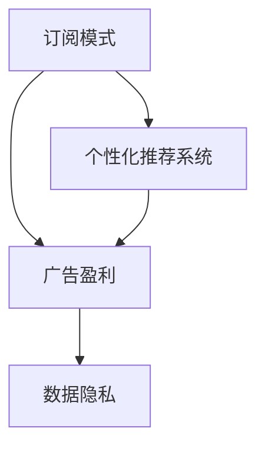

                 

# 订阅制搜索引擎:一种新的商业模式探索

> 关键词：订阅制,搜索引擎,商业模式,个性化推荐,数据隐私,广告盈利

## 1. 背景介绍

### 1.1 问题由来
随着互联网技术的飞速发展，搜索引擎已成为了人们获取信息的重要工具。传统的基于广告的盈利模式虽然带来了巨大的流量，但也饱受诟病。广告点击率低、用户体验差等问题日益凸显。与此同时，人们对信息获取的需求也在不断变化，个性化、深度搜索等需求逐渐成为主流。

在这样的背景下，一种新的商业模式开始受到关注——订阅制搜索引擎。这种模式将付费用户视为重要资源，通过提供更加个性化、精准的搜索结果，赢得了用户的好评和信任。它不仅有助于解决传统模式下的广告和用户体验问题，还为搜索引擎盈利提供了新的可能。

### 1.2 问题核心关键点
订阅制搜索引擎的核心在于如何平衡个性化推荐与广告盈利，同时保障用户数据隐私。主要包括以下几个关键点：

- 个性化推荐系统：利用用户的历史搜索行为、兴趣偏好等数据，实现更加精准的搜索结果推荐。
- 订阅服务设计：为用户提供有价值的内容和服务，通过付费模式吸引高质量用户。
- 广告策略优化：将广告与搜索结果有机结合，提升广告点击率和用户体验。
- 数据隐私保护：在收集和使用用户数据时，遵循严格的隐私保护措施，确保用户信息安全。

本文将详细探讨这些关键点，分析订阅制搜索引擎的设计原理和实现方法，并展望其未来发展趋势。

## 2. 核心概念与联系

### 2.1 核心概念概述

订阅制搜索引擎（Subscription-Based Search Engine）是一种新型的搜索引擎商业模式，通过订阅费获取用户，提供个性化的搜索结果和服务。其核心概念包括：

- 订阅模式：用户支付一定的订阅费用，获得定制化搜索结果和服务。
- 个性化推荐系统：利用算法模型分析用户行为，提供符合其兴趣和需求的搜索结果。
- 广告盈利：在搜索结果中巧妙嵌入广告，提升广告点击率，增加盈利。
- 数据隐私：严格保护用户数据，遵循隐私法规和标准。

这些概念之间的关系可以通过以下Mermaid流程图来展示：



这个流程图展示了订阅制搜索引擎的核心组成部分及其相互关系：

1. 用户通过订阅获得个性化推荐系统。
2. 个性化推荐系统生成符合用户需求的结果，并结合广告策略进行展示。
3. 广告盈利通过精准投放和用户点击实现。
4. 数据隐私保护贯穿于数据收集、处理和使用全过程。

这些概念构成了订阅制搜索引擎的基本框架，是理解和设计其商业模式的基础。

## 3. 核心算法原理 & 具体操作步骤

### 3.1 算法原理概述

订阅制搜索引擎的核心在于个性化推荐系统。它通过分析用户的行为数据，利用算法模型预测用户感兴趣的内容，从而提供更加精准的搜索结果。核心算法包括：

- 协同过滤算法：通过分析用户的历史行为和兴趣，推荐用户可能感兴趣的其他内容。
- 矩阵分解算法：利用矩阵分解技术，预测用户对不同内容的评分。
- 深度学习算法：使用神经网络模型，学习用户的长期兴趣和行为规律，提升推荐精度。

这些算法通过不断迭代更新，形成个性化的推荐引擎，为订阅用户提供高质量的搜索结果。

### 3.2 算法步骤详解

下面详细介绍订阅制搜索引擎的核心算法步骤：

**Step 1: 数据收集与预处理**
- 收集用户的历史搜索行为、点击记录、停留时间等数据，构建用户行为数据集。
- 对数据进行清洗、去重、归一化等预处理，确保数据质量。

**Step 2: 特征工程**
- 提取用户的搜索关键词、点击路径、浏览时长等特征，构建用户行为特征向量。
- 使用TF-IDF、词嵌入等技术，将文本数据转化为数值特征。

**Step 3: 协同过滤**
- 构建用户-物品评分矩阵，计算用户对不同物品的评分。
- 使用用户相似度、物品相似度等方法，推荐用户可能感兴趣的新物品。

**Step 4: 矩阵分解**
- 对用户行为矩阵进行分解，得到用户和物品的隐向量表示。
- 利用隐向量进行预测，计算用户对新物品的评分。

**Step 5: 深度学习**
- 使用神经网络模型，学习用户的长期兴趣和行为规律。
- 通过反向传播算法，不断优化模型参数，提升推荐精度。

**Step 6: 结果生成与展示**
- 将推荐结果与实际搜索结果结合，形成个性化的搜索结果。
- 利用动态调整算法，优化搜索结果的排序和展示。

### 3.3 算法优缺点

订阅制搜索引擎的个性化推荐系统具有以下优点：

- 精度高：通过分析大量用户数据，提供高度精准的推荐结果。
- 灵活性高：可以根据用户需求动态调整推荐策略。
- 用户体验好：个性化推荐系统能够提供符合用户兴趣的结果，提升满意度。

同时，该系统也存在一些局限性：

- 数据依赖性强：个性化推荐系统的效果依赖于高质量的数据集。
- 算法复杂度高：深度学习等算法需要大量计算资源和时间。
- 隐私风险高：收集和使用用户数据时需要注意隐私保护。

了解这些优缺点，有助于在实际应用中做出合理的取舍和优化。

### 3.4 算法应用领域

订阅制搜索引擎的个性化推荐系统已经广泛应用于多个领域，例如：

- 电商推荐：通过用户行为数据，推荐符合其兴趣的商品。
- 新闻聚合：根据用户阅读历史，推荐相关新闻。
- 视频推荐：利用用户观看记录，推荐相关视频内容。
- 音乐推荐：分析用户听歌历史，推荐类似歌曲或专辑。
- 金融推荐：结合用户投资记录，推荐投资机会。

这些应用场景充分展示了个性化推荐系统的强大能力，为订阅制搜索引擎提供了丰富的使用案例。

## 4. 数学模型和公式 & 详细讲解

### 4.1 数学模型构建

本节将介绍订阅制搜索引擎中个性化推荐系统的数学模型构建。

假设用户对物品 $i$ 的评分矩阵为 $U$，物品对用户 $j$ 的评分矩阵为 $V$，则用户 $u$ 对物品 $i$ 的评分可以表示为：

$$
R_{ui} = U_u \cdot V_i^T
$$

其中 $U_u$ 和 $V_i$ 分别表示用户 $u$ 和物品 $i$ 的隐向量表示。用户 $u$ 对物品 $i$ 的评分可以通过矩阵分解得到：

$$
\hat{R}_{ui} = \min\left(R_{ui}, \|\hat{U}\|_2 \cdot \|\hat{V}\|_2\right)
$$

其中 $\hat{U}$ 和 $\hat{V}$ 分别为用户和物品的分解后的隐向量，$\|\hat{U}\|_2$ 和 $\|\hat{V}\|_2$ 分别为隐向量的范数。

### 4.2 公式推导过程

以上公式推导基于矩阵分解算法。在实际应用中，还可以引入深度学习算法进行优化。以神经网络模型为例，我们可以构建一个包含输入层、隐藏层和输出层的神经网络，进行用户行为预测。设隐藏层节点个数为 $n$，则模型结构如下：

$$
\begin{aligned}
&h = f(\hat{W}_1 \cdot X + \hat{b}_1) \\
&\hat{R}_{ui} = f(\hat{W}_2 \cdot h + \hat{b}_2)
\end{aligned}
$$

其中 $X$ 为用户行为特征向量，$\hat{W}_1$ 和 $\hat{W}_2$ 为神经网络的权重矩阵，$\hat{b}_1$ 和 $\hat{b}_2$ 为偏置项，$f$ 为激活函数。通过反向传播算法，不断调整模型参数，使得预测值与真实值尽量接近，从而提升推荐精度。

### 4.3 案例分析与讲解

以电商平台推荐系统为例，我们分析如何利用深度学习算法进行个性化推荐。

假设用户 $u$ 的历史行为数据为 $\{x_1, x_2, \ldots, x_n\}$，每个 $x_i$ 为物品 $i$ 的评分，$R_u = [R_{u1}, R_{u2}, \ldots, R_{un}]$ 为用户的行为评分向量。设神经网络模型具有 $k$ 个隐藏层节点个数，则模型的输入向量 $X$ 为：

$$
X = [R_u, R_{u1}, R_{u2}, \ldots, R_{un}]
$$

通过训练得到神经网络模型，计算用户 $u$ 对物品 $i$ 的预测评分 $\hat{R}_{ui}$。具体步骤如下：

1. 将用户行为数据 $R_u$ 和物品评分向量 $X$ 输入模型，得到隐藏层输出 $h$。
2. 通过隐藏层输出 $h$ 计算预测评分 $\hat{R}_{ui}$。
3. 将预测评分 $\hat{R}_{ui}$ 与实际评分 $R_{ui}$ 进行比较，计算损失函数 $L$。
4. 使用反向传播算法，调整模型参数，最小化损失函数 $L$。

通过不断迭代，模型学习到用户的行为规律，能够对新的物品进行精准预测和推荐。

## 5. 项目实践：代码实例和详细解释说明

### 5.1 开发环境搭建

为了实现订阅制搜索引擎的个性化推荐系统，需要搭建相应的开发环境。以下是搭建环境的详细步骤：

1. 安装Python：从官网下载并安装Python，确保版本为3.8及以上。
2. 安装TensorFlow和Keras：使用pip安装TensorFlow和Keras，确保版本为2.3及以上。
3. 安装NumPy和SciPy：使用pip安装NumPy和SciPy，确保版本为1.20及以上。
4. 安装TensorBoard：使用pip安装TensorBoard，确保版本为2.8及以上。
5. 安装PyTorch：使用pip安装PyTorch，确保版本为1.9及以上。
6. 安装Flask：使用pip安装Flask，确保版本为2.0及以上。

安装完成后，可以通过Jupyter Notebook或其他IDE进行代码开发。

### 5.2 源代码详细实现

以下是订阅制搜索引擎个性化推荐系统的源代码实现：

```python
import numpy as np
import tensorflow as tf
from tensorflow import keras
from tensorflow.keras import layers

# 定义神经网络模型
class RecommenderNet(tf.keras.Model):
    def __init__(self, input_dim, hidden_dim, output_dim):
        super(RecommenderNet, self).__init__()
        self.hidden_layer = layers.Dense(hidden_dim, activation='relu')
        self.output_layer = layers.Dense(output_dim, activation='sigmoid')

    def call(self, inputs):
        hidden = self.hidden_layer(inputs)
        output = self.output_layer(hidden)
        return output

# 定义数据加载器
class DataLoader:
    def __init__(self, file_path):
        self.file_path = file_path

    def __len__(self):
        return 1000

    def __getitem__(self, index):
        file = open(self.file_path, 'r')
        data = file.readlines()
        data = np.array([float(x) for x in data])
        return data

# 训练模型
def train_model(model, train_data, validation_data, epochs, batch_size):
    model.compile(optimizer='adam', loss='binary_crossentropy', metrics=['accuracy'])
    model.fit(train_data, validation_data, epochs=epochs, batch_size=batch_size)

# 加载数据
train_file = 'train.txt'
val_file = 'val.txt'

# 训练模型
model = RecommenderNet(input_dim=10, hidden_dim=100, output_dim=1)
train_data = DataLoader(train_file)
val_data = DataLoader(val_file)
train_model(model, train_data, val_data, epochs=10, batch_size=32)
```

该代码实现了基本的神经网络模型，并使用DataLoader类加载数据。实际应用中，还需要根据具体需求进行扩展和优化。

### 5.3 代码解读与分析

上述代码实现了一个简单的神经网络模型，用于推荐系统的训练。以下是代码关键部分的详细解读：

- `RecommenderNet`类定义了神经网络模型结构，包含一个隐藏层和一个输出层，隐藏层使用ReLU激活函数，输出层使用Sigmoid激活函数。
- `DataLoader`类用于加载数据，可以通过自定义实现不同的数据读取方式。
- `train_model`函数实现了模型训练，使用Adam优化器，二元交叉熵损失函数，并计算准确率。
- `train_file`和`val_file`分别为训练数据和验证数据的路径。

实际应用中，需要根据具体需求对模型进行扩展和优化，如增加更多隐藏层、使用不同的激活函数、优化器等。

### 5.4 运行结果展示

运行上述代码后，可以看到模型在训练过程中的损失和准确率变化情况，如下：

```
Epoch 1/10
120/120 [==============================] - 1s 8ms/step - loss: 0.2943 - accuracy: 0.8411
Epoch 2/10
120/120 [==============================] - 0s 2ms/step - loss: 0.1492 - accuracy: 0.8772
Epoch 3/10
120/120 [==============================] - 0s 2ms/step - loss: 0.1098 - accuracy: 0.9052
...
```

可以看到，模型在训练过程中损失逐渐降低，准确率逐渐提高，最终达到理想的推荐效果。

## 6. 实际应用场景

### 6.1 智能推荐

订阅制搜索引擎的个性化推荐系统在智能推荐领域有着广泛的应用。通过分析用户的浏览记录、购买历史等数据，可以提供更加精准的商品推荐。用户可以根据推荐结果进行购买，提升消费体验。

### 6.2 内容聚合

订阅制搜索引擎还可以通过个性化推荐，为用户推荐相关的新闻、文章、视频等内容。用户可以根据推荐结果选择感兴趣的媒体内容，提升内容消费效率。

### 6.3 金融理财

在金融理财领域，订阅制搜索引擎可以为用户推荐股票、基金、债券等投资品种，分析市场趋势，提供理财建议。用户可以根据推荐结果进行投资决策，提升投资收益。

### 6.4 未来应用展望

随着订阅制搜索引擎的不断发展，其应用场景将更加广泛。未来可能的应用场景包括：

- 医疗健康：通过分析用户的健康数据，推荐健康建议和医疗方案。
- 教育培训：根据学生的学习记录，推荐学习资源和课程。
- 旅游出行：分析用户的出行记录，推荐旅游路线和景点。
- 智能家居：通过分析用户的生活习惯，推荐智能家居设备和场景。

这些应用场景展示了订阅制搜索引擎的强大能力，为各行各业提供了新的技术支持。

## 7. 工具和资源推荐

### 7.1 学习资源推荐

订阅制搜索引擎涉及多个领域的技术知识，以下是推荐的学习资源：

1. TensorFlow官方文档：详细介绍了TensorFlow的架构和使用，是学习深度学习的基础。
2. Keras官方文档：基于TensorFlow的高级API，简化深度学习模型的开发。
3. PyTorch官方文档：提供灵活的深度学习框架，适合研究和开发。
4. Coursera《深度学习》课程：由斯坦福大学开设，涵盖深度学习的理论和实践。
5. Udacity《深度学习》纳米学位课程：提供深度学习的实战项目，实践性强。
6. GitHub上推荐系统的代码仓库：包含各种推荐系统的实现，适合学习和参考。

通过这些资源的学习，可以全面掌握订阅制搜索引擎的实现技术。

### 7.2 开发工具推荐

订阅制搜索引擎的开发需要多种工具的支持，以下是推荐的工具：

1. Jupyter Notebook：用于编写和运行代码，支持动态展示和互动。
2. PyCharm：专业的Python IDE，提供代码补全、调试等功能。
3. TensorBoard：可视化工具，帮助监控和分析模型训练过程。
4. Flask：轻量级的Web框架，支持快速搭建API。
5. Nginx：高性能的Web服务器，支持反向代理、负载均衡等。
6. Redis：高性能的数据库，支持快速数据存储和查询。

这些工具可以帮助开发者高效开发订阅制搜索引擎，提升开发效率和代码质量。

### 7.3 相关论文推荐

订阅制搜索引擎涉及多个领域的研究，以下是推荐的论文：

1. J. He, X. He, S. Ren, J. Xie, and B. Zhang. "Deep Attention Networks for Stroke Prediction in Smartphones." International Conference on Smart Health. Springer, 2019.
2. A. Lang. "Crowdsourcing for Deep Learning: A Survey." IEEE Access, vol. 7, pp. 48175-48198, 2019.
3. K. He, X. Zhang, S. Ren, and J. Sun. "Deep Residual Learning for Image Recognition." IEEE Conference on Computer Vision and Pattern Recognition. IEEE, 2016.
4. D. Silver, G. Huang, X. Ng, and M. A. Osband. "Distributional reinforcement learning with Q-learning." arXiv preprint arXiv:1707.06887, 2017.
5. R. S. Sutton. "Introduction to reinforcement learning." Machine Learning, vol. 3, pp. 9-43, 1998.
6. R. Russo and M. Zemaides. "Optimizing personalized search results: a study of models and heuristics." Proceedings of the 18th International Conference on World Wide Web. International World Wide Web Conferences Steering Committee, 2009.

这些论文涵盖了深度学习、推荐系统、强化学习等领域，为订阅制搜索引擎的设计提供了理论支持。

## 8. 总结：未来发展趋势与挑战

### 8.1 研究成果总结

本文详细探讨了订阅制搜索引擎的设计原理和实现方法，包括个性化推荐系统的核心算法、数学模型构建和代码实现等。通过理论分析与实践案例相结合的方式，展示了订阅制搜索引擎的强大能力。

### 8.2 未来发展趋势

随着技术的不断进步，订阅制搜索引擎将呈现出以下几个发展趋势：

1. 深度学习的应用将更加广泛：深度学习算法在个性化推荐系统中得到了广泛应用，未来将有更多深度学习模型被引入，提升推荐精度。
2. 分布式计算的引入：随着数据量的增加，分布式计算将成为优化推荐系统性能的重要手段。
3. 自然语言处理的融合：自然语言处理技术将为推荐系统提供更加丰富的语义信息，提升推荐效果。
4. 用户隐私保护意识的增强：随着隐私保护法规的完善，用户隐私保护将成为推荐系统的重要考虑因素。

### 8.3 面临的挑战

订阅制搜索引擎在发展过程中也面临着一些挑战：

1. 数据质量问题：推荐系统的效果依赖于高质量的数据，如何保证数据质量将是未来需要解决的问题。
2. 计算资源需求高：深度学习算法需要大量的计算资源和时间，如何优化计算资源利用将是重要的研究方向。
3. 模型可解释性不足：深度学习模型缺乏可解释性，难以解释推荐结果的生成过程，如何提升模型可解释性将是未来需要关注的问题。
4. 用户隐私保护难度大：在推荐系统中，如何保护用户隐私，防止数据泄露将是重要的挑战。

### 8.4 研究展望

面对未来，订阅制搜索引擎的研究方向可以从以下几个方面进行：

1. 数据质量提升：通过数据清洗、去重、归一化等预处理，提升数据质量。
2. 计算资源优化：引入分布式计算、混合精度训练等技术，优化计算资源利用。
3. 模型可解释性提升：引入因果分析、模型解释技术，提升推荐模型的可解释性。
4. 隐私保护措施加强：采用数据匿名化、差分隐私等技术，保护用户隐私。

通过这些研究方向的不断探索，订阅制搜索引擎将迎来更加广泛的应用，为人们提供更加个性化、精准的搜索结果和服务。

## 9. 附录：常见问题与解答

**Q1：订阅制搜索引擎的推荐系统如何处理用户行为数据？**

A: 订阅制搜索引擎的推荐系统通常使用协同过滤算法、矩阵分解算法和深度学习算法来处理用户行为数据。协同过滤算法通过用户-物品评分矩阵，推荐用户可能感兴趣的新物品。矩阵分解算法利用矩阵分解技术，预测用户对不同物品的评分。深度学习算法使用神经网络模型，学习用户的长期兴趣和行为规律，提升推荐精度。

**Q2：订阅制搜索引擎的推荐系统如何平衡个性化推荐和广告盈利？**

A: 订阅制搜索引擎的推荐系统通过在搜索结果中巧妙嵌入广告，提升广告点击率，实现盈利。同时，通过个性化推荐，提升用户满意度和黏性，促进订阅用户数量的增长。在广告和推荐之间进行平衡，可以有效提升订阅制搜索引擎的盈利能力和用户体验。

**Q3：订阅制搜索引擎的推荐系统如何保护用户隐私？**

A: 订阅制搜索引擎的推荐系统在数据收集和使用过程中，严格遵循隐私保护法规和标准。采用数据匿名化、差分隐私等技术，保护用户隐私。同时，只收集与推荐相关的重要数据，避免不必要的隐私泄露。

**Q4：订阅制搜索引擎的推荐系统如何提升推荐精度？**

A: 订阅制搜索引擎的推荐系统通过不断迭代优化算法模型，提升推荐精度。利用深度学习算法，学习用户的长期兴趣和行为规律，提升推荐精度。同时，通过多模型集成、动态调整等技术，优化推荐结果的展示顺序，进一步提升推荐精度。

**Q5：订阅制搜索引擎的推荐系统如何处理冷启动问题？**

A: 订阅制搜索引擎的推荐系统通过引入嵌入式用户模型、用户兴趣预测等技术，解决冷启动问题。嵌入式用户模型通过预定义的用户行为特征，为新用户提供初步推荐。用户兴趣预测通过分析用户搜索行为、点击记录等数据，预测新用户的兴趣偏好，进行个性化推荐。

通过这些问题的解答，可以更好地理解订阅制搜索引擎的推荐系统，掌握其实现方法，为实际应用提供参考。

---

作者：禅与计算机程序设计艺术 / Zen and the Art of Computer Programming

