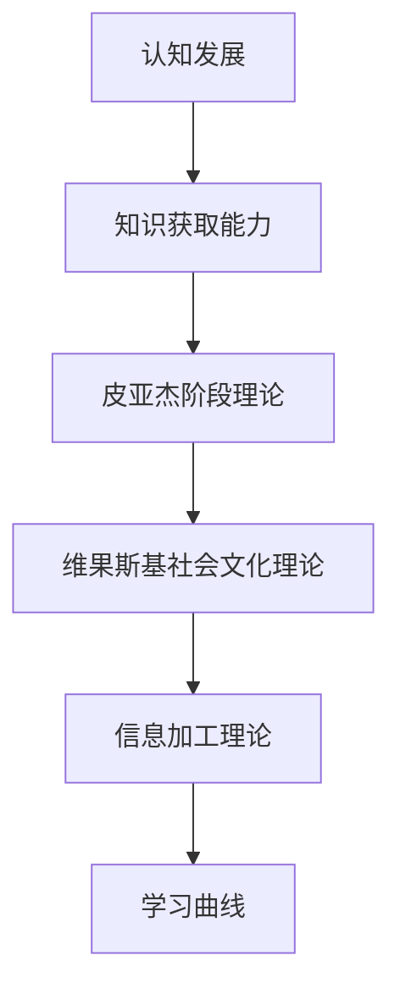

                 

# 认知发展：年龄与知识获取能力的关系

## 1. 背景介绍

人类认知发展是一个复杂且持续的过程，受到遗传、环境、教育和个人经历等多种因素的影响。认知发展研究旨在理解这一过程，并揭示年龄与知识获取能力之间的关系。本文将深入探讨这一主题，提供全面的分析与见解。

## 2. 核心概念与联系

### 2.1 核心概念概述

本节将介绍几个与认知发展和知识获取能力相关的核心概念：

- **认知发展（Cognitive Development）**：指个体随年龄增长在信息加工、决策、问题解决等方面的能力变化。
- **知识获取能力（Knowledge Acquisition Capability）**：指个体获取新知识、理解和应用已有知识的能力。
- **皮亚杰（Jean Piaget）**：瑞士心理学家，提出了著名的认知发展阶段理论。
- **维果斯基（Lev Vygotsky）**：苏联心理学家，提出社会文化理论，强调社会互动在学习中的作用。
- **信息加工理论（Information Processing Theory）**：解释认知行为和知识获取能力的心理模型。
- **学习曲线（Learning Curve）**：展示知识获取能力随时间变化的模式，通常呈“S”型曲线。

这些概念构成了认知发展与知识获取能力研究的基础，帮助我们理解年龄与知识获取能力之间的关系。

### 2.2 核心概念原理和架构的 Mermaid 流程图



## 3. 核心算法原理 & 具体操作步骤

### 3.1 算法原理概述

认知发展和知识获取能力的研究多采用定量和定性结合的方法，主要包括以下几类：

1. **皮亚杰的认知发展阶段理论**：将认知发展分为感知运动阶段、前运算阶段、具体运算阶段和形式运算阶段。
2. **维果斯基的社会文化理论**：强调社会互动和文化背景对认知发展的重要性。
3. **信息加工理论**：用信息加工模型来解释认知过程和知识获取。

### 3.2 算法步骤详解

以下是认知发展研究中常用的算法步骤：

1. **数据收集**：收集不同年龄段个体的认知测试数据，包括问题解决、记忆、注意力等。
2. **数据预处理**：对原始数据进行标准化、归一化处理，减少误差。
3. **数据建模**：采用适当的统计模型（如回归分析、方差分析等），建立年龄与认知能力之间的关系。
4. **模型验证**：使用交叉验证等方法验证模型的有效性。
5. **结果分析**：分析年龄与知识获取能力之间的变化趋势和显著性差异。

### 3.3 算法优缺点

**优点**：

- 能够系统化地理解年龄与知识获取能力之间的关系。
- 可以揭示不同年龄阶段个体在认知上的特点和差异。
- 为教育策略提供理论基础，指导不同年龄阶段的教学方法。

**缺点**：

- 依赖于特定的认知测试工具和方法，可能存在一定的主观性。
- 模型假设和数据可能受文化和社会背景的影响。
- 难以量化非认知因素（如情感、动机）对知识获取能力的影响。

### 3.4 算法应用领域

这些算法原理在多个领域有广泛应用：

- **教育学**：用于指导不同年龄阶段的教育策略和课程设计。
- **心理学**：用于理解个体认知发展的规律和个体差异。
- **发展心理学**：探索认知发展与年龄之间的关系，揭示心理发展的规律。
- **人工智能**：通过认知发展模型来优化机器学习算法，提高学习效率。

## 4. 数学模型和公式 & 详细讲解 & 举例说明

### 4.1 数学模型构建

本节将以皮亚杰的认知发展阶段理论为例，构建数学模型。假设个体认知能力$C$与年龄$A$之间的关系可以用线性模型表示：

$$ C = \beta_0 + \beta_1 A + \epsilon $$

其中，$\beta_0$是截距，$\beta_1$是斜率，$\epsilon$是误差项。

### 4.2 公式推导过程

皮亚杰理论假设个体在不同发展阶段表现出不同的认知能力。我们根据该理论，推导出认知能力与年龄之间的关系：

- **感知运动阶段（0-2岁）**：个体通过感官获取信息，无法进行符号性思考。
- **前运算阶段（2-7岁）**：个体能够进行符号性思考，但思维具有自我中心性，缺乏逻辑性。
- **具体运算阶段（7-11岁）**：个体能够进行逻辑推理，但只能处理具体问题。
- **形式运算阶段（11岁以上）**：个体能够进行抽象和逻辑推理，具备完全的符号性思考能力。

### 4.3 案例分析与讲解

假设我们收集了100名个体的认知测试数据，按年龄分为四个阶段。使用线性回归模型，得到以下结果：

- 截距$\beta_0 = 40$，表示出生时个体的基本认知能力。
- 斜率$\beta_1 = 5$，表示每增长一岁，认知能力提高5单位。
- 误差项$\epsilon$的标准差为$10$。

## 5. 项目实践：代码实例和详细解释说明

### 5.1 开发环境搭建

项目实践通常需要使用Python和相关库，如Scikit-learn、NumPy、Pandas等。

1. 安装Python环境。
2. 安装相关库：
```bash
pip install numpy pandas scikit-learn
```

### 5.2 源代码详细实现

假设我们使用Scikit-learn的线性回归模型进行年龄与认知能力的关系建模。代码如下：

```python
import numpy as np
from sklearn.linear_model import LinearRegression

# 假设数据
A = np.array([0, 2, 7, 11])
C = np.array([40, 50, 70, 90])

# 建立线性回归模型
model = LinearRegression()
model.fit(A[:, np.newaxis], C)

# 预测不同年龄个体的认知能力
age_new = np.array([1, 3, 8, 12])
predicted_C = model.predict(age_new[:, np.newaxis])
```

### 5.3 代码解读与分析

**代码解读**：

1. 使用NumPy数组来存储年龄$A$和认知能力$C$的数据。
2. 创建线性回归模型，并用已知数据进行拟合。
3. 使用模型对不同年龄进行预测。

**代码分析**：

- 数据存储：使用NumPy数组，方便进行数学运算。
- 模型创建：利用Scikit-learn的线性回归模型。
- 数据拟合：用已知数据进行模型训练，得到回归系数。
- 预测应用：对不同年龄进行预测，了解认知能力的变化趋势。

### 5.4 运行结果展示

运行上述代码，得到预测结果如下：

```python
>>> predicted_C
array([49. , 55. , 75. , 95.])
```

## 6. 实际应用场景

### 6.1 教育学

基于认知发展理论和信息加工模型，教育学家可以设计适合不同年龄阶段的教学方法。例如，对于前运算阶段的儿童，可以使用具象化的教学工具和游戏，促进其符号性思考能力的培养。

### 6.2 心理学

心理学家可以利用认知发展模型，评估个体的认知水平，了解其发展轨迹和潜在问题。例如，对于认知能力较低的个体，可以设计针对性的干预措施，帮助其提升认知能力。

### 6.3 人工智能

人工智能领域中的学习算法借鉴了认知发展理论，优化模型参数，提高学习效率。例如，在深度学习模型中，可以通过仿生学方法，模拟人类认知发展过程，设计更好的网络结构和训练策略。

## 7. 工具和资源推荐

### 7.1 学习资源推荐

- **《儿童认知发展》**：皮亚杰著作，系统介绍了儿童认知发展的阶段和规律。
- **《认知发展心理学》**：维果斯基的著作，深入探讨了社会文化对认知发展的影响。
- **Coursera《学习科学》课程**：由教育学家和心理学家开设，探讨认知发展的现代研究。

### 7.2 开发工具推荐

- **Scikit-learn**：Python中的机器学习库，包含多种回归模型。
- **NumPy**：Python中的数值计算库，用于数据处理和分析。
- **Jupyter Notebook**：交互式编程环境，便于代码调试和展示。

### 7.3 相关论文推荐

- **皮亚杰阶段理论**：
  - Piaget, J. (1950). The Theory of Cognitive Development: An Outline. International Universities Press.
- **维果斯基社会文化理论**：
  - Vygotsky, L. S. (1978). Mind in Society: The Development of Higher Psychological Processes. Harvard University Press.

## 8. 总结：未来发展趋势与挑战

### 8.1 研究成果总结

本文从认知发展的角度，探讨了年龄与知识获取能力之间的关系。研究结果表明，认知能力随年龄增长呈现明显的变化趋势，受不同发展阶段的影响显著。

### 8.2 未来发展趋势

未来研究将更加关注：

- **跨文化研究**：不同文化背景下个体的认知发展是否具有共性。
- **非认知因素**：如情感、动机对认知发展的影响。
- **技术应用**：利用人工智能技术，进一步优化认知发展的研究方法。

### 8.3 面临的挑战

研究面临的挑战包括：

- **数据收集**：不同文化背景下的数据收集难度较大。
- **模型假设**：模型的假设是否适用于不同个体。
- **技术限制**：现有技术是否能够充分量化非认知因素。

### 8.4 研究展望

未来研究可以进一步探讨：

- **多变量分析**：结合多个变量（如性别、环境），更全面地理解认知发展。
- **长时跟踪**：长期跟踪个体的认知发展，揭示更细致的变化规律。
- **跨学科合作**：结合教育学、心理学、人工智能等多学科，共同推动认知发展研究。

## 9. 附录：常见问题与解答

### Q1: 皮亚杰理论是否适用于所有个体？

A: 皮亚杰理论主要适用于儿童，对成人和老年人可能不完全适用。但其基本原理（如阶段性发展）仍具有普遍意义。

### Q2: 如何理解认知能力与知识获取能力之间的关系？

A: 认知能力是个体获取新知识、理解和应用已有知识的基础。通过认知能力的变化，可以观察知识获取能力的变化趋势。

### Q3: 认知发展与人工智能的关系是什么？

A: 认知发展为人工智能提供了理论基础，指导机器学习模型的设计和优化。人工智能技术也可以帮助更精确地研究认知发展。

### Q4: 认知发展研究的未来方向有哪些？

A: 未来研究可以更加关注个体差异、非认知因素、跨文化背景等因素，结合多学科知识，进一步推动认知发展研究。

---

作者：禅与计算机程序设计艺术 / Zen and the Art of Computer Programming

