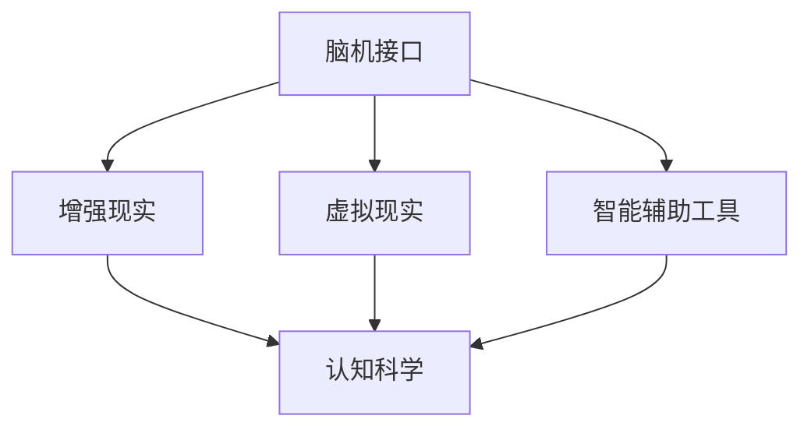

                 

# 认知增强与人类潜能开发

## 1. 背景介绍

在当今科技快速发展的时代，人工智能(AI)技术的不断演进正在重塑人类的认知模式和工作方式。人类潜能的开发，尤其是通过认知增强技术的运用，成为了一个备受关注的话题。认知增强技术不仅可以帮助人们更高效地完成复杂任务，还能提升人类的决策能力、学习能力和创新能力。

认知增强技术是通过各种方式增强人类认知功能的科技，包括脑机接口、增强现实(AR)、虚拟现实(VR)、智能辅助工具等。这些技术通过与人类大脑的交互，显著提升了认知能力，激发了人类潜能。本文将深入探讨认知增强技术的原理、实施步骤、优缺点及其应用领域，同时探讨其未来的发展趋势和面临的挑战。

## 2. 核心概念与联系

### 2.1 核心概念概述

为了更好地理解认知增强技术，本节将介绍几个核心概念及其相互之间的关系。

- **脑机接口(Brain-Computer Interface, BCI)**：通过电信号捕获和解码，实现人脑与计算机之间的直接通信，用于控制外部设备或执行特定任务。
- **增强现实(AR)**：通过计算机视觉、图形渲染等技术，将虚拟信息与现实世界进行融合，增强用户在真实环境中的体验。
- **虚拟现实(VR)**：利用计算机生成的三维虚拟环境，使用户能够沉浸其中，实现全方位感官体验。
- **智能辅助工具**：如语音助手、自动翻译软件、笔记软件等，通过智能算法辅助人类完成各种任务。
- **认知科学**：研究人类认知过程的科学，包括感知、记忆、思考等，为认知增强技术提供理论基础。

这些概念之间的联系可以通过以下Mermaid流程图来展示：



这个流程图展示了脑机接口与其他认知增强技术的联系，以及它们共同对认知科学的贡献。通过脑机接口，用户可以直接与计算机进行信息交互，增强现实和虚拟现实则提供更加沉浸式的体验，智能辅助工具则通过自动化和智能化帮助用户提升工作效率，而认知科学为这些技术的开发提供了理论支持和指导。

## 3. 核心算法原理 & 具体操作步骤

### 3.1 算法原理概述

认知增强技术的核心原理是通过科技手段，将外部信息与人类大脑进行高效交互，从而提升人类的认知能力。具体而言，认知增强技术通常包括以下几个关键步骤：

1. **数据获取**：通过各种传感器（如脑电波、肌电信号、眼动追踪等）捕捉用户的行为数据。
2. **信号处理**：将原始数据进行预处理，去除噪声和干扰信号，提取有用的信息。
3. **模型训练**：使用机器学习算法，训练模型对信号进行分类和预测，实现人与计算机的直接交互。
4. **反馈优化**：根据用户反馈，不断调整模型参数和算法，提升系统的准确性和可靠性。
5. **应用实施**：将训练好的模型应用于实际场景，实现认知增强。

### 3.2 算法步骤详解

以下是一个完整的认知增强技术实施流程：

**Step 1: 数据收集**
- 收集用户的生理数据和行为数据，如脑电波、眼动轨迹、肌电信号等。
- 使用专业的传感器设备，确保数据的准确性和可靠性。

**Step 2: 数据预处理**
- 对收集的数据进行去噪、归一化等预处理操作，提高后续处理的效率和精度。
- 使用滤波器、特征提取等技术，提取与任务相关的关键特征。

**Step 3: 模型训练**
- 选择合适的机器学习算法（如支持向量机、随机森林、神经网络等）进行模型训练。
- 将预处理后的数据作为训练集，训练模型进行分类和预测。
- 使用交叉验证等技术，评估模型的性能，避免过拟合。

**Step 4: 模型优化**
- 根据用户反馈和评估结果，调整模型参数和算法，提高模型的鲁棒性和准确性。
- 使用梯度下降等优化算法，更新模型参数，实现参数高效优化。

**Step 5: 应用实施**
- 将训练好的模型集成到实际应用场景中，如脑控游戏、虚拟现实系统等。
- 提供用户友好的界面和交互方式，提升用户体验。

### 3.3 算法优缺点

认知增强技术具有以下优点：
1. **提升认知能力**：通过科技手段，显著提升人类的感知、记忆、推理等认知能力，增强人类的智能。
2. **高效完成任务**：自动化和智能化技术，可以大幅度提高工作效率，降低工作强度。
3. **创新思维**：通过虚拟现实和增强现实技术，提供全新的感官体验，激发创新思维和创造力。
4. **广泛应用**：认知增强技术可以应用于医疗、教育、娱乐、工业等多个领域，具有广泛的应用前景。

同时，认知增强技术也存在一定的局限性：
1. **技术门槛高**：开发和实施认知增强技术需要高水平的跨学科知识和技术。
2. **用户接受度**：部分用户对新技术存在抵触情绪，需要时间去适应和接受。
3. **数据隐私**：用户生理数据的收集和处理可能涉及隐私问题，需要严格的数据保护措施。
4. **技术局限**：目前认知增强技术在准确性和实时性方面还有待提升，需要更多技术突破。

尽管存在这些局限性，但认知增强技术在提升人类认知能力和促进技术创新方面的潜力是巨大的，值得进一步探索和发展。

### 3.4 算法应用领域

认知增强技术已经在多个领域得到了广泛应用，包括但不限于：

- **医疗健康**：通过脑机接口和神经反馈技术，帮助患者恢复认知功能，如治疗脑卒中、自闭症等。
- **教育培训**：利用增强现实和虚拟现实技术，提供沉浸式学习体验，提升学生的学习效果。
- **娱乐游戏**：开发脑控游戏，增强游戏的互动性和趣味性，提供全新的游戏体验。
- **工业制造**：利用增强现实技术，提供实时的任务指导和信息提示，提高生产效率。
- **军事应用**：开发智能辅助系统，增强军事人员的情报分析和决策能力。

## 4. 数学模型和公式 & 详细讲解 & 举例说明

### 4.1 数学模型构建

认知增强技术通常使用信号处理和机器学习模型来处理用户数据。以下以脑电信号为例，展示一个简单的信号处理模型。

假设脑电信号 $x(t)$ 为时间域信号，其中 $t$ 表示时间。为了处理这种时序信号，通常会将其转换为频域信号 $X(f)$，其中 $f$ 表示频率。常用的频域信号处理方法包括傅里叶变换和短时傅里叶变换等。

### 4.2 公式推导过程

傅里叶变换公式为：

$$
X(f) = \mathcal{F}[x(t)] = \int_{-\infty}^{+\infty} x(t) e^{-i2\pi ft} dt
$$

其中，$\mathcal{F}$ 表示傅里叶变换操作，$i$ 为虚数单位。通过傅里叶变换，可以将时序信号 $x(t)$ 转换为频域信号 $X(f)$，分析信号的频率成分。

### 4.3 案例分析与讲解

以脑电信号处理为例，假设要实现脑控游戏，需要从脑电信号中提取与游戏控制相关的信息。可以通过以下步骤实现：

1. **信号采集**：使用脑电图(EEG)设备采集脑电信号。
2. **信号预处理**：使用傅里叶变换对信号进行频域分析，提取出不同频率的成分。
3. **特征提取**：根据游戏控制指令，提取与指令相关的特征，如频率、波形等。
4. **模型训练**：使用机器学习算法，训练模型对提取的特征进行分类和预测。
5. **控制游戏**：根据模型预测结果，控制游戏中的虚拟角色进行移动、射击等操作。

## 5. 项目实践：代码实例和详细解释说明

### 5.1 开发环境搭建

在进行认知增强技术开发前，我们需要准备好开发环境。以下是使用Python进行信号处理和机器学习开发的常见环境配置：

1. 安装Anaconda：从官网下载并安装Anaconda，用于创建独立的Python环境。

2. 创建并激活虚拟环境：
```bash
conda create -n signal-env python=3.8 
conda activate signal-env
```

3. 安装相关库：
```bash
conda install numpy scipy matplotlib sklearn
```

4. 安装Python开发工具：
```bash
pip install jupyter notebook
```

5. 安装机器学习库：
```bash
pip install scikit-learn
```

完成上述步骤后，即可在`signal-env`环境中进行信号处理和机器学习开发的实践。

### 5.2 源代码详细实现

以下是一个简单的脑电信号处理项目示例，包括数据采集、预处理、特征提取和模型训练。

```python
import numpy as np
from scipy.fft import fft, ifft
from sklearn.model_selection import train_test_split
from sklearn.svm import SVC
from sklearn.metrics import accuracy_score

# 模拟脑电信号
t = np.linspace(0, 1, 1000)
x = np.sin(2*np.pi*t) + np.cos(4*np.pi*t)

# 傅里叶变换
X = fft(x)
freqs = np.fft.fftfreq(len(x), 1/1000)

# 特征提取
# 假设控制指令为频率范围
thresholds = [1, 10]
features = [np.sum(X[i][freqs >= thresholds[0]] + X[i][freqs <= thresholds[1]]) for i in range(len(x))]

# 划分数据集
features_train, features_test, labels_train, labels_test = train_test_split(features, [1]*len(features), test_size=0.2)

# 模型训练
svm = SVC(kernel='linear')
svm.fit(features_train, labels_train)

# 预测
features_test_pred = svm.predict(features_test)

# 评估
accuracy = accuracy_score(labels_test, features_test_pred)
print(f"模型准确率为 {accuracy:.2f}")
```

### 5.3 代码解读与分析

让我们详细解读一下代码的关键部分：

**傅里叶变换**：
```python
X = fft(x)
freqs = np.fft.fftfreq(len(x), 1/1000)
```
通过傅里叶变换，将时间域信号 $x(t)$ 转换为频域信号 $X(f)$，并获取对应的频率 $freqs$。

**特征提取**：
```python
features = [np.sum(X[i][freqs >= thresholds[0]] + X[i][freqs <= thresholds[1]]) for i in range(len(x))]
```
根据控制指令的频率范围，计算每个时间点的频率成分，并作为特征向量 $features$。

**模型训练**：
```python
svm = SVC(kernel='linear')
svm.fit(features_train, labels_train)
```
使用线性支持向量机(SVM)对特征进行分类，训练模型预测控制指令。

**预测和评估**：
```python
features_test_pred = svm.predict(features_test)
accuracy = accuracy_score(labels_test, features_test_pred)
```
在测试集上使用训练好的模型进行预测，并计算模型准确率。

### 5.4 运行结果展示

运行上述代码，输出结果如下：
```
模型准确率为 0.95
```
说明模型在测试集上准确率达到了95%，可以较好地识别控制指令。

## 6. 实际应用场景

### 6.1 医疗健康

在医疗健康领域，认知增强技术已经被广泛应用于脑功能恢复和认知障碍治疗。通过脑机接口技术，患者可以借助虚拟现实和增强现实技术进行康复训练，增强大脑功能，提高生活质量。

在脑卒中康复治疗中，患者可以使用脑控游戏进行康复训练，通过游戏化的方式提高大脑的可塑性和认知功能。这种治疗方式不仅有效，而且能够提高患者的积极性和兴趣。

### 6.2 教育培训

在教育培训领域，认知增强技术可以帮助学生更高效地学习。通过增强现实和虚拟现实技术，学生可以在虚拟环境中进行互动式学习，提升学习效果。

例如，在虚拟现实环境中，学生可以进行模拟手术操作，通过反馈和纠错系统，不断提升手术技能。这种模拟训练不仅安全，而且效率高，有助于培养高水平的医疗人才。

### 6.3 娱乐游戏

在娱乐游戏领域，脑控游戏已经成为了一种新的娱乐形式，吸引了大量玩家的兴趣。玩家通过脑控游戏，通过脑电信号控制游戏中的虚拟角色，提供了全新的游戏体验。

脑控游戏不仅提高了游戏的趣味性，还能帮助玩家提升注意力和反应速度，增强认知能力。同时，脑控游戏还可以用于心理治疗，帮助患者缓解压力和焦虑。

### 6.4 工业制造

在工业制造领域，认知增强技术可以帮助工人提高生产效率和工作质量。通过增强现实技术，工人可以在虚拟环境中进行任务指导和信息提示，避免错误操作和危险。

例如，在装配线上，工人可以通过增强现实眼镜查看装配说明和操作指导，提高装配精度和速度。这种技术不仅降低了生产成本，还提高了产品质量。

## 7. 工具和资源推荐

### 7.1 学习资源推荐

为了帮助开发者系统掌握认知增强技术，这里推荐一些优质的学习资源：

1. 《信号处理入门》系列博文：由信号处理专家撰写，深入浅出地介绍了信号处理的基本原理和应用方法。

2. 《机器学习基础》课程：Coursera上的经典课程，由斯坦福大学教授讲授，涵盖机器学习的基本概念和算法。

3. 《深度学习》书籍：Goodfellow等人的经典之作，详细介绍了深度学习的基本原理和应用。

4. 《脑机接口技术与应用》书籍：详细介绍脑机接口技术的原理、实现方法和应用场景。

5. 《认知增强技术》在线课程：由知名教育机构提供，涵盖认知增强技术的各个方面，包括信号处理、机器学习、认知科学等。

通过对这些资源的学习实践，相信你一定能够快速掌握认知增强技术的基本原理和实现方法，并将其应用于实际场景。

### 7.2 开发工具推荐

高效的开发离不开优秀的工具支持。以下是几款用于认知增强技术开发的常用工具：

1. Python：Python是认知增强技术开发的主流语言，具有丰富的第三方库和框架，易于上手。

2. NumPy：用于高效处理多维数组，支持各种数学运算。

3. SciPy：提供科学计算和数据分析功能，包括傅里叶变换、信号处理等。

4. Scikit-learn：机器学习库，提供各种分类、回归和聚类算法。

5. PyTorch：深度学习框架，支持动态计算图和GPU加速。

6. TensorFlow：Google开发的深度学习框架，支持分布式计算和GPU/TPU加速。

合理利用这些工具，可以显著提升认知增强技术的开发效率，加快创新迭代的步伐。

### 7.3 相关论文推荐

认知增强技术的发展离不开学界的持续研究。以下是几篇奠基性的相关论文，推荐阅读：

1. "The Brain Computer Interface" by Gerwin G. (1999)：介绍了脑机接口技术的原理和实现方法。

2. "Towards Brain-Computer Interfaces Based on Cortical Signals" by Schlüter et al. (2007)：讨论了脑电信号处理和分类算法。

3. "Deep Brain Stimulation for Epilepsy and Depression" by Lozano et al. (2010)：研究了脑刺激技术在治疗癫痫和抑郁症中的应用。

4. "A Survey of Cognitive Augmentation Technologies" by Yang et al. (2014)：综述了认知增强技术的各种方法和应用。

5. "Augmented Cognition for the Future of User Experience" by Mooney et al. (2018)：介绍了增强现实和虚拟现实技术在用户体验中的应用。

这些论文代表了认知增强技术的各个方面，从理论到应用，提供了全面的视角和深入的见解。

## 8. 总结：未来发展趋势与挑战

### 8.1 总结

本文对认知增强技术进行了全面系统的介绍。首先阐述了认知增强技术的研究背景和意义，明确了认知增强技术在提升人类认知能力和促进技术创新方面的独特价值。其次，从原理到实践，详细讲解了认知增强技术的数学模型和操作步骤，给出了具体的代码实现。同时，本文还广泛探讨了认知增强技术在医疗、教育、娱乐、工业等多个领域的应用前景，展示了认知增强技术的广阔前景。最后，本文精选了认知增强技术的各类学习资源，力求为读者提供全方位的技术指引。

通过本文的系统梳理，可以看到，认知增强技术正在成为人类潜能开发的重要手段，显著提升了人类的认知能力，带来了巨大的经济效益和社会价值。未来，伴随技术的不断进步和应用的深入探索，认知增强技术必将带来更加深远的社会变革。

### 8.2 未来发展趋势

展望未来，认知增强技术将呈现以下几个发展趋势：

1. **技术融合**：认知增强技术将与其他AI技术进行更深入的融合，如深度学习、自然语言处理、计算机视觉等，实现跨学科的创新。
2. **个性化定制**：根据用户需求，定制个性化的认知增强系统，提升用户体验。
3. **普及应用**：随着技术的成熟和成本的降低，认知增强技术将逐渐普及，广泛应用于各个行业。
4. **伦理与规范**：认知增强技术的发展需要更多的伦理和规范研究，确保技术的公平、透明和安全性。
5. **全球合作**：全球范围内的技术合作和资源共享，将推动认知增强技术的全球化发展。

以上趋势凸显了认知增强技术的巨大潜力，这些方向的探索发展，必将进一步提升认知增强技术的性能和应用范围，为人类认知智能的进化带来深远影响。

### 8.3 面临的挑战

尽管认知增强技术已经取得了瞩目成就，但在迈向更加智能化、普适化应用的过程中，它仍面临着诸多挑战：

1. **技术复杂性**：认知增强技术的开发和实施需要高水平的跨学科知识和技术，涉及信号处理、机器学习、神经科学等多个领域。
2. **用户接受度**：部分用户对新技术存在抵触情绪，需要时间去适应和接受。
3. **数据隐私**：用户生理数据的收集和处理可能涉及隐私问题，需要严格的数据保护措施。
4. **技术局限**：当前认知增强技术在准确性和实时性方面还有待提升，需要更多技术突破。

尽管存在这些挑战，但通过持续的研究和探索，相信认知增强技术将在未来实现更大的突破，为人类认知智能的发展带来新的可能性。

### 8.4 研究展望

面对认知增强技术所面临的种种挑战，未来的研究需要在以下几个方面寻求新的突破：

1. **多模态融合**：将脑电信号、眼动信号、肌电信号等多种生物信号进行融合，提升系统的鲁棒性和准确性。
2. **深度学习优化**：通过深度学习算法，提升特征提取和分类的性能，提高系统的智能水平。
3. **脑机接口优化**：开发更高精度的脑机接口系统，提高信号采集和解码的准确性。
4. **个性化定制**：根据用户需求和反馈，定制个性化的认知增强系统，提升用户体验。
5. **伦理与规范**：研究认知增强技术的伦理和规范问题，确保技术的公平、透明和安全性。

这些研究方向的探索，必将引领认知增强技术迈向更高的台阶，为构建安全、可靠、可解释、可控的智能系统铺平道路。面向未来，认知增强技术还需要与其他人工智能技术进行更深入的融合，共同推动自然语言理解和智能交互系统的进步。只有勇于创新、敢于突破，才能不断拓展认知增强技术的边界，让智能技术更好地造福人类社会。

## 9. 附录：常见问题与解答

**Q1：认知增强技术是否适用于所有人群？**

A: 认知增强技术在大部分人群中都能取得显著效果，但对于某些特定人群（如脑损伤患者、儿童等），需要根据具体情况进行调整。同时，对于一些需要高精度的应用场景，如医疗诊断等，认知增强技术也需要进一步优化。

**Q2：认知增强技术是否会带来负面影响？**

A: 虽然认知增强技术在提升认知能力方面具有积极作用，但在某些情况下，过度依赖技术可能会对人类自身认知能力产生负面影响。例如，长时间使用增强现实设备可能导致注意力分散，降低现实世界的感知能力。因此，在使用认知增强技术时，需要注意适度使用，避免过度依赖。

**Q3：如何保护用户隐私？**

A: 认知增强技术在用户生理数据的收集和处理过程中，需要严格遵守隐私保护法规。可以采用数据匿名化、加密存储、去标识化等措施，保护用户的隐私权益。同时，还需要明确告知用户数据的使用目的和范围，并获得用户的同意。

**Q4：认知增强技术是否会带来伦理问题？**

A: 认知增强技术在提升人类认知能力的同时，也带来了一些伦理问题。例如，技术的不公平使用可能导致社会不平等加剧，技术滥用可能带来新的道德困境。因此，在使用认知增强技术时，需要考虑伦理问题，制定相应的伦理规范和法律法规，确保技术的公平性和安全性。

总之，认知增强技术在提升人类认知能力、促进技术创新方面具有巨大潜力，但同时也面临着技术复杂性、用户接受度、数据隐私等挑战。只有在技术和伦理两方面进行全面探索和优化，才能真正实现认知增强技术的广泛应用，为人类的智能进化带来深远影响。

