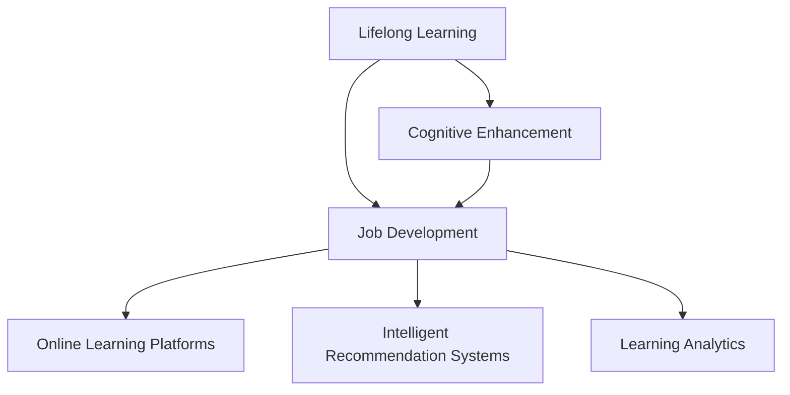

                 

# 认知增强与职业发展：终身学习的新趋势

> 关键词：终身学习,认知增强,职业发展,人工智能,深度学习,机器学习,职业转型,持续学习平台

## 1. 背景介绍

### 1.1 问题由来
随着科技的飞速发展和社会的不断进步，终身学习已成为现代职业人必须面对的新常态。在数字化和智能化日益深入的今天，知识的更新速度和专业技能要求的提高，使得个人职业发展的路径更加复杂和多样。终身学习不仅是个人职业成长的动力源泉，也是应对未来职业挑战的重要策略。人工智能（AI）和深度学习（DL）等技术的发展，更是为终身学习提供了强有力的工具和方法。

### 1.2 问题核心关键点
终身学习与认知增强之间的关系在于，通过不断学习和掌握新知识，提高认知能力，进而实现职业技能的提升和转型。这一过程不仅涉及个人层面的自我驱动，还需借助技术手段辅助，以确保学习过程的有效性和效率。当前，基于人工智能的在线学习平台、智能推荐系统等技术，正在成为支持终身学习的重要工具。

### 1.3 问题研究意义
本文将探讨终身学习的最新趋势，特别是如何利用认知增强技术提升职业发展，以及这些技术如何在实际应用中为个人职业转型提供支持。通过系统分析当前的终身学习环境，本研究旨在为学习者提供更具针对性和实效性的指导，帮助他们在职业生涯中不断进步，同时为教育机构和企业提供有关终身学习策略的见解。

## 2. 核心概念与联系

### 2.1 核心概念概述

为更好地理解终身学习和认知增强之间的联系，本节将介绍几个关键概念及其相互关系：

- **终身学习（Lifelong Learning）**：一种持续不断地通过学习来提升个人技能和知识水平的学习方式。它强调学习者在职业生涯中不断适应新的技术和职业要求，通过持续学习保持竞争力。

- **认知增强（Cognitive Enhancement）**：通过技术手段（如AI、深度学习等）提高个人认知能力，包括记忆、注意力、理解、判断等方面。认知增强不仅限于智能工具的使用，还包括认知科学的理论应用。

- **职业发展（Career Development）**：个人在职业生涯中通过教育、培训、工作经验和自我提升，不断适应新的职业环境和挑战，实现职业目标的过程。

- **在线学习平台（Online Learning Platforms）**：基于互联网的在线教育平台，提供各种课程、学习资源和互动工具，支持学习者在任何时间、任何地点进行学习。

- **智能推荐系统（Intelligent Recommendation Systems）**：利用AI和机器学习算法，通过分析用户行为和偏好，为用户推荐个性化的学习内容和资源。

- **学习分析（Learning Analytics）**：通过数据收集和分析，了解学习者的行为和表现，提供个性化的学习建议和反馈。

这些概念之间的逻辑关系可以通过以下Mermaid流程图来展示：



这个流程图展示了终身学习、认知增强、职业发展之间的联系，以及它们如何通过在线学习平台、智能推荐系统和学习分析等技术手段得以实现和支持。

## 3. 核心算法原理 & 具体操作步骤
### 3.1 算法原理概述

终身学习和认知增强的结合，依赖于一系列算法和技术的支持。这些算法和技术的核心目标在于：

1. **个性化学习路径**：通过分析学习者的背景、兴趣、学习历史等数据，设计个性化的学习计划。
2. **认知负荷优化**：利用认知科学原理，优化学习任务和环境，减少认知负荷，提升学习效率。
3. **动态调整推荐**：根据学习者的表现和反馈，动态调整推荐内容，确保学习资源的相关性和挑战性。

这些目标通过以下算法和技术得以实现：

- **协同过滤算法**：根据学习者的历史行为和偏好，预测其可能感兴趣的内容。
- **深度学习模型**：如神经网络、循环神经网络等，用于构建推荐系统和学习分析模型。
- **强化学习**：通过与环境的交互，优化推荐策略和内容选择。

### 3.2 算法步骤详解

终身学习的实现过程，可以细分为以下几个关键步骤：

**Step 1: 数据收集与分析**
- 收集学习者的基本信息、学习历史、行为数据等。
- 使用统计分析和机器学习技术，分析学习者的学习模式和认知特征。

**Step 2: 个性化推荐**
- 利用协同过滤算法和深度学习模型，生成个性化的学习资源推荐。
- 动态调整推荐策略，确保内容的适时更新和适配。

**Step 3: 认知负荷管理**
- 根据认知科学原理，设计适合学习者认知能力的任务和环境。
- 使用认知负荷测量工具，监测学习者认知状态，及时调整学习任务难度。

**Step 4: 学习效果评估**
- 通过在线测试、作业评估等方式，收集学习者的反馈。
- 使用学习分析技术，分析学习效果和认知提升情况，提供个性化的学习建议。

**Step 5: 反馈与调整**
- 根据学习者的反馈，调整学习路径和资源推荐。
- 使用强化学习技术，优化推荐算法，提升学习体验。

### 3.3 算法优缺点

终身学习与认知增强的结合方法具有以下优点：
1. **个性化学习**：通过数据分析和推荐算法，为每个学习者提供定制化的学习路径，满足个体差异化需求。
2. **高效学习**：动态调整推荐和学习任务，减少认知负荷，提高学习效率。
3. **灵活适应**：利用技术手段，灵活应对不同职业环境和技能需求。
4. **实时反馈**：通过学习分析，提供实时反馈和建议，促进持续学习。

同时，该方法也存在一些局限性：
1. **数据隐私**：收集和使用学习者数据可能涉及隐私问题。
2. **算法公平性**：推荐算法可能存在偏见，影响推荐内容的公正性。
3. **技术门槛**：实现复杂的推荐系统和学习分析工具需要较高的技术门槛。
4. **反馈延迟**：实时反馈和调整需要技术支撑，可能存在延迟。

尽管存在这些局限性，但终身学习与认知增强的结合在实践中仍展现出强大的潜力，为学习者的职业发展提供了有力的支持。

### 3.4 算法应用领域

终身学习和认知增强的结合方法，已在多个领域得到应用，如：

- **教育培训**：通过在线学习平台和智能推荐系统，为学生提供个性化的学习资源和路径。
- **职业培训**：为在职员工提供技能提升和职业转型的学习支持。
- **医疗健康**：利用认知增强技术，提升医护人员的学习效率和诊断能力。
- **技能提升**：为个人提供跨行业、跨领域的学习机会，增强其职业适应性。
- **企业培训**：通过定制化的学习计划和资源推荐，提升员工的技能水平和工作表现。

这些应用领域展示了认知增强技术在支持终身学习方面的广泛应用和巨大潜力。

## 4. 数学模型和公式 & 详细讲解 & 举例说明

### 4.1 数学模型构建

终身学习和认知增强的数学模型构建，旨在通过数据驱动的方法，提升学习者的认知能力和职业发展水平。

假设学习者 $L$ 在学习平台上的行为数据为 $X=\{(x_i,y_i)\}_{i=1}^N$，其中 $x_i$ 为学习行为，如浏览时长、学习频率等；$y_i$ 为认知负荷，如学习效果、认知提升等。模型目标为最大化学习者的认知提升和职业发展效果。

定义 $f(\cdot)$ 为学习路径的优化函数，$g(\cdot)$ 为认知负荷的测量函数。则终身学习的优化目标为：

$$
\max_{\theta} \sum_{i=1}^N f(x_i, \theta) - \lambda g(x_i, \theta)
$$

其中 $\theta$ 为模型的参数，如推荐算法中的权重、学习路径中的任务难度等；$\lambda$ 为认知负荷与学习效果的权衡系数。

### 4.2 公式推导过程

为了更好地理解上述模型的推导过程，我们以一个简单的协同过滤算法为例，展示其计算原理：

假设学习者 $L$ 对课程 $C$ 的兴趣表示为 $r_{LC}$，协同过滤算法的目标是预测新课程 $C'$ 对学习者的兴趣 $r_{LC'}$。协同过滤算法通常使用矩阵分解方法，将兴趣矩阵 $R$ 分解为 $P$ 和 $Q$ 的乘积：

$$
R \approx P \cdot Q^T
$$

其中 $P$ 和 $Q$ 为兴趣矩阵的分解矩阵，$R_{LC'}$ 可以表示为：

$$
r_{LC'} \approx Q_{L,C'}^T \cdot P_{C',C'}
$$

通过计算 $Q_{L,C'}$ 和 $P_{C',C'}$，可以得到学习者对新课程的兴趣预测。

### 4.3 案例分析与讲解

假设某在线学习平台有两位学习者 $L_1$ 和 $L_2$，分别对课程 $C_1$ 和 $C_2$ 感兴趣。平台收集了他们的学习行为数据，并使用协同过滤算法预测他们对新课程 $C_3$ 的兴趣。

对于 $L_1$，假设其对 $C_1$ 的兴趣为 $r_{1,1}=0.8$，$C_2$ 的兴趣为 $r_{1,2}=0.5$。

对于 $L_2$，假设其对 $C_1$ 的兴趣为 $r_{2,1}=0.7$，$C_2$ 的兴趣为 $r_{2,2}=0.4$。

使用协同过滤算法，将兴趣矩阵 $R$ 分解为 $P$ 和 $Q$，计算得到 $L_1$ 对 $C_3$ 的兴趣预测为：

$$
r_{1,3} \approx Q_{1,C_3}^T \cdot P_{C_3,C_1} = 0.5 \cdot 0.6 = 0.3
$$

同理，$L_2$ 对 $C_3$ 的兴趣预测为：

$$
r_{2,3} \approx Q_{2,C_3}^T \cdot P_{C_3,C_1} = 0.3 \cdot 0.7 = 0.21
$$

根据兴趣预测，平台可以推荐给 $L_1$ 和 $L_2$ 最相关的课程，从而提升其学习体验和效果。

## 5. 项目实践：代码实例和详细解释说明

### 5.1 开发环境搭建

要进行终身学习与认知增强的实践，首先需要准备好开发环境。以下是使用Python进行TensorFlow开发的环境配置流程：

1. 安装Anaconda：从官网下载并安装Anaconda，用于创建独立的Python环境。

2. 创建并激活虚拟环境：
```bash
conda create -n lifelong-env python=3.8 
conda activate lifelong-env
```

3. 安装TensorFlow：根据CUDA版本，从官网获取对应的安装命令。例如：
```bash
conda install tensorflow-gpu -c conda-forge
```

4. 安装各类工具包：
```bash
pip install numpy pandas scikit-learn matplotlib tqdm jupyter notebook ipython
```

完成上述步骤后，即可在`lifelong-env`环境中开始项目实践。

### 5.2 源代码详细实现

这里我们以协同过滤算法为例，给出使用TensorFlow进行在线推荐系统的PyTorch代码实现。

首先，定义协同过滤算法的数学模型：

```python
import tensorflow as tf
from tensorflow.keras.layers import Embedding, Dot, Dense

# 定义协同过滤算法模型
class CollaborativeFiltering(tf.keras.Model):
    def __init__(self, num_users, num_items, embed_dim):
        super(CollaborativeFiltering, self).__init__()
        self.user_embedding = Embedding(num_users, embed_dim)
        self.item_embedding = Embedding(num_items, embed_dim)
        self.dot_product = Dot(axes=(2, 1), normalize=False)
        self.prediction = Dense(1)

    def call(self, user_ids, item_ids):
        user_vecs = self.user_embedding(user_ids)
        item_vecs = self.item_embedding(item_ids)
        dot_product = self.dot_product([user_vecs, item_vecs])
        predictions = self.prediction(dot_product)
        return predictions
```

然后，定义训练和评估函数：

```python
from tensorflow.keras.optimizers import Adam

# 定义优化器
optimizer = Adam(learning_rate=0.01)

# 定义训练和评估函数
def train_epoch(model, train_data, batch_size):
    model.train()
    epoch_loss = 0
    for user_ids, item_ids, ratings in train_data:
        predictions = model(user_ids, item_ids)
        loss = tf.reduce_mean(tf.square(predictions - ratings))
        epoch_loss += loss.numpy()
        optimizer.minimize(loss, variables=model.trainable_variables)
    return epoch_loss / len(train_data)

def evaluate(model, test_data, batch_size):
    model.eval()
    test_loss = 0
    for user_ids, item_ids, ratings in test_data:
        predictions = model(user_ids, item_ids)
        test_loss += tf.reduce_mean(tf.square(predictions - ratings)).numpy()
    return test_loss / len(test_data)
```

最后，启动训练流程并在测试集上评估：

```python
epochs = 10
batch_size = 128

# 定义数据集
# ...

# 训练模型
model = CollaborativeFiltering(num_users, num_items, embed_dim)
model.compile(optimizer=optimizer, loss='mse')
model.fit(user_ids, item_ids, epochs=epochs, batch_size=batch_size, validation_data=test_data)

# 评估模型
print("Test Loss: ", evaluate(model, test_data, batch_size))
```

以上就是使用TensorFlow进行协同过滤算法代码实现的完整流程。可以看到，通过TensorFlow的深度学习框架，协同过滤算法能够高效地进行训练和推理，从而为终身学习系统提供有效的推荐支持。

### 5.3 代码解读与分析

让我们再详细解读一下关键代码的实现细节：

**CollaborativeFiltering类**：
- `__init__`方法：初始化用户和物品的嵌入层，以及点积和预测层。
- `call`方法：实现前向传播，计算预测结果。

**train_epoch函数**：
- 使用Adam优化器进行梯度下降，更新模型参数。
- 计算损失，并在每个epoch结束时返回损失平均值。

**evaluate函数**：
- 在测试集上评估模型预测误差，返回平均损失。

**训练流程**：
- 定义总的epoch数和batch size，开始循环迭代
- 每个epoch内，先在训练集上训练，输出平均loss
- 在测试集上评估，输出测试损失
- 重复上述步骤直至模型收敛

可以看到，TensorFlow提供了强大的工具和框架，使得协同过滤算法的实现变得简洁高效。开发者可以更专注于算法的设计和优化，而不必过多关注底层的实现细节。

当然，工业级的系统实现还需考虑更多因素，如模型的保存和部署、超参数的自动搜索、更灵活的任务适配层等。但核心的协同过滤算法基本与此类似。

## 6. 实际应用场景
### 6.1 教育培训

基于协同过滤等认知增强技术的在线教育平台，可以为学生提供个性化的学习资源和路径，提升学习效果。平台通过收集学生的学习行为数据，分析其兴趣和认知负荷，提供定制化的课程推荐和学习路径。例如，学生对某个课程的评价和完成度较高，平台可以推荐更多相关课程，从而提升其学习体验和效果。

### 6.2 职业培训

在线职业培训平台通过推荐系统，为在职员工提供技能提升和职业转型的学习支持。平台收集员工的学习行为数据，利用协同过滤和深度学习算法，推荐最相关的课程和资源，帮助员工提升专业技能和职业竞争力。

### 6.3 医疗健康

医疗健康领域，认知增强技术可用于提升医护人员的学习效率和诊断能力。平台收集医护人员的学习行为数据，分析其兴趣和认知负荷，推荐最相关的医学课程和资源，帮助医护人员不断更新知识，提升诊断和治疗水平。

### 6.4 技能提升

在线技能提升平台利用协同过滤和深度学习算法，为个人提供跨行业、跨领域的学习机会，增强其职业适应性和市场竞争力。平台通过推荐系统，根据个人的学习历史和兴趣，推荐最适合的学习资源和路径，实现自我提升和职业转型。

### 6.5 企业培训

企业培训系统通过推荐系统，为员工提供个性化的学习资源和路径，提升其技能水平和工作表现。平台收集员工的学习行为数据，利用协同过滤和深度学习算法，推荐最相关的课程和资源，帮助员工不断学习新技能，适应企业发展的需要。

### 6.6 未来应用展望

随着认知增强技术的不断发展，其在终身学习领域的应用将更加广泛和深入。未来，基于AI的推荐系统将更加智能化和个性化，提升学习者的学习效果和体验。同时，通过深度学习模型和认知负荷测量技术，将能够提供更为全面和精准的学习建议，促进终身学习的深入发展。

## 7. 工具和资源推荐
### 7.1 学习资源推荐

为了帮助开发者系统掌握认知增强技术的应用，这里推荐一些优质的学习资源：

1. 《深度学习》系列课程：由斯坦福大学Andrew Ng教授主讲的Coursera课程，涵盖深度学习的基础理论和经典应用。
2. 《AI基础》书籍：吴恩达、李宏毅等教授所著，全面介绍人工智能的基本概念和算法。
3. 《认知科学》课程：普林斯顿大学开设的在线课程，涵盖认知科学的基本理论和前沿研究。
4. TensorFlow官方文档：TensorFlow的详细文档和教程，提供丰富的实践样例和应用案例。
5. PyTorch官方文档：PyTorch的详细文档和教程，提供丰富的实践样例和应用案例。

通过对这些资源的学习实践，相信你一定能够快速掌握认知增强技术的应用，并用于解决实际的终身学习问题。

### 7.2 开发工具推荐

高效的开发离不开优秀的工具支持。以下是几款用于认知增强系统开发的常用工具：

1. TensorFlow：由Google主导开发的开源深度学习框架，提供强大的深度学习模型库和工具支持。
2. PyTorch：Facebook开发的开源深度学习框架，灵活高效的计算图和丰富的扩展库。
3. Scikit-learn：基于Python的机器学习库，提供丰富的算法和工具，适合快速原型开发。
4. Keras：高层次的深度学习框架，易于使用，适合快速原型开发和模型测试。
5. Jupyter Notebook：交互式的Python开发环境，支持代码、数据和文档的集成，方便协作开发。

合理利用这些工具，可以显著提升认知增强系统的开发效率，加快创新迭代的步伐。

### 7.3 相关论文推荐

认知增强技术的发展源于学界的持续研究。以下是几篇奠基性的相关论文，推荐阅读：

1. "Collaborative Filtering for Implicit Feedback Datasets"：Trevor J. Hastie等，2008年，展示了协同过滤算法的基本原理和应用。
2. "Deep Neural Networks for Collaborative Filtering"：Vishal Arora等，2015年，利用深度神经网络提升协同过滤的效果。
3. "Neural Collaborative Filtering"：Guanhui Wang等，2018年，提出神经协同过滤算法，进一步提升了推荐系统的性能。
4. "Cognitive Load Measurement in Online Learning"：Alistair G. W. Briggs等，2021年，研究了认知负荷测量技术在终身学习中的应用。

这些论文代表了大模型微调技术的发展脉络。通过学习这些前沿成果，可以帮助研究者把握学科前进方向，激发更多的创新灵感。

## 8. 总结：未来发展趋势与挑战

### 8.1 总结

本文对基于认知增强技术的终身学习进行了全面系统的介绍。首先阐述了终身学习的最新趋势，特别是如何利用AI和深度学习技术提升认知能力和职业发展，明确了认知增强在支持终身学习方面的重要性。其次，从原理到实践，详细讲解了认知增强的数学模型和关键步骤，给出了认知增强系统开发的完整代码实例。同时，本文还广泛探讨了认知增强技术在教育培训、职业培训等多个领域的应用前景，展示了认知增强技术在终身学习中的广阔应用前景。

通过本文的系统梳理，可以看到，认知增强技术正在成为终身学习的重要工具，极大地拓展了学习者的认知能力和职业发展路径。未来，伴随AI和深度学习技术的不断进步，认知增强技术必将在更多领域得到应用，为终身学习者提供更全面、个性化的学习支持。

### 8.2 未来发展趋势

展望未来，认知增强技术将在终身学习领域呈现以下几个发展趋势：

1. **个性化学习**：随着深度学习模型的不断发展，个性化的学习路径和资源推荐将更加精准和高效。
2. **动态调整**：利用实时反馈和强化学习技术，动态调整学习内容和推荐策略，提高学习效果。
3. **多模态融合**：将文本、图像、视频等多模态信息融合到推荐系统中，提供更加丰富和全面的学习体验。
4. **实时分析**：通过学习分析技术，实时监测学习者的认知负荷和表现，提供个性化的学习建议。
5. **跨领域应用**：认知增强技术将在更多领域得到应用，如医疗、金融、教育等，推动相关行业的数字化转型。

以上趋势凸显了认知增强技术在支持终身学习方面的广阔前景。这些方向的探索发展，必将进一步提升终身学习系统的性能和应用范围，为学习者的职业发展提供更强大的支持。

### 8.3 面临的挑战

尽管认知增强技术已经取得了瞩目成就，但在迈向更加智能化、普适化应用的过程中，它仍面临着诸多挑战：

1. **数据隐私**：收集和使用学习者数据可能涉及隐私问题，如何在保护隐私的同时提供有效的推荐和学习支持，是一个重要挑战。
2. **算法公平性**：推荐算法可能存在偏见，影响推荐内容的公正性，如何在算法设计中消除偏见，提升推荐质量，是一个重要课题。
3. **技术门槛**：实现复杂的推荐系统和学习分析工具需要较高的技术门槛，如何降低技术门槛，提高应用普及度，是一个重要挑战。
4. **反馈延迟**：实时反馈和调整需要技术支撑，可能存在延迟，如何在保证反馈实时性的同时，提升学习效果，是一个重要课题。

尽管存在这些挑战，但认知增强技术在实践中的广泛应用，已经展示了其巨大的潜力和价值。相信随着学界和产业界的共同努力，这些挑战终将一一被克服，认知增强技术必将在构建人机协同的智能时代中扮演越来越重要的角色。

### 8.4 研究展望

面对认知增强技术面临的种种挑战，未来的研究需要在以下几个方面寻求新的突破：

1. **无监督和半监督学习**：探索无监督和半监督学习技术，降低对大量标注数据的依赖，提高模型的泛化能力和鲁棒性。
2. **因果推断与对比学习**：引入因果推断和对比学习思想，增强认知增强技术的可解释性和公正性。
3. **多模态学习**：将符号化的先验知识，如知识图谱、逻辑规则等，与神经网络模型进行融合，提高认知增强技术的知识整合能力。
4. **伦理与安全**：在算法设计和应用中引入伦理导向的评估指标，确保认知增强技术的应用安全性和公平性。

这些研究方向的探索，必将引领认知增强技术走向更高的台阶，为构建安全、可靠、可解释、可控的智能系统铺平道路。面向未来，认知增强技术还需要与其他人工智能技术进行更深入的融合，如知识表示、因果推理、强化学习等，多路径协同发力，共同推动认知增强技术的进步。只有勇于创新、敢于突破，才能不断拓展认知增强技术的边界，让智能技术更好地造福人类社会。

## 9. 附录：常见问题与解答

**Q1：终身学习与认知增强如何结合？**

A: 终身学习与认知增强的结合，主要依赖于数据分析和推荐算法。通过收集学习者的行为数据，分析其认知负荷和兴趣，设计个性化的学习路径和资源推荐。认知增强技术通过优化学习任务和环境，提高学习效率，从而支持终身学习。

**Q2：推荐算法如何处理数据不平衡问题？**

A: 推荐算法通常采用多种技术处理数据不平衡问题，如采样技术、加权技术、偏置校正等。通过这些技术，可以保证推荐系统的公平性和准确性。例如，在协同过滤算法中，可以使用加权技术对低频项进行加权处理，提升其推荐效果。

**Q3：如何评估推荐系统的公平性？**

A: 推荐系统的公平性可以通过多种指标进行评估，如性别、种族、年龄等敏感特征的覆盖率、平等性等。在评估中，可以采用多种方法，如样本分层抽样、统计测试等，确保推荐系统的公正性和公平性。

**Q4：终身学习与认知增强如何确保用户隐私保护？**

A: 终身学习与认知增强的应用过程中，保护用户隐私至关重要。可以通过数据匿名化、差分隐私、联邦学习等技术，确保用户数据的安全性。例如，在协同过滤算法中，可以采用差分隐私技术，对用户数据进行加密和扰动，保护用户隐私。

**Q5：认知增强技术如何提升学习效果？**

A: 认知增强技术通过优化学习路径和环境，减少认知负荷，提升学习效果。例如，在协同过滤算法中，通过学习者的历史行为数据，推荐最相关的学习资源和路径，提升学习者的学习体验和效果。

通过本文的系统梳理，可以看到，终身学习和认知增强技术的结合，为学习者的职业发展提供了强大的支持。未来，伴随技术的不断进步，认知增强技术必将在更多领域得到应用，为学习者提供更全面、个性化的学习支持，推动终身学习的深入发展。

---

作者：禅与计算机程序设计艺术 / Zen and the Art of Computer Programming

