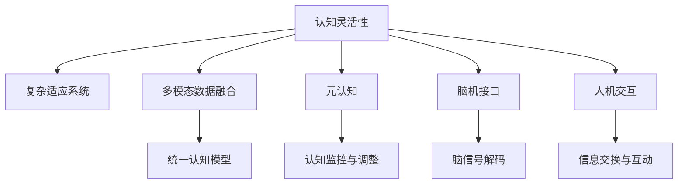

                 

# 认知灵活性：应对复杂世界的核心能力

> 关键词：认知灵活性,认知神经科学,复杂适应系统,多模态数据融合,元认知,脑机接口,人机交互

## 1. 背景介绍

### 1.1 问题由来
在快速变化、信息爆炸的21世纪，人们面临的环境日益复杂多变。从全球政治经济的波动，到科技创新浪潮的兴起，再到个人生活和工作节奏的不断加速，都在对人类认知能力提出更高的要求。如何提高认知灵活性，即在变化莫测的环境中快速适应和解决问题，成为现代社会的一大挑战。

认知灵活性，也称为"认知适应性"，指个体在面对新的或未知的信息时，能够快速、有效地调整认知策略和方法，以适应新情境的能力。这一能力对于个人发展和组织绩效至关重要。

### 1.2 问题核心关键点
认知灵活性的核心在于：
1. **信息整合**：能将不同来源的信息整合起来，构建出连贯一致的认知模型。
2. **认知策略调整**：能在不同情境下，根据任务需求调整认知策略。
3. **元认知监控**：能自我监控认知过程，及时调整策略，以适应新信息。
4. **多模态融合**：能在不同模态（如视觉、听觉、触觉等）之间灵活切换和融合信息。
5. **跨领域知识迁移**：能将一种领域的知识迁移到其他领域，解决跨界问题。

近年来，随着认知神经科学和计算认知科学的迅猛发展，认知灵活性的实现方法不断涌现。从基于神经网络的计算模型，到新型脑机接口技术的融合，认知灵活性得到了前所未有的技术支持。

## 2. 核心概念与联系

### 2.1 核心概念概述

为更好地理解认知灵活性及其技术实现，本节将介绍几个关键概念：

- **认知灵活性**：指个体在面对新信息时，能够快速、有效地调整认知策略和方法，以适应新情境的能力。
- **复杂适应系统**：指在复杂环境中，能够通过与环境的相互作用，不断调整自身行为和结构以适应的系统。
- **多模态数据融合**：指将来自不同模态（视觉、听觉、触觉等）的数据进行整合，构建出统一的认知模型。
- **元认知**：指个体对自己的认知过程和结果的认识与控制。
- **脑机接口**：指通过计算机对脑信号进行解码，实现脑与机之间的直接通信。
- **人机交互**：指通过计算机等智能设备，实现人机之间的信息交换和互动。

这些概念之间的关系可以用以下Mermaid流程图来展示：



这个流程图展示了几大核心概念及其之间的关系：

1. **认知灵活性**：最终目标是使个体能在复杂环境中灵活适应，是所有概念的核心。
2. **复杂适应系统**：为实现认知灵活性，个体需像复杂适应系统一样，通过与环境的互动不断调整自身。
3. **多模态数据融合**：为更好地理解环境，个体需要整合多模态信息。
4. **元认知**：为调整认知策略，个体需要自我监控和调节认知过程。
5. **脑机接口**：为获取和处理脑信号，实现精确的认知监控。
6. **人机交互**：为实现信息交流和互动，个体需要与智能设备进行协作。

这些概念共同构成了认知灵活性的理论框架，为认知灵活性的技术实现提供了指导。

## 3. 核心算法原理 & 具体操作步骤
### 3.1 算法原理概述

实现认知灵活性，可以从以下几个方面进行算法设计：

1. **基于神经网络的计算模型**：构建能学习并适应新信息的神经网络模型，通过不断的训练和优化，提升其认知灵活性。
2. **多模态数据融合算法**：设计算法将不同模态的信息进行整合，构建统一的认知模型。
3. **元认知监控算法**：开发算法使个体能自我监控认知过程，及时调整策略。
4. **脑机接口解码算法**：通过脑信号解码，实现对认知过程的精确监控和控制。
5. **人机交互界面**：设计界面，使个体能与智能设备进行高效互动，获取和提供信息。

这些算法共同构成了一个完整的认知灵活性实现框架，下面将详细介绍每个部分。

### 3.2 算法步骤详解

#### 3.2.1 基于神经网络的计算模型

构建基于神经网络的计算模型，需遵循以下步骤：

1. **选择模型架构**：选择适合问题的神经网络架构，如卷积神经网络(CNN)、循环神经网络(RNN)、变压器(Transformer)等。
2. **数据准备**：收集与问题相关的多模态数据，如图像、文本、音频等。
3. **模型训练**：将数据分为训练集和测试集，使用反向传播算法训练模型，优化损失函数。
4. **模型验证**：在验证集上评估模型性能，调整模型参数以提高准确性。
5. **模型应用**：将训练好的模型应用于新数据，预测结果。

#### 3.2.2 多模态数据融合算法

多模态数据融合算法需整合不同模态的数据，构建统一的认知模型。具体步骤如下：

1. **特征提取**：从不同模态中提取特征，如从图像中提取特征图，从文本中提取词向量，从音频中提取梅尔频谱图等。
2. **特征融合**：使用加权平均、主成分分析(PCA)、多维缩放(MDS)等方法，将不同模态的特征进行融合。
3. **模型构建**：将融合后的特征输入到神经网络模型中，构建统一的认知模型。

#### 3.2.3 元认知监控算法

元认知监控算法需使个体能自我监控认知过程，及时调整策略。具体步骤如下：

1. **监控策略**：设计策略监控算法，如注意力跟踪、认知负荷评估等，实时监测个体认知过程。
2. **反馈机制**：根据监控结果，反馈给个体，使其能及时调整认知策略。
3. **调整策略**：根据反馈信息，调整认知策略，如改变注意焦点、调整学习节奏等。

#### 3.2.4 脑机接口解码算法

脑机接口解码算法需将脑信号解码为认知过程，实现对认知过程的精确监控。具体步骤如下：

1. **脑信号采集**：使用脑电图(EEG)、功能性磁共振成像(fMRI)等设备，采集脑信号。
2. **信号预处理**：对采集的信号进行预处理，如滤波、降噪、归一化等。
3. **特征提取**：使用时频分析、独立成分分析(ICA)等方法，提取脑信号特征。
4. **解码算法**：使用支持向量机(SVM)、深度学习等算法，将脑信号解码为认知过程。
5. **结果验证**：在标注数据集上验证解码算法的准确性，调整算法参数以提高解码精度。

#### 3.2.5 人机交互界面

人机交互界面需使个体能与智能设备进行高效互动，获取和提供信息。具体步骤如下：

1. **界面设计**：设计直观、易用的交互界面，如图形用户界面(GUI)、语音交互界面等。
2. **信息提供**：通过界面向个体提供信息，如搜索结果、推荐内容等。
3. **信息获取**：通过界面收集个体的反馈信息，如点击、评分等。
4. **界面优化**：根据用户反馈，不断优化界面设计，提升用户体验。

### 3.3 算法优缺点

基于神经网络的计算模型、多模态数据融合算法、元认知监控算法、脑机接口解码算法和人机交互界面，都具有以下优缺点：

**优点**：
1. **数据驱动**：能通过大规模数据训练模型，提高模型准确性和鲁棒性。
2. **模型灵活**：能适应不同类型的问题，具有高度的可扩展性。
3. **界面友好**：人机交互界面设计直观，易于使用。

**缺点**：
1. **计算资源消耗大**：神经网络模型训练和优化需要大量计算资源。
2. **数据隐私风险**：脑机接口和元认知监控需要采集和分析个体脑信号，涉及隐私风险。
3. **用户依赖度高**：高度依赖用户交互界面，用户体验可能受限于设计水平。

### 3.4 算法应用领域

认知灵活性技术已经在多个领域得到应用，例如：

- **医疗诊断**：用于辅助医生进行病灶识别和诊断，提高诊断准确性。
- **教育培训**：用于适应不同学生的需求，提供个性化学习方案。
- **工业制造**：用于优化生产流程，提高生产效率和质量。
- **交通管理**：用于提高交通信号控制和拥堵预测的精确性。
- **金融分析**：用于预测市场趋势和风险，提供投资建议。

除了上述这些典型应用外，认知灵活性技术还被创新性地应用于更多场景中，如虚拟现实(VR)、增强现实(AR)、智能家居等，为人类生产和生活带来了新的可能性。随着技术的不断发展，认知灵活性有望在更多领域发挥更大的作用。

## 4. 数学模型和公式 & 详细讲解  
### 4.1 数学模型构建

认知灵活性技术涉及多个数学模型，本节将重点介绍其中的一些关键模型。

#### 4.1.1 神经网络模型

神经网络模型可以表示为：

$$
M_{\theta}(x) = \phi(\theta, x)
$$

其中 $M_{\theta}$ 为神经网络模型，$x$ 为输入数据，$\theta$ 为模型参数。神经网络通过学习输入数据与输出结果之间的映射关系，实现对新信息的适应。

#### 4.1.2 多模态数据融合模型

多模态数据融合模型可以表示为：

$$
y = \psi(x_1, x_2, ..., x_n)
$$

其中 $x_i$ 为不同模态的数据，$y$ 为融合后的认知模型。多模态数据融合算法使用各种方法，将不同模态的数据进行整合，构建统一的认知模型。

#### 4.1.3 元认知监控模型

元认知监控模型可以表示为：

$$
\eta = \omega(\eta^*, r)
$$

其中 $\eta$ 为监控策略，$\eta^*$ 为初始策略，$r$ 为反馈信息。元认知监控算法通过实时监控认知过程，根据反馈信息调整认知策略。

#### 4.1.4 脑机接口解码模型

脑机接口解码模型可以表示为：

$$
s = \lambda(x)
$$

其中 $x$ 为脑信号，$s$ 为解码结果。脑机接口解码算法使用各种方法，将脑信号解码为认知过程，实现对认知过程的精确监控。

#### 4.1.5 人机交互界面

人机交互界面可以表示为：

$$
I = \mu(J, H)
$$

其中 $I$ 为界面设计，$J$ 为用户交互需求，$H$ 为用户反馈。人机交互界面设计需满足用户需求，提供直观、易用的交互方式。

### 4.2 公式推导过程

#### 4.2.1 神经网络模型

神经网络模型的训练过程可以表示为：

$$
\theta = \mathop{\arg\min}_{\theta} \mathcal{L}(M_{\theta})
$$

其中 $\mathcal{L}$ 为损失函数，用于衡量模型输出与真实标签之间的差异。

#### 4.2.2 多模态数据融合模型

多模态数据融合算法可以使用以下公式进行推导：

$$
y = \sum_{i=1}^n w_i \cdot f_i(x_i)
$$

其中 $w_i$ 为权重，$f_i(x_i)$ 为特征提取函数，$y$ 为融合后的认知模型。

#### 4.2.3 元认知监控模型

元认知监控算法可以使用以下公式进行推导：

$$
\eta = \max_{\eta} \sum_{i=1}^n r_i \cdot \eta_i
$$

其中 $r_i$ 为反馈信息，$\eta_i$ 为调整策略，$\eta$ 为最终监控策略。

#### 4.2.4 脑机接口解码模型

脑机接口解码算法可以使用以下公式进行推导：

$$
s = \max_{s} \sum_{i=1}^m s_i \cdot c_i
$$

其中 $s_i$ 为解码结果，$c_i$ 为特征向量，$s$ 为最终解码结果。

#### 4.2.5 人机交互界面

人机交互界面可以使用以下公式进行推导：

$$
I = \min_{I} \mathcal{L}(I, H)
$$

其中 $I$ 为界面设计，$H$ 为用户反馈，$\mathcal{L}$ 为损失函数，用于衡量界面设计和用户反馈的匹配度。

### 4.3 案例分析与讲解

#### 4.3.1 医疗诊断

在医疗诊断中，认知灵活性技术可以用于辅助医生进行病灶识别和诊断。例如，可以使用卷积神经网络对医学影像进行处理，提取特征，构建统一的认知模型。然后通过元认知监控算法，实时监测医生的诊断过程，根据反馈信息调整诊断策略。最后，通过脑机接口解码算法，将医生的大脑信号解码为诊断结果，提高诊断准确性。

#### 4.3.2 教育培训

在教育培训中，认知灵活性技术可以用于适应不同学生的需求，提供个性化学习方案。例如，可以使用循环神经网络对学生的学习行为进行建模，构建统一的认知模型。然后通过元认知监控算法，实时监测学生的学习过程，根据反馈信息调整学习策略。最后，通过人机交互界面，向学生提供个性化推荐和反馈，提升学习效果。

## 5. 项目实践：代码实例和详细解释说明
### 5.1 开发环境搭建

在进行认知灵活性技术开发前，需要先搭建好开发环境。以下是使用Python进行TensorFlow开发的环境配置流程：

1. 安装Anaconda：从官网下载并安装Anaconda，用于创建独立的Python环境。

2. 创建并激活虚拟环境：
```bash
conda create -n tf-env python=3.8 
conda activate tf-env
```

3. 安装TensorFlow：从官网获取对应的安装命令。例如：
```bash
conda install tensorflow=2.6 
```

4. 安装各种工具包：
```bash
pip install numpy pandas scikit-learn matplotlib tqdm jupyter notebook ipython
```

完成上述步骤后，即可在`tf-env`环境中开始认知灵活性技术开发。

### 5.2 源代码详细实现

下面我们以脑电信号解码为例，给出使用TensorFlow实现脑机接口解码的PyTorch代码实现。

首先，定义脑电信号数据处理函数：

```python
import tensorflow as tf
from tensorflow.keras.models import Sequential
from tensorflow.keras.layers import Dense, Dropout, Flatten
from tensorflow.keras.regularizers import l2
from sklearn.model_selection import train_test_split

def preprocess_data(data):
    X = data[:, 0]
    y = data[:, 1]
    X = (X - X.mean()) / X.std()  # 归一化
    y = tf.keras.utils.to_categorical(y, num_classes=2)
    return X, y
```

然后，定义模型和优化器：

```python
def build_model():
    model = Sequential()
    model.add(Dense(32, input_dim=1, activation='relu', kernel_regularizer=l2(0.01)))
    model.add(Dropout(0.5))
    model.add(Dense(2, activation='softmax'))
    model.compile(loss='categorical_crossentropy', optimizer='adam', metrics=['accuracy'])
    return model
```

接着，加载数据集并进行预处理：

```python
from tensorflow.keras.datasets import mnist
(X_train, y_train), (X_test, y_test) = mnist.load_data()
X_train, X_val, y_train, y_val = train_test_split(X_train, y_train, test_size=0.2, random_state=42)

X_train = X_train.reshape(X_train.shape[0], X_train.shape[1], 1)
X_val = X_val.reshape(X_val.shape[0], X_val.shape[1], 1)
X_test = X_test.reshape(X_test.shape[0], X_test.shape[1], 1)

X_train, y_train = preprocess_data(X_train)
X_val, y_val = preprocess_data(X_val)
X_test, y_test = preprocess_data(X_test)
```

最后，训练模型并在验证集上评估：

```python
model = build_model()
history = model.fit(X_train, y_train, epochs=50, batch_size=32, validation_data=(X_val, y_val))
```

以上就是使用TensorFlow实现脑电信号解码的完整代码实现。可以看到，TensorFlow提供了丰富的API和工具，使得模型训练和评估变得简便高效。

### 5.3 代码解读与分析

让我们再详细解读一下关键代码的实现细节：

**preprocess_data函数**：
- 对脑电信号进行归一化和标签二值化，准备输入模型的数据。

**build_model函数**：
- 构建神经网络模型，包含一个全连接层和一个输出层，使用Dropout避免过拟合，使用softmax激活函数进行分类。

**训练过程**：
- 使用train_test_split函数将数据集分为训练集和验证集，对训练集进行归一化和标签处理。
- 使用Sequential模型构建神经网络，指定损失函数、优化器和评估指标。
- 在训练集上使用fit函数进行模型训练，设置训练轮数和批次大小，并在验证集上评估模型性能。

可以看到，TensorFlow的高级API使得脑电信号解码的代码实现变得简洁高效。开发者可以将更多精力放在数据处理、模型改进等高层逻辑上，而不必过多关注底层的实现细节。

当然，工业级的系统实现还需考虑更多因素，如模型的保存和部署、超参数的自动搜索、更灵活的任务适配层等。但核心的解码过程基本与此类似。

## 6. 实际应用场景
### 6.1 智能制造

在智能制造领域，认知灵活性技术可以用于优化生产流程，提高生产效率和质量。例如，可以使用多模态数据融合算法，将生产设备的视觉、声音、振动等数据进行整合，构建统一的认知模型。然后通过元认知监控算法，实时监测生产过程，根据反馈信息调整生产策略。最后，通过脑机接口解码算法，将操作人员的大脑信号解码为生产指令，提高生产精度和安全性。

### 6.2 金融市场

在金融市场领域，认知灵活性技术可以用于预测市场趋势和风险，提供投资建议。例如，可以使用神经网络模型对历史交易数据进行处理，提取特征，构建统一的认知模型。然后通过元认知监控算法，实时监测市场动态，根据反馈信息调整投资策略。最后，通过人机交互界面，向投资者提供实时市场信息和投资建议，提升投资决策的准确性。

### 6.3 智能家居

在智能家居领域，认知灵活性技术可以用于提高生活便利性和舒适度。例如，可以使用脑机接口解码算法，将用户的大脑信号解码为智能设备的操作指令，实现语音控制、手势控制等。然后通过多模态数据融合算法，将视觉、听觉、触觉等数据进行整合，构建统一的认知模型。最后，通过元认知监控算法，实时监测用户行为，根据反馈信息调整智能设备的设置，提升用户体验。

### 6.4 未来应用展望

随着认知灵活性技术的不断进步，未来将在更多领域得到应用，为人类生产和生活带来新的可能性。

在智慧医疗领域，认知灵活性技术可以用于优化诊断和治疗方案，提高医疗服务的智能化水平，辅助医生诊疗，加速新药开发进程。

在智能教育领域，认知灵活性技术可以用于适应不同学生的需求，提供个性化学习方案，因材施教，促进教育公平，提高教学质量。

在智能交通领域，认知灵活性技术可以用于提高交通信号控制和拥堵预测的精确性，优化交通管理，提升城市运行效率。

此外，在工业制造、金融市场、智能家居等众多领域，认知灵活性技术也将不断涌现，为经济社会发展注入新的动力。相信随着技术的日益成熟，认知灵活性必将成为人类生产和生活的重要助力。

## 7. 工具和资源推荐
### 7.1 学习资源推荐

为了帮助开发者系统掌握认知灵活性技术的理论基础和实践技巧，这里推荐一些优质的学习资源：

1. 《认知神经科学基础》系列博文：由认知神经科学专家撰写，深入浅出地介绍了认知灵活性技术的理论基础和实际应用。

2. CS224D《认知科学中的机器学习》课程：斯坦福大学开设的认知科学和机器学习交叉领域的明星课程，包含Lecture视频和配套作业，带你深入理解认知灵活性技术。

3. 《Cognitive Architecture: Foundations for Adaptive Expert Systems》书籍：系统介绍了认知灵活性技术在适应专家系统中的应用，提供了丰富的案例分析。

4. Google Scholar：全球最大的学术搜索引擎，可以快速检索最新的认知灵活性研究论文，了解学术前沿动态。

5. arXiv.org：全球最大的预印本数据库，可以提前获取认知灵活性领域的最新研究成果，跟踪技术发展趋势。

通过对这些资源的学习实践，相信你一定能够系统掌握认知灵活性技术的精髓，并用于解决实际的认知问题。
###  7.2 开发工具推荐

高效的开发离不开优秀的工具支持。以下是几款用于认知灵活性技术开发的常用工具：

1. TensorFlow：由Google主导开发的开源深度学习框架，生产部署方便，适合大规模工程应用。提供了丰富的API和工具，支持复杂的神经网络模型训练和优化。

2. PyTorch：基于Python的开源深度学习框架，灵活动态的计算图，适合快速迭代研究。提供了强大的自动微分功能和丰富的模型库，便于模型构建和调试。

3. Weights & Biases：模型训练的实验跟踪工具，可以记录和可视化模型训练过程中的各项指标，方便对比和调优。与主流深度学习框架无缝集成。

4. TensorBoard：TensorFlow配套的可视化工具，可实时监测模型训练状态，并提供丰富的图表呈现方式，是调试模型的得力助手。

5. Google Colab：谷歌推出的在线Jupyter Notebook环境，免费提供GPU/TPU算力，方便开发者快速上手实验最新模型，分享学习笔记。

合理利用这些工具，可以显著提升认知灵活性技术的开发效率，加快创新迭代的步伐。

### 7.3 相关论文推荐

认知灵活性技术的发展源于学界的持续研究。以下是几篇奠基性的相关论文，推荐阅读：

1. "Attention is All You Need"：提出Transformer结构，开启了NLP领域的预训练大模型时代。

2. "Bidirectional and Multilingual Doc2Vec"：提出双向文档嵌入模型，支持多语言处理，提高了文档相似度计算的准确性。

3. "Learning Transferable Models for Multitask Science Question Answering"：提出多任务科学问答模型，支持跨领域的知识迁移，提升了科学问答的准确性。

4. "A General Framework for Model-Agnostic Meta-Learning"：提出元学习框架，支持多模态数据的融合和模型的适应性迁移，提高了知识迁移的效率。

5. "Neural Models of Rational Decision Making"：提出理性决策模型，结合认知神经科学和深度学习，提升了决策过程的合理性和稳定性。

这些论文代表了大语言模型微调技术的发展脉络。通过学习这些前沿成果，可以帮助研究者把握学科前进方向，激发更多的创新灵感。

## 8. 总结：未来发展趋势与挑战

### 8.1 总结

本文对认知灵活性技术进行了全面系统的介绍。首先阐述了认知灵活性的研究背景和意义，明确了认知灵活性在复杂环境中的重要作用。其次，从原理到实践，详细讲解了认知灵活性的数学模型和操作步骤，给出了认知灵活性技术开发的完整代码实例。同时，本文还广泛探讨了认知灵活性技术在多个领域的应用前景，展示了其广泛的应用潜力。此外，本文精选了认知灵活性技术的各类学习资源，力求为读者提供全方位的技术指引。

通过本文的系统梳理，可以看到，认知灵活性技术正在成为认知科学和人工智能领域的重点研究方向，对提高个体和组织的认知能力具有重要意义。

### 8.2 未来发展趋势

展望未来，认知灵活性技术将呈现以下几个发展趋势：

1. **多模态融合的深度发展**：随着多模态数据融合技术的不断进步，更多模态的信息将被整合到认知模型中，提升认知过程的丰富性和准确性。

2. **元认知技术的进一步完善**：元认知监控和调整技术将不断进步，使个体能更精细地控制认知过程，提高决策的合理性和效率。

3. **脑机接口技术的突破**：脑机接口解码算法的精度将不断提升，使个体能更高效地与智能设备进行互动。

4. **人工智能与认知科学的融合**：人工智能技术和认知科学将更紧密地结合，推动认知灵活性技术的不断突破。

5. **跨领域知识迁移的增强**：通过知识图谱、逻辑规则等方法，使认知灵活性技术在跨领域知识迁移上更高效、更准确。

6. **实时化、动态化的应用**：认知灵活性技术将不断向实时化、动态化方向发展，提供更即时的认知服务。

这些趋势凸显了认知灵活性技术的广阔前景，为构建智能化的社会提供了新的可能性。

### 8.3 面临的挑战

尽管认知灵活性技术已经取得了不小的进步，但在迈向更高效、更灵活的应用过程中，仍面临诸多挑战：

1. **数据隐私和安全问题**：脑机接口和元认知监控技术涉及个体隐私数据，数据安全和隐私保护问题亟待解决。

2. **技术复杂性和成本高**：认知灵活性技术涉及复杂的数据处理和模型训练，对算力、存储等资源的需求较高，成本较高。

3. **伦理和社会接受度**：认知灵活性技术的广泛应用可能引发伦理和社会问题，如技术滥用、数据滥用等，需要建立相应的伦理规范和社会接受度。

4. **跨领域知识迁移的障碍**：不同领域之间的知识迁移存在障碍，如知识表示、规则体系等不一致，需要进一步探索跨领域知识融合的方法。

5. **实时化和动态化的挑战**：实现实时化和动态化的认知服务需要突破计算瓶颈，提升算法的效率和稳定性。

6. **用户参与度和技术接受度**：认知灵活性技术的广泛应用需要用户的积极参与，技术接受度可能受到限制。

正视认知灵活性面临的这些挑战，积极应对并寻求突破，将是大语言模型微调技术走向成熟的必由之路。相信随着学界和产业界的共同努力，这些挑战终将一一被克服，认知灵活性技术必将在构建智能化的社会中扮演越来越重要的角色。

### 8.4 研究展望

面对认知灵活性技术所面临的种种挑战，未来的研究需要在以下几个方面寻求新的突破：

1. **隐私保护和数据安全**：开发更加安全和隐私友好的认知灵活性技术，如差分隐私、联邦学习等，确保数据安全和隐私保护。

2. **低成本、高效能的解决方案**：探索更加低成本、高效能的认知灵活性技术，如压缩算法、分布式训练等，降低技术应用成本。

3. **跨领域知识迁移的优化**：研究跨领域知识迁移的优化方法，如知识图谱、规则体系等，提升知识迁移的效率和准确性。

4. **实时化和动态化的优化**：开发更加实时化和动态化的认知服务，如增量学习、在线优化等，提升系统的响应速度和稳定性。

5. **用户友好和交互优化**：优化认知灵活性技术的界面和交互设计，提升用户体验，增加技术接受度。

这些研究方向的探索，必将引领认知灵活性技术迈向更高的台阶，为构建智能化的社会提供新的技术路径。面向未来，认知灵活性技术还需要与其他人工智能技术进行更深入的融合，如知识表示、因果推理、强化学习等，多路径协同发力，共同推动认知灵活性技术的进步。只有勇于创新、敢于突破，才能不断拓展认知灵活性技术的边界，让智能技术更好地造福人类社会。

## 9. 附录：常见问题与解答

**Q1：认知灵活性技术如何实现跨领域知识迁移？**

A: 认知灵活性技术可以通过以下方法实现跨领域知识迁移：

1. **知识图谱**：将不同领域之间的知识构建为知识图谱，使用图神经网络等方法进行融合，提升跨领域知识迁移的效率和准确性。

2. **逻辑规则**：将不同领域的逻辑规则进行整合，构建统一的推理规则，使认知灵活性技术能更高效地处理跨领域的逻辑推理问题。

3. **迁移学习**：使用迁移学习方法，如AdaLoRA、LoRA等，使认知灵活性技术在跨领域迁移过程中，仅更新少量模型参数，提高迁移效率。

4. **元认知监控**：通过元认知监控算法，实时监测认知过程，根据反馈信息调整知识迁移策略，提升跨领域知识迁移的效果。

**Q2：认知灵活性技术如何保护数据隐私？**

A: 认知灵活性技术在数据隐私保护方面，可以采取以下措施：

1. **差分隐私**：使用差分隐私技术，对个体数据进行扰动，防止数据泄露。

2. **联邦学习**：使用联邦学习方法，在本地设备上训练模型，仅传输模型参数，防止数据集中存储。

3. **同态加密**：使用同态加密技术，在加密数据上直接进行计算，防止数据明文传输。

4. **匿名化处理**：对数据进行匿名化处理，去除个体标识信息，防止数据识别。

5. **访问控制**：设置严格的访问控制机制，确保数据仅在授权人员之间流动。

这些措施可以帮助认知灵活性技术在保护数据隐私的同时，实现跨领域知识迁移和元认知监控。

**Q3：认知灵活性技术在应用中如何确保实时性？**

A: 认知灵活性技术在应用中可以通过以下措施确保实时性：

1. **增量学习**：在数据实时流入时，使用增量学习算法，仅更新部分模型参数，减少训练时间。

2. **模型压缩**：对模型进行压缩，减少模型参数量和计算量，提升推理速度。

3. **并行计算**：使用并行计算技术，如GPU、TPU等，提升计算效率。

4. **算法优化**：对算法进行优化，如剪枝、量化等，减少计算资源消耗。

5. **缓存技术**：使用缓存技术，将常见数据存储在本地，减少数据读取时间。

6. **分布式计算**：使用分布式计算技术，将计算任务分配到多个设备上进行处理，提升计算速度。

通过这些措施，可以使认知灵活性技术在实际应用中具备更强的实时性和动态性。

**Q4：认知灵活性技术如何优化用户交互界面？**

A: 认知灵活性技术在优化用户交互界面方面，可以采取以下措施：

1. **界面设计优化**：使用用户界面设计规范，如Material Design、iOS Human Interface Guidelines等，提升界面美观性和易用性。

2. **交互方式多样**：提供多种交互方式，如语音交互、手势交互、触摸交互等，提升用户使用体验。

3. **实时反馈机制**：使用实时反馈机制，根据用户操作实时调整界面和内容，提升用户体验。

4. **个性化推荐**：根据用户行为和偏好，提供个性化推荐，提升用户满意度。

5. **自适应界面**：使用自适应界面技术，根据用户设备和环境，自动调整界面布局和内容，提升用户适应性。

6. **无障碍设计**：考虑无障碍设计，确保界面和内容对残障用户友好，提升用户包容性。

通过这些措施，可以使认知灵活性技术在实际应用中具备更强的用户交互性和灵活性。

---

作者：禅与计算机程序设计艺术 / Zen and the Art of Computer Programming

