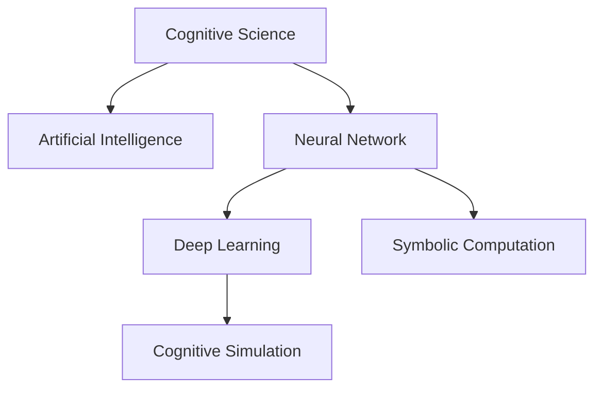

                 

# 认知科学与人工智能：模拟人类思维

> 关键词：认知科学, 人工智能, 神经网络, 计算模型, 深度学习, 符号计算, 认知仿真

## 1. 背景介绍

### 1.1 问题由来
人类认知长期以来是科学研究的难点。传统心理学主要关注行为学的实验和理论分析，而神经科学着重于脑结构和功能的研究。这些研究往往难以将大脑机制与行为输出相联系。近年来，随着计算机科学和神经科学的发展，出现了利用计算模型模拟人类认知过程的尝试。特别是人工智能的突破，使得计算机能够模仿甚至超越人类的某些认知功能，如感知、推理、记忆等。人工智能在信息检索、自动驾驶、机器翻译等领域取得了举世瞩目的成就。

人工智能的进展不断推动了对认知科学的认识。通过研究人类认知过程和智能算法，我们能够更好地理解智能系统的运作机制，进而构建更为先进的认知科学理论。本文将基于认知科学，结合人工智能技术，探讨如何模拟人类思维，并提出未来的发展方向。

### 1.2 问题核心关键点
本文聚焦于如下核心问题：
1. 如何模拟人类认知过程，构建计算模型？
2. 人工智能技术在认知模拟中的地位和作用是什么？
3. 当前认知模拟的瓶颈和未来方向是什么？
4. 认知模拟对人工智能技术有何推动作用？

这些问题相互联系，共同构成了认知科学与人工智能结合的核心研究范式。

## 2. 核心概念与联系

### 2.1 核心概念概述

为更好地理解认知模拟，本节将介绍几个密切相关的核心概念：

- 认知科学(Cognitive Science)：研究人类认知过程和智能系统机制的科学领域。涵盖心理学、神经科学、认知工程、语言学等多个学科，致力于揭示智能行为的本质。

- 人工智能(Artificial Intelligence)：通过算法和计算模型，构建能够模拟人类智能行为的系统。包括机器学习、深度学习、符号计算、知识表示等多个方向，广泛应用于自动驾驶、自然语言处理、计算机视觉等领域。

- 神经网络(Neural Network)：受人类神经系统启发，构建的计算模型。包括前馈神经网络、卷积神经网络、循环神经网络等，被广泛应用于图像识别、语音识别、自然语言处理等任务。

- 计算模型(Computational Model)：使用计算机算法和数据结构模拟现实系统行为的方法。可以是基于符号的、逻辑的或基于数值计算的，广泛用于系统仿真、游戏、人工智能等。

- 深度学习(Deep Learning)：一类基于多层神经网络的机器学习算法，能自动从数据中提取复杂特征，被广泛应用于图像、语音、文本等多种任务。

- 符号计算(Symbolic Computation)：使用符号逻辑和推理技术进行计算和决策的模型，主要应用于知识工程、专家系统等领域。

- 认知仿真(Cognitive Simulation)：使用计算模型模拟人类认知过程的仿真技术，涉及感知、记忆、推理、情绪等多个方面。

这些核心概念之间的逻辑关系可以通过以下Mermaid流程图来展示：

这个流程图展示了认知科学与人工智能的主要关系：

1. 认知科学为人工智能提供了理论基础，揭示人类认知过程，指导算法设计。
2. 神经网络是人工智能的核心技术之一，能通过模拟人类神经系统实现复杂的认知功能。
3. 深度学习扩展了神经网络的能力，使其能够处理更复杂、更抽象的数据。
4. 符号计算与深度学习相结合，形成了认知仿真的基础。
5. 认知仿真技术为认知科学研究提供了新的工具和方法，推动了认知科学的发展。

## 3. 核心算法原理 & 具体操作步骤
### 3.1 算法原理概述

认知模拟的本质是使用计算模型模拟人类认知过程。其核心思想是：通过设计算法和模型，使计算机能够模拟人类的感知、记忆、推理等认知功能，进而构建能够完成复杂任务的智能系统。

形式化地，假设我们要模拟人类的认知过程 $P$，可以设计一个计算模型 $M$，使得：

$$
M \approx P
$$

其中 $M$ 为计算模型，$P$ 为人类认知过程。我们可以通过构建神经网络、符号计算等模型，不断优化 $M$，使其更好地模拟 $P$。

### 3.2 算法步骤详解

认知模拟的步骤通常包括以下几个关键环节：

**Step 1: 设计计算模型**

- 选择合适的计算模型类型。常见模型包括神经网络、符号逻辑网络等。
- 确定模型架构和参数。包括网络层数、节点数、激活函数等。
- 定义模型的输入和输出。输入应尽可能接近人类认知的感知机制，输出应能够执行复杂任务。

**Step 2: 训练计算模型**

- 准备训练数据。训练数据应包含尽可能丰富的情境，以训练模型应对不同输入的响应。
- 选择合适的优化算法。如梯度下降、粒子群优化等。
- 设定训练参数。包括学习率、迭代轮数、正则化等。
- 对模型进行训练和调参。不断优化模型参数，使其能够精确模拟人类认知过程。

**Step 3: 评估和测试**

- 在测试集上评估模型性能。使用精确度、召回率、F1值等指标。
- 分析模型输出。通过解释模型决策路径，理解其认知过程。
- 调整模型。根据测试结果，进一步优化模型结构和参数。

**Step 4: 应用和优化**

- 在实际应用场景中测试模型效果。如自动驾驶、语音识别、图像处理等。
- 根据应用反馈调整模型。不断迭代和优化，提升模型性能。
- 扩展模型的认知功能。加入新的认知模块，如情感、创造力等。

### 3.3 算法优缺点

认知模拟的优势在于：
1. 可以模拟复杂的人类认知过程，提升人工智能系统的智能水平。
2. 能够解释模型的决策路径，提升模型的可解释性和透明性。
3. 提供了一种全新的方法，结合神经网络和符号计算，提升系统处理复杂任务的能力。

然而，认知模拟也存在一定的局限性：
1. 计算模型难以完全模拟人类认知机制。人类认知涉及主观情感、道德判断等难以形式化的问题。
2. 模型的训练和优化过程复杂且耗时。特别是大规模深度学习模型的训练，需要高性能的计算设备和大量时间。
3. 模型的可解释性仍然不足。深度学习模型被视为"黑盒"，难以解释其内部工作机制。
4. 模型的应用场景有限。大部分认知模拟模型仅适用于特定任务，难以泛化到其他领域。

尽管存在这些局限性，认知模拟仍然是构建高级人工智能系统的关键方向之一。未来研究需要进一步提升模型的可解释性和泛化能力，以更好地模拟人类思维。

### 3.4 算法应用领域

认知模拟在以下几个领域具有广泛的应用前景：

1. 自然语言处理(NLP)：模拟人类的语言理解、生成和推理能力，应用于机器翻译、情感分析、自动摘要等任务。

2. 计算机视觉(CV)：模拟人类的视觉感知和图像识别能力，应用于图像分类、目标检测、图像生成等任务。

3. 机器人学(Robotics)：模拟人类的感知、运动和决策能力，应用于自动驾驶、智能制造、人机交互等场景。

4. 人类辅助系统(Human-Aided Systems)：模拟人类的决策、协作和创造力，应用于医疗诊断、金融分析、教育辅助等场景。

## 4. 数学模型和公式 & 详细讲解
### 4.1 数学模型构建

本节将使用数学语言对认知模拟的核心算法进行更加严格的刻画。

假设我们有一个神经网络 $M$，输入为 $x$，输出为 $y$。我们希望通过训练，使得 $M$ 能够模拟人类认知过程 $P$，即：

$$
M(x) \approx P(x)
$$

其中 $M$ 的参数为 $\theta$，训练过程的目标为最小化经验损失：

$$
\mathcal{L}(\theta) = \frac{1}{N}\sum_{i=1}^N \ell(M(x_i), y_i)
$$

其中 $\ell$ 为损失函数，$N$ 为训练数据量。

假设我们采用交叉熵损失函数，则：

$$
\ell(y, \hat{y}) = -y \log \hat{y} - (1-y) \log(1-\hat{y})
$$

将损失函数代入上述公式，得：

$$
\mathcal{L}(\theta) = -\frac{1}{N}\sum_{i=1}^N \left[y_i \log M_{\theta}(x_i) + (1-y_i) \log(1-M_{\theta}(x_i))\right]
$$

在训练过程中，通过梯度下降等优化算法不断调整模型参数 $\theta$，最小化损失函数 $\mathcal{L}(\theta)$。

### 4.2 公式推导过程

以深度学习中常见的多层感知器为例，推导其损失函数的计算公式。

假设多层感知器包含 $k$ 层，每层 $n$ 个节点，输入为 $x$，输出为 $y$。

定义第 $l$ 层神经元的输出为 $z_l^{(l)}$，激活函数为 $g(z)$，则第 $l+1$ 层神经元的输入为 $z_{l+1}^{(l+1)}$，激活函数为 $g(z)$，输出为 $a_{l+1}^{(l+1)}$。则前向传播过程为：

$$
a_1^{(1)} = g(z_1^{(1)}) = g(W_1x+b_1)
$$
$$
a_l^{(l)} = g(z_l^{(l)}) = g(W_1^{(l-1)}a_{l-1}^{(l-1)}+b_l^{(l-1)})
$$
$$
a_k^{(k)} = g(z_k^{(k)}) = g(W_1^{(k-1)}a_{k-1}^{(k-1)}+b_k^{(k-1)})
$$

其中 $W^{(l)}$ 为第 $l$ 层的权重矩阵，$b^{(l)}$ 为第 $l$ 层的偏置向量。

定义第 $k$ 层的输出为 $y_k^{(k)}$，损失函数为交叉熵，则总损失函数为：

$$
\mathcal{L}(\theta) = -\frac{1}{N}\sum_{i=1}^N \left[y_i \log a_k^{(k)} + (1-y_i) \log (1-a_k^{(k)})\right]
$$

根据链式法则，损失函数对权重 $W^{(l)}$ 和偏置 $b^{(l)}$ 的梯度为：

$$
\frac{\partial \mathcal{L}}{\partial W^{(l)}} = -\frac{1}{N}\sum_{i=1}^N \frac{\partial \ell}{\partial z_l^{(l)}} \frac{\partial z_l^{(l)}}{\partial W^{(l)}} = -\frac{1}{N}\sum_{i=1}^N \left(a_{l-1}^{(l-1)}\right)^T \frac{\partial \ell}{\partial a_l^{(l)}}
$$
$$
\frac{\partial \mathcal{L}}{\partial b^{(l)}} = -\frac{1}{N}\sum_{i=1}^N \frac{\partial \ell}{\partial z_l^{(l)}} = -\frac{1}{N}\sum_{i=1}^N \left(a_{l-1}^{(l-1)}\right)^T
$$

将 $\frac{\partial \ell}{\partial a_k^{(k)}}$ 代入上述公式，并利用反向传播算法进行计算，便完成了深度学习模型的训练。

## 5. 项目实践：代码实例和详细解释说明
### 5.1 开发环境搭建

在进行认知模拟实践前，我们需要准备好开发环境。以下是使用Python进行TensorFlow开发的环

