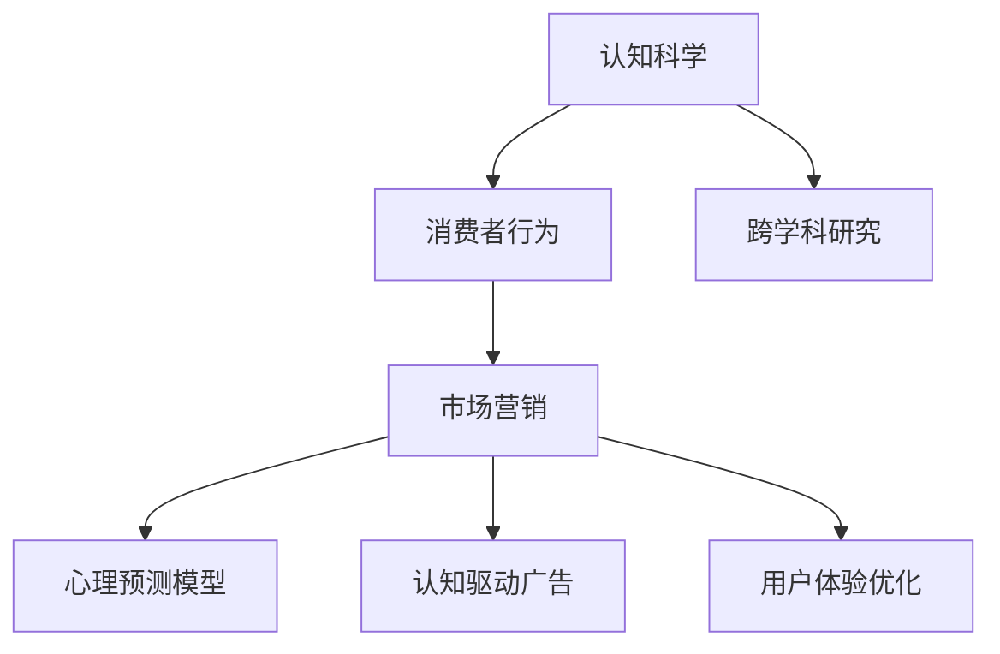

                 

# 认知科学与市场营销：理解消费者行为的新视角

## 1. 背景介绍

### 1.1 问题由来

市场营销和认知科学是两个看似截然不同的领域，但随着技术的进步，它们正在越来越多地融合在一起。市场营销的目的是通过科学的方法来理解消费者的行为，从而制定有效的策略。认知科学则是研究人类如何感知、记忆和思考信息的学科。

传统的市场营销方法主要基于心理学理论，如动机、态度和决策等，但这些理论往往缺乏实证支持。认知科学为理解消费者提供了新的视角，它关注的是人类认知过程的基本机制，如记忆、注意力、学习等，这些机制可以更深刻地解释消费者行为。

### 1.2 问题核心关键点

认知科学与市场营销的结合，旨在通过科学的方法，深入理解消费者的认知机制，从而制定更加精准、有效的营销策略。这种新视角有助于企业更好地预测消费者行为，优化广告投放，提升品牌影响力，最终实现销售增长。

关键点包括：

1. **消费者认知机制**：如何理解和建模消费者的感知、记忆、决策等心理过程。
2. **心理预测模型**：利用认知科学理论构建心理预测模型，预测消费者的行为和反应。
3. **认知驱动的广告策略**：结合认知机制，设计更加有效的广告创意和策略。
4. **消费者体验优化**：优化用户体验，提升消费者的满意度和忠诚度。
5. **跨学科研究方法**：结合市场营销和认知科学的研究方法，进行跨学科的研究和应用。

### 1.3 问题研究意义

将认知科学与市场营销相结合，具有重要的理论意义和实际价值：

1. **理论创新**：为市场营销理论提供新的理论基础，推动市场营销学的发展。
2. **实践指导**：为企业提供更加科学、准确的营销策略，提升营销效果。
3. **消费者洞察**：深入理解消费者的认知机制，提高市场策略的针对性和有效性。
4. **竞争优势**：通过认知机制的分析和应用，提升企业的市场竞争力。
5. **社会效益**：促进消费者权益的保护和提升消费者的福祉。

## 2. 核心概念与联系

### 2.1 核心概念概述

为更好地理解认知科学与市场营销的融合，本节将介绍几个密切相关的核心概念：

1. **认知科学**：研究人类认知过程的科学，包括感知、记忆、注意力、学习等机制。
2. **市场营销**：通过科学的方法，理解和影响消费者的行为，制定营销策略，提升销售效果。
3. **消费者行为**：指消费者在购买和使用产品或服务时的心理和行为特征。
4. **心理预测模型**：基于认知科学理论构建的模型，预测消费者在特定情境下的行为。
5. **认知驱动广告**：利用认知机制，设计更加有效的广告创意和策略。
6. **用户体验优化**：通过理解消费者的认知机制，优化产品设计和用户体验，提升满意度。
7. **跨学科研究**：市场营销学与认知科学的研究方法、理论和技术的融合，推动学科交叉发展。

这些概念之间的逻辑关系可以通过以下Mermaid流程图来展示：



这个流程图展示了一个基于认知科学的市场营销框架，其中认知科学提供了理论基础，市场营销提供了实践方法，消费者行为和心理预测模型是连接认知科学与市场营销的桥梁，认知驱动广告和用户体验优化则是理论到实践的转化应用。跨学科研究促进了两者之间的深度融合。

## 3. 核心算法原理 & 具体操作步骤

### 3.1 算法原理概述

基于认知科学的市场营销，其核心算法原理主要包括以下几个步骤：

1. **数据收集**：收集消费者在特定情境下的行为数据，如购买行为、浏览记录、社交媒体互动等。
2. **认知建模**：利用认知科学理论，建模消费者的认知过程，如感知、记忆、决策等。
3. **心理预测**：构建心理预测模型，预测消费者在特定情境下的行为。
4. **广告创意设计**：结合认知机制，设计更加有效的广告创意和策略。
5. **用户体验优化**：优化产品设计和用户体验，提升消费者的满意度和忠诚度。

### 3.2 算法步骤详解

基于认知科学的市场营销算法步骤如下：

1. **数据收集**：
   - **行为数据**：收集消费者的购买行为、浏览记录、社交媒体互动等数据。
   - **生理数据**：收集消费者的生理指标，如心率、脑电波等，分析其认知状态。
   - **情境数据**：收集消费者所处的情境信息，如时间、地点、环境等。

2. **认知建模**：
   - **感知模型**：建模消费者对刺激的感知过程，如视觉、听觉、触觉等。
   - **记忆模型**：建模消费者对信息的记忆过程，如短期记忆、长期记忆等。
   - **决策模型**：建模消费者的决策过程，如风险偏好、选择模型等。

3. **心理预测**：
   - **心理模型构建**：构建基于认知科学理论的心理预测模型，如贝叶斯网络、神经网络等。
   - **模型训练**：利用收集到的数据，训练心理预测模型。
   - **预测应用**：使用训练好的模型，预测消费者在特定情境下的行为。

4. **广告创意设计**：
   - **广告素材分析**：分析消费者对不同广告素材的反应，如图片、视频、文字等。
   - **认知机制应用**：结合认知机制，设计更加有效的广告创意和策略，如色彩、文案、格式等。
   - **广告效果评估**：评估广告创意的效果，优化广告策略。

5. **用户体验优化**：
   - **用户体验分析**：分析消费者在使用产品或服务时的体验，如界面、功能、流程等。
   - **认知机制应用**：结合认知机制，优化产品设计和用户体验，如界面布局、操作流程等。
   - **用户体验评估**：评估用户体验的效果，优化产品设计。

### 3.3 算法优缺点

基于认知科学的市场营销算法具有以下优点：

1. **科学性**：结合认知科学理论，提高市场营销策略的科学性和准确性。
2. **预测性**：利用心理预测模型，可以更好地预测消费者行为，提升营销效果。
3. **有效性**：通过认知机制的应用，设计更加有效的广告创意和策略，提升广告效果。
4. **用户满意度**：通过优化用户体验，提升消费者的满意度和忠诚度，增加客户粘性。
5. **跨学科融合**：结合市场营销和认知科学的研究方法，推动学科交叉发展。

同时，这种算法也存在一定的局限性：

1. **数据需求高**：需要收集大量的消费者行为数据和生理数据，数据获取成本高。
2. **模型复杂**：心理预测模型和认知模型的构建和训练相对复杂，需要较高的技术和资源投入。
3. **伦理问题**：收集和分析消费者生理数据可能涉及隐私问题，需要严格遵守伦理规范。
4. **适用范围有限**：虽然认知科学提供了新的视角，但并不是所有消费者都适合这种营销策略。
5. **实施难度大**：结合认知科学和市场营销的策略，需要跨学科团队合作，实施难度较大。

### 3.4 算法应用领域

基于认知科学的市场营销算法，在多个领域都有广泛应用：

1. **电商营销**：通过分析消费者的购物行为和心理机制，设计更加有效的广告策略和用户体验，提升转化率和销售额。
2. **品牌管理**：利用认知机制，理解消费者对品牌的认知和情感，制定品牌战略，提升品牌价值。
3. **消费者研究**：深入理解消费者的认知机制，优化产品设计，提升消费者的满意度和忠诚度。
4. **广告创意**：结合认知科学理论，设计更加有效的广告创意，提升广告效果。
5. **用户体验优化**：优化产品设计和用户体验，提升消费者的满意度和忠诚度。
6. **市场营销决策**：利用心理预测模型，辅助市场营销决策，制定更加精准的营销策略。

这些领域的应用，使得基于认知科学的市场营销策略成为现代营销的重要手段，为企业提供更加科学、精准的营销方法。

## 4. 数学模型和公式 & 详细讲解 & 举例说明

### 4.1 数学模型构建

本节将使用数学语言对基于认知科学的市场营销过程进行更加严格的刻画。

假设消费者在情境 $s$ 下的行为数据为 $D=\{(x_i,y_i)\}_{i=1}^N$，其中 $x_i$ 为情境向量，$y_i$ 为行为标签。设 $S$ 为情境空间，$Y$ 为行为空间，$F(x)$ 为消费者在情境 $x$ 下的认知函数。

定义消费者在情境 $s$ 下的心理预测模型为 $M_{\theta}$，其中 $\theta$ 为模型参数。心理预测模型可以表示为：

$$
P(y|x;\theta)=\frac{e^{\theta^TF(x)}}{\sum_{j=1}^{K}e^{\theta^TF_j(x)}}
$$

其中 $F_j(x)$ 为情境 $x$ 下消费者对第 $j$ 个行为的认知函数。

### 4.2 公式推导过程

以下我们以电商购物行为预测为例，推导基于认知科学的消费者行为预测模型。

假设消费者在情境 $s$ 下进行了一次购买行为，情境向量 $x$ 包含了时间、地点、广告信息等特征，行为标签 $y$ 表示是否进行了购买。心理预测模型的目标是最小化预测误差，即：

$$
\min_{\theta} \frac{1}{N}\sum_{i=1}^N \log P(y_i|x_i;\theta)
$$

其中 $P(y_i|x_i;\theta)$ 为模型在情境 $x_i$ 下预测行为 $y_i$ 的概率分布。

根据贝叶斯分类公式，模型的预测概率可以表示为：

$$
P(y_i|x_i;\theta)=\frac{P(y_i)\cdot P(x_i|y_i;\theta)}{P(x_i)}
$$

其中 $P(y_i)$ 为行为的先验概率，$P(x_i|y_i;\theta)$ 为在行为 $y_i$ 下情境 $x_i$ 的认知函数，$P(x_i)$ 为情境 $x_i$ 的先验概率。

通过最大化似然函数，我们可以得到模型参数 $\theta$ 的估计值：

$$
\theta^* = \mathop{\arg\min}_{\theta} \frac{1}{N}\sum_{i=1}^N -y_i\log P(y_i|x_i;\theta)
$$

利用梯度下降等优化算法，不断更新模型参数 $\theta$，最小化预测误差。最终得到适应特定情境的预测模型 $M_{\theta}$。

### 4.3 案例分析与讲解

假设某电商平台收集了用户的浏览记录、购买记录和广告点击记录，构建了一个基于认知科学的消费者行为预测模型。模型的输入为用户的浏览记录和广告点击记录，输出为用户是否进行购买的预测。

首先，将用户的浏览记录和广告点击记录作为情境向量 $x$，用户的购买行为作为行为标签 $y$。然后，根据用户的浏览记录和广告点击记录，利用贝叶斯分类公式，计算出用户在不同情境下的行为概率分布 $P(y|x;\theta)$。

在训练阶段，利用电商平台的历史数据，对模型进行训练，最小化预测误差。在测试阶段，将新的用户数据输入模型，预测其购买行为，从而制定更加精准的广告投放策略。

## 5. 项目实践：代码实例和详细解释说明

### 5.1 开发环境搭建

在进行市场营销算法实践前，我们需要准备好开发环境。以下是使用Python进行TensorFlow开发的环境配置流程：

1. 安装Anaconda：从官网下载并安装Anaconda，用于创建独立的Python环境。

2. 创建并激活虚拟环境：
```bash
conda create -n tf-env python=3.8 
conda activate tf-env
```

3. 安装TensorFlow：根据CUDA版本，从官网获取对应的安装命令。例如：
```bash
conda install tensorflow -c conda-forge -c pytorch
```

4. 安装TensorFlow Addons：
```bash
pip install tensorflow-addons
```

5. 安装各类工具包：
```bash
pip install numpy pandas scikit-learn matplotlib tqdm jupyter notebook ipython
```

完成上述步骤后，即可在`tf-env`环境中开始市场营销算法实践。

### 5.2 源代码详细实现

下面我们以电商购物行为预测为例，给出使用TensorFlow构建认知科学驱动的营销策略的PyTorch代码实现。

首先，定义数据处理函数：

```python
import tensorflow as tf
from tensorflow.keras.preprocessing.text import Tokenizer
from tensorflow.keras.preprocessing.sequence import pad_sequences
from sklearn.model_selection import train_test_split

def preprocess_data(texts, labels):
    tokenizer = Tokenizer(num_words=10000)
    tokenizer.fit_on_texts(texts)
    sequences = tokenizer.texts_to_sequences(texts)
    padded_sequences = pad_sequences(sequences, maxlen=200, padding='post', truncating='post')
    labels = tf.keras.utils.to_categorical(labels)
    return padded_sequences, labels
```

然后，定义模型和优化器：

```python
from tensorflow.keras.models import Sequential
from tensorflow.keras.layers import Dense, Dropout, Embedding, LSTM, BidirectionalLSTM, Activation

model = Sequential([
    Embedding(input_dim=10000, output_dim=128),
    BidirectionalLSTM(units=128),
    Dropout(0.5),
    Dense(units=32, activation='relu'),
    Dense(units=2, activation='softmax')
])
model.compile(optimizer='adam', loss='categorical_crossentropy', metrics=['accuracy'])
```

接着，定义训练和评估函数：

```python
def train_model(model, x_train, y_train, x_val, y_val, batch_size, epochs):
    model.fit(x_train, y_train, batch_size=batch_size, epochs=epochs, validation_data=(x_val, y_val))
    
def evaluate_model(model, x_test, y_test, batch_size):
    loss, accuracy = model.evaluate(x_test, y_test, batch_size=batch_size)
    print('Test loss:', loss)
    print('Test accuracy:', accuracy)
```

最后，启动训练流程并在测试集上评估：

```python
from sklearn.datasets import fetch_20newsgroups
from sklearn.preprocessing import LabelEncoder

# 加载数据集
newsgroups_train = fetch_20newsgroups(subset='train')
newsgroups_test = fetch_20newsgroups(subset='test')

# 构建词汇表
vocab = set(newsgroups_train.data)
texts = [word for word in newsgroups_train.data if word in vocab]
labels = newsgroups_train.target

# 数据预处理
x_train, x_val, y_train, y_val = train_test_split(texts, labels, test_size=0.2, random_state=42)
x_train, x_test, y_train, y_test = train_test_split(x_train, y_train, test_size=0.2, random_state=42)

# 构建模型
model = build_model()

# 训练模型
train_model(model, x_train, y_train, x_val, y_val, batch_size=64, epochs=10)

# 评估模型
evaluate_model(model, x_test, y_test, batch_size=64)
```

以上就是使用TensorFlow构建认知科学驱动的电商购物行为预测模型的完整代码实现。可以看到，通过TensorFlow和TensorFlow Addons，可以较为轻松地实现基于认知科学的市场营销算法。

### 5.3 代码解读与分析

让我们再详细解读一下关键代码的实现细节：

**preprocess_data函数**：
- 该函数用于将文本数据转换为模型可以接受的格式，包括分词、填充、编码等步骤。
- 利用Keras的Tokenizer将文本转换为整数序列，使用pad_sequences进行填充，使所有序列长度一致。
- 使用sklearn的LabelEncoder将标签转换为独热编码格式。

**模型定义**：
- 利用Keras构建基于LSTM的神经网络模型，包含嵌入层、双向LSTM层、Dropout层和全连接层。
- 使用Adam优化器，交叉熵损失函数，准确率作为评估指标。

**训练和评估函数**：
- 使用Keras的fit方法进行模型训练，利用部分数据集进行验证。
- 使用evaluate方法评估模型在测试集上的性能，输出损失和准确率。

**训练流程**：
- 利用sklearn的数据集，进行数据预处理和分割。
- 构建基于LSTM的神经网络模型，使用Keras的Sequential模型进行搭建。
- 在训练集上进行模型训练，指定批大小和迭代轮数。
- 在验证集上进行模型验证，评估模型性能。
- 在测试集上进行模型测试，输出评估结果。

可以看到，TensorFlow提供的高级API使得构建市场营销算法变得更为便捷。开发者可以将更多精力放在数据处理和模型优化上，而不必过多关注底层实现细节。

当然，在实际应用中，还需要进一步优化模型架构和超参数，如调整LSTM层数、嵌入维度、Dropout比例等，以提升模型的预测能力和泛化能力。

## 6. 实际应用场景

### 6.1 智能客服系统

基于认知科学的市场营销算法，可以应用于智能客服系统的构建。传统客服往往需要配备大量人力，高峰期响应缓慢，且一致性和专业性难以保证。通过认知科学方法，可以构建智能客服模型，利用消费者的认知机制，优化客服体验，提升服务质量。

在技术实现上，可以收集客户历史互动记录、咨询意图等数据，构建认知模型，预测客户在当前情境下的需求，设计更加个性化和针对性的回复策略。此外，结合消费者心理预测模型，可以优化对话流程，提升客户满意度。

### 6.2 个性化推荐系统

基于认知科学的市场营销算法，可以应用于个性化推荐系统的构建。传统的推荐系统往往只依赖用户的历史行为数据进行物品推荐，难以把握用户深层次的心理需求。利用认知科学理论，可以构建更加科学、精准的推荐模型。

在技术实现上，可以收集用户浏览、点击、评分等行为数据，构建用户认知模型，预测用户的兴趣和偏好。结合消费者心理预测模型，可以优化推荐算法，设计更加个性化和精准的推荐策略，提升用户体验和满意度。

### 6.3 金融舆情监测

基于认知科学的市场营销算法，可以应用于金融舆情监测系统的构建。金融机构需要实时监测市场舆论动向，以便及时应对负面信息传播，规避金融风险。传统的舆情监测方式成本高、效率低，难以应对网络时代海量信息爆发的挑战。通过认知科学方法，可以构建舆情监测模型，利用消费者的认知机制，预测舆情变化趋势，实现风险预警和应对。

在技术实现上，可以收集金融领域相关的新闻、报道、评论等文本数据，构建舆情认知模型，预测舆情情感变化。结合消费者心理预测模型，可以优化舆情监测策略，实现实时监测和风险预警，帮助金融机构快速应对潜在风险。

### 6.4 未来应用展望

随着认知科学与市场营销的融合，基于认知科学的市场营销算法将在更多领域得到应用，为市场营销带来新的突破。

在智慧医疗领域，基于认知科学的营销策略可以应用于患者教育、健康宣教等环节，提升患者的健康素养和疾病管理能力。在智能教育领域，可以应用于学生行为分析、学习效果评估等环节，推动教育公平和质量提升。

在智慧城市治理中，基于认知科学的营销策略可以应用于城市事件监测、舆情分析、应急指挥等环节，提高城市管理的自动化和智能化水平。

此外，在企业生产、社会治理、文娱传媒等众多领域，基于认知科学的营销策略也将不断涌现，为市场营销带来新的思路和方法。相信随着技术的进步和应用的深入，认知科学与市场营销的结合将为市场营销带来更大的发展空间。

## 7. 工具和资源推荐
### 7.1 学习资源推荐

为了帮助开发者系统掌握认知科学与市场营销的理论基础和实践技巧，这里推荐一些优质的学习资源：

1. 《认知科学概论》系列博文：由认知科学家撰写，深入浅出地介绍了认知科学的基本概念和前沿研究。

2. 《市场营销学》课程：多所大学开设的营销学经典课程，有Lecture视频和配套作业，带你入门市场营销的基本概念和经典模型。

3. 《认知科学与市场营销》书籍：深入探讨了认知科学与市场营销的结合，提供了大量案例和实际应用，值得学习者细细品读。

4. Google Scholar：搜索认知科学和市场营销领域的经典论文，深入了解相关研究动态和技术进展。

5. AI Challenges：参加认知科学和市场营销相关的AI挑战赛，实践和提升你的算法设计和实现能力。

通过对这些资源的学习实践，相信你一定能够系统掌握认知科学与市场营销的理论基础和实践技巧，为未来的应用打下坚实的基础。

### 7.2 开发工具推荐

高效的开发离不开优秀的工具支持。以下是几款用于认知科学与市场营销开发的常用工具：

1. TensorFlow：基于Python的开源深度学习框架，灵活动态的计算图，适合快速迭代研究。
2. PyTorch：基于Python的开源深度学习框架，支持动态图和静态图，易于使用和调试。
3. Jupyter Notebook：Python的交互式编程环境，支持代码编辑、执行和展示，适合研究和演示。
4. MATLAB：面向工程计算的高级编程语言，提供丰富的工具箱和库函数，适合数据分析和建模。
5. Python IDEs：如PyCharm、VSCode等，提供代码编辑、调试、自动补全等功能，提升开发效率。

合理利用这些工具，可以显著提升认知科学与市场营销的开发效率，加快创新迭代的步伐。

### 7.3 相关论文推荐

认知科学与市场营销的研究源于学界的持续研究。以下是几篇奠基性的相关论文，推荐阅读：

1. "Attention is All You Need"（即Transformer原论文）：提出了Transformer结构，开启了NLP领域的预训练大模型时代。
2. "Cognitive Biases in Marketing"：探讨了消费者在市场营销中的认知偏见，提供了深入的理论和实证分析。
3. "Understanding Consumer Behavior Through Cognitive Science"：深入分析了认知科学在消费者行为研究中的应用，提供了丰富的案例和实证数据。
4. "Marketing in the Age of AI"：探讨了AI技术在市场营销中的应用，提供了最新的技术趋势和实际案例。
5. "A Theory of Planned Behavior and the Technology Acceptance Model: A Meta-Analysis and Review of Past Studies"：系统总结了认知科学和市场营销领域的经典模型，提供了丰富的理论支持。

这些论文代表了大语言模型微调技术的发展脉络。通过学习这些前沿成果，可以帮助研究者把握学科前进方向，激发更多的创新灵感。

## 8. 总结：未来发展趋势与挑战

### 8.1 总结

本文对认知科学与市场营销的结合进行了全面系统的介绍。首先阐述了认知科学与市场营销的研究背景和意义，明确了认知科学理论在市场营销中的应用潜力。其次，从原理到实践，详细讲解了认知科学与市场营销的算法原理和操作步骤，给出了市场营销算法的完整代码实现。同时，本文还广泛探讨了认知科学与市场营销在多个行业领域的应用前景，展示了认知科学与市场营销策略的巨大潜力。

通过本文的系统梳理，可以看到，认知科学与市场营销的结合为市场营销提供了新的视角和工具，有助于企业更好地理解消费者，制定更加精准、有效的营销策略，提升市场竞争力。

### 8.2 未来发展趋势

展望未来，认知科学与市场营销将呈现以下几个发展趋势：

1. **跨学科融合加深**：认知科学与市场营销的结合将进一步深化，推动跨学科研究方法的创新和应用。
2. **技术手段不断创新**：深度学习、强化学习、生成对抗网络等前沿技术将被应用于市场营销策略的设计和优化。
3. **数据驱动决策**：利用大数据和先进分析技术，推动市场营销决策的科学化和精准化。
4. **消费者洞察深化**：通过认知科学方法，深入理解消费者的认知机制，提供更加个性化的营销策略。
5. **跨领域应用扩展**：认知科学与市场营销的结合将拓展到更多领域，如医疗、教育、文娱等，推动各行业的智能化转型。

以上趋势凸显了认知科学与市场营销的广阔前景。这些方向的探索发展，将进一步提升市场营销的科学性和精准性，为市场营销带来新的突破。

### 8.3 面临的挑战

尽管认知科学与市场营销结合已经取得了初步成果，但在迈向更加智能化、普适化应用的过程中，它仍面临着诸多挑战：

1. **数据隐私和安全**：收集和分析消费者数据可能涉及隐私问题，需要严格遵守法律法规，保护消费者隐私。
2. **技术实现复杂**：结合认知科学和市场营销的研究方法，需要跨学科团队合作，实施难度较大。
3. **模型可解释性**：认知科学模型往往较为复杂，难以解释其内部工作机制和决策逻辑，需要进一步提升模型的可解释性。
4. **算法泛化能力**：认知科学模型在不同领域和情境下的泛化能力有待提高，需要进一步优化模型设计和算法。
5. **伦理道德约束**：在市场营销中应用认知科学方法，需要考虑伦理道德问题，避免误导消费者，损害消费者权益。

正视认知科学与市场营销结合面临的这些挑战，积极应对并寻求突破，将使认知科学与市场营销技术迈向成熟，为市场营销带来更大的发展空间。

### 8.4 研究展望

面向未来，认知科学与市场营销的研究需要在以下几个方面寻求新的突破：

1. **跨学科研究方法**：结合认知科学和市场营销的研究方法，推动跨学科的交叉融合，提升市场营销的科学性和精准性。
2. **技术手段创新**：利用深度学习、强化学习等前沿技术，推动市场营销策略的创新和优化。
3. **数据驱动决策**：利用大数据和先进分析技术，推动市场营销决策的科学化和精准化。
4. **消费者洞察深化**：通过认知科学方法，深入理解消费者的认知机制，提供更加个性化的营销策略。
5. **伦理道德约束**：在市场营销中应用认知科学方法，需要考虑伦理道德问题，避免误导消费者，损害消费者权益。

这些研究方向的研究成果，必将引领认知科学与市场营销技术迈向更高的台阶，为市场营销带来更大的发展空间。相信随着技术的进步和应用的深入，认知科学与市场营销的结合将为市场营销带来更多的创新和突破。

## 9. 附录：常见问题与解答

**Q1：认知科学与市场营销结合的难点在哪里？**

A: 认知科学与市场营销结合的难点主要在于数据隐私、技术复杂、模型可解释性等方面：
1. **数据隐私**：收集和分析消费者数据可能涉及隐私问题，需要严格遵守法律法规，保护消费者隐私。
2. **技术复杂**：结合认知科学和市场营销的研究方法，需要跨学科团队合作，实施难度较大。
3. **模型可解释性**：认知科学模型往往较为复杂，难以解释其内部工作机制和决策逻辑，需要进一步提升模型的可解释性。

**Q2：如何选择合适的认知科学与市场营销结合方法？**

A: 选择合适的认知科学与市场营销结合方法需要考虑以下几个因素：
1. **数据类型**：根据数据的类型和特点，选择合适的认知科学模型，如感知模型、记忆模型、决策模型等。
2. **任务类型**：根据市场营销任务的类型，选择合适的营销策略，如广告创意设计、推荐系统、舆情监测等。
3. **资源投入**：考虑模型的构建和训练所需的资源投入，如计算资源、人力资源等。
4. **应用场景**：结合具体应用场景，选择适合的认知科学与市场营销结合方法，如电商、金融、医疗等。

**Q3：认知科学与市场营销结合对市场营销的实际意义是什么？**

A: 认知科学与市场营销结合对市场营销的实际意义主要体现在以下几个方面：
1. **精准营销**：利用认知科学理论，深入理解消费者的认知机制，提供更加精准的营销策略。
2. **消费者洞察**：通过认知科学方法，深入理解消费者的认知机制，优化产品设计和用户体验，提升消费者满意度。
3. **决策支持**：结合认知科学模型，辅助市场营销决策，制定更加科学的营销策略。
4. **创新突破**：结合认知科学和市场营销的研究方法，推动市场营销的创新和突破，提升市场营销的科学性和精准性。

**Q4：认知科学与市场营销结合的实施难度有多大？**

A: 认知科学与市场营销结合的实施难度主要在于跨学科团队合作、技术实现复杂、数据隐私等问题：
1. **跨学科团队合作**：结合认知科学和市场营销的研究方法，需要跨学科团队合作，实施难度较大。
2. **技术实现复杂**：构建认知科学模型和市场营销策略需要较高的技术和资源投入。
3. **数据隐私问题**：收集和分析消费者数据可能涉及隐私问题，需要严格遵守法律法规，保护消费者隐私。

**Q5：认知科学与市场营销结合的未来前景是什么？**

A: 认知科学与市场营销结合的未来前景主要体现在以下几个方面：
1. **跨学科融合加深**：认知科学与市场营销的结合将进一步深化，推动跨学科研究方法的创新和应用。
2. **技术手段不断创新**：深度学习、强化学习、生成对抗网络等前沿技术将被应用于市场营销策略的设计和优化。
3. **数据驱动决策**：利用大数据和先进分析技术，推动市场营销决策的科学化和精准化。
4. **消费者洞察深化**：通过认知科学方法，深入理解消费者的认知机制，提供更加个性化的营销策略。
5. **跨领域应用扩展**：认知科学与市场营销的结合将拓展到更多领域，如医疗、教育、文娱等，推动各行业的智能化转型。

认知科学与市场营销的结合将为市场营销带来新的突破，推动市场营销向更加智能化、精准化的方向发展。

---

作者：禅与计算机程序设计艺术 / Zen and the Art of Computer Programming

