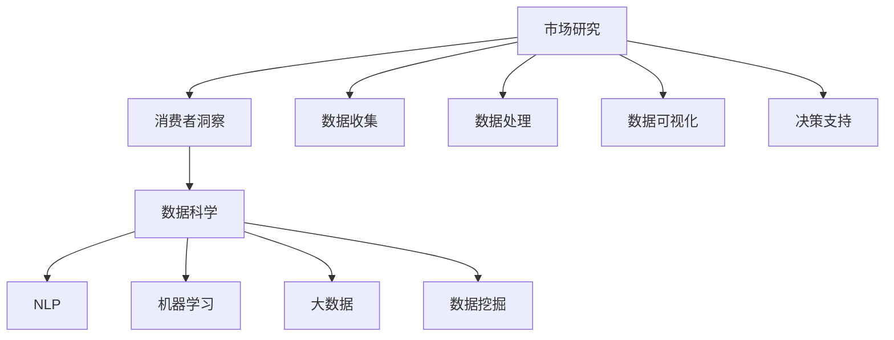

                 

# AI如何改变市场研究和消费者洞察

> 关键词：AI,市场研究,消费者洞察,数据科学,自然语言处理(NLP),机器学习,大数据,数据挖掘,决策支持

## 1. 背景介绍

### 1.1 问题由来
在数字化转型的大背景下，企业面临的竞争环境日益激烈，客户需求日新月异。传统市场研究方法如问卷调查、焦点小组等，尽管仍是重要的工具，但其时效性、覆盖面和深度已无法满足现代商业决策的需要。AI技术的崛起，为市场研究和消费者洞察带来了全新的可能。

AI技术的核心在于其强大的数据处理和分析能力，能够从海量数据中挖掘出有价值的信息，提供深层次的消费者洞察。AI在自然语言处理(NLP)、机器学习、大数据和数据挖掘等方面的进展，使得市场研究方法和消费者洞察手段发生了革命性变革。

### 1.2 问题核心关键点
AI技术在市场研究和消费者洞察中的应用，主要体现在以下几个方面：
- 数据来源的多样化：AI可以处理多种数据格式，包括结构化数据和非结构化数据，如文本、图片、音频等。
- 数据处理的高效化：AI算法可以在短时间内处理海量数据，快速产生市场和消费者洞察。
- 洞察深度的提升：AI能够进行深度学习和模式识别，揭示消费者行为和市场趋势的复杂模式。
- 决策支持的多维度：AI提供的洞察可以支持企业在战略规划、产品开发、营销策略等多个维度进行决策。

AI在市场研究和消费者洞察中的应用，不仅提升了数据处理的效率，还为企业的决策提供了更多维度的支持。

### 1.3 问题研究意义
研究AI如何改变市场研究和消费者洞察，对于企业转型升级、提升竞争力和创造新的商业机会具有重要意义：

1. 提升决策效率：AI技术能够快速分析大量数据，提供即时、准确的消费者洞察，帮助企业更快地做出决策。
2. 优化客户体验：通过深入分析消费者行为和偏好，AI可以指导企业提供更符合客户需求的个性化服务。
3. 增强市场适应性：AI能够识别市场趋势和机会，帮助企业灵活应对市场变化，保持竞争力。
4. 降低运营成本：自动化数据分析和消费者洞察生成，减少了人工成本和时间成本。
5. 增强竞争力：通过提供更深入的消费者洞察，企业可以更好地理解市场和消费者，优化产品和服务，提升市场份额。

## 2. 核心概念与联系

### 2.1 核心概念概述

为了更好地理解AI在市场研究和消费者洞察中的应用，本节将介绍几个核心概念：

- **市场研究(Market Research)**：指系统地收集、分析、解释和呈现有关市场信息的过程。市场研究通过收集和分析数据，帮助企业理解市场和消费者行为，支持企业做出更有信息支持的决策。
- **消费者洞察(Consumer Insight)**：指通过数据分析、观察和调查等方式，深入了解消费者的需求、偏好和行为，为企业提供市场策略和产品开发方向。
- **数据科学(Data Science)**：通过统计学、算法和计算机技术，从数据中提取知识的过程。数据科学在市场研究和消费者洞察中起到了关键作用。
- **自然语言处理(NLP)**：处理和理解人类语言的技术，用于从文本数据中提取有价值的信息。
- **机器学习(Machine Learning)**：使计算机能够从数据中学习规律并做出预测或决策的技术。机器学习在消费者洞察中用于分析消费者行为模式，预测市场趋势。
- **大数据(Big Data)**：指体量巨大、类型繁多、速度极快、价值密度低的数据集合，通过分析这些数据可以揭示消费者的行为和偏好。
- **数据挖掘(Data Mining)**：从大量数据中发现模式和规律的过程。数据挖掘在消费者洞察中用于从大量市场和消费者数据中挖掘出有价值的信息。

这些核心概念之间的逻辑关系可以通过以下Mermaid流程图来展示：



这个流程图展示了大规模数据分析过程中各个环节的关键概念及其之间的关系：

1. 市场研究通过数据收集和处理，为消费者洞察提供基础。
2. 消费者洞察通过数据分析和模式识别，揭示消费者行为和市场趋势。
3. 数据科学提供了技术工具和方法，支持数据收集、处理和分析。
4. NLP用于处理和理解文本数据，提取有价值的信息。
5. 机器学习用于分析和预测消费者行为模式和市场趋势。
6. 大数据和数据挖掘提供了海量数据来源，从中发现模式和规律。
7. 决策支持将分析结果转化为实际行动，支持企业决策。

## 3. 核心算法原理 & 具体操作步骤
### 3.1 算法原理概述

AI在市场研究和消费者洞察中的应用，核心在于通过大数据分析和机器学习算法，从大量数据中提取和理解消费者的行为模式和市场趋势。其核心思想是：

- 收集多渠道的数据，包括社交媒体、网络搜索、销售记录、问卷调查等。
- 使用数据科学和机器学习技术对数据进行处理和分析，揭示消费者的需求和行为规律。
- 结合NLP技术，分析文本数据，提取消费者的情感、意见和评价。
- 通过可视化工具呈现分析结果，支持企业做出更有信息支持的决策。

具体来说，AI在市场研究和消费者洞察中的应用，主要涉及以下几个关键步骤：

1. **数据收集和预处理**：从各种渠道收集数据，包括文本、图像、音频等。对数据进行清洗、去重和标准化处理，确保数据质量。
2. **特征工程和选择**：从收集的数据中提取特征，如关键词、情感极性、消费行为等。选择合适的特征，确保模型能够捕捉到有价值的信息。
3. **模型训练和优化**：使用机器学习算法，如回归、分类、聚类等，训练模型并进行参数优化。
4. **分析和解释**：对模型进行分析和解释，揭示消费者行为和市场趋势的规律。
5. **可视化呈现**：使用可视化工具将分析结果呈现出来，支持企业决策。

### 3.2 算法步骤详解

以下是AI在市场研究和消费者洞察中应用的详细步骤：

**Step 1: 数据收集和预处理**
- 使用网络爬虫、API接口、数据仓库等技术，从各种渠道收集数据。
- 对数据进行清洗、去重和标准化处理，确保数据质量。

**Step 2: 特征工程和选择**
- 从收集的数据中提取特征，如关键词、情感极性、消费行为等。
- 使用特征选择技术，选择与市场和消费者洞察相关的特征。

**Step 3: 模型训练和优化**
- 选择合适的机器学习算法，如回归、分类、聚类等，训练模型并进行参数优化。
- 使用交叉验证、正则化等技术，防止模型过拟合。

**Step 4: 分析和解释**
- 对模型进行分析和解释，揭示消费者行为和市场趋势的规律。
- 使用解释性模型或可视化工具，帮助企业理解模型的预测结果。

**Step 5: 可视化呈现**
- 使用可视化工具将分析结果呈现出来，支持企业决策。
- 将分析结果转化为易于理解和使用的可视化报告或仪表板。

### 3.3 算法优缺点

AI在市场研究和消费者洞察中的应用，具有以下优点：
1. 数据处理能力强大：AI可以处理海量数据，快速生成洞察结果。
2. 深度分析能力强：AI可以深入分析消费者行为和市场趋势，揭示复杂模式。
3. 决策支持有力：AI提供的洞察可以支持企业做出更有信息支持的决策。
4. 自动化程度高：AI可以自动化数据分析和生成，降低人工成本。

但同时，也存在一些缺点：
1. 数据质量依赖高：AI分析结果的准确性高度依赖数据质量，数据缺失或不准确会影响结果。
2. 模型复杂度高：AI模型可能需要大量数据进行训练，模型的复杂度也较高。
3. 解释性不足：AI模型往往是"黑盒"，其决策过程难以解释，影响模型的可信度。
4. 成本高：初期建设AI系统需要大量资金和技术投入，对中小企业可能构成挑战。

尽管存在这些局限性，但就目前而言，AI技术在市场研究和消费者洞察中的应用已成为主流趋势，其高效、准确和自动化等特点，使得其在现代商业决策中具有不可替代的重要地位。

### 3.4 算法应用领域

AI在市场研究和消费者洞察中的应用，已广泛应用于多个领域，包括但不限于：

- **零售行业**：通过分析销售数据和消费者行为，优化库存管理、定价策略和促销活动。
- **金融行业**：利用消费者洞察，开发金融产品和优化用户体验。
- **媒体和广告**：通过消费者行为分析，优化广告投放策略和内容推荐。
- **健康医疗**：通过分析患者数据和行为，优化诊疗流程和提升医疗服务质量。
- **教育行业**：通过分析学生数据和行为，优化教学内容和个性化推荐。

这些应用领域展示了AI在市场研究和消费者洞察中的广泛应用，极大地提升了各行业的运营效率和客户满意度。

## 4. 数学模型和公式 & 详细讲解 & 举例说明
### 4.1 数学模型构建

本节将使用数学语言对AI在市场研究和消费者洞察中的应用进行更加严格的刻画。

假设企业收集到$N$条消费者评论，每条评论包含$m$个特征$x_i$，真实标签$y_i \in \{0, 1\}$表示该评论是否包含特定情感。则消费者情感分析的数学模型可以表示为：

$$
y_i = f(x_i; \theta)
$$

其中$f(\cdot)$为模型函数，$\theta$为模型参数。模型的目标是最小化经验风险：

$$
\mathcal{L}(\theta) = \frac{1}{N}\sum_{i=1}^N \ell(y_i, f(x_i; \theta))
$$

其中$\ell(\cdot)$为损失函数，通常使用交叉熵损失：

$$
\ell(y_i, f(x_i; \theta)) = -[y_i \log f(x_i; \theta) + (1-y_i) \log (1-f(x_i; \theta))]
$$

### 4.2 公式推导过程

假设模型$f(\cdot)$为线性回归模型，则有：

$$
f(x_i; \theta) = \theta^T x_i + b
$$

其中$\theta \in \mathbb{R}^m$为模型参数，$b$为偏置项。将此模型带入损失函数中，得：

$$
\mathcal{L}(\theta) = \frac{1}{N}\sum_{i=1}^N [-y_i (\theta^T x_i + b) + (1-y_i) \log (1-\theta^T x_i - b)]
$$

为了求解$\theta$，需要对$\mathcal{L}(\theta)$求导并令导数为0，得：

$$
\frac{\partial \mathcal{L}(\theta)}{\partial \theta} = \frac{1}{N}\sum_{i=1}^N [-y_i x_i + (1-y_i) (1 - \theta^T x_i - b) x_i]
$$

解得：

$$
\theta = (\frac{1}{N} \sum_{i=1}^N x_i y_i + \alpha e_i) / (\frac{1}{N} \sum_{i=1}^N (1-y_i) x_i + \beta e_i)
$$

其中$\alpha$和$\beta$为学习率。

### 4.3 案例分析与讲解

以下以消费者情感分析为例，讲解如何使用线性回归模型进行情感分析：

假设企业收集到$N=1000$条消费者评论，每条评论包含$m=10$个特征，如产品价格、质量、服务等。企业希望了解消费者对产品是否满意，通过情感分析确定消费者情感倾向。

**Step 1: 数据收集和预处理**
- 使用网络爬虫从电商网站上收集$1000$条消费者评论，每条评论包含$10$个特征。
- 对数据进行清洗、去重和标准化处理，确保数据质量。

**Step 2: 特征工程和选择**
- 从收集的数据中提取特征，如产品价格、质量、服务等。
- 使用特征选择技术，选择与消费者情感相关的特征。

**Step 3: 模型训练和优化**
- 使用线性回归模型，训练模型并进行参数优化。
- 使用交叉验证、正则化等技术，防止模型过拟合。

**Step 4: 分析和解释**
- 对模型进行分析和解释，揭示消费者情感倾向的规律。
- 使用解释性模型或可视化工具，帮助企业理解模型的预测结果。

**Step 5: 可视化呈现**
- 使用可视化工具将分析结果呈现出来，支持企业决策。
- 将分析结果转化为易于理解和使用的可视化报告或仪表板。

通过上述步骤，企业可以快速生成消费者情感分析的洞察结果，支持产品优化和市场决策。

## 5. 项目实践：代码实例和详细解释说明
### 5.1 开发环境搭建

在进行AI市场研究和消费者洞察的实践前，我们需要准备好开发环境。以下是使用Python进行Scikit-learn开发的环境配置流程：

1. 安装Anaconda：从官网下载并安装Anaconda，用于创建独立的Python环境。

2. 创建并激活虚拟环境：
```bash
conda create -n sklearn-env python=3.8 
conda activate sklearn-env
```

3. 安装Scikit-learn：
```bash
conda install scikit-learn
```

4. 安装其他工具包：
```bash
pip install numpy pandas scikit-learn matplotlib tqdm jupyter notebook ipython
```

完成上述步骤后，即可在`sklearn-env`环境中开始市场研究和消费者洞察的实践。

### 5.2 源代码详细实现

这里我们以消费者情感分析为例，给出使用Scikit-learn进行情感分析的Python代码实现。

首先，定义情感分析的数据处理函数：

```python
from sklearn.feature_extraction.text import TfidfVectorizer
from sklearn.model_selection import train_test_split
from sklearn.linear_model import LogisticRegression
from sklearn.metrics import accuracy_score
from sklearn.metrics import confusion_matrix
import pandas as pd

def load_data(filename):
    data = pd.read_csv(filename)
    return data['text'], data['label']

# 加载数据
texts, labels = load_data('consumer_reviews.csv')

# 数据预处理
vectorizer = TfidfVectorizer(stop_words='english')
X = vectorizer.fit_transform(texts)
y = labels

# 划分训练集和测试集
X_train, X_test, y_train, y_test = train_test_split(X, y, test_size=0.2, random_state=42)
```

然后，定义模型和优化器：

```python
model = LogisticRegression(C=0.1, solver='lbfgs', multi_class='ovr')
```

接着，定义训练和评估函数：

```python
def train_model(model, X_train, y_train, X_test, y_test):
    model.fit(X_train, y_train)
    y_pred = model.predict(X_test)
    accuracy = accuracy_score(y_test, y_pred)
    confusion = confusion_matrix(y_test, y_pred)
    return accuracy, confusion

# 训练模型并评估
accuracy, confusion = train_model(model, X_train, y_train, X_test, y_test)
print(f'Accuracy: {accuracy:.2f}')
print(confusion)
```

最后，启动训练流程并在测试集上评估：

```python
# 测试模型
accuracy, confusion = train_model(model, X_train, y_train, X_test, y_test)
print(f'Accuracy: {accuracy:.2f}')
print(confusion)

# 可视化结果
import matplotlib.pyplot as plt

plt.figure(figsize=(10, 6))
plt.imshow(confusion, cmap='Blues', interpolation='nearest')
plt.title('Confusion Matrix')
plt.colorbar()
plt.xlabel('Predicted Label')
plt.ylabel('True Label')
plt.show()
```

以上就是使用Scikit-learn进行消费者情感分析的完整代码实现。可以看到，借助Scikit-learn的强大封装，我们可以用相对简洁的代码完成模型的训练和评估。

### 5.3 代码解读与分析

让我们再详细解读一下关键代码的实现细节：

**load_data函数**：
- 加载数据集，提取文本和标签，并进行初步清洗。

**TfidfVectorizer类**：
- 使用TF-IDF向量化文本数据，提取文本特征。

**train_test_split函数**：
- 将数据集划分为训练集和测试集，用于模型训练和评估。

**LogisticRegression类**：
- 使用逻辑回归模型进行情感分类。

**train_model函数**：
- 训练模型并进行预测，评估模型的准确率和混淆矩阵。

**accuracy和confusion变量**：
- 保存模型的准确率和混淆矩阵，用于可视化结果。

**可视化结果**：
- 使用Matplotlib库将混淆矩阵可视化，展示模型预测结果的分布情况。

通过上述步骤，我们可以快速构建并评估情感分析模型，揭示消费者情感倾向。

## 6. 实际应用场景
### 6.1 电商推荐系统

AI技术在电商推荐系统中的应用，已广泛应用于各大电商平台。通过分析消费者的浏览、购买行为，AI可以精准推荐符合用户需求的商品，提高用户满意度和销售额。

具体而言，电商平台可以收集用户的历史浏览、购买记录等数据，通过情感分析和用户画像建模，预测用户的购买意向和偏好。根据预测结果，向用户推荐相关商品，提升用户体验和购买转化率。

### 6.2 客户服务

AI在客户服务中的应用，可以帮助企业快速响应客户咨询，提升客户满意度和忠诚度。

企业可以收集客户服务记录，利用NLP技术提取客户问题，并匹配相应解决方案。通过机器学习算法，分析客户服务数据，发现常见问题和解决方案，优化客户服务流程，提高服务质量。

### 6.3 品牌营销

AI在品牌营销中的应用，可以提升品牌曝光度和市场影响力。

品牌可以通过社交媒体、网络广告等渠道收集消费者评论和反馈，利用情感分析技术评估品牌形象和产品热度。根据分析结果，优化营销策略，提升品牌知名度和市场影响力。

### 6.4 未来应用展望

随着AI技术的不断进步，其在市场研究和消费者洞察中的应用前景更加广阔。

未来，AI将在以下领域实现更大突破：

- **个性化推荐**：通过深度学习和数据挖掘，提供更加精准和个性化的产品推荐。
- **多模态分析**：结合文本、图像、视频等多样化的数据源，提供更全面的消费者洞察。
- **实时分析**：利用流数据处理技术，实时分析消费者行为和市场趋势，支持快速决策。
- **智能交互**：通过自然语言处理和智能对话系统，提供更加智能和人性化的客户服务。

总之，AI在市场研究和消费者洞察中的应用，将为企业提供更深入、全面、实时的消费者洞察，支持企业做出更有信息支持的决策，提升运营效率和客户满意度。

## 7. 工具和资源推荐
### 7.1 学习资源推荐

为了帮助开发者系统掌握AI在市场研究和消费者洞察中的应用，这里推荐一些优质的学习资源：

1. Coursera的《机器学习》课程：由斯坦福大学Andrew Ng教授主讲，介绍机器学习的基本概念和算法，适合初学者入门。

2. DeepLearning.AI的《深度学习专项课程》：由Andrew Ng团队开设，涵盖深度学习基础、神经网络、计算机视觉等多个主题。

3. Google AI的《自然语言处理基础》：涵盖NLP的基本概念和常用技术，通过实践项目提升NLP技能。

4. Kaggle平台：提供大量数据集和竞赛，适合数据科学爱好者进行实战练习。

5. AI博文和论文：通过阅读相关论文和博文，了解AI在市场研究和消费者洞察中的最新进展。

通过对这些资源的学习实践，相信你一定能够快速掌握AI技术在市场研究和消费者洞察中的应用，并用于解决实际的商业问题。

### 7.2 开发工具推荐

高效的开发离不开优秀的工具支持。以下是几款用于AI市场研究和消费者洞察开发的常用工具：

1. Jupyter Notebook：免费、开源的交互式编程环境，支持多种编程语言，适合进行数据探索和模型验证。

2. Matplotlib和Seaborn：用于数据可视化的Python库，支持绘制各种图表，适合呈现分析结果。

3. Scikit-learn：强大的机器学习库，涵盖多种经典算法，适合进行模型训练和评估。

4. Pandas：数据处理和分析库，支持高效的数据读写、清洗和统计分析。

5. TensorFlow和PyTorch：深度学习框架，适合进行复杂模型的训练和部署。

6. Amazon SageMaker：云上的机器学习平台，支持模型训练、部署和自动化管理。

合理利用这些工具，可以显著提升AI市场研究和消费者洞察的开发效率，加快创新迭代的步伐。

### 7.3 相关论文推荐

AI在市场研究和消费者洞察中的应用，得到了学界的持续关注和研究。以下是几篇奠基性的相关论文，推荐阅读：

1. "Customer Sentiment Analysis: A Survey"：综述消费者情感分析领域的经典方法和最新进展。

2. "Market Understanding via Deep Learning: A Survey"：综述深度学习在市场研究中的应用。

3. "NLP-based Customer Support"：探讨NLP技术在客户服务中的应用。

4. "Online Consumer Behavior Analysis with AI"：利用AI技术分析在线消费者行为，提供个性化推荐和客户服务。

5. "AI-driven Marketing Strategies"：讨论AI在品牌营销中的应用，如何通过数据挖掘和情感分析提升营销效果。

这些论文代表了大规模数据分析和AI在市场研究中的应用方向，通过学习这些前沿成果，可以帮助研究者把握学科前进方向，激发更多的创新灵感。

## 8. 总结：未来发展趋势与挑战
### 8.1 总结

本文对AI在市场研究和消费者洞察中的应用进行了全面系统的介绍。首先阐述了AI技术在数据处理和分析方面的优势，明确了AI在市场研究和消费者洞察中的重要作用。其次，从原理到实践，详细讲解了AI在市场研究和消费者洞察中的应用流程，给出了AI市场研究的完整代码实例。同时，本文还广泛探讨了AI技术在电商推荐、客户服务、品牌营销等多个行业领域的应用前景，展示了AI技术的广泛应用潜力。此外，本文精选了AI在市场研究和消费者洞察中的学习资源，力求为读者提供全方位的技术指引。

通过本文的系统梳理，可以看到，AI技术在市场研究和消费者洞察中的应用，极大地提升了数据处理的效率和决策支持的深度，帮助企业更快、更精准地做出决策。未来，伴随AI技术的持续演进，其在市场研究和消费者洞察中的应用将更加广泛和深入，为企业的数字化转型提供强大的技术支持。

### 8.2 未来发展趋势

展望未来，AI在市场研究和消费者洞察中的应用将呈现以下几个发展趋势：

1. **自动化和智能化程度提升**：AI技术将更加自动化和智能化，能够实时处理和分析大量数据，提供更加实时和精准的洞察。
2. **多模态融合**：结合文本、图像、视频等多种数据源，提供更全面的消费者洞察，支持多模态数据分析。
3. **深度学习的应用深化**：深度学习算法将在情感分析、消费者行为预测等方面发挥更大作用，提升模型的准确性和泛化能力。
4. **联邦学习的应用拓展**：利用联邦学习技术，保护用户隐私的同时，实现跨企业数据共享和模型协作。
5. **自监督学习的应用普及**：利用自监督学习技术，减少对标注数据的需求，提升模型的普适性和可扩展性。
6. **因果推断和解释性研究**：引入因果推断和解释性方法，提升模型输出的可信度和解释性，确保决策的合理性。

以上趋势凸显了AI在市场研究和消费者洞察中的广泛应用前景，这些方向的探索发展，必将进一步提升AI技术的性能和应用范围，为企业的数字化转型提供更强大的技术支撑。

### 8.3 面临的挑战

尽管AI在市场研究和消费者洞察中的应用已经取得了显著进展，但在迈向更加智能化、普适化应用的过程中，它仍面临着诸多挑战：

1. **数据质量问题**：AI模型依赖高质量的数据，数据缺失、噪声和不准确会影响模型效果。
2. **模型复杂性高**：AI模型通常需要复杂的算法和大量的参数，对计算资源和时间成本要求较高。
3. **模型解释性不足**：AI模型往往是"黑盒"，难以解释其内部工作机制和决策逻辑，影响模型的可信度。
4. **隐私和伦理问题**：AI模型在处理敏感数据时，需要确保数据的隐私和安全，避免数据泄露和滥用。
5. **跨模态融合困难**：不同类型的数据源之间融合难度较大，需要统一数据格式和特征表示。

尽管存在这些挑战，但随着技术的不断进步和应用的深入，这些挑战终将逐一被克服，AI技术在市场研究和消费者洞察中的应用必将更加成熟和稳定。

### 8.4 研究展望

面对AI在市场研究和消费者洞察中面临的挑战，未来的研究需要在以下几个方面寻求新的突破：

1. **数据质量和清洗技术**：开发更高效的数据清洗和处理算法，提升数据质量，降低数据噪声。
2. **模型压缩和优化**：开发模型压缩和优化技术，降低模型复杂度，提高计算效率。
3. **可解释性增强**：引入可解释性方法，提升AI模型的透明性和可信度。
4. **隐私保护和联邦学习**：开发隐私保护技术，确保数据安全和用户隐私，同时利用联邦学习技术进行跨企业数据协作。
5. **多模态融合技术**：开发统一的数据格式和特征表示方法，实现多模态数据的无缝融合。
6. **因果推断和解释性研究**：引入因果推断方法，提升模型输出的因果性和解释性。

这些研究方向的探索，必将引领AI在市场研究和消费者洞察中的技术进步，为企业的数字化转型提供更全面、可靠的技术支持。面向未来，AI技术需要在智能化、普适性和可解释性等方面取得更大的突破，才能更好地服务于企业决策，推动人工智能技术的发展。

## 9. 附录：常见问题与解答

**Q1：AI在市场研究和消费者洞察中如何处理数据多样性问题？**

A: 数据多样性是市场研究和消费者洞察中的常见问题，AI可以通过以下方式进行处理：
1. 数据预处理：对不同类型的数据进行清洗和标准化处理，确保数据一致性。
2. 特征工程：提取与任务相关的特征，降低数据维度，提高模型效果。
3. 多模态融合：结合文本、图像、音频等多种数据源，提供更全面的洞察。
4. 自监督学习：利用自监督学习方法，减少对标注数据的需求，提升模型的泛化能力。

**Q2：如何评估AI市场研究模型的效果？**

A: 评估AI市场研究模型的效果通常需要使用以下指标：
1. 准确率（Accuracy）：模型预测正确的样本数与总样本数之比。
2. 精确率（Precision）：预测为正类的样本中，实际为正类的样本数占比。
3. 召回率（Recall）：实际为正类的样本中，预测为正类的样本数占比。
4. F1值（F1 Score）：精确率和召回率的调和平均数，用于综合评估模型效果。
5. ROC曲线和AUC值：用于评估二分类模型的性能，通过ROC曲线下面积（AUC）评估模型分类能力。

**Q3：如何构建高质量的AI市场研究模型？**

A: 构建高质量的AI市场研究模型需要以下步骤：
1. 收集高质量的数据集，确保数据的代表性和多样性。
2. 选择合适的算法和模型，根据任务特点进行参数调优。
3. 进行特征工程，提取与任务相关的特征。
4. 使用交叉验证等技术，防止模型过拟合。
5. 进行模型评估和调优，确保模型具有良好的泛化能力。
6. 利用可视化工具，分析模型性能和优化方向。

通过以上步骤，可以构建出高质量的AI市场研究模型，支持企业做出更加科学和有信息支持的决策。

**Q4：AI市场研究模型的部署和应用有哪些注意事项？**

A: AI市场研究模型的部署和应用需要注意以下事项：
1. 模型裁剪：去除不必要的层和参数，减小模型尺寸，提高推理速度。
2. 量化加速：将浮点模型转为定点模型，压缩存储空间，提高计算效率。
3. 服务化封装：将模型封装为标准化服务接口，便于集成调用。
4. 弹性伸缩：根据请求流量动态调整资源配置，平衡服务质量和成本。
5. 监控告警：实时采集系统指标，设置异常告警阈值，确保服务稳定性。
6. 安全防护：采用访问鉴权、数据脱敏等措施，保障数据和模型安全。

合理部署和应用AI市场研究模型，可以最大化发挥其应用价值，支持企业决策和运营优化。

---

作者：禅与计算机程序设计艺术 / Zen and the Art of Computer Programming

